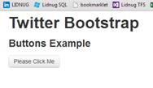
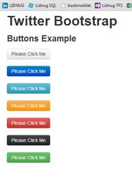
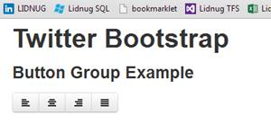
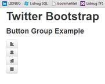
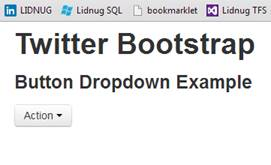
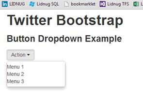
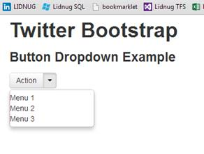

# 六、按钮

就像表单一样，Twitter Bootstrap 有大量的类来帮助你充分利用表单中的按钮。

诚然，类的数量不如表单多，但是您可以使用它们创建的用户界面的丰富性也是惊人的。

不过，在我们开始之前，请注意 TWB 按钮类只设计用于两种不同类型的标签:<button>标签和</button>

如果您正在创建旨在执行整个页面导航的按钮，那么您应该努力使用锚点标签来提供功能。

当你用按钮类设计你所有的元素时，你所有的按钮和锚点看起来都是一样的，很难记住哪个元素在哪里。

我相信我们中的任何人最不想看到的事情就是在一张桌子上设计一个带有锚点标签的删除按钮，然后惊恐地看着网络蜘蛛删除我们数据库中的每一条记录，因为它试图跟踪下面的链接。

我可以写一整章关于幂等性的陷阱，但是我会把它留给已经存在于 Syncfusion 库中的 HTTP 简洁书。

那么，我们如何把一个按钮或锚元素变成一个推特 Bootstrap 按钮呢？就像框架中的其他东西一样，我们添加了一个类。在这种情况下，要添加的主类是“btn”。

开始一个新的模板文档，并向其中添加以下主体代码:

```html
    <div class="container-fluid">
    <div class="row-fluid">
    <h1>Twitter Bootstrap</h1>
    <h3>Buttons Example</h3>
    <button class="btn">Please Click Me</button>
    </div>
    </div>

```

代码示例 18:基本的推特 Bootstrap 按钮

如果一切顺利，您应该会在浏览器中看到以下内容:



图 39:基本的推特 Bootstrap 按钮

和 TWB 的其他东西一样，您也可以应用一组一致的样式作为可选的样式类来添加到您的按钮中。

在代码示例 17 中您放入新文档的按钮标签下添加以下额外按钮(是的，我知道我用“
”标签隔开了一些东西，但是嘿，这只是一个示例):

```html
    <br /><br /><button class="btn btn-primary">Please Click Me</button>
    <br /><br /><button class="btn btn-info">Please Click Me</button>
    <br /><br /><button class="btn btn-warning">Please Click Me</button>
    <br /><br /><button class="btn btn-danger">Please Click Me</button>
    <br /><br /><button class="btn btn-inverse">Please Click Me</button>
    <br /><br /><button class="btn btn-success">Please Click Me</button>

```

如果您保存并刷新页面，您应该会看到:



图 40:推特 Bootstrap 基本按钮样式

对我来说，描述按钮风格，或者至少是背后的想法的最好方法，就是使用推特 Bootstrap 文档中的信息。

它们中的大多数都有类似于你之前看到的类的目的；但是，命名有点不同。

*   btn-primary:通常为强蓝色，旨在突出默认操作。
*   btn-info: Aqua，用作默认样式的替代。
*   btn-success:绿色，表示成功或积极的行动。
*   BTN-警告:黄色，表示该操作应小心。
*   BTN-危险:红色，表示危险或潜在的负面行为。
*   BTN-reverse:交替的深灰色按钮，不与语义动作或使用绑定。

使用这些按钮样式时需要注意的一点是(TWB 的作者在文档中也提到了这一点)，Internet Explorer 9 没有正确应用这些样式来呈现按钮。

背景渐变没有出现在圆角上，文本有一个作者无法修复的灰色阴影。从我自己的角度来看，我不能说这个问题是否已经在第 3 版中得到解决，因为正如前面提到的，我仍然需要处理这些差异。

但是，我可以确认，在 Internet Explorer 10 和 Firefox 23.0 版本中，按钮示例的呈现和外观都是正确的。

还有一些方便的类来设置按钮的大小，这些大小是相对于其他任何东西的大小的。这些类别是:

*   BTN-大型
*   BTN-默认
*   BTN-小
*   btn 迷你

与上一章中表单组件使用的相对大小一样，您也可以将一类“btn-block”应用于您的按钮；这允许您的按钮展开以用适当的边距填充其父容器，就像块级可选类处理表单输入字段一样。

用以下代码替换 HTML 文件中的正文代码:

```html
    <div class="container-fluid">
    <div class="row-fluid">
    <h1>Twitter Bootstrap</h1>
    <h3>Buttons Example</h3>
    <button class="btn">Please Click Me</button>
    <br /><br /><button class="btn btn-primary btn-large">Please Click Me (Large)</button>
    <br /><br /><button class="btn btn-info btn-default">Please Click Me (Default)</button>
    <br /><br /><button class="btn btn-warning btn-small">Please Click Me (Small)</button>
    <br /><br /><button class="btn btn-danger btn-mini">Please Click Me (Mini)</button>
    <br /><br /><button class="btn btn-inverse btn-small">Please Click Me (Small)</button>
    <br /><br /><button class="btn btn-success btn-block">Please Click Me (Block)</button>
    </div>
    </div>

```

代码示例 19:按钮尺寸

如果一切按预期进行，您应该会看到以下输出:


图 41:按钮尺寸示例

现在，我们所做的只是向上一个示例中已经设置的按钮和样式添加不同的大小调整类。就像 TWB 的一切一样，你可以把各种课程堆叠在一起。我发现迷你尺寸在导航栏中对注销按钮之类的东西特别有帮助；但是，如果您打算使用它们，我强烈建议您也使用“内联”可选类，如表单一章中所见。

按钮也可以通过将“禁用”类名添加到它们的类列表中来显示禁用状态；在客户端 Javascript 中切换这一点是在应用程序前端提供一致且以用户为中心的体验的好方法。

## 图标

默认情况下，Twitter Bootstrap 自带大量图标。这些图标可以在许多不同的地方使用，例如项目符号列表、菜单项和导航项目，但我在这里提到它们，因为大多数人会希望将它们与按钮一起使用。

要使用图标，就像以以下方式劫持原始的*标签一样简单:*

```html
    <i class="icon-heart"></i> icon-heart

```

这一行代码将在文本“图标-心脏”前面显示心脏图标

在按钮中使用它们同样简单。如果您希望按钮上的文本前面有一个图标，请格式化您的按钮，并按如下方式输入锚点标签:

```html
    <button class="btn"><i class="icon-heart"></i> Button Text</button>

```

这应该会给你一些类似的东西:


图 42:带有心形图标的默认按钮

这里提供了大量的图标(太多了，本书无法一一列举)。如果您查看 Bootstrap 文档中的基本 CSS 页面的底部，您会看到它们的备忘单。还有一些额外的替换图标项目可用，如字体 Awesome，旨在用更好看、可扩展的矢量字体版本替换内置图标。它们非常值得一看。

## 按钮组

如果 TWB 所能做的只是让你的纽扣看起来漂亮，那就没有什么理由在上面写一整章了。然而，正如你可能已经猜到的，他们可以做得更多。

你们中的许多人可能都熟悉 Office 风格的工具栏，其中的选项被组合成集合。例如，“左”、“中”和“右”对齐按钮，如下所示:



图 43:推特 Bootstrap 按钮组示例

通过将以下主体代码添加到推荐的 HTML 5 模板中，可以非常容易地实现这一点:

```html
    <div class="container-fluid">
    <div class="row-fluid">
    <h1>Twitter Bootstrap</h1>
    <h3>Button Group Example</h3>
    <div class="btn-group">
    <button type="button" class="btn"><i class="icon-align-left"></i></button>
    <button type="button" class="btn"><i class="icon-align-center"></i></button>
    <button type="button" class="btn"><i class="icon-align-right"></i></button>
    <button type="button" class="btn"><i class="icon-align-justify"></i></button>
    </div>
    </div>
    </div>

```

按钮组纯粹是装饰性的，并不提供额外的功能，以图形方式将按钮显示为一个相关的组。也就是说，它们不维护选项和无线电等的状态。

然而，这并不是说它们不能用于此。但是您必须开始使用 TWB JavaScript API 来使该功能发挥作用。所以，现在，在我们进入使用 TWB 的 JavaScript 特性这一章之前，我先不说这个。

您也可以让按钮组垂直堆叠。如果您将按钮组所在 div 上的类从:

```html
    <div class="btn-group">

```

致:

```html
    <div class="btn-group btn-group-vertical">

```

然后保存并刷新您的页面，您会看到您的按钮组更改为:



图 44:垂直分组按钮示例

在我们继续之前，最后要介绍的是按钮下拉。

## 按钮下拉

推特 Bootstrap 中的任何按钮都可以有一个下拉菜单。但是，要使事情正常运行，您必须执行以下操作:

1.  在你的项目中引用推特 Bootstrap JavaScript 文件。
2.  将您的按钮包装在一个按钮组中(即使只有一个按钮)。
3.  如果您有多个按钮，请使用 btn 工具栏类。

一旦你的 HTML 5 代码结构正确，那么你还需要学习一个新概念，那就是 TWB 对 HTML 5 数据属性的使用。

### 数据什么？

在 HTML 5 下，您可以为元素提供一种新的属性类型，称为数据属性。所有的数据属性都必须以“数据”开始，但是，在此之后，完全由您决定使用它们的目的和方式。

关于这一点，我不打算讲太多细节。但是，如果您在客户端代码中使用一个更流行的库，比如 jQuery(就像 TWB 一样)，您可以使用数据参数向客户端 JavaScript 提供信息，而不必直接接触任何代码。

Twitter Bootstrap 大量使用数据属性(您将在稍后的 JavaScript 章节中看到更多)。但是现在，你需要知道的是“数据切换”属性。

当您使用标准锚点标签创建按钮，然后将此数据属性应用于父锚点时，任何嵌入在通常显示的文本中的

创建一个新的 HTML 5 模板文件，就像我们对本书中所有其他示例所做的那样，并向其中添加以下主体代码:

```html
    <div class="container-fluid">
    <div class="row-fluid">
    <h1>Twitter Bootstrap</h1>
    <h3>Button Dropdown Example</h3>
    <div class="btn-group">
    <a class="btn dropdown-toggle" data-toggle="dropdown" href="#">
    Action
    <span class="caret"></span>
    </a>
    <ul class="dropdown-menu">
    <li>Menu 1</li>
    <li>Menu 2</li>
    <li>Menu 3</li>
    </ul>
    </div>
    </div>
    </div>

```

代码示例 20:基本下拉按钮

保存文件并刷新页面。您应该会看到以下内容:



图 45:基本下拉按钮

如果你点击按钮，你会看到一个菜单，下面显示了三个选项:



图 46:处于点击状态的下拉按钮

到目前为止，我还没有对下面的选项应用任何下拉菜单类，因为当我们在组件一章中讨论导航栏时，我会向您展示更多这样的选项。但是您可以添加可选的类来使填充更好，提供分隔线，并使用我前面介绍的图标类将图标添加到您的菜单项中。

您还可以非常容易地将下拉按钮变成拆分按钮。有什么区别？

好吧，使用拆分按钮，按钮末端的插入符号(或下拉箭头)成为触发按钮菜单的唯一部分。单击主按钮部分实际上会触发该按钮在其 href 中的任何操作(或者如果您使用的是按钮标签，则是表单提交)。

要将代码示例 20 变成拆分按钮，只需将其更改为以下代码:

```html
    <div class="container-fluid">
    <div class="row-fluid">
    <h1>Twitter Bootstrap</h1>
    <h3>Button Dropdown Example</h3>
    <div class="btn-group">
    <button class="btn">Action</button>
    <button class="btn dropdown-toggle" data-toggle="dropdown">
    <span class="caret"></span>
    </button>
    <ul class="dropdown-menu">
    <li>Menu 1</li>
    <li>Menu 2</li>
    <li>Menu 3</li>
    </ul>
    </div>
    </div>
    </div>

```

代码示例 21:带有拆分按钮的下拉按钮

保存并刷新后，结果应该是一个带有下拉菜单的按钮和按钮的分割部分，如下图所示:



图 47:带有拆分示例的下拉按钮

到目前为止，您所看到的所有不同的按钮样式、类别和大小都可以很好地与下拉菜单和按钮组配合使用。此外，如果您在前面的下拉列表示例中将可选的额外类“下拉”添加到父按钮组中，您可以使下拉菜单出现在按钮上方而不是下方。

我已经在工具套件中成功地使用了这些技术，比如淘汰赛. js，实际上我已经获得了不同的菜单选项来改变淘汰赛视图模型中拆分按钮的行为。

它们在数据编辑网格等地方非常有用，在这些地方，您可以将父按钮更改为“编辑”、“删除”、“禁用”等。，值，然后只需将编辑命令组合在一起，即可轻松导航数据库管理操作。

在下一章中，我们将查看各种其他的 Twitter Bootstrap 组件，并开始深入研究框架中由正确结构化的元素集和 JavaScript 功能构建的那些部分。