# 七、组件

如果你在阅读这本书的时候一直在阅读 Twitter Bootstrap 文档，你无疑会看到主菜单有一个名为组件的部分。

我个人认为，TWB 团队在这里提供的分离有点误导，因为你可以在多个菜单中找到关于多个事物的部分。

例如，按钮大多列在基本 CSS 部分下，但是按钮组在组件中，单选/复选框组在 JavaScript 中。

然而，我对此的全部理解是，Twitter Bootstrap 中的一个组件不仅仅是在元素中添加一个简单的类，以某种方式对其进行样式化。组件是从以特定方式组合在一起的元素集合中创建的，并使用特定的类序列来生成最终的复合产品。

也就是说，文档中组件部分下列出的一些功能只需添加一个类即可启用，标签、徽章和进度条等元素都属于这个类别。

不管怎样，辩论够了。让我们从下拉菜单开始这一章。

## 下拉菜单

一个基本的下拉菜单是使用一个标准的、无序的列表元素产生的，类“下拉菜单”应用于它，如下所示:

```html
    <ul class="dropdown-menu">
    <li><a tabindex="-1" href="#">Menu 1</a></li>
    <li><a tabindex="-1" href="#">Menu 2</a></li>
    <li><a tabindex="-1" href="#">Menu 3</a></li>
    <li class="divider"></li>
    <li><a tabindex="-1" href="#">Menu 4</a></li>
    </ul>

```

但是，由于下拉的工作方式，您需要另一个元素来触发它弹出。你在上一章看到了一个带有下拉按钮的例子。

要将刚才看到的代码更改为格式正确的下拉列表，我们需要将整个 UL 包装在一个 div 或其他标记有“dropdown”类的容器中，然后在该 div 中，我们需要添加一个元素作为菜单触发器，如下所示:

```html
    <div class="dropdown">
    <!-- Trigger element, a button, text, etc. goes here -->
    <ul class="dropdown-menu">
    <li><a tabindex="-1" href="#">Menu 1</a></li>
    <li><a tabindex="-1" href="#">Menu 2</a></li>
    <li><a tabindex="-1" href="#">Menu 3</a></li>
    <li class="divider"></li>
    <li><a tabindex="-1" href="#">Menu 4</a></li>
    </ul>
    </div>

```

最后一个示例中的注释部分显示了添加触发器元素的位置，在大多数情况下，触发器元素通常是一个简单的链接或按钮元素。但是它也可以很容易地成为一个 div 样式，或者一个标准的标题标签。重要的是元素被标记了正确的类和数据属性，以使它触发下拉菜单并在屏幕上显示。

按照您在本书中所使用的方式创建一个新的模板文件，然后添加以下主体代码:

```html
    <div class="container-fluid">
    <div class="row-fluid">
    <h1>Twitter Bootstrap</h1>
    <h3>Dropdown Menu Example</h3>
    <div class="dropdown">
    <button class="btn dropdown-toggle" data-toggle="dropdown">Menu</button>
    <ul class="dropdown-menu">
    <li><a tabindex="-1" href="#">Menu 1</a></li>
    <li><a tabindex="-1" href="#">Menu 2</a></li>
    <li><a tabindex="-1" href="#">Menu 3</a></li>
    <li class="divider"></li>
    <li><a tabindex="-1" href="#">Menu 4</a></li>
    </ul>
    </div>
    </div>
    </div>

```

代码示例 22:下拉菜单

保存文件并在浏览器中呈现后，您将看到类似于上一章中创建的第一个下拉按钮的内容。但是，如果您现在单击按钮并允许菜单显示，您应该会看到如下内容:

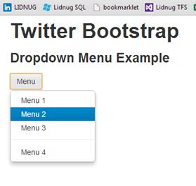

图 48:推特 Bootstrap 弹出菜单示例

立即，您应该能够看到菜单后面有一个阴影，一个垂直分隔线，适当的填充和格式，以及当您将鼠标光标悬停在菜单项上时菜单项的高亮显示。

我们还可以通过将“禁用”类与该选项的

*   Element to provide a disabled appearance for menu items on the menu.

如果我们现在从下面更改菜单 2 的列表项元素:

```html
    <li><a tabindex="-1" href="#">Menu 2</a></li>

```

致:

```html
    <li class="disabled"><a tabindex="-1" href="#">Menu 2</a></li>

```

然后保存并刷新页面，我们现在应该看到，当弹出菜单时，选项 2 现在被禁用:

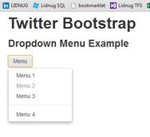

图 49:禁用菜单项的下拉菜单

您还可以看到，当您将鼠标悬停在禁用的选项上时，高亮条和其他类似效果不会出现，并且您无法单击该选项来选择它。

### 子菜单

您也可以在 TWB 下拉菜单中嵌套和级联子菜单，只需嵌套一个

```html
    <div class="container-fluid">
    <div class="row-fluid">
    <h1>Twitter Bootstrap</h1>
    <h3>Dropdown Sub Menu Example</h3>
    <div class="dropdown">
    <button class="btn dropdown-toggle" data-toggle="dropdown">Menu</button>
    <ul class="dropdown-menu">
    <li><a tabindex="-1" href="#">Menu 1</a></li>
    <li><a tabindex="-1" href="#">Menu 2</a></li>
    <li><a tabindex="-1" href="#">Menu 3</a></li>
    <li class="divider"></li>
    <li class="dropdown-submenu">
    <a tabindex="-1" href="#">Sub Menu</a>
    <ul class="dropdown-menu">
    <li><a tabindex="-1" href="#">Sub Menu 1</a></li>
    <li><a tabindex="-1" href="#">Sub Menu 2</a></li>
    <li><a tabindex="-1" href="#">Sub Menu 3</a></li>
    </ul>
    </li>
    </ul>
    </div>
    </div>
    </div>

```

代码示例 23:嵌套子菜单示例

如果您将下拉页面中的主体代码更改为代码示例 22 中的代码，然后保存并刷新页面，您应该能够展开菜单和子菜单，如下图所示:


图 50:带有子菜单的下拉菜单示例

## 导航组件

我猜你们大多数人都在等这本书的这一部分。我为什么这么说？嗯，当我第一次开始使用 Twitter Bootstrap 时，我几乎立刻就被它漂亮的导航栏吸引住了。

然而，导航条只是 TWB 提供的众多导航辅助工具中的一个，它帮助你的应用程序中的导航更像一个一流的公民。

有标签类、药丸类、链接列表类、辅助菜单类等等。

所提供的大部分功能和您目前所看到的其他功能一样易于使用。

在我们深入研究之前需要注意的一点是，几乎所有 TWB 的导航辅助工具都是基于使用标准的 UL/LI 标签创建链接列表(就像上一节中的下拉菜单一样)。因此，嵌套和正确的标签顺序是必须的，因为如果您在某些地方错过了结束标签，您将会得到一些非常奇怪的副作用。

### 选项卡

标签就是标签，没什么特别的，也没什么复杂的。简单、优雅但功能非常强大的选项卡允许您将单个屏幕分成多个页面。

有两个主要的类你需要知道:“导航”和“导航标签”另一个你会反复使用的类是“活动的”这在以下选项卡集中进行了说明:

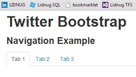

图 51:基本选项卡导航示例

使用以下代码创建它们:

```html
    <div class="container-fluid">
    <div class="row-fluid">
    <h1>Twitter Bootstrap</h1>
    <h3>Navigation Example</h3>
    <ul class="nav nav-tabs">
    <li class="active">
    <a href="#">Tab 1</a>
    </li>
    <li><a href="#">Tab 2</a></li>
    <li><a href="#">Tab 3</a></li>
    </ul>
    </div>
    </div>

```

代码示例 24:基本选项卡代码

使用标签并不止于此。您可以将它们完全绑定在一起，提供完整的分页内容设置，而不仅仅是将它们用作导航辅助，当正确链接时，您将看到标签栏实际上为您更改了页面，而无需任何额外的 JavaScript 或其他通常与交换标签面板相关的处理代码。

然而，要创建一整套选项卡式页面，您需要遵守几条规则:

1.  父标签栏中的每个 LI 标签必须有一个 href，该 href 引用一个包含其内容的 div 标识。
2.  每个包含页面内容的分区都必须有一个唯一的标识，可以通过标签栏看到。
3.  每个有内容的 div 必须紧跟在包含标签栏的

4.  内容 div 的集合必须包装在紧接在

还要注意，每个单独的选项卡内容 div 都应用了类“选项卡窗格”，默认情况下，第一个选项卡有一个“活动”类，以匹配实际选项卡栏本身中选定的“活动”类。

一旦您设置了所需的结构，应用了正确的类，并且所有的标识都匹配，您需要确保的最后一件事就是您的列表项中的每个锚点标签都有数据切换属性。这是为了让 TWB JavaScript 知道如何为你切换标签。

开始一个新的模板文档，并向其中添加以下主体代码:

```html
    <div class="container-fluid">
    <div class="row-fluid">
    <h1>Twitter Bootstrap</h1>
    <h3>Tab Page Example</h3>
    <div class="tabbable">
    <ul class="nav nav-tabs">
    <li class="active"><a href="#tab1" data-toggle="tab">Tab 1</a></li>
    <li><a href="#tab2" data-toggle="tab">Tab 2</a></li>
    </ul>
    <div class="tab-content">
    <div class="tab-pane active" id="tab1">
    <p>This is the page content for Tab Page 1</p>
    </div>
    <div class="tab-pane" id="tab2">
    <p>This is the page content for Tab Page 2</p>
    </div>
    </div>
    </div>
    </div>
    </div>

```

代码示例 25:标签页示例

将页面保存并加载到浏览器中。渲染时，您应该会发现以下内容:

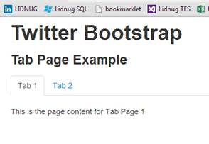

图 52:选项卡页面示例

如果你点击第二个标签，你会发现内容会变成第二个标签中的任何内容。您还应该看到活动类以同样的方式更新:

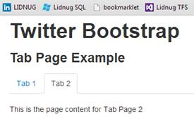

图 53:选项卡页面示例显示第二个选项卡

通过将“淡入淡出”类包含到任何应用了“标签窗格”的 div 中，标签页也可以在切换时淡入淡出。

最后，标签不仅仅局限于沿着内容的顶部显示。在主父 div 元素(包含类“tabbable”的元素)上，您可以添加以下任何一项来更改选项卡的位置:

*   标签-下方:将标签放置在内容下方。
*   制表符-左侧:将制表符放在内容的左侧。
*   制表符-右:将制表符放在内容的右侧。

然而，我将把这些实验留给读者作为练习。

### 药丸

药丸非常像标签，以完全相同的方式和相同的结构创建。唯一不同的是，药丸看起来像小而圆的矩形，而不是页面标签，它们使用不同的类“导航药丸”，而不是我们在前面的例子中使用的“导航标签”。

如果您返回代码示例 25 并更改行:

```html
    <ul class="nav nav-tabs">

```

致:

```html
    <ul class="nav nav-pills">

```

然后在浏览器中保存并刷新页面，您应该会看到示例更改如下:

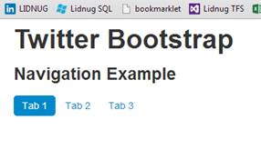

图 54:药丸导航示例

在我们结束标签和药丸之前，我们还可以添加“禁用”类，就像我们在其他地方将标签或药丸标记为禁用一样。我们可以使用工具类“向左拉”和“向右拉”来将标签和药丸向左或向右对齐。最后，我们还可以将“nav-stacked”类添加到保存每个列表的父级


图 55:堆叠选项卡示例


图 56:堆叠药丸示例

您会注意到，您也为每个条目获得了适当的悬停效果。

在我们继续之前，请注意，正如下拉菜单一节中所描述的，当标签和药丸被放置在正确的结构中并且应用了正确的数据切换时，它们都可以作为下拉菜单的触发目标。

### 导航列表

导航列表是为侧栏和其他类似情况设计的，非常容易构建。

你只需要创建一个标准的、无序的列表元素，然后将类“nav”和“nav-list”添加到父

就像药丸和导航列表一样，你也可以给单个

*   Items add an "activity" class to show which items should be marked as current activity items.

您也可以在列表项上添加“导航标题”类。这样做会给项目一个稍微不同的风格，但重要的是，将从悬停效果和其他项目将使用的选择点击中移除它。在某些方面，这类似于给一个项目添加一个“禁用”类，它会像其他导航工具一样，将该项目标记为不可选择。然而，导航标题略有不同；这个想法是，你使用一个导航标题项来分隔你的侧边栏菜单中的相关功能组，这样你就可以维护一个逻辑结构。

您也可以用“分隔线”类标记一个项目，以水平分隔线的形式显示该项目(与您在下拉菜单中添加分隔线的方式相同)。

启动一个新模板，并向其中添加以下主体代码:

```html
    <div class="container-fluid">
    <div class="row-fluid">
    <h1>Twitter Bootstrap</h1>
    <h3>Navigation List Example</h3>
    <div class="span2">
    <ul class="nav nav-list">
    <li class="nav-header">Pages</li>
    <li class="active"><a href="#">Home</a></li>
    <li><a href="#">Profile</a></li>
    <li><a href="#">Settings</a></li>
    <li class="nav-header">Library</li>
    <li><a href="#">E-books</a></li>
    <li><a href="#">Paper books</a></li>
    <li class="divider"></li>
    <li><a href="#">Borrower List</a></li>
    </ul>
    </div>
    </div>
    </div>

```

代码示例 26:导航列表

保存并将其加载到浏览器中，您应该会得到如下内容:

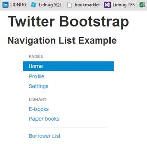

图 57:导航列表示例

从代码示例 26 中的代码中可以看到，我们已经将整个事情包装在基于 span2 的脚手架元素中。没有它，所有的东西都会横跨整个页面的宽度。导航列表设计为块级垂直列表，用于创建静态菜单。

### 导航栏

现在，我们来看看 Twitter Bootstrap 最令人印象深刻的特性之一:不起眼的导航栏。

TWB 的导航栏功能使得在网站和页面顶部创建菜单栏变得非常容易，简直像变魔术一样。

就像前面所有的导航辅助工具一样，两个 div、一个 ul 和一两个锚点标签是在页面顶部创建一个样式精美、功能齐全的导航栏的全部要素。

再添加一些组件和可选类，您就可以创建嵌入了登录和搜索表单的导航栏、带有下拉菜单的导航栏以及许多其他组合；极限在于你的想象力。

你也可以把你的条钉在页面的顶部或底部，使它流畅或固定，和网格类一起使用，等等。

创建一个新的模板文件，并添加以下主体代码:

```html
    <div class="container-fluid">
    <div class="row-fluid">
    <h1>Twitter Bootstrap</h1>
    <h3>Navigation Bar Example</h3>
    <div class="navbar">
    <div class="navbar-inner">
    <a class="brand" href="#">My Application</a>
    <ul class="nav">
    <li class="active"><a href="#">Menu 1</a></li>
    <li><a href="#">Menu 2</a></li>
    <li><a href="#">Menu 3</a></li>
    <li><a href="#">Menu 4</a></li>
    <li><a href="#">Menu 5</a></li>
    <li><a href="#">Menu 6</a></li>
    </ul>
    </div>
    </div>
    </div>
    </div>

```

代码示例 27:基本导航栏

在浏览器中保存并加载文件，您应该会看到:


图 58:推特 Bootstrap 导航栏示例

仅用 13 行 HTML(其中 6 行是菜单选项本身)，您就创建了一个外观精美的导航栏，与页面上的其他内容对齐。

您可以像在其他导航辅助工具中一样，在菜单项之间添加分隔线。但是，您需要添加一个带有“分隔线垂直”标签的列表项(列表项标签本身中没有其他内容)，而不是仅仅添加一个带有“分隔线”标签的列表项。

如果要向导航栏添加表单，可以使用以下代码示例:

```html
    <form class="navbar-form pull-right">
    <input type="text" class="span4" placeholder="User Name">
    <input type="text" class="span4" placeholder="Password">
    <button type="submit" class="btn">Login</button>
    </form>

```

代码示例 28:导航栏表单

请注意，我只显示所需的表单项，而不是完整的菜单结构。如果您在代码示例 26 中插入这个，就在最后一个之后但在标记之前，您应该会看到类似如下的内容:


图 59:带有内嵌表单示例的导航栏

以类似的方式，您可以将“navbar-form”类更改为“navbar-search”或“navbar-query”类，并获得一个搜索表单(如“表单”一章中所示)，该表单将使用专家样式对表单输入进行样式化，以使它们更圆和更像搜索框。

如果你想添加下拉菜单，你所需要做的就是用你之前看到的同样的标记以适当的嵌套方式标记你的基于

在第一个无序列表之后，但在创建内联登录表单的打开表单标记之前，将以下无序列表添加到菜单示例中:

```html
    <ul class="nav">
    <li class="dropdown">
    <a href="#" class="dropdown-toggle" data-toggle="dropdown">
    Options
    <b class="caret"></b>
    </a>
    <ul class="dropdown-menu">
    <li><a href="#">Option menu 1</a></li>
    <li><a href="#">Option menu 2</a></li>
    <li><a href="#">Option menu 3</a></li>
    </ul>
    </li>
    </ul>

```

代码示例 29:导航栏的下拉按钮

在浏览器中保存并刷新页面。如果您在正确的位置添加了下拉菜单，您应该会看到一个新的菜单选项出现，旁边有一个下拉箭头。单击该选项会导致菜单下拉到下面:


图 60:带有下拉菜单的导航栏

如果您想向导航栏添加简单的文本，只需在代码的适当位置创建一个段落标记，就像我们对其他元素所做的那样。然后，向元素中添加一类“navbar-text”，并观察一切是否整齐排列。

在我们结束导航栏之前，您可以使用一些额外的可选显示类以不同的方式影响您的导航栏。

第一个是" navbar-fixed-top "类，正如名字所说，它将你的酒吧固定在页面的最顶端。

但是，请注意，这种修复并不是您所期望的。固定顶部导航栏覆盖在任何已经存在的内容上，并被设计为当您向上滚动页面时保持不变，在它们下面滚动的任何内容的顶部设置样式。

这意味着当您的页面向右滚动到顶部时，您可能需要在正文或父页面元素的顶部有一些合适的填充或边距，以便文档的顶部不会在导航栏下面丢失。

在之前创建的导航栏上，将主导航栏父级上的类从:

```html
    <div class="navbar">

```

致:

```html
    <div class="navbar navbar-fixed-top">

```

并刷新页面。

如果一切都像预期的那样出现了，那么你会马上看到菜单是如何遮住页面顶部的。导航栏应该显示如下内容:


图 61:应用了固定顶部的导航栏

与固定顶部可选类相反的是“navbar-fixed-bottom”，正如预期的那样，它将完全相反，并将菜单栏固定在页面底部。

如果您使用类“navbar-static-top”而不是“navbar-fixed-top”，导航栏将保留在页面的顶部，但当页面向上滚动时，它会随着内容一起滚动(而不是像固定的那样覆盖内容并保留在原处)。

### 创建响应导航栏

如果你想创建一个在平板电脑和手机屏幕上正确折叠的导航栏，你需要稍微改变你的 HTML 5 代码的结构，并在中添加一个新的锚点标签来提供折叠图标。

首先要做的是在菜单最外层的两个 div 中添加第三个 div。给它一个“容器”或“容器流体”的类别(与脚手架一章中使用的类别相同)。

一旦你添加了第三个 div，你就需要一个锚点标签，当导航条缩小后，它就可以作为折叠图标。

之后，如果你在你的酒吧有一个品牌元素，并希望它保持显示，简单地把另一个 div 紧接着它。这一次，将一个包含“nav-collapse collapse”的类应用到元素中，然后所有常规的导航栏内容都应该进入这个可折叠的 div。

要将我们目前构建的导航栏转换为可折叠栏，请将模板中的主体代码更改为以下内容:

```html
    <div class="container-fluid">
    <div class="row-fluid">
    <h1>Twitter Bootstrap</h1>
    <h3>Navigation Bar Example</h3>
    <div class="navbar">
    <div class="navbar-inner">
    <div class="container">
    <a class="btn btn-navbar" data-toggle="collapse" data-target=".nav-collapse">
    <span class="icon-bar"></span>
    <span class="icon-bar"></span>
    <span class="icon-bar"></span>
    </a>
    <a class="brand" href="#">My Application</a>
    <div class="nav-collapse collapse">
    <ul class="nav">
    <li class="active"><a href="#">Menu 1</a></li>
    <li><a href="#">Menu 2</a></li>
    <li><a href="#">Menu 3</a></li>
    <li><a href="#">Menu 4</a></li>
    <li><a href="#">Menu 5</a></li>
    <li><a href="#">Menu 6</a></li>
    </ul>
    <ul class="nav">
    <li class="dropdown">
    <a href="#" class="dropdown-toggle" data-toggle="dropdown">
    Options
    <b class="caret"></b>
    </a>
    <ul class="dropdown-menu">
    <li><a href="#">Option menu 1</a></li>
    <li><a href="#">Option menu 2</a></li>
    <li><a href="#">Option menu 3</a></li>
    </ul>
    </li>
    </ul>
    <form class="navbar-form pull-right">
    <input type="text" class="span4" placeholder="User Name">
    <input type="text" class="span4" placeholder="Password">
    <button type="submit" class="btn">Login</button>
    </form>
    </div>
    </div>
    </div>
    </div>
    </div>
    </div>

```

代码示例 30:响应导航栏

正如您在本书中所做的，保存文件并在浏览器中点击重新加载。您应该会看到如下所示的内容:


图 62:响应导航栏示例

您可能会注意到，这与之前的导航栏没有任何不同。但是，如果您现在调整浏览器窗口的大小，或者在屏幕显示尺寸缩小的设备上显示，您应该会看到完全不同的东西。

例如，如果我在 Electric Plum iOS 设备模拟器中显示该页面，这就是我在 iPad 横向模式中获得的结果:

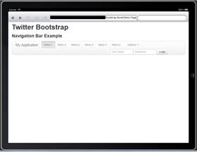

图 63:iPad iOS 设备模拟器中显示的响应导航栏

如果我将模拟器更改为在纵向 iPhone 模式下显示页面，我会得到以下结果:


图 64:iPhone iOS 设备模拟器中显示的响应导航栏

如果我单击现在显示折叠图标，我的菜单将垂直展开，并显示我的菜单项、下拉菜单和登录表单，就像以前一样:

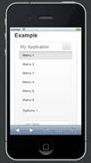

图 65:iPhone iOS 设备模拟器中显示的响应导航栏，菜单处于未折叠状态

为了证明我在桌面上调整浏览器窗口的大小也是如此:

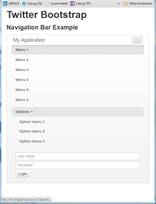

图 66:在调整了大小的桌面浏览器中以未折叠状态显示的响应导航栏

在我们离开导航的东西之前，我将简要地提到我们还没有涉及的两个组件。这些是面包屑和分页链接组件。

如果您曾经在页面顶部看到一条链接路径，显示您在文档中的位置，那么您已经看到了面包屑痕迹。要在 Twitter Bootstrap 中创建面包屑，只需像您已经做的那样创建一个无序列表，然后将一类“面包屑”应用于充当父容器的

对于面包屑，在代表您当前所在页面的链接上设置“活动”类；这将使用灰色标记链接，然后用于区分链接，您可以单击这些链接在页面树中返回。标准面包屑列表如下所示:


图 67:推特 Bootstrap 面包屑组件

分页与我们到目前为止看到的导航辅助有点不同。您不会将该类应用于

标记，如下所示:

```html
    <div class="pagination">
    <ul>
    <li><a href="#">Prev</a></li>
    <li><a href="#">1</a></li>
    <li><a href="#">2</a></li>
    <li><a href="#">3</a></li>
    <li><a href="#">4</a></li>
    <li><a href="#">5</a></li>
    <li><a href="#">Next</a></li>
    </ul>
    </div>

```

代码示例 31:分页列表

这将在浏览器中呈现时产生以下分页栏:


图 68:基本分页示例

与所有其他导航组件一样，有“禁用”和“活动”类可以应用于单个列表项，也有不同的分页大小，可以通过在分页列表周围的 div 元素的类名列表中添加“大分页”、“小分页”或“小分页”来控制。

## 标签和徽章组件

Twitter Bootstrap 包含有用的类，为状态计数和帖子上的重要标签等内容生成格式良好的标签和徽章。

每个类上的颜色使用的命名方案与我们在其他地方看到的相同，如下面的代码示例所示:

```html
    <div class="container-fluid">
    <div class="row-fluid">
    <h1>Twitter Bootstrap</h1>
    <h3>Labels and Badges Example</h3>

    <br />Labels<br />
    <span class="label">Default</span>
    <span class="label label-success">Success</span>
    <span class="label label-warning">Warning</span>
    <span class="label label-important">Important</span>
    <span class="label label-info">Info</span>
    <span class="label label-inverse">Inverse</span>
    <br /><br />Badges<br />
    <span class="badge">1</span>
    <span class="badge badge-success">2</span>
    <span class="badge badge-warning">4</span>
    <span class="badge badge-important">6</span>
    <span class="badge badge-info">8</span>
    <span class="badge badge-inverse">10</span>
    </div>
    </div>

```

代码示例 32:标签和徽章

显示在浏览器中，前面的代码应该如下所示:


图 69:标签和徽章示例

## 英雄单位和页面标题

在组件的排版部分，你会发现有两个元素是为了让你的首页声明脱颖而出而设计的。

两者的设计目的截然不同。我们将从页面标题开始。

如果你回忆一下我们到目前为止在这本书里做过的所有例子，我在它们上面有一个共同的标题。您可以在上面的最后一张图片(图 69)中看到这一点，其中文本在 H1 标签“Twitter Bootstrap”中显示，然后在 H2 标签中显示“标签和徽章示例”

尽管我知道这个页眉组件是可用的，但我故意在书中到目前为止没有使用它，纯粹是为了现在介绍它，并让您更好地了解它的预期用途。

使用它再简单不过了。启动一个新的模板文档，并将以下 HTML 代码添加到您的页面中:

```html
    <div class="container-fluid">
    <div class="row-fluid">
    <h1>Twitter Bootstrap</h1>
    <h3>Page Header Example</h3>
    <div class="page-header">
    <h1>Twitter Bootstrap <small>Page header example</small></h1>
    </div>
    </div>
    </div>

```

代码示例 33:页面标题

如果一切都很好，您应该会看到一个有两个标题的页面，一个是旧样式(我在本书中一直在使用)，看起来应该是这样的:


图 70:旧样式标题

下面的一个使用了新样式的页面标题，应该如下所示:


图 71:新样式标题

如您所见，这很简单，只需将 H1 标签包装在一个 div 中，该 div 应用了类“page-header”。左侧的灰色文本是通过将内容嵌套在嵌套的小标签中创建的；然后整个事情有一个很好的下划线添加到它。

页眉没有可选的类，但它会服从任何 spanX 或它所在的其他网格类，因此您可以根据需要放置内容并调整其大小。

印刷部件的下一个是“英雄单位”

英雄单位深受数字营销爱好者的喜爱。

当你看到这些网页在页面顶部有一个非常大的行动空间，就在任何有用的内容之前，这个大的区域就是 TWB 作者称之为英雄单元的部分:


图 72:英雄单位示例

从图 72 中可以看出，英雄单位是一个块级元素，因此它将会扩展以填充任何可用的空间。

产生上图中英雄单位的代码如下:

```html
    <div class="container-fluid">
    <div class="row-fluid">
    <div class="page-header">
    <h1>Twitter Bootstrap <small>Page header and Hero Unit example</small></h1>
    </div>
    <div class="hero-unit">
    <h1>I am a hero unit</h1>
    <p>and this is my tagline content. This content could be a story summary, or a snippet of useful info, no matter what it is, the idea is that it draws the user in and makes them want to press the button....</p>
    <p>
    <a class="btn btn-primary btn-large">Press This Button</a>
    </p>
    </div>
    </div>
    </div>

```

代码示例 34:英雄单位代码

像页眉一样，英雄单元是一个非常简单的多 HTML 元素设置，没有额外的可选类。

## 缩略图和媒体对象

Twitter Bootstrap 的缩略图组件是为多个图像的网格状显示而设计的，例如图库页面。

然而，实际的组件及其结构实际上非常灵活。而且，由于它使用了脚手架和网格系统，它可以用图像和文本内容创建一些非常平衡的布局。

就像导航组件一样，缩略图组件是使用无序列表创建的，其中嵌套的列表项包含嵌入其中的缩略图。

创建一个新的模板文档，并向其中添加以下 HTML 正文:

```html
    <div class="container-fluid">
    <div class="row-fluid">
    <div class="page-header">
    <h1>Twitter Bootstrap <small>Thumbnails & Media Objects example</small></h1>
    </div>
    <ul class="thumbnails">
    <li class="span4">
    <a href="#" class="thumbnail">
    
    </a>
    </li>
    </ul>
    </div>
    </div>

```

代码示例 36:缩略图

你们中的一些人会注意到，我在那里使用了一个额外的 JavaScript，叫做 holder.js。这不是 Twitter Bootstrap 的官方部分，但是我相信所有 web 开发人员在他们的项目模板中都应该默认使用这个 JavaScript。

您可以添加以下脚本行:

```html
    <script src="js/holder.js" type="text/javascript"></script>

```

除了所有其他脚本之外，在任何需要图像占位符的地方，您只需交换您的普通:

```html
    src="somefile.ext"

```

用于:

```html
    data-src="js/holder.js/300x200"

```

将 300x200 设置为您想要的缩略图大小。如果你愿意，你可以从它在 [GitHub](http://imsky.github.io/holder/) 上的存储库中下载 holder.js，或者使用示例 zip 文件中的副本来搭配这本书。但是，您可以使用任何可用的合适图像。

保存并加载文件后，您应该会看到如下内容:

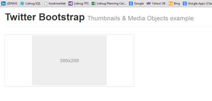

图 73:基本缩略图示例

因为缩略图尊重 Twitter Bootstrap 中的网格系统，所以在上面的代码中添加更多的列表项会按比例调整所有内容的大小，除了按照相同的结构添加一点额外的标记:


图 74:多个缩略图示例

如果您想将其他内容添加到缩略图中，那么您所需要做的就是将锚点标签更改为 div 标签，然后在图像或其占位符后包含内容。

更改缩略图示例中的正文内容，使其看起来如下所示:

```html
    <div class="container-fluid">
    <div class="row-fluid">
    <div class="page-header">
    <h1>Twitter Bootstrap <small>Thumbnails & Media Objects example</small></h1>
    </div>
    <ul class="thumbnails">
    <li class="span4">
    <div class="thumbnail">
    
    <h3>This is a caption</h3>
    <p>and here is a paragraph of text all about our image in the thumbnail above
    </div>
    </li>
    <li class="span4">
    <div class="thumbnail">
    
    <h3>This is a caption</h3>
    <p>and here is a paragraph of text all about our image in the thumbnail above
    </div>
    </li>
    <li class="span4">
    <div class="thumbnail">
    
    <h3>This is a caption</h3>
    <p>and here is a paragraph of text all about our image in the thumbnail above
    </div>
    </li>
    </ul>
    </div>
    </div>

```

代码示例 34:包含额外内容的多个缩略图

保存并刷新，您将看到:


图 75:包含额外内容的多个缩略图

缩略图类还支持另一种称为媒体对象的组件。

媒体对象是为类似列表的显示而设计的，例如推特本身在时间线或博客文章下方的评论列表中使用的对象，每个对象旁边都有一个头像。

但是，与缩略图不同，您不会使用无序列表和列表项来创建缩略图。您可以使用标准 div 创建媒体对象列表，并在需要的地方嵌套。将以下代码添加到您的缩略图示例中，就在持有三个水平缩略图的

```html
    <div class="media">
    <a class="pull-left" href="#">
    
    </a>
    <div class="media-body">
    <h4 class="media-heading">Media heading</h4>
    <p>a paragraph of text to go with the media heading above that's rendered as a h4 tag, this is just a paragraph</p>
    </div>
    </div>

```

保存并渲染页面，您应该会看到媒体对象出现在缩略图的正下方:


图 76:带有媒体对象的缩略图

在第一个的正下方再添加两个，您会看到它们都排成一行，并正确地堆叠在另一个上面:

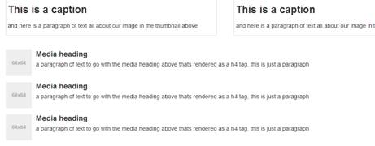

图 77:多个媒体对象

如果您将媒体对象嵌套在父对象的“媒体主体”中，您还会发现它们也可以正确嵌套和缩进:

```html
    <div class="media">
    <a class="pull-left" href="#">
    
    </a>
    <div class="media-body">
    <h4 class="media-heading">Media heading</h4>
    <p>Media Objects paragraph</p>
    <div class="media">
    <a class="pull-left" href="#">
    
    </a>
    <div class="media-body">
    <h4 class="media-heading">Nested Media heading</h4>
    <p>A nested objects paragraph of text</p>
    </div>
    </div>
    </div>
    </div>

```

代码示例 37:嵌套媒体对象

呈现时，它应该显示以下内容:

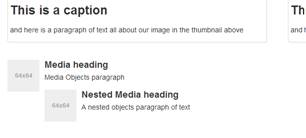

图 78:嵌套媒体对象

## 警报

到目前为止，您已经多次看到，Twitter Bootstrap 为文本、按钮和标签等内容提供了许多标准颜色。

这些标准颜色还扩展到专门用于创建屏幕警报的组件，例如当您删除帖子或在登录对话框中输入不正确的身份验证信息时看到的组件。

TWB 警报是一个块级元素，因此它将拉伸以填充其父元素中的任何可用空间。这意味着可以使用脚手架系统轻松控制尺寸和位置:


图 79:警报示例

图 79 中的图像是使用以下 HTML 5 代码生成的:

```html
    <div class="container-fluid">
    <div class="row-fluid">
    <div class="page-header">
    <h1>Twitter Bootstrap <small>Alerts example</small></h1>
    </div>
    <div class="alert alert-warning">
    <button type="button" class="close" data-dismiss="alert">&times;</button>
    <strong>Warning!</strong> This is a warning alert.
    </div>
    <div class="alert alert-error">
    <button type="button" class="close" data-dismiss="alert">&times;</button>
    <strong>Error!</strong> This is an error alert.
    </div>
    <div class="alert alert-success">
    <button type="button" class="close" data-dismiss="alert">&times;</button>
    <strong>Success!</strong> This is a successful alert.
    </div>
    <div class="alert alert-info">
    <button type="button" class="close" data-dismiss="alert">&times;</button>
    <strong>Info!</strong> This is an info alert.
    </div>
    </div>
    </div>

```

代码示例 38:警报代码

您会注意到，它们的右侧都有一个小的关闭图标，用于关闭警报。这是使用另一种叫做“数据消除”的推特 Bootstrap 神奇数据属性来工作的

在上面的代码中，您感兴趣的行是 alert div 中的任何按钮标签:

```html
    <button type="button" class="close" data-dismiss="alert">&times;</button>

```

我用粗体突出显示了数据消除属性。您将很快在对话部分再次遇到这个问题，但是像 TWB 的任何其他数据属性一样，您需要加载 TWB 主 JavaScript 文件来使它们正确工作。

如果没有该数据属性，该按钮将像常规按钮一样运行，并且不会关闭警报对话框。

如果您将“alert-block”可选类添加到您的 alert div 的类列表中，您将在底部和顶部获得稍大的填充，用于容纳可能在屏幕上停留更长时间的更长消息。

## 进度条

使用以下标记可以非常简单地创建一个基本的蓝色进度条:

```html
    <div class="progress">
    <div class="bar" style="width: 60%;"></div>
    </div>

```

代码示例 39:基本进度条

内部“条”类的宽度表示条应该显示的完成百分比。

如果在模板页面中呈现，您应该会看到以下内容:


图 80:进度条示例

如果将可选类“进度-分条”添加到外部 div，进度条将显示为分条:


图 81:条纹进度条示例

您还可以添加“活动的”可选类，然后使条纹看起来像是动画，这样条就有一些移动。

您还可以通过在 master div 中为多个 div 提供应用于它们的“bar”类来堆叠进度条，如下所示保存“progress”类。更改代码示例 36 中的代码，使其如下所示:

```html
    <div class="progress">
    <div class="bar bar-success" style="width: 35%;"></div>
    <div class="bar bar-warning" style="width: 20%;"></div>
    <div class="bar bar-danger" style="width: 10%;"></div>
    </div>

```

如果将它加载到浏览器中，您应该会看到以下内容:


图 82:堆叠进度条

在上面的例子中有两件事需要注意。首先，所有的百分比值加起来必须是 100%。其次，通过使用我们稍后将看到的一个预先制作的条形颜色类，为每个部分提供不同的颜色。

不过，先给浏览器兼容性提个醒:TWB 进度条类使用 CSS3 渐变来实现你看到的颜色效果，尤其是在条纹条上。

正因为如此，Internet Explorer 7 到 Internet Explorer 9 不会像预期的那样显示东西，旧版的 Firefox 也会出现显示问题。然而，从功能上来说，其他的一切仍然如预期的那样工作。

如果您正在给单个条着色，那么您需要将一个可选的颜色类添加到父进度 div，如下所示:

*   进度信息:标准的蓝色进度条。
*   进度-成功:成功运营的绿色进度条。
*   进度警告:黄色进度条，用于警告操作。
*   进度-危险:为危险操作设计的红色进度条。

## 所有其他

到目前为止，我们已经在这一部分介绍了大量的样式和组件，然而，这里还有更多。

如果你想让某样东西出现在一个有阴影的井中，你可以在一个块级元素上使用“井”类，比如边栏。您也可以通过使用“大”和“小”来控制内容周围的填充量。

还有很多实用类，其中一些你已经见过了，比如“左拉”和“右拉”来浮动东西。

还有“clearfix”类，当您想要重置文档流时，可以使用它来清除浮动。

您也可以使用`标签来显示您想要显示为与其他文本段落内联的计算机代码的文本。`

在下一章中，我们将了解框架中可用的一些 JavaScript 驱动的特性。