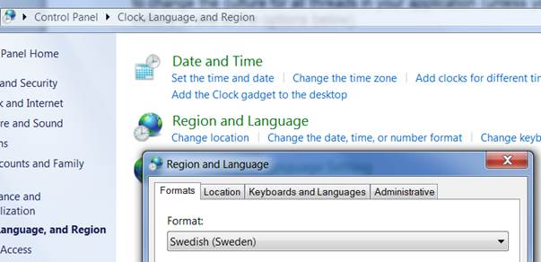
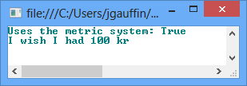

# 第一章从本地化开始

每种口语在日期、货币和数字方面都有自己的格式规则。规则各不相同，从日期的打印方式到数字的千位分隔符。对于同一种语言，这些规则也可能有所不同，但会因国家而异。

本地化是关于格式化我们以用户熟悉的方式呈现的所有信息。对我们来说值得庆幸的是，这些规则中的大多数已经被捕获并在。NET 和 JavaScript 插件全球化。

所有不包含方法的代码示例都必须放在一个方法中，例如放在新的控制台项目中。您还必须向`System.Globalization`添加一个使用。

## 文化

为了能够控制如何格式化信息，我们必须有一些方法来表示我们的目标语言和国家。在大多数编程语言中，这种标识是通过称为区域性代码的字符串来进行的。

区域性代码本身由下划线或冒号分隔的两部分组成。实际分隔符因编程语言而异。字符串可以是“sv-FI”，表示在芬兰使用的瑞典语，也可以是在美国使用的英语“en-US”。

代码的第一部分是在 [ISO639](http://en.wikipedia.org/wiki/ISO_639) 定义的代码之一，国家代码是在 [ISO3166](http://en.wikipedia.org/wiki/ISO_3166) 定义的。实际组合在 [RFC4646](http://tools.ietf.org/html/rfc4646) 中定义，这是一份 59 页长的文件。

### 中性培养

中性区域性用于以通用的方式为语言格式化字符串，这意味着它不采用特定国家的格式，而是采用通用语言的格式。

中性文化由省略国家的字符串标识。比如“en”而不是“en-US”。

### 不变培养

我更喜欢将不变区域性视为编码区域性。它格式化字符串和数字，就像我们在代码中编写它们一样。例如，没有数字分组，用点作为十进制分隔符。

因此，如果您必须将信息存储为字符串，这也是一种很好的格式，因为文化永远不会改变。

## 。网

大多数语言/文化的处理。NET 由一个名为`CultureInfo`的类控制。它定义了要使用的语言，以及像数字和日期这样的东西应该如何格式化。用于本地化的所有类都在该命名空间中提供。

。NET 包含一组内置组合，您可以在没有任何额外配置的情况下使用。这些在下面的 [MSDN 篇](http://msdn.microsoft.com/en-us/goglobal/bb896001.aspx)中有定义。链接的文章不包括 Windows 8，但所有代码也在 Windows 8 中工作。您也可以使用`CultureAndRegionInfoBuilder`生成自己的文化。

. NET 中存在两种不同的区域性。第一种称为 UICulture，它控制用户界面应该以哪种语言呈现。另一个叫做 Culture，它控制字符串和数字的格式。它们都是使用`Thread.CurrentThread.CurrentCulture`和`Thread.CurrentThread.CurrentUICulture`类通过当前线程设置的。

### 用户界面文化

默认情况下，此区域性设置为反映已安装的操作系统语言，即所有字符串使用的语言(例如，在窗口的“开始”菜单中，如下图所示)。


图 1:操作系统语言

### 文化的“格式化”

还有另一种区域性设置，表示日期、字符串、货币等的格式。除非您指定了一个值，否则默认情况下，它与 Windows 中的设置相同，如下图所示。



图 2:更改区域格式

您可以像这样分配一种新的文化:

```cs
   static void Main(string[] args)
   {
       Thread.CurrentThread.CurrentCulture = new CultureInfo("sv-SE");
       Thread.CurrentThread.CurrentCulture = new CultureInfo(1053); //Swedish locale name
  }

```

有两个快捷方式可用于访问区域性设置。它们提供对区域性设置的只读访问。

```cs
   static void Main(string[] args)
   {
       Thread.CurrentThread.CurrentCulture = new CultureInfo("sv-SE");
       Console.WriteLine(CultureInfo.CurrentCulture.Name); // Prints "sv-SE"
    }

```

### 操作系统文化

您还可以访问安装操作系统的区域性。该物业名称为`CultureInfo.InstalledUICulture.`

### 使用不变区域性进行格式化

要使用不变区域性进行格式化，只需将其传递给`ToString()`方法:

```cs
   static void Main(string[] args)
   {
       var number = 22.30;
       number.ToString(CultureInfo.InvariantCulture);
       Console.WriteLine(number); // Prints "22.30"
       Console.ReadLine();
   }

```

### 区域资讯

。NET 还包含一个名为`RegionInfo`的类，提供一个国家的信息。例如，您可以使用它来获取当前货币符号或确定是否使用公制:

```cs
   static void Main(string[] args)
   {
       var info = new RegionInfo("sv-SE");
       Console.WriteLine("Uses the metric system: {0}", info.IsMetric);
       Console.WriteLine("I wish I had 100 {0}", info.CurrencySymbol);

   }

```



图 3:结果表单代码示例

## JavaScript

JavaScript 支持基本的格式化和解析。但就是这样:基本。例如，您无法控制应该使用短格式还是长格式，也无法控制要包含多少小数。

因此，我将在所有代码示例中使用全球化插件，在这些示例中，普通的 JavaScript 是不够的。

### 发现文化

您可以使用客户端来指定要使用的区域性。这通常是在“*接受-语言*”标题的帮助下完成的。它包含用户理解的语言，按照他/她喜欢的顺序排列。下图显示了标题的示例。


图 4:接受语言标题

设置本身是通过您的 web 浏览器设置指定的。由于 Internet Explorer 是使用 Windows 中的区域设置配置的，所以我包含了一个谷歌 Chrome 的示例。您可以在“高级”下找到谷歌浏览器的设置，如下图所示:


图 5: Chrome 区域设置

要访问该设置，您可以在 JavaScript 中使用`window.navigator.language`。然而，工业工程中不存在这种属性。相反，您必须将其与 IE 属性结合，如下所示:

```cs
    var language = window.navigator.userLanguage || window.navigator.language;

```

请注意，IE 属性不返回浏览器语言，而是返回 IE 或 Windows 控制面板中指定的语言(这取决于 IE 版本)。

### JavaScript 方法

JavaScript 有几个函数可以用来本地化字符串，比如`toLocaleString`和`toLocaleDateString`。但是，支持因浏览器而异。您只能期望浏览器使用安装浏览器的区域性进行格式化(或者在最坏的情况下使用操作系统区域性)。

请注意，有些方法确实允许您将区域性指定为参数，并且支持可能会随着时间的推移而改进。

因此，我将向您展示使用这些方法的 JS 示例，但也使用下面的替代方法。

### 全球化

Globalize 是一个 JavaScript 插件，它对不同的文化和各种格式都有很好的支持。

这是一个由 jQuery 基金会维护的开源库。然而，库本身是独立的，不依赖于 jQuery。

要使用全球化，我们必须在 HTML 标题中包含脚本本身:

```cs
   <script src="http://ajax.aspnetcdn.com/ajax/globalize/0.1.1
   /globalize.min.js"></script>

```

但是，该脚本只包含所有的处理。我们还必须包括为每个特定国家/语言定义所有规则的文化。我们可以只包含我们需要的文化，或者使用包含所有文化的脚本:

```cs
    <script src="http://ajax.aspnetcdn.com/ajax/globalize/0.1.1/cultures
    /globalize.cultures.js"></script>
    To switch culture using Globalize we can either change by globally setting the culture:
   Globalize.culture("se-SE");

```

但是我们也可以在我们调用的每个方法中指定区域性:

```cs
   <script type="text/javascript">
       // Says that we want to parse the string as Swedish
       var result = Globalize.parseFloat("1234,56", 10, "sv-SE");

       // output using the default culture (i.e. en-US)
       document.writeln(Globalize.format(result, "n2"));
   </script>

```

结果如下图所示。


图 6:数字输出

全球化可在 [github](https://github.com/jquery/globalize) 获得。

## 总结

本章的目标是向您介绍控制. NET 中语言和格式的设置

这些设置的效果将在本书中讨论。

你可以在 [MSDN](http://msdn.microsoft.com/en-us/library/system.globalization.cultureinfo(v=vs.100).aspx) 阅读更多**文化信息**。