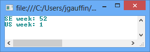
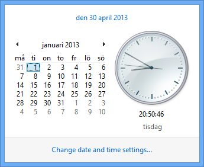
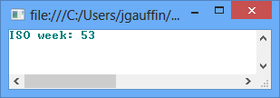

# 三、周数

周数很复杂，因为有不同的方法来计算它是哪一周。国际标准化组织周总是从星期一开始。一年中的第一周或者通过寻找 1 月 1 日来计算，或者通过寻找包括 1 月 4 日<sup>在内的一周</sup>来计算。

2013 年第一周从今年 12 月 31 日 <sup>st</sup> 开始，而前年 1 月 2 日 <sup>nd</sup> 开始。但是如果你遵循下面瑞典日历中显示的国际标准化组织规范。


图 16:瑞典日历

在美国，(几个国家)一周从周日开始，一年的第一周从 1 月 1 日开始。


图 17:美国日历

## 。网

要获得一年中的某一周，只需调用:

```cs
   using System.Globalization;
   using System.Threading;

   class Program
   {
       static void Main(string[] args)
       {
           var theDate = new DateTime(2012, 1, 1);

           Thread.CurrentThread.CurrentCulture = new CultureInfo("sv-SE");
           var calendar = CultureInfo.CurrentCulture.Calendar;
           var formatRules = CultureInfo.CurrentCulture.DateTimeFormat;
           var week = calendar.GetWeekOfYear(theDate, formatRules.CalendarWeekRule, formatRules.FirstDayOfWeek);
           Console.WriteLine("SE week: " + week);

           Thread.CurrentThread.CurrentCulture = new CultureInfo("en-US");
           calendar = CultureInfo.CurrentCulture.Calendar;
           formatRules = CultureInfo.CurrentCulture.DateTimeFormat;
           week = calendar.GetWeekOfYear(theDate, formatRules.CalendarWeekRule, formatRules.FirstDayOfWeek);
           Console.WriteLine("US week: " + week);

           Console.ReadLine();
       }
   }

```

输出如下:



图 18:一年中第一周的不同周数

### 一年中的第一周小虫

但是，如果我们在 Windows 中检查日历，它将显示 2013 年 1 月的以下内容:



图 19:周 bug

根据国际标准化组织的定义，12 月的第 31 <sup>日</sup>应该是 2013 年第 1 周的一部分。让我们用一些代码来证明这一点:

```cs
   using System.Globalization;
   using System.Threading;

   class Program
   {
       static void Main(string[] args)
       {
           var theDate = new DateTime(2013, 12, 31);

           var calendar = CultureInfo.CurrentCulture.Calendar;
           var week = calendar.GetWeekOfYear(theDate, CalendarWeekRule.FirstFourDayWeek, DayOfWeek.Monday);
           Console.WriteLine("ISO week: " + week);

           Console.ReadLine();
        }
    }

```

结果如下:



图 20:国际标准化组织周数

这是我发现的唯一例外。如果您尝试 1 月 6 日<sup xmlns:epub="http://www.idpf.org/2007/ops">将显示第 1 周，1 月 7 日<sup xmlns:epub="http://www.idpf.org/2007/ops">将显示第 2 周。</sup></sup>

## JavaScript

JavaScript 和 Globalize 都没有获取周数的方法。有几个脚本可以做到这一点。这是我在 stackoverflow.com 找到的一个。

```cs
   /* For a given date, get the ISO week number
       *
       * Based on information at:
       *
       * http://www.merlyn.demon.co.uk/weekcalc.htm#WNR
       *
       * Algorithm is to find nearest thursday, it's year
       * is the year of the week number. Then get weeks
       * between that date and the first day of that year.
       *
       * Note that dates in one year can be weeks of previous
       * or next year, overlap is up to 3 days.
       *
       * e.g. 2014/12/29 is Monday in week 1 of 2015
       * 2012/1/1 is Sunday in week 52 of 2011
       */
   function getWeekNumber(d) {
       // Copy date so don't modify original
       d = new Date(d);
       d.setHours(0, 0, 0);
       // Set to nearest Thursday: current date + 4 - current day number
       // Make Sunday's day number 7
       d.setDate(d.getDate() + 4 - (d.getDay() || 7));
       // Get first day of year
       var yearStart = new Date(d.getFullYear(), 0, 1);
       // Calculate full weeks to nearest Thursday
       var weekNo = Math.ceil((((d - yearStart) / 86400000) + 1) / 7)
       // Return array of year and week number
       return [d.getFullYear(), weekNo];
    }

```

你可以这样使用它:

```cs
   var d = new Date();
   document.writeln(getWeekNumber(d));

```

但是，我更喜欢用方法来扩展日期对象。

```cs
   Date.prototype.getWeekNumber = function()
   {
   // the code here
   }

```

这使我们能够:

```cs
   document.writeln(d.getWeek());

```