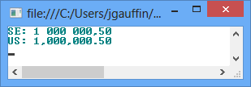
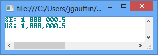
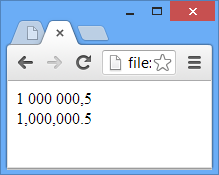
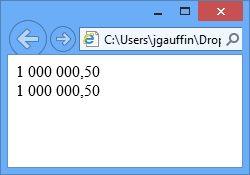
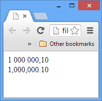

# 第五章数字

乍一看，不同文化的数字似乎是一样的。但是当涉及到分隔符和分组时，它们确实有所不同。

一百万个逗号五十在瑞典是“10000000，50”，而在美国是“1000000.50”。

## 。网

其中，在。NET 我们使用`ToString()`方法进行格式化。我建议您尝试使用内置的格式化程序，而不是手动定义分组等。

让我们打印 150 万份:

```cs
   var se = new CultureInfo("sv-SE");
   var us = new CultureInfo("en-US");
   var number = 1000000.5;

   Console.WriteLine("SE: {0}", number.ToString("N", se));
   Console.WriteLine("US: {0}", number.ToString("N", us));

```

结果如下:



图 32:数字输出

您可以通过手动指定分组来完成相同的示例:

```cs
   var se = new CultureInfo("sv-se");
   var us = new CultureInfo("en-us");
   var number = 1000000.5;

   Console.WriteLine("SE: {0}", number.ToString(@"#,#.0", se));
   Console.WriteLine("US: {0}", number.ToString(@"#,#.0", us));

```

这导致:



图 33:数字格式

逗号表示。NET 来使用数字分组，而“. 0”用来告诉使用多少小数。您可以在 [MSDN](http://msdn.microsoft.com/en-us/library/dwhawy9k.aspx) 阅读更多关于数字格式的信息。

## JavaScript

起初，用 JavaScript 格式化数字似乎很容易。有一个叫做`toLocaleString(culture)`的函数，应该可以正常工作。不幸的是，并非所有浏览器都支持。这还取决于用户在网络浏览器中激活了哪些语言。

我们举一个简单的例子。将以下代码添加到空的 HTML 页面中。

```cs
   <script type="text/javascript">
       var number = 1000000.50;
       document.writeln(number.toLocaleString('sv-SE') + "<br>");
       document.writeln(number.toLocaleString('en-US') + "<br>");
   </script>

```

该脚本的输出在谷歌 Chrome 中看起来相当不错，如图 34 所示:



图 34: Chrome 输出

但是 IE 中的输出有点欠缺(但是 IE 会因为十进制格式得到加分)，如图 35 所示:



图 35:互联网浏览器输出

瑞典格式也用于美国文化。原因是 IE 忽略了区域性参数，使用了 Windows 中配置的区域性。

### 全球化

由于我们有了全球化，我们可以得到一个更直接的转换。

```cs
   <!DOCTYPE html>
   <html >
   <head>
       <title></title>
       <script src="Scripts/jquery-1.9.1.min.js"></script>
       <script src="Scripts/jquery.globalize/globalize.js"></script>
       <script src="Scripts/jquery.globalize/cultures/globalize.culture.se-SE.js"></script>
   </head>
   <body>
       <script type="text/javascript">
           Globalize.culture("se-SE");
           document.writeln(Globalize.format(1000000.1, "n") + "<br>");
           Globalize.culture("en-US");
           document.write(Globalize.format(1000000.1, "n"));
       </script>
   </body>
   </html>

```

结果如下:



图 36:全球化输出