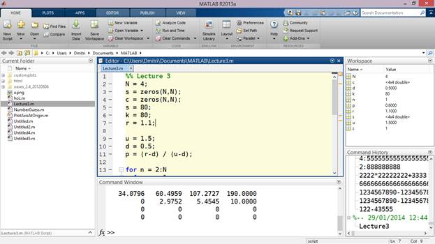
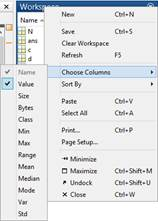
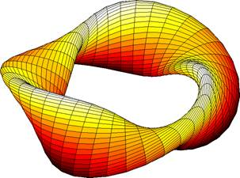
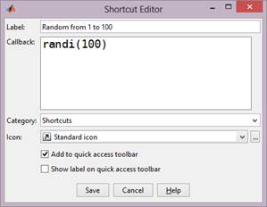
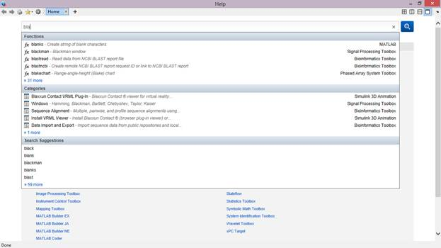

# 第 1 章用户界面

在书中展示用户界面截图可能不是最好的主意，但值得称赞的是，它确实有一个设计相当好的界面，使某些常见的操作变得更简单。另外，我们需要就窗口和控件的符号达成一致。所以让我们快点度过难关，好吗？

## 窗户

当您第一次打开 MATLAB 时，您可能会看到如下内容:



图 1: MATLAB，实物。运气好的话，你会在这个窗口度过几天，我是说，几年。

嗯，也许没有文件编辑器，但我已经添加了它，以防万一。您看到的是一个高度模块化(又是那个词)的窗口系统:实际上，除了顶层功能区工具栏之外，所有东西都是一个单独的窗口，可以分离并移动到容器窗口的不同部分，甚至是不同的监视器。

让我们讨论组成默认 MATLAB 窗口布局的不同窗口。它们是:

*   **命令窗口**:这本质上是一个控制台，您可以在其中键入命令以立即执行。输入`2+2`就得到`4`，输入`foo`，MATLAB 将开始寻找一个名为`foo`的变量，如果没有找到，则在可用路径上寻找一个脚本`foo.m`。(关于路径的更多信息，请稍后查看。)
*   **编辑器**:这是可以编辑脚本的地方。编辑器窗口有一个选项卡式界面，但是您可以将任何选项卡“分离”到单独的窗口。编辑器窗口还添加了几个功能区选项卡，即编辑器、发布和视图。我们将在脚本一章中讨论这些。
*   **工作区**:这是当前正在使用的所有变量的列表。除了显示变量名和(在可能的情况下)值，您还可以告诉 MATLAB 显示数组的一些基本统计属性:



图 2:为工作区窗口选择列。对于数组，您可以显示统计结果，如平均值、方差或标准偏差值。

*   **命令历史记录**:该窗口包含您已经执行的所有先前命令的列表。可以说，这是最没用的窗口，因为最近的命令很少需要，当需要时，您可以简单地按下键盘上的向上/向下箭头键，在以前输入的命令之间循环。
*   **当前文件夹**:这个窗口和它上面的工具栏一起，允许你从一个特定的文件夹中导航、打开和执行脚本。窗口菜单(通过按下向下箭头打开)也有各种文件相关命令(例如，创建新文件或文件夹的命令)。所选文件夹会自动添加到 MATLAB 的路径设置中，因此从该文件夹按名称执行脚本将会有效，而当您从其他文件夹访问脚本时，它们必须位于 MATLAB 路径上。此外，对于当前文件夹中当前选定的文件，您可能会在下面看到一个预览窗口，显示文件的内部。例如，对于 MAT 文件，此窗口显示存储变量的值。
*   **功能区:**这是包含所有控件的部分。功能区界面是对 MATLAB 的一个相对较新的补充，早期版本有一个普通的工具栏来代替。
*   **快速访问栏:**这是一个特殊的工具栏，出现在屏幕的右上角。在这里，您可以添加最常用的命令，这些命令永远不会被遮挡，这与功能区界面不同，在功能区界面中，任何时候都只能看到一个选项卡。

## MATLAB 的路径

如果您继续在命令窗口中键入`cruller`(不管当前路径是什么)，您可能会看到如下内容:



图 3:油条——显然是一种油炸糕点。

上面的形状是由 MATLAB 的一个示例脚本生成的，您得到它的原因是因为渲染它的文件`cruller.m`恰好位于默认情况下添加到 MATLAB 执行路径的位置。

本质上，为了利用 MATLAB 中的任何文件，这些文件需要放在 MATLAB 的路径上。要配置这些路径，请查找功能区主路径的“设置路径”按钮。点击**设置路径**打开**设置路径**窗口:


图 4:设置路径窗口。

“设置路径”窗口允许您添加一个文件夹(或包含其所有子文件夹的文件夹)，该文件夹随后将用于搜索要执行的脚本。您也可以上下移动列表元素来指示搜索优先级(更高的路径位置意味着更高的优先级)。

## 捷径

如果您发现自己一遍又一遍地编写相同的命令，您可能希望将它变成一个快捷方式，放在“搜索文档”框左侧的快速访问栏中，或者放在一个名为“快捷方式”的单独工具行程选项卡上。快捷方式可以通过命令历史窗口中的上下文菜单来创建(请参见，它并不是完全无用的！)或按顶层工具栏上的“新建快捷方式”按钮。

快捷方式编辑器相当简单:它允许您标记您的快捷方式，并决定您想要它放在哪里，以及用什么图标:



图 5:快捷方式编辑器窗口。

## 帮助和文档

MATLAB 有一个相当复杂的帮助系统，所以让我们看看它的不同方面。

获取 MATLAB 文档最简单的方法就是按下**帮助**按钮(或 **F1** )。这将打开文档浏览器，其中包含您已安装的所有产品(即工具箱)的文档。它还能让你搜索特定的主题，并且能以相当快的速度完成！



图 6:帮助窗口。

在搜索方面，页面右上角的搜索文档文本框中也有类似的功能:只需开始键入，MATLAB 将尝试猜测您正在寻找的内容。

如果您需要某个特定函数的信息，您可以使用另一个名为函数浏览器的工具。这相当于弹出窗口中显示的完整文档。

调出功能浏览器最简单的方法就是按下命令窗口输入行左边的按钮。这给出了所有函数的树状列表。当您单击一个函数时，您会在右侧看到一个文档弹出窗口:


图 7:带有文档预览的函数浏览器向下钻取窗口。

如果您已经知道函数名，获取该函数的文档就更容易了:只需在某个函数上按下 **F1** ，您就会获得该函数的文档弹出窗口:


图 8:功能浏览器弹出窗口。

弹出窗口只是打包在弹出窗口中的普通文档浏览器；如果需要，您可以在它和命令窗口之间轻松移动，或者打开全帧文档浏览器。

但这还不是全部！您也可以通过在命令窗口中键入以单词`help`为前缀的特定功能名称来获得纯文本的帮助:

```
    >> help cross
     cross  Vector cross product.
        C = cross(A,B) returns the cross product of the vectors
        A and B.  That is, C = A x B.  A and B must be 3 element
        vectors.

        C = cross(A,B) returns the cross product of A and B along the
        first dimension of length 3.

```

这可能不是阅读文档最方便的方式，但是如果您需要，选项就在这里，例如，如果您需要纯粹在终端模式下在 MATLAB 中工作(因为我们都知道通过 VPN 运行 X11 有多慢)。

如果您只知道标识符的一部分，可以使用`lookfor`进行搜索。例如，这里搜索了所有与布莱克·斯科尔斯相关的函数(注意下面一些虚假的结果):

```
  >> lookfor bls
  blsdelta - Black-Scholes sensitivity to underlying price change.
  blsgamma - Black-Scholes sensitivity to underlying delta change.
  blsimpv - Black-Scholes implied volatility.
  blslambda - Black-Scholes elasticity.
  blsprice - Black-Scholes put and call option pricing.
  blsrho - Black-Scholes sensitivity to interest rate change.
  blstheta - Black-Scholes sensitivity to time until maturity
  change.
  blsvega - Black-Scholes sensitivity to underlying price volatility.
  blscheck - Black-Scholes input argument checking.
  blspriceeng - Engine function for Black-Scholes option pricing model.
  converttobls - Convert BLS parameters to the domain used by the lower-level
  wblstat - Mean and variance of the Weibull distribution.
  tablseq - Equality table for lifting schemes.

```

MATLAB 帮助您使用函数的另一种方法是在一个小的覆盖窗口中突出显示您当前输入的参数。这也有一个**更多帮助…** 链接，打开一个文档浏览器。


图 9:键入时的参数帮助。

除了本地文档，MATLAB 的文档也可以在 http://www.mathworks.com/help/matlab/在线获得。

## 内省

要了解您实际安装了哪些工具箱，只需在**命令窗口**中输入`ver`。这将为您提供每个已安装产品及其版本的列表。

此外，请记住，一些工具箱提供自己的应用程序——这些基本上是独立的基于图形用户界面的应用程序，与 MATLAB 集成在一起。这些可在“应用程序”选项卡上获得:


## 遇到麻烦时…

如果你在 MATLAB 中遇到问题，你的第一个调用端口应该是**帮助|请求支持**下的菜单项。这可以让你在不离开 MATLAB 的情况下提交支持请求。正如您可能已经猜到的，它确实需要您的 MathWorks 凭据(与您最初用来下载 MATLAB 的凭据相同)。

然后是大量的社区支持。StackOverflow 是一个显而易见的选择(与 Mathematica 不同，它缺乏前端，这使得它无法获得自己的 StackExchange 网站)，MATLAB Central 也是如此——这是一个专门针对所有 MATLAB 内容的网站。该网站包括一个用于共享可下载脚本和扩展的部分(文件交换)、自己的问答部分(答案)、一个用于一般性讨论的新闻组、一个博客部分和 Cody——一个挑战程序员并帮助他们扩展 MATLAB 知识的游戏。

如果其他都失败了，只需在控制台窗口中输入`why`并按**进入**。MATLAB 将试图向你解释为什么事情没有按照应该的方式发展。不过要小心，因为在大多数情况下，MATLAB 试图责怪一些你可能根本没有的神秘同事！