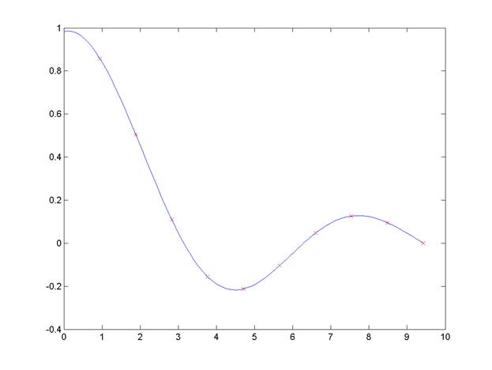
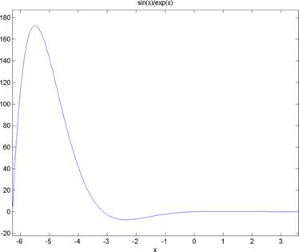
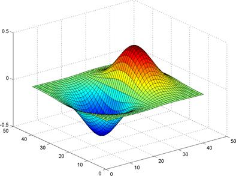
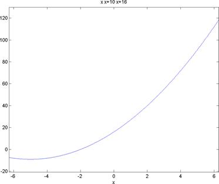
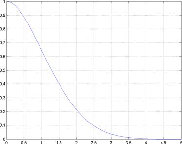
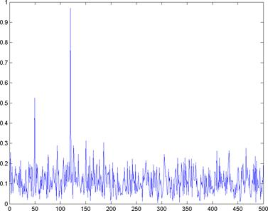

# 八、数学竞赛

这本书的大部分时间我们都在讨论 MATLAB 提供的工具；现在让我们来看几个实际操作的例子。毕竟脚本和剧情以及 OOP 都很好听，但有时候就是想算点东西，提前知道调用什么函数就很棒了。

## 初等数学

不，真的，我不打算重复小学材料。我将要谈论的是通过函数实现的一些最基本的设施。

让我们从一个简单的事实开始:每个运算符，无论是`*`还是`.^`还是矩阵`\`运算符，都有一个相应命名的函数。例如，+可以作为

```matlab
    >> plus(i,j)

    ans =
       0.0000 + 2.0000i

```

这些符号对我们来说用处不大(谁会想用函数来代替运算符呢？)除非我们想将它们用作函数句柄，或者我们想为我们的类实现(重载)它。例如，假设您有一个名为`Size`的类，并且您希望支持两个大小相加。在这种情况下，您可以这样定义您的类:

```matlab
    classdef Size < handle
      properties
        w = 0
        h = 0
      end
      methods
        function obj = Size(ww,hh)
          obj.w = ww;
          obj.h = hh;
        end
        function obj = plus(a,b)
          obj = Size(a.w + b.w, a.h + b.h);
        end
      end
end

```

`plus`函数负责操作员调用，下面是您将如何使用它:

```matlab
    >> s1 = Size(2,3);
    >> s2 = Size(20,30);
    >> s1+s2

    ans =

      Size with properties:

        w: 22
        h: 33

```

接下来，我们有各种累积计算函数。例如，`sum`和`prod`计算一个数组中所有元素的和或积(这些函数通常不关心数组维数——它们将所有数组视为扁平的)。除了我们已经看到的`cumsum`(累计和)之外，还有一个对应的`cumprod`(累计积)功能。

```matlab
    >> x = [1 2 3 4];
    >> sum(x),prod(x)

    ans =
        10

    ans =
        24

    >> cumsum(x),cumprod(x)

    ans =
         1     3     6    10

    ans =
         1     2     6    24

```

还有一个叫做`diff`的函数，计算数组中相邻元素之间的差异。其用途之一是计算用`linspace`初始化的数组的“增量”值:

```matlab
    >> z = linspace(0,1,101);
    >> dz = diff(z(1:2))

    dz =

        0.0100

```

最后，我们有计算一个数的下限和上限的函数——它们分别是`floor`和`ceil`。此外，我们还有舍入到最近整数的`round`函数和舍入到零的`fix`:

```matlab
    >> y=-5.55;
    >> [floor(y) ceil(y) round(y) fix(y)]

    ans =
        -6    -5    -6    -5

```

最后，`mod`进行模除(很遗憾，MATLAB 劫持了 **%** 运算符进行注释)`rem`计算除的余数。对于正值，它们是相同的，但是对于负值，它们会产生不同的结果:

```matlab
    >> [mod(11,3),rem(11,3);mod(-11,3),rem(-11,3)]

    ans =

         2     2
         1    -2

```

## 三角学、指数和对数

没有三角学，生活不会有乐趣，不是吗？正如人们所料，MATLAB 支持所有常见的触发函数及其双曲线变化。奇怪的是，每个函数都有两种变体:一个普通函数以弧度为自变量，另一个函数以度数为后缀`–d`(如`cosd`)。另外，反函数的前缀是`a`而不是`arc`，所以逆余切是`acot`。

音符的唯一作用是`hypot`，计算平方和的平方根(或三角形的斜边)。

```matlab
    >> hypot(3,4)

    ans =
         5

```

继续，我们有相当明显的`exp`(计算，注意 MATLAB 中没有“e”常量)、`log`(自然对数)和`sqrt` ( )。`log10`计算以 10 为底的对数。还有更模糊的函数来计算 x 的小值的对数和指数，以及前缀为`real-`的`exp/log/sqrt`版本，它们在负输入上抛出异常:

```matlab
    >> realsqrt(-1)
    >Error using realsqrt
    Realsqrt produced complex result.

```

## 复数

对复数的支持内置于 MATLAB 中，您可以获得定义和操作复数的 **i** / **j** 常量(函数，真的，但您得到了想法)。除了普通的算术运算，你还可以计算复数的`real`、`imag`(虚数)部分，复数的`conj`(共轭)以及其他一些不太刺激的东西。

```matlab
    >> u = 2+3i;
    >> [real(u) imag(u) conj(u)]

    ans =
       2.0000 + 0.0000i   3.0000 + 0.0000i   2.0000 - 3.0000i

```

注意`real`的结果怎么还是一个复数。

注意在有复数值的矩阵上调用`x'`和`transpose(x)`是有区别的:第一个执行共轭转置，第二个执行非共轭转置:

```matlab
  >> a = sqrt(-magic(2))
  a =
     0.0000 + 1.0000i   0.0000 + 1.7321i
     0.0000 + 2.0000i   0.0000 + 1.4142i

  >> a'
  ans =
     0.0000 - 1.0000i   0.0000 - 2.0000i
     0.0000 - 1.7321i   0.0000 - 1.4142i

  >> transpose(a)
  ans =

     0.0000 + 1.0000i   0.0000 + 2.0000i
     0.0000 + 1.7321i   0.0000 + 1.4142i

```

## 特殊功能

虽然 MATLAB 没有给你太阳底下的每一个特殊函数，但它确实给了你流行的函数，比如`Beta`、`Gamma`、各种`Bessel`函数、`Error`函数，以及它的互补函数，比如`Legendre`函数。

此外，当 MATLAB 不能导出某些东西时，它并不羞于在自己的结果中使用特殊函数。例如，使用符号工具箱计算我们得到:

```matlab
    >> int(x^n*exp(x),x)
    ans =
    (x^n*igamma(n + 1, -x))/(-x)^n

```

| “2008”问题如果你喜欢数学挑战，这里有一个对你来说很难的挑战:给你 13 个零(是的，零，就像`zeros(13,1)`一样)。使用这些零和各种数学运算来执行将产生值 2008 的计算。(万一你想知道，2008 是一个故意选择的数字，以使这个问题的解决方案不琐碎。)奖励回合:尝试获得少于 13 个零的 2008 年。

本章末尾提供了这个问题的一些解决方案。 |

当然，如果我们真的得到了上述积分的解析解，那将是非常令人惊讶的！

## 离散数学

正如我们在讨论基本语法时提到的，MATLAB 劫持了**！**操作员向底层操作系统发送调用。不幸的是，这使我们无法使用**！**对于阶乘，MATLAB 给了我们`factorial`函数。哦，没有双因子或子因子支持，如果你想解决那个著名的“2008”问题，这可能是个问题。

离散数学函数可以让你计算很多独立的东西，比如最大公约数和最小公倍数(分别为`gcd`和`lcm`)、素数(比如最小素数小于或等于一个值(`primes`)或者一个数的所有素数因子(`factor`)。

顺便说一句，你有时会看到工具箱为了自己邪恶的目的重用(重载)现有的功能。`factor`功能就是一个很好的例子:

```matlab
    >> syms a b
    >> factor(a*x*x+b*x)

    ans =
    x*(b + a*x)

```

## 测试矩阵

MATLAB 有许多不同的函数来生成各种矩阵，用于测试或演示。我们已经用幻方矩阵展示了排序，但是还有很多其他矩阵，比如希尔伯特矩阵、哈达玛矩阵、托普利兹矩阵、汉克尔矩阵和其他矩阵。

除此之外，还有一个`gallery`函数，它有更多的样本矩阵(使用`help gallery`获得列表)。例如，要生成一个由 0 或 1 填充的 5 × 5 矩阵，可以写:

```matlab
    >> gallery('rando',5)

    ans =

         1     0     0     1     0
         0     1     1     1     0
         0     0     1     0     0
         0     0     1     1     0
         1     0     0     0     0

```

## 插值

MATLAB 支持几种类型的插值。让我们先来看看 1D 插值——这需要一个单独的值列表。例如，`spline`函数让我们执行三次插值，这让我们可以在不完整的数据集上“填充点”:

```matlab
    >> x = linspace(0,3*pi,11);
    >> y = sin(x) ./ x;
    >> x2 = linspace(0,3*pi,101);
    >> y2 = spline(x,y,x2);
    Warning: Columns of data containing NaN values have been ignored during interpolation.
    > In interp1>Interp1DStripNaN at 239
      In interp1 at 176
    >> plot(x,y,'xr',x2,y2)

```

这是带有 x 标记的图，表示原始值，线条表示插值样条:



图 35:原始值和插值样条。

事实上，`spline`函数是带有“样条”参数的`interp1`函数的特化。对于 2D 和三维数据，我们只需分别拥有`interp2`和`interp3`。为了说明三维插值，让我们使用`flow`函数生成流体流动的粗略近似，然后在更精细的网格上插值:

```matlab
    [x,y,z,v] = flow(10);
    [xi,yi,zi] = meshgrid(0.1:.2:10,-4:.2:4,-4:.2:4);
    vi = interp3(x,y,z,v,xi,yi,zi);
    slice(xi,yi,zi,vi,[6 9.5],2,[-2 .2])
    shading('flat')

```

为了渲染下图所示的图像，我们使用`slice`功能有效地从体积图中提取和显示切片:


图 36:内插流动模型的切片图。

顺带一提，除了在 2D 和 3D 空间工作的`meshgrid`外，还有一个对应的`ngrid`功能，在 N-D 空间工作。它的操作与`meshgrid`非常相似:你只需提供你有多少维度的坐标值，就可以得到相应的数组集合。

## 优化

MATLAB 支持典型的优化问题:最小化或最大化单一或多元函数和解决约束问题。优化是一个非常大的话题，所以我们只看几个例子，关于各种优化问题的所有可怕的细节，你可以参考 MATLAB 文档和相关文本。

考虑功能



图 37:功能图。

为了定位范围(-4，0)内的局部最小值，我们首先需要定义要搜索的函数——MATLAB 对函数文本的支持在这里非常有用。然后，我们使用`fminbnd`函数找到指定范围内的最小值:

```matlab
    >> f = @(x) sin(x)/exp(x)

    f =

        @(x)sin(x)/exp(x)

    >> fminbnd(f,-4,0)

    ans =

              -2.3561989868868

```

没有对应的最大化函数:如果需要的最大值，只需计算的最小值即可。

除了支持一元函数外，MATLAB 还支持搜索多元函数的极小值。例如，让我们假设您想要找到的最大值，如下所示:



图 38:函数的曲面图。一个特别好看的剧情，MATLAB 文档真的很喜欢炫耀。

我们可以指示 MATLAB 从(10，20)范围内的某个地方开始搜索最小值:

```matlab
    >> f = @(x) x(1)*exp(-x(1)^2-x(2)^2);
    >> fminsearch(f,[10 20])

    ans =
                       11.3125                    25.875

```

请注意，与有界的`fminbnd`不同，`fminsearch`执行无约束优化。

我们继续吧。`fzero`函数试图用一个变量找到一个方程的根。例如，给定以下函数:



图 39:功能图。这个二次方程实际上有两个根，但是我们限制了这个图表中的范围，所以你只能看到一个。

我们可以通过假设根位于(-6，6)范围内来定位根:

```matlab
    >> f = @(x) x*x+10*x+16;
    >> options = optimset('Display','iter');
    >> fzero(f,[-6 6],options)

     Func-count    x          f(x)             Procedure
        2              -6            -8        initial
        3            -5.2         -8.96        interpolation
        4            -5.2         -8.96        bisection
        5        -3.47692      -6.68024        interpolation
        6        -1.53846       2.98225        bisection
        7        -2.13675     -0.801812        interpolation
        8        -2.00998    -0.0597757        interpolation
        9        -1.99997   0.000194854        interpolation
       10              -2  -3.24619e-07        interpolation
       11              -2  -1.75504e-12        interpolation
       12              -2             0        interpolation

    Zero found in the interval [-6, 6]

    ans =

        -2

```

我们特意为上面的调用打开了详细的输出选项，以便向您展示迭代过程。没有额外的设置，`fzero`调用只是给你最终的结果。

MATLAB 支持更多的优化算法，但是使用优化工具箱(用于局部优化)和全局优化工具箱可以获得更多的乐趣。

## 数值积分和微分方程

首先，如果你想要**符号**微分或积分(即解析解而不是数值解)，你需要符号数学工具箱，因为 MATLAB 默认不包括这个功能。MATLAB 给你的是进行数值积分和微分的能力，以及求解常微分方程和偏微分方程的方法。

让我们从数值积分开始。这是使用`integral`函数完成的，需要函数本身以及积分极限:

```matlab
    >> f = @(x) exp(-x.^2);
    >> integral(f,0,1)

    ans =
             0.746824132812427

```

|  | 注意:您能看到这个代码示例有什么异常吗？没错——当使用数值方法时，你的 x 值可能是一个数组——因此，我们使用 elementwise 运算符(x.^2).如果我们使用普通的指数运算，我们会得到一个相当神秘的错误。 |

二重积分和三重积分分别用`integral2`和`integral3`计算。MATLAB 还支持多种数值积分方法，如梯形(`trapz`)和辛普森(`quad`)。

现在，让我们继续有趣的事情:解决常微分方程。MATLAB 自带几个函数，前面都是`ode-`，后面是数字和字母，比如`ode15i`和`ode23tb`。这些是用来区分要求解的方程是*刚性*还是*非刚性*，用什么方法(低阶、中阶等。)用来解方程。

例如，让我们求解以下等式:


有了初始条件。为此，我们首先定义我们的函数:

```matlab
    >> f = @(t,y) -t*y/sqrt(2-y^2);

```

然后我们使用`ode45`(非定常，中阶方法)求解方程并绘制结果:

```matlab
    >> [tt ff] = ode45(f,[0 5],1);
    >> plot(tt,ff)
    >> grid on

```



图 40:微分方程解的曲线图。

MATLAB 自带的偏微分方程求解器支持带有初边值的 1D 抛物-椭圆偏微分方程。函数`pdepe`用于求解方程，`pdeval`使用`pdepe`的输出评估数值解。偏微分方程工具箱中的函数提供了附加的偏微分方程支持。

## 傅里叶分析和滤波

在傅立叶分析领域，关键操作当然是快速傅立叶变换函数`fft`及其 2D 和 N-D 变体(`fft2`和`fftn`)及其逆变换(`ifft`、`ifft2`和`ifftn`)。

按照惯例，我们通过首先创建一些包含振荡和噪声的数据来说明快速傅立叶变换:

```matlab
    fs = 1000;
    t = 1/fs;
    l = 1000;
    t = (0:l-1)*t;
    x = 0.6*sin(2*pi*50*t) + sin(2*pi*120*t);
y = x + 2*randn(size(t));

```

我们现在转换到频域，并应用快速傅立叶变换来获得噪声信号的离散傅立叶变换:

```matlab
    n = 2^nextpow2(l);
    yy = fft(y,n)/l;
f = fs/2*linspace(0,1,n/2+1);

```

在上图中，`nextpow2`得到了变量的 2 的下一次幂。完成转换后，我们现在可以绘制频谱图:



图 41:函数的单侧谱图。

这就是了——两个清晰的峰值分别在 50°和 120°。当然，由于噪音，我们无法得到准确的振幅，但生活也不是完美的。

现在我们来谈谈过滤。MATLAB 具有 1D 和 2D 数字滤波、2D 和二维卷积等功能。在 1D 的例子中，过滤是通过`filter`函数完成的，这相当有趣。它的签名采用三个参数:前两个是分子和分母系数向量，最后一个是要过滤的数据。

过滤功能对很多事情都很有用。例如，让我们生成一条随机路径，然后绘制几个数据周期的简单移动平均线:

```matlab
    pointCount = 500;
    t = linspace(0,1,pointCount+1);
    dt=diff(t(1:2));
    dw=randn(pointCount,1)*sqrt(dt);
    w = cumsum([0;dw]);

    periods = 30;
    maData = filter(ones(1,periods)/periods,1,w);
plot(t,[w maData])

```

最终结果是:


图 42:布朗运动路径(蓝色)及其 30 周期移动平均线(绿色)。

|  | 注:本文作者对金融分析中的技术分析技术(如移动平均线的使用)的有效性不做任何声明。 |

几乎不可能在一本书中涵盖 MATLAB 的所有特性，所以我们就此打住。毕竟这是一个简洁的标题。

## 2008 年的问题

正如承诺的那样，这是前面提出的问题的解决方案。首先，提醒一下:给你十三个零(0 0 0 0 0 0 0 0 0 0 0)，你需要用这些零和一些数学运算得出 2008 的值。

这里的技巧是利用阶乘函数和这个事实来做一些实数。例如，通过将几个项相加并取其阶乘，就可以得到解


双阶乘的使用允许更短的解。例如，


其中。然后还有子工厂和许多其他技巧来将所需的零的数量减少到最小。看看你能不能找到一些更短的解决方案。