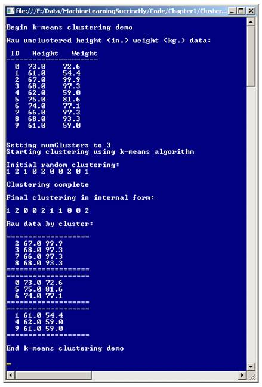
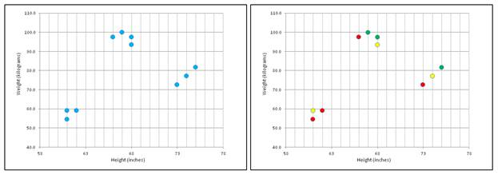
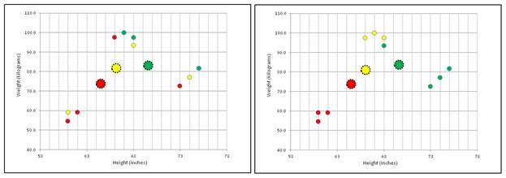
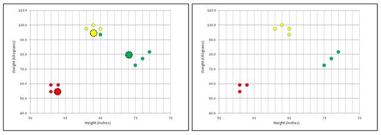

# 一、KMeans 聚类

## 简介

数据聚类是将数据项分组的过程，以便相似的项在同一组(簇)中，而不相似的项在不同的组中。对数据集进行聚类后，可以对其进行检查以发现有趣的模式。例如，可以将一组销售交易数据进行聚类，然后检查男女的购物模式是否存在差异。

有许多不同的聚类算法。其中最常见的叫做*k*——意思是算法。了解 *k* 均值算法的一个好方法是查看**图 1-a** 所示演示程序的截图。演示程序将包含 10 个项目的数据集分成三组。每个数据项代表一个人的身高(英寸)和体重(公斤)。

数据集是人工构建的，因此项目明显分为三个不同的类别。但是，即使只有 10 个简单的数据项，每个数据项只有两个值，也不能立即看出哪些数据项是相似的:

(73.0，72.6)
(61.0，54.4)
(67.0，99.9)
(68.0，97.3)
(62.0，59.0)
(75.0，81.6)
(74.0，77.1)
(66.0，97.3)
(68.0，93.3)

然而，在 *k* 意味着聚类之后，很明显有三个不同的群体可能被标记为“中等身高和体重”、“高和中等体重”以及“矮和轻”:

(67.0，99.9)
(68.0，97.3)
(66.0，97.3)
(68.0，93.3)

(73.0，72.6)
(75.0，81.6)
(74.0，77.1)

(61.0，54.4)
(62.0，59.0)
(61.0，59.0)

*k*-表示算法仅适用于严格的数字数据。演示中的每个数据项都有两个数字部分(身高和体重)，但是*k*-表示可以处理任意数值的数据项，例如，(73.0，72.6，98.6)，其中第三个数值是体温。



图 1-a:运行中的 k 均值算法

请注意，在演示程序中，簇的数量(在 *k* 中的 *k* 是指)被设置为 3。大多数聚类算法，包括*k*-意味着，需要用户指定聚类的数量，而不是程序自动找到最佳的聚类数量。 *k* -means 算法是所谓的无监督机器学习技术的一个例子，因为该算法直接在整个数据集上工作，不需要任何特殊的训练项目(预先指定簇成员)。

演示程序最初将每个数据元组随机分配给三个簇标识中的一个。群集过程完成后，演示将显示结果群集:{ 1，2，0，0，2，1，1，0，0，2 }，这意味着数据项 0 被分配给群集 1，数据项 1 被分配给群集 2，数据项 2 被分配给群集 0，数据项 3 被分配给群集 0，依此类推。

## 理解*k*-意味着算法

对数字数据进行聚类的一种简单方法是检查源数据集的所有可能分组，然后确定这些分组中哪一个是最好的。这种方法有两个问题。首先，一个数据集可能的分组数量增长非常快，达到天文数字。例如，将 *n* = 50 分成 *k* = 3 组的方式为:

119,649,664,052,358,811,373,730

即使你能以某种方式每秒检查 10 亿个分组(也称为分区)，你也要花费 300 多万年的计算时间来分析所有的可能性。这种方法的第二个问题是，有几种方法可以准确定义数据集最佳聚类的含义。

*k* 有很多变体——意思是算法。基本的*k*-意思是算法，有时被称为劳埃德算法，非常简单。用高级伪码表示，*k*-表示聚类为:

将所有数据项随机分配到一个聚类
循环，直到聚类分配没有变化
计算每个聚类的质心
将每个数据项重新分配到最近质心的聚类
结束

即使伪码很短很简单， *k* -means 还是有些微妙，最好用图片来解释。**图 1-b** 中的左侧图像是演示程序中 10 个身高体重数据项的图形。请注意，最佳聚类非常明显。图中的右图显示了一种可能的数据随机初始聚类，其中颜色(红色、黄色、绿色)表示聚类成员。



图 1-b: k 均值问题和聚类初始化

初始化簇分配后，计算每个簇的质心，如图**图 1-c** 左图所示。这三个大点是质心。聚类中数据项的质心本质上是一个平均项。例如，您可以看到分配给红色簇的四个数据项稍微偏左，稍微低于所有数据点的中心。

还有其他几种类似于 *k* 均值算法的聚类算法，但使用了不同的质心项目定义。这就是为什么 *k* 的意思被命名为“*k*”-意思是“而不是”*k*-质心。”



图 1-c:计算质心和重新分配簇

计算每个聚类的质心后，*k*-意味着算法扫描每个数据项，并将每个数据项重新分配给与最近质心相关联的聚类，如图 1-c 中右侧的图表所示。例如，图表左下方的三个数据点显然最接近红色质心，因此这三个项目被分配给红色聚类。

*k*-表示算法继续迭代更新质心和更新聚类过程，如图**图 1-d** 所示。一般来说，*k*-意味着算法将很快达到簇分配没有变化的状态，如图 1-d 中右侧的图表所示。



图 1-d:更新-质心和更新-聚类直到没有变化

前面对 *k* 的解释——意味着算法遗漏了一些重要的细节。例如，数据项最初是如何分配给簇的？聚类质心最接近数据项意味着什么？有没有保证更新质心、更新聚类循环会退出？

## 演示程序总体结构

为了创建演示，我启动了 Visual Studio，并选择了新的 C#控制台应用模板。这个演示没有什么意义。NET 版本依赖，所以任何版本的 Visual Studio 都应该可以工作。

模板代码加载到编辑器后，我删除了源代码顶部的所有`using`语句，除了对顶层 System 命名空间的单一引用。在解决方案资源管理器窗口中，我将 Program.cs 文件重命名为更具描述性的 ClusterProgram.cs，Visual Studio 自动将类 Program 重命名为 ClusterProgram。

演示程序的整体结构在**清单 1-a** 中给出，为了节省空间做了一些小的修改。请注意，为了使示例代码的大小尽可能小，并且主要思想尽可能清晰，演示程序违反了典型的编码风格准则，并省略了通常在生产代码中使用的错误检查。演示程序类有三个静态助手方法。方法显示原始源数据项。

```cs
    using System;
    namespace ClusterNumeric
    {
      class ClusterProgram
      {
        static void Main(string[] args)
        {
          Console.WriteLine("\nBegin k-means clustering demo\n");

          double[][] rawData = new double[10][];
          rawData[0] = new double[] { 73, 72.6 };
          rawData[1] = new double[] { 61, 54.4 };
          // etc.
          rawData[9] = new double[] { 61, 59.0 };

          Console.WriteLine("Raw unclustered data:\n");
          Console.WriteLine(" ID   Height (in.)   Weight (kg.)");
          Console.WriteLine("---------------------------------");
         ShowData(rawData, 1, true, true);

          int numClusters = 3;
          Console.WriteLine("\nSetting numClusters to " + numClusters);

          Console.WriteLine("\nStarting clustering using k-means algorithm");
          Clusterer c = new Clusterer(numClusters);
          int[] clustering = c.Cluster(rawData);
          Console.WriteLine("Clustering complete\n");

          Console.WriteLine("Final clustering in internal form:\n");
         ShowVector(clustering, true);

          Console.WriteLine("Raw data by cluster:\n");
         ShowClustered(rawData, clustering, numClusters, 1);

          Console.WriteLine("\nEnd k-means clustering demo\n");
          Console.ReadLine();
        }

        static void ShowData(double[][] data, int decimals, bool indices,
          bool newLine) { . . }
        static void ShowVector(int[] vector, bool newLine) { . . }
        static void ShowClustered(double[][] data, int[] clustering,
          int numClusters, int decimals) { . . }
      }

      public class Clusterer { . . }

    } // ns

```

清单 1-a: k-Means 演示程序结构

Helper ShowVector 显示内部聚类表示，而方法 ShowClustered 显示已经聚类的源数据，按聚类分组。

所有的簇逻辑都包含在一个名为 Clusterer 的程序定义类中。所有的程序逻辑都包含在 Main 方法中。Main 方法首先在数组样式矩阵中设置 10 个硬编码的高度-重量数据项:

静态 void Main(string[]args)
{
Console。write line(" \ n 开始 k-means 群集演示\ n ")；
double[][]raw data = new double[10][]；
rawData[0] = new double[] { 73，72.6 }；
。。。

在非演示场景中，您可能将数据存储在文本文件中，并使用助手函数将数据加载到内存中，如下一节所述。Main 方法显示原始数据，如下所示:

控制台。WriteLine("原始未聚集数据:\ n ")；
控制台。写线(“标识高度(英寸。)重量(公斤。)");
控制台。write line(“-”)；
显示数据(原始数据，1，真，真)；

方法 ShowData 的四个参数是要显示的 double 类型的矩阵、要为每个值显示的小数位数、要不要显示索引的布尔标志以及要不要打印最后一行新行的布尔标志。方法显示数据在**清单 1-b** 中定义。

```cs
    static void ShowData(double[][] data, int decimals, bool indices, bool newLine)
    {
      for (int i = 0; i < data.Length; ++i)
      {
        if (indices == true)
          Console.Write(i.ToString().PadLeft(3) + "  ");
        for (int j = 0; j < data[i].Length; ++j)
        {
          double v = data[i][j];
          Console.Write(v.ToString("F" + decimals) + "    ");
        }
        Console.WriteLine("");
      }
      if (newLine == true)
        Console.WriteLine("");
    }

```

清单 1-b:显示原始数据

要考虑的许多替代方法之一是向方法 ShowData 传递一个名为“header”的附加字符串数组参数，该参数包含列名，然后使用该信息显示列标题。

在 Main 方法中，簇例程的调用接口非常简单:

int Numclusters = 3；
控制台。write line(" \ n 将 numcluster 设置为"+numcluster ")；
控制台。WriteLine(" \ n 使用 k-means 算法开始聚类")；
聚类器 c =新聚类器(Numclusters)；
int[]聚类= c . Cluster(raw data)；
控制台。WriteLine(“群集完成\ n”)；

程序定义的 clusters 构造函数接受单个参数，即要将数据项分配到的簇的数量。Cluster 方法接受数据项的矩阵，并以整数数组的形式返回结果聚类，其中数组索引值是数据项的索引，数组单元值是一个聚类 ID。在**图 1-a** 的截图中，返回数组有以下值:

{ 1, 2, 0, 0, 2, 1, 0, 0, 2 }

这意味着数据项[0]，即(73.0，72.6)，被分配给簇 1，数据[1]被分配给簇 2，数据[2]被分配给簇 0，数据[3]被分配给簇 0，依此类推。

Main 方法结束时显示簇，并显示按簇标识分组的源数据:

。。。
控制台。WriteLine("内部形式的最终聚类:\ n ")；
ShowVector(聚类，真)；

控制台。WriteLine("按群集划分的原始数据:\ n ")；
ShowClustered(rawData，Clusters，numClusters，1)；

控制台。WriteLine("\nEnd k-means 聚类演示\ n ")；
控制台。ReadLine()；
}

定义了辅助方法 ShowVector:

静态 void ShowVector(int[] vector，bool newLine)

{

for(int I = 0；I

控制台。Write(向量[I]+" ")；

if (newLine == true) Console。write line(" \ n ")；

}

依赖静态助手方法来显示聚类结果的另一种方法是定义一个类 ToString 方法，大致如下:

控制台。write line(c . ToString())；//显示聚类[]

Helper 方法 ShowClustered 以聚集的形式显示源数据，如清单 1-c 中的**所示。方法 ShowClustered 多次遍历已被聚集的数据集。一种更有效但明显更复杂的替代方法是定义一个本地数据结构，例如一个列表对象数组，然后对数据进行第一次、单次传递，存储与每个数据项相关联的簇标识。然后，通过数据结构的第二次、单次传递可以以聚集的形式打印数据。**

```cs
    static void ShowClustered(double[][] data, int[] clustering, int numClusters,
      int decimals)
    {
      for (int k = 0; k < numClusters; ++k)
      {
        Console.WriteLine("===================");
        for (int i = 0; i < data.Length; ++i)
        {
          int clusterID = clustering[i];
          if (clusterID != k) continue;
          Console.Write(i.ToString().PadLeft(3) + " ");
           for (int j = 0; j < data[i].Length; ++j)
          {
            double v = data[i][j];
            Console.Write(v.ToString("F" + decimals) + " ");
          }
          Console.WriteLine("");
        }
        Console.WriteLine("===================");
      } // k
    }

```

清单 1-c:以簇形式显示数据

使用静态方法显示聚集数据的另一种方法是实现一个类成员 ToString 方法。

## 从文本文件加载数据

在非演示场景中，要群集的数据通常存储在文本文件中。例如，假设演示程序中的 10 个数据项存储在一个逗号分隔的文本文件中，没有标题行，命名为 HeightWeight.txt，如下所示:

73.0，72.6
61.0，54.4
。。。
61.0，59.0

**清单 1-d** 给出了一种可能的 LoadData 方法的实现。根据定义，LoadData 方法接受数据文件中行数和列数的输入参数`numRows`和`numCols`。一般来说，当使用机器学习时，像这样的信息通常是已知的。

```cs
    static double[][] LoadData(string dataFile, int numRows, int numCols, char delimit)
    {
      System.IO.FileStream ifs = new System.IO.FileStream(dataFile, System.IO.FileMode.Open);
      System.IO.StreamReader sr = new System.IO.StreamReader(ifs);
      string line = "";
      string[] tokens = null;
      int i = 0;
      double[][] result = new double[numRows][];
      while ((line = sr.ReadLine()) != null)
      {
        result[i] = new double[numCols];
        tokens = line.Split(delimit);
        for (int j = 0; j < numCols; ++j)
          result[i][j] = double.Parse(tokens[j]);
         ++i;
      }
      sr.Close();
      ifs.Close();
      return result;
    }

```

清单 1-d:从文本文件中加载数据

调用方法 LoadData 看起来类似于:

字符串 DATaF = "..\\..\ \ HeightWatch . txt "；
double[][]raw data = load data(data file，10，2，'，')；

另一种方法是以编程方式扫描数据的行数和列数。在伪代码中，它看起来像:

numRows := 0
打开文件
而不 EOF
numRows := numRows + 1
结束循环
关闭文件
用 numRows 分配结果数组
打开文件
而不 EOF
用 numols 读取并解析行
用 numols 分配数组的当前行
存储行
结束循环
关闭文件
返回结果矩阵

请注意，即使你是一个非常有经验的程序员，除非你经常处理科学或数字问题，否则你可能不熟悉 C#数组矩阵。矩阵编码语法模式可能需要一段时间才能习惯。

## 关键数据结构

*k* 均值聚类程序的重要数据结构如图 1-e 所示。名为`data`的数组样式矩阵显示了 10 个身高体重数据项(有时称为数据元组)是如何存储在内存中的。比如`data[2][0]`保持第三人的身高(67 英寸)`data[2][1]`保持第三人的体重(99.9 公斤)。在代码中，`data[2]`表示矩阵的第三行，是一个有两个单元格的数组，保存第三个人的身高和体重。没有方便的方法来访问数组样式矩阵的整个列。


图 1-e:k-表示关键数据结构

与许多编程语言不同，C#支持真正的多维数组。例如，可以这样声明和访问与图 1-e 中所示的矩阵保持相同值的矩阵:

double[，] data = new double[10，2]；// 10 行 2 列
数据[0，0]= 73；
数据[0，1]= 72.6；

。。。

然而，在 C#机器学习场景中，使用数组样式的矩阵要常见得多，而且通常更方便，因为整行都可以轻松访问。

演示程序维护一个名为`clustering`的整数数组来保存簇分配信息。数组索引(0，1，2，3，.。9)表示数据项的索引。数组单元格值{ 2，0，1，.。2 }代表簇标识。因此，在图中，数据项 0(73，72.6)被分配给簇 2。数据项 1(61，54.4)被分配给簇 0。等等。

有许多替代方法来存储簇分配信息，在效率和清晰度之间进行权衡。例如，您可以使用列表对象的数组，其中每个列表集合保存属于同一簇的数据项的索引。一般来说，机器学习算法和使用的数据结构之间的关系非常紧密，对其中一个数据结构的更改将需要对算法代码进行重大更改。

在**图 1-e** 中，数组`clusterCounts`保存在聚类过程中任何给定时间分配给一个聚类的数据项的数量。数组索引(0，1，2)表示聚类标识，单元格值{ 3，3，4 }表示数据项的数量。因此，簇 0 分配了三个数据项，簇 1 也有三个数据项，簇 2 有四个数据项。

在**图 1-e** 中，数组矩阵`centroids`保存了每个簇的平均数据项。例如，聚类 0 的质心为{ 67.67，76.27 }。分配给群集 0 的三个数据项是项 1、3 和 6，它们是{ 61，54.4 }、{ 68，97.3 }和{ 74，77.1 }。一组向量的质心只是一个向量，其中每个分量都是该组值的平均值。例如:

质心[0] = (61 + 68 + 74) / 3、(54.4 + 97.3 + 77.1) / 3
= 203 / 3，228.8 / 3
= (67.67，76.27)

请注意，就像算法和使用的数据结构之间的密切关系一样，关键数据结构之间也有非常紧密的耦合。根据我编写机器学习代码的经验，(至少对我来说)有一个所使用的所有数据结构的图表是很重要的。我生成的大多数编码错误都与数据结构有关，而不是算法逻辑。

## 聚类器类

一个名为 Clusterer 的程序定义类包含了*k*-意思是聚类算法代码。类的结构在**清单 1-e** 中给出。

```cs
    public class Clusterer
    {
      private int numClusters;
      private int[] clustering;
      private double[][] centroids;
      private Random rnd;

      public Clusterer(int numClusters) { . . }
      public int[] Cluster(double[][] data) { . . }
      private bool InitRandom(double[][] data, int maxAttempts) { . . }
      private static int[] Reservoir(int n, int range) { . . }
      private bool UpdateCentroids(double[][] data) { . . }
      private bool UpdateClustering(double[][] data) { . . }
      private static double Distance(double[] tuple, double[] centroid) { . . }
      private static int MinIndex(double[] distances) { . . }
    }

```

清单 1-e:程序定义的聚类器类

Class Clusterer 有四个数据成员、两个公共方法和六个私有帮助器方法。四个数据成员中的三个——变量`numClusters`、数组`clustering`和矩阵`centroids`——由**图 1-e** 中的图表解释。第四个数据成员`rnd`是在 *k* 期间使用的随机对象，表示初始化过程。

数据成员`rnd`用于在数据项最初被分配到随机簇时生成伪随机数。在大多数聚类场景中，只有一个聚类对象，但是如果需要多个聚类对象，您可能需要考虑用`static`关键字修饰数据成员`rnd`，以便在聚类对象实例之间共享一个随机数生成器。

类聚类器只公开两个公共方法:一个类构造函数和一个方法簇。方法簇调用私有助手方法 InitRandom、UpdateCentroids 和 UpdateClustering。助手方法 UpdateClustering 调用子助手静态方法 Distance 和 MinIndex。

类构造函数简单明了:

公共聚类器

{

this.numClusters = numClusters

this .质心=新双[Numclusters][]；

this . rnd = new Random(0)；

}

单个输入参数`numClusters`被分配给同名的类数据成员。您可能需要执行输入错误检查，以确保参数`numClusters`的值大于或等于 2。能够控制何时省略错误检查以提高性能是编写自定义机器学习代码的一个优势。

构造函数分配数据成员矩阵`centroids`的行，但不能分配列，因为列的数量在要聚集的数据出现之前是未知的。同样，数组`clustering`在知道数据项个数后才能分配。随机对象用 0 的种子值初始化，这是任意的。不同的种子值会产生明显不同的聚类结果。一个常见的设计选项是将种子值作为输入参数传递给构造函数。

如果回头参考**清单 1-a** ，关键调用代码是:

int Numclusters = 3；
cluster er c = new cluster er(Numclusters)；
int[]聚类= c . Cluster(raw data)；

请注意，在将数据传递给 Cluster 方法之前，Cluster 类不会了解要群集的数据。一个重要的替代设计是包含一个要作为类成员聚集的数据的引用，并将该引用传递给类构造函数。换句话说，聚类器类将包含一个额外的字段:

私有 double[][]raw data；

构造函数将是:

public cluster er(int numcluster，double[][]raw data)
{
this . numcluster = numcluster；
this . raw data = raw data；
。。。

这种设计方案的利弊有点微妙。包含要群集的数据的一个优点是，它导致稍微干净的设计。在我看来，这两种设计方法有大致相同的优点。在创建自定义机器学习代码时，决定将数据传递给类构造函数还是公共方法是一个反复出现的主题。

## 聚类法

方法簇出现在**列表 1-f** 中。方法接受对要聚集的数据的引用，该数据存储在数组样式的数组中。

```cs
    public int[] Cluster(double[][] data)
    {
      int numTuples = data.Length;
      int numValues = data[0].Length;
    this.clustering = new int[numTuples];

      for (int k = 0; k < numClusters; ++k)
        this.centroids[k] = new double[numValues];

      InitRandom(data);

      Console.WriteLine("\nInitial random clustering:");
      for (int i = 0; i < clustering.Length; ++i)
        Console.Write(clustering[i] + " ");
      Console.WriteLine("\n");

      bool changed = true; // change in clustering?
      int maxCount = numTuples * 10; // sanity check
      int ct = 0;
      while (changed == true && ct < maxCount)
      {
        ++ct;
        UpdateCentroids(data);
        changed = UpdateClustering(data);
      }

      int[] result = new int[numTuples];
      Array.Copy(this.clustering, result, clustering.Length);
      return result;
    }

```

清单 1-f:簇方法

方法簇的定义始于:

public int[]Cluster(double[][]data)
{
int numTuples = data。长度；

int numValues =数据[0]。长度；

this . clustering = new int[numTuples]；

。。。

前两个语句确定要聚集的数据项的数量以及每个数据项中的值的数量。严格来说，这两个变量是不必要的，但是使用它们会使代码更容易理解。回想一下，类成员数组`clustering`和成员矩阵`centroids`无法在构造函数中分配，因为要聚集的数据的大小未知。因此，当第一次知道数据时，`clustering`和`centroids`在方法簇中分配。

接下来，分配数据成员矩阵`centroids`的列:

for(int k = 0；k < numClusters++k)

this .质心[k] =新双[NumValueS]；

这里使用`this`关键字引用类成员`centroids`，但是引用成员`numClusters`时没有使用关键字。在生产环境中，您可能会使用标准化的编码风格。

接下来，方法 Cluster 通过调用助手方法 InitRandom 用随机分配初始化簇:

InitRandom（data）;

控制台。write line(" \ n 初始随机聚类:")；

for(int I = 0；I

控制台。Write(聚类[I]+" ")；

控制台。write line(" \ n ")；

*k*-意味着初始化过程是一个主要的定制点，稍后将详细讨论。在调用 InitRandom 之后，演示程序向命令外壳显示初始簇，纯粹是为了演示。与使用无法访问源代码的现有工具或应用编程接口集相比，在任何地方插入显示语句的能力是编写自定义机器学习代码的另一个优势。

方法聚类的核心是更新质心，更新聚类循环:

bool changed = true

int max count = number 元组* 10；//健康检查

int CT = 0；

while(已更改== true && ct <= maxCount)

{

+++CT；

更新质心(数据)；

changed = UpdateClustering(数据)；

}

辅助方法 UpdateCentroids 使用当前聚类来计算每个聚类的质心。助手方法更新聚类然后使用新质心将每个数据项重新分配给与最近质心相关联的聚类。如果没有数据项改变簇，该方法返回 false。

T2-意味着算法通常很快达到稳定的聚类。数学上，*k*-均值保证收敛到局部最优解。但是这个事实并不意味着簇过程的实现一定会终止。算法有可能振荡，一个数据项在两个簇之间重复交换，尽管这种可能性极小。为了防止无限循环，需要维护一个健全性计数器。这里，最大循环计数被设置为`numTuples * 10`，这在大多数实际场景中是足够的。

方法簇通过将类成员数组`clustering`中的值复制到本地返回数组来完成。这允许调用代码访问和查看簇，而不必按照名为 GetClustering 的例程的思路实现公共方法。

。。。

int[]结果= new int[numTuples]；

数组。复制(这.聚类，结果，聚类。长度)；

返回结果；

}

在返回聚类结果之前，您可能需要考虑检查变量`ct`的值。如果变量`ct`的值等于`maxCount`的值，那么方法簇在达到稳定状态之前就终止了，这很可能表明出了问题。

## 聚类初始化

初始化过程对 *k* 均值算法至关重要。初始化后，聚类本质上是确定性的，因此 a*k*-意味着聚类结果完全取决于聚类是如何初始化的。有两种主要的初始化方法。演示程序将每个数据元组分配给一个随机的簇标识，确保每个簇至少有一个元组分配给它。InitRandom 方法的定义从以下开始:

private void InitRandom(double[][]数据)

{

int numTuples =数据。长度；

int ClusterId = 0；

for(int I = 0；i < numTuples++i)

{

聚类[I]= ClusterId++；

if (clusterID == numClusters)

cluster id = 0；

}

。。。

其思想是确保每个簇至少分配了一个数据元组。对于包含 10 个元组的演示数据，这里的代码会将类成员数组`clustering`初始化为{ 0，1，2，0，1，2，0，1，2，0 }。这种数据元组到簇的半随机初始分配对于大多数目的来说都很好，但是通常会进一步随机化簇分配，如下所示:

for(int I = 0；i < numTuples++i)

{

int r = rnd。下一步(I，聚类。长度)；//选择一个单元格

int tmp =聚类[r]；//获取单元格值

聚类[r] =聚类[I]；//交换值

聚类[I]= tmp；

}

} // InitRandom

这个随机化代码使用了一个极其重要的小算法，叫做费希尔-耶茨洗牌。代码对簇数组进行单次扫描，交换成对随机选择的值。算法相当精妙。费希尔-耶茨的一个常见错误是:

int r = rnd。下一步(0，聚类。长度)；//错了！

虽然这一点并不明显，但坏代码会生成一个明显随机的数组值排序，但实际上这种排序会强烈偏向某些模式。

第二个主要*k*-意味着聚类初始化方法有时被称为 Forgy 初始化。其思想是挑选几个实际的数据元组作为初始伪均值，然后将每个数据元组分配给与最接近伪均值对应的簇。在我看来，关于哪种聚类初始化方法在哪种情况下更好，研究结果还没有定论。

## 更新质心

方法 UpdateClustering 的代码首先计算分配给每个簇的数据元组的当前数量:

私有 bool UpdateCentroids(双[][]数据)

{

int[]cluster counts = new int[Numclusters]；

for(int I = 0；I

{

int clusterID =聚类[I]；

++簇计数[簇标识]；

}
。。。

需要分配给每个聚类的元组数量来计算每个质心分量的平均值。这里，`clusterCounts`数组被声明为方法 UpdateCentroids 的本地数组。另一种方法是将`clusterCounts`声明为类成员。在编写面向对象的代码时，有时很难在使用类成员或局部变量之间做出选择，在我看来，很少有好的、通用的经验法则。

接下来，方法 UpdateClustering 将`this.centroids`矩阵中的当前单元格清零:

for(int k = 0；k

for(int j = 0；j

质心[k][j]= 0.0；

另一种方法是使用擦除矩阵来执行计算。接下来，累加总和:

for(int I = 0；I

{

int clusterID =聚类[I]；

for(int j = 0；j

质心[clusterID][j] +=数据[I][j]；//累加总和

}

尽管代码很短，但它有点棘手，至少对我来说，完全理解正在发生的事情的唯一方法是绘制一个数据结构图，就像**图 1-e** 中所示的那样。方法 UpdateCentroids 通过将累积的总和除以适当的聚类计数得出结论:

。。。

for(int k = 0；k

for(int j = 0；j

质心[k][j] /=簇计数[k]；//危险？

} //更新质心

请注意，如果任何群集计数的值为 0，将会出现致命的除以零错误。回忆一下基本的*k*-意味着算法是:

初始化聚类
循环
更新质心
更新聚类
结束循环

这意味着群集初始化和群集更新例程必须确保没有群集计数变为零。但是簇计数怎么会变成零呢？在 *k* 意味着处理期间，数据元组被重新分配给对应于最接近质心的聚类。即使每个聚类最初具有至少一个分配给它的元组，如果数据元组同样接近两个不同的质心，则元组可以移动到任何一个相关的聚类。

## 更新聚类

方法 UpdateClustering 的定义从以下开始:

私有 bool UpdateClustering(double[][]数据)

{

bool changed = false

int[]new clustering = new int[clustering。长度]；

数组。复制(簇，新簇，簇。长度)；

double[]距离=新的 double[Numclusters]；

。。。

局部变量`changed`保存方法返回值；它被假定为假，如果任何元组改变簇分配，它将被设置为`true`。局部数组`newClustering`保存了提议的新聚类。名为`distances`的局部数组保存从给定数据元组到每个质心的距离。例如，如果数组`distances`持有{ 4.0，1.5，2.8 }，那么从某个元组到聚类 0 的距离是 4.0，从元组到质心 1 的距离是 1.5，从元组到质心 2 的距离是 2.8。因此，元组最接近质心 1，并将被分配给聚类 1。

接下来，方法 UpdateClustering 用下面的代码来实现这一点:

for(int I = 0；I

{

for(int k = 0；k < numClusters++k)

距离[k] =距离(数据[i]，质心[k])；

int newClusterID = MinIndex(距离)；//最近质心

if (newClusterID！=新聚类[i])

{

changed = true//注意一个新的簇

new clustering[I]= new clusterid；//接受更新

}

}

关键代码调用了两个辅助方法:Distance，计算从元组到质心的距离，MinIndex，识别最小距离的簇 id。接下来，该方法检查是否有任何数据元组改变了簇分配:

if(已更改== false)

返回 false

如果聚类没有变化，则算法已经稳定，更新聚类可以退出当前聚类。如果建议的新聚类将导致一个或多个聚类没有分配数据元组，则会出现另一个早期退出:

int[]cluster counts = new int[Numclusters]；

for(int I = 0；I

{

int ClusterId = new clustering[I]；

++簇计数[簇标识]；

}

for(int k = 0；k < numClusters++k)

if (clusterCounts[k] == 0)

返回 false//不正确的建议群集

当提出的新聚类将产生空聚类时提前退出是简单有效的，但是可能导致数学上的非最优聚类结果。另一种方法是将随机选择的数据项从具有两个或更多指定元组的簇中移动到空簇。实现这一点的代码令人惊讶地棘手。本章末尾的演示程序清单显示了一种可能的实现方式。

方法更新群集通过将建议的新群集(现在已知是好的)中的值传输到类成员`clustering`数组并返回布尔值 true 来完成，这表明群集分配发生了变化:

。。。

数组。复制(新群集，this.clustering，newClustering。长度)；

返回真；

} //更新簇

辅助方法距离很短，但意义重大:

私有静态双距离(双[]元组，双[]形心)

{

double sumSquaredDiffs = 0.0

for(int j = 0；j

sumSquaredDiffs +=(元组[j] -质心[j]) *(元组[j] -质心[j])；

返回数学。sqrt(sumSquaredDiffs)；

}

方法距离计算数据元组和质心之间的欧几里得距离。例如，假设某个元组是(70，80.0)，质心是(66，83.0)。欧几里得距离是:

距离= sqrt((70-66)<sup>2</sup>+(80.0-83.0)<sup>)
= sqrt(16+9.0)
= sqrt(25.0)
= 5.0</sup>

欧几里德距离有几种替代方法，可以与 *k* 均值算法一起使用。你可能想研究的一个常见的替代方法是余弦距离。

助手方法 MinIndex 定位数组中最小值的索引。对于 *k* 均值算法，该索引相当于最近质心的聚类 ID:

私有静态 int MinIndex(双倍[]距离)

{

int indexOfMin = 0;

double smallDist =距离[0]；

for(int k = 1；k

{

if(距离[k] < smallDist)

{

smallDist =距离[k]；

indexOfMin = k;

}

}

返回索引的 Min;

}

即使是像 method MinIndex 这样简短的例程，也有一些实现的替代方案需要考虑。例如，如果方法的`static`限定符被移除，那么对`distances.Length`的引用可以被替换为`this.numClusters`。

## 总结

*k*-表示可以使用算法对数值数据项进行分组。虽然可以通过首先将数据转换为数字形式来将 *k* -means 应用于分类数据，但是 *k* -means 并不是分类数据聚类的好选择。主要问题是 *k* -means 依赖于距离的概念，这对于数字数据来说是有意义的，但是对于分类变量来说通常没有意义，例如颜色，它可以取红色、黄色和粉色等值。

演示程序中没有提供的一个重要选项是标准化要聚集的数据。规范化对数据进行转换，使每列中的值具有大致相似的大小。如果不进行规范化，量值非常大的列可能会主导量值很小的列。演示程序不需要标准化，因为列值的大小——以英寸为单位的高度和以千克为单位的重量——是相似的。

一种与 *k* 手段密切相关的算法叫做*k*-水母。回想一下在 *k* -means 中，计算每个聚类的质心，其中每个质心本质上是一个平均数据项。然后，每个数据项被分配给与壁橱形心相关联的簇。在 *k* -medoids 聚类中，质心是计算出来的，但不是平均数据项，而是要求每个质心都是实际数据项之一。另一个密切相关的算法叫做*k*-中位数聚类。这里，每个簇的质心是簇中数据项的中间值，而不是簇中数据项的平均值。

## 第 1 章完整演示程序源代码

```cs
    using System;
    namespace ClusterNumeric
    {
      class ClusterNumProgram
      {
        static void Main(string[] args)
        {
          Console.WriteLine("\nBegin k-means clustering demo\n");

          double[][] rawData = new double[10][];
          rawData[0] = new double[] { 73, 72.6 };
          rawData[1] = new double[] { 61, 54.4 };
          rawData[2] = new double[] { 67, 99.9 };
          rawData[3] = new double[] { 68, 97.3 };
          rawData[4] = new double[] { 62, 59.0 };
          rawData[5] = new double[] { 75, 81.6 };
          rawData[6] = new double[] { 74, 77.1 };
          rawData[7] = new double[] { 66, 97.3 };
          rawData[8] = new double[] { 68, 93.3 };
          rawData[9] = new double[] { 61, 59.0 };

          //double[][] rawData = LoadData("..\\..\\HeightWeight.txt", 10, 2, ',');

          Console.WriteLine("Raw unclustered height (in.) weight (kg.) data:\n");
          Console.WriteLine(" ID   Height   Weight");
          Console.WriteLine("---------------------");
         ShowData(rawData, 1, true, true);

          int numClusters = 3;
          Console.WriteLine("\nSetting numClusters to " + numClusters);

          Console.WriteLine("Starting clustering using k-means algorithm");
          Clusterer c = new Clusterer(numClusters);
          int[] clustering = c.Cluster(rawData);
          Console.WriteLine("Clustering complete\n");

          Console.WriteLine("Final clustering in internal form:\n");
         ShowVector(clustering, true);

          Console.WriteLine("Raw data by cluster:\n");
         ShowClustered(rawData, clustering, numClusters, 1);

          Console.WriteLine("\nEnd k-means clustering demo\n");
          Console.ReadLine();
        }

        static void ShowData(double[][] data, int decimals, bool indices, bool newLine)
        {
          for (int i = 0; i < data.Length; ++i)
          {
            if (indices == true)
              Console.Write(i.ToString().PadLeft(3) + "  ");
            for (int j = 0; j < data[i].Length; ++j)
            {
              double v = data[i][j];
              Console.Write(v.ToString("F" + decimals) + "    ");
            }
            Console.WriteLine("");
          }
          if (newLine == true)
            Console.WriteLine("");
        }

        static void ShowVector(int[] vector, bool newLine)
        {
          for (int i = 0; i < vector.Length; ++i)
            Console.Write(vector[i] + " ");
          if (newLine == true)
            Console.WriteLine("\n");
        }

        static void ShowClustered(double[][] data, int[] clustering,
          int numClusters, int decimals)
        {
          for (int k = 0; k < numClusters; ++k)
          {
            Console.WriteLine("===================");
            for (int i = 0; i < data.Length; ++i)
            {
              int clusterID = clustering[i];
              if (clusterID != k) continue;
              Console.Write(i.ToString().PadLeft(3) + " ");
              for (int j = 0; j < data[i].Length; ++j)
              {
                double v = data[i][j];
                Console.Write(v.ToString("F" + decimals) + " ");
              }
              Console.WriteLine("");
            }
            Console.WriteLine("===================");
          } // k
        }
      } // Program

      public class Clusterer
      {
        private int numClusters; // number of clusters
        private int[] clustering; // index = a tuple, value = cluster ID
        private double[][] centroids; // mean (vector) of each cluster
        private Random rnd; // for initialization

        public Clusterer(int numClusters)
        {
          this.numClusters = numClusters;
          this.centroids = new double[numClusters][];
          this.rnd = new Random(0); // arbitrary seed
        }

        public int[] Cluster(double[][] data)
        {
          int numTuples = data.Length;
          int numValues = data[0].Length;
          this.clustering = new int[numTuples];

          for (int k = 0; k < numClusters; ++k) // allocate each centroid
            this.centroids[k] = new double[numValues];

         InitRandom(data);

          Console.WriteLine("\nInitial random clustering:");
          for (int i = 0; i < clustering.Length; ++i)
            Console.Write(clustering[i] + " ");
          Console.WriteLine("\n");

          bool changed = true; // change in clustering?
          int maxCount = numTuples * 10; // sanity check
          int ct = 0;
          while (changed == true && ct <= maxCount)
          {
            ++ct; // k-means typically converges very quickly
            UpdateCentroids(data); // no effect if fail
            changed = UpdateClustering(data); // no effect if fail
          }

          int[] result = new int[numTuples];
          Array.Copy(this.clustering, result, clustering.Length);
          return result;
        } // Cluster

        private void InitRandom(double[][] data)
        {
          int numTuples = data.Length;

          int clusterID = 0;
          for (int i = 0; i < numTuples; ++i)
          {
            clustering[i] = clusterID++;
            if (clusterID == numClusters)
              clusterID = 0;
          }
          for (int i = 0; i < numTuples; ++i)
          {
            int r = rnd.Next(i, clustering.Length);
            int tmp = clustering[r];
            clustering[r] = clustering[i];
            clustering[i] = tmp;
          }
        }

        private void UpdateCentroids(double[][] data)
        {
          int[] clusterCounts = new int[numClusters];
          for (int i = 0; i < data.Length; ++i)
          {
            int clusterID = clustering[i];
            ++clusterCounts[clusterID];
          }

          // zero-out this.centroids so it can be used as scratch
          for (int k = 0; k < centroids.Length; ++k)
            for (int j = 0; j < centroids[k].Length; ++j)
              centroids[k][j] = 0.0;

          for (int i = 0; i < data.Length; ++i)
          {
            int clusterID = clustering[i];
            for (int j = 0; j < data[i].Length; ++j)
              centroids[clusterID][j] += data[i][j]; // accumulate sum
          }

          for (int k = 0; k < centroids.Length; ++k)
            for (int j = 0; j < centroids[k].Length; ++j)
              centroids[k][j] /= clusterCounts[k]; // danger?
        }

        private bool UpdateClustering(double[][] data)
        {
          // (re)assign each tuple to a cluster (closest centroid)
          // returns false if no tuple assignments change OR
          // if the reassignment would result in a clustering where
          // one or more clusters have no tuples.

          bool changed = false; // did any tuple change cluster?

          int[] newClustering = new int[clustering.Length]; // proposed result
          Array.Copy(clustering, newClustering, clustering.Length);

          double[] distances = new double[numClusters]; // from tuple to centroids

          for (int i = 0; i < data.Length; ++i) // walk through each tuple
          {
            for (int k = 0; k < numClusters; ++k)
              distances[k] = Distance(data[i], centroids[k]);

            int newClusterID = MinIndex(distances); // find closest centroid
            if (newClusterID != newClustering[i])
            {
              changed = true; // note a new clustering
              newClustering[i] = newClusterID; // accept update
            }
          }

          if (changed == false)
            return false; // no change so bail

          // check proposed clustering cluster counts
          int[] clusterCounts = new int[numClusters];
          for (int i = 0; i < data.Length; ++i)
          {
            int clusterID = newClustering[i];
            ++clusterCounts[clusterID];
          }

          for (int k = 0; k < numClusters; ++k)
            if (clusterCounts[k] == 0)
              return false; // bad clustering

          // alternative: place a random data item into empty cluster
          // for (int k = 0; k < numClusters; ++k)
          // {
          //   if (clusterCounts[k] == 0) // cluster k has no items
          //   {
          //     for (int t = 0; t < data.Length; ++t) // find a tuple to put into cluster k
          //     {
          //       int cid = newClustering[t]; // cluster of t
          //       int ct = clusterCounts[cid]; // how many items are there?
          //       if (ct >= 2) // t is in a cluster w/ 2 or more items
          //       {
          //        newClustering[t] = k; // place t into cluster k
          //        ++clusterCounts[k]; // k now has a data item
          //        --clusterCounts[cid]; // cluster that used to have t
          //        break; // check next cluster
          //       }
          //     } // t
          //   } // cluster count of 0
          // } // k

          Array.Copy(newClustering, clustering, newClustering.Length); // update
          return true; // good clustering and at least one change
        } // UpdateClustering

        private static double Distance(double[] tuple, double[] centroid)
        {
          // Euclidean distance between two vectors for UpdateClustering()
          double sumSquaredDiffs = 0.0;
          for (int j = 0; j < tuple.Length; ++j)
            sumSquaredDiffs += (tuple[j] - centroid[j]) * (tuple[j] - centroid[j]);
          return Math.Sqrt(sumSquaredDiffs);
        }

        private static int MinIndex(double[] distances)
        {
          // helper for UpdateClustering() to find closest centroid
          int indexOfMin = 0;
          double smallDist = distances[0];
          for (int k = 1; k < distances.Length; ++k)
          {
            if (distances[k] < smallDist)
            {
              smallDist = distances[k];
              indexOfMin = k;
            }
          }
          return indexOfMin;
        }
      } // Clusterer
    } // ns

```**