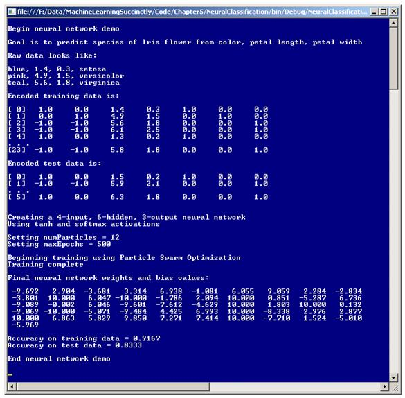
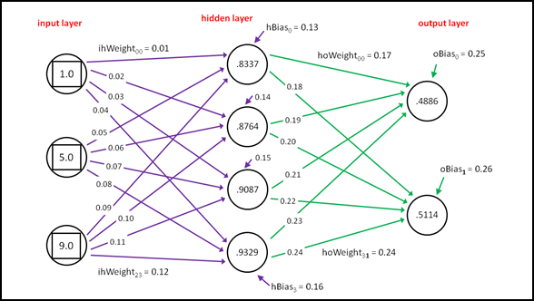
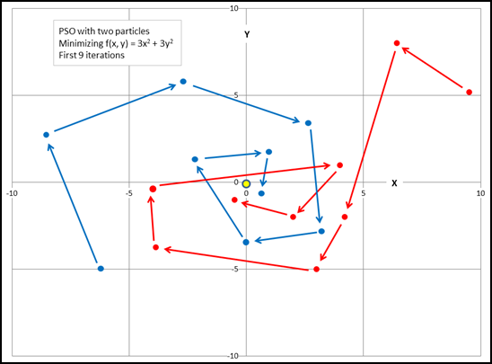

# 第五章神经网络分类

## 简介

神经网络是松散地模拟生物神经元和突触的软件系统。神经网络分类是所有机器学习中最有趣和复杂的课题之一。一种认为神经网络是一个复杂的数学函数，它接受一个或多个数字输入并产生一个或多个数字输出。



图 5-a:神经网络分类演示

了解神经网络的一个好方法是查看**图 5-a** 中演示程序的截图。演示的目标是创建一个模型，可以根据花的颜色、花瓣长度和花瓣宽度来预测鸢尾花的种类。

源数据集有 30 个项目。前三个数据项是:

蓝色，1.4，0.3，濑户
粉色，4.9，1.5，云芝
蓝绿色，5.6，1.8，弗吉尼亚

预测变量(也称为自变量、特征和 x 数据)在前三列。第一列是鸢尾花的颜色，可以是蓝色、粉色或青色。第二列和第三列是花的花瓣长度和宽度。第四列保存因变量，物种，可以是*濑户*、*云芝*或*弗吉尼亚*。

注:演示数据是一个模仿著名的真实数据集费希尔虹膜数据的人工数据集。Fisher 的真实数据集有 150 个项目，用萼片长度和萼片宽度代替颜色。(萼片是绿色的叶子状结构)。

因为神经网络在内部处理数字数据，分类颜色值和种类必须编码为数字值。演示假定这是在外部完成的。编码数据的前三行是:

[0]1.0 0.0 1.4 0.3 1.0 0.0 0.0
[1]0.0 1.0 4.9 1.5 0.0 1.0 0.0
[2]-1.0-1.0 5.6 1.8 0.0 0.0 1.0

物种值使用所谓的 1/N 虚拟编码进行编码。分类数据值 *setosa* 映射到数值(1，0，0)*云芝*映射到(0，1，0)*弗吉尼亚*映射到(0，0，1)。分类因变量还有其他几种不太常见的编码方案。

独立变量颜色值使用 1 对 1(*N*-1)效果编码进行编码。蓝色映射到(1，0)，粉色映射到(0，1)，青色映射到(-1，-1)。虽然也有替代方案，但在我看来，看起来有点不寻常的 1 对 1(T2)效应编码通常是用于分类预测变量的最佳方法。

使用 30 个项目的源数据，演示程序建立了一个 24 个项目的训练集，用于创建神经网络模型，以及一个 6 个项目的测试集，用于在呈现新的、以前看不到的数据时估计模型的准确性。

演示程序创建了一个四输入节点、六隐藏节点、三输出节点的神经网络。输入和输出节点的数量(四个和三个)由编码数据的结构决定。神经网络的隐藏节点数是一个自由参数，必须通过反复试验来确定。

神经网络有几十种变体。演示程序使用最基本的形式，这是一个完全连接的前馈架构，具有双曲正切(通常缩写为 tanh)隐藏层激活功能和 softmax 输出层激活功能。激活功能将很快解释。

在幕后，一个 4-6-3 的神经网络总共有(4)(6) + 6 + (6)(3) + 3 = 51 个数值，称为权重和偏差。这些权重决定了给定输入值集的输出值。训练神经网络是为权重和偏差找到最佳值集的过程，以便在提供训练数据时，计算的输出与已知输出紧密匹配。然后，当出现新数据时，神经网络使用找到的最佳权重进行预测。

有几种技术可以用来训练神经网络。到目前为止，最常见的技术叫做反向传播。事实上，反向传播训练非常普遍，以至于不熟悉神经网络的人有时会认为这是唯一的训练技术。演示程序使用了一种叫做粒子群优化的替代技术。

基本的粒子群优化训练只需要两个参数值。演示程序使用 12 个粒子，并设置最大训练循环计数为 500。这些参数将很快解释。

使用粒子群算法训练神经网络后，演示程序显示定义模型的 51 个权重和偏差的值。演示根据训练数据计算最终模型的精度为 91.67%(24 个正确中的 22 个)，根据测试数据计算精度为 83.33%(6 个正确中的 5 个)。83.33%的数字可以解释为对最终神经网络模型预测新的、以前未见过的鸢尾花种类的粗略估计。

## 理解神经网络分类

神经网络计算输出值的过程称为前馈机制。输出值由输入值、隐藏权重和偏置值以及两个激活函数决定。这个过程最好用一个具体的例子来解释。见**图 5-b** 中的图表。

该图显示了完全连接的 3-4-2 虚拟神经网络，这与演示问题不一致。虽然神经网络看起来有三层节点，但第一层，即输入层，通常不计算在内，因此图中的神经网络通常称为两层网络。

将一个节点连接到另一个节点的每个箭头代表一个权重值。每个隐藏的输出节点也有一个箭头，代表一个特殊的权重，称为偏差。神经网络的三个输入值为{ 1.0，5.0，9.0 }，两个输出值为{ 0.4886，0.5114 }。

前馈过程从计算隐藏节点的值开始。每个隐藏节点值都是一个激活函数，应用于输入节点值与其相关权重值的乘积之和加上节点的偏置值。例如，最顶部隐藏节点的值计算如下:

隐藏[0]总和=(1.0)(0.01)+(5.0)(0.05)+(9.0)(0.09)+0.13
= 0.01+0.25+0.81+0.13
= 1.20

隐藏[0]值= tanh(1.20)
= 0.8337(四舍五入)

虚拟神经网络使用双曲正切函数 tanh。tanh 函数接受任何实数值，并返回一个介于-1.0 和+1.0 之间的结果。隐藏层激活的 tanh 函数的主要替代是逻辑 sigmoid 函数。



图 5-b:神经网络前馈机制

接下来，以类似的方式计算每个输出节点。计算所有节点的初步输出值，然后组合这些初步值，以便所有输出节点值的总和为 1.0。在**图 5-b** 中，两个输出节点的初步输出值为:

output[0]prelim =(. 8337)(. 17)+(. 8764)(. 19)+(. 9087)(. 21)+(. 9329)(. 23)+. 25
= 0.9636
T2】output[1]prelim =(. 8337)(. 18)+(. 8764)(. 20)+(. 9087)(. 22)+(。

这两个初步输出值通过一个称为 softmax 函数的激活函数进行组合，得到最终输出值，如下所示:

输出[0]=*e*<sup>0.9636</sup>/(*e*<sup>0.9636</sup>+*e*<sup>1.0091</sup>)
= 2.6211/(2.6211+2.7431)
= 0.4886

输出[1] = *e*

使用 softmax 激活函数的目的是强制输出值求和为 1.0，以便它们可以被解释为 y 值的概率。

对于**图 5-b** 中的虚拟神经网络，有两个输出节点，所以假设这些节点对应于预测男性或女性，其中男性被虚拟编码为(1，0)，女性被编码为(0，1)。如果输出值(0.4886，0.5114)被解释为概率，较高的概率在第二个位置，因此输出值预测(0，1)，这是女性。

有两个输出值的二进制神经网络分类是一种特殊情况，可以并且通常与具有三个或更多输出值的问题区别对待。只有两个可能的 y 值，而不是使用两个输出节点和虚拟编码的 softmax 激活，您可以使用仅具有单个输出节点和 0-1 编码的 logistic sigmoid 函数。

逻辑 sigmoid 函数定义为 f(*z*)= 1.0/(1.0+*e*<sup>-*z*</sup>)。它接受任何实值输入，并返回 0.0 到 1.0 之间的值。因此，如果两个分类 y 值分别是男性和女性，您可以将男性编码为 0，女性编码为 1。你会创建一个只有一个输出节点的神经网络。计算单个输出节点的值时，可以使用逻辑 sigmoid 函数进行激活。结果将在 0.0 和 1.0 之间，例如 0.6775。在这种情况下，计算的输出 0.6775 更接近 1(女性)而不是 0(男性)，因此您会得出输出是女性的结论。

另一种非常常见的设计方案适用于任何类型的神经网络分类器。您可以将偏置值视为特殊权重，其隐藏的、虚拟的、恒定的关联输入值为 1.0，而不是对每个隐藏节点和输出节点使用单独的、不同的偏置值。在我看来，将偏差值视为具有不可见 1.0 输入的特殊权重在概念上没有吸引力，而且比仅将偏差值视为偏差值更容易出错。

## 演示程序总体结构

为了创建演示，我启动了 Visual Studio，并选择了新的 C#控制台应用程序模板。模板代码加载到编辑器后，我删除了源代码顶部的所有`using`语句，除了对顶层 System 命名空间的单一引用。在解决方案资源管理器窗口中，我将文件 Program.cs 重命名为更具描述性的 NeuralProgram.cs，Visual Studio 自动将类 Program 重命名为 NeuralProgram。

演示程序的整体结构在**清单 5-a** 中给出，为了节省空间做了一些小的修改。为了使示例代码的大小保持较小，并且主要思想尽可能清晰，演示程序省略了正常的错误检查。

```
    using System;
    namespace NeuralClassification
    {
      class NeuralProgram
      {
        static void Main(string[] args)
        {
          Console.WriteLine("Begin neural network demo");
          Console.WriteLine("Goal is to predict species of Iris flower");
          Console.WriteLine("Raw data looks like: ");
          Console.WriteLine("blue, 1.4, 0.3, setosa");
          Console.WriteLine("pink, 4.9, 1.5, versicolor");
          Console.WriteLine("teal, 5.6, 1.8, virginica \n");

          double[][] trainData = new double[24][];
          trainData[0] = new double[] { 1, 0, 1.4, 0.3, 1, 0, 0 };
          trainData[1] = new double[] { 0, 1, 4.9, 1.5, 0, 1, 0 };
          // etc.
          trainData[23] = new double[] { -1, -1, 5.8, 1.8, 0, 0, 1 };

          double[][] testData = new double[6][];
          testData[0] = new double[] { 1, 0, 1.5, 0.2, 1, 0, 0 };
          testData[1] = new double[] { -1, -1, 5.9, 2.1, 0, 0, 1 };
          // etc.
          testData[5] = new double[] { 1, 0, 6.3, 1.8, 0, 0, 1 };

          Console.WriteLine("Encoded training data is: ");
         ShowData(trainData, 5, 1, true);

          Console.WriteLine("Encoded test data is: ");
         ShowData(testData, 2, 1, true);

          Console.WriteLine("Creating a 4-input, 6-hidden, 3-output neural network");
          Console.WriteLine("Using tanh and softmax activations");
          const int numInput = 4;
          const int numHidden = 6;
          const int numOutput = 3;
          NeuralNetwork nn = new NeuralNetwork(numInput, numHidden, numOutput);

          int numParticles = 12;
          int maxEpochs = 500;
          Console.WriteLine("Setting numParticles = " + numParticles);
          Console.WriteLine("Setting maxEpochs = " + maxEpochs);

          Console.WriteLine("Beginning training using Particle Swarm Optimization");
          double[] bestWeights = nn.Train(trainData, numParticles,
            maxEpochs, exitError, probDeath);
          Console.WriteLine("Final neural network weights and bias values: ");
         ShowVector(bestWeights, 10, 3, true);

         nn.SetWeights(bestWeights);
          double trainAcc = nn.Accuracy(trainData);
          Console.WriteLine("Accuracy on training data = " + trainAcc.ToString("F4"));

          double testAcc = nn.Accuracy(testData);
          Console.WriteLine("Accuracy on test data = " + testAcc.ToString("F4"));

          Console.WriteLine("End neural network demo\n");
          Console.ReadLine();
        } // Main

        static void ShowVector(double[] vector, int valsPerRow, int decimals,
          bool newLine) { . . }

        static void ShowData(double[][] data, int numRows, int decimals,
          bool indices) { . . }

      } // Program class

      public class NeuralNetwork { . . }
    } // ns

```

清单 5-a:神经网络分类演示程序结构

所有的神经网络分类逻辑都包含在一个名为神经网络的程序定义类中。所有的程序逻辑都包含在 Main 方法中。Main 方法首先在数组样式矩阵中设置 24 个硬编码(颜色、长度、宽度、种类)数据项:

静态 void Main(字符串[]参数)

{

控制台。write line(" \ n 开始神经网络演示\ n ")；

控制台。WriteLine(“原始数据看起来像:\ n”)；

控制台。WriteLine("blue，1.4，0.3，setosa ")；

控制台。WriteLine(“粉色，4.9，1.5，杂色”)；

控制台。WriteLine("teal，5.6，1.8，virginica \ n ")；

double[][]train data = new double[24][]；

trainData[0] = new double[] { 1，0，1.4，0.3，1，0，0 }；

trainData[1] = new double[] { 0，1，4.9，1.5，0，1，0 }；

trainData[2] = new double[] { -1，-1，5.6，1.8，0，0，1 }；

。。。

演示程序假设蓝色、粉色和青色的颜色值已被手动或编程转换为 1-of-( *N* -1)编码形式，并且三个物种值已被转换为 1-of- *N* 编码形式。

为简单起见，演示没有规范化花瓣长度和宽度的数值。这在这里是可以接受的，因为它们的幅度都在 0.2 和 7.0 之间，足够接近 1/1(T0)N-1)编码颜色值的-1、0 和+1 值，使得两个特征都不会支配另一个。在大多数情况下，您应该规范化您的数据。

接下来，演示创建了六个硬编码的测试数据项:

double[][] testData =新 double[6][]；

testData[0] = new double[] { 1，0，1.5，0.2，1，0，0 }；

testData[1] = new double[] { -1，-1，5.9，2.1，0，0，1 }；

testData[2] = new double[] { 0，1，1.4，0.2，1，0，0 }；

testData[3] = new double[] { 0，1，4.7，1.6，0，1，0 }；

testData[4] = new double[] { 1，0，4.6，1.3，0，1，0 }；

testData[5] = new double[] { 1，0，6.3，1.8，0，0，1 }；

在一个非演示场景中，训练和测试数据将使用一个名为 MakeTrainTest 或 SplitData 的实用方法从源数据集以编程方式生成。

在使用静态助手方法 ShowData 显示了几行训练和测试数据之后，演示程序创建并实例化了一个程序定义的神经网络分类器对象:

控制台。WriteLine(" \ n 创建一个 4 输入、6 隐藏、3 输出的神经网络")；

控制台。WriteLine(“使用 tanh 和 softmax 激活\ n”)；

int numInput = 4：

int num hidden = 6；

int numoutput = 3：

neural network nn = new neural network(num input、numHidden、num output)；

有四个输入节点来容纳 1/1(T0)N-1)编码颜色的两个值，加上花瓣长度和宽度。有三个输出节点来容纳 1-of- *N* 编码的三个物种值:*濑户*、*云芝*和*海滨*。确定要使用的隐藏节点数量基本上是一个反复试验的问题。

接下来，训练神经网络:

int numParticles = 12

int maxepochs = 500

控制台。WriteLine("设置 numparentles =+numparentles ")；

控制台。WriteLine("设置 maxEpochs =+maxEpochs)；

控制台。WriteLine(" \ n 使用粒子群优化开始训练")；

double[] bestWeights = nn。培训(培训数据、文章数量、最大时代)；

控制台。WriteLine(“培训完成\ n”)；

控制台。WriteLine("最终神经网络权重和偏差值:")；

ShowVector(bestWeights，10，3，true)；

演示程序使用粒子群优化算法进行训练。粒子群算法有很多变体，但演示使用了最简单的形式，只需要虚拟粒子的数量和主优化循环的最大迭代次数。

训练完成后，找到的最佳权重存储在神经网络对象中。为了方便起见，训练方法还显式返回找到的最佳权重。使用辅助方法 ShowVector 显示 51 个权重和偏差值。演示程序不保存定义模型的权重值，因此您可能想要编写一个 SaveWeights 方法。

演示程序通过计算最终模型的分类精度得出结论:

。。。
nn。设置权重(最佳权重)；

双重训练 Acc = nn。准确性(训练数据)；

控制台。write line(" \ n 对训练数据的控制=+train ACC。ToString(" F4 ")；

double testAcc = nn。准确性(测试数据)；

控制台。WriteLine("测试数据的准确性=+test cc。ToString(" F4 ")；

控制台。write line(" \ nAnD 神经网络演示\ n ")；

控制台。ReadLine()；

} // Main

请注意，因为找到的最佳权重存储在 NeuralNetwork 对象中，所以实际上没有必要调用方法 SetWeights。

演示程序不使用该模型来预测具有未知物种的新数据项。预测可能看起来像:

double[] unknown = new double[] { 1，0，1.9，0.5 }；//蓝色，花瓣= 1.9，0.5
nn。设置权重(最佳权重)；
弦种= nn。预测(未知)；
控制台。WriteLine(“预测物种为”+物种)；

## 定义神经网络类

程序定义的神经网络类的结构在**清单 5-b** 中给出。数据成员数组`inputs`保存 x 值。成员矩阵`ihWeights`保存输入到隐藏的权重。例如，如果`ihWeights[0][2]`为 0.234，则连接输入节点 0 和隐藏节点 2 的权重值为 0.234。

```
    public class NeuralNetwork
    {
      private int numInput;   // number of input nodes
      private int numHidden; // number of hidden nodes
      private int numOutput; // number of output nodes

      private double[] inputs;
      private double[][] ihWeights; // input-hidden
      private double[] hBiases;
      private double[] hOutputs;

      private double[][] hoWeights; // hidden-output
      private double[] oBiases;
      private double[] outputs;

      private Random rnd;

      public NeuralNetwork(int numInput, int numHidden, int numOutput) { . . }
      private static double[][] MakeMatrix(int rows, int cols)

      public void SetWeights(double[] weights) { . . }

      public double[] ComputeOutputs(double[] xValues) { . . }
      private static double HyperTan(double x) { . . }
      private static double[] Softmax(double[] oSums) { . . }

      public double[] Train(double[][] trainData, int numParticles, int maxEpochs) { . . }
      private void Shuffle(int[] sequence) { . . }
      private double MeanSquaredError(double[][] trainData, double[] weights) { . . }

      public double Accuracy(double[][] testData) { . . }
      private static int MaxIndex(double[] vector) { . . }

      // ----------------------------------------------
      private class Particle { . . }
      // ----------------------------------------------
    }

```

清单 5-b:神经网络类

成员数组`hBiases`保存隐藏的节点偏置值。成员数组`hOutputs`保存应用隐藏层 tanh 函数后隐藏节点的值。在计算它们之后，这些值在计算输出层节点时充当本地输入。

成员矩阵`hoWeights`保存隐藏到输出节点的权重。成员数组`oBiases`保存输出节点的偏置值。成员数组`outputs`保存最终的输出节点值。成员`rnd`是一个随机对象，在粒子群算法训练过程中使用。

神经网络类只有一个构造函数。构造函数调用静态辅助方法 MakeMatrix，只是为了方便分配`ihWeights`和`hoWeights`矩阵。构造函数代码很简单:

公共神经网络(int numInput、int numHidden、int numOutput)

{

this.numInput = numInput：

此. numhidden = numhidden

this.numOutput = numOutput

this . inputs = new double[NumInput]；

this . ihweights = make matrix(NumInput，NumHidden)；

this . hbiases = new double[NumHidden]；

this . HoutPuts = new double[NumHidden]；

this . howelights = MakeMatrix(NumHidden，NuMoutPut)；

this . obiasses = new double[NuMoutPut]；

this . outputs = new double[NuMoutPut]；

this . rnd = new Random(0)；

}

随机对象`rnd`被实例化为种子值 0，仅仅是因为该值给出了代表性的演示运行。您可能想尝试不同的种子值。

方法计算输出实现了前馈机制。定义开始于:

公共 double[]ComputeOutputs(double[]xValues)

{

double[] hSums =新的 double[numHidden]；//隐藏节点对暂存数组求和

double[] oSums =新的 double[NuMoutPut]；//输出节点求和
。。。

回想一下，隐藏节点和输出节点是分两步计算的。首先，计算乘积之和，然后应用激活函数。数组`hSums`和`oSums`保存乘积之和。另一种设计是将`hSums`和`oSums`声明为类范围数组，以避免在每次调用计算输出时分配它们。但是，如果这样做，您必须记住在 ComputeOutputs 中显式地将两个数组清零。

接下来，计算输出将 x 数据参数值传输到类`inputs`数组中:

for(int I = 0；i < xValues。长度；++(I)//将 x 值复制到输入

this . inputs[I]= XVaLues[I]；

一个非常重要的设计选择是从 NeuralNetwork 定义中删除类`inputs`数组，并直接使用 x 数据值。这以牺牲清晰度为代价，节省了将值复制到`inputs`的开销。

接下来，使用前馈机制计算隐藏节点值:

for(int j = 0；j < numHidden++j) //权重之和*输入

for(int I = 0；i < numInput++i)

hSums[j]+= this . inputs[I]* this . ihweights[I][j]；// note +=

for(int I = 0；i < numHidden++i) //添加偏差

hSums[I]+= this . hbiases[I]；

for(int I = 0；i < numHidden++(I)//应用激活

this . hout puts[I]= HyperTan(HSums[I])；

这里，双曲正切函数被硬编码到类定义中。另一种设计是将隐藏层激活函数作为参数传入。这以显著增加的设计复杂性为代价，提供了额外的调用灵活性。

辅助方法 HyperTan 的定义如下:

私有静态双 HyperTan(双 x)

{

if (x < -20.0)

return-1.0；//近似值精确到 30 位小数

否则如果(x > 20.0)

返回 1.0；

否则返回数学。tanh(x)；

}

虽然可以只调用内置方法 Math。Tanh 直接，演示首先检查输入值 x，因为对于 x 的小值或大值，tanh 函数返回的值分别非常接近 0.0 或 1.0。

计算隐藏节点值后，方法计算输出层节点值:

for(int j = 0；j < numOutput++j) //权重之和* hOutputs

for(int I = 0；i < numHidden++i)

osum[j]+= hout puts[I]* how lights[I][j]；

for(int I = 0；i < numOutput++(I)//增加输入到隐藏和的偏差

osum[I]+= oBiases[I]；

double[]softOut = soft max(oSums)；//一次输出所有输出，提高效率

数组。复制(软输出，输出，软输出。长度)；

计算 softmax 输出有点微妙。如果您参考 softmax 工作原理的解释，您会注意到计算需要所有的初步输出，因此与一次激活一个的隐藏节点不同，输出节点是作为一个组激活的。

助手方法 Softmax 的定义是:

私有静态 double[] Softmax(double[] oSums)

{

//确定最大输出和

double max = OSUMs[0]；

for(int I = 0；i < oSums。长度；++i)

if(OsUMs[I]> max)max = OsUMs[I]；

//确定比例因子 exp 之和(每个值-最大值)

双刻度= 0.0；

for(int I = 0；i < oSums。长度；++i)

比例尺+=数学。exp(Osums[I]-max)；

double[]结果=新的 double[oSums。长度]；

for(int I = 0；i < oSums。长度；++i)

结果[i] =数学。Exp(oSums[i] -最大值)/刻度；

返回结果；//现在缩放，使 xi 求和为 1.0

}

方法 Softmax 很短，但相当棘手。不是使用直接定义来计算 softmax 输出，Softmax 方法使用了一些巧妙的数学方法。间接实现给出了与定义相同的结果，但避免了潜在的算术下溢或上溢问题，因为直接定义计算中的中间值可能非常接近 0.0。

## 理解粒子群优化算法

训练神经网络最常见的技术叫做反向传播。反向传播基于经典的微积分技术，概念上很复杂，但实现起来相对简单。反向传播的主要缺点是，它需要您指定两个参数的值，称为学习速率和动量。反向传播对这些参数值异常敏感，这意味着即使微小的变化也会产生巨大的影响。

粒子群优化算法(PSO)也需要参数值，但比反向传播算法灵敏度低得多。使用粒子群算法进行训练的主要缺点是，它通常比使用反向传播慢。

粒子群优化算法松散地模拟了协调的群体行为，例如鸟类的成群结队。粒子群算法维护一组虚拟粒子，其中每个粒子代表一个问题的潜在最佳解决方案，在神经网络的情况下，这是一组权重和偏差的值，可以最小化一组训练数据中计算的输出值和已知输出值之间的误差。

用非常高级的伪代码表示，粒子群算法看起来像:

初始化 n 个粒子到随机的解/位置和速度
循环直到完成
对于每个粒子
基于最佳已知位置计算新的速度
使用新的速度将粒子移动到新的位置/解
结束
结束循环
返回任何粒子找到的最佳解/位置

**图 5-c** 说明了粒子群算法。在一个简单的例子中，一个解由两个值组成，比如(1.23，4.56)，你可以把一个解看作(x，y)平面上的一个点。该图显示了两个粒子。在大多数情况下，会有许多粒子。目标是最小化函数 f(x，y) = 3x <sup>2</sup> + 3y <sup>2</sup> 。解是 x = y = 0.0，所以问题其实不需要 PSO 这个例子只是为了说明粒子群算法是如何工作的。



图 5-c:粒子群优化的例子

左下方的第一个粒子以随机生成的初始解(-6.0，-5.0)和随机初始速度(方向)值开始，这些值将粒子向上和向左移动。右上角的第二个粒子具有随机初始值(9.5，5.1)和将粒子向上和向左移动的随机初始速度。

该图显示了每个粒子在主粒子群算法循环的前九次迭代中是如何移动的。每个粒子的新位置受其当前方向、粒子在任何时间找到的最佳位置以及任何粒子在任何时间找到的最佳位置的影响。最终的结果是，粒子趋向于以协调的方式运动，并收敛到一个好的，希望是最优的解决方案。在图中，您可以看到两个粒子都很快非常接近(0，0)的最优解。

用数学术语来说，更新粒子速度和位置的粒子群算法方程是:

**v**(t+1)=(w ***v**(t))+(C1 * R1 *(T4)p(t)–**x**(t))+(C2 * R2 *(T8)g(t)–**x**(t))

**x**(t+1)=**x**(t)+**v**(t+1)

位置更新过程实际上比这些等式显示的要简单得多。第一个方程更新了粒子的速度。术语 **v** (t+1)是指时间 t+1 的速度。注意 **v** 是粗体，表示速度是一个矢量值，有多个分量，比如(1.55，-0.33)，而不是单个标量值。

新的速度取决于三个条件。第一项是 w * **v** (t)。w 因子称为惯性权重，只是一个常数，如 0.73(稍后将详细介绍)，而 **v** (t)是时间 t 的当前速度。第二项是 C1 * R1 *(T4)p(t)–**x**(t))。c1 因子是一个常数，称为认知(或个人)权重。r1 因子是[0，1]范围内的随机变量，大于或等于 0，严格小于 1。 **p** (t)向量值是到目前为止找到的粒子的最佳位置。 **x** (t)矢量值是粒子的当前位置。

速度更新方程中的第三项是(C2 * R2 *(T0)g(t)–**x**(t))。c2 因子是一个常数，称为社会(或全球)权重。r2 因子是[0，1]范围内的随机变量。 **g** (t)向量值是迄今为止群中任何粒子找到的已知最佳位置。一旦新的速度 **v** (t+1)被确定，它被用来计算新的粒子位置 **x** (t+1)。

一个具体的例子将有助于明确更新过程。假设您正在尝试最小化 f(x，y) = 3x <sup>2</sup> + 3y <sup>2</sup> 。假设粒子的当前位置 **x** (t)，为(x，y) = (3.0，4.0)，粒子的当前速度 **v** (t)，为(-1.0，-1.5)。另外，假设常数 w = 0.7，常数 c1 = 1.4，常数 c2 = 1.4，随机数 r1 和 r2 分别为 0.5 和 0.6。最后，假设粒子当前的最佳已知位置为 **p** (t) = (2.5，3.6)，群中任意粒子当前找到的全局最佳已知位置为 **g** (t) = (2.3，3.4)。那么新的速度值是:

**v**(t+1)=(0.7 *(1.0，-1.5)) + (1.4 * 0.5 * (2.5，3.6) - (3.0，4.0)) + (1.4 * 0.6 * (2.3，3.4)–(3.0，4.0))
= (-0.70，-1.05) + (-0.35，-0.28) + (-0.59，-0.50)】

现在，新的速度被添加到当前位置，以给出粒子的新位置:

**x** (t+1) = (3.0，4.0) + (-1.64，-1.83)
= (1.36，2.17)

回想一下最优解是(x，y) = (0，0)。请注意，更新过程已将旧位置或解决方案从(3.0，4.0)改进为(1.36，2.17)。如果您检查更新过程，您将看到新速度是旧速度(乘以权重)加上一个取决于粒子最佳已知位置的因子，再加上另一个取决于群中所有粒子最佳已知位置的因子。因此，基于粒子的最佳已知位置和所有粒子的最佳已知位置，粒子的新位置往往会向更好的位置移动。

## 使用粒子群算法进行训练

方法培训的实施开始于:

公共双[]列车(双[][]列车数据，整数，整数)

{

int NumWrites =(this . NumPut * this . NumHidden)+this . NumHidden+

(this . numhidden * this . numutput)+this . numutput；
。。。

方法训练假设训练数据有被预测的因变量，在演示的情况下是鸢尾花种类，存储在矩阵的最后一列`trainData`。接下来，设置相关的局部变量:

int epoch = 0；

double minX =-10.0；//对于每个重量

double maxX = 10.0

双 w = 0.729//惯性重量

double c1 = 1.49445//认知权重

double c2 = 1.49445//社交权重

双 r1、R2；//认知和社会随机化

变量`epoch`是主循环计数器变量。变量`minX`和`maxX`为每个权重和偏差值设置限制。以这种方式设定限制被称为体重限制。一般来说，您应该只对已经标准化的 x 数据使用权重限制，或者大小大致在-10.0 和+10.0 之间的数据。

称为惯性权重的变量`w`包含一个值，该值会影响粒子在其当前方向上保持运动的程度。变量`c1`和`c2`保存的值决定了粒子的最佳已知位置以及群中任何粒子的最佳已知位置的影响。这里用到的`w`、`c1`、`c2`的数值都是研究推荐的数值。

接下来，创建群:

粒子[]群=新粒子[n 粒子]；

double[]best global position = new double[NumWrites]；

double bestGlobalError = double。MaxValue(最大值)：

类`Particle`的定义在**清单 5-c.** 中给出。

```
    private class Particle
    {
      public double[] position; // equivalent to NN weights
      public double error; // measure of fitness
      public double[] velocity;

      public double[] bestPosition; // best position found so far by this Particle
      public double bestError;

      public Particle(double[] position, double error, double[] velocity,
        double[] bestPosition, double bestError)
      {
        this.position = new double[position.Length];
        position.CopyTo(this.position, 0);
        this.error = error;
        this.velocity = new double[velocity.Length];
        velocity.CopyTo(this.velocity, 0);
        this.bestPosition = new double[bestPosition.Length];
        bestPosition.CopyTo(this.bestPosition, 0);
        this.bestError = bestError;
      }
    }

```

清单 5-c:粒子类定义

粒子类是一个容器类，它保存了与位置相关的虚拟位置、速度和误差。一个次要的设计选择是使用结构而不是类。演示程序在类神经网络中定义了类粒子。如果您将演示代码重构为不支持嵌套类的另一种编程语言，您将不得不将粒子类定义为独立的类。

方法训练用他的代码初始化粒子群:

for(int I = 0；我< swarm。长度；++i)

{

double[]rand composition = new double[NumWrites]；

for(int j = 0；j

随机[j] = (maxX - minX) * rnd。nextdouble()+minx；

双误差=均值平方误差(训练数据，随机成分)；

double[] randomVelocity =新的 double[NumWrites]；

for(int j = 0；j < randomVelocity。长度；++j)

{

双 lo = 0.1 * minx；

double hi = 0.1 * maxX

随机速度[j] = (hi - lo) * rnd。nextdouble()+lo；

}

粒子群[i] =新粒子(随机组成，误差，随机速度，

随机组合，错误)；

//当前粒子是否有全局最佳位置/解？

if(swarm[I]. error < best global error)

{

bestGlobalError = swarm[i]。错误：

swarm[I]. position . copy to(best global position，0)；

}

}

这里发生了很多事情，所以您可能希望将代码重构为一个名为 InitializeSwarm 的方法。对于每个粒子，根据`minX`和`maxX`约束生成一个随机位置。随机位置被馈送给辅助方法均值平方误差，以确定相关误差。一个重要的设计选择是使用一种不同形式的误差，称为平均交叉熵误差。

因为粒子速度由添加到粒子当前位置的值组成，所以初始随机速度值被设置为小于(平均为十分之一)初始位置值。0.1 比例因子在很大程度上是任意的，但在实践中运行良好。

创建随机位置和速度后，这些值被输入到`Particle`构造器。乍一看，对构造函数的调用可能有点奇怪。最后两个参数表示找到的粒子最佳位置以及与该位置相关的误差。因此，在粒子初始化时，这些最佳值是初始位置和误差值。

初始化群后，方法 Train 开始主循环，它使用粒子群算法来寻找一组最佳权重:

int[]序列= new int[NumParticles]；//以随机顺序处理粒子

for(int I = 0；I

序列[I]= I；

while(纪元

{

double[] newVelocity =新的 double[NumWrites]；

double[]new position = new double[NumWrites]；

double newError

Shuffle(序列)；
。。。

一般来说，在使用粒子群算法时，最好以随机顺序处理虚拟粒子。局部数组`sequence`保存粒子的索引，并且使用辅助方法 Shuffle 对索引进行随机化，该方法使用 Fisher-Yates 算法:

私有 void Shuffle(int[]序列)

{

for(int I = 0；I

{

int ri = rnd。下一步(I，序列。长度)；

int tmp = sequence[ri]；

序列[ri] =序列[I]；

序列[I]= tmp；

}

}

主处理循环执行固定的`maxEpochs`次。一个重要的替代方法是，如果当前最佳误差低于某个小值，则提前退出。代码可能类似于:

if (bestGlobalError < exitError)

打破；

这里，`exitError`将作为参数传递给方法 Train 或粒子构造函数。训练方法继续更新每个粒子。第一步是根据当前速度、粒子的最佳已知位置和群的最佳已知位置计算新的随机速度(速度和方向):

for(int pi = 0；pi < swarm。长度；++(pi)//每个粒子(索引)

{

int i =序列[pi]；

粒子 CurP = swarm[I]；//为了方便编码

for(int j = 0；j

{

r1 = rnd。nextdouble()；

r2 = rnd。nextdouble()；

new Velocity[j]=(w * CurP . Velocity[j])+

(c1 * r1 *(最高职位[j] -最高职位[j])+

(C2 * R2 *(best global position[j]-CurrP . position[j])；

}

新速度。CopyTo(currP.velocity，0)；

这段代码是粒子群算法的核心，您不太可能需要修改它。计算出粒子的新速度后，该速度用于计算粒子的新位置，该位置代表神经网络的一组权重和偏差值:

for(int j = 0；j

{

new position[j]= CurrP . position[j]+NewVelocity[j]；//计算新位置

if (newPosition[j] < minX) //保持在范围内

new position[j]= minx；

else if (newPosition[j] > maxX)

new position[j]= MaxX；

}

newPosition。CopyTo(currP.position，0)；

注意新位置受`minX`和`maxX`约束，本质上是实现神经网络权值约束。一个次要的设计选择是移除这个约束机制。确定当前粒子的新位置后，计算与该位置相关的误差:

new error = means squared error(train data，newPosition)：

currP.error = newError

如果(newError < currP.bestError) //新粒子最好？

{

新位置。copy to(curp . best position，0)；

currp . best error = new error；

}

if(new error < best global error)//new global best？

{

newPosition。CopyTo(bestGlobalPosition，0)；

bestGlobalError = newError

}

此时，方法 Train 已经完成了对每个粒子的处理，因此主循环计数器变量被更新。一个重要的设计增加是实现模拟粒子死亡的代码。这个想法是用小概率杀死一个粒子，然后在一个随机的位置诞生一个新的粒子。这有助于防止群体陷入非最优解，冒着杀死好粒子(正在向最优解移动的粒子)的风险。

主循环结束后，方法 Train 结束。找到的最佳位置(权重)被复制到神经网络的权重和偏差矩阵和数组中，使用类方法设置权重，并且这些最佳权重也被显式返回:

。。。

SetWeights(BestGlobalPosition)；//最佳位置是一组权重

double[]retriesult = new double[NumWrites]；

数组。复制(最佳全局位置，检索结果，检索结果。长度)；

返回 retResult

} //火车

本章末尾完整的演示程序源代码中介绍了方法集权重。请注意，所有权重和偏差值都存储在一个数组中，该数组对应于任何粒子找到的最佳位置。这意味着权重有一个隐含的顺序。演示程序假设先存储输入到隐藏权重，然后存储隐藏节点偏差，接着存储隐藏到输出权重，最后存储输出节点偏差。

## 其他场景

本章介绍了理解和实现神经网络系统所需的所有关键信息。您可能希望研究许多额外的高级主题。使用神经网络时最大的挑战是避免过度拟合。当神经网络被训练成使得所得模型对训练数据具有完美或接近完美的精度，但是模型在呈现新数据时预测不佳时，就会发生过拟合。拿出测试数据集有助于识别何时发生了过度拟合。一种密切相关的技术叫做*k*-折叠交叉验证。不是将源数据分成两组，而是将数据分成 *k* 组，其中 *k* 通常为 10。

处理过度拟合的另一种方法是将源数据分成三个集合:训练集、验证集和测试集。使用训练数据来训练神经网络，但是在训练期间，当前的一组权重和偏置值被周期性地应用于验证数据。训练和验证数据的误差通常会在训练过程中减少，但是当过度拟合开始出现时，验证数据的误差会开始增加，表明训练应该停止。然后，将最终模型应用于测试数据，以获得模型精度的粗略估计。

一种相对较新的处理过拟合的技术叫做脱落训练。当每个训练项目被呈现给神经网络时，一半的隐藏节点被忽略。这防止了隐藏节点之间的相互适应，并产生了一个可以很好地推广的健壮模型。退出训练也可以应用于输入节点。一个相关的想法是向输入值添加随机噪声。这有时被称为抖动。

具有多层隐藏节点的神经网络通常被称为深度神经网络。理论上，具有单一隐藏层的神经网络可以解决大多数分类问题。这是所谓的普遍近似定理的一个结果，或者有时是赛本科定理。然而，对于一些问题，如语音识别，深度神经网络可以比普通神经网络更有效。

本章介绍的神经网络使用均方误差测量误差。一些研究证据表明，一种被称为交叉熵误差的替代措施可以生成更精确的神经网络模型。在我看来，支持交叉熵误差优于均方误差的研究是相当令人信服的，但是使用交叉熵误差所获得的改进是小的。尽管交叉熵误差有明显的优越性，但均方误差的使用似乎更普遍。

普通的神经网络被称为前馈网络，因为当计算输出值时，信息从输入节点流向隐藏节点，再流向输出节点。可以设计神经网络，其中一些或所有的隐藏节点都有一个额外的连接来反馈给它们自己。这些被称为递归神经网络。