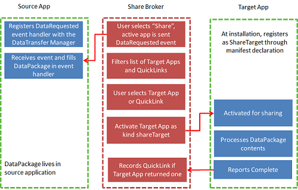
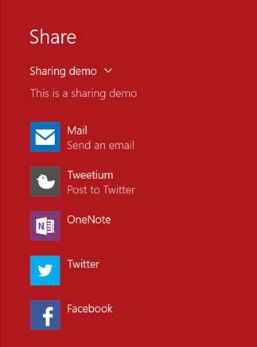
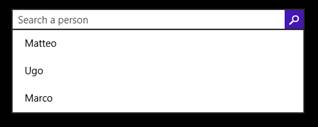
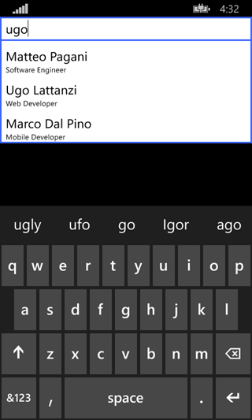
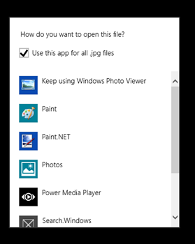

# 第四章合同和延期

## 合同

契约是由视窗运行时提供的机制，用于连接两个第三方应用程序，以便它们可以交换数据。有两种合同:

*   源合同，由希望共享某些数据的应用程序实现
*   目标合同，由希望接收共享数据的应用程序实现

关于合同最重要的特征是它们对开发者是完全透明的。源应用程序不必知道任何关于将接收数据的目标的信息。同样，目标应用程序能够在不了解源应用程序的情况下接收共享数据。

### 共享合同

共享合同用于共享任何种类的数据(例如，文本、图像、文件等)。)在两个应用程序之间。下图显示了共享合同的工作原理:



图 9:共享契约的架构

每当用户选择共享某些数据时，源应用程序都会注册自己以获得通知。在这个事件处理程序中，我们将定义要共享的内容。然后，是操作系统处理下一步操作的时候了。它将显示一个列表，其中包含所有已注册共享目标合同并且能够支持我们正在共享的数据类型的应用程序。最后一步是执行真正的共享操作，由目标 app 执行。它将接收共享数据，并负责处理它。在本章的其余部分，我们将详细研究如何实现源和目标共享契约。

#### 激活共享

说到分享一些内容和显示目标应用列表，Windows 和 Windows Phone 有一个重要的区别。Windows 提供了一种内置的方式来触发共享操作，这就是位于“魅力”栏内的“共享”按钮。另一方面，Windows Phone 不提供 Charms 栏，因此由我们来定义触发共享操作的最佳方式(例如，通过在应用栏中放置特定按钮)。开始共享操作很容易。你只需要调用`DataTransferManager`类的`ShowShareUI()`方法(这是`Windows.ApplicationModel.DataTransfer`命名空间的一部分)，这是我们将要用来与共享契约交互的主要类。

```
    private void OnShareItemClicked(object sender, RoutedEventArgs e)
    {
    DataTransferManager.ShowShareUI();
    }

```

然而，这段代码也适用于 Windows。调用`ShowShareUI()`方法将获得与按下魅力栏中的共享按钮相同的结果。

#### 共享内容

共享操作在页面级别执行，因为每个页面可以共享不同种类的内容。因此，每个页面都有自己的`DataTransferManager`类实例，它是使用`GetForCurrentView()`方法检索的。由于在 Windows 中，共享操作可以在应用程序之外触发(通过使用魅力栏)，`DataTransferManager`类提供了一个名为`DataRequest`的特定事件，每次启动共享操作时都会触发该事件。我们将在这个事件处理程序中定义要共享的内容，如下例所示:

```
    public sealed partial class MainPage : Page
    {
    public MainPage()
    {
    this.InitializeComponent();
    DataTransferManager transferManager = DataTransferManager.GetForCurrentView();
    transferManager.DataRequested += transferManager_DataRequested;
    }

    private void transferManager_DataRequested(DataTransferManager sender, DataRequestedEventArgs args)
    {
    //manage the sharing operation
    }
    }

```

事件处理程序包含一个参数，其类型为`DataRequestedEventArgs`。这是我们共享操作的核心，因为借助`Request.Data`对象，它允许我们定义请求的所有属性。不管我们想要共享的内容类型是什么，在`Properties`对象中总有两个属性是必需的:`Title`和`Description`。

它们在 Windows 上特别有用，因为这些信息显示为共享面板的标题。由于用户可以在应用程序之外触发共享操作，因此向用户突出显示他或她将共享哪种内容非常重要:

```
    private void transferManager_DataRequested(DataTransferManager sender, DataRequestedEventArgs
    args)
    {
    args.Request.Data.Properties.Title = "Sharing demo";
    args.Request.Data.Properties.Description = "This is a sharing demo";
    }

```



图 10:窗口中的共享面板

定义了标题和描述之后，就该定义真正的内容了。`Request.Data`对象提供了许多以 Set 前缀开头的方法。每一个都代表了您可以共享的一种数据类型。让我们看一些最常见的例子。

#### **共享文本**

可以使用`SetText()`方法共享文本，该方法只接受要共享的字符串，如下例所示:

```
    private void transferManager_DataRequested(DataTransferManager sender, DataRequestedEventArgs
    args)
    {
    args.Request.Data.Properties.Title = "Sharing demo";
    args.Request.Data.Properties.Description = "This is a sharing demo";
    args.Request.Data.SetText("This is a demo text");
    }

```

#### 共享链接

链接只是一个字符串。然而，一些应用程序能够以一种特殊的方式管理它。例如，Windows 8.1 中的“人物”应用程序能够在社交网络上共享链接之前自动生成网站预览。用于共享链接的方法称为`SetWebLink()`，它只需要一个统一资源标识符(`Uri` `)`)对象作为参数，对象的地址如下例所示:

```
    void transferManager_DataRequested(DataTransferManager sender, DataRequestedEventArgs args)
    {
    args.Request.Data.Properties.Title = "Sharing demo";
    args.Request.Data.Properties.Description = "This is a link to share";
    Uri url = new Uri("http://wp.qmatteoq.com", UriKind.Absolute);
    args.Request.Data.SetWebLink(url);
    }

```

#### 共享文件

共享文件是最常用的功能之一，因为所有复杂的数据(如图像)都被操作系统视为文件。

|  | 注意:请求。数据对象提供了一种共享图像的特定方法，称为 SetBitmap()。但是，它在 Windows Phone 中是没有用的，因为所有的原生应用程序都不管理它；相反，他们将它们视为常规文件。因此，我们不会在本书中讨论这种方法的使用。 |

然而，在向您展示如何在应用程序中共享文件之前，有一个重要的概念需要介绍:异步操作。如果您已经阅读了第 5 章(关于管理本地存储)。您将知道所有的存储 API 都是异步的，并且基于“异步和等待”模式。因此，在共享操作中，操作系统将无法确定文件何时准备好以及共享合同何时可以激活。如果您记得第 4 章中解释的应用程序的生命周期，当您需要在暂停事件期间保存应用程序的状态时，也会出现类似的情况。

为了避免这个问题，我们将使用相同的机制，即使用延迟对象。在这种情况下，它的类型是`DataRequestDeferral`，由`Request`对象提供的`GetDeferral()`方法提供。获取对该对象的引用后，您将能够执行任何异步操作。一旦操作完成，你只需要记住调用`Complete()`方法。让我们来看看如何结合共享一个或多个文件的方法来使用这种方法，称为`SetStorageItems()`:

```
    async void transferManager_DataRequested(DataTransferManager sender, DataRequestedEventArgs args)
    {
    args.Request.Data.Properties.Title = "Sharing demo";
    args.Request.Data.Properties.Description = "This is a file sharing demo";
    DataRequestDeferral deferral = args.Request.GetDeferral();
    List<StorageFile> files = new List<StorageFile>();
    StorageFile file = await ApplicationData.Current.LocalFolder.GetFileAsync("text.txt");
    files.Add(file);
    args.Request.Data.SetStorageItems(files);
    deferral.Complete();
    }

```

我们要做的第一件事是使用`Request`对象提供的`GetDeferral()`方法(这是该方法参数的属性之一)获取对`DataRequestDeferral`对象的引用。然后，我们检索对要共享的文件的引用。在前面的文件中，我们想要共享一个名为 **text.txt** 的文本文件，该文件存储在本地存储器中。为了执行共享，我们调用`Request.Data`对象的`SetStorageItems()`方法，将要共享的文件列表作为参数传递。这个方法总是需要一个集合，所以我们总是需要创建一个列表(即使像前面的例子一样，我们只共享一个文件)。最后，我们通过调用`DataRequestDeferral`对象暴露的`Complete()`方法完成异步操作。

#### 从其他应用程序接收内容

从另一个应用程序接收一些内容需要您订阅操作系统提供的合同之一。因此，在编写一些代码之前，我们需要在名为**声明**的部分的清单文件中注册合同。在**可用声明**下拉菜单中，您将找到所有可用合同和延期的列表。我们的场景需要的一个叫做**共享目标**，它需要我们设置两条信息:

*   我们希望支持的数据类型，可以是:
*   文本
*   上呼吸道感染
*   超文本标记语言
*   存储项目(用于文件)
*   如果我们希望能够接收文件，我们还需要通过设置标题为**支持的文件类型**的部分来指定我们将支持的类型。(我们需要为我们想要支持的每种类型按下**添加新的**按钮，并指定文件的扩展名。否则，我们可以简单地启用**支持任何文件类型**选项，以能够接收任何文件的类型)

下一步是管理共享操作。通常，当我们的应用程序被选为共享目标时，会打开该应用程序的特定页面。它将提供将要共享的内容的预览，并允许用户确认或取消操作。因此，您将找不到任何关于如何定义共享页面布局的示例。这取决于您和您希望能够共享的内容，以定义最适合您需求的布局。例如，如果您的应用程序允许用户共享图像，共享页面可能会显示缩略图。或者，如果你的应用程序可以收到链接，它可以显示网站的预览。

当一个目标应用被股份合约激活时，它不遵循传统应用的生命周期。因此，`App`类的`OnLaunched()`方法不会像使用主图块打开应用程序时那样被触发。在共享场景中，通过调用`OnShareTargetActivated()`方法激活应用程序，该方法可以在`App`类中声明，如下例所示:

```
    protected override void OnShareTargetActivated(ShareTargetActivatedEventArgs args)
    {
    Frame rootFrame = Window.Current.Content as Frame;
    if (rootFrame == null)
    {
    rootFrame = new Frame();
    }
    rootFrame.Navigate(typeof(SharePage), args.ShareOperation);
    Window.Current.Content = rootFrame;
    Window.Current.Activate();
    }

```

这个方法只是负责将用户重定向到我们准备管理共享操作的页面(在前面的示例中，它被称为`SharePage`)。通过使用`Frame`类的`Navigate()`方法，我们还添加了包含在`OnShareTargetActivated()`方法参数中的`ShareOperation`属性作为导航参数。此属性包含有关共享操作的所有信息(如已共享的数据)。因此，我们需要在共享页面中使用它来执行所有操作。在前面的代码中唯一需要强调的是，在执行导航之前，我们检查`Frame`是否已经存在，否则我们创建它。这样，我们就可以适当地管理应用程序的生命周期。事实上，该应用也可以在内存中暂停时激活。

让我们详细看看如何从另一个应用程序接收最常见的数据类型。

#### 接收文本

无论我们想要接收什么类型的数据，我们都需要管理`OnNavigatedTo()`方法(正如我们在关于导航的第 4 章中所了解的)。由于这种方法，我们能够检索上一页传递的参数。该参数包含一个`ShareOperation`对象，该对象提供一个名为`Data`的属性。它包含有关已共享内容的所有信息。让我们看一下下面的示例:

```
    protected override async void OnNavigatedTo(NavigationEventArgs e)
    {
    ShareOperation shareOperation = e.Parameter as ShareOperation;
    if (shareOperation.Data.Contains(StandardDataFormats.Text))
    {
    string text = await shareOperation.Data.GetTextAsync();
    MessageDialog dialog = new MessageDialog(text);
    await dialog.ShowAsync();
    }
    }

```

第一个操作是了解共享了什么样的内容。事实上，一个目标应用程序可以实现许多共享合同。因此，我们需要检测我们收到的是哪种数据类型，以便我们可以正确地管理它。该操作通过检查`Data`属性的内容来执行。Windows 运行时提供了一个名为`StandardDataFormats`的枚举器，它为每个支持的数据类型提供一个值。通过使用`Contains()`方法，我们能够检查`Data`属性是否包含特定的数据类型。在前面的示例中，我们检查了`Text`数据类型。在我们确定了正确的数据类型之后，`Data`对象提供了许多方法(以`Get`前缀开始)，这些方法能够解析内容并将其转换为正确的类型。在前面的示例中，由于我们处理的是文本，所以我们调用`GetTextAsync()`方法，该方法只返回源应用程序共享的字符串。在示例中，我们使用弹出消息向用户显示它。

但是，共享操作没有完成。这样，我们只是向用户展示了另一个应用程序接收到的内容的预览。最后也是最重要的一步是与共享内容进行交互。交互的类型不是固定的，而是取决于应用的目的。例如，推特应用程序将“允许在用户的时间线上发布”收到的内容，而脸书应用程序将“允许在社交网络上将收到的文本作为状态发布”。因此，在本章中，您将找不到任何关于如何执行共享操作的具体示例。但是，有一个步骤是必须的，无论您如何执行共享操作。该步骤是通知操作系统共享操作已完成，并且目标应用程序可以关闭，以便控制可以返回给源应用程序。这个通知是通过调用我们在`OnNavigatedTo()`事件中作为参数收到的`ShareOperation`对象上的`ReportCompleted()`方法来执行的。下面是一个完整的示例:

```
    public sealed partial class SharePage : Page
    {
    private ShareOperation shareOperation;

    public SharePage()
    {
    this.InitializeComponent();
    }

    protected override async void OnNavigatedTo(NavigationEventArgs e)
    {
    shareOperation = e.Parameter as ShareOperation;
    if (shareOperation.Data.Contains(StandardDataFormats.Text))
    {
    string text = await shareOperation.Data.GetTextAsync();
    MessageDialog dialog = new MessageDialog(text);
    await dialog.ShowAsync();
    }
    }

    private void OnShareClicked(object sender, RoutedEventArgs e)
    {
    //perform the sharing operation
    shareOperation.ReportCompleted();
    }
    }

```

您会注意到我们已经在类级别定义了`ShareOperation`对象。这样，我们可以在`OnNavigatedTo()`方法(检索共享内容)和执行共享的方法(在这种情况下，它是当用户按下页面中的按钮时触发的事件处理程序)中与之交互。

#### 接收链接

既然我们已经看到了如何接收文本，那么就很容易理解如何接收所有其他数据类型。事实上，基本方法总是相同的。我们订阅`OnNavigatedTo()`方法来接收包含共享内容的`ShareOperation`对象。然后，共享操作完成后，我们称之为`ReportedCompleted()`法。唯一的区别是，对于每种数据类型，我们需要以不同的方式检索内容。

当使用链接时，我们必须检查`ShareOperation`对象的`Data`属性是否包含`WebLink`内容。在这种情况下，我们可以使用`GetWebLinkAsync()`方法进行检索，如下例所示:

```
    protected override async void OnNavigatedTo(NavigationEventArgs e)
    {
    ShareOperation shareOperation = e.Parameter as ShareOperation;
    if (shareOperation.Data.Contains(StandardDataFormats.WebLink))
    {
    Uri uri = await shareOperation.Data.GetWebLinkAsync();
    MessageDialog dialog = new MessageDialog(uri.AbsoluteUri);
    await dialog.ShowAsync();
    }
    }

```

#### 接收文件

当您从源应用程序接收文件时，`Data`对象包含类型为`StorageItems`的值。在这个场景中，我们可以使用`GetStorageItemsAsync()`来检索共享文件的列表，它返回一个只读集合。如果您想要执行额外的操作，有必要将文件复制到应用程序的本地存储中，如下例所示:

```
    protected override async void OnNavigatedTo(NavigationEventArgs e)
    {
    ShareOperation shareOperation = e.Parameter as ShareOperation;
    if (shareOperation.Data.Contains(StandardDataFormats.StorageItems))
    {
    var list = await shareOperation.Data.GetStorageItemsAsync();
    foreach (IStorageItem item in list)
    {
    StorageFile file = item as StorageFile;
    await file.CopyAsync(ApplicationData.Current.LocalFolder);
    }
    }
    }

```

#### 在视窗应用程序中管理共享页面

我之前提到过，在本章中，您将找不到任何关于如何定义共享页面的示例，因为没有具体的指南。一切都取决于您希望能够接收的内容，以及您希望如何将其呈现给用户。但是，Windows 和 Windows Phone 有一个重要的区别。在智能手机上，共享页面是传统应用的页面，当应用被共享合同激活时，页面会直接打开。但是在电脑或平板电脑上，操作系统能够同时运行多个应用程序。因此，当目标应用程序被激活以接收共享内容时，它不会像从主图块启动时那样以全屏模式打开。相反，它在一个特殊的面板中打开，从屏幕的右边距拉出。

这个面板确实是一个传统的页面，你可以像管理其他页面一样管理它。它由一个 XAML 文件(带有布局)和一个代码隐藏文件(带有共享逻辑)组成。但是，您可以在 Visual Studio 中指定页面的目的是管理共享。这样，可视化设计器将自动显示由于共享操作而打开页面时将显示的区域，并且您将能够确保您定义的布局适合可用空间。

为了实现这个目标，只需在 XAML 的页面定义中添加`d:ExtensionType`属性，并将其值设置为`ShareTarget`，如下例所示:

```
    <Page
    x:Class="ContractsTarget.SharePage"

    xmlns:x="http://schemas.microsoft.com/winfx/2006/xaml"
    xmlns:d="http://schemas.microsoft.com/expression/blend/2008"
    xmlns:mc="http://schemas.openxmlformats.org/markup-compatibility/2006"
    mc:Ignorable="d"
    d:ExtensionType="ShareTarget">

    </Page>

```


图 11:Visual Studio 设计器突出显示了由于共享合同而打开页面时显示的区域

### 文件开放选择器合同

在第 5 章中，我们学习了如何使用`FileOpenPicker`类，我们可以使用它将设备中的一个或多个文件导入到我们的应用程序中。然而，Windows 运行时也提供了一个与这个类相关的契约。通过这种方式，我们的应用程序可以充当拾音器源，因此用户不仅可以从标准设备库中选择文件(如音乐或图片)，还可以从我们的应用程序中选择文件。

为了启用这个特性，我们需要在清单文件中添加特定的契约。可在**声明**部分的**可用声明**下拉菜单中找到，它被称为**文件打开选择器**。通过声明文件扩展名来设置我们希望支持的文件类型非常重要。但是，我们也可以启用**支持任何文件类型**选项来支持任何文件，而不考虑扩展名。下一步是向我们的项目添加一个页面，当合同被激活时将调用这个页面。该页面将向用户显示应用程序创建的文件，以便用户能够从中选择一个。因此，我不会分享任何关于如何定义这个页面布局的具体例子，因为它取决于您想要公开的数据类型。例如，如果您的应用程序可以创建文本文件，您可以使用`ListView`控件来显示它们。如果你的应用程序创建图像，你可以使用`GridView`控件用缩略图显示它们。

与任何其他合同一样，应用程序的激活由`App`类管理。具体来说，在这种情况下，是通过一种叫做`OnFileOpenPickerActivated()`的方法来完成的。

```
    protected override void OnFileOpenPickerActivated(FileOpenPickerActivatedEventArgs args)
    {
    Frame rootFrame = Window.Current.Content as Frame;
    if (rootFrame == null)
    {
    rootFrame = new Frame();
    }
    rootFrame.Navigate(typeof(OpenPickerPage), args.FileOpenPickerUI);
    Window.Current.Content = rootFrame;
    Window.Current.Activate();
    }

```

这种方法类似于我们看到的共享合同。通过使用`Frame`类的`Navigate()`方法，我们将用户重定向到我们准备管理文件选择器的页面。作为导航参数，我们向页面传递一个名为`FileOpenPickerUI`的属性，我们将使用该属性与选取器进行交互。因此，我们在选择器页面中要做的第一件事是在`OnNavigatedTo()`方法中检索对`FileOpenPickerUI`对象的引用，并将其存储在类级别定义的变量中，如下例所示:

```
    public sealed partial class OpenPickerPage : Page
    {
    private FileOpenPickerUI fileOpenPickerUI;
    public OpenPickerPage()
    {
    this.InitializeComponent();
    }
    protected override void OnNavigatedTo(NavigationEventArgs e)
    {
    if (e.Parameter != null)
    {
    fileOpenPickerUI = e.Parameter as FileOpenPickerUI;
    }
    }
    }

```

如前所述，该页面将显示用户可以共享的文件列表，以便他或她可以从中选择一个。每次用户选择其中一个文件时，我们都需要与`FileOpenPickerUI`对象进行交互，以与调用`FileOpenPicker`对象的应用程序交流哪些文件已经被选择。我们通过调用`AddFile()`方法并将由`StorageFile`对象表示的选定文件作为参数传递来实现这个目标。以下示例显示了一个带有显示可用文件列表的`ListView`控件的场景。当用户点击其中一个按钮时，触发`SelectionChanged`事件。我们用它把选中的文件添加到`FileOpenPickerUI`对象中。

```
    private async void OnFilesSelected(object sender, SelectionChangedEventArgs e)
    {
    string fileName = Files.SelectedItem.ToString();
    StorageFile file = await ApplicationData.Current.LocalFolder.GetFileAsync(fileName);
    fileOpenPickerUI.AddFile(fileName, file);
    }

```

如您所见，`AddFile()`方法还需要文件的唯一标识符，而不是对`StorageFile`对象的引用。

接下来会发生什么取决于源应用程序如何使用`FileOpenPicker`类。如果选取器被调用来选择一个文件，通过调用`AddFile()`方法，控件将立即返回到原始应用程序，该应用程序将接收我们传递的`StorageFile`对象。但是，如果选取器已被调用以允许多个选择，您的应用程序将保留该控件，以便用户可以点击列表中的更多项目并向集合中添加更多文件。操作系统会自动在您的页面上添加一个按钮来完成操作。只有在用户按下它之后，控件才会返回到原始应用程序(它将接收一个包含所有选定文件的集合)。

如果您正在处理多重选择，`FileOpenPickerUI`类还提供了一种执行额外操作的方法。例如，用户可以决定从列表中删除他或她先前从列表中选择的文件。在这种情况下，通过将文件标识符作为参数传递来调用`Remove()`方法就足够了。以下示例显示了管理`ListView`控件的`SelectionChanged`事件的更准确方法。在将文件添加到`FileOpenPickerUI`对象之前，我们使用`ContainsFile()`方法检查它是否已经在列表中。如果答案是肯定的，我们就删除它，而不是添加它。否则，我们只需像上一个示例中那样添加它:

```
    private async void OnFilesSelected(object sender, SelectionChangedEventArgs e)
    {
    string fileName = Files.SelectedItem.ToString();
    if (fileOpenPickerUI.ContainsFile(fileName))
    {
    fileOpenPickerUI.RemoveFile(fileName);
    }
    else
    {
    StorageFile file = await ApplicationData.Current.LocalFolder.GetFileAsync(fileName);
    fileOpenPickerUI.AddFile(fileName, file);
    }
    }

```

## 支持搜索

搜索是 Windows 8.1 中发生了深刻变化的主题之一。事实上，Windows 8 提供了一个 Windows 商店应用程序能够实现的特定搜索合同。通过这种方式，我们能够在本机搜索功能中包含与我们应用程序数据相关的结果，该功能通过按下魅力栏中的搜索按钮来激活。因此，指导方针指出，应用程序应该始终依靠该合同来提供搜索功能。您无法在应用程序中添加搜索区域；相反，用户必须使用 Charms 栏在应用程序中开始搜索。

然而，许多用户不喜欢使用魅力吧，尤其是在传统电脑上。由于默认情况下，Charms 栏是隐藏的，许多用户认为许多应用程序没有实现搜索功能。因此，微软决定改变搜索准则，以提高可发现性。现在，视窗商店应用程序能够包含自己的搜索区域。因此，现在不推荐使用搜索合同。您仍然可以在可用合同列表中找到它，但它的维护只是为了与实现它的现有 8.0 应用程序向后兼容。

需要强调的是，这种方法只有在针对 Windows 的 Windows 商店应用程序中发生了变化。Windows Phone 从来不支持“通用搜索”的概念，也不提供 Charms 栏。因此，开发人员总是能够以他们喜欢的方式支持搜索。事实上，您不会在 Windows Phone 项目的清单文件中找到搜索合同。

窗口运行时包括一组控件，这些控件对于在窗口商店应用程序中实现搜索非常有用。然而，你不会找到一个通用控件，而是两个不同的窗口和手机控件。

### 在窗口中添加搜索

Windows 增加了一个新的控件，可以用来实现名为`SearchBox`的搜索。它的行为类似于一个标准的`TextBox`控件，但是它也增加了一组有用的特性，例如:

*   它包括一个放大镜图标，可以点击它来触发搜索
*   支持自动建议；您可以提供关键字列表，当用户键入时，这些关键字会作为建议提示给用户
*   它跟踪搜索历史

以下示例显示了如何在页面中包含`SearchBox`控件:

```
    <SearchBox PlaceholderText="Search a person"
    SuggestionsRequested="OnSuggestionRequested"
    SearchHistoryEnabled="True"
    FocusOnKeyboardInput="True"
               QuerySubmitted="OnQuerySubmittedClicked" />

```

您将注意到控件提供的三个重要属性:

*   `PlaceholderText`:是显示在框中的文本，直到用户开始键入一些文本；这是提醒用户他或她能够搜索哪种数据的一种方式
*   `SearchHistoryEnabled`:可用于启用搜索历史；如果设置为`True`，每次用户执行搜索时，该关键字将被保存并显示在下拉列表中(当用户将焦点设置在框上时)
*   `FocusOnKeyboardInput`:在有键盘的电脑上使用 app 时有用；当设置为`True`时，只要用户开始在键盘上输入内容，焦点就会自动分配给控件

控件提供的主要事件称为`QuerySubmitted`。当用户通过按下键盘上的“输入”按钮或点击放大镜图标开始搜索时，会调用该命令。事件处理程序提供了一个参数，该参数在名为`QueryText`的属性中包含搜索关键字。以下示例将用户重定向到结果页面，将关键字作为导航参数传递:

```
    private void OnQuerySubmittedClicked(SearchBox sender, SearchBoxQuerySubmittedEventArgs args)
    {
    Frame.Navigate(typeof(SearchResultsPage), args.QueryText);
    }

```

使用通常的导航方法，我们将能够在目标页面中检索关键字作为`navigation`参数(在前面的示例中，它被称为`SearchResultsPage`)。此页面的目的是用指定的关键字查询您的数据，并向用户显示结果。在本章中您找不到任何特定的示例，因为要执行的查询类型和结果页面的布局取决于您的应用程序能够处理的数据及其结构。例如，该页面可以使用 REST 服务触发搜索，或者在本地数据库中执行搜索。

正如我们在页面中添加`SearchBox`控件时看到的，我们可以订阅另一个名为`SuggestionRequested`的事件。当用户在框中键入一些文本，我们希望根据应用程序的数据提供建议时，它就会被触发。例如，如果使用`SearchBox`控件对存储在本地数据库中的一组客户进行搜索，我们可以向用户建议姓名与他或她正在键入的姓名匹配的客户。以下示例显示如何管理此事件处理程序以提供建议:

```
    private void OnSuggestionRequested(SearchBox sender, SearchBoxSuggestionsRequestedEventArgs args)
    {
    List<Person> list = new List<Person>
    {
    new Person
    {
    Name = "Matteo",
    Surname = "Pagani"
    },
    new Person
    {
    Name = "Ugo",
    Surname = "Lattanzi"
    },
    new Person
    {
    Name = "Marco",
    Surname = "Dal Pino"
    }
    };
    IEnumerable<string> names = list.Select(x => x.Name);
    args.Request.SearchSuggestionCollection.AppendQuerySuggestions(names);
    }

```

事件处理程序的参数包含一个名为`Request`的属性，它提供了许多与`SearchBox`交互的方式。具体来说，我们对一个名为`SearchSuggestionCollection`的集合感兴趣，它是向用户提出的建议列表。我们可以使用`AppendQuerySuggestion()`方法添加一个单词，或者像前面的示例一样，我们可以使用`AppendQuerySuggestions()`方法添加一个单词列表。您会注意到这些建议是简单的字符串。因此，在前面的示例中，我们通过使用`Select()`方法执行 LINQ 查询，仅从我们之前创建的`Person`对象集合中检索`Name`属性的值:



图 12:视窗 8.1 中的搜索框控件

#### 在 Windows Phone 中添加搜索

要在 Windows Phone 的 Windows Store 应用程序中添加搜索，我们将使用与刚才看到的 Windows 应用程序相似的方法。不同的是，我们将使用一个名为`AutoSuggestBox`的控件，而不是使用`SearchBox`控件(这在 Windows Phone 中是不可用的)。与 Windows 8.1 中的控件不同，此控件不是特定于搜索场景的。它可以用在所有你想在用户输入文本时向他或她提供建议的情况下。

因此，它的行为就像一个标准的`TextBox`控件。它没有提供一个集成的按钮来触发搜索(例如`SearchBox`控件中的放大镜图标)，所以我们需要以另一种方式触发它(例如，依靠放置在框附近的`Button`控件)。就像使用`TextBox`控件一样，我们将能够使用`Text`属性检索搜索关键字。下面的示例演示如何将此控件添加到页面中:

```
    <StackPanel>
    <AutoSuggestBox PlaceholderText="Search a person" x:Name="SearchBox" />
    <Button Content="Search" Click="OnSearchStarted" />
    </StackPanel>

```

此外，该控件还提供了一个名为`PlaceholderText`的属性来设置显示在框中的文本，直到用户开始键入一些文本。以下示例显示了如何使用我们在页面中包含的`Button`控件来触发搜索:

```
    private void OnSearchClicked(object sender, RoutedEventArgs e)
    {
    Frame.Navigate(typeof(SearchPage), SearchBox.Text);
    }

```

如您所见，代码很简单。我们将用户重定向到一个特定的页面(在这个示例中，称为`SearchPage`)，该页面将根据我们的数据在应用程序中的结构显示所有结果。作为导航参数，我们向目标页面传递搜索关键字，该关键字存储在控件的`Text`属性中。我们将能够像往常一样，通过使用`OnNavigatedTo()`方法检索它。

`AutoSuggestBox`控制中的建议以不同于`SearchBox`的方式实施。该方法与`ListView`或`GridView`等控件使用的方法类似，而不是提供特定的事件。我们将建议列表设置为控件的`ItemsSource`属性的值，如下例所示:

```
    protected override void OnNavigatedTo(NavigationEventArgs e)
    {
    List<Person> list = new List<Person>
    {
    new Person
    {
    Name = "Matteo",
    Surname = "Pagani",
    },
    new Person
    {
    Name = "Ugo",
    Surname = "Lattanzi",
    },
    new Person
    {
    Name = "Marco",
    Surname = "Dal Pino",
    }
    };
    IEnumerable<string> names = list.Select(x => x.Name);
    SearchBox.ItemsSource = names;
    }

```

然而，`AutoCompleteBox`控件提供了一种更深层次的方式来自定义下拉菜单，当用户开始键入一些文本时，该菜单会显示建议。让我们看一下下面的示例:

```
    protected override void OnNavigatedTo(NavigationEventArgs e)
    {
    List<Person> list = new List<Person>
    {
    new Person
    {
    Name = "Matteo",
    Surname = "Pagani",
    Role = "Support Engineer"
    },
    new Person
    {
    Name = "Ugo",
    Surname = "Lattanzi",
    Role = "Web Developer"
    },
    new Person
    {
    Name = "Marco",
    Surname = "Dal Pino",
    Role = "Mobile Developer"
    }
    };
    SearchBox.ItemsSource = list;
    }

```

如您所见，我们在 person 类中添加了一个名为`Role`的新属性，它包含了用户的职务。此外，我们没有使用 LINQ 过滤集合，只检索名称列表。我们已经将`Person`对象的完整列表设置为`AutoSuggestBox`控件的`ItemsSource`。

`AutoSuggestBox`控件的行为类似于`ListView`或`GridView`控件，因此我们可以用`DataTemplate`定义`ItemTemplate`属性，该属性将用于定义下拉列表中每个建议的布局。以下示例显示了如何定义`ItemTemplate`，以便建议列表在用户的角色上方显示用户的名字和姓氏。在此示例中，他们的姓名将以比其角色更大的字体列出:

```
    <AutoSuggestBox PlaceholderText="Search a person"
    AutoMaximizeSuggestionArea="True"
    TextMemberPath="Name"
    x:Name="SearchBox">
    <AutoSuggestBox.ItemTemplate>
    <DataTemplate>
    <StackPanel>
    <StackPanel Orientation="Horizontal">
    <TextBlock Text="{Binding Path=Name}" Margin="0, 0, 5, 0" />
    <TextBlock Text="{Binding Path=Surname}" />
    </StackPanel>
    <TextBlock Text="{Binding Path=Role}" FontSize="16" />
    </StackPanel>
    </DataTemplate>
    </AutoSuggestBox.ItemTemplate>
    </AutoSuggestBox>

```

提及名为`TextMemberPath`的属性的用法很重要。即使在这种情况下，我们使用一个复杂的对象(`Person`类)显示一个建议列表，最终`AutoSuggestBox`需要的是一个字符串，当用户点击建议时，该字符串会被插入到框中。因此，当我们使用复杂对象时，我们需要指定对象的哪个属性将用于填充该框。在前面的示例中，我们已经将属性设置为`Name`。这样，当用户点击一个建议时，该人的名字将自动插入控件中。



图 13:Windows Phone 中的自动建议框控件

## 延伸

扩展类似于合同，只是在这种情况下，协议不是在两个应用之间建立的，而是在应用和操作系统之间建立的。让我们看看最重要的。

### 文件激活

当应用程序注册文件扩展名激活时，它能够管理一组特定的文件类型。每当用户试图打开一个扩展名已由我们的应用程序注册的文件时，我们将能够拦截该请求并处理该文件。让我们详细看看如何从两个方面支持文件激活:源应用程序(打开文件的那个)和目标应用程序(接收文件的那个)。

#### 接收文件

为了能够支持一组文件类型，我们需要在清单文件的**声明**部分添加**文件类型关联**声明。我们将被要求具体说明以下信息:

*   **名称**，是文件类型的唯一标识符
*   我们希望支持的一种或多种文件类型；唯一需要的信息是扩展名(例如。日志)但我们也可以指定内容类型(例如，如果它是文本文件，我们可以将其设置为 text/plain)
*   一个标志，将用于识别应用程序；如果有更多的应用程序支持相同的文件类型，它就会被使用(屏幕会显示应用程序列表，每个应用程序都用徽标和名称表示)

|  | 注意:有一组扩展(例如。蝙蝠还是。exe)，这是应用程序无法注册的，否则您将会得到一个例外。您可以在 MSDN 文档[中找到禁止扩展的完整列表。](http://s.qmatteoq.com/FileActivation) |

文件激活，正如我们在契约中所看到的，是通过`App`类中的特定激活方法来管理的，当应用程序因文件激活请求而打开时，就会触发该方法。这个方法叫做`OnFileActivated()`，下面的例子展示了如何管理它:

```
    protected override void OnFileActivated(FileActivatedEventArgs args)
    {
    Frame rootFrame = Window.Current.Content as Frame;
    if (rootFrame == null)
    {
    rootFrame = new Frame();
    }
    rootFrame.Navigate(typeof(ViewFilePage), args.Files[0]);
    Window.Current.Content = rootFrame;
    Window.Current.Activate();
    }

```

这种方法类似于我们看到的共享合同。我们在项目中添加了一个处理接收文件的特定页面，称为`ViewFilePage`。当应用程序由于文件激活而被打开时，我们将用户重定向到这个页面，传递接收到的文件作为导航参数。该文件存储在名为`Files`的集合中，这是事件处理程序参数的一个属性。但是，由于一个文件不能激活多个文件，因此检索集合的第一项并将其传递到目标页面就足够了。

由于导航系统，我们能够在目标页面的`OnNavigatedTo()`方法中检索文件，该文件由`StorageFile`类表示，该类是我们在第 5 章中看到的在 Windows Runtime 中识别文件的常见类。以下示例显示了一个注册接收文本文件的应用程序。因此，我们将使用我们在第 5 章中学习的`FileIO`课程，通过弹出消息向用户显示其内容:

```
    protected override async void OnNavigatedTo(NavigationEventArgs e)
    {
    if (e.Parameter != null)
    {
    StorageFile file = e.Parameter as StorageFile;
    string content = await FileIO.ReadTextAsync(file);
    MessageDialog dialog = new MessageDialog(content);
    await dialog.ShowAsync();
    }
    }

```

#### 打开文件

到目前为止，我们已经看到了如何注册一个应用程序，以便它能够打开一个或多个文件类型。现在，是时候看到渠道的另一面了:一个应用如何打开一个文件？我们可以使用属于`Windows.System`命名空间的`Launcher`类提供的`LaunchFileAsync()`方法来实现，如下例所示:

```
    private async void OnOpenFileClicked(object sender, RoutedEventArgs e)
    {
    StorageFile file = await ApplicationData.Current.LocalFolder.GetFileAsync("text.log");
    await Launcher.LaunchFileAsync(file);
    }

```

上一个示例试图打开一个名为 **text.log** 的文件，该文件存储在应用程序的本地存储器中。现在操作系统将寻找任何注册支持**的应用。记录**扩展名，它会将文件传递给默认文件。但是，Windows 和 Windows Phone 之间有一个重要的区别需要强调。

事实上，Windows 允许开发人员注册任何扩展(除了前面提到的扩展，如。蝙蝠还是。exe)，包括由操作系统本身包含的应用程序管理的应用程序，如图像或音频文件。默认情况下，`LaunchFileAsync()`方法打开为该文件类型注册的默认应用。例如，如果您尝试打开 JPG 图像，Windows 将打开“照片”应用程序。但是，您也可以允许用户通过向`LaunchFileAsync()`方法传递另一个参数来选择他们想要使用的应用程序，如下例所示:

```
    private async void OnOpenFileClicked(object sender, RoutedEventArgs e)
    {
    StorageFile file = await ApplicationData.Current.LocalFolder.GetFileAsync("text.log");
    await Launcher.LaunchFileAsync(file, new LauncherOptions
    {
    DisplayApplicationPicker = true
    });
    }

```

我们创建了一个新的`LauncherOptions`对象，并将其`DisplayApplicationPicker`属性设置为`true`。结果将是，Windows 不会直接打开默认应用程序，而是显示如下所示的选择器:



图 14:应用程序选择器

然而，Windows Phone 无法管理这种情况。我们将无法管理操作系统本身支持的应用程序文件类型，如图像、音频或办公文件。我们不会得到任何异常(比如当我们试图注册一个被禁止的扩展时，比如。exe)；这种联系根本行不通。Windows Phone 将始终使用默认应用程序打开此类文件。

但是，Windows Phone 也支持应用程序选择器的概念，但这仅适用于操作系统本身不支持的扩展。例如，如果我们从商店安装多个能够管理的应用程序。日志扩展名(这是 Windows Phone 不支持的自定义文件类型)，操作系统将向用户提示一个屏幕，其中包含支持它的所有应用程序的列表。

如果我们没有任何能够管理所需文件扩展名的应用程序，会发生什么？在 Windows 和 Windows Phone 上，都会有一条弹出消息通知用户，并允许他或她在商店中搜索应用程序。结果将仅针对能够管理此类扩展的应用程序自动过滤。但是，在 Windows 中，您也可以强制打开文件。您将能够选择一个已安装的应用程序，即使它们没有明确注册以支持该文件扩展名。

### 协议激活

协议激活扩展类似于文件激活扩展，只是我们能够支持 URI 方案，而不是支持文件类型。这样，当应用程序试图使用特定协议(例如，log://)调用命令时，我们可以进行拦截。不同的是，在这种情况下，其他应用程序将只能传递普通数据，因为 URI 是一个字符串。当我们希望为其他应用程序提供运行特定命令或显示特定应用视图的方式时，通常会使用此扩展。至于协议激活，让我们看看如何在源应用程序(调用 URI 的应用程序)和目标应用程序(接收 URI 的应用程序)中实现这个功能。

#### 获得 URI 奖

与其他契约和扩展一样，第一步是在清单文件中添加声明。在这种情况下，我们需要从**可用声明**下拉菜单中选择**协议**项目。唯一需要的信息是**名称**字段，它是我们想要注册的 URI 方案的名称(例如，如果我们想要订阅 log:// schema，我们需要指定 log 作为名称)。或者，您也可以在**徽标**字段中指定一个图像，该图像将在注册多个应用程序来处理相同协议的情况下使用。

|  | 注意:在这种情况下，还有一些协议是系统保留的，第三方应用程序无法注册。您可以在 MSDN 文档[中找到完整的列表。](http://s.qmatteoq.com/ProtocolRT) |

下一步，正如我们对文件激活扩展所做的那样，是提供一个页面，将用户重定向到应用程序因协议激活而启动的时间。如同与应用生命周期相关的其他事件一样，我们在`App`类中进行。但是，没有特定的方法来管理协议激活，因此我们需要使用通用的`OnActivated()`方法，并通过检查`Kind`属性的值来检测我们是否处于这种情况，如下例所示:

```
    protected override void OnActivated(IActivatedEventArgs args)
    {
    if (args.Kind == ActivationKind.Protocol)
    {
    ProtocolActivatedEventArgs eventArgs = args as ProtocolActivatedEventArgs;
    Frame rootFrame = Window.Current.Content as Frame;
    if (rootFrame == null)
    {
    rootFrame = new Frame();
    }
    rootFrame.Navigate(typeof(UriViewPage), eventArgs.Uri);
    Window.Current.Content = rootFrame;
    Window.Current.Activate();
    }
    }

```

方法应该是熟悉的。我们只需使用`Frame`类的`Navigate()`方法将用户重定向到我们添加到项目中的页面，以管理协议激活场景(在本例中，它被称为`UriViewPage`)。作为导航参数，我们添加已调用的完整 URI，它存储在激活参数的`Uri`属性中。

因此，我们可以像往常一样，通过使用`OnNavigatedTo()`方法在登录页面中检索这些信息，就像下面的示例一样，它只是向用户显示一条带有接收到的 URI 的弹出消息:

```
    protected override async void OnNavigatedTo(NavigationEventArgs e)
    {
    if (e.Parameter != null)
    {
    Uri uri = e.Parameter as Uri;
    MessageDialog dialog = new MessageDialog(uri.AbsoluteUri);
    await dialog.ShowAsync();
    }
    }

```

#### 打开一个 URI

第三方应用程序只需调用我们在文件激活中看到的同一个`Launcher`类的`LaunchUriAsync()`就可以调用 URI，如下例所示:

```
    private async void OnLaunchUriClicked(object sender, RoutedEventArgs e)
    {
    Uri uri = new Uri("log:/text", UriKind.Absolute);
    await Launcher.LaunchUriAsync(uri);
    }

```

此外，在这种情况下，当涉及到处理这两个平台时，我们可以应用我们讨论过的关于文件激活的所有警告。Windows 允许开发人员注册任何协议，即使它们受到本地应用程序的支持。`LaunchUriAsync()`直接启动默认应用，但是您可以添加第二个参数(类型为`LauncherOptions`)来显示一个选择器，其中包含已注册支持该协议的所有应用的列表，如下例所示:

```
    private async void OnLaunchUriClicked(object sender, RoutedEventArgs e)
    {
    Uri uri = new Uri("http://www.qmatteoq.com", UriKind.Absolute);
    await Launcher.LaunchUriAsync(uri, new LauncherOptions
    {
    DisplayApplicationPicker = true
    });
    }

```

例如，前面的代码将显示您的设备上安装的能够处理 HTTP 协议的所有浏览器的列表。但是，前面的代码不会触发 Windows Phone 中的任何选择器。作为开发人员，您不能覆盖由本机应用程序注册的协议(例如 HTTP，它只能由 Internet Explorer 打开)。您不会得到任何异常，但是您的协议注册将被忽略。

## 发送短信(仅限 Windows 手机)

Windows Phone 包括一组可用于向另一个人发送文本消息的应用编程接口。但是，这些 API 在发送消息之前总是需要用户的许可。如果您需要发送文本消息而不与用户交互，您将不得不依赖第三方服务。

文本消息由`ChatMessage`类标识，该类包含在`Windows.ApplicationModel.Chat`命名空间中，该命名空间提供了许多属性来定制文本消息的外观。最重要的是定义消息文本的`Body`和将接收消息的所有电话号码的集合`Recipients`。定义消息后，需要将其作为参数传递给`ChatMessageManager`类公开的`ShowComposeSmsMessageAsync()`方法。

```
    private async void OnSendMessageClicked(object sender, RoutedEventArgs e)
    {
    ChatMessage message = new ChatMessage();
    message.Body = "Message";
    message.Recipients.Add("012345678");
    await ChatMessageManager.ShowComposeSmsMessageAsync(message);
    }

```

前面的代码将在 Windows Phone 中打开`Messaging`应用程序，并显示一条新消息，其中已经填充了我们定义的信息。

## 发送电子邮件(仅限 Windows 电话)

尽管事实上 Windows 也包含了一个本地邮件应用程序，但只有 Windows Phone 提供了一组可用于创建新电子邮件的 API。这些 API 的工作方式与我们看到的文本消息 API 相同。电子邮件不会无声地发送，而是我们将创建一个新的电子邮件，其中包含所有必需的信息。用户必须确认操作并实际发送电子邮件。

电子邮件由`EmailMessage`类标识，该类是`Windows.ApplicationModel.Email`命名空间的一部分。定义了所有必需的属性后，您可以通过调用`EmailManager`类提供的`ShowComposeNewMailAsync()`方法来发送它，如下例所示:

```
    private async void OnSendMailClicked(object sender, RoutedEventArgs e)
    {
    EmailMessage mail = new EmailMessage();
    mail.Subject = "Subject";
    mail.Body = "Body";
    mail.To.Add(new EmailRecipient("info@qmatteoq.com", "Matteo Pagani"));
    await EmailManager.ShowComposeNewEmailAsync(mail);
    }

```

如您所见，`EmailMessage`类提供了一些基本属性来定制电子邮件的内容，如`Subject`或`Body`。此外，它还提供了三个集合来添加到收件人列表中:`To`(针对常规收件人)、`Cc`(针对复印纸收件人)和`Bcc`(针对盲复印纸收件人)。每个收件人都由`EmailRecipient`类标识，该类在实例化时需要电子邮件地址和收件人姓名。

这些新的应用编程接口增加的一个重要特性(在 Windows Phone 8.0 中没有)是对附件的支持。现在，您可以使用`Attachment`集合将文件作为附件添加到电子邮件中:

```
    private async void OnSendMailClicked(object sender, RoutedEventArgs e)
    {
    EmailMessage mail = new EmailMessage();
    mail.Subject = "Subject";
    mail.Body = Body";
    mail.To.Add(new EmailRecipient("info@qmatteoq.com", "Matteo Pagani"));
    StorageFile file = await ApplicationData.Current.LocalFolder.GetFileAsync("Document.docx");
    var stream = RandomAccessStreamReference.CreateFromFile(file);
    EmailAttachment attachment = new EmailAttachment(file.Name, stream);
    mail.Attachments.Add(attachment);
    await EmailManager.ShowComposeNewEmailAsync(mail);
    }

```

第一步是检索对`StorageFile`对象的引用，该对象标识了我们想要包含在电子邮件消息中的文件。在前面的示例中，我们附加了一个名为 Document.docx 的文件，该文件存储在本地存储中。然后，我们创建一个新的`EmailAttachment`对象，它需要文件名和包含文件内容的流作为参数。我们使用`RandomAccessStreamReference`类的`CreateFromFile()`方法检索该流。作为参数，我们通过我们刚刚检索到的`StorageFile`。最后，我们只是将创建的`EmailAttachment`对象添加到`EmailMessage`类的`Attachments`集合中。

## 使用语音服务

视窗运行时为开发人员提供了一套服务，可以让人们通过语音与他们的应用程序进行交互。用户可以使用语音命令，而不是通过轻敲触摸屏来与应用程序交互，这在持续观看屏幕不舒适或不安全的情况下(例如在您驾驶时)非常有用。此外，得益于与 8.1 中推出的数字助手 Cortana(名称灵感来自 Halo 的视频游戏系列)的集成，Windows Phone 还提供了一套高级发声功能。您可以在应用程序中实现三种场景:

*   **文字转语音(TTS)** :通过使用合成语音，app 能够为用户朗读文字；实际上，这是唯一同时支持 Windows 和 Windows Phone 的场景
*   **语音命令**:得益于该功能，用户只需念一个命令，就能打开 app 并执行操作；该功能与 Cortana 严格相连。(在有数字助理的国家，Cortana 将负责管理命令和执行所需的操作。)
*   **语音识别**:语音指令有用，但只能在 app 未运行时由 OS 触发；然而，当用户进入我们的应用程序时，我们可以继续使用语音功能，这得益于一组能够实现语音识别的 API，因此用户将能够继续朗读命令或口述文本)

让我们详细了解一下如何使用这些功能。

### 添加文本到语音(TTS)

如前所述，TTS 是两个平台都支持的唯一功能。但是，只有在 Windows Phone 中，您必须在清单文件中启用麦克风功能才能使用它。语音合成器由属于`Windows.Media.SpeechSynthesis`命名空间的`SpeechSynthesizer`类标识。基本用法很简单。你只需要调用`SynthesizeTextToStreamAsync()`方法将文本转换成音频流，音频流可以保存在本地存储器中或者播放给用户。让我们来看看如何使用`MediaElement`控件再现合成文本，这将在第 9 章中详细解释。目前，重要的是要知道它的目的是播放音乐或视频等多媒体元素。但是，有一个重要的行为需要强调，那就是，如果例如用户正在使用手机听音乐，以以下方式播放音频将会中断设备上的当前音频。如果你想避免这个问题，你可以在这篇博文[这里](http://blog.rajenki.com/2014/06/play-audio-in-a-universal-app-without-interrupting-the-stream/)找到详细的教程，它是由 Rajen Kishna(在荷兰做微软福音传道者)发布的。

```
    private async void OnSpeakClicked(object sender, RoutedEventArgs e)
    {
    SpeechSynthesizer synthesizer = new SpeechSynthesizer();
    SpeechSynthesisStream stream = await synthesizer.SynthesizeTextToStreamAsync("This is a text to read");
    MediaElement element = new MediaElement();
    element.SetSource(stream, stream.ContentType);
    element.Play();
    }

```

作为参数传递给`SynthesizeTextToStreamAsync()`方法的文本被转换为`SpeechSynthesisStream`。通过使用`MediaElement`类的`SetSource()`方法，我们能够将它分配给多媒体播放器，并使用`Play()`方法再现它。

Windows Runtime 还提供了一种更高级的方法，通过使用一种叫做语音合成标记语言(SSML)的标准语言来阅读文本。它是一个基于 XML 的标准，由 W3C 联盟定义。你可以在 W3C 的网站[上找到完整的规范，这里](http://www.w3.org/TR/speech-synthesis/)。由于一组特殊的标签和属性，这种语言能够定义文本应该如何发音。例如，您可以定义一个句子是应该缓慢还是快速发音，或者是应该用男性还是女性的声音发音。这是一个 SSML 文件示例:

```
    <?xml version="1.0" encoding="utf-8" ?>
    <speak 
    xmlns:dc="http://purl.org/dc/elements/1.1"
    xml:lang="en"
    version="1.0" >
    This text is pronounced normally
    <break time="500ms" />
    <prosody rate="x-slow">This text is pronounced at a slower speed</prosody>
    <voice gender="female">This text is read by a woman</voice>
    </speak>

```

如您所见，一些句子被嵌入到一些特殊的标签中，例如:

*   `break`:可以用来在下一句发音前加上停顿；通过使用`time`属性，您可以指定暂停长度
*   `prosody`:可以用来改变文字的发音方式；在前面的示例中，我们使用`rate`属性来设置读取速度
*   `voice`:可以用来指定用来朗读文字的语音种类；在示例中，我们使用`gender`属性来模拟女性的声音

Windows 运行时不直接支持将 SSML 文件加载到代码中。您必须将 XML 嵌入到应用程序中的字符串中，并将其作为`SpeechSynthesizer`类的`SynthesizeSsmlToStreamAsync()`方法的参数传递，如下例所示:

```
    private async void OnSpeakClicked(object sender, RoutedEventArgs e)
    {
    SpeechSynthesizer synthesizer = new SpeechSynthesizer();
    string ssml = @"<speak xmlns='http://www.w3.org/2001/10/synthesis'
    xml:lang='en' version='1.0'>
    This text is pronounced normally
    <break time='500ms' />
    <prosody rate='x-slow'>This text is pronounced at a slower speed</prosody>
    <voice gender='female'>This text is read by a woman
    </voice>
    </speak>";
    SpeechSynthesisStream stream = await synthesizer.SynthesizeSsmlToStreamAsync(ssml);
    MediaElement element = new MediaElement();
    element.SetSource(stream, stream.ContentType);
    element.Play();
    }

```

### Windows Phone 中的语音命令

如前所述，只有 Windows Phone 平台能够支持语音命令/如果您以前使用过 Windows Phone 8.0，您会发现下一部分很熟悉，因为 API 是相似的。

按住所有 Windows Phone 设备中可用的“搜索”按钮，即可激活语音命令。不管你是否使用 Cortana，手机都会开始听你的声音，等待一个命令被发出。命令是通过使用语音命令定义(VCD)文件来定义的，这是一个特殊的 XML 文件。您可以通过向 Visual Studio 项目中添加新的 XML 文件来创建一个新的。

作为引入语音命令的示例场景，我们将创建一个笔记管理应用程序。用户只需使用他或她的声音就可以添加和打开笔记。以下是 VCD 文件的外观:

```
    <VoiceCommands >
    <CommandSet xml:lang="en" Name="NotesCommandSetEnglish">
    <CommandPrefix>Notes</CommandPrefix>
    <Example> Use notes and add a new note </Example>
    <Command Name="AddNote">
    <Example> add a new note </Example>
    <ListenFor> [and] add [a] new note </ListenFor>
    <ListenFor> [and] create [a] new note </ListenFor>
    <Feedback> I'm adding a new note... </Feedback>
    <Navigate />
    </Command>
    </CommandSet>
    </VoiceCommands>

```

VCD 文件包括一个名为`CommandSet`的基础节点，它包含了应用程序支持的所有命令。一`CommandSet`由两个重要属性确定:

*   `xml:lang`:是命令集所指的语言；一个 VCD 文件可以有多个`CommandSet`标签，每个标签对应一种应用支持的语言
*   `Name`:是命令集的唯一标识

关于`CommandSet`还有另外两个重要信息，用两个标签定义:

*   `CommandPrefix`:是可选参数，是用户在使用 real 命令前应该发音的前缀；如果我们不设置这个前缀，OS 会自动使用 app 的名称。(因此，当我们的应用程序有一个很难发音的复杂名称时，这个标签很有用。)
*   `Example` : Windows Phone 能够向用户显示所有已安装的能够支持语音命令的应用列表；对于每个应用程序，它还将显示一个可用命令的简短示例)
*   以下样本取自`Example`标签:


图 15:能够支持语音命令的已安装应用程序列表

一旦我们定义了集合，我们就可以通过使用`Command`标签来添加我们想要支持的所有命令。每个命令都由一个唯一的名称标识，该名称用`Name`属性设置。在前面的 VCD 示例中，该文件仅包含一个命令，由`AddNote`名称标识。对于每个命令，我们需要指定以下信息:

*   `Example`:同样在这个场景中，我们可以向用户展示命令的示例
*   `ListenFor`:这是最重要的信息，因为它包含了用户可以发音的命令。(从示例中可以看到，我们可以添加多个`ListenFor`标签，对于同一个命令，我们希望支持的每个句子一个标签。`ListenFor`标签的一个特别之处是你可以把一些单词放在方括号内。这些词是可选的；无论用户是否发音，该命令都将被识别。在前面的示例中，无论用户是否发音为“添加新注释”或“添加新注释”，该命令都将被激活，因为单词“a”包含在方括号内)
*   `Feedback`:是命令识别成功后会显示给用户的文本
*   `Navigate`:是一个参数，用来定义 app 的哪个页面会处理语音命令。(但是，在 Windows Phone 8.1 中，它不再使用，因为应用程序总是通过使用特定的激活事件来打开，这将负责将用户重定向到正确的页面)

一旦我们定义了 VCD 文件，我们需要使用包含在`Windows.Media.SpeechRecognition`命名空间中的`VoiceCommandManager`类将其安装到系统中，如下例所示:

```
    private async void OnRegisterCommandClicked(object sender, RoutedEventArgs e)
    {
    StorageFile file = await Package.Current.InstalledLocation.GetFileAsync("VoiceCommands.xml");
    await VoiceCommandManager.InstallCommandSetsFromStorageFileAsync(file);
    }

```

第一步是检索对项目中包含的 VCD 文件的引用。我们使用我们在第五章中学到的`Package.Current.InstalledLocation`类。然后我们将该文件作为由`VoiceCommandManager`类公开的`InstallCommandSetsFromStorageFileAsync()`方法的参数传递。

现在命令集已经安装好，可以使用了。语音命令激活由`App`类中定义的`OnActivated()`方法管理。由于这是通用激活方法，我们需要检查`Kind`属性以验证我们处于语音命令场景。我们期待的价值是`VoiceCommand`:

```
    protected override void OnActivated(IActivatedEventArgs args)
    {
    if (args.Kind == ActivationKind.VoiceCommand)
    {
    VoiceCommandActivatedEventArgs commandArgs = args as
    VoiceCommandActivatedEventArgs;
    SpeechRecognitionResult result = commandArgs.Result;
    Frame rootFrame = Window.Current.Content as Frame;
    if (rootFrame == null)
    {
    rootFrame = new Frame();
    Window.Current.Content = rootFrame;
    Window.Current.Activate();
    }
    string commandName = result.RulePath.FirstOrDefault();
    switch (commandName)
    {
    case "AddNote":
    rootFrame.Navigate(typeof(AddNote));
    break;
    }
    }
    }

```

由于该方法的参数，我们能够检索语音识别操作的结果，该结果存储在`Result`属性中，该属性是一个`SpeechRecognitionResult`对象。我们感兴趣的属性叫做`RulePath`，它包含了所有用于激活应用的语音命令。由于一个应用程序一次只能由一个命令打开，我们只检索第一个。我们将返回的值是一个字符串，其命令名是我们在 VCD 文件中定义的。在前面的例子中，由于我们的 VCD 文件只包含一个命令定义，我们检查`AddNote`命令是否已经被触发。如果属于这种情况，我们将用户重定向到能够管理给定命令的页面(在本示例中，这是一个名为`AddNote`的页面，用于向列表添加新注释)。

#### 管理命令参数

语音命令还提供了一种添加一些参数的方法。这样，除了只打开 app 的特定页面，我们还可以触发特定的操作。让我们考虑以下场景。在我们的笔记管理应用程序中，我们希望提供一个语音命令来打开现有的笔记。为了使它正常工作，我们需要添加一种方法来支持带有我们想要打开的注释标识符的参数。用户应该能够发出诸如“打开便笺 1”的命令以下 VCD 示例显示了如何支持这种情况:

```
    <VoiceCommands >
    <CommandSet xml:lang="en" Name="NotesCommandSet">
    <CommandPrefix>Notes</CommandPrefix>
    <Example> Use notes and add a new note </Example>
    <Command Name="OpenNote">
    <Example> open the note </Example>
    <ListenFor> open [the] note {number} </ListenFor>
    <Feedback> I'm opening the note... </Feedback>
    <Navigate />
    </Command>
    <PhraseList Label="number">
    <Item> 1 </Item>
    <Item> 2 </Item>
    <Item> 3 </Item>
    </PhraseList>
    </CommandSet>
    </VoiceCommands>

```

`OpenNote`命令包含一个嵌入大括号中的关键字，称为 number。它是一个参数，可以采用存储在`PhraseList`元素中的一组关键字的动态值。

如您所见，就在`Command`标签之后，我们添加了一个带有一组`Item`元素的`PhraseList`部分。每个参数都是命令接受的参数之一，并且可以由用户发音。这意味着用户将能够发出诸如“打开音符 2”的命令但是，前面的示例有一个缺点:支持的参数列表是固定的，而在大多数情况下，列表可以是动态的(因为新内容可以包含在应用程序中)。在我们的笔记管理应用程序示例中，用户可以添加新的笔记，并且应该能够使用语音命令打开它们。

因此，Windows 运行时包含一个能够动态更新`PhraseList`部分的方法，如下例所示:

```
    private async void OnUpdateListClicked(object sender, RoutedEventArgs e)
    {
    VoiceCommandSet set = VoiceCommandManager.InstalledCommandSets["NotesCommandSet"];
    await set.SetPhraseListAsync("number", new string[] { "1", "2", "3", "4", "5" });
    }

```

第一步是检索对 VCD 文件中定义的`CommandSet`的引用，这要归功于`VoiceCommandManager`类提供的`InstalledCommandSets`集合。我们通过使用它的唯一标识符来检索它，该标识符已经被设置在 VCD 文件中的`CommandSet`标签的`Name`属性中。然后我们可以调用`SetPhraseListAsync()`方法，传递两个参数。第一个是我们想要更新的`PhraseList`部分的名称(在我们的例子中，它是 number，这是`Label`属性的值)，第二个是我们想要支持的所有参数的集合。值得一提的是，该方法不会将新参数添加到已经存在的参数中，但它总是覆盖现有列表。因此，每次都必须传递所有支持的参数。例如，在真实的笔记管理应用程序中，每次用户添加新笔记时，您都必须添加应用程序中存储的每个笔记的标识符。

现在，让我们看看如何更改`App`类的`OnActivated()`方法来管理语音命令的参数:

```
    protected override void OnActivated(IActivatedEventArgs args)
    {
    if (args.Kind == ActivationKind.VoiceCommand)
    {
    VoiceCommandActivatedEventArgs commandArgs = args as
    VoiceCommandActivatedEventArgs;
    SpeechRecognitionResult result = commandArgs.Result;
    Frame rootFrame = Window.Current.Content as Frame;
    if (rootFrame == null)
    {
    rootFrame = new Frame();
    Window.Current.Content = rootFrame;
    Window.Current.Activate();
    }
    string commandName = result.RulePath.FirstOrDefault();
    switch (commandName)
    {
    case "OpenNote":
    if (result.SemanticInterpretation.Properties.ContainsKey("number"))
    {
    string selectedNote = result.SemanticInterpretation.
    Properties["number"].FirstOrDefault();
    rootFrame.Navigate(typeof (DetailPage), selectedNote);
    }
    break;
    }
    }
    }

```

当应用程序被包含参数的语音命令激活时，`SpeechRecognitionResult`对象(不仅仅是发音命令)包含一个名为`Properties`的集合，它是`SemanticInterpretation`对象的一部分。此集合包含所有受支持参数的列表。我们可以简单地通过使用参数的名称作为关键字来检索该值，该参数是我们分配给 VCD 文件中`PhraseList`部分的`Label`属性的值(在前面的示例中，它是 number)。这样，我们可以将用户重定向到适当的页面，添加要打开的笔记的编号作为导航参数，并使用目的页面的`OnNavigatedTo()`方法照常检索:

```
    protected override async void OnNavigatedTo(NavigationEventArgs e)
    {
    string noteId = e.Parameter.ToString();
    //load the note with the selected id from the database
    }

```

#### 使用自由参数管理命令

到目前为止，我们看到的功能也可以在 Windows Phone 8.0 中使用。Windows Phone 8.1 中引入的新功能之一是支持带有自由参数的命令。用户可以口述应用程序接收到的全文，而不是发出特定的命令。让我们再次考虑我们的笔记管理应用程序。用户可以调用命令创建一个新的笔记，并立即口述笔记的文本，而无需等待应用程序打开。

在 VCD 文件中支持这种情况的方法类似于我们在传统命令中看到的方法。主要区别在于，我们将使用`PhraseTopic`标签而不是`PhraseList`标签，如下例所示:

```
    <VoiceCommands >
    <CommandSet xml:lang="en" Name="NotesCommandSet">
    <CommandPrefix>Notes</CommandPrefix>
    <Example> Use notes and add a new note </Example>
    <Command Name="AddNote">
    <Example> add a new note with text "buy the milk"</Example>
    <ListenFor>add a [new] note with text {noteText} </ListenFor>
    <Feedback>Adding a new note...</Feedback>
    <Navigate />
    </Command>
    <PhraseTopic Label="noteText" />
    </CommandSet>
    </VoiceCommands>

```

语法和我们之前看到的一样；参数包含在花括号中(在本例中，它被命名为`noteText`)。参数的名称由`PhraseTopic`标签的`Label`属性设置。仅此而已。由于文本可以自由口述，我们没有固定的支持参数列表。

现在，让我们看看如何在`App`类的`OnActivated()`方法中检索这种新类型的参数:

```
    protected override void OnActivated(IActivatedEventArgs args)
    {
    if (args.Kind == ActivationKind.VoiceCommand)
    {
    VoiceCommandActivatedEventArgs commandArgs = args as
    VoiceCommandActivatedEventArgs;
    SpeechRecognitionResult result = commandArgs.Result;
    Frame rootFrame = Window.Current.Content as Frame;
    if (rootFrame == null)
    {
    rootFrame = new Frame();
    Window.Current.Content = rootFrame;
    Window.Current.Activate();
    }
    string commandName = result.RulePath.FirstOrDefault();
    switch (commandName)
    {
    case "AddNote":
    if (result.SemanticInterpretation.Properties.ContainsKey("noteText"))
    {
    string noteText = result.SemanticInterpretation.Properties["noteText"].
    FirstOrDefault();
    rootFrame.Navigate(typeof (DetailPage), noteText);
    }
    break;
    }
    }
    }

```

如您所见，代码与我们看到的标准参数相同。如果全文已被成功识别，我们将在`Properties`集合中找到一个项目，其关键字是我们分配给 VCD 文件中`PhraseTopic`标签的标识符。这样，我们可以检索文本，并将其作为导航参数传递给应用程序的特定页面，这样我们就可以使用`OnNavigatedTo()`方法检索文本，如下例所示:

```
    protected override async void OnNavigatedTo(NavigationEventArgs e)
    {
    string noteText = e.Parameter.ToString();
    MessageDialog dialog = new MessageDialog(noteText);
    await dialog.ShowAsync();
    }

```

### 语音识别

语音服务的最后一个受支持的场景是语音识别，它也仅在 Windows Phone 上可用。一旦打开应用程序，我们将无法再使用之前看到的语音命令功能来拦截用户的语音。感谢`SpeechRecognizer`类，它是`Windows.Media.SpeechRecognition`命名空间的一部分，我们能够在我们的应用程序中实现这个特性。

#### 使用本机视窗电话界面的语音识别

`SpeechRecognizer`类提供了一种通过使用与 Windows Phone 相同的用户界面来拦截语音命令来识别文本的方法。该功能通过调用`RecognizeWithUIAsync()`方法激活:

```
    private async void OnRecognizeTextClicked(object sender, RoutedEventArgs e)
    {
    SpeechRecognizer recognizer = new SpeechRecognizer();
    await recognizer.CompileConstraintsAsync();
    SpeechRecognitionResult result = await recognizer.RecognizeWithUIAsync();
    if (result.Status == SpeechRecognitionResultStatus.Success)
    {
    MessageDialog dialog = new MessageDialog(result.Text);
    await dialog.ShowAsync();
    }
    }

```

在使用语音识别方法之前，调用`CompileConstraintsAsync()`方法总是很重要的，该方法准备识别发音文本所需的语法。然后我们可以调用`RecognizeWithUIAsync()`方法，会显示语音识别界面。识别完成后，你会得到一个`SpeechRecognitionResult`对象作为回报，其中包含所有关于识别文本的信息。

感谢`Status`属性，我们能够确定操作是否成功。如果是，则属性设置为`SpeechRecognitionResultStatus`枚举器的`Success`值。因此，我们可以通过使用`Text`属性来检索识别的文本。我们还可以通过设置`SpeechRecognizer`类的`UIOptions`对象暴露的以下属性来自定义识别对话框的外观:

*   `AudiblePrompt`:是对话框的标题
*   `ExampleText`:是一个文本，显示在标题下，显示了一个预期结果的例子
*   `IsReadBackEnabled`:默认情况下，一旦识别完成，Windows Phone 会将识别出的文字读回给用户。(我们可以通过将此属性设置为 false 来禁用此行为)
*   `ShowConfirmation`:默认情况下，一旦识别完成，Windows Phone 会在对话框中显示识别出的文字。(我们可以通过将此属性设置为 false 来禁用此行为)

以下示例显示了如何使用这些属性来自定义识别对话框:

```
    private async void OnRecognizeTextClicked(object sender, RoutedEventArgs e)
    {
    SpeechRecognizer recognizer = new SpeechRecognizer();
    await recognizer.CompileConstraintsAsync();
    recognizer.UIOptions.AudiblePrompt = "I'm listening for the note's text";
    recognizer.UIOptions.ExampleText = "Remember to buy the milk";
    recognizer.UIOptions.IsReadBackEnabled = false;
    recognizer.UIOptions.ShowConfirmation = false;
    SpeechRecognitionResult result = await recognizer.RecognizeWithUIAsync();
    if (result.Status == SpeechRecognitionResultStatus.Success)
    {
    MessageDialog dialog = new MessageDialog(result.Text);
    await dialog.ShowAsync();
    }
    }

```

#### 标准语音识别

我们可以使用`SpeechRecognizer`类来识别文本，而不需要使用 Windows Phone 对话框。该应用程序将简单地等待文本或命令，而不向用户显示任何内容。该方法类似于我们在上一节中看到的方法，只是在这种情况下，我们将使用`RecognizeAsync()`方法。结果是一样的；作为回报，我们将获得一个`SpeechRecognitionResult`对象，它将识别的文本存储在`Text`属性中。以下示例显示了该方法的基本用法:

```
    private async void OnRecognizeTextClicked(object sender, RoutedEventArgs e)
    {
    SpeechRecognizer recognizer = new SpeechRecognizer();
    await recognizer.CompileConstraintsAsync();
    SpeechRecognitionResult result = await recognizer.RecognizeAsync();
    if (result.Status == SpeechRecognitionResultStatus.Success)
    {
    MessageDialog dialog = new MessageDialog(result.Text);
    await dialog.ShowAsync();
    }
    }

```

#### 自定义语法

默认情况下，`SpeechRecognizer`类使用适合识别通用文本的语法。因此，它包含了构成语言语法的大部分单词。在某些场景下，有这么大的语法是没有用的。例如，如果我们使用语音识别只是为了管理一个命令(如确认或取消)，最好使用有限的语法来避免错误的识别。在这些场景中，`SpeechRecognizer`类提供了一个名为`Constraints`的集合，这是一个支持的语法列表。Windows 运行时提供了许多表示不同语法的类；他们每个人都实现了基本的`ISpeechRecognitionConstraint`界面。

其中一个类叫做`SpeechRecognitionTopicConstraint`，可以用来定义一个适合特定主题的语法。让我们看一下下面的示例:

```
    private async void OnRecognizeTextClicked(object sender, RoutedEventArgs e)
    {
    SpeechRecognizer recognizer = new SpeechRecognizer();
    ISpeechRecognitionConstraint constraint = new SpeechRecognitionTopicConstraint
    (SpeechRecognitionScenario.WebSearch, "Windows Phone");
    recognizer.Constraints.Add(constraint);
    await recognizer.CompileConstraintsAsync();
    SpeechRecognitionResult result = await recognizer.RecognizeAsync();
    if (result.Status == SpeechRecognitionResultStatus.Success)
    {
    MessageDialog dialog = new MessageDialog(result.Text);
    await dialog.ShowAsync();
    }
    }

```

当我们创建一个新的`SpeechRecognitionTopicConstraint`对象时，我们需要设置两个参数。第一个参数是搜索类型，我们通过使用`SpeechRecognitionScenario`枚举器的值来设置它(对于网络搜索场景，它可以是`WebSearch`，对于一般文本，它可以是`Dictation`)。第二个参数是我们想要优化搜索的关键字。在这一步之后，我们可以照常进行识别操作。我们只记得在定义语法之后，开始识别之前，调用`SpeechRecognizer`类的`CompileConstraintsAsync()`方法。

另一个受支持的自定义是使用一个有限单词集的语法，这在您想要管理语音命令但无法识别全文时非常有用。让我们再次使用之前描述的笔记管理应用程序。假设我们包含了一个页面，用户可以通过口述笔记来添加新的笔记。文本插入后，我们想请用户确认操作。在这种情况下，提供完整的语法是没有用的，因为我们只想识别 **Ok** 和 **Cancel** 命令。让我们看看如何通过一个代码示例来支持这个场景:

```
    private async void OnRecognizeTextClicked(object sender, RoutedEventArgs e)
    {
    SpeechRecognizer recognizer = new SpeechRecognizer();
    ISpeechRecognitionConstraint constraint = new SpeechRecognitionListConstraint
    (new[] { "OK", "Cancel" });
    recognizer.Constraints.Add(constraint);
    await recognizer.CompileConstraintsAsync();
    SpeechRecognitionResult result = await recognizer.RecognizeAsync();
    if (result.Status == SpeechRecognitionResultStatus.Success &&
    result.Confidence != SpeechRecognitionConfidence.Rejected)
    {
    MessageDialog dialog = new MessageDialog(result.Text);
    await dialog.ShowAsync();
    }
    }

```

在前面的示例中，我们创建了一个新的`SpeechRecognitionListConstraint`对象，它接受一组支持的单词作为参数。代码的其余部分与我们之前看到的相同。我们称之为`CompileConstraintsAsync()`方法，并使用`RecognizeAsync()`方法进行识别。然而，有一个重要的区别需要强调。`SpeechRecognitionResult`类的`Status`属性仅在文本被成功识别时通知开发人员，但不告诉您识别的文本是否包含在支持的单词列表中。因此，除了仅仅检查`Status`属性是否等于`Success`之外，我们还需要检查`Confidence`属性的值。只有当值不同于`Rejected`时，我们才能确定识别的文本是有效的。

最后一个定制语法的机会是由 W3 联盟定义的一个标准，称为语音识别语法规范(SRGS)，它基于 XML。它允许我们以一种强大的方式定义自定义语法。你可以在 W3C 的网站[上找到标准的完整规范，这里](http://www.w3.org/TR/speech-grammar/)。

此标准可用于以精确的方式定义您想要支持的一组单词以及它们的确切发音顺序，以便成功识别命令。这是一个 SGRS 文件示例:

```
    <grammar version="1.0" xml:lang="en" root="rootRule" tag-format="semantics/1.0"

    xmlns:sapi="http://schemas.microsoft.com/Speech/2002/06/SRGSExtensions">
    <rule id="openAction">
    <one-of>
    <item>open</item>
    <item>load</item>
    </one-of>
    </rule>
    <rule id="fileWords">
    <one-of>
    <item>note</item>
    <item>reminder</item>
    </one-of>
    </rule>
    <rule id="rootRule">
    <ruleref uri="#openAction" />
    <one-of>
    <item>the</item>
    <item>a</item>
    </one-of>
    <ruleref uri="#fileWords" />
    </rule>
    </grammar>

```

在这个文件中，我们可以添加一组由规则标签标识的规则，这些规则表示支持的命令(包含在 one-of 部分中)。用于定义命令的顺序很重要，因为用户必须严格遵守，否则命令将无法识别。例如，以前的 SGRS 文件可用于接受“打开便笺”或“加载便笺”等命令，但“打开便笺”将不被接受，因为订单与我们定义的不匹配。

SGRS 文件是标准的 XML 文件。要使用它们，您只需向您的 Visual Studio 项目中添加一个 XML 文件。然后，您将能够通过使用`SpeechRecognitionGrammarFile`类将其加载到您的应用程序中，当创建引用 SGRS 文件的`StorageFile`对象的新实例时，该类需要作为参数。以下示例显示了如何加载一个名为 **grammar.xml** 的 SGRS 文件，该文件包含在 Visual Studio 项目中:

```
    private async void OnRecognizeTextClicked(object sender, RoutedEventArgs e)
    {
    SpeechRecognizer recognizer = new SpeechRecognizer();
    StorageFile file = await Package.Current.InstalledLocation.GetFileAsync("grammar.xml");
    ISpeechRecognitionConstraint constraint = new SpeechRecognitionGrammarFileConstraint(file);
    recognizer.Constraints.Add(constraint);
    await recognizer.CompileConstraintsAsync();
    SpeechRecognitionResult result = await recognizer.RecognizeAsync();
    if (result.Status == SpeechRecognitionResultStatus.Success &&
    result.Confidence != SpeechRecognitionConfidence.Rejected)
    {
    MessageDialog dialog = new MessageDialog(result.Text);
    await dialog.ShowAsync();
    }
    }

```