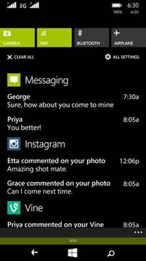
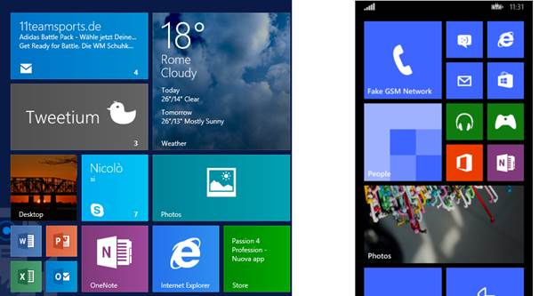
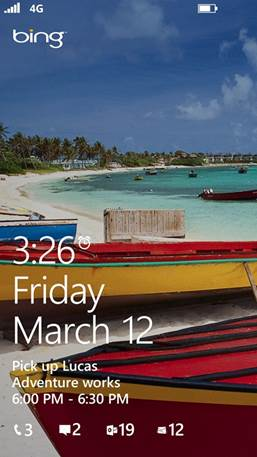
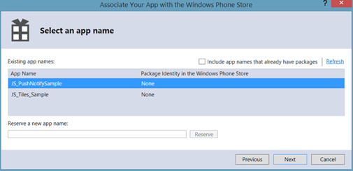
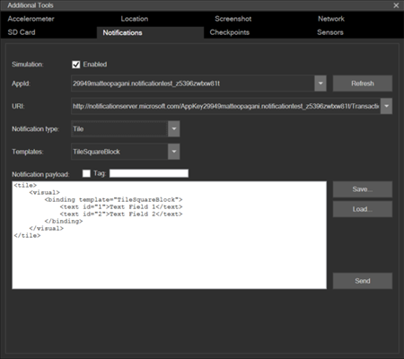

# 六、瓷砖和通知

瓷砖当然是 Windows 和 Windows Phone 最鲜明的视觉特征。平铺不仅仅是放置在“开始屏幕”上打开应用的快捷方式；他们还可以传递信息和内容，而不需要用户启动应用。切片与通知紧密相连，通知是应用未运行时与用户交互的最常用机制。在本章中，我们将看到 Windows 和 Windows Phone 支持的所有通知类型，以及如何发送它们。

## 通知类型

视窗运行时提供四种通知:

*   **吐司通知**是最可见的，因为它们在屏幕顶部显示横幅。它们还可以播放声音并触发设备振动。
*   **图块通知**用于更新图块的内容。它们是非侵入性的，因为它们不会触发任何警报；磁贴会以新信息进行静默更新。
*   **徽章通知**与图块结合使用，不改变整个图块内容，只是显示一个符号或一个数字来吸引用户的注意力。
*   **原始通知**没有固定的结构，可以包含任何类型的内容。

不管我们要使用哪种类型，所有的通知(除了原始通知)都是用 XML 格式表示的，我们将在本章后面看到。我们还将讨论推送通知，这使得服务器应用(如网站或 web 服务)发送通知变得更加容易。此外，视窗运行时能够自动调整通知的内容，以适应平台的指导方针。例如，为了发送敬酒通知，我们将使用完全相同的内容，即使它将在 Windows 和 Windows Phone 中以不同的方式显示。

如果我们排除原始通知(只能由远程服务器发送)，我们可以通过四种不同的方式发送通知:

*   **从应用本身:**如果用户在使用时应用内容发生变化，我们可以立即从代码中更新图块。
*   **带后台任务:**我们将在第 11 章详细了解它们是如何工作的。
*   **周期性:**应用周期性地将互联网上发布的一个 XML 文件和通知的内容拉出来，并对其进行更新。
*   **已调度:**应用能够调度一组通知，这些通知在我们指定的确切日期和时间发送。
*   **推送通知:**通知由外部服务(如 web 应用)生成，并使用微软提供的名为 WNS (Windows Notification Service)的服务发送到设备。

### 吐司通知

正如我们已经提到的，吐司通知对用户来说是最容易看到的，所以您应该避免滥用它们。下图显示了 toast 通知在两个平台上是如何以不同的方式呈现的:


图 17:祝酒通知在 Windows 和 Windows Phone 上的不同显示方式

接收 toast 通知的第一步是在清单文件中启用它们。在**应用**部分的**通知**类别下，我们会找到一个标签为**吐司功能**的下拉菜单。在开始处理代码之前，我们需要将其设置为**是**。

有八个模板可以用来发送祝酒通知，它们都记录在位于[http://s.qmatteoq.com/ToastCatalog](http://s.qmatteoq.com/ToastCatalog)的 MSDN 文档中。各种模板支持不同的内容类型:文本、图像等。但是，这些模板中的大多数仅适用于 Windows。在 Windows Phone 上，我们只能使用一个模板，它由应用的徽标、标题和文本组成(如右图所示)。您可以在文档中找到此模板，名称为**至**。但是，我们可以在 Windows Phone 上使用任何我们想要的模板；平台不支持的信息(如图片)将被忽略。

以下示例显示了通知的 XML 结构，该模板是**到时间和文本 02:**

```cs
    <toast>
    <visual>
    <binding template="ToastImageAndText02">
    <image id="1" src="image1" alt="image1"/>
    <text id="1">headlineText</text>
    <text id="2">bodyText</text>
    </binding>
    </visual>
    </toast>

```

主节点叫做`binding`，它有一个`template`属性，描述所使用模板的名称。在`binding`节点中，我们为通知支持的每个属性找到一个元素。在这种情况下，我们有一个`image`元素(用于图像)和两个`text`元素(用于图像旁边显示的文本)。下面的示例显示了如何使用前面的模板在代码中生成 toast 通知:

```cs
    private void OnSendToastClicked(object sender, RoutedEventArgs e)
    {
    XmlDocument template = ToastNotificationManager.GetTemplateContent(ToastTemplateType.ToastImageAndText02);
    XmlNodeList texts = template.GetElementsByTagName("text");
    texts[0].AppendChild(template.CreateTextNode("Title"));
    texts[1].AppendChild(template.CreateTextNode("Text"));
    XmlNodeList images = template.GetElementsByTagName("image");
    ((XmlElement)images[0]).SetAttribute("src", "ms-appx:///Assets/wplogo.png");
    ToastNotification notification = new ToastNotification(template);
    ToastNotifier notifier = ToastNotificationManager.CreateToastNotifier();
    notifier.Show(notification);
    }

```

正如本章开头已经提到的，每个通知都使用 XML 格式表示。因此，您需要通过手动操作 XML 结构在代码中定义它们。但是，您不必手动创建定义通知的整个 XML。视窗运行时提供了一个名为`ToastNotificationManager`的类，使用`GetTemplateContent()`方法，可以检索通知的 XML 结构。该方法需要`ToastTemplateType`枚举器的一个值作为参数；每个值都与 MSDN 文档中描述的模板之一相匹配。

我们得到的回报是一个具有 XML 结构的`XmlDocument`对象。使用 Windows 运行时提供的 API 与 XML 文档进行交互，我们能够:

*   通过使用`GetElementsByTagName()`方法检索对所有`text`元素的引用，更改通知中显示的文本。借助`AppendChild()`方法，我们能够更改元素的值并指定通知的标题和文本。
*   再次使用`GetElementsByTagName()`方法并检索对`image`元素的引用，更改通知中显示的图像。与 HTML 图像元素一样，我们需要更改元素的`src`属性来定义要使用的图像路径。在前面的示例中，因为我们使用了`ms-appx:///`前缀，所以我们从 Visual Studio 项目中加载了一个图像。

一旦我们定义了 XML 布局，我们就可以通过使用`ToastNotification`类来创建通知，该类需要我们刚刚定制的 XML 文档作为参数。最后，我们需要创建一个`ToastNotifier`对象，它将负责发送通知。要创建它，我们需要使用`ToastNotificationManager`类的`CreateToastNotifier()`方法。最后，我们可以简单地通过调用`ToastNotifier`类的`Show()`方法并传递我们之前创建的`ToastNotification`对象作为参数来显示通知。

#### 从祝酒通知管理激活

在 Windows 和 Windows Phone 上，用户都可以与敬酒通知进行交互；当他们点击它时，生成它的应用会自动打开。但是，我们也可以自定义此行为。我们可以传递一组激活参数来理解通知的上下文，并将用户重定向到特定的页面，而不是简单地打开应用。

为了支持这个场景，我们需要在 XML 定义的主 toast 元素中添加一个名为`launch`的新属性，该属性带有激活参数，如下例所示:

```cs
    IXmlNode toastNode = template.SelectSingleNode("/toast");
    ((XmlElement)toastNode).SetAttribute("launch", "test");

```

在前面的示例中，我们只是将`test`作为激活参数传递，但是我们可以传递任何类型的文本信息。这一次，当应用被吐司通知打开时，我们将获得对`App`类的`OnLaunched()`事件中的参数的引用。以下示例显示了如何管理它:

```cs
    protected override void OnLaunched(LaunchActivatedEventArgs e)
    {
    Frame rootFrame = Window.Current.Content as Frame;
    if (rootFrame == null)
    {
    // Create a Frame to act as the navigation context and navigate to the first page
    rootFrame = new Frame();
    if (e.PreviousExecutionState == ApplicationExecutionState.Terminated)
    {
    // TODO: Load state from previously suspended application
    }
    // Place the frame in the current Window
    Window.Current.Content = rootFrame;
    }
    if (!string.IsNullOrEmpty(e.Arguments))
    {
    rootFrame.Navigate(typeof(DetailPage), e.Arguments);
    }
    if (rootFrame.Content == null)
    {
    // When the navigation stack isn't restored navigate to the first page,
    // configuring the new page by passing required information as a navigation
    // parameter
    if (!rootFrame.Navigate(typeof(MainPage), e.Arguments))
    {
    throw new Exception("Failed to create initial page");
    }
    }
    // Ensure the current window is active
    Window.Current.Activate();
    }

```

如您所见，与标准的`OnLaunched()`方法相比，我们增加了一个新的检查:如果方法参数的`Arguments`属性不是空的，这意味着应用已经通过 toast 通知启动。在这种情况下，我们不是将用户重定向到主页面，而是直接强制导航到另一个页面(在前面的示例中，它被称为`DetailPage`)，并将我们从通知中收到的那个作为导航参数传递。这样，我们将能够直接加载并向用户显示与所显示的吐司通知相关的内容。

#### 使用通知张力库发送祝酒通知

理解定义通知的 XML 格式很重要，但是当您在代码中使用它们时，操作并不像我们刚刚看到的那样简单。在前面的所有代码示例中，我们需要手动操作 XML 文档来设置切片的内容。为了简化开发人员的工作，您可以在 NuGet 上找到一个名为**通知张力**:http://www.nuget.org/packages/NotificationsExtensions.[的库 UniversalApps](http://www.nuget.org/packages/NotificationsExtensions.UniversalApps) 。

该库充当 XML 文档的包装器；您将能够通过使用基于类和属性的更熟悉的方法来定义 toast 通知。下面的示例显示了如何使用该库发送我们以前见过的相同通知:

```cs
    private void OnSendToastClicked(object sender, RoutedEventArgs e)
    {
    IToastImageAndText02 template = ToastContentFactory.CreateToastImageAndText02();
    template.TextHeading.Text = "Title";
    template.TextBodyWrap.Text = "Text";
    template.Image.Src = "ms-appx:///Assets/wplogo.png";
    template.Launch = "test";
    ToastNotification notification = template.CreateNotification();
    ToastNotifier notifier = ToastNotificationManager.CreateToastNotifier();
    notifier.Show(notification);
    }

```

该库提供了一个名为`ToastContentFactory`的类，它能够创建通知模板:我们可以找到许多方法，每个支持的模板一个方法。在这种情况下，因为我们使用名为**的模板来估算和测试 02** ，所以我们使用`CreateToastImageAndText02()`方法。作为回报，我们得到了一个对象，它提供了一种简单地通过更改其属性值来定制通知内容的方法。在前面的示例中，我们设置了:

*   标题，使用`TextHeading`属性。
*   文本，使用`TextBodyWrap`属性。
*   图像，使用`Image`属性。
*   发射参数，使用`Launch`属性。

最后，我们通过调用`CreateNotification()`方法将模板转换成`ToastNotification`对象。从这一点来看，代码与我们之前看到的相同:我们使用`ToastNotificationManager`类创建一个新的`ToastNotifier`对象，并将通知传递给`Show()`方法。

#### 安排祝酒通知

发送祝酒通知的另一个选项是安排它们。通过使用`ScheduledToastNotification`类，我们将能够以我们之前看到的相同方式定义和发送通知，不同的是，这一次，我们将有机会指定显示通知的日期和时间。

```cs
    private void OnSendToastClicked(object sender, RoutedEventArgs e)
    {
    IToastImageAndText02 template = ToastContentFactory.CreateToastImageAndText02();
    if (template != null)
    {
    template.TextHeading.Text = "Title";
    template.TextBodyWrap.Text = "Text";
    template.Image.Src = "ms-appx:///Assets/wplogo.png";
    template.Launch = "test";
    XmlDocument xml = template.GetXml();
    ToastNotifier notifier = ToastNotificationManager.CreateToastNotifier();
    ScheduledToastNotification scheduledToast = new ScheduledToastNotification(xml, DateTimeOffset.Now.AddSeconds(10));
    notifier.AddToSchedule(scheduledToast);
    }
    }

```

前面的示例使用了我们之前看到的`NotificationsExtensions`库。不同的是，我们创建了一个新的`ScheduledToastNotification`对象，它需要定义通知的 XML 作为参数(而不是`ToastNotification`对象)。为此，我们将使用模板提供的`GetXml()`方法，该方法将返回 XML 文件。`ScheduledToastNotification`构造函数需要的另一个参数是显示通知的日期和时间，由`DateTimeOffset`对象表示。在前面的示例中，我们将其安排在比当前时间晚 10 秒的时间。最后，我们通过调用`ToastNotifier`类的`AddToSchedule()`方法将通知添加到调度器中。

`ToastNotifier`类通过使用`GetScheduledToastNotifications()`方法提供了一种检索计划通知列表的方法。我们也可以使用`RemoveFromSchedule()`方法删除已经安排好的通知。以下示例显示了如何删除应用计划的所有通知:

```cs
    private void OnRemoveNotifications(object sender, RoutedEventArgs e)
    {
    ToastNotifier notifier = ToastNotificationManager.CreateToastNotifier();
    IReadOnlyList<ScheduledToastNotification> notifications = notifier.GetScheduledToastNotifications();
    foreach (ScheduledToastNotification notification in notifications)
    {
    notifier.RemoveFromSchedule(notification);
    }
    }

```

#### 祝酒通知和视窗手机的行动中心

Windows Phone 8.1 增加了一个名为“动作中心”的新功能，从屏幕顶部向下拖动手指即可激活。行动中心充当通知中心；任何应用收到的所有 toast 通知都将在此区域收集。这样，如果用户因为没有看手机而错过了一个或多个通知，他们将能够恢复这些通知。

作为开发人员，我们可以通过操作应用创建的通知来直接与操作中心交互。需要强调的是，以下 API 仅在 Windows Phone 上可用，因为 Windows 8.1 不提供操作中心。



图 18:Windows Phone 中的操作中心

**发送无声通知**

无声通知是不打扰的敬酒通知；他们不播放任何声音，也不会触发通常的横幅。它们只是存储在行动中心。用户将通过状态栏中显示的通知图标注意到它们。要发送静默通知，我们使用`ToastNotification`类的`SuppressPopup`属性，如下例所示:

```cs
    private void OnSendToastClicked(object sender, RoutedEventArgs e)
    {
    IToastImageAndText02 template = ToastContentFactory.CreateToastImageAndText02();
    template.TextHeading.Text = "Title";
    template.TextBodyWrap.Text = "Text";
    template.Image.Src = "ms-appx:///Assets/wplogo.png";
    ToastNotification notification = template.CreateNotification();
    notification.SuppressPopup = true;
    ToastNotifier notifier = ToastNotificationManager.CreateToastNotifier();
    notifier.Show(notification);
    }

```

**设置截止日期**

作为默认行为，当用户点击敬酒通知时，或者在创建敬酒通知七天后，敬酒通知将从操作中心移除。但是，由于`ToastNotification`类的`ExpirationDate`属性，我们可以设置一个特定的到期日期和时间。以下示例显示了如何发送五秒钟后过期的通知:

```cs
    private void OnSendToastClicked(object sender, RoutedEventArgs e)
    {
    IToastImageAndText02 template = ToastContentFactory.CreateToastImageAndText02();
    template.TextHeading.Text = "Title";
    template.TextBodyWrap.Text = "Text";
    template.Image.Src = "ms-appx:///Assets/wplogo.png";
    ToastNotification notification = template.CreateNotification();
    notification.ExpirationTime = DateTimeOffset.Now.AddSeconds(5);
    ToastNotifier notifier = ToastNotificationManager.CreateToastNotifier();
    notifier.Show(notification);
    }

```

删除或替换通知

Windows Phone 上的 Windows Runtime 提供了一个名为`ToastNotificationHistory`的类，它提供了对我们的应用生成的所有祝酒通知的访问。由于有了这个类，我们能够删除通知、删除一组通知或替换已经存在的通知。

这种情况需要开发人员找到一种方法来统一识别通知。我们可以通过使用`ToastNotification`类提供的两个属性来做到这一点:

*   `Tag`:唯一标识通知的字符串。
*   `Group`:唯一标识一组通知的字符串。

让我们分析以下示例，它生成两个 toast 通知:

```cs
    private void OnSendToastClicked(object sender, RoutedEventArgs e)
    {
    IToastImageAndText02 template = ToastContentFactory.CreateToastImageAndText02();
    template.TextHeading.Text = "Title";
    template.TextBodyWrap.Text = "Text";
    template.Image.Src = "ms-appx:///Assets/wplogo.png";
    ToastNotification notification = template.CreateNotification();
    notification.Tag = "Notification";
    notification.Group = "MyNotifications";
    ToastNotifier notifier = ToastNotificationManager.CreateToastNotifier();
    notifier.Show(notification);
    IToastImageAndText02 template2 = ToastContentFactory.CreateToastImageAndText02();
    template2.TextHeading.Text = "Title 2";
    template2.TextBodyWrap.Text = "Text 2";
    template2.Image.Src = "ms-appx:///Assets/wplogo.png";
    ToastNotification notification2 = template.CreateNotification();
    notification.Tag = "Notification 2";
    notification.Group = "MyNotifications";
    notifier.Show(notification2);
    }

```

如您所见，我们为两个通知分配了不同的`Tag`，但名称相同`Group`。由于这些属性，我们将能够使用`ToastNotificationHistory`类与这些通知进行交互。例如，我们可以使用`Remove()`方法移除单个通知，将其标记作为参数传递:

```cs
    private void OnRemoveNotificationClicked(object sender, RoutedEventArgs e)
    {
    ToastNotificationHistory history = ToastNotificationManager.History;
    history.Remove("Notification");
    }

```

另一个选项是删除属于同一组的所有通知。以下示例显示了如何删除属于名为`MyNotifications`的组的所有通知，该组作为参数传递给`RemoveGroup()`方法:

```cs
    private void OnRemoveGroupClicked(object sender, RoutedEventArgs e)
    {
    ToastNotificationHistory history = ToastNotificationManager.History;
    history.RemoveGroup("MyNotifications");
    }

```

最后，我们还可以替换一个已经存在的通知。我们创建一个新的`ToastNotification`对象，改变我们想要修改的内容，然后再次发送，通过分配一个已经存在的通知的相同的`Tag`和`Group`值。

```cs
    private void OnSendToastClicked(object sender, RoutedEventArgs e)
    {
    IToastImageAndText02 template = ToastContentFactory.CreateToastImageAndText02();
    template.TextHeading.Text = "Updated title";
    template.TextBodyWrap.Text = "Update text";
    template.Image.Src = "ms-appx:///Assets/wplogo.png";
    ToastNotification notification = template.CreateNotification();
    notification.Tag = "Notification";
    notification.Group = "MyNotification";
    ToastNotifier notifier = ToastNotificationManager.CreateToastNotifier();
    notifier.Show(notification);
    }

```

我们还可以移除属于我们应用的所有通知，只需调用`ToastNotificationHistory`类的`Clear()`方法，如下例所示:

```cs
    private void OnRemoveAllNotificationsClicked(object sender, RoutedEventArgs e)
    {
    ToastNotificationHistory history = ToastNotificationManager.History;
    history.Clear();
    }

```

### 平铺通知

我们已经强调了用我们的应用提供出色的平铺体验的重要性；一个好的磁贴能够让用户持续更新应用的内容，而不需要他们打开它来执行任何任务，或者吸引他们的注意力并把他们吸引到应用中。天气应用是这个场景的一个很好的例子:用户只需浏览他们的开始屏幕，就能立即发现他们当前位置的天气预报。但是，如果他们想查看其他信息(如长期预测)，他们仍然可以打开应用。

平铺通知的工作方式很像吐司通知，有丰富的可用模板目录，用 XML 表示。然而，吐司通知的一个重要区别是，我们需要提供一个默认的切片。事实上，用户可以决定在任何时候将我们的应用固定在他的开始屏幕上，即使没有发送任何通知。默认图块设置在清单文件中的**可视资源**部分。我们可以定义许多资产，因为 Windows 和 Windows Phone 支持多种切片大小。所需的图像有:

*   **正方形 70x70** (在 Windows 中)和**正方形 71x71** (在 Windows Phone 中)，最小的正方形瓷砖。
*   **方 150x150** ，标准方瓦。
*   **宽 310x150** ，宽矩形瓦。
*   **Square310x310** ，一个很大的方形瓷砖，只有 Windows 才有。



图 19:Windows 和 Windows Phone 中的不同切片

对于任何支持的切片大小，您都可以指定:

*   背景图像。需要强调的是，图像的最大分辨率应该是 500x500，并且应该小于 500 KB。否则，通知将被丢弃。
*   要在图块上显示的文本。
*   文本颜色(深色或浅色)。此选项仅在 Windows 中可用。
*   应用于图块的背景色。在 Windows Phone 中，还可以使用`transparent`值:平铺会自动适应用户的主题，并且能够适当支持开始背景图像。
*   用户在“开始”屏幕上锁定应用时使用的默认大小。此选项仅在 Windows 中可用。在 Windows Phone 上，默认情况下，切片是使用 150x150 格式创建的。

一旦定义了默认切片方面，就可以开始发送切片通知来更新它们。模板目录非常丰富，您可以在 http://s.qmatteoq.com/TileTemplatesCatalog 的 MSDN 文档中看到。大多数模板将自动适应平台，因此您将能够向 Windows 和 Windows Phone 发送相同的通知负载。

模板目录中有三种图块:

*   **Peek 图块**:这些图块支持一个动画显示一个次要内容。动画的种类根据平台不同而不同。在 Windows 上，主要内容会在顶部滑动，然后显示次要内容；在 Windows Phone 上，磁贴将翻转以显示放置在背面的次要内容。
*   **区块磁贴**:当你想传递的最重要的信息是一个数字时(比如日历应用，显示当天)，就会用到这些磁贴。
*   **图像采集图块**:通过应用类似于人物应用使用的马赛克动画，这些图块用于显示图像集合。

模板也根据图块大小进行分组，因此您可以找到以下大小的特定模板:

*   **Square71x71，**Windows Phone 中较小的那个，Windows 中不可用。
*   **方 150x150** ，标准方瓦。
*   **宽 310x150** ，宽瓦。
*   **Square310x310** ，大的方瓦，只有窗户支持。

Windows 还提供了一个小的方形瓷砖尺寸，叫做**square 70x 70**；但是，您在目录列表中找不到这种大小的模板，因为我们只能用徽章通知来更新这些文件(我们稍后会看到)。

现在让我们看看如何更新一个图块。我们将使用名为**tilesquare 150 x150 peekimageandtext 01**的模板作为参考，该模板的定义如下:

```cs
    <tile>
    <visual version="2">
    <binding template="TileSquare150x150PeekImageAndText01">
    <image id="1" src="image1" alt="alt text"/>
    <text id="1">Text Field 1 (larger text)</text>
    <text id="2">Text Field 2</text>
    <text id="3">Text Field 3</text>
    <text id="4">Text Field 4</text>
    </binding>
    </visual>
    </tile>

```

主元素叫做`tile`，它包含了另一个叫做`visual`的元素，这个元素包含了图块的视觉定义。最重要的元素是`binding`，由于`template`属性，它定义了 XML 将要定义的模板。在`binding`元素中，我们将为我们可以定制的图块的每个信息找到一个元素；在上一个示例中，模板支持一个`image`和四个`text`元素。然而，正如我们在 toast 通知中看到的，我们不必手动定义 XML 文件。感谢`TileUpdateManager`类，我们可以通过使用`GetTemplateContent()`方法并作为参数传递`TileTemplateType`枚举器的值之一来检索我们需要的模板。以下示例显示了如何创建**tilesquare 150 x150 peekimageandtext 01**图块，以及如何自定义其属性:

```cs
    private void OnUpdateTileClicked(object sender, RoutedEventArgs e)
    {
    XmlDocument template = TileUpdateManager.GetTemplateContent(TileTemplateType.
    TileSquare150x150PeekImageAndText01);
    XmlNodeList texts = template.GetElementsByTagName("text");
    texts[0].InnerText = "Tile title";
    texts[1].InnerText = "Text 1";
    texts[2].InnerText = "Text 2";
    texts[3].InnerText = "Text 3";
    XmlNodeList images = template.GetElementsByTagName("image");
    ((XmlElement)images[0]).SetAttribute("src", "ms-appx:///Assets/wplogo.png");
    TileNotification notification = new TileNotification(template);
    TileUpdater updater = TileUpdateManager.CreateTileUpdaterForApplication();
    updater.Update(notification);
    }

```

模板由`XmlDocument`对象标识；使用这个类提供的方法(像`GetElementsByTagName()`)，我们能够检索各种文本和图像元素并改变它们的值。一旦模板准备好了，我们可以通过调用`TileUpdater`类的`CreateTileUpdaterForApplication()`方法来创建一个`TileUpdater`对象。最后，我们可以通过创建一个新的`TileNotification`对象(并将模板作为参数传递)并将其传递给`Update()`方法来更新图块。

#### 用一个通知更新多个尺寸

前面的代码有一个缺陷:我们只更新了一个可用的图块大小，但是我们不知道用户使用的是哪个大小。此外，他们可以随时改变尺寸，无需事先通知。例如，如果用户将图块调整为宽，而不是使用正方形，他们将看不到我们刚刚发送的更新。正确的方法是在较大的图块大小中包含一个通知，以便更新较小的版本。例如，在这种情况下，除了使用模板**tilesqueuare 150 x150 peekimageandtext 01**发送通知之外，我们还需要使用**tilewide 310 x150 peekimageandtext 01**更新图块，该图块用于宽图块。

为了实现这个目标，我们可以在同一个通知中添加多个`binding`节点，如下例所示:

```cs
    <tile>
    <visual version="2">
    <binding template="TileWide310x150ImageAndText01">
    <image id="1" src="ms-appx:///assets/redWide.png"/>
    <text id="1">This is a notification for a wide tile</text>
    </binding>
    <binding template="TileSquare310x150PeekImageAndText01">
    <text id="1">This is a notification for a square tile</text>
    </binding>
    </visual>
    </tile>

```

因此，在使用`TileUpdater`类更新图块之前，我们需要定义新模板，并将其添加为视觉标签的子标签，如下例所示:

```cs
    private void OnUpdateTileClicked(object sender, RoutedEventArgs e)
    {
    XmlDocument template = TileUpdateManager.GetTemplateContent(TileTemplateType.
    TileSquare150x150PeekImageAndText01);
    XmlNodeList texts = template.GetElementsByTagName("text");
    texts[0].InnerText = "Tile title";
    texts[1].InnerText = "Text 1";
    texts[2].InnerText = "Text 2";
    texts[3].InnerText = "Text 3";
    XmlNodeList images = template.GetElementsByTagName("image");
    ((XmlElement)images[0]).SetAttribute("src", "ms-appx:///Assets/wplogo.png");

    XmlDocument wideTileXml = TileUpdateManager.GetTemplateContent(TileTemplateType.
    TileWide310x150PeekImageAndText01);
    XmlNodeList wideTileTexts = wideTileXml.GetElementsByTagName("text");
    wideTileTexts[0].AppendChild(wideTileXml.CreateTextNode("Wide tile tile"));
    IXmlNode node = template.ImportNode(wideTileXml.GetElementsByTagName("binding").Item(0), true);
    template.GetElementsByTagName("visual").Item(0).AppendChild(node);
    TileNotification notification = new TileNotification(template);
    TileUpdater updater = TileUpdateManager.CreateTileUpdaterForApplication();
    updater.Update(notification);
    }

```

在我们像之前一样使用**tilesquare 150 x150 peekimageandtext 01**模板定义了图块之后，我们还使用**tilewide 310 x150 peekimageandtext 01**模板定义了一个新的图块。然后，在发送更新之前，我们将两个模板组合成一个单独的 XML 文件，并且，仅在最后，我们创建一个新的`TileNotification`对象。

#### 使用通知张力库发送切片通知

我们之前看到的通知张力库也带有切片通知。在这种情况下，我们将使用`TileContentFactory` to 类创建一个基于许多可用模板之一的对象，由于其属性，我们将使用它来轻松定义视觉布局。以下示例显示了如何使用库中的**tilesqueuare 150 x150 peekimageandtext 01**模板创建切片:

```cs
    private void OnUpdateTileClicked(object sender, RoutedEventArgs e)
    {
    ITileSquare150x150PeekImageAndText01 template = TileContentFactory.CreateTileSquare150x150PeekImageAndText01();
    template.TextHeading.Text = "Tile title";
    template.TextBody1.Text = "Text 1";
    template.TextBody2.Text = "Text 2";
    template.TextBody3.Text = "Text 3";
    template.Image.Src = "ms-appx:///Assets/wplogo.png";
    TileNotification notification = template.CreateNotification();
    TileUpdater updater = TileUpdateManager.CreateTileUpdaterForApplication();
    updater.Update(notification);
    }

```

根据图块支持的信息，每个模板对象提供一个或多个属性。在前面的示例中，我们设置了标题(使用`TextHeading`属性)、各种文本(使用`TextBody`属性)和图像(使用`Image`属性)。自定义模板后，我们可以使用`CreateNotification()`方法创建一个`TileNotification`对象。我们将返回`TileUpdater`类的`Update()`方法所需的对象。

通知张力库也可用于在同一通知中组合多个切片更新。事实上，每个模板都支持一种方法来定义要使用的较小版本(例如，大正方形模板有一个属性来定义宽的，宽的模板有一个属性来定义小正方形的，等等。).以下示例显示了如何发送通知以同时更新宽切片和方形切片:

```cs
    private void OnUpdateTileClicked(object sender, RoutedEventArgs e)
    {
    var template = TileContentFactory.CreateTileSquare150x150PeekImageAndText01();
    template.TextHeading.Text = "Title";
    template.TextBody1.Text = "Text 1";
    template.TextBody2.Text = "Text 2";
    template.TextBody3.Text = "Text 3";
    template.Image.Src = "ms-appx:///Assets/wplogo.png";

    var wideTemplate = TileContentFactory.CreateTileWide310x150PeekImageAndText01();
    wideTemplate.TextBodyWrap.Text = "Wide tile";
    wideTemplate.Image.Src = "ms-appx:///Assets/wplogo.png";
    wideTemplate.Square150x150Content = template;

    TileNotification wideNotification = wideTemplate.CreateNotification();
    TileUpdater updater = TileUpdateManager.CreateTileUpdaterForApplication();
    updater.Update(wideNotification);
    }

```

我们定义了正方形和宽模板，并用我们之前定义的正方形来设置宽模板的`Square150x150Content`属性。然后我们只需要从较大的磁贴通知开始创建一个`TileNotification`对象，它包含了较小的磁贴的定义(在本例中是小方块)。这是要作为`TileUpdater`类的**更新()**方法的参数传递的对象。

#### 管理通知队列

作为默认行为，每次我们发送切片通知时，我们都会覆盖以前的内容。我们还可以启用通知队列；系统将能够存储多达五个通知，这些通知将在图块上循环。为了实现这个目标，我们只需要调用`TileUpdater`类的`EnableNotificationsQueue()`方法，将`Boolean`值`true`作为参数传递。让我们看看下面的示例，它使用了我们之前看到的通知张力库:

```cs
    private void OnUpdateTileClicked(object sender, RoutedEventArgs e)
    {
    ITileSquare150x150PeekImageAndText01 template = TileContentFactory.
    CreateTileSquare150x150PeekImageAndText01();
    template.TextHeading.Text = "Title 1";
    template.TextBody1.Text = "Text 1";
    template.TextBody2.Text = "Text 2";
    template.TextBody3.Text = "Text 3";
    template.Image.Src = "ms-appx:///Assets/wplogo.png";

    TileNotification notification = template.CreateNotification();
    TileUpdater updater = TileUpdateManager.CreateTileUpdaterForApplication();
    updater.EnableNotificationQueue(true);
    updater.Update(notification);

    ITileSquare150x150PeekImageAndText01 template2 = TileContentFactory.
    CreateTileSquare150x150PeekImageAndText01();
    template2.TextHeading.Text = "Title 2";
    template2.TextBody1.Text = "Text 1";
    template2.TextBody2.Text = "Text 2";
    template2.TextBody3.Text = "Text 3";
    template2.Image.Src = "ms-appx:///Assets/wplogo.png";

    TileNotification notification2 = template.CreateNotification();
    updater.Update(notification2);
    }

```

我们已经创建了两个通知，但是在发送第一个通知之前，我们已经调用了`TileUpdater`类的`EnableNotificationsQueue()`方法。这段代码的结果是，第二次更新不会覆盖第一次更新，两个通知将交替显示在主图块上。

由于`Tag`属性，我们还可以替换排队的通知，就像我们在 Windows Phone 的动作中心替换敬酒通知一样。事实上，发送一个与现有通知相同的`Tag`属性的新通知就足够了:

```cs
    private void OnUpdateTileClicked(object sender, RoutedEventArgs e)
    {
    ITileSquare150x150PeekImageAndText01 template =
    TileContentFactory.CreateTileSquare150x150PeekImageAndText01();
    template.TextHeading.Text = "Title 1";
    template.TextBody1.Text = "Text 1";
    template.TextBody2.Text = "Text 2";
    template.TextBody3.Text = "Text 3";
    template.Image.Src = "ms-appx:///Assets/wplogo.png";
    TileNotification notification = template.CreateNotification();
    notification.Tag = "MyNotification";
    TileUpdater updater = TileUpdateManager.CreateTileUpdaterForApplication();
    updater.EnableNotificationQueue(true);
    updater.Update(notification);
    }

```

在前面的示例中，我们将`MyNotification`值赋给了`Tag`属性。从现在开始，如果我们发送带有不同标签的新切片通知，它们将被简单地添加到队列中。但是，如果我们发送另一个具有相同标签的通知，它将不会排队，但会替换现有的通知。

#### 计划切片通知

也可以安排切片通知，以便在特定的日期和时间发送。使用`ScheduleTileNotification`类创建计划的切片通知，该类需要模板的 XML 有效负载以及发送日期和时间，这是一个`DateTimeOffset`对象。以下示例显示了如何在五秒钟后安排通知:

```cs
    private void OnUpdateTileClicked(object sender, RoutedEventArgs e)
    {
    ITileSquare150x150PeekImageAndText01 template = TileContentFactory.
    CreateTileSquare150x150PeekImageAndText01();
    template.TextHeading.Text = "Title 1";
    template.TextBody1.Text = "Text 1";
    template.TextBody2.Text = "Text 2";
    template.TextBody3.Text = "Text 3";
    template.Image.Src = "ms-appx:///Assets/wplogo.png";

    XmlDocument xml = template.GetXml();
    TileUpdater updater = TileUpdateManager.CreateTileUpdaterForApplication();
    ScheduledTileNotification scheduledTile = new ScheduledTileNotification(xml,
    DateTimeOffset.Now.AddSeconds(5));
    updater.AddToSchedule(scheduledTile);
    }

```

我们使用的是 NotificationsExtensions 库，所以我们在模板上调用`GetXml()`方法来获取通知的 XML 定义。在我们创建了`ScheduledTileNotification`对象之后，我们使用`TileNotifier`类的`AddToSchedule()`方法来安排更新。

#### 定期更新图块

到目前为止，我们看到的所有更新方法也适用于 toast 通知。但是，有一种更新方法仅适用于切片:定期通知。在这个场景中，发送通知的不是外部参与者(后台任务、推送通知服务器等)。);是应用本身定期检查互联网资源以检测切片更新。这样，如果我们想要更新切片的内容，我们只需要更新我们在互联网上发布的 XML 文件。

第一步是用模板定义创建一个 XML 文件。例如，如果我们想要使用**tilesqueuare 150 x 150 peekimageandtext 01**模板更新图块，我们需要创建一个具有以下定义的文本文件:

```cs
    <tile>
    <visual version="2">
    <binding template="TileSquare150x150PeekImageAndText01" fallback="TileSquarePeekImageAndText01">
    <image id="1" src="http://www.qmatteoq.com/logo.png" />
    <text id="1">Title</text>
    <text id="2">Text 1</text>
    <text id="3">Text 2</text>
    <text id="4">Text 3</text>
    </binding>
    </visual>
    </tile>

```

第二步是在互联网上发布 XML 文件，这样应用就可以访问该 URL。它可以是网络服务器、云服务等。

现在，您有两种方法来执行定期更新。第一个是在清单文件中配置它们。当您希望在安装应用后立即开始接收切片更新时，此解决方案非常有用。要设置定期更新，您需要打开清单文件的**应用**部分。在**图块更新**部分，您可以使用图块的定义定义更新周期(从每半小时到每天)和 XML 文件的 URL。

配置定期更新的第二种方法是使用代码。`TileUpdater`类提供了一个名为`StartPeriodicUpdate(),`的方法，该方法需要 XML 文件的网址和`PeriodicUpdateRecurrence`枚举器的一个值来定义递归。

```cs
    private void OnSetTileUpdateClicked(object sender, RoutedEventArgs e)
    {
    TileUpdater manager = TileUpdateManager.CreateTileUpdaterForApplication();
    Uri url = new Uri("http://www.qmatteoq.com/tile.xml", UriKind.Absolute);
    manager.StartPeriodicUpdate(url, PeriodicUpdateRecurrence.Hour);
    }

```

在代码中管理定期通知的优点之一是，我们可以实现清单文件不支持的场景。例如，我们可以为更新设置多个网址；这样，在每次重复时，应用将在 URL 之间循环，并选择列表中的下一个 URL，而不是使用相同的 URL。为了实现这个目标，我们需要调用`StartPeriodicUpdateBatch()`方法，将`Uri`对象的集合作为参数传递，如下例所示:

```cs
    private void OnSetTileUpdateClicked(object sender, RoutedEventArgs e)
    {
    TileUpdater manager = TileUpdateManager.CreateTileUpdaterForApplication();
    List<Uri> uris = new List<Uri>
    {
    new Uri("http://www.qmatteoq.com/tile.xml", UriKind.Absolute),
    new Uri("http://www.qmatteoq.com/tile2.xml", UriKind.Absolute),
    new Uri("http://www.qmatteoq.com/tile3.xml", UriKind.Absolute)
    };
    manager.StartPeriodicUpdateBatch(uris, PeriodicUpdateRecurrence.Hour);
    }

```

我们可以用`TileUpdater`类执行的另一个操作是通过调用`StopPeriodicUpdate()`方法来停止接收定期更新:

```cs
    private void OnStopTileUpdatesClicked(object sender, RoutedEventArgs e)
    {
    TileUpdater manager = TileUpdateManager.CreateTileUpdaterForApplication();
    manager.StopPeriodicUpdate();
    }

```

#### 二级瓷砖

Windows 和 Windows Phone 提供了一种在开始屏幕上创建多个图块的方法，这些图块属于同一个应用。它们主要用于两种情况:

*   提供对应用内部部分的快速访问。例如，新闻阅读器应用可以为用户提供一种方法，在“开始”屏幕上为每个新闻类别固定一个标题。当用户点击这个小块时，应用将直接在属于该类别的新闻条目列表中打开。
*   提供独立的切片更新。通过扩展前面的示例，我们将能够仅使用这些新闻项目的标题来更新与特定新闻类别相关联的辅助切片。

此外，辅助切片使用用户的微软帐户进行同步，就像我们在第 5 章中看到的漫游文件夹一样。这样，如果用户已经在多个设备上安装了应用，她将自动找到她在“开始”屏幕上创建的所有辅助切片。为了创建多个切片，我们将在两个平台上使用相同的 API。但是，Windows 和 Windows Phone 之间有一个重要的用户体验差异:

*   在创建标题之前，Windows 需要用户确认:弹出窗口将显示平铺预览，用户必须按“确定”按钮才能将其添加到“开始”屏幕。
*   Windows Phone 不需要任何确认，但在创建切片时应用会暂停，开始屏幕会自动聚焦在新切片上。

这两种情况都是为了避免应用在未经批准的情况下在用户的开始屏幕上创建无限数量的切片。

次级图块使用`SecondaryTile`类进行映射，如下例所示:

```cs
    private async void OnCreateSecondaryTileClicked(object sender, RoutedEventArgs e)
    {
    string tileId = "SecondaryTile";
    string shortName = "Tile";
    string displayName = "This is a secondary tile";
    string arguments = "science";
    Uri logo = new Uri("ms-appx:///Assets/wplogo.png", UriKind.Absolute);
    SecondaryTile tile = new SecondaryTile(tileId, shortName, displayName, arguments, TileOptions.ShowNameOnLogo, logo);
    bool isPinned = await tile.RequestCreateAsync();
    }

```

当我们创建一个新的`SecondaryTile`对象时，我们需要指定:

*   图块的唯一标识符。
*   图块名称(应提供简短和完整的名称)。
*   激活参数，它被传递给启动事件，以标识使用了哪个图块，这样我们就可以将用户重定向到适当的页面并显示所需的信息。
*   用于图块的图像。

使用`RequestCreateAsync()`方法创建图块，该方法将返回一个`Boolean`值，通知您操作的状态。但是，该值仅在窗口上有用，因为用户有机会通过关闭确认弹出窗口来中止操作。

`SecondaryTile`类还提供了一种深度定制图块内容的方法，这要归功于`VisualElements`属性，该属性提供了一种与我们在清单文件中看到的相同属性交互的方法，例如支持的图块大小、背景颜色、文本等。

```cs
    private async void OnCreateSecondaryTileClicked(object sender, RoutedEventArgs e)
    {
    string tileId = "SecondaryTile";
    string shortName = "Tile";
    string displayName = "This is a secondary tile";
    string arguments = "15";
    Uri logo = new Uri("ms-appx:///Assets/wplogo.png", UriKind.Absolute);
    SecondaryTile tile = new SecondaryTile(tileId, shortName, displayName, arguments,
    TileOptions.ShowNameOnLogo, logo);
    tile.VisualElements.BackgroundColor = Colors.Red;
    tile.VisualElements.ForegroundText = ForegroundText.Light;
    tile.VisualElements.Wide310x150Logo = new Uri("ms-appx:///Assets/wide-wplogo.png",UriKind.Absolute);
    bool isPinned = await tile.RequestCreateAsync();
    }

```

使用通知更新辅助图块

也可以使用通知来更新辅助切片。所需代码与我们在主图块中看到的代码相同。唯一不同的是，这一次，为了创建`TileUpdater`对象，我们将使用`CreateTileUpdaterForSecondaryTile()`方法。它需要我们想要更新的图块的唯一标识符作为参数(这是我们创建`SecondaryTile`对象时传递的第一个参数)。

之后，我们可以像往常一样从其中一个模板开始创建通知，然后立即更新图块(使用`Update()`方法)、安排通知(使用`AddToSchedule()`方法)或设置定期更新(使用`StartPeriodicUpdate()`方法)。以下示例显示了如何更新辅助切片:

```cs
    private void OnUpdateTileClicked(object sender, RoutedEventArgs e)
    {
    var template =
    TileContentFactory.CreateTileSquare150x150PeekImageAndText01();
    template.TextHeading.Text = "Title";
    template.TextBody1.Text = "Text 1";
    template.TextBody2.Text = "Text 2";
    template.TextBody3.Text = "Text 3";
    template.Image.Src = "ms-appx:///Assets/wplogo.png";

    TileNotification notification = template.CreateNotification();
    string tileId = "SecondaryTile";
    TileUpdater updater = TileUpdateManager.CreateTileUpdaterForSecondaryTile(tileId);
    updater.Update(notification);
    }

```

### 徽章通知

徽章通知连接到切片；它们是可以显示在图块上以吸引用户注意力的符号。徽章有两种:

*   **数字**
*   **符号**，警告用户应用中发生了需要他注意的事情。


图 20:Windows 和 Windows Phone 中的数字徽章通知

所有可用的符号都在 MSDN 文档([http://s.qmatteoq.com/MSBadgeCatalog](http://s.qmatteoq.com/MSBadgeCatalog))中列出，但需要强调的是，Windows Phone 仅支持`alert`和`attention`符号。

徽章通知就像烤面包或瓷砖通知；它们由一个 XML 文件定义，在这种情况下，这个文件要简单得多，因为它只包含徽章值。以下示例显示了如何定义数字徽章:

```cs
    <badge value="1"/>

```

相反，这里有一个符号徽章:

```cs
    <badge value="attention"/>

```

与 toast 或 tile 通知相比，操纵 XML 文档来创建模板也更容易，如下例所示:

```cs
    private void OnUpdateBadgeClicked(object sender, RoutedEventArgs e)
    {
    XmlDocument template = BadgeUpdateManager.GetTemplateContent(BadgeTemplateType.BadgeNumber);
    XmlElement badgeElement = (XmlElement)template.SelectSingleNode("/badge");
    badgeElement.SetAttribute("value", "7");
    BadgeNotification notification = new BadgeNotification(template);
    BadgeUpdater badgeUpdater = BadgeUpdateManager.CreateBadgeUpdaterForApplication();
    badgeUpdater.Update(notification);
    }

```

方法总是一样的:我们使用一个名为`BadgeUpdateManager`的类，通过使用`GetTemplateContent()`方法来检索模板，该方法需要`BadgeTemplateType`枚举器(`BadgeNumber`或`BadgeGlyph`)的两个值之一作为参数。然后我们检索名为 badge 的节点(使用`SelectSingleNode()`方法)，并更改值属性(使用`SetAttribute()`方法)。最后，我们使用 XML 模板创建一个`BadgeNotification`对象，该对象是使用`BadgeUpdater`类的`Update()`方法发送的。

#### 使用通知张力库发送徽章通知

NotificationsExtensions 库支持徽章通知，根据我们想要传递的内容，它提供了两个不同的类:`BadgeNumericNotificationContent`表示数字，`BadgeGlyphNotificationContent`表示符号。

创建这两个对象中的一个就足够了(作为参数传递要显示的数字或符号)，然后调用`CreateNotification()`方法将模板变成`BadgeNotification`对象，可以使用`BadgeUpdater`类发送。

```cs
    private void OnUpdateBadgeClicked(object sender, RoutedEventArgs e)
    {
    BadgeNumericNotificationContent template = new BadgeNumericNotificationContent(7);
    BadgeNotification notification = template.CreateNotification();
    BadgeUpdater updater = BadgeUpdateManager.CreateBadgeUpdaterForApplication();
    updater.Update(notification);
    }

```

如果我们需要发送符号徽章，库提供了一个名为`GlyphValue`的有用枚举器，其中包含所有支持的符号列表。以下示例显示了如何发送带有注意符号的徽章通知:

```cs
    private void OnUpdateBadgeClicked(object sender, RoutedEventArgs e)
    {
    BadgeGlyphNotificationContent template = new BadgeGlyphNotificationContent(GlyphValue.Attention);
    BadgeNotification notification = template.CreateNotification();
    BadgeUpdater updater = BadgeUpdateManager.CreateBadgeUpdaterForApplication();
    updater.Update(notification);
    }

```

### 在锁定屏幕上显示通知

在 Windows 和 Windows Phone 中，开发人员可以与锁定屏幕交互，锁定屏幕是设备不使用时显示的屏幕。在锁定屏幕上显示通知非常容易，因为它不需要一组特殊的 APIs 这些通知依赖于我们刚刚看到的现有磁贴和徽章通知。唯一的步骤是正确设置清单文件。每次我们要发送通知来更新我们的图块时，如果应用已经配置为与锁定屏幕交互，通知的内容也会显示在锁定屏幕上。

支持两种通知:

*   **数字徽章通知**:我们可以在磁贴和锁屏上显示同一个计数器。Windows Phone 锁定屏幕上最多可以有五个应用，Windows 锁定屏幕上最多可以有七个应用。
*   **文字** **通知**:作为宽模板标题显示的文字也可以显示在锁屏上。您只能有一个这种类型的应用。



图 21:Windows Phone 中的锁屏通知

要支持锁屏交互，第一步是编辑清单文件的**应用**部分。在**通知**部分，你会发现一个名为**的下拉菜单锁定屏幕通知**。您可以选择是支持**徽章**通知(数值)还是**徽章和平铺文本**通知(两者都支持)。一旦您启用两个选项中的一个，您将会在清单的**可视资产**部分看到一个错误图标。事实上，还需要在**徽章标志**部分的数字附近设置要在锁定屏幕中使用的标志。您将不得不使用 24x24 像素的白色图像，背景是透明的。您不能在锁屏图标中使用颜色。

在 Windows 上，您还会在清单的声明部分得到一个错误:事实上，Windows 应用需要连接到一个后台任务，它的类型应该是计时器、位置、控制通道或推送通知。

需要强调的是，用户可以完全控制显示哪个锁屏通知。我们总是能够发送它们，但是用户需要定义有多少，以及在锁定屏幕上显示哪些应用。

## 推送通知

当应用或后台任务直接发送通知时，我们在上一节中看到的所有示例都很有用。然而，在某些情况下，我们不能依赖这些场景。例如，我们需要支持实时通知，但是后台任务有一些限制，使得它们不适合这个场景。

推送通知是这个问题的答案，因为它们依赖于发送通知的外部服务，如网站、桌面应用或云服务。当特定事件发生时，服务将向设备发送通知，设备将接收并处理该通知。为了提高可靠性和安全性，服务不能直接向设备发送通知，但它需要使用微软提供的服务，称为窗口通知服务(WNS)。WNS 能够收集所有通知，并将它们重定向到适当的设备。

什么是推送通知工作流程？您可以在下图中看到摘要:


图 22:推送通知工作流

当一个 Windows Store 应用在 WNS 注册时，它会收到一个 URL，该 URL 会唯一地标识推送通知通道。这是一个标准的 HTTP 网址，在互联网上公开(这里是一个真实的频道示例:[https://db3.notify.windows.com/?token = agyaaabbccigwth2 cggvxobathew % 2b 0 tkoeycv 1 sil 16 grbjnfuta4yt 1 jhecho 6 jkij 4 cusoxocq % 2b 4 auoew8 chyp % 2 fhzogm7 ieumzwc9 wczek2 age % 2 fr1 zl3c th 0 rkfsze1 pee % 3d](https://db3.notify.windows.com/?token=AgYAAABbCcIgWtH2CggvXoBateheW%2b0tKoEYCv1XIl16GrBjNFUta4S4YT1JhEOCh6JKij4CuSOXOcq%2b4auoEw8chyp%2fHzogm7ieUMzWc9WCZEK2age%2fR1Zl3CTh0rKFsZE1pEE%3d))。

现在将更容易理解为什么我们到目前为止看到的所有通知都由一个 XML 文件来标识。发送推送通知只是意味着准备一个包含通知的 XML 定义作为内容的 HTTP 请求，并使用 POST 操作将其发送到通道的 URL。

典型的推送通知工作流程是:

*   当应用打开时，它会注册一个通知通道。
*   应用向我们的服务发送网址。通常，它保存在数据库中，以便每次服务向注册设备发送通知时使用。
*   该服务通过通道上的开机自检命令发送吐司、切片、徽章或原始通知。作为回报，它会收到服务可以用来了解请求状态的响应。

这种架构最重要的优势之一是它基于标准技术，如 HTTP 或 XML。因此，我们不会被迫使用微软技术来创建我们的后端，但是我们可以很容易地在我们已经存在的后端服务中集成一个用于 Windows Store 应用的推送通知服务，无论它是用 Java、PHP 还是 Node.js 编写的

### 发送推送通知

在本节中，我们将看到如何从服务器应用发送推送通知。如前所述，你可以使用任何技术。然而，既然你正在读一本关于为 Windows 和 Windows Phone 开发应用的书，很可能你已经了解了微软的技术。因此，作为一个服务器示例，我们将构建一个 WPF 应用。为了执行与 WNS 交互所需的网络操作，我们将使用我们已经在第 6 章中看到的`HttpClient`类。由于该类在 WPF 本地不可用，您必须安装一个特殊的 NuGet 包([http://www.nuget.org/packages/Microsoft.Net.Http/](http://www.nuget.org/packages/Microsoft.Net.Http/)，它为任何基于的技术增加了`HttpClient`支持。NET 框架。

发送通知的第一步是管理身份验证。服务器应用需要通过 WNS 认证，这样只有授权的应用才能向您的应用发送推送通知。要管理身份验证，您必须在 Windows 开发中心注册您的应用，即使它是一个 Windows Phone 应用；目前，Windows Phone 开发中心不支持推送通知设置。因此，为了支持应用中的推送通知，您需要一个有效的开发人员帐户。没有它，您将只能通过使用 Windows Phone 模拟器提供的特定工具来发送通知。

要继续推送通知配置，您必须在 Windows 开发中心启动新的应用提交。我们将在第 12 章中详细介绍该过程，但是现在，让我们看一下正确设置身份验证所需的步骤。

第一步是为应用保留一个名称，该名称将在商店中显示给用户。您可以在 Visual Studio 中右键单击您的 Windows 项目，然后在**商店**部分选择**将应用与商店**关联选项。您将启动一个向导，该向导将指导您完成以下过程:第一步是使用连接到开发人员帐户的 Microsoft 帐户登录。然后，一个窗口将显示您在仪表板上注册的所有应用的列表。如果是新应用，您可以通过填写**预约新应用名称**字段并按**预约**按钮来预约新名称。否则，只需从列表中选择一个名称，然后按下**下一步**按钮。



图 23:Visual Studio 为应用保留名称的屏幕

现在，您可以开始提交了。进入[http://dev.windows.com](http://dev.windows.com)网站，用你的微软账号登录，点击仪表盘链接。系统会询问您想要使用哪个开发中心:选择窗口商店。一旦你登陆了视窗开发中心，点击**提交新应用链接**开始提交程序。该过程将从显示完成提交所需的所有步骤开始。我们暂时忽略它们，只需完成获取推送通道的身份验证凭据所需的最少步骤。

第一步叫做**应用名称**，用来定义应用名称。因为我们已经在 Visual Studio 中完成了这个操作，所以我们可以从下拉菜单中选择它。完成这一步后，我们将返回列表；我们直接跳到第三步，叫做**服务**。这是我们需要设置推送通知通道的一个。由于我们使用自己的后端，我们需要点击**如果您有一个现有的 WNS 解决方案或需要更新您当前的客户机密，请访问实时服务网站**。最后，您将登陆一个页面，该页面将显示您正在寻找的信息，即**包 SID** 和**客户端机密**，如下图所示。


图 24:为推送通知设置身份验证所需的信息

既然我们有了这些信息，我们就可以开始编写一些代码了。要执行身份验证，我们需要用一个包执行 POST 请求，该包包含我们之前检索到的包 SID 和客户端密码。以下示例显示了如何执行正确的身份验证:

```cs
    private async void OnAuthenticateClicked(object sender, RoutedEventArgs e)
    {
    string sid = "ms-app://s-1-15-2-3408799042-3494098530-1890876074-596078043-4000267856-3993638234-2202691549";
    string secret = "x67C1cf9gxwTi9d3CCzI5CEM/bji31F1";
    string encodedSid = HttpUtility.UrlEncode(sid);
    string encodedSecret = HttpUtility.UrlEncode(secret);
    string body = string.Format("grant_type=client_credentials&client_id={0}&client_secret={1}&scope=notify.windows.com", encodedSid, encodedSecret);
    HttpClient client = new HttpClient();
    StringContent content = new StringContent(body);
    content.Headers.ContentType = new MediaTypeHeaderValue("application/x-www-form531urlencoded");
    HttpResponseMessage response = await client.PostAsync("https://login.live.com/accesstoken.srf", content);
    }

```

HTTP 请求的内容存储在名为`body`的变量中。它是一个带有一组参数的字符串:

*   `grant_type`，为固定值，必须设置为`client_credential`。
*   `scope`，为固定值，必须设置为`notify.windows.com`。
*   `client_id`，这是我们之前检索到的包 Id。
*   `client_secret`，这是我们之前检索到的客户端机密。

由于包只包含文本，我们可以使用`StringContent`对象定义内容。唯一需要强调的特殊配置是，我们需要将请求的`ContentType`设置为`application/x-www-form531urlencoded`。

现在我们可以使用`HttpClient`类的`PostAsync()`方法将请求发送到网址[https://login.live.com/accesstoken.srf](https://login.live.com/accesstoken.srf)，将我们之前定义的`StringContent`对象作为参数传递。如果我们做的一切都正确，我们将返回一个带有访问令牌的 JSON 响应，这是对 WNS 执行所有其他操作所需要的。这是一个 JSON 响应示例:

```cs
    {
    "token_type":"bearer",
    "access_token":"EgAaAQMAAAAEgAAAC4AAzqwf/hYpeD3oG5Lj9SGc53j5U1OtVV30jwHasHVBrxTWcUF1
    zy/1pNnyn2OUUh+bCjs690ELAHQAgH7O94l6EKWoX0oK0oAIf1E0dUk3pf8kRw6VuddENz8n00JZQtpNlS3H
    SdbvEAugraYKiYfp+Uvi677rSS7/HPhu4tvXN3KJAFoAiQAAAAAAQcURTJ18jFOdfIxT60gEAAsAOTMuMzYu
    MC40MQAAAAAAXgBtcy1hcHA6Ly9zLTEtMTUtMi0zNDA4Nzk5MDQyLTM0OTQwOTg1MzAtMTg5MDg3NjA3NC01
    OTYwNzgwNDMtNDAwMDI2Nzg1Ni0zOTkzNjM4MjM0LTIyMDI2OTE1NDkA",
    "expires_in":86400
    }

```

下面的竞争示例展示了如何发送身份验证请求，以及如何通过使用我们在第 6 章中讨论的 Json.NET 库来检索访问令牌:

```cs
    private async void OnAuthenticateClicked(object sender, RoutedEventArgs e)
    {
    string sid = "ms-app://s-1-15-2-3408799042-3494098530-1890876074-596078043-4000267856-3993638234-2202691549";
    string secret = "x67C1cf9gxwTi9d3CCzI5CEM/bji31F1";
    string encodedSid = HttpUtility.UrlEncode(sid);
    string encodedSecret = HttpUtility.UrlEncode(secret);
    string body = string.Format("grant_type=client_credentials&client_id={0}&client_secret={1}&scope=notify.windows.com", encodedSid, encodedSecret);
    HttpClient client = new HttpClient();
    StringContent content = new StringContent(body);
    content.Headers.ContentType = new MediaTypeHeaderValue("application/x-wwwform-urlencoded");
    HttpResponseMessage response = await client.PostAsync("https://login.live.com/accesstoken.srf", content);
    if (response.IsSuccessStatusCode)
    {
    string json = await response.Content.ReadAsStringAsync();
    JObject jObject = JObject.Parse(json);
    string accessToken = jObject.GetValue("access_token").Value<string>();
    }
    }

```

如果请求成功(我们检查响应的`IsSuccessStatusCode`属性)，我们读取响应的内容。因为它是一个字符串，所以我们使用`Content`属性提供的`ReadAsStringAsync()`方法。然后，使用 JSON.NET 图书馆的`JObject`类，我们能够检索`access_token`元素的值。将这些信息保存在本地是很重要的，因为我们将把它包含在我们用来发送推送通知的每个请求中。访问令牌的有效期为 24 小时；在此期间之后，我们将不得不重复身份验证过程来获取新的身份验证过程。

现在我们有了发送推送通知所需的所有信息。让我们看看如何编写定义通知的 HTTP 请求:

*   根据我们在本章中看到的内容，请求内容是定义通知的 XML 文件。
*   请求应该包含一个名为`X-WNS-Type`的标题，带有我们想要发送的通知类型。支持的值有:
*   `wns/toast`用于吐司通知
*   `wns/tile`用于图块通知
*   `wns/badge`用于徽章通知
*   `wns/raw`为原始通知
*   根据通知的类型，请求的内容类型不同:对于吐司、平铺和徽章通知，是`text/xml`；对于原始通知，是`application/octect-stream`。
*   我们需要通过设置`ContentLength`头来指定内容的大小。
*   我们需要包含一个名为`Authorization`的头，带有我们之前检索到的访问令牌。

以下示例显示了如何使用**向时间和文本 01** 模板发送敬酒通知:

```cs
    private async void OnSendNotificationClicked(object sender, RoutedEventArgs e)
    {
    string xml =
    String.Format(
    "<?xml version='1.0' encoding='utf-8'?><toast><visual><binding template=\"ToastImageAndText01\"><image id=\"1\"src=\"{0}\" alt=\"Placeholder image\"/><text id=\"1\">{1}</text></binding></visual></toast>",
    "World", "Title");
    StringContent content = new StringContent(xml);
    content.Headers.Add("X-WNS-Type", "wns/toast");
    content.Headers.ContentType = new MediaTypeHeaderValue("text/xml");
    content.Headers.ContentLength = xml.Length;
    HttpRequestMessage message = new HttpRequestMessage();
    message.Method = new HttpMethod("POST");
    message.Content = content;
    message.Headers.Authorization = new AuthenticationHeaderValue("Bearer", accessToken);
    message.RequestUri = new Uri(ChannelUri.Text, UriKind.Absolute);

    HttpClient client = new HttpClient();
    HttpResponseMessage response = await client.SendAsync(message);
    }

```

由于通知的内容是一个字符串，我们定义了一个以 XML 模板为主体的`StringContent`对象。然后我们添加所需的标题:通知类型(在本例中为`wns/toast`)、内容类型(`text/xml`)和内容长度(这是 XML 文件的长度)。我们还用一个新的`AuthenticationHeaderValue`对象设置`Authorization`头，该对象需要身份验证类型(即承载)和先前检索到的访问令牌作为参数。最后一步是在`RequestUri`属性中定义频道 URL。在这个示例中，我们假设我们的 WPF 应用有一个`TextBox`控件，用户可以在其中手动插入频道网址。

最后，我们通过调用`SendAsync()`方法并将我们刚刚定义的`HttpRequestMessage`对象作为参数传递来发送通知。作为回报，我们将获得一个`HttpResponseMessage`对象，该对象可用于确定操作状态。状态可以通过`StatusCode`属性来识别，该属性包含响应的 HTTP 状态代码。我们能得到的最常见的回报是:

*   `200`如果请求已经成功发送。
*   `401`如果请求还没有被授权，那么我们需要请求一个新的访问令牌。
*   `410`或`404`如果我们发送通知的渠道不再有效，那么我们可以安全地从数据库中删除该网址。

您可以在 http://s.qmatteoq.com/PushStatus 的 MSDN 文档中找到所有错误代码的完整列表。

### 收到通知:申请

现在是时候看看如何管理来自渠道另一端的通知了:Windows Store 应用。第一步是联系 WNS，要求一个新的渠道。我们可以通过使用`PushNotificationManager`类来实现，该类包含在`Windows.Networking.PushNotifications`命名空间中。

```cs
    private async void OnRequestChannelClicked(object sender, RoutedEventArgs e)
    {
    PushNotificationChannel channel = await PushNotificationChannelManager.CreatePushNotificationChannelForApplicationAsync();
    Debug.WriteLine(channel.Uri);
    }

```

操作很简单:只需调用`PushNotificationChannelManager`类提供的`CreatePushNotificationChannelForApplicationAsync()`方法。作为回报，你会得到一个`PushNotificationChannel`对象，以及关于该频道的所有信息。最重要的信息是频道的网址，它存储在`Uri`属性中。在前面的示例中，我们只是在 Visual Studio 的输出窗口中显示它。在一个真实的应用中，我们会将这个网址发送到我们的后端服务，这样它就可以用来发送推送通知。

但是，创建推送通知通道可能会引发一些错误；最常见的情况是我们没有活跃的互联网连接。要捕捉错误，请将`CreatePushNotificationChannelForApplicationAsync()`方法包装到`try` / `catch`语句中，如下例所示:

```cs
    private async void OnRequestChannelClicked(object sender, RoutedEventArgs e)
    {
    try
    {
    PushNotificationChannel channel = await PushNotificationChannelManager.CreatePushNotificationChannelForApplicationAsync();
    Debug.WriteLine(channel.Uri);
    }
    catch (Exception exc)
    {
    Debug.WriteLine("Error creating the channel");
    }
    }

```

通过使用`CreatePushNotificationChannelForApplicationAsync()`方法，我们为应用创建了默认的推送通知通道。如果我们向该频道发送切片通知，我们将更新主切片。如果我们想要使用推送通知更新辅助切片，我们可以使用`CreatePushNotificationChannelForSecondaryTileAsync()`创建额外的通道，这需要辅助切片的唯一标识符作为参数。

```cs
    private async void OnRequestChannelClicked(object sender, RoutedEventArgs e)
    {
    try
    {
    string id = "MySecondaryTile";
    PushNotificationChannel channel = await PushNotificationChannelManager.CreatePushNotificationChannelForSecondaryTileAsync(id);
    }
    catch (Exception exc)
    {
    Debug.WriteLine("Error creating the channel");
    }
    }

```

#### 在应用运行时拦截通知

推送通知的主要用例是当应用没有运行时。但是，由于我们无法确定何时会收到推送通知，因此它们也可以在应用运行时发送。

我们能够截取这个场景，以便执行自定义操作(例如，立即刷新当前显示的数据)。我们可以通过订阅`PushNotificationChannel`类提供的`PushNotificationReceived`事件来实现这个特性，如下例所示:

```cs
    private async void OnRequestChannelClicked(object sender, RoutedEventArgs e)
    {
    try
    {
    PushNotificationChannel channel = await PushNotificationChannelManager.CreatePushNotificationChannelForApplicationAsync();
    channel.PushNotificationReceived += channel_PushNotificationReceived;
    }
    catch (Exception)
    {
    Debug.WriteLine("Error creating the channel");
    }
    }

    private void channel_PushNotificationReceived(PushNotificationChannel sender, PushNotificationReceivedEventArgs args)
    {
    string content;
    switch (args.NotificationType)
    {
    case PushNotificationType.Toast:
    content = args.ToastNotification.Content.GetXml();
    break;
    case PushNotificationType.Tile:
    content = args.TileNotification.Content.GetXml();
    break;
    case PushNotificationType.Badge:
    content = args.TileNotification.Content.GetXml();
    break;
    case PushNotificationType.Raw:
    content = args.RawNotification.Content;
    break;
    }
    args.Cancel = true;
    }

```

在事件处理程序中，我们得到一个带有名为`NotificationType`的属性的参数，它包含`PushNotificationType`枚举器的一个值。我们可以用它来发现收到了哪种通知。参数还包含每个通知类型的属性；一旦我们确定了收到的通知，我们就可以使用`Content`属性获取其内容。当涉及到吐司、平铺或徽章通知时，我们可以简单地使用`GetXml()`方法检索 XML 模板。由于原始通知没有固定的结构，我们只需检索`Content`属性的值。

用`PushNotificationReceived`方法拦截推送通知并不妨碍系统对其进行管理。这意味着，即使打开应用，也将显示一个吐司横幅，或者更新切片。如果我们想避免这种行为(例如，如果用户已经在使用该应用，显示敬酒通知是没有意义的)，我们可以简单地将处理程序参数的`Cancel`属性设置为`true`。

#### 在视窗手机上测试推送通知

Windows Phone 模拟器提供了一个测试推送通知的工具。这样，您就不必使用真正的后端服务；工具本身会将通知发送给正在运行的应用。该工具名为**通知**，打开仿真器的**附加** **工具**面板即可找到。

首先是通过勾选**模拟**部分的**启用**选项来启用。现在，您可以部署您的应用并运行将创建新的推送通知通道的代码。启用工具后再做很重要，否则不会起作用。如果你做的一切都正确，你会在**应用**下拉菜单中找到你的应用。当您选择它时，所有带有频道信息的字段将被自动填充。

发送通知真的很简单:只需从**通知** **菜单中选择您想要发送的通知类型，然后从**模板**下拉菜单中选择要使用的模板。在**通知负载**区域，您将自动找到模板的 XML 定义。只需用想要模拟的内容改变不同的属性，按**发送**按钮即可发送。您也可以使用**保存**和**加载**按钮保存自定义模板供以后使用。**



图 25:通知工具