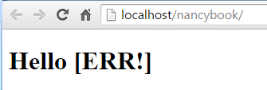
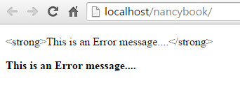

# 六、视图引擎

Nancy，就像许多 web 工具包一样，有一个使用视图来组合您在浏览器中看到的输出的概念。

## 定义视图

对你们中的一些人来说，“观点”的概念可能是一个你从未遇到过的概念；对其他人来说，你可能只有通过使用像 ASP.NET MVC 这样的工具包才知道它(MVC 中的“V”代表“视图”)。

然而，你有没有停下来思考过究竟什么是一种观点？

根据《牛津英语词典》，它被定义为看到某样东西的能力，或者从某个特定的地方被看到的能力，当在网络环境中使用时，比如 Nancy，或者实际上任何产生视图的框架作品，这都非常符合它的含义。

从最终用户的角度来看，视图是在浏览器中看到的东西。然而，事情远不止如此，因为根据我们的定义，任何可以在网络浏览器中被视为输出的东西都可以被归类为视图。

使我们的定义与众不同的是，我们的观点是“可组合”输出的结果。这里我们的意思是我们的输出不是静态的(比如一个预先制作好的 HTML 文件，甚至是一个 PDF 文档)；相反，它的输出是使用静态内容和应用生成的数据混合生成的。

根据这个定义，使用模板页面创建最终输出的传统 Windows web 应用页面(web 表单)可以被视为视图，许多人不同意这一点。

为了理解 Nancy，视图是使用静态和基于程序的混合数据作为输入生成的框架输出。对于那些来自 JavaScript 的人来说，视图是模板库的输出，比如[车把](http://handlebarsjs.com/)或者[小胡子](https://mustache.github.io/)。

那么，为什么有必要定义一个观点，而不是仅仅提到它是 Nancy 产生的？正如您到目前为止所看到的，Nancy 是异常模块化的，到目前为止，您可以将不同的视图引擎插入到框架中应该不足为奇。

## 查看引擎

简而言之，视图引擎是一个库，它根据给它的输入生成您的视图。

回到我们对视图的定义，停下来想一想 ASP.NET MVC 中的主视图生成器，Razor。

Razor 是为该框架生成视图的视图引擎；从技术上讲，handlebar 是一个 JavaScript 视图引擎，用于创建使用 handlebar 模板格式生成输出的视图。

因为有许多不同的引擎可供选择，你可以选择使用最适合你的。如果 Razor(来自 MVC)是你的东西，你可以很容易地在你的基于 Nancy 的项目中使用 Razor。您可以使用的其他一些工具有 NHaml、DotLiquid 和 Markdown。

您可以可靠地使用所有这三个和其他；您只需要使用 NuGet 将它们添加到您的项目中。一旦它们被添加，开始定义您选择的视图引擎所需的模板文件是一个简单的任务。

Nancy 提供的视图引擎都是基于约定的，并且将匹配它们通常的文件类型扩展名，以便通过它们自己进行映射。这意味着定义您的视图只需要创建简单的文本文件并给这些文件一个适当的扩展名。

最后要知道的是，Nancy 将总是在一个名为“视图”的文件夹中查找，该文件夹与您要求它用作视图模板的任何文件的执行代码相关。

但是，这是可以改变的，我们将在稍后查看 Nancy bootstrapper 类时更深入地讨论这一点。

## 创建您的第一个视图

如果你还没有，给自己创建一个简单的 Nancy 应用；您可以复制我的代码，使用前面提到的模板之一，或者手工完成整个过程。我创建了一个空的网络应用，没有身份验证，没有 MVC，没有网络表单支持，也没有任何文件的初始创建。

出于我们的目的，我们将使用 Nancy 开箱即用的视图引擎，称为 SSVE，或“The**S**uper**S**implement**V**view**E**engine。”

一旦有了一个框架应用，向其中添加一个包含 Nancy route 模块的简单类，包含以下代码:

代码清单 14

```cs
          using Nancy;

          namespace nancybook.modules
          {
            public class BaseRoutes : NancyModule
            {
              public BaseRoutes()
              {
                Get[@"/"] = _ => View["firstView/hellonancy"];

              }
            }
          }

```

此路由将导致应用中 **/** 路径的所有请求请求一个名为> **的视图文件。< *ext* >** 从一个名为> **的文件夹中第一次查看**中的默认视图文件夹为您的应用。

这里我把文件扩展名设为`<ext>`，表示文件扩展名可以变化。

就 SSVE 而言。嘘，嘘。html 和。htm 是可接受的文件扩展名。

将我们到目前为止看到的所有内容放在一起，在项目中创建一个名为**视图**的文件夹，然后在其中创建一个名为**第一视图**的文件夹。在该文件夹中，创建一个名为**Hellonancy.html**的常规 HTML 文件，并将以下 HTML 代码放入其中:

代码清单 15

```cs
          <!DOCTYPE html>
          <html>

            <head>
              <title>Hello Nancy FX</title>
            </head>

            <body>
              <h1>Hello Nancy FX</h1>
            </body>

          </html>

```

如果您在解决方案资源管理器中查看，您应该有如下内容:


图 7:解决方案资源管理器显示视图文件的正确文件夹和文件名

如果此时按下 **F5** 并运行您的项目，您应该会在默认浏览器中看到一个说“你好 Nancy FX”的 HTML 页面。


图 8:我们在浏览器中看到的第一个视图

如果您想知道图 8 中的 **localhost/nancybook** URL 是什么，那只是和我设置开发环境的方式有关；对你来说，这可能会有所不同，也许只是显示**本地主机**、**本地主机:12345** 或类似的东西。只要页面内容相同，一切都应该正常。

### 简单提一下静态内容

此时，您可能想知道如何在视图中包含静态文件，例如图像、JavaScript 文件和其他常见的 web 应用文件。Nancy 通过创建一个名为 **Content** 的文件夹，并将您的文件放入其中，然后使用类似以下内容的东西，使这一切变得非常容易:

`Response.AsFile("index.html", "text/html");`

没有文件夹前缀的所有内容都将在名为“内容”的文件夹中查找，然后在该文件夹下的任何子文件夹中查找。

这个约定可以在自定义引导程序文件中更改(我们将在后面的章节中看到)，您可以轻松地设置规则，以便 JavaScript 文件在脚本文件夹中，样式在样式文件夹中，等等。

然而，目前我只是假设所有静态资源都在 Content 文件夹中。请随意整理您认为合适的文件夹；只需记住根据需要更改代码示例。

回到我们对视图的讨论，理论上，您可以将资源放入单独的视图文件中，然后让视图返回它们。然而，这将意味着您的所有静态资源也将通过正在使用的视图引擎，这可能会给不需要处理的文件的交付增加非常轻微的延迟。

然而，因为您得到了两个世界的最佳结果，所以通过视图引擎传递所有的 JS、CSS 和其他东西来进行组合、打包、减小大小或任何其他基于请求的处理方式并不难。我让你在这里做实验。

### 回到我们的视野

正如您已经看到的，通过视图引擎返回静态内容并不难，但是我们不应该止步于此。正如我在本章开头所定义的，使用视图不仅仅是返回一个页面；它是将已知的数据与该页面相结合，然后将该页面显示为两个输入的合并。

让我们在项目中添加一个新类，作为视图的数据模型。使用解决方案资源管理器，添加一个名为`FirstModel.cs`的新类，如下所示:

代码清单 16

```cs
          using System;

          namespace nancybook
          {
            public class FirstModel
            {
              public string Name { get; set; }
              public DateTime TimeOfRequest { get; set; }
            }
          }

```

以我们前面的示例路由为例，让我们添加对新对象的引用，然后将它作为页面的数据对象返回:

代码清单 17

```cs
          using System;
          using Nancy;

          namespace nancybook.modules
          {
            public class BaseRoutes : NancyModule
            {
              public BaseRoutes()
              {
                FirstModel demoModel = new FirstModel
                {
                  Name = "Shawty",
                  TimeOfRequest = DateTime.Now
                };
                Get[@"/"] = _ => View["firstView/hellonancy", demoModel];
              }
            }
          }

```

当运行时，这将做与以前完全相同的事情，因为我们还没有改变我们的观点来对数据采取行动。但是，您现在已经将`demoModel`中的数据传递给了您的视图，就像其他框架一样，您可以使用您选择的视图引擎用来显示该数据的任何处理规则。

将`hellonancy.html`中的 HTML 代码修改如下:

代码清单 18

```cs
          <!DOCTYPE html>
          <html>

            <head>
              <title>Hello Nancy FX</title>
            </head>

            <body>
              <h1>Hello @Model.Name</h1>
              <h2>The time is @Model.TimeOfRequest</h2>
            </body>

          </html>

```

确保您重建了您的项目，然后通过按下 **F5** 或刷新浏览器来重新运行它。您应该会在浏览器中看到以下内容:


图 9:我们的浏览器输出显示了包含我们数据的视图

SSVE 是一个非常简单的引擎，但是对于大多数用例来说非常好——因为它很简单；可用的处理指令不像其他引擎那样多种多样。

然而，这并不妨碍它的用处。

例如，您可以通过使用`@Each`操作符来循环项目集合。使用`@Each`时，使用`@Current`参考当前迭代的模型，然后使用`@EndEach`关闭循环，如下图所示:

代码清单 19

```cs
          <!DOCTYPE html>
          <html>

            <head>
              <title>Hello Nancy FX</title>
            </head>

            <body>
              <!-- If we passed our data in as List<FirstModel> we could do the following -->
              @Each.Model
                <h1>Hello @Current.Name</h1>
              @EndEach

            </body>

          </html>

```

如您所料，这将显示数据对象中传入的名称列表。

您也可以使用`@If`处理指令在视图中执行非常基本的决策。`If`有两个版本:`@If`和`@IfNot`，如果条件匹配或不匹配，这两个版本将分支，具体取决于您使用的是哪一个。这里有一个“陷阱”:T4 条件必须是布尔值(真或假)，这意味着您不能执行检查，如`if count < 10`或`if name == 'joe'`。但是，如果您正确地规划了您的对象，这并不会真正带来问题。

还有第三种调用`If`的方式，使用`Has`，它允许你基于数据对象中存在的属性集合来设置条件。为了证明这一点，改变你的`FirstModel.cs`类，使它看起来如下:

代码清单 20

```cs
          using System;
          using System.Collections.Generic;

          namespace nancybook
          {
            public class FirstModel
            {
              public List<string> Names { get; set; }
              public DateTime TimeOfRequest { get; set; }
              public bool IsError { get; set; }
              public string ErrorMessage { get; set; }

            }
          }

```

现在更改您的路由模块，使其具有以下代码:

代码清单 21

```cs
          using System;
          using Nancy;

          namespace nancybook.modules
          {
            public class BaseRoutes : NancyModule
            {
              public BaseRoutes()
              {
                var demoModel = new FirstModel
                {
                  Names = new List<string> { "Shawty", "Frank", "Alice", "Bob", "Julie", "Samantha"},
                  TimeOfRequest = DateTime.Now,
                  IsError = false,
                  ErrorMessage = "This is an Error message...."
                };

                Get[@"/"] = _ => View["firstView/hellonancy", demoModel];
              }
            }
          }

```

重建项目，然后对视图的 HTML 代码进行以下更改:

代码清单 22

```cs
          <!DOCTYPE html>
          <html>

            <head>
              <title>Hello Nancy FX</title>
            </head>

            <body>

            @If.Model.HasNames
              <h1>Names</h1>
              @Each.Model.Names
                <h2>@Current</h2>
              @EndEach
            @EndIf

            @If.IsError
              <h2 style="color: Red;">Oh Noes: @Model.ErrorMessage</h2>
            @EndIf

            @IfNot.IsError
              <h2 style="color: Green;">Phew, no errors...</h2>
            @EndIf

            </body>

          </html>

```

当你运行这个时，你应该会得到一个名字列表，以及一条绿色的消息，说明`"No Errors"` >。

现在尝试将`IsError`属性更改为`true`，并将`Names`属性设置为`null`。当您重建并重新运行您的项目时，您现在应该会发现您没有收到列表(但重要的是没有错误)和一条红色消息，其中包含您放在`ErrorMessage`属性中的文本。如果您将 names 集合设置为空列表而不是 null，您应该会发现一切都是一样的。

当我们讨论处理空集合的时候，如果你让 SSVE 在模型中显示一个不存在的属性，实际上会发生什么？

您可能期望会抛出一个异常，并且您会得到一个黄色的死亡屏幕(就像在其他框架中一样)，但是您不会。相反，你会得到这样的东西:



图 10:当你要求 Nancy 展示一些不存在的东西时，她是这么做的

在您期望看到模型属性内容的地方，您将看到“[ERR！]".至少在我看来(其他人会不同意)，这是一个好得多的方法，因为它允许我在开发时仍然看到我的布局，而不必不断地确保我的对象中至少有虚拟变量，并且它允许 QA 测试立即看到缺失的值。

对于一个简单的视图引擎，SSVE 还可以做一些事情。

通过放置感叹号(**！**)在 at 符号( **@** )之后，您可以用 HTML 自动编码输出:

代码清单 23

```cs
          var demoModel = new FirstModel
          {
            //...
            ErrorMessage = "<strong>This is an Error message....</strong>"
          };

```

这将产生以下输出:



图 11:使用 SSVE @！句法

与此 HTML 一起使用时:

代码清单 24

```cs
          <p>@!Model.ErrorMessage</p>
          <p>@Model.ErrorMessage</p>

```

SSVE 也可以使用`@Partial`、`@Master`和`@Section`处理指令来做基本分音和带小节的母版页。

将新的 HTML 文件添加到名为`master.html`的`firstview`文件夹中，然后向其中添加以下 HTML:

代码清单 25

```cs
          <!DOCTYPE html>
          <html>

            <head>
              <title>Hello Nancy FX</title>
            </head>

            <body>

              <h1>This header is in the master page</h1>
              <hr />
              @Section['Body']

            </body>

          </html>

```

在同一文件夹中创建第二个 HTML 文件；我们将称之为`partial.html`并添加以下内容:

代码清单 26

```cs
          <div style="width: 200px; height: 200px; border: 1px solid black;">
            <h1>Oh Hai....</h1>
            <p>I'm your new partial content.</p>
          </div>

```

现在更改您的`hellonancy.html`文件，使其如下所示:

代码清单 27

```cs
          @Master['firstview/master.html']

          @Section['Body']
            <h2>I'm some content that's defined in hellonancy.html</h2>
            <p>and I've brought along a friend to the party:</p>
            @Partial['firstview/Partial.html']
          @EndSection

```

如果现在在浏览器中重新运行或刷新项目，您应该会看到以下内容:


图 12:母版页/部分示例产生的输出

SSVE 工具箱中的最后两个处理指令是防伪标记和路径扩展操作符。

简单来说，添加`@AntiForgeryToken`指令会在输出中的那个位置生成一个隐藏的输入。然后，当页面被发送回控制器时，验证这一点。但是，请注意，默认情况下不会启用 CSRF 保护；您需要在自定义引导程序中启用它(您将在后面的章节中学习),以便对它进行检查。

|  | 提示:CSRF 是黑客用来访问网站的常见攻击形式。大多数工具包和框架(包括 Nancy)都有某种形式的保护来抵御这种类型的攻击。如果你想了解更多信息，可以在网上搜索“跨站点请求伪造”或“OWASP 十大问题”路径操作符扩展您在 HTML 代码中拥有的任何路径，以便它们在您的应用中正确引用正确的路径。 |

例如，如果您指定:

`@Path['~/mypath/myfile.ext']`

您的网站位于:

`http://myserver/mysite/`

视图将在浏览器中以下列方式呈现:

`http://myserver/mysite/mypath/myfile.ext`

但是，从 1.2 版本开始，任何前面有 **~** 的路径都会自动扩展，所以`@Path`现在只在少数情况下才真正需要，应该大部分被认为是不推荐使用的。

## 总结

在本章中，您学习了如何使用内置的视图引擎 SSVE 将数据和 HTML 结合起来，以在应用中产生数据驱动的输出。您了解到，SSVE 虽然非常简单，但它包含了足够多的与生成视图相关的基本任务。

您学习了其他视图引擎，如 Razor 和 NHaml，还学习了如何定义和使用与静态内容相比的视图概念。

在下一章中，我们将考虑使用模型绑定和验证将数据从您的 HTML 页面带回您的 Nancy 路由，从而为您提供一个完全双向的、数据驱动的 web 应用。