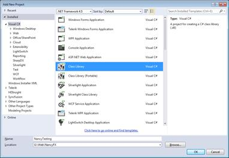
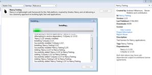
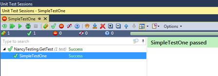
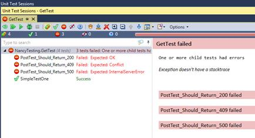

# 第十三章测试

说到 Nancy，真正隐藏的宝石之一是它所提供的测试框架。南希是从“去”这个词开始的，心里有测试它的能力。正因为如此，超级复制者快乐之路不仅延伸到用它开发应用，也延伸到测试应用。

就像您可以添加到 Nancy 中的其他所有东西一样，您可以通过安装 **Nancy，使用 NuGet 获得测试框架。测试**。

为了更深入地了解如何使用测试框架，在现有的解决方案中添加一个新的类库项目。如果您愿意，可以将测试作为实际应用的一部分来创建，但是将它们保存在单独的程序集中是推荐的，也是明智的。



图 31:添加一个新的类库项目来放置我们的测试

一旦你添加了你的新类库项目，调出你的 NuGet 包管理器并添加 **Nancy。测试**到新项目:



图 32:添加 Nancy 测试包

当您在您的包管理器中时，将 **NUnit** 测试框架(或者您喜欢使用的任何测试框架)添加到项目中。我使用 NUnit 是因为我是 JetBrains ReSharper 的用户，R#默认情况下内置了对 NUnit 的支持，让我可以轻松管理我的测试。

我在本章中为演示 Nancy 的测试能力而编写的测试将使用 NUnit 的语法编写。如果您使用不同的测试框架，您将需要修改您的测试，以便它们使用您的框架和测试运行器支持的语法。

向测试项目中添加一个新类，并添加以下代码:

代码清单 68

```cs
          using nancybook.modules;
          using Nancy;
          using Nancy.Testing;
          using NUnit.Framework;

          namespace NancyTesting
          {
            class GetTest
            {
              [Test]
              public void SimpleTestOne()
              {
                // Arrange
                var browser = new Browser(with => with.Module(new TestingRoutes()));

                // Act
                var response = browser.Get("/");

                // Assert
                Assert.AreEqual(HttpStatusCode.OK, response.StatusCode);

              }
            }
          }

```

你会看到`TestingRoutes`是红色的，如果你在这一点上运行你的测试，它将无法构建。

向测试项目中添加对您的主 Nancy 应用的项目引用，然后在您的主 Nancy 应用中添加一个名为`TestingRoutes`的空路由模块。cs 如下:

代码清单 69

```cs
          using System;
          using System.Collections.Generic;
          using System.IO;
          using Nancy;
          using Nancy.Responses;

          namespace nancybook.modules
          {
            public class TestingRoutes : NancyModule
            {
            }
          }

```

更新您的测试，以包括新模块所在的命名空间。就我而言，我在测试组件的`using`子句中添加了`using nancybook.modules;`。

此时，`TestingRoutes`引用应该从红色变成你默认的类名颜色，表示可以引用。

如果您现在尝试运行测试，您应该会发现测试编译并运行。然而，它仍然失败，因为我们还没有实现我们测试的路线。


图 33:我们的第一次测试失败

返回到您的主 Nancy 应用，并更新测试路由模块，使其看起来像这样:

```cs
          using Nancy;

          namespace nancybook.modules
          {
            public class TestingRoutes : NancyModule
            {
              public TestingRoutes()
              {
                Get[@"/"] = _ => "Hello World";
              }
            }
          }

```

再次运行您的测试，这次应该会通过。



图 34:这次我们的测试通过了

南希给你提供了一个对象。该对象不是系统中浏览器的抽象；它是一个定制的、自运行的无头浏览器实例，能够执行浏览器可以做的许多事情，只是孤立的。

例如，您可以通过要求 Nancy 向您的路线发送表单值并检查返回的响应来非常容易地测试您的帖子接受者。假设我们有一个路由，允许我们在数据库中存储姓名和电子邮件地址，如果记录已保存，我们希望该路由提供状态代码`200`，如果记录已经存在，则提供状态代码`409`，如果有任何其他错误，则提供状态代码`500`。

为此，我们最有可能创建如下三个测试:

代码清单 70

```cs
              [Test]
              public void PostTest_Should_Return_200()
              {
                // Arrange
                var browser = new Browser(with => with.Module(new TestingRoutes()));
                // Act
                var response = browser.Post("/save/", (with) =>
                {
                  with.HttpRequest();
                  with.FormValue("Name", "Joe Smith");
                  with.FormValue("Email", "joe@anemail.com");
                });
                // Assert
                Assert.AreEqual(HttpStatusCode.OK, response.StatusCode)
              }
              [Test]
              public void PostTest_Should_Return_409()
              {
                // Arrange
                var browser = new Browser(with => with.Module(new TestingRoutes()));
                // Act
                var response = browser.Post("/save/", (with) =>
                {
                  with.HttpRequest();
                  with.FormValue("Name", "Existing Person");
                  with.FormValue("Email", "existing@anemail.com");
                });
                // Assert
                Assert.AreEqual(HttpStatusCode.Conflict, response.StatusCode);
              }
              [Test]
              public void PostTest_Should_Return_500()
              {
                // Arrange
                var browser = new Browser(with => with.Module(new TestingRoutes()));
                // Act
                var response = browser.Post("/save/", (with) =>
                {
                  with.HttpRequest();
                  with.FormValue("NOTName", "Existing Person");
                  with.FormValue("NOTEmail", "existing@anemail.com");
                });
                // Assert
                Assert.AreEqual(HttpStatusCode.InternalServerError, response.StatusCode);
              }

```

如果您立即运行这些，您会看到它们会像预期的那样失败。



图 35:我们所有的后期测试都失败了

让我们切换回主应用中的测试路由模块，并检查我们的参数；如果它们不存在，我们将返回一个`500`错误。

代码清单 71

```cs
          using Nancy;

          namespace nancybook.modules
          {
            public class TestingRoutes : NancyModule
            {
              public TestingRoutes()
              {
                Get[@"/"] = _ => "Hello World";

                Post[@"/save"] = _ =>
                {
                  if (!Request.Form.Name.HasValue || !Request.Form.Email.HasValue)
                  {
                    return 500;
                  }

                  return null;
                };

              }
            }
          }

```

重新运行你的测试，一切正常，第一个测试应该通过，但是另外两个测试仍然失败。你可能会发现`200`测试也通过了；即使我们返回了一个空值，南希仍然会认为这是一个成功的测试，并默认通过了`200 ok`测试。如果是的话，不要担心——对于我们的测试目的来说，这完全没问题。

让我们让我们的测试像预期的那样通过另外两个测试。更改您的路由模块，使代码如下所示:

代码清单 72

```cs
          using Nancy;

          namespace nancybook.modules
          {
            public class TestingRoutes : NancyModule
            {
              public TestingRoutes()
              {
                Get[@"/"] = _ => "Hello World";

                Post[@"/save"] = _ =>
                {
                  if (!Request.Form.Name.HasValue || !Request.Form.Email.HasValue)
                  {
                    return HttpStatusCode.InternalServerError;
                  }

                  if (Request.Form.Name == "Existing Person" && Request.Form.Email == "existing@anemail.com")
                  {
                    return HttpStatusCode.Conflict;
                  }

                  return HttpStatusCode.OK;
                };

              }
            }
          }

```

这一次，三项测试都应该通过。

您还可以检查其他结果，例如重定向。让我们想象一下，我们的路由模块没有返回`500`，而是返回了一个指向错误页面的重定向。我们可以通过如下更改测试来进行测试:

代码清单 73

```cs
              [Test]
              public void PostTest_Should_Return_500()
              {
                // Arrange
                var browser = new Browser(with => with.Module(new TestingRoutes()));

                // Act
                var response = browser.Post("/save/", (with) =>
                {
                  with.HttpRequest();
                  with.FormValue("NOTName", "Existing Person");
                  with.FormValue("NOTEmail", "existing@anemail.com");
                });

                // Assert
                response.ShouldHaveRedirectedTo("/posterror");
              }

```

在不改变路线的情况下运行它应该会再次失败。但是，我们可以更改路由，使其执行如下重定向:

代码清单 74

```cs
          using Nancy;

          namespace nancybook.modules
          {
            public class TestingRoutes : NancyModule
            {
              public TestingRoutes()
              {
                Get[@"/"] = _ => "Hello World";

                Post[@"/save"] = _ =>
                {
                  if (!Request.Form.Name.HasValue || !Request.Form.Email.HasValue)
                  {
                    return Response.AsRedirect("/posterror");
                  }

                  if (Request.Form.Name == "Existing Person" && Request.Form.Email == "existing@anemail.com")
                  {
                    return HttpStatusCode.Conflict;
                  }

                  return HttpStatusCode.OK;
                };

              }
            }
          }

```

这将再次导致测试通过。

Nancy 的测试特性还可以检查给定元素、类和标识的返回的 HTML 内容；事实上，如果你能为它创建一个 CSS3 样式选择器，那么你就可以对它进行测试。

测试类在引擎盖下使用 [CsQuery](https://github.com/jamietre/CsQuery) ，从经验来说，我还没有找到一个它无法处理的选择器。

这里有一个来自 NancyFX Wiki 的例子:如果你想提交一个不正确的登录到一个登录表单，然后检查输出包含一个名为`errorBox`的 HTML 元素，带有一个特定的 CSS 类，你可以使用下面的测试轻松做到这一点:

代码清单 75

```cs
              [Test]
              public void Should_display_error_message_when_error_passed()
              {
                // Given
                var bootstrapper = new DefaultNancyBootstrapper();
                var browser = new Browser(bootstrapper);

                // When
                var response = browser.Get("/login", (with) =>
                {
                  with.HttpRequest();
                  with.Query("error", "true");
                });

                // Then
                response.Body["#errorBox"]
                        .ShouldExistOnce()
                        .And.ShouldBeOfClass("floatingError")
                        .And.ShouldContain(
                            "invalid",
                            StringComparison.InvariantCultureIgnoreCase);
              }

```

您会注意到，在该示例中，我们使用默认的 Nancy 引导程序创建了浏览器。您可以使用与在主应用中修改自定义引导程序完全相同的方式来修改此引导程序。您还可以使用它来配置 IoC 容器，以进一步帮助您进行测试。

## 总结

在这一章中，你看到了更多的超级快乐之路。您看到了 Nancy 如何让您轻松测试您的 Nancy 应用，以及它如何解决所有网络开发人员面临的最大难题之一:测试构成用户界面的 HTML 内容。

在过去的 100 页中，你发现(我希望)南希再次为开发基于网络的服务带来了快乐。当我和我的一些同行讨论这个问题，想知道该把什么写进书里的时候，其中一个人对我说了一些我开始写这本书以来一直困扰我的话:“NancyFX？这不就是那个试图成为 c# NodeJS 的工具包吗？”

在我看来，NancyFX 比 NodeJS 要多得多(尽管 Node 确实紧随其后)。NancyFX 代表了一个由开发人员构建的框架，他们经历了我们其他人所经历的所有痛苦，并从另一边带着伤疤走了出来。

下次你在推特上浏览时，记得给**@ the dejunkie**和 **@GrumpyDev** 发一条信息，感谢他们让你的生活和网页开发变得如此容易。如果你想参与这个项目，并有可能成为南希 MVM(最有价值的宠臣)，那么就去[NancyFX.org](http://nancyfx.org/)看看文件。

你可以用这个框架做更多的事情——在这本书里，我们已经到达了旅程的终点，但是你和南希的旅程才刚刚开始。


图 36:享受网络应用开发的“超级快乐之路”。