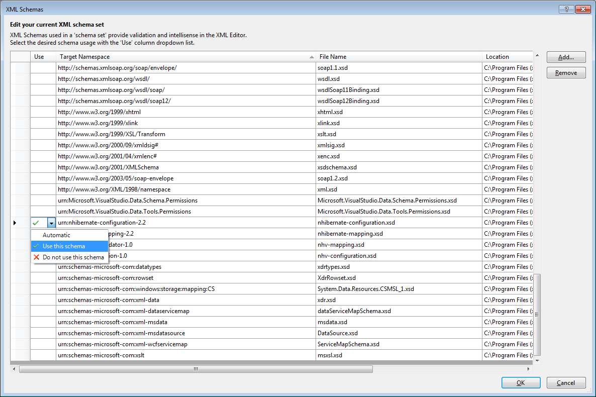
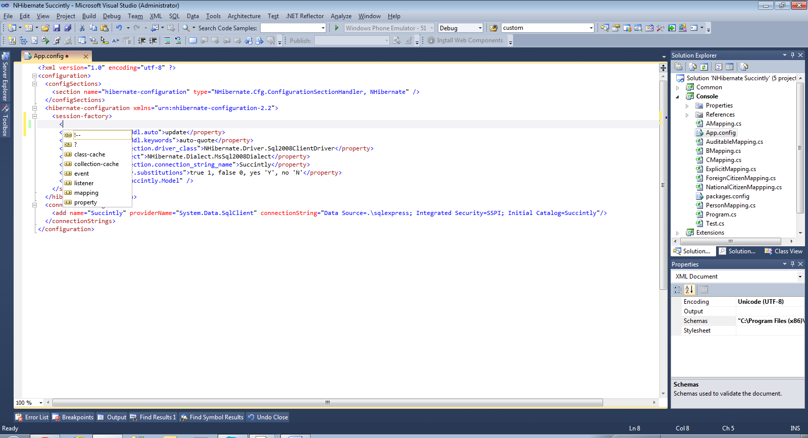

# 第二章配置

在使用 NHibernate 之前，您必须对其进行配置。基本的必需配置包括数据库驱动程序、要使用的方言和特定于驱动程序的数据库连接字符串。正如您将看到的，有几种方法可以在 NHibernate 中实现这种配置。

对于驱动程序和方言，这些都包含在 NHibernate 中:

表 1: NHibernate 驱动程序和方言

| 驾驶员 | 方言 | 描述 |
| **CsharpSqliteDriver** | **通用方言** | 社区数据提供程序的 NHibernate 驱动程序 |
| **db 2400 drive** | **DB2400Dialect** | 一个使用国际商用机器公司的 NHibernate 驱动程序。DB2.iSeries 数据提供程序 |
| **DB2 drive** | **DB2Dialect** | 一个使用国际商用机器公司的 NHibernate 驱动程序。数据。DB2 数据提供程序 |
| **火鸟客户端河** | **点火开关** | 一个 NHibernate 驱动程序，用于使用位于 FirebirdSql 中的 Firebird 数据提供程序。数据。FirebirdClient 程序集 |
| **火鸟司机** | **点火开关** | 一个使用 FirebirdSql 的 NHibernate 驱动程序。数据。火鸟数据提供者 |
| **IfxDriver** | **信息方言****报告方言 0940****informixdial 1000** | 一个使用 Informix 数据提供程序的 NHibernate 驱动程序 |
| **ingresriver** | 忘恩负义 | 用于使用 Ingres 数据提供程序的 NHibernate 驱动程序 |
| **MySqlDataDriver** | **MySQLDialect****MySQL 5 方言** | 为 MySQL 提供数据库驱动程序 |
| **NpgsqlDriver** | 研究生方言**PostgreSQL81Dialect****PostgreSQL 82 查询** | PostgreSQL 数据提供程序为 PostgreSQL 提供了一个数据库驱动程序 |
| **OdbcDriver** | **通用方言** | 一个使用 ODBC 数据提供程序的 NHibernate 驱动程序 |
| **油 db river** | **通用方言** | 一个使用 OleDb 数据提供程序的非 ibernate 驱动程序 |
| **oracleclientriver** | **Oracle 8 idi CT****Oracle 9 idi CT****Oracle 10 gdict** | 使用甲骨文数据提供程序的非虚拟驱动程序 |
| **oracledataclientriver** | **Oracle 8 idi CT****Oracle 9 idi CT****Oracle 10 gdict** | 一个使用甲骨文的 NHibernate 驱动。数据访问数据提供程序 |
| Oracle litdataclientriver | **甲骨文文本** | 一个使用甲骨文的 NHibernate 驱动。数据访问。精简数据提供程序 |
| **SQL 2008 客户端河** | **MSSQL 2008 方言****mssqlazure 2008 方言** | SQL Server 2008 和 Azure 驱动程序 |
| **SQL lienttdriver** | **mssql7 方言****MsSql2000Dialect****MSSQL 2005 方言** | 一个用于使用 SqlClient 数据提供程序的 NHibernate 驱动程序 |
| **SQLite20Driver** | **sqlititedialog** | 系统的网络驱动程序。的数据提供程序。NET 2.0 |
| **SQL server cedar river** | **mssqlce 方言****MsSqlCe40Dialect** | 一个用于微软 SQL Server CE 数据提供程序的非网络驱动程序 |
| **syaseasaclientriver** | **Sybase asa 9 方言** | SybaseAsaClientDriver 驱动程序为 Adaptive Server Anywhere 9.0 提供了数据库驱动程序 |
| **syaseaseclientriver** | **Sybase asea 15 方言** | 这为使用 ADO.NET 驱动程序的 Sybase ASE 15 提供了一个驱动程序 |
| **Sybase sqlanywhere dotnet 4 driver** | **Sybase sqlanywhere 10 dialect** | SQL Anywhere 12 的 SQL 方言 |
| **Sybase sqlanywhere 驱动程序** | **Sybase sqlanywhere 10 dialect****Sybase sqlanywhere 11 dialect** | Sybase SQL Anywhere 驱动程序为 Sybase SQL Anywhere 10 及更高版本提供了数据库驱动程序 |

其中一些驱动程序和方言是其他驱动程序和方言的子类，这意味着它们继承了祖先的东西，也增加了新的东西。您可以通过继承最合适的类来自由创建自己的类。

驱动程序是负责通过实例化一个**系统来实际创建连接的类。适用于特定数据库引擎的派生类。如果您有可用的 ODBC 或 OLE DB 驱动程序，您可以通过使用相应的 NHibernate 驱动程序连接到几乎任何数据库(但是如果您使用特定的驱动程序，性能会更好)。**

方言描述了特定版本引擎的特征和注册功能，因此，一般来说，您应该选择更接近您正在使用的实际版本的方言(尽管您可以始终使用通用方言)。

配置本质上是 **NHibernate 的一个实例。Cfg .配置**类。它需要以某种方式填充，并且是使用 NHibernate 所必需的，因为一切都是从它开始的。您可能有几个配置实例，如果您需要同时支持不同的数据库(甚至托管在不同的引擎中)，这是很典型的。但是，在大多数情况下，您只需要一个配置实例。

## XML 配置

在 NHibernate 的早期版本中，唯一可能的配置是通过 XML。现在的流程是:您在配置文件( **App.config** 或 **Web.config** )上注册一个自定义部分，然后您创建这个部分，填充它所需的定义。该部分如下所示:

```cs
      <?xml version="1.0" encoding="utf-8" ?>
      <configuration>
        <configSections>
          <section name="hibernate-configuration" 
      type="NHibernate.Cfg.ConfigurationSectionHandler, NHibernate" />
        </configSections>
        <hibernate-configuration >
          <session-factory>
            <property name="hbm2ddl.keywords">auto-quote</property>
            <property name="connection.driver_class">NHibernate.Driver.Sql2008ClientDriver
            </property>
            <property name="dialect">NHibernate.Dialect.MsSql2008Dialect</property> <property name="connection.connection_string_name">Succinctly</property>
              <property name="query.substitutions">true 1, false 0</property>
            <mapping assembly="Succinctly.Model" />
          </session-factory>
        </hibernate-configuration>
        <connectionStrings>
          <add name="Succinctly" providerName="System.Data.SqlClient" 
      connectionString="Data Source=. \sqlexpress; Integrated Security=SSPI; Initial Catalog=Succinctly"/>
        </connectionStrings>
      </configuration>

```

这是一个最小的 NHibernate 配置。可以看到在**休眠-配置**部分，我们设置了一些属性并添加了一个映射引用。他们的意思是:

*   **hbm2ddl.keywords** :告诉 NHibernate 是否应该自动转义所有的列名和表名，这样，如果使用了保留的关键字，它们就会得到适当的处理。例如，在 SQL Server 中，将任何名为 **INT** 的列替换为**【INT】**、 **ORDER** 替换为**【ORDER】**等。虽然不是必需的，但是有这个设置是非常方便的。我建议你留着它。
*   **connection.driver_class** :实现 NHibernate 驱动程序的. NET 类的全名，从而允许您连接到数据库(见上表)。在这个例子中，我们使用的是 SQL Server 2008 驱动程序；这是必需的属性。
*   **方言**:也是. NET 类全名的必需设置，绑定到驱动程序，支持特定数据库版本的方言。对于本例，我们将使用 SQL Server 2008。
*   **connection . connection _ string _ name**:在自己的部分中指定的连接字符串的名称(**connectionStrings**)；除非您在属性**中设置了实际的连接字符串，否则这是必需的。建议您将连接字符串留在它们自己的部分，只需通过其唯一的名称引用您想要的连接字符串(在这种情况下，**简洁地说**)。**
*   **query . replacements**:每当查询即将发送到数据库时，都会执行的一些常量替换。在本例中，我们将字符串常量**真**和**假**分别转换为它们的 SQL Server 等效项 **1** 和 **0** 。虽然严格来说不是必需的，但是您应该有这个设置，否则在执行 HQL 查询时可能会遇到麻烦。
*   **映射**:包含实体类及其映射文件的程序集的全名，为此使用了 XML 配置(更多信息请参见映射一章)。这不是必需的，因为有其他方法可以实现这一点。但是，尽管如此，它还是很有用的，您可以根据需要放置任意多的映射条目。

要构建配置实例并从配置文件加载设置，您只需要:

```cs
      Configuration cfg = new Configuration().Configure();

```

|  | 提示:导入 NHibernate。Cfg 命名空间。 |

如果您想使用基于 XML 的配置，有一件事可能会派上用场，那就是 Visual Studio 智能感知。您可以通过以下步骤添加此类支持:

1.  从[下载配置部分的 XML 模式定义(XSD)文件。](https://github.com/nhibernate/nhibernate-core/blob/master/src/NHibernate/nhibernate-configuration.xsd)
2.  在 Visual Studio 中打开 **Web.config** 或 **App.config** 文件，其中有 NHibernate 配置。
3.  进入**属性**窗口，选择**模式**旁边的省略号(…)按钮。
4.  点击**添加…** 按钮，选择刚刚下载的**nhibernate-configuration . xsd**文件。
5.  Select **Use this Schema** at the line with target namespace **urn:nhibernate-configuration-2.2**:

    

    图 8:智能感知的 XML 模式

6.  当您关闭 **XML 模式**窗口时，您将拥有智能感知:



图 9:非交互式 XML 的智能感知

## 贫嘴配置

NHibernate 3.2 带来了所谓的贫嘴(或流畅)配置。基本上，它使配置文件中的配置部分变得不必要，而是依赖代码来初始化 NHibernate。上一节中表达的配置可以转换为以下代码:

```cs
      Configuration cfg = new Configuration()
      .DataBaseIntegration(db =>
      {
        db.ConnectionStringName = "Succinctly";
        db.Dialect<MsSql2008Dialect>();
        db.Driver<Sql2008ClientDriver>();
        db.HqlToSqlSubstitutions = "true 1, false 0";
        db.KeywordsAutoImport = Hbm2DDLKeyWords.AutoQuote;
      })
      .AddAssembly("NHibernate.Succinctly");

```

|  | 提示:您需要导入 NHibernate，NHibernate。Cfg，NHibernate。方言，还有 NHibernate。驱动程序命名空间。 |

一些值得一提的事情:

*   **方言**和**驱动程序**方法采用必须从 **NHibernate 继承的泛型参数。方言.方言**和执行 **NHibernate。驱动程序. IDriver** 分别为。因此，没有简单的方法可以传入动态解析的类型，例如**系统类型。键入**或字符串格式。为此，您可以使用等效属性**方言**和**connection . driver _ class**:

```cs
      Configuration cfg = BuildConfiguration()//whatever way you like
      .SetProperty(NHibernate.Cfg.Environment.ConnectionDriver, typeof(Sql2008ClientDriver)
      .AssemblyQualifiedName)
      .SetProperty(NHibernate.Cfg.Environment.Dialect, typeof(MsSql2008Dialect).AssemblyQualifiedName)

```

*   **添加组件**方法也有一个重载，以**组件**为例。
*   如果您既有配置部分又有贫嘴配置，贫嘴设置优先。

## 我该选哪个？

还是那句话，你选择哪一个取决于你自己。它们在根本上是等价的。基于 XML 的配置为您提供了允许更改而不需要重新编译代码的优势。然而，它只是将最终的配置错误延迟到应用程序运行的后期阶段。另一方面，贫嘴配置可能会更快地检测到语法错误——甚至阻止代码完全编译——代价是只需要重新编译就可以做出最小的改变。但是它允许条件配置，这是静态 XML 无法实现的。您可以两全其美，在同一个项目中既可以基于 XML，也可以通过代码配置。例如，如果你必须处理遗留的 **HBM，这可能是有意义的。XML** 文件。

这些是 NHibernate 工作所需的最基本设置。本书的大多数例子都不知道使用了哪种数据库引擎。只要不是这样，就会明确提到。稍后，我们将学习需要额外设置的功能，因此我们将回到这一点。

|  | 注意:也可以将配置条目保存在外部文件中；也就是说，不作为 App.config 或 Web.config 文件中的内容，甚至不作为嵌入在某些程序集中的资源。这些不是典型的场景，这里不做介绍，但是您可以通过查看配置的各种重载来自由探索它们。配置方法。 |