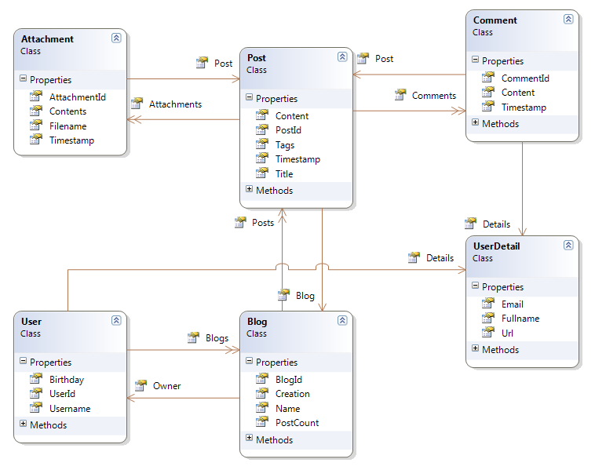
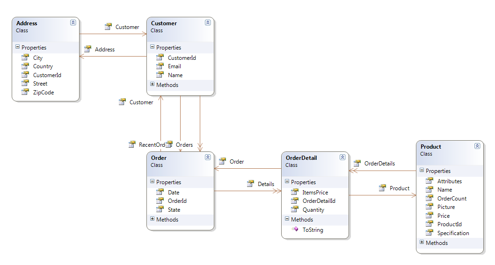

# 第三章领域模型

## 场景

让我们考虑一个简单的模型，一个博客系统:



图 10:博客系统的类模型

可以这样描述:一个**博客**归一个**用户**所有，收藏了**的帖子**。每个**帖子**可以有**评论**和**附件**，每个都指一个**帖子**。一个**用户**可能有几个**博客**。**用户**和**评论**都有**用户详情**。

偶尔，我也会参考另一个模型，一个经典的订购系统，它看起来像这样:



图 11:订单系统的类模型

这些是我们想要在代码中表示和操作的概念。然而，我将只包括博客模型的代码。您将能够在该书的[位桶存储库](https://bitbucket.org/syncfusiontech/nhibernate-succinctly)上找到订购模型的类和映射。

## 实体

我们有几种方法来表示这些概念。我选了一个。以下是我们将在整本书中使用的课程:

**用户**类 **:**

```
      public class User
      {
        public User()
        {
          this.Blogs = new Iesi.Collections.Generic.HashedSet<Blog>();
          this.Details = new UserDetail();
        }

        public virtual Int32 UserId { get; protected set;}

        public virtual String Username { get; set; }

        public virtual UserDetail Details { get; set; }

        public virtual DateTime? Birthday { get; set; }

        public virtual Iesi.Collections.Generic.ISet<Blog> Blogs { get; protected set; }
      }

```

**博客**类:

```
      public class Blog
      {
        public Blog()
        {
          this.Posts = new List<Post>();
        }

        public virtual Int32 BlogId { get; protected set; }

        public virtual System.Drawing.Image Picture { get; set; }

        public virtual Int64 PostCount { get; protected set; }

        public virtual User Owner { get; set; }

        public virtual String Name { get; set; }

        public virtual DateTime Creation { get; set; }

        public virtual IList<Post> Posts { get; protected set; }
      }

```

|  | 提示:因为 Blog 类有一个类型为 System 的属性。绘图。图像，您需要添加对系统的引用。绘图组件。 |

**岗位**班:

```
      public class Post
      {
        public Post()
        {
          this.Tags = new Iesi.Collections.Generic.HashedSet<String>();
          this.Attachments = new Iesi.Collections.Generic.HashedSet<Attachment>();
          this.Comments = new List<Comment>();
        }

        public virtual Int32 PostId { get; protected set; }

        public virtual Blog Blog { get; set; }

        public virtual DateTime Timestamp { get; set; }

        public virtual String Title { get; set; }

        public virtual String Content { get; set; }

        public virtual Iesi.Collections.Generic.ISet<String> Tags { get; protected set; }

        public virtual Iesi.Collections.Generic.ISet<Attachment> Attachments { get; protected set; }

        public virtual IList<Comment> Comments { get; protected set; }
      }

```

**评论**类:

```
      public class Comment
      {
        public Comment()
        {
          this.Details = new UserDetail();
        }

        public virtual Int32 CommentId { get; protected set; }

        public virtual UserDetail Details { get; set; }

        public virtual DateTime Timestamp { get; set; }

        public virtual String Content { get; set; }

        public virtual Post Post { get; set; }
      }

```

**附件**类:

```
      public class Attachment
      {
        public virtual Int32 AttachmentId { get; protected set; }

        public virtual String Filename { get; set; }

        public virtual Byte[] Contents { get; set; }

        public virtual DateTime Timestamp { get; set; }

        public virtual Post Post { get; set; }
      }

```

最后是 **UserDetail** 类(它是 **User** 和 **Comment** 类的 **Details** 组件的实现):

```
      public class UserDetail
      {
        public String Url { get; set; }

        public String Fullname { get; set; }

        public String Email { get; set; }
      }

```

一些注意事项:

*   如您所见，我们不需要实现任何基类或特殊接口。这并不意味着 NHibernate 不能使用它们；事实上恰恰相反。
*   所有类都是非密封的。严格来说，这不是一项要求，而是一种推荐做法。
*   有些属性是虚拟的，基本上除了那些来自 **UserDetail** 组件类的属性。还有，推荐的做法；我们将在下一章讨论延迟加载时看到原因。
*   表示主键的属性有一个受保护的 setter。这是因为 NHibernate 将为我们提供这个密钥，所以没有必要。事实上，改变它是危险的。
*   集合也有受保护的设置器，因为我们将使用它们执行的操作不需要更改实际的集合引用，而只需要添加、移除并最终清除它。
*   所有集合都在它们的声明类的构造函数中被实例化，因此它们永远不会为空。

## 在我们开始之前

因为 NHibernate 是一个 ORM，它将把表转换成类，把列转换成属性，把记录转换成对象实例和值。这种转换具体如何发生取决于映射。映射是添加到配置实例中的东西。您可以添加多个映射，通常每个映射一个。NET 类，您希望该类能够持久化到数据库中。至少，映射必须将表名与类名相关联，将包含主键的列与相关的类属性相关联，并且可能将一些额外的列关联到它们将转向的属性中。

就 NHibernate 而言，实体只是一个普通的旧 CLR 对象(POCO)。在创建这些实体时，您必须做出基本选择:

*   您从代码开始，遵循领域驱动设计(DDD)方法。您可以定义自己的类，而不用太担心它们将如何存储在数据库中。相反，你专注于把它们做好。这可能包括创建继承关系和复杂属性。
*   您从数据库开始，您必须精心设计您的实体，使它们与数据模型相匹配。这可能是因为这是你公司的工作方式，你有一个遗留的数据库，或者这只是个人偏好的问题。

我们不会探讨什么是最好的方法；这取决于你。NHibernate 完全支持这两种方式。如果您从代码开始，NHibernate 将很乐意为您生成或验证数据库。在这两种情况下——数据库优先或代码优先——NHibernate 还将为您提供选项，根据您的实体检查数据库，或者更新数据库以匹配实体，或者警告您是否存在差异。在**配置**类中有一个 **SchemaAction** 设置，使用贫嘴配置:

```
      Configuration cfg = new Configuration()
      .DataBaseIntegration(db =>
      {
        //…
        db.SchemaAction = SchemaAutoAction.Validate;
      })

```

以及在 XML 配置中，作为一个属性:

```
      <property name="hbm2ddl.auto">validate</property>

```

您可以传递给**schema action**/**hbm2ddl . auto**的可能值有:

*   **创建/创建**:将始终删除现有表，并从当前映射中重新创建它们。
*   **重新创建/创建-删除**:与**创建、**相同，不同的是当 NHibernate 使用完数据库后(会话工厂被处理掉)，它会再次删除所有内容。
*   **更新/更新** : NHibernate 会将现有的表与当前的映射进行比较，并在必要时更新数据库，包括创建缺失的表或列。
*   **Validate/validate** :如果实际表和当前映射的比较检测到不匹配，将抛出异常。

|  | 提示:创建和重新创建是危险的，您应该只在需要快速建立数据库或者因为每个映射表都将被丢弃而没有重要信息的情况下使用它们，例如单元测试或演示，但是没有映射的表将被单独留下。Update 还会创建任何丢失的表和列，因此在实际场景中使用是安全的，但是如果您有很多映射的类，可能需要一些时间来检查所有的表。如果没有通过调用 SchemaAction 或在 XML 配置上设置 hbm2ddl.auto 属性来设置任何值，则不会执行任何验证，也不会进行架构更新/创建。 |