# 四、映射

## 概念

我们本质上定义了以下映射:

*   实体。
*   实体标识符。
*   实体属性。
*   对其他实体的引用。
*   收藏品。
*   继承。

标识符、属性、引用和集合都是实体类的成员，其中:

*   标识符可以是简单的。NET 类型，比如那些可以作为表列找到的类型(比如 **Int32** 、 **String** 或 **Boolean** )，还有常见的值类型，比如 **DateTime** 、 **Guid** 或 **TimeSpan** ，或者，为了表示复合主键，它们也可以是一些自定义的类类型。
*   标量属性(或仅仅是属性)也是基元或公共值类型；其他情况是通用二进制大对象的**字节[]** 和 XML 数据类型的 **XDocument/XmlDocument** 。
*   复杂属性，在领域驱动设计(DDD)中被称为值对象，在 NHibernate 中被称为组件，是具有逻辑上组合在一起的一些属性的类。例如，考虑一个邮政地址，它可能由街道地址、邮政编码、城市、国家等组成。当然，在数据库中，这些也存储为标量列。
*   对其他实体的引用(一对一、多对一)被声明为关系另一端的实体类型；在数据库中，这些是外键列。
*   实体的集合(一对多、多对多)被声明为另一端点的实体类型的集合。当然，在数据库中，这些也作为外键列存储。

让我们更详细地看看这些概念。

## 实体

实体是 NHibernate 映射的核心。它是一个. NET 类，将被保存到一个(或者更多，正如我们将看到的)表中。它最重要的可配置选项是:

*   名称:类的名称；强制设置。
*   表:类映射到的表，也是强制设置，除非我们定义类的层次结构(参见实体**字节[]** )。
*   惰性:如果实体的类允许创建一个代理，从而允许惰性加载。默认为**真**。
*   可变的:如果对类成员的任何改变都应该保存到数据库中。默认为**真**。
*   乐观锁:乐观并发控制要遵循的策略(参见乐观锁)。默认为**无**。
*   其中限制:可选的 SQL 限制(请参见限制)。
*   批处理大小:NHibernate 将自动加载的相同类型的附加实例的数量。您将在“批处理加载”一节中看到对该设置的更详细的解释。不是必须设置，默认值为 **0** 。

## 属性

属性要么映射到表中的列，要么映射到 SQL 公式，在这种情况下，它不会被持久化，而是在从数据库加载包含实体时进行计算。属性具有以下属性:

*   名称:实体类中属性的名称；必需的。
*   列:它映射到的列的名称；除非使用公式，否则是必需的。
*   长度:对于字符串或数组属性，表中列的最大长度。仅在生成表或列时使用；不需要，默认值为 **255** 。
*   不为空:表示属性的基础列是否为空值；必须与属性类型匹配(对于值类型，如果它们在数据库中可以为空，则必须用**声明它们？**)；不需要，默认为**假**。
*   公式:如果设置，它应该是一个可能引用实体表的其他列的 SQL 语句；如果设置，column 属性没有任何意义。
*   唯一:指示列是否应该唯一；仅在生成表或列时使用。默认为**假**。
*   乐观锁定:如果设置为 **false** ，它将不会考虑这个属性来确定实体的版本是否应该改变(关于版本控制的更多信息在乐观锁定一章中)。不需要，默认值为**真**。
*   更新:指示在更新实体时是否考虑更新该列；默认为**真**。
*   插入:是否应该插入列；默认为**真**。
*   已生成:如果设置，指示列的值是在插入时生成的(**插入**)还是**总是生成的**，通常是通过触发器生成的。默认为**从不**，如果使用了其他东西，在实体插入或更新后需要额外的 SELECT 来知道它的值。
*   Lazy:如果在加载包含实体时要加载该列，那么如果该列包含大内容(CLOBs 或 BLOBs)，并且其值可能不总是必需的，那么我们应该将其设置为 **true** 。默认为**假**。
*   类型:如果属性不是基本类型之一，它应该包含具体的全名。NET 类，它负责从来自数据库的列中创建属性的实际值，并将其转换回数据库。NHibernate 包含几个类型实现。
*   可变的:这个属性的改变会反映到数据库中吗？默认为**真**。

对于标量属性，无论是在实体级别还是作为组件的成员，NHibernate 都支持以下内容。NET 类型:

表 2: NHibernate 识别的类型

| 。网络类型 | 欧塔布 | 目的 |
| --- | --- | --- |
| **布尔** | 是 | 布尔或单个位(0/1 值) |
| **字节** / **字节** | 是 | 8 位有符号/无符号整数，通常用于表示单个 ANSI 字符 |
| **字节[]t1** | 是 | 存储在 BLOB 中 |
| **充电** | 是 | 单个 ANSI 或 UNICODE 字符 |
| **文化信息** | 是 | 存储为包含区域性名称的字符串 |
| **日期时间** | 是 | 日期和时间 |
| **日期时间关闭** | 是 | 相对于世界协调时偏移的日期和时间 |
| **十进制** | 是 | 128 位有符号整数，按 10 的幂缩放 |
| **加倍** | 是 | 双精度(64 位)有符号浮点值 |
| **枚举**(枚举类型) | 是/否 | 存储为整数(默认)、字符或字符串 |
| guid | 是 | GUIDs 或通用 128 位数字 |
| **国际号码 16** / **国际号码 16** | 是 | 16 位有符号/无符号整数 |
| **国际 32** / **国际 32** | 是 | 32 位有符号/无符号整数 |
| **国际 64** / **国际 64** | 是 | 64 位有符号/无符号整数 |
| **对象**(可序列化) | 不 | 序列化后存储在包含对象内容的 BLOB 中 |
| **单** | 是 | 单精度(32 位)有符号浮点值 |
| **弦** | 是 | ANSI 或 UNICODE 可变或固定长度字符 |
| **时间跨度** | 是 | 时间 |
| **类型** | 是 | 存储为包含程序集限定类型名的字符串 |
| uri | 是 | 存储为字符串 |
| **XDocument** / **XmlDocument** | 是 | 可扩展标记语言 |

第二列指示 NHibernate 是否支持属性的类型，也就是说，不需要额外的配置。如果我们需要映射一个非标准的原语类型或者 NHibernate 开箱即用就能识别的其他类型之一( **Enum** 、 **DateTime** 、 **DateTimeOffset** 、 **Guid、TimeSpan、Uri、type、CultureInfo、Byte[]** )或者如果我们需要更改给定属性的处理方式，我们需要使用自定义用户类型。对于常见情况，不需要指定类型。对于其他场景，可用的类型有:

表 3:非纤维类型

| 非纤维类型 | 。网络属性类型 | 描述 |
| --- | --- | --- |
| **焦虑型** | **充电** | 将**字符**存储为 ANSI(每个字符 8 位)列，而不是 UNICODE (16 位)。一些民族文字可能会丢失。 |
| 焦虑型 | **弦** | 将**字符串**存储为 ANSI(每个字符 8 位)列，而不是 UNICODE (16 位)。一些民族文字可能会丢失。 |
| **二进制语言类型** | **字节[]t1** | 将在特定于数据库的 BLOB 中存储**字节[]** 。如果数据库需要定义最大长度，如在 SQL Server 中，使用**二进制 BlobType** 。 |
| charboolean type | **布尔** | 将**布尔**值转换为**真**或**假** |
| 约会类型 | **日期时间** | 仅存储**日期时间**的日期部分 |
| **枚举类型<T>T1】** | **枚举**(枚举类型) | 将枚举值存储为单个字符，从其数值中获取 |
| **枚举字符串类型<T>T1】** | **枚举**(枚举类型) | 将枚举值存储为其字符串表示形式，而不是数值 |
| **LocalDateTimeType** 的缩写形式 | **日期时间** | 将**日期时间**存储为本地 |
| **系列化字体** | **对象**(可序列化) | 将**对象**序列化为数据库特定的 BLOB 类型。 |
| **字符串型** | **弦** | 将存储一个特定于数据库的 CLOB 类型的**字符串**，而不是标准的 VARCHAR |
| **TicksType** | **日期时间** | 将**日期时间**存储为刻度数 |
| **松露酱的种类** | **布尔** | 将**布尔**值转换为 **T** 或 **F** |
| **UTC 日期时间类型** | **日期时间** | 将**日期时间**存储为世界协调时 |
| yesnotype | **布尔** | 将**布尔**值转换为 **Y** 或 **N** |

复杂属性不同于对其他实体的引用，因为它们的所有内部属性都存储在与声明实体相同的类中，并且复杂属性没有任何类似标识符的东西，只是标量属性的集合。它们有助于将概念上相关的一些属性进行逻辑分组(例如，考虑地址)。一个组件可以在几个类中使用，它唯一的要求是它不是抽象的，并且它有一个公共的、无参数的构造函数。

一处房产不一定要**公开**，但至少要**保护**，而不是**私人**。它的可见性将影响查询 API 使用它的能力；例如，LINQ 将只使用公共财产。设置者和获取者的不同访问级别也是可以的，只要你最多保持**保护**即可。

最后，虽然您可以使用带有显式支持字段的属性，但确实没有必要这样做。事实上，有些功能不能与支持字段一起工作，根据经验，您应该坚持使用自动属性。

## 自定义类型

我们需要指定类型的一些场景包括，例如，当我们需要在一个 BLOB 列(如 SQL Server 中的 **VARBINARY(MAX)** )中存储一个**字符串**时，或者当我们只需要存储一个 **DateTime** 的日期部分时，或者甚至当我们需要存储一个**布尔**作为它的字符串表示时( **True** / **False** )。就像我说的，在大多数情况下，你不需要担心这个。

您可以创建自己的用户类型，例如，如果您想要将一些列公开为不同的类型，比如将 BLOB 转换为**图像**。请参见以下示例:

```cs
      [Serializable]
      public sealed class ImageUserType : IUserType, IParameterizedType
      {
        private Byte[] data = null;

        public ImageUserType() : this(ImageFormat.Png)
        {
        }

        public ImageUserType(ImageFormat imageFormat)
        {
          this.ImageFormat = imageFormat;
        }

        public ImageFormat ImageFormat { get; private set; }

        public override Int32 GetHashCode()
        {
          return ((this as IUserType).GetHashCode(this.data));
        }

        public override Boolean Equals(Object obj)
        {
          ImageUserType other = obj as ImageUserType;

          if (other == null)
          {
            return (false);
          }

          if (Object.ReferenceEquals(this, other) == true)
          {
            return (true);
          }

          return (this.data.SequenceEqual(other.data));
        }

        Boolean IUserType.IsMutable
        {
          get
          {
            return (true);
          }
        }

        Object IUserType.Assemble(Object cached, Object owner)
        {
          return (cached);
        }

        Object IUserType.DeepCopy(Object value)
        {
          if (value is ICloneable)
          {
            return ((value as ICloneable).Clone());
          }
          else
          {
            return (value);
          }
        }

        Object IUserType.Disassemble(Object value)
        {
          return ((this as IUserType).DeepCopy(value));
        }

        Boolean IUserType.Equals(Object x, Object y)
        {
          return (Object.Equals(x, y));
        }

        Int32 IUserType.GetHashCode(Object x)
        {
          return ((x != null) ? x.GetHashCode() : 0);
        }

        Object IUserType.NullSafeGet(IDataReader rs, String[] names, Object owner)
        {
          this.data = NHibernateUtil.Binary.NullSafeGet(rs, names) as Byte[];

          if (data == null)
          {
            return (null);
          }

          using (Stream stream = new MemoryStream(this.data ?? new Byte[0]))
          {
            return (Image.FromStream(stream));
          }
        }

        void IUserType.NullSafeSet(IDbCommand cmd, Object value, Int32 index)
        {
          if (value != null)
          {
            Image data = value as Image;

            using (MemoryStream stream = new MemoryStream())
            {
              data.Save(stream, this.ImageFormat);
              value = stream.ToArray();
            }
          }

          NHibernateUtil.Binary.NullSafeSet(cmd, value, index);
        }

        Object IUserType.Replace(Object original, Object target, Object owner)
        {
          return (original);
        }

        Type IUserType.ReturnedType
        {
          get
          {
            return (typeof(Image));
          }
        }

        SqlType[] IUserType.SqlTypes
        {
          get
          {
            return (new SqlType[] { NHibernateUtil.BinaryBlob.SqlType });
          }
        }

        void IParameterizedType.SetParameterValues(IDictionary<String, String> parameters)
        {
          if ((parameters != null) && (parameters.ContainsKey("ImageFormat") == true))
          {
            this.ImageFormat = typeof(ImageFormat).GetProperty(parameters["ImageFormat"], 
      BindingFlags.Static | BindingFlags.Public | BindingFlags.GetProperty).GetValue(null, null) as ImageFormat;
          }
        }
      }

```

*   如何从数据源检索数据并将其保存回数据源(**空安全获取**和**空安全设置**方法)
*   值比较，用于让 NHibernate 知道属性是否已更改(**等于**)和**获取哈希值**，以进行更改跟踪
*   数据库数据类型( **SqlTypes** )

## 标识符

对于最常见的单列主键情况，标识符可以是标量属性，也可以是包含组成复合键的所有列的属性的自定义类。如果是标量属性，则不允许所有类型。你应该只使用基本类型( **Char** 、 **Byte** / **SByte** 、 **Int16** / **UInt16** 、 **Int32** / **UInt32** 、 **Int64** / **UInt64** 、**十进制**、**字符串**)和一些 BLOB、CLOB 和 XML 列不能用作主键。

标识符属性也可以是非公开的，但是您应该使用的最受限制的访问级别是**受保护的**或**受保护的内部**。受保护的设置器和公共获取器也很好，并且实际上是一个好主意——除非您想使用手动分配的标识符。

围绕标识符的一个非常重要的概念是生成策略。基本上，当记录要插入数据库时，主键就是这样生成的。这些是最重要的高级策略:

表 4: NHibernate 身份生成器

| 策略类型 | 生成器(通过代码/XML) | 标识符属性类型 | 描述 |
| --- | --- | --- | --- |
| 数据库生成的 | **身份/身份****序列/序列** | **Int16** / **UInt16** 、 **Int32** / **UInt32** 、 **Int64** / **UInt64** | SQL Server、MySQL 和 Sybase 等都支持标识列。Oracle 和 PostgreSQL 支持序列，并且可以为多个表提供值。两者对于多个同时访问都是安全的，但不允许批处理(稍后将详细介绍)。 |
| 基于 GUID 的 | **Guid/guid****GuidComb/guid.comb** | guid | GUIDs 由 NHibernate 生成，并被认为是唯一的。对多个同时访问是安全的，并且可以进行批量插入。**引导组合**总是顺序的。 |
| 由支撑台支撑 | 高原/线 | **Int16** / **UInt16** 、 **Int32** / **UInt32** 、 **Int64** / **UInt64** | 存在存储下一个高值的表。当会话需要插入记录时，它会递增并更新该值，并将其与一系列连续低值中的下一个值组合，直到该范围用完，并且需要检索另一个高值。它对于多个同时访问和批处理都是安全的。 |
| 手动分配 | **分配/被分配** | 任何的 | 您负责为您的实体分配唯一的密钥；当有多个会话插入记录时，请小心使用。 |

还有其他标识符生成器，但建议您坚持使用这些生成器，因为它们是所有映射 API 都支持的。需要对这些策略进行讨论。

数据库生成的键可能很有吸引力，因为它们自然地用于常见的数据库编程，并且可能作为自然的选择出现。然而，它们确实有一些缺点:

*   因为密钥是在插入记录后在数据库内部生成的，所以需要额外的立即选择来获得生成的密钥。这使得批处理变得不可能，因为我们不能一起发布多个 INSERTs。
*   因为标识列和序列都是为了速度而设计的，所以它们没有考虑数据库事务。这意味着，即使回滚，生成的密钥虽然没有被使用，但也会丢失。
*   它们不符合工作单元的概念，也就是说，一旦实体被标记为要保存，而不仅仅是当工作单元被提交时，它将尝试插入新记录。
*   最重要的是:它们不独立于数据库。如果希望使用标识列或序列，则只能在支持此功能的引擎中使用，而不能更改映射配置。

|  | 提示:使用序列生成器时，您必须提供实际序列的名称作为生成器的参数(见下文)。 |

GUIDs 有一些有趣的方面:

*   因为它们保证是唯一的，所以在设计将由来自第三方数据库的记录填充的数据库时，它们是显而易见的选择；永远不会有冲突。
*   他们计算速度很快。
*   它们独立于数据库。

但是，它们有一个严重的缺点:如果我们使用聚集主键(SQL Server 中的默认值)，因为生成的 GUIDs 不是连续的，它们会使引擎不断地重新组织索引，在现有的键之前或之后添加新的键。为了解决这个问题，NHibernate 已经实现了一个替代版本 **GuidComb** ，该版本基于 Jimmy Nilsson 设计的算法，可在[http://www.informit.com/articles/article.aspx?p=25862](http://www.informit.com/articles/article.aspx?p=25862)获得。它基本上包括使一个 GUID 连续:按顺序生成的两个 GUID 在数字上也是连续的，同时保持唯一。如果你真的需要一个 GUID 作为你的主键，一定要选择 **GuidComb** 。但是，请记住，GUIDs 确实占用了更多的空间——16 个字节，而不是一个整数的 4 个字节。

对于大多数场景，推荐使用**高流量**生成策略。它独立于数据库，允许批处理，能够很好地处理工作单元的概念，并且，尽管当要插入第一条记录时，它确实需要一个 SELECT 和一个 UPDATE，当低值用完时，它需要额外的值，但是低值立即可用。此外，范围可以很大，允许插入许多记录，而无需执行额外的查询。

至于手动分配的标识符，肯定有它们有用的场景。但是他们有一个大问题。因为 NHibernate 使用标识符值(或缺少标识符值)来判断是否要更新或插入记录，所以它需要在持久化实体之前发出 SELECT，以便知道该记录是否已经存在。这破坏了批处理，如果要同时使用多个会话，可能会出现问题。

除了生成策略，标识符还支持以下属性:

*   名称:的名称。NET 实体属性；必需的。
*   列:包含主键的列的名称；必需的。
*   长度:对于字符串列，将包含其大小，仅用于生成表或列。如果没有设置，默认为 **255** 。
*   未保存的值:标识符属性在生成标识符之前所具有的值的文本表示；用于区分实体是新的还是更新的。如果未设置，则默认为标识符属性的基础默认值( **0** 表示数字，**为空**表示类等)。

## 参考文献

像表关系一样，一个实体也可以与另一个实体相关联。据说实体的类对另一个实体的类有引用。有两种类型的关系:

*   **一对一**:主键在两个表之间共享。对于主表上的每条记录，辅助表上最多只能有一条记录引用它。当您有强制数据和与之关联的可选数据时非常有用。
*   **多对一**:一个表的记录可能与另一个表的一个记录相关联。主表上的多条记录可能会引用另一条记录。把它当成唱片的母体。

引用在另一个端点上具有类的类型。当然，对于同一个类，甚至可以有多个不同名称的引用。引用的属性有:

*   名称:必填项。
*   必需:如果主类上的记录必须引用第二类上的现有记录。默认为**假**。
*   关系类型:或者**一对一**或者**多对一**。
*   懒惰:默认为**代理**，意味着被引用的实体不会与其引用的实体同时加载，而是会为其创建一个代理(访问时会导致其加载)。其他可能是**假**或**无代理**。
*   未找到:未找到引用记录时的行为。默认为**异常**，另一种可能是**忽略**。

## 收藏品

一个实体(父实体)可以同时与某种类型的多个实体(子实体)相关联。这些系列可以用多种方式来描述:

*   端点多重性:一对多(一个父代有多个子代，一个子代只有一个父代)、多对多(一个父代可以有多个子代，每个子代可以有多个父代)和值(子代不是实体而是值)。
*   父端点和子端点之间的关系:单向(父知道子端点，但这些子端点不知道父端点)，双向(双方都知道对方)。
*   概念上:Bag(允许重复，顺序无关紧要)和 set(不允许重复，元素要么排序要么不排序)。
*   它们包含的内容:值(标量值)、组件(没有自身标识的复杂值)和实体(具有自身标识的复杂值)。
*   它们是如何被访问的:索引的或键控的(某些东西用于标识集合中的每个项目)和非索引的。
*   外键存储在哪里:反向(外键位于子端点)或非反向。

NHibernate 有以下集合类型:

表 5: NHibernate 集合类型

| 收藏品 | 关系 | 要存储的项目 | 变址类型 | 。网络类型 |
| --- | --- | --- | --- | --- |
| **设置**(非索引、双向、反向) | 一对多，多对多 | 实体、元素、组件 | 不适用的 | **IEnumerable<T>T1、**I collection<T>T3、 **Iesi。集合. generic . iset<T>T5】****** |
| **包**(非索引、双向、反向或非反向) | 一对多，多对多，价值观 | 实体、值、组件 | 不适用的 | **IEnumerable<T>T1、**I collection<T>T3、**IList<T>T5】****** |
| **列表**(索引、双向、反向或非反向) | 一对多，多对多，价值观 | 实体、值、组件 | 数字 | **IEnumerable<T>T1、**I collection<T>T3、**IList<T>T5】****** |
| **映射**(索引、单向、反向或非反向) | 多对多的价值观 | 实体、值、组件 | 实体，标量值 | **<【tkey，tvalue】>** |
| **Id 包**(非索引、单向、反向或非反向) | 一对多，多对多，价值观 | 实体、值、组件 | 数字 | **IEnumerable<T>T1、**I collection<T>T3、**IList<T>T5】****** |
| **数组**(索引、单向、反向或非反向) | 一对多，多对多，价值观 | 实体、值、组件 | 数字 | **IEnumerable<T>T1、**I collection<T>T3、 **T []****** |
| **原始数组**(索引、单向、非反向) | 一对多，多对多，价值观 | 基本类型的值 | 数字 | **IEnumerable<T>T1、**I collection<T>T3、 **T []****** |

|  | 提示:您不能使用。网上银行系统。集合. generic . iset<t>；从现在开始，NHibernate 需要使用> Iesi.Collections。</t> |

集合具有以下属性:

*   名称:这是强制性的。
*   类型(**包、套、列表、地图、id 包、数组、基元数组**):这个也是必选的。
*   键:包含关系键的列或实体的名称(在**映射**的情况下)。
*   顺序:加载集合元素的列。可选。
*   集合是否为**逆**(**设置**、**列表**、 **id 包**、**数组**、**图元数组**):默认为**假**。
*   其值的实体或元素类型:必需。
*   限制:可选的限制 SQL(请参见限制)。
*   惰性:集合中期望的惰性(参见惰性加载)。默认为**懒**。
*   端点多重性:在实体集合的情况下是一对多或多对多。强制性的。

一些评论:

*   NHibernate 完全支持泛型集合，您真的应该使用它们。
*   除**阵**和**基元阵**外，均支持惰性加载(参见惰性加载)。**数组**和**原始数组**不能改变大小；也就是说，不可能添加或删除项目。
*   那个。用于声明集合的. NET 类型应该始终是接口。实际类型将决定您希望能够对集合做什么。比如 **IEnumerable < T >** 不允许修改，这对于你不想让用户改变收藏内容的场景来说是一个不错的选择。
*   除了**基元数组**之外的所有集合类型都支持实体、基元类型和组件作为它们的项目。
*   **Id 包**、**列表**、**数组**和**原始数组**使用未映射到类属性的附加表列来存储主键(在 **id 包**的情况下)或排序。如果您使用 NHibernate 创建数据模型，NHibernate 将为您创建它。
*   实体之间的双向关系总是**逆**。
*   地图、组件集合(复杂属性)、元素(基本类型)和**基本数组**永远不是**逆**。
*   映射和多对多关系总是需要额外的映射表。
*   到目前为止，最常用的集合是**集合**、**列表**和**地图**。
*   与**包**相比，**套**的优势在于，它们不允许重复，而大多数情况下，这正是我们想要的。
*   由于**包**不知道其元素的关键，每当我们在**包**中添加或移除时，我们都需要移除并重新插入所有元素，这导致了糟糕的性能。 **Id 包**通过允许未映射的键列来解决这个问题。
*   **列表**比**数组**更适合作为索引集合，因为**数组**不能改变它们的大小。
*   **地图**非常适合用数字以外的东西来索引一个集合。
*   应该很少需要**数组**映射。

每个实体只使用一个表来存储器械包，其中一个表包含另一个表的外键:

| 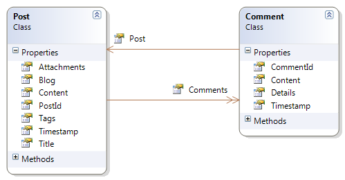 | 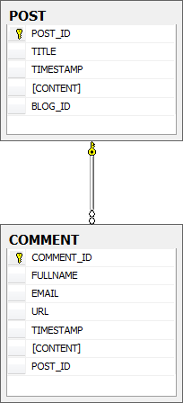 |

图 12:套装和包类和桌子模型

它通常在代码中这样声明:

```cs
      public virtual Iesi.Collections.Generic.ISet<Comment> Comments { get; protected set; }

```

列表也只需要两个表，但是它们使用一个额外的、未映射的列来存储一个实体在其父集合中的顺序:

| 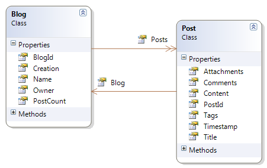 |  |

图 13:一对多/多对一类和表模型

一个**列表**(也是一个**包**)被映射为一个**IList<T>T5】，其元素的顺序由**列表**的索引列属性决定，该属性必须是一个整数。**

```cs
      public virtual IList<Post> Posts { get; protected set; }

```

多对多关系确实需要一个额外的映射表，该映射表不会转换为任何类，但由 NHibernate 透明地使用:

| 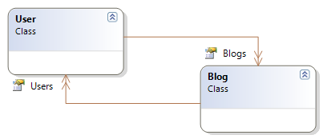 |  |

图 14:多对多类和表模型

这些由两个**集合**表示，每个类一个，其中只有一个是**逆**。

```cs
      public class User
      {
        public virtual Iesi.Collections.Generic.ISet<Blog> Blogs { get; protected set; }
      }

      public class Blog
      {
        public virtual Iesi.Collections.Generic.ISet<User> Users { get; protected set; }
      }

```

映射还需要一个额外的表来存储额外的属性(在值是单个标量的情况下)或另一个端点实体的键(对于一对多关系):

| 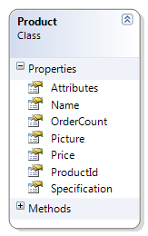 | 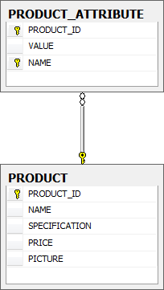 |

图 15:映射类和表模型

地图以。NET by **IDictionary < TKey，t value>T1】。关键总是包含类，值可以是实体(其中我们有一对多或多对多的关系)、组件(复杂属性)或元素(基本类型)。**

```cs
      public virtual IDictionary<String, String> Attributes { get; protected set; }

```

## XML 映射

现在我们彻底搞清楚了。一开始，NHibernate 只有基于 XML 的映射。这仍然是受支持的，它基本上意味着，对于每个实体，必须有一个对应的 XML 文件来描述该类如何绑定到数据模型(您可以有一个文件用于所有映射，但是这使得找到特定的映射更加困难)。XML 文件必须将实体类绑定到数据库表，并声明它将识别的属性和关联。必须存在的一个重要属性是包含实体实例标识符(表的主键)的属性。

按照惯例，NHibernate 的 XML 映射文件以 **HBM 结尾。XML** (无论如何)。这个例子的映射可能是(请原谅，稍后会有解释):

将智能感知添加到 **HBM 的方法。XML** 文件是这样的:

1.  从[下载配置部分的 XML 模式定义(XSD)文件。](https://github.com/nhibernate/nhibernate-core/blob/master/src/NHibernate/nhibernate-mapping.xsd)
2.  在 Visual Studio 中打开有映射配置的 **.HBM.XML** 文件。
3.  进入**属性**窗口，选择**模式**旁边的省略号(…)按钮。
4.  点击**添加…** 按钮，选择刚刚下载的 **nhibernate-mapping.xsd** 文件。
5.  在具有目标命名空间**的行中选择**使用该模式**urn:nhibernate-mapping-2.2**。

首先是**用户**类的映射，应该放在**用户. hbm.xml** 文件中:

```cs
      <?xml version="1.0" encoding="utf-8"?>
      <hibernate-mapping namespace="Succinctly.Model" assembly="Succinctly.Model" >
        <class name="User" lazy="true" table="`user`">
          <id name="UserId" column="`user_id`" generator="hilo" />
          <property name="Username" column="`username`" length="10" not-null="true" />
          <property name="Birthday" column="`birthday`" not-null="false" />
          <component name="Details">
            <property name="Fullname" column="`fullname`" length="50" not-null="true" />
            <property name="Email" column="`email`" length="50" not-null="true" />
            <property name="Url" column="`url`" length="50" not-null="false" />
          </component>
          <set cascade="all-delete-orphan" inverse="true" lazy="true" name="Blogs">
            <key column="`user_id`" />
            <one-to-many class="Blog" />
          </set>
        </class>
      </hibernate-mapping>

```

接下来， **Blog** 类( **Blog.hbm.xml** ):

```cs
      <?xml version="1.0" encoding="utf-8"?>
      <hibernate-mapping namespace="Succinctly.Model" assembly="Succinctly.Model" >
        <class name="Blog" lazy="true" table="`blog`">
          <id name="BlogId" column="`blog_id `" generator="hilo" />
          <property name="Name" column="`NAME`" length="50" not-null="true" />
          <property name="Creation" column="`creation`" not-null="true" />
          <property name="PostCount" 
      formula="(SELECT COUNT(1) FROM post WHERE post.blog_id = blog_id)" />
          <property name="Picture" column="`PICTURE`" not-null="false" lazy="true">
            <type name="Succinctly.Common.ImageUserType, Succinctly.Common"/>
          </property>
          <many-to-one name="Owner" column="`user_id`" not-null="true" lazy="no-proxy" cascade="save-update"/>
          <list cascade="all-delete-orphan" inverse="true" lazy="true" name="Posts">
            <key column="`blog_id`" />
            <index column="`number`" />
            <one-to-many class="Post" />
          </list>
        </class>
      </hibernate-mapping>

```

**邮政** ( **邮政. hbm.xml** ):

```cs
      <?xml version="1.0" encoding="utf-8"?>
      <hibernate-mapping namespace="Succinctly.Model" assembly="Succinctly.Model" >
        <class name="Post" lazy="true" table="`post`">
          <id name="PostId" column="`post_id`" generator="hilo" />
          <property name="Title" column="`title`" length="50" not-null="true" />
          <property name="Timestamp" column="`timestamp`" not-null="true" />
          <property name="Content" type="StringClob" column="`content`" length="2000" not-null="true" lazy="true" />
          <many-to-one name="Blog" column="`blog_id`" not-null="true" lazy="no-proxy" />
          <set cascade="all" lazy="true" name="Tags" table="`tag`" order-by="`tag`">
            <key column="`post_id`" />
            <element column="`tag`" type="String" length="20" not-null="true" unique="true" />
          </set>
          <set cascade="all-delete-orphan" inverse="true" lazy="true" name="Attachments">
            <key column="`post_id`" />
            <one-to-many class="Attachment" />
          </set>
          <bag cascade="all-delete-orphan" inverse="true" lazy="true" name="Comments">
            <key column="`post_id`" />
            <one-to-many class="Comment" />
          </bag>
        </class>
      </hibernate-mapping>

```

某**帖子**的**评论** ( **评论. hbm.xml** ):

```cs
      <?xml version="1.0" encoding="utf-8"?>
      <hibernate-mapping namespace="Succinctly.Model" assembly="Succinctly.Model" >
        <class name="Comment" lazy="true" table="`comment`">
          <id name="CommentId" column="`comment_id`" generator="hilo" />
          <property name="Timestamp" column="`timestamp`" not-null="true" />
          <property name="Content" type="StringClob" column="`content`" length="2000" not-null="true" lazy="true" />
          <component name="Details">
            <property name="Fullname" column="`fullname`" length="50" not-null="true" />
            <property name="Email" column="`email`" length="50" not-null="true" />
            <property name="Url" column="`url`" length="50" not-null="false" />
          </component>
          <many-to-one name="Post" column="`post_id`" not-null="true" lazy="no-proxy" />
        </class>
      </hibernate-mapping>

```

最后，一篇**帖子**的**附件** ( **Attachment.hbm.xml** ):

```cs
      <?xml version="1.0" encoding="utf-8"?>
      <hibernate-mapping namespace="Succinctly.Model" assembly="Succinctly.Model" >
        <class name="Attachment" lazy="true" table="`attachment`">
          <id name="AttachmentId" column="`attachment_id`" generator="hilo" />
          <property name="Filename" column="`filename`" length="50" not-null="true" />
          <property name="Timestamp" column="`timestamp`" not-null="true" />
          <property name="Contents" type="BinaryBlob" column="`contents`" length="100000" not-null="true" lazy="true" />
          <many-to-one name="Post" column="`post_id`" not-null="true" lazy="no-proxy" />
        </class>
      </hibernate-mapping>

```

让我们分析一下我们这里有什么。

首先，所有实体都有一个**类**映射声明。关于这一声明，我们有:

*   班级**名称**
*   要持久化实体的**表**名称
*   期望的懒惰(参见懒惰加载)，在这个例子中总是**懒惰**

接下来，我们总是需要一个标识符声明。其中，我们有以下属性:

*   包含标识符的属性**名称**
*   包含标识符的**列**名称
*   **生成器**策略或类(在我们的示例中，总是 **hilo** ，参见标识符部分

如果我们需要传递参数，我们可以这样做:

```cs
      <?xml version="1.0" encoding="utf-8"?>
      <hibernate-mapping namespace="Succinctly.Model" assembly="Succinctly.Model" >
        <class name="Attachment" lazy="true" table="`attachment`">
          <id name="AttachmentId" column="`attachment_id`" generator="hilo">
            <param name="sequence">ATTACHMENT_SEQUENCE</param>
          </id>
        <!-- … ->
      </hibernate-mapping>

```

然后，我们有标量属性声明。对于我们需要的每项资产:

*   房产**名称**。
*   **列**名称。
*   如果该列需要为**非空**。
*   所需的**延迟**设置，参见延迟加载。
*   或者，一个 SQL 公式，在这种情况下，将不会使用列名(参见**博客**类的**邮政编码**属性)。
*   列的长度，仅适用于字符串。
*   在某些情况下，我们有一个**类型的**声明(**邮政。内容**、**博客。图片**属性)。**博客。图片**属性通过程序集限定名引用自定义用户类型( **ImageUserType** )。这种用户类型允许将 BLOB 列( **Byte[]** )翻译成. NET **图像**，非常方便。

我们有一些使用组件声明的复杂属性。它们对于存储概念上应该在一起的值很有用(参见**用户**类的**详细信息**属性和**注释**类的**详细信息**属性的映射)。组件包含:

*   房产**名称**。
*   可选地，一个**惰性**声明。
*   一个或多个标量属性映射(**列**、**长度**、**非空**)。

接下来是参考文献。有了它，我们声明我们的实体与另一个实体的子实体相关联。例如，参见**邮报**实体的**博客**协会。典型的映射包括:

*   房产**名称**。
*   存储外键的**列**名称。
*   指示外键是否可以为**非空**，用于可选引用。
*   所需的**惰性**选项。

最后，我们有收藏。这些可以有几种类型(有关讨论，请参见集合部分)。在本例中，我们有实体集合(例如，参见**帖子**实体的**注释**集合)和字符串集合(分别映射为**包**、**列表**和**集**的**标签**集合)。可能的属性取决于实际的集合，但都包括:

*   房产**名称**。
*   集合的种类(**列表**、**集合**或**包**，在本例中)。
*   **惰性**选项。
*   包含外键**键**的列，该键通常应与主实体的主键相匹配。
*   在**的情况下，**索引**列列出了**。
*   实体**类**，表示一对多关系的子方(对于实体集合)。
*   值的**类型**、**长度**、**列**和**唯一性**(用于标量值的集合)。

如果您要使用 XML 映射，请注意:您可以包含 **HBM。XML** 文件作为嵌入资源存在于类所在的程序集中，或者您可以将它们作为外部文件。

如果您想将资源文件作为嵌入式资源包括在内，这可能是个好主意，因为您需要部署的文件较少，请确保以下两点:

*   包含实体类的项目应该有一个与这些类的基本命名空间相同的基本命名空间(简单地说，例如**)。型号**):

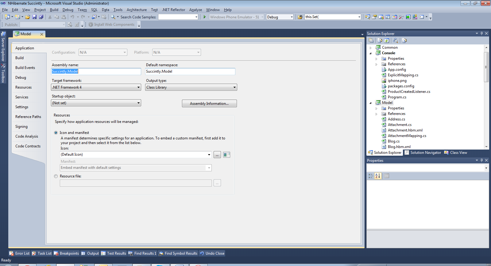

图 16:设置项目属性

*   **HBM。XML** 文件应该与它们引用的类位于同一个文件夹中。
*   每个 **HBM。XML** 文件应标记为嵌入资源:

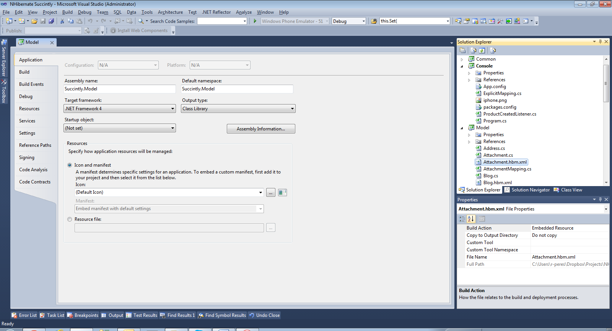

图 17:设置嵌入式资源

*   要从嵌入式资源加载映射，请使用**配置**实例的**添加程序集**方法或**T6 映射程序集>T5】标记，以防在 XML 配置中:**

```cs

        //add an assembly by name
        cfg.AddAssembly("Succinctly.Model");
        //add an Assembly instance
        cfg.AddAssembly(typeof(Blog).Assembly);

```

```cs
      <session-factory>
        <!-- … ->
        <mapping assembly="Succinctly.Model" />
      </session-factory>

```

|  | 提示:小心！您对 HBM 所做的任何更改。Visual Studio 不会自动检测到 XML 文件，因此每当您更改任何内容时，都必须显式构建项目。 |

如果您更喜欢外部文件:

```cs
      //add a single file
      cfg.AddFile("Blog.hbm.xml");
      //add all .HBM.XML files in a directory
      cfg.AddDirectory(new DirectoryInfo("."));

```

## 代码映射

从 3.2 版本开始，代码映射在 NHibernate 中是新的。它的优点是不需要额外的映射文件，并且因为它是强类型的，所以它对重构更加友好。例如，如果更改属性的名称，映射将立即反映该更改。

通过代码映射，您通常会为希望映射的每个实体添加一个新类，并让该类从 **NHibernate 继承。映射<T>T1，其中 **T** 是实体类。以下代码将产生与 **HBM 完全相同的映射。XML** 版本。您可以看到代码结构中有相似之处，方法名称与 XML 标记非常相似。**

**用户映射**类:

```cs
      public class UserMapping : ClassMapping<User>
      {
        public UserMapping()
        {
          this.Table("user");
          this.Lazy(true);

          this.Id(x => x.UserId, x =>
          {
            x.Column("user_id");
            x.Generator(Generators.HighLow);
          });

          this.Property(x => x.Username, x =>
          {
            x.Column("username");
            x.Length(20);
            x.NotNullable(true);
          });
          this.Property(x => x.Birthday, x =>
          {
            x.Column("birthday");
            x.NotNullable(false);
          });
          this.Component(x => x.Details, x =>
          {
            x.Property(y => y.Fullname, z =>
            {
              z.Column("fullname");
              z.Length(50);
              z.NotNullable(true);
            });
            x.Property(y => y.Email, z =>
            {
              z.Column("email");
              z.Length(50);
              z.NotNullable(true);
            });
            x.Property(y => y.Url, z =>
            {
              z.Column("url");
              z.Length(50);
              z.NotNullable(false);
            });
          });

          this.Set(x => x.Blogs, x =>
          {
            x.Key(y =>
            {
              y.Column("user_id");
              y.NotNullable(true);
            });
            x.Cascade(Cascade.All | Cascade.DeleteOrphans);
            x.Inverse(true);
            x.Lazy(CollectionLazy.Lazy);
          }, x =>
          {
            x.OneToMany();
          });
        }
      }

```

|  | 提示:为命名空间 NHibernate 添加一个 using 语句，NHibernate。映射。映射。ByCode 和 NHibernate.Type |

**博客映射**类:

```cs
      public class BlogMapping : ClassMapping<Blog>
      {
        public BlogMapping()
        {
          this.Table("blog");
          this.Lazy(true);

          this.Id(x => x.BlogId, x =>
          {
            x.Column("blog_id");
            x.Generator(Generators.HighLow);
          });

          this.Property(x => x.Name, x =>
          {
            x.Column("name");
            x.Length(50);
            x.NotNullable(true);
          });
          this.Property(x => x.Picture, x =>
          {
            x.Column("picture");
            x.NotNullable(false);
            x.Type<ImageUserType>();
            x.Lazy(true);
          });
          this.Property(x => x.Creation, x =>
          {
            x.Column("creation");
            x.NotNullable(true);
          });
          this.Property(x => x.PostCount, x =>
          {
            x.Formula("(SELECT COUNT(1) FROM post WHERE post.blog_id = blog_id)");
          });

          this.ManyToOne(x => x.Owner, x =>
          {
            x.Cascade(Cascade.Persist);
            x.Column("user_id");
            x.NotNullable(true);
            x.Lazy(.NoProxy);
          });

          this.List(x => x.Posts, x =>
          {
            x.Key(y =>
            {
              y.Column("blog_id");
              y.NotNullable(true);
            });
            x.Index(y =>
            {
              y.Column("number");
            });
            x.Lazy(CollectionLazy.Lazy);
            x.Cascade(Cascade.All | Cascade.DeleteOrphans);
            x.Inverse(true);
          }, x =>
          {
            x.OneToMany();
          });
        }
      }

```

**邮政编码**类 **:**

```cs
      public class PostMapping : ClassMapping<Post>
        {
          public PostMapping()
          {
            this.Table("post");
            this.Lazy(true);

            this.Id(x => x.PostId, x =>
            {
              x.Column("post_id");
              x.Generator(Generators.HighLow);
            });

            this.Property(x => x.Title, x =>
            {
              x.Column("title");
              x.Length(50);
              x.NotNullable(true);
            });
            this.Property(x => x.Timestamp, x =>
            {
              x.Column("timestamp");
              x.NotNullable(true);
            });
            this.Property(x => x.Content, x =>
            {
              x.Column("content");
              x.Length(2000);
              x.NotNullable(true);
              x.Type(NHibernateUtil.StringClob);
            });

            this.ManyToOne(x => x.Blog, x =>
            {
              x.Column("blog_id");
              x.NotNullable(true);
              x.Lazy(.NoProxy);
            });

            this.Set(x => x.Tags, x =>
            {
              x.Key(y =>
              {
                y.Column("post_id");
                y.NotNullable(true);
              });
              x.Cascade(Cascade.All);
              x.Lazy(CollectionLazy.NoLazy);
              x.Fetch(CollectionFetchMode.Join);
              x.Table("tag");
            }, x =>
            {
              x.Element(y =>
              {
                y.Column("tag");
                y.Length(20);
                y.NotNullable(true);
                y.Unique(true);
              });
            });
            this.Set(x => x.Attachments, x =>
            {
              x.Key(y =>
              {
                y.Column("post_id");
                y.NotNullable(true);
              });
              x.Cascade(Cascade.All | Cascade.DeleteOrphans);
              x.Lazy(CollectionLazy.Lazy);
              x.Inverse(true);
            }, x =>
            {
              x.OneToMany();
            });
            this.Bag(x => x.Comments, x =>
            {
              x.Key(y =>
              {
                y.Column("post_id");
              });
              x.Cascade(Cascade.All | Cascade.DeleteOrphans);
              x.Lazy(CollectionLazy.Lazy);
              x.Inverse(true);
            }, x =>
            {
              x.OneToMany();
            });
          }
        }

```

**注释映射**类:

```cs
      public class CommentMapping : ClassMapping<Comment>
      {
        public CommentMapping()
        {
          this.Table("comment");
          this.Lazy(true);

          this.Id(x => x.CommentId, x =>
          {
            x.Column("comment_id");
            x.Generator(Generators.HighLow);
          });

          this.Property(x => x.Content, x =>
          {
            x.Column("content");
            x.NotNullable(true);
            x.Length(2000);
            x.Lazy(true);
            x.Type(NHibernateUtil.StringClob);
          });
          this.Property(x => x.Timestamp, x =>
          {
            x.Column("timestamp");
            x.NotNullable(true);
          });

          this.Component(x => x.Details, x =>
          {
            x.Property(y => y.Fullname, z =>
            {
              z.Column("fullname");
              z.Length(50);
              z.NotNullable(true);
            });
            x.Property(y => y.Email, z =>
            {
              z.Column("email");
              z.Length(50);
              z.NotNullable(true);
            });
            x.Property(y => y.Url, z =>
            {
              z.Column("url");
              z.Length(50);
              z.NotNullable(false);
            });
          });

          this.ManyToOne(x => x.Post, x =>
          {
            x.Column("post_id");
            x.NotNullable(true);
            x.Lazy(LazyRelation.NoProxy);
          });
        }
      }

```

**附件映射**类:

```cs
      public class AttachmentMapping : ClassMapping<Attachment>
      {
        public AttachmentMapping()
        {
          this.Table("attachment");
          this.Lazy(true);

          this.Id(x => x.AttachmentId, x =>
          {
            x.Column("attachment_id");
            x.Generator(Generators.HighLow);
          });

          this.Property(x => x.Filename, x =>
          {
            x.Column("filename");
            x.Length(50);
            x.NotNullable(true);
          });
          this.Property(x => x.Timestamp, x =>
          {
            x.Column("timestamp");
            x.NotNullable(true);
          });
          this.Property(x => x.Contents, x =>
          {
            x.Column("contents");
            x.Length(100000);
            x.Type<BinaryBlobType>();
            x.NotNullable(true);
            x.Lazy(true);
          });

          this.ManyToOne(x => x.Post, x =>
          {
            x.Column("post_id");
            x.Lazy(LazyRelation.NoProxy);
            x.NotNullable(true);
          });
        }
      }

```

请注意，对于每一件事(除了表和列名以及原始 SQL)，都有强类型选项和枚举。所有选项都与它们的 **HBM 非常相似。XML** 对应，所以从一个映射到另一个映射应该很简单。

要将参数传递给生成器，可以使用以下方法:

```cs
      public class AttachmentMapping : ClassMapping<Attachment>
      {
        public AttachmentMapping()
        {
          this.Table("attachment");
          this.Lazy(true);

          this.Id(x => x.AttachmentId, x =>
          {
            x.Column("attachment_id");
            x.Generator(Generators.HighLow, x => x.Params(new { sequence = "ATTACHMENT_SEQUENCE" } ));
          });
          //…
      }

```

代码映射的一个问题——或者更一般地说，LINQ 表达式——是你只能访问**公共**成员。但是，NHibernate 允许您访问公共和非公共成员。如果要映射非公共类，必须使用它们的名称，例如:

```cs
      this.Id("AttachmentId", x =>
      {
      >  //…
      });

      this.Property("Filename", x =>
      {
      >  //…
      });

      this.ManyToOne("Post", x =>
      {
        //…
      });

```

现在您已经有了映射类，您需要将它们绑定到**配置**实例。有三种方法可以做到这一点:

1.  一次一个类映射(例如**类映射<T>T1)**
2.  映射的静态数组
3.  动态获得的数组

```cs
      Configuration cfg = BuildConfiguration(); //whatever way you like
      ModelMapper mapper = new ModelMapper();

      >//1: one class at a time
      mapper.AddMapping<BlogMapping>();
      mapper.AddMapping<UserMapping>();
      mapper.AddMapping<PostMapping>();
      mapper.AddMapping<CommentMapping>();
      mapper.AddMapping<AttachmentMapping>();

      >//2: or all at once (pick one or the other, not both)
      mapper.AddMappings(new Type[] { typeof(BlogMapping), typeof(UserMapping), typeof(PostMapping),
      typeof(CommentMapping), typeof(AttachmentMapping) });

      //3: or even dynamically found types (pick one or the other, not both)
      mapper.AddMappings(typeof(BlogMapping).Assembly.GetTypes().Where(x => x.BaseType.IsGenericType && x.BaseType.GetGenericTypeDefinition() == typeof(ClassMapping<>)));

      //code to be executed in all cases.
      HbmMapping mappings = mapper.CompileMappingForAllExplicitlyAddedEntities();
      cfg.AddDeserializedMapping(mappings, null);

```

为了完整起见，让我告诉您，您可以使用代码映射，而无需使用**模型映射器**类中的方法为每个要映射的实体创建一个类:

```cs
      mapper.Class<Blog>(ca =>
      {
        ca.Table("blog");
        ca.Lazy(true);
        ca.Id(x => x.BlogId, map =>
        {
          map.Column("blog_id");
          map.Generator(Generators.HighLow);
        });
      //…

```

我不会在这里包括一个完整的地图，但我认为你明白了。所有调用都应该与您在**类映射<T>T1】中的调用相同。**

## 属性映射

还有一种选择是属性映射。使用这种方法，您可以用描述它们如何映射到数据库对象的属性来修饰实体类和属性。这样做的好处是您的映射变得自描述，但是您必须添加和部署对 **NHibernate 的引用。映射.属性**组装，这可能是 POCO 纯粹主义者不喜欢的。

首先，您必须添加对 [NHibernate 的引用。通过 NuGet 或从 http://sourceforge.net/projects/nhcontrib/files/NHibernate.](https://nuget.org/packages/NHibernate.Mapping.Attributes)[的 SourceForge 网站下载二进制文件来映射属性](http://sourceforge.net/projects/nhcontrib/files/NHibernate.Mapping.Attributes)映射.属性。让我们选择 NuGet:


确保包含您的实体的项目引用了 **NHibernate。映射.属性**装配。之后，在添加对 **NHibernate 的引用后，对您的实体进行以下更改。映射.属性**命名空间:

**用户**类别:

```cs
      [Class(Table = "user", Lazy = true)]
      public class User
      {
        public User()
        {
          this.Blogs = new Iesi.Collections.Generic.HashedSet<Blog>();
          this.Details = new UserDetail();
        }

        [Id(0, Column = "user_id", Name = "UserId")]
        [Generator(1, Class = "hilo")]
        public virtual Int32 UserId { get; protected set; }

        [Property(Name = "Username", Column = "username", Length = 20, NotNull = true)]
        public virtual String Username { get; set; }

        [ComponentProperty(PropertyName = "Details")]
        public virtual UserDetail Details { get; set; }

        [Property(Name = "Birthday", Column = "birthday", NotNull = false)]
        public virtual DateTime? Birthday { get; set; }

        [Set(0, Name = "Blogs", Cascade = "all-delete-orphan", Lazy = CollectionLazy.True, Inverse = true, 
      Generic = true)]
        [Key(1, Column = "user_id", NotNull = true)]
        [OneToMany(2, ClassType = typeof(Blog))]
        public virtual Iesi.Collections.Generic.ISet<Blog> Blogs { get; protected set; }
      }

```

**博客**类:

```cs
      [Class(Table = "blog", Lazy = true)]
      public class Blog
      {
        public Blog()
        {
          this.Posts = new List<Post>();
        }

        [Id(0, Column = "blog_id", Name = "BlogId")]
        [Generator(1, Class = "hilo")]
        public virtual Int32 BlogId { get; protected set; }

        [Property(Column = "picture", NotNull = false, TypeType = typeof(ImageUserType), Lazy = true)]
        public virtual Image Picture { get; set; }

        [Property(Name = "PostCount", Formula = "(SELECT COUNT(1) FROM post WHERE post.blog_id = blog_id)")]
        public virtual Int64 PostCount { get; protected set; }

        [ManyToOne(0, Column = "user_id", NotNull = true, Lazy = Laziness.NoProxy, Name = "Owner", 
      Cascade = "save-update")]
        [Key(1)]
        public virtual User Owner { get; set; }

        [Property(Name = "Name", Column = "name", NotNull = true, Length = 50)]
        public virtual String Name { get; set; }

        [Property(Name = "Creation", Column = "creation", NotNull = true)]
        public virtual DateTime Creation { get; set; }

        [List(0, Name = "Posts", Cascade = "all-delete-orphan", Lazy =  CollectionLazy.True, Inverse = true, 
      Generic = true)]
        [Key(1, Column = "blog_id", NotNull = true)]
        [Index(2, Column = "number")]
        [OneToMany(3, ClassType = typeof(Post))]
        public virtual IList<Post> Posts { get; protected set; }
      }

```

**岗位**班:

```cs
      [Class(Table = "post", Lazy = true)]
      public class Post
      {
        public Post()
        {
          this.Tags = new Iesi.Collections.Generic.HashedSet<String>();
          this.Attachments = new Iesi.Collections.Generic.HashedSet<Attachment>();
          this.Comments = new List<Comment>();
        }

        [Id(0, Column = "post_id", Name = "PostId")]
        [Generator(1, Class = "hilo")]
        public virtual Int32 PostId { get; protected set; }

        [ManyToOne(0, Column = "blog_id", NotNull = true, Lazy = Laziness.NoProxy, Name = "Blog")]
        [Key(1)]
        public virtual Blog Blog { get; set; }

        [Property(Name = "Timestamp", Column = "timestamp", NotNull = true)]
        public virtual DateTime Timestamp { get; set; }

        [Property(Name = "Title", Column = "title", Length = 50, NotNull = true)]
        public virtual String Title { get; set; }

        [Property(Name = "Content", Column = "content", Length = 2000, NotNull = true, Lazy = true, 
      Type = "StringClob")]
        public virtual String Content { get; set; }

        [Set(0, Name = "Tags", Table = "tag", OrderBy = "tag", Lazy = CollectionLazy.False, 
      Cascade = "all", Generic = true)]
        [Key(1, Column = "post_id", Unique = true, NotNull = true)]
        [Element(2, Column = "tag", Length = 20, NotNull = true, Unique = true)]
        public virtual Iesi.Collections.Generic.ISet<String> Tags { get; protected set; }

        [Set(0, Name = "Attachments", Inverse = true, Lazy = CollectionLazy.True, Generic = true, 
      Cascade = "all-delete-orphan")]
        [Key(1, Column = "post_id", NotNull = true)]
        [OneToMany(2, ClassType = typeof(Attachment))]
        public virtual Iesi.Collections.Generic.ISet<Attachment> Attachments { get; protected set; }

        [Bag(0, Name = "Comments", Inverse = true, Lazy = CollectionLazy.True, Generic = true, 
      Cascade = "all-delete-orphan")]
        [Key(1, Column = "post_id", NotNull = true)]
        [OneToMany(2, ClassType = typeof(Comment))]
        public virtual IList<Comment> Comments { get; protected set; }
      }

```

**评论**类:

```cs
      [Class(Table = "comment", Lazy = true)]
      public class Comment
      {
        public Comment()
        {
          this.Details = new UserDetail();
        }

        [Id(0, Column = "comment_id", Name = "CommentId")]
        [Generator(1, Class = "hilo")]
        public virtual Int32 CommentId { get; protected set; }

        [ComponentProperty(PropertyName = "Details")]
        public virtual UserDetail Details { get; set; }

        [Property(Name = "Timestamp", Column = "timestamp", NotNull = true)]
        public virtual DateTime Timestamp { get; set; }

        [Property(Name = "Content", Column = "content", NotNull = true, Length = 2000, Lazy = true, 
      Type = "StringClob")]
        public virtual String Content { get; set; }

        [ManyToOne(0, Column = "post_id", NotNull = true, Lazy = Laziness.NoProxy, Name = "Post")]
        [Key(1)]
        public virtual Post Post { get; set; }
      }

```

**附件**类:

```cs
      [Class(Table = "attachment", Lazy = true)]
      public class Attachment
      {
        [Id(0, Column = "attachment_id", Name = "AttachmentId")]
        [Generator(1, Class = "hilo")]
        public virtual Int32 AttachmentId { get; protected set; }

        [Property(Name = "Filename", Column = "filename", Length = 50, NotNull = true)]
        public virtual String Filename { get; set; }

        [Property(Name = "Contents", Column = "contents", NotNull = true, Length = 100000, 
      Type = "BinaryBlob")]
        public virtual Byte[] Contents { get; set; }

        [Property(Name = "Timestamp", Column = "timestamp", NotNull = true)]
        public virtual DateTime Timestamp { get; set; }

        [ManyToOne(0, Column = "post_id", NotNull = true, Lazy = Laziness.NoProxy, Name = "Post")]
        [Key(1)]
        public virtual Post Post { get; set; }
      }

```

最后，还需要映射 **UserDetail** 类(它是 **User** 和 **Comment** 类的 **Details** 组件的实现):

```cs
      [Component]
      public class UserDetail
      {
        [Property(Name = "Url", Column = "url", Length = 50, NotNull = false)]
        public String Url { get; set; }

        [Property(Name = "Fullname", Column = "fullname", Length = 50, NotNull = true)]
        public String Fullname { get; set; }

        [Property(Name = "Email", Column = "email", Length = 50, NotNull = true)]
        public String Email { get; set; }
      }

```

之后，我们需要将这种映射添加到 NHibernate 配置中。以下是如何:

```cs
      HbmSerializer serializer = new HbmSerializer() { Validate = true };

      using (MemoryStream stream = serializer.Serialize(typeof(Blog).Assembly))
      {
        cfg.AddInputStream(stream);
      }

```

|  | 提示:添加对系统的引用。IO 和 NHibernate。映射。属性命名空间。 |

要向标识符生成器添加参数:

```cs
      [Class(Table = "attachment", Lazy = true)]
      public class Attachment
      {
        [Id(0, Column = "attachment_id", Name = "AttachmentId")]
        [Generator(1, Class = "hilo")]
        [Param(Name = "sequence", Content = "ATTACHMENT_SEQUENCE")]
        public virtual Int32 AttachmentId { get; protected set; }
        //
      }

```

就这样。使用属性进行映射时，您必须注意两件事:

*   对于那些需要多个属性(集合和标识符)的映射，您需要设置这些属性的顺序；这是每个属性声明的第一个数字。例如，参见**博客**类及其**博客**属性的**帖子**集合。
*   **属性**属性需要将正在应用的属性作为其**名称**。

## 绘制遗产地图

考虑以下类层次结构:

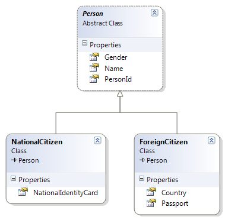

图 18:继承模型

我们这里有一个抽象的概念，一个**人**，以及它的两个具体表现，一个**国民**和一个**外国公民**。每个**人**必须是其中一个。在一些国家(例如葡萄牙)，有国民身份证，而在其他国家没有这种卡——只有护照和签发国。

在面向对象的语言中，我们有类继承，这是关系数据库所没有的。于是出现了一个问题:我们如何将它存储在关系数据库中？

在其开创性的工作 [*企业应用架构模式*](http://www.amazon.com/Patterns-Enterprise-Application-Architecture-Martin/dp/0321127420) 中，马丁·福勒描述了在关系数据库中保持类层次结构的三种模式:

1.  **Single Table Inheritance** or **Table Per Class Hierarchy**: A single table is used to represent the entire hierarchy. It contains columns for all mapped properties of all classes and, of course, many of these will be **NULL** because they will only exist for one particular class. One discriminating column will store a value that will tell NHibernate what class a particular record will map to:

    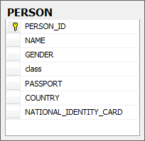

    图 19:单表继承

2.  **Class Table Inheritance** or **Table Per Class**: A table will be used for the columns for all mapped-based class properties, and additional tables will exist for all concrete classes. The additional tables will be linked by foreign keys to the base table:

    

    图 20:类表继承

3.  **混凝土表继承**或**每个混凝土类的表**:每个混凝土类一个表，每个表都有每个类特定或继承的所有映射属性的列:


图 21:具体的表继承

你可以在马丁的网站[http://martinfowler.com/eaaCatalog/index.html](http://martinfowler.com/eaaCatalog/index.html)上看到这些模式的更详细的解释。现在，我给大家留下一些大概的想法:

*   **单表继承**:当涉及到从基类查询时，这提供了最快的性能，因为所有的信息都包含在单个表中。但是，如果您在所有的类中都有很多属性，这将是一个很难阅读的问题，并且您将有很多可空的列。在所有的具体类中，所有的属性都必须是可选的，而不是强制的。由于不同的实体将存储在同一个类中，并且不都共享相同的列，因此它们必须允许空值。
*   **类表继承**:这在表的整洁和性能之间提供了很好的平衡。查询基类时，将需要一个 LEFT JOIN 来将每个表从派生类连接到基类表。记录将存在于基类表中，并且恰好存在于一个派生类表中。
*   **具体的表继承**:这将需要几个 UNIONs，每个派生类的每个表一个 UNIONs，因为 NHibernate 事先不知道该看哪个表。因此，您不能将可能为任何两个表生成相同值的模式(如标识或序列，每个表使用一个序列)用作标识符生成模式，因为如果 NHibernate 找到两个具有相同 id 的记录，它会感到困惑。此外，您将在所有表中重复使用相同的列(来自基类的列)。

就 NHibernate 而言，真的没有任何区别:类是自然多态的。参见**继承**部分，了解如何对类层次结构执行查询。

让我们从单表继承开始，通过代码。一、基础类，**人**:

```cs
      public class PersonMapping : ClassMapping<Person>
      {
        public PersonMapping()
        {
          this.Table("person");
          this.Lazy(true);

          this.Discriminator(x =>
          {
            x.Column("class");
            x.NotNullable(true);
          });

          this.Id(x => x.PersonId, x =>
          {
            x.Column("person_id");
            x.Generator(Generators.HighLow);
          });

          this.Property(x => x.Name, x =>
          {
            x.Column("name");
            x.NotNullable(true);
            x.Length(100);
          });

          this.Property(x => x.Gender, x =>
          {
            x.Column("gender");
            x.NotNullable(true);
            x.Type<EnumType<Gender>>();
          });
        }
      }

```

唯一新的是**鉴别器**选项，我们用它来声明包含所有子类的鉴别器值的列。

接下来，**国民**类的映射:

```cs
      public class NationalCitizenMappping : SubclassMapping<NationalCitizen>
      {
        public NationalCitizenMappping()
        {
          this.DiscriminatorValue("national_citizen");
          this.Lazy(true);

          this.Property(x => x.NationalIdentityCard, x =>
          {
            x.Column("national_identity_card");
            x.Length(20);
            x.NotNullable(true);
          });
        }
      }

```

最后，外国公民:

```cs
      public class ForeignCitizenMapping : SubclassMapping<ForeignCitizen>
      {
        public ForeignCitizenMapping()
        {
          this.DiscriminatorValue("foreign_citizen");
          this.Lazy(true);

          this.Property(x => x.Country, x =>
          {
            x.Column("country");
            x.Length(20);
            x.NotNullable(true);
          });

          this.Property(x => x.Passport, x =>
          {
            x.Column("passport");
            x.Length(20);
            x.NotNullable(true);
          });
        }
      }

```

如果您想通过 XML 来映射，这里有一种可能性:

```cs
      <hibernate-mapping namespace="Succinctly.Model" assembly="Succinctly.Model" >
        <class name="Person" lazy="true" table="`person`" abstract="true">
          <id column="`person_id`" name="PersonId" generator="hilo"/>
          <discriminator column="`class`"/>
          <property name="Name" column="`name`" length="100" not-null="true"/>
          <property name="Gender" column="gender"/>
        </class>
      </hibernate-mapping>

```

```cs
      <hibernate-mapping namespace="Succinctly.Model" assembly="Succinctly.Model" 
      >
        <subclass name="NationalCitizen" lazy="true" extends="Person" discriminator-value="national_citizen">
          <property name="NationalIdentityCard" column="`national_identity_card`" length="20" not-null="false"/>
        </subclass>
      </hibernate-mapping>

```

```cs
      <hibernate-mapping namespace="Succinctly.Model" assembly="Succinctly.Model" 
      >
        <subclass name="ForeignCitizen" lazy="true" extends="Person" discriminator-value="foreign_citizen">
          <property name="Country" column="`country`" length="20" not-null="false"/>
          <property name="Passport" column="`passport`" length="20" not-null="false"/>
        </subclass>
      </hibernate-mapping>

```

最后，如果您选择的是属性映射，那么事情是这样的:

```cs
      [Class(0, Table = "person", Lazy = true, Abstract = true)]
      [Discriminator(1, Column = "class")]
      public abstract class Person
      {
        [Id(0, Name = "PersonId", Column = "person_id")]
        [Generator(1, Class = "hilo")]
        public virtual Int32 PersonId { get; protected set; }

        [Property(Name = "Name", Column = "name", Length = 100, NotNull = true)]
        public virtual String Name { get; set; }

        [Property(Name = "Gender", Column = "gender", TypeType = typeof(EnumType<Gender>), NotNull = true)]
        public virtual Gender Gender { get; set; }
      }

```

```cs
      [Subclass(DiscriminatorValue = "national_citizen", ExtendsType = typeof(Person), Lazy = true)]
      public class NationalCitizen : Person
      {
        [Property(Name = "NationalIdentityCard", Column = "national_identity_card", Length = 50, NotNull = false)]
        public virtual String NationalIdentityCard { get; set; }
      }

```

```cs
      [Subclass(DiscriminatorValue = "foreign_citizen", ExtendsType = typeof(Person), Lazy = true)]
      public class ForeignCitizen : Person
      {
        [Property(Name = "Passport", Column = "passport", Length = 50, NotNull = false)]
        public virtual String Passport { get; set; }

        [Property(Name = "Country", Column = "country", Length = 50, NotNull = false)]
        public virtual String Country { get; set; }
      }

```

说到查询， **Person** 类上的查询是这样的:

```cs
      IEnumerable<Person> allPeopleFromLinq = session.Query<Person>().ToList();

```

生成以下 SQL:

```cs
      SELECT
      person0_.person_id AS person1_2_,
      person0_.name AS name2_,
      person0_.gender AS gender2_,
      person0_.passport AS passport2_,
      person0_.country AS country2_,
      person0_.national_identity_card AS national7_2_,
      person0_.[class] AS class2_2_
      FROM
           person person0_

```

如果我们想限制特定的类型:

```cs
      IEnumerable<NationalCitizen> nationalCitizensFromLinq = session.Query<NationalCitizen>().ToList();

```

将生成以下 SQL:

```cs
      SELECT
      nationalci0_.person_id AS person1_2_,
      nationalci0_.name AS name2_,
      nationalci0_.gender AS gender2_,
      nationalci0_.national_identity_card AS national7_2_
      FROM
      person nationalci0_
      WHERE
          nationalci0_.[class] = 'national_citizen'

```

接下来，我们有类表继承，它在 NHibernate 行话中也被称为**连接子类**，因为我们需要将两个表连接在一起才能获得类的值。以下是它的贫嘴映射(除了我们移除了**鉴别器**调用之外，**人**类的映射保持不变):

```cs
      public class PersonMapping : ClassMapping<Person>
      {
        public PersonMapping()
        {
          this.Table("person");
          this.Lazy(true);

          this.Id(x => x.PersonId, x =>
          {
            x.Column("person_id");
            x.Generator(Generators.HighLow);
          });

          this.Property(x => x.Name, x =>
          {
            x.Column("name");
            x.NotNullable(true);
            x.Length(100);
          });

          this.Property(x => x.Gender, x =>
          {
            x.Column("gender");
            x.NotNullable(true);
            x.Type<EnumType<Gender>>();
          });
        }
      }

```

```cs
      public class NationalCitizenMappping : JoinedSubclassMapping<NationalCitizen>
      {
        public NationalCitizenMappping()
        {

          this.Table("national_citizen");
          this.Lazy(true);

          this.Key(x =>
          {
            x.Column("person_id");
            x.NotNullable(true);
          });

          this.Property(x => x.NationalIdentityCard, x =>
          {
            x.Column("national_identity_card");
            x.Length(20);
            x.NotNullable(true);
          });
        }
      }

```

对于**外国公民**:

```cs
      public class ForeignCitizenMapping : JoinedSubclassMapping<ForeignCitizen>
      {
        public ForeignCitizenMapping()
        {

          this.Table("foreign_citizen");
          this.Lazy(true);

          this.Key(x =>
          {
            x.Column("person_id");
            x.NotNullable(true);
          });

          this.Property(x => x.Country, x =>
          {
            x.Column("country");
            x.Length(20);
            x.NotNullable(true);
          });

          this.Property(x => x.Passport, x =>
          {
            x.Column("passport");
            x.Length(20);
            x.NotNullable(true);
          });
        }
      }

```

在这里，子类映射的不同之处在于引入了一个**键**，我们用它来告诉 NHibernate 用于连接 **PERSON** 表的列。

等效的 XML 应该是:

```cs
      <hibernate-mapping namespace="Succinctly.Model" assembly="Succinctly.Model" >
        <class name="Person" lazy="true" table="`PERSON`" abstract="true">
          <id column="`PERSON_ID`" name="PersonId" generator="hilo"/>
          <property name="Name" column="`name`" length="100" not-null="true"/>
          <property name="Gender" column="gender"/>
        </class>
      </hibernate-mapping>

```

```cs
      <hibernate-mapping namespace="Succinctly.Model" assembly="Succinctly.Model" >
        <joined-subclass name="NationalCitizen" lazy="true" extends="Person" table="`NATIONAL_CITIZEN`">
          <key column="`PERSON_ID`"/>
          <property name="NationalIdentityCard" column="`national_identity_card`" length="20" not-null="false"/>
        </joined-subclass>
      </hibernate-mapping>

```

```cs
      <hibernate-mapping namespace="Succinctly.Model" assembly="Succinctly.Model" >
        <joined-subclass name="ForeignCitizen" lazy="true" extends="Person" table="`FOREIGN_CITIZEN`">
          <key column="`PERSON_ID`"/>
          <property name="Country" column="`country`" length="20" not-null="false"/>
          <property name="Passport" column="`passport`" length="20" not-null="false"/>
        </joined-subclass>
      </hibernate-mapping>

```

最后，属性版本:

```cs
      [Class(0, Table = "person", Lazy = true, Abstract = true)]
      public abstract class Person
      {
        //…
      }

```

```cs
      [JoinedSubclass(0, Table = "national_citizen", ExtendsType = typeof(Person), Lazy = true)]
      [Key(1, Column = "person_id")]
      public class NationalCitizen : Person
      {
        //…
      }

```

```cs
      [JoinedSubclass(0, Table = "foreign_citizen", ExtendsType = typeof(Person), Lazy = true)]
      [Key(1, Column = "person_id")]
      public class ForeignCitizen : Person
      {
        //…
      }

```

对基类的查询生成以下 SQL，将所有表连接在一起:

```cs
      SELECT
      person0_.person_id AS person1_6_,
      person0_.name AS name6_,
      person0_.gender AS gender6_,
      person0_1_.passport AS passport11_,
      person0_1_.country AS country11_,
      person0_2_.national_identity_card AS national2_12_,
      CASE
      WHEN person0_1_.person_id IS NOT NULL THEN 1
      WHEN person0_2_.person_id IS NOT NULL THEN 2
      WHEN person0_.person_id IS NOT NULL THEN 0
      END AS clazz_
      FROM
      person person0_
      LEFT OUTER JOIN
      foreign_citizen person0_1_
      ON person0_.person_id = person0_1_.person_id
      LEFT OUTER JOIN
      national_citizen person0_2_
      ON person0_.person_id = person0_2_.person_id

```

一个用于特定类别:

```cs
      SELECT
      nationalci0_.person_id AS person1_2_,
      nationalci0_1_.name AS name2_,
      nationalci0_1_.gender AS gender2_,
      nationalci0_.national_identity_card AS national2_8_
      FROM
      national_citizen nationalci0_
      INNER JOIN
      person nationalci0_1_
      ON nationalci0_.person_id = nationalci0_1_.person_id

```

最后是最后一个映射策略，具体表继承或者**并集-子类**。映射，使用贫嘴的应用编程接口:

```cs
      public class NationalCitizenMappping : UnionSubclassMapping<NationalCitizen>
      {
      public NationalCitizenMappping()
      {
      this.Table("national_citizen");
      this.Lazy(true);
      //…
      }
      }

```

```cs
      public class ForeignCitizenMappping : UnionSubclassMapping<ForeignCitizen>
      {
      public ForeignCitizenMappping()
      {
      this.Table("foreign_citizen");
      this.Lazy(true);
      //…
      }
      }

```

|  | 提示:Person 的映射与 Class Table 继承完全相同。 |

如你所见，唯一不同的是**键**条目现在消失了。就这样。

同样在 XML 中:

```cs
      <hibernate-mapping namespace="Succinctly.Model" assembly="Succinctly.Model" 
      >
      <union-subclass name=">NationalCitizen" lazy="true" extends="Person" table="`NATIONAL_CITIZEN`">
      <!-- … -->
      </union-subclass>
      </hibernate-mapping>

```

```cs
      <hibernate-mapping namespace="Succinctly.Model" assembly="Succinctly.Model" 
      >
      <union-subclass name=">ForeignCitizen" lazy="true" extends="Person" table="`FOREIGN_CITIZEN`">
      <!-- … -->
      </union-subclass>
      </hibernate-mapping>

```

在属性中:

```cs
      [UnionSubclass(0, Table = "national_citizen", ExtendsType = typeof(Person), Lazy = true)]
      public class NationalCitizen : Person
      {
      //…
      }

```

```cs
      [UnionSubclass(0, Table = "foreign_citizen", ExtendsType = typeof(Person), Lazy = true)]
      public class ForeignCitizen : Person
      {
      //…
      }

```

在本节的最后，让我们看看使用这个策略时基本 **Person** 类的 SQL 是什么样子的:

```cs
      SELECT
      person0_.person_id AS person1_6_,
      person0_.name AS name6_,
      person0_.gender AS gender6_,
      person0_.passport AS passport11_,
      person0_.country AS country11_,
      person0_.national_identity_card AS national1_12_,
      person0_.clazz_ AS clazz_
      FROM
      ( SELECT
      person_id,
      name,
      gender,
      passport,
      country,
      null AS national_identity_card,
      1 AS clazz_
      FROM
      foreign_citizen
      UNION
      ALL SELECT
      person_id,
      name,
      gender,
      null AS passport,
      null AS country,
      national_identity_card,
      2 AS clazz_
      FROM
      national_citizen
      ) person0_

```

对于特定类的查询，在本例中，**国民**将生成以下 SQL:

```cs
      SELECT
      nationalci0_.person_id AS person1_6_,
      nationalci0_.name AS name6_,
      nationalci0_.gender AS gender6_,
      nationalci0_.national_identity_card AS national1_12_
      FROM
      national_citizen nationalci0_

```

## 我该选哪个？

这一章我们看到了很多东西。对于映射 API，我冒险给出我的观点:选择代码映射。比 **HBM 更易读，更易维护。XML** ，它是强类型的，这意味着，如果您更改一些属性，您将自动重构映射，并且不需要费心显式编译您的项目，因为由于它是代码，Visual Studio 将在必要时执行它。属性需要引用特定于 NHibernate 的程序集，并且比通过代码映射更难更改。

最后，无论您选择哪种映射，都会得到这样的数据库模型:

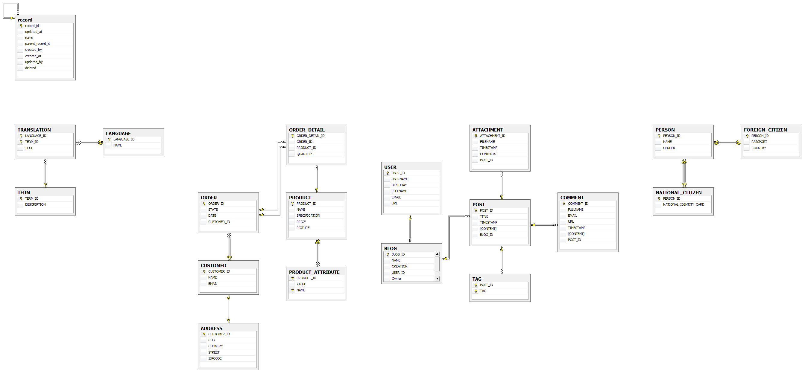

图 22:博客系统的数据库模型

对于绘制遗产地图，这是一个值得思考的决定，因为没有直接的答案。但是我赞成**类表继承**，因为每个具体的类没有重复的列，而且每个表只有几列。