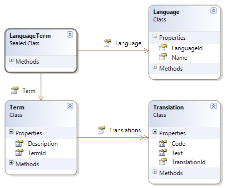

# 第七章限制和过滤器

## 限制

可以为实体指定附加的限制条件，NHibernate 在执行 SELECTs 时会始终遵守这些条件。这些条件有两种:限制和过滤。让我们首先关注限制。

限制是一个静态 WHERE 子句，可以在类和集合级别(**集合**、**列表**、**包**、**映射**、 **id 包**、**数组**和**原始数组**)添加，以过滤其元素。一个典型的例子是软删除，其中记录实际上并没有从数据库中删除，而是用表示删除的列值来标记。下面是我们如何为类和集合将它定义为 XML:

```cs
            <class name="Blog" lazy="true" table="`POST`" where="deleted = 0">
              <!-- ... -->
              <list cascade="all-delete-orphan" inverse="true" lazy="true" name="Posts" where="deleted = 0">
                <!-- ... -->
              </list>
            </class>

```

下面是代码映射中的等效代码:

```cs
            mapper.Class<Blog>(ca =>
            {
              ca.Where("deleted = 0");
              //...

              ca.List(c => c.Posts, c =>
              {
                c.Where("deleted = 0");
                //...
              });
            }

```

在属性中:

```cs
            [Class(Table = "blog", Lazy = true, Where = "deleted = 0")]
            public class Blog
            {
            //...
            [List(0, Inverse = true, Lazy = CollectionLazy.True, Generic = true, Where = "deleted = 0", Cascade = "all-delete-orphan")]
              public virtual IList<Post> Posts { get; protected set; }
            }

```

 `deleted = 0`”限制:

```cs
            IEnumerable<Blog> nonDeletedBlogs = session.Query<Blog>();
            Blog b = session.Get<Blog>(1);

```

查看两个查询的结果 SQL:

```cs
            SELECT
            blog0_.blog_id AS blog1_11_,
            blog0_.picture AS picture11_,
            blog0_.user_id AS user3_11_,
            blog0_.name AS name11_,
            blog0_.creation AS creation11_,
            (SELECT
            COUNT(1)
            FROM
            post
            WHERE
            post.blog_id = blog0_.blog_id) AS formula2_
            FROM
                blog blog0_
            WHERE
            (
            blog0_.deleted = 0
                )

            SELECT
            blog0_.blog_id AS blog1_11_0_,
            blog0_.picture AS picture11_0_,
            blog0_.user_id AS user3_11_0_,
            blog0_.name AS name11_0_,
            blog0_.creation AS creation11_0_,
            (SELECT
            COUNT(1)
            FROM
            post
            WHERE
            post.blog_id = blog0_.blog_id) AS formula2_0_
            FROM
            blog blog0_
            WHERE
            blog0_.blog_id = 1
            AND
            xml:lang="PT">(
            blog0_.deleted = 0
                )

```

## 过滤器

过滤器类似于限制，但它是动态的。这意味着它可以启用或禁用，并且可以有参数。一个例子可能是您将术语翻译成多种语言的模型:



图 25:翻译类模型

我们所拥有的是:

*   一种**语言**
*   一个**术语**和一组**翻译**
*   给定**语言的**术语**的翻译**

这引入了一个新概念:映射复合键的类。在这种情况下，是**语言术语**包含了对**术语**和**语言**的引用。

通常，如果您只想加载当前语言的翻译，而不是所有语言的翻译，您会使用这样的模型。它的映射可能如下所示:

```cs
            public class LanguageMapping : ClassMapping<Language>
            {
              public LanguageMapping()
              {
                this.Table("language");
                this.Lazy(true);

                this.Id(x => x.LanguageId, x =>
                {
                  x.Column("language_id");
                  x.Generator(Generators.Assigned);
                });

                this.Property(x => x.Name, x =>
                {
                  x.Column("name");
                  x.NotNullable(true);
                  x.Length(100);
                });
              }
            }

```

```cs
            public class TermMapping : ClassMapping<Term>
            {
              public TermMapping()
              {
                this.Table("term");
                this.Lazy(true);

                this.Id(x => x.TermId, x =>
                {
                  x.Column("term_id");
                  x.Generator(Generators.HighLow);
                });

                this.Property(x => x.Description, x =>
                {
                  x.Column("description");
                  x.NotNullable(true);
                  x.Length(50);
                });

                this.Set(x => x.Translations, x =>
                {
                  x.Key(y =>
                  {
                    y.Column("term_id");
                    y.NotNullable(true);
                  });

                  x.Filter("CurrentLanguage", z =>
                  {
                      z.Condition("language_id = :code");
                  });

                  x.Inverse(true);
                  x.Cascade(Cascade.All | Cascade.DeleteOrphans);
                  x.Lazy(CollectionLazy.Lazy);
                }, x =>
                {
                  x.OneToMany();
                });
              }
            }

```

```cs
            public class TranslationMapping : ClassMapping<Translation>
            {
              public TranslationMapping()
              {
                this.Table("translation");
                this.Lazy(true);

                this.Filter("CurrentLanguage", x =>
                {
                    x.Condition("language_id = :code");
                });

                this.ComponentAsId(x => x.TranslationId, x =>
                {
                  x.ManyToOne(y => y.Language, y =>
                  {
                    y.Column("language_id");
                  });
                  x.ManyToOne(y => y.Term, y =>
                  {
                    y.Column("term_id");
                  });
                });

                this.Property(x => x.Text, x =>
                {
                  x.Column("text");
                  x.Length(100);
                  x.NotNullable(true);
                });
              }
            }

```

最后但并非最不重要的是，在会话工厂构建之前，必须在**配置**实例上进行过滤器声明:

```cs
            cfg.AddFilterDefinition(new FilterDefinition("CurrentLanguage", "language_id = :code", 
            new Dictionary<String, IType>() { { "code", NHibernateUtil.String } }, false));

```

|  | 提示:导入命名空间  NHibernate.Engine。 |

请注意:

*   **CurrentLanguage** 过滤器基本上是对 **language_id** 列的限制，它使用了一个**代码**参数。
*   **语言**类的主键**语言标识**，是一个**字符串**，使用**指定的**模式。我们将使用它来存储有意义的文化名称，如“ **en-us** ”或“ **pt-pt** ”，它们必须始终是唯一的。
*   **术语**类的**翻译**集合应用了**当前语言**过滤器。
*   **翻译**类有一个由**语言术语**类实现的复合键(**组件**，它引用了一个**术语**和一个**语言**。
*   **翻译**类也使用**货币语言**过滤器。

我们需要给过滤器的**代码**参数赋值，并在实际查询前启用它:

```cs
            //set the filter value from the current thread’s culture name
            session.EnableFilter("CurrentLanguage").SetParameter("code", Thread.CurrentThread.CurrentCulture.Name);

            var term = session.Query<Term>().First();

            >//the translations will be filtered
            var translations = term.Translations.ToList();

```

过滤器将作为参数包含在 SQL 中:

```cs
            SELECT
            TOP (1) term0_.term_id AS term1_8_,
            term0_.description AS descript2_8_
            FROM
            term term0_

            SELECT
            translatio0_.term_id AS term2_1_,
            translatio0_.language_id AS language1_1_,
            translatio0_.language_id AS language1_9_0_,
            translatio0_.term_id AS term2_9_0_,
            translatio0_.text AS text9_0_
            FROM
            [translation] translatio0_
            WHERE
            translatio0_.language_id = 'en-us'
                AND translatio0_.term_id = 1

```

当您不再需要过滤器时，只需将其禁用:

```cs
            //disable the filter
            session.DisableFilter("CurrentLanguage");

```

最终注释:

*   每个实体和集合可能有多个筛选器，并且可以同时启用多个筛选器。
*   过滤器可以有参数，也可以没有参数，这些参数可以有默认值。
*   可以启用或禁用过滤器。
*   筛选器的 SQL 只能引用应用它的类可直接访问的列。