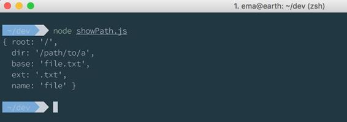

从这一章开始，我们开始写一些有趣的东西，使用文件系统，发现流的力量。

使用文件系统所需的全部工作都在`fs`模块中，该模块是 Node.js 附带的核心库的一部分

`fs`模块是标准 POSIX 函数的一种包装，并公开了许多访问和使用文件系统的方法。大多数有两种风格:默认异步版本和同步版本。即使异步版本更好，有时同步版本对于一些不需要极高性能的任务也很有用。

要从文件系统中读取文件，我们可以使用`readFile`函数:

代码清单 22

```js
  const
  fs = require('fs')
  fs.readFile('/path/to/file',
  (err, data) => {

  // do something with data
  })

```

这是在读取文件时调用回调的异步版本。

同步版本是:

代码清单 23

```js
  const
  fs = require('fs')
  const
  data = fs.readFileSync('/path/to/file')

```

异步版本通常更可取，但是在某些情况下，您需要等待文件准备就绪后才能继续。

读取文件的对应部分是使用`writeFile`函数写入文件:

代码清单 24

```js
  const
  fs = require('fs')
  fs.writeFile('/path/to/file',
  data, (err) => {

  // check error
  })

```

`writeFile`函数有自己的同步版本，其工作原理与`writeFileSync`相同。

通常，应用应该监视一个文件夹，并在新文件到达或发生变化时采取措施。Node.js 有一个内置的对象来监视一个文件夹，当有事情发生时它会发出事件。

代码清单 25

```js
  const fs =
  require('fs')
  const watcher
  = fs.watch('/path/to/folder')
  watcher.on('change',
  function(event, filename) {
    console.log(`${event}
  on file ${filename}`)
  }) 

```

如果我们执行这段代码，并尝试在`/path/to/folder`文件夹中添加文件或更改文件，将执行`change`事件，并将`event`类型和`filename`打印到控制台。

与文件系统相关联的另一个有用的模块是模块路径，它公开了一组使用文件路径操作的函数。这个模块对于管理路径很有意思，不用担心分隔符、连接或文件扩展名。

例如，如果我们想用文件名连接一个路径来获得完整的路径，我们可以使用`join`方法:

代码清单 26

```js
  const path
  = require('path')
  const
  fullPath = path.join('/path/to/folder', 'README.md')

```

`fullPath`将是`/path/to/folder/README.md`。

有时获取当前目录中文件的完整路径很有用。在这些情况下，我们可以使用`__dirname`全局变量来构建完整的路径。

代码清单 27

```js
  const path
  = require('path')
  const
  fullPath = path.join(__dirname, 'README.md')

```

这将返回当前文件夹中包含的`README.md`的完整路径。

`path`模块还有一种将完整路径分解为多个部分的方法:

代码清单 28

```js
  const path
  = require('path')
  const parts
  = path.parse('/path/to/a/file.txt')
  console.log(parts)

```

这将以以下格式打印出路径的各个部分:



图 10:路径信息

`parse`方法将读取一个字符串，并将其拆分为组成部分。

`path`模块有其他方法，您可以在[nodejs.org/api/path.html](https://nodejs.org/api/path.html)了解。

在[第 2 章](02.html#_Chapter_2_)中，我们编写了一个示例 HTTP 服务器，为文件系统中的一个文件提供服务。代码是:

代码清单 29

```js
  const http
  = require('http')
  const fs =
  require('fs')
  const
  server = http.createServer((request, response) => {

  response.writeHead(200, {'Content-Type': 'text/html'});

  fs.readFile('./index.html', (err, file) => {

  response.end(file);  
    })
  })
  server.listen(8000)

```

就像我们在第 2 章中说的，这段代码非常有害，因为它会读取内存中的所有文件内容，只有在读取完所有内容后，它才会对客户端做出响应。

流是这些环境的完美解决方案。流类似于 UNIX 管道，可以是可读的、可写的或两者都有(双工)。好的一点是，他们不需要阅读所有的数据，就可以让其他人使用。当一大块数据可用时，它们会发出事件，以便消费者可以开始使用它。

流是事件发射器，在可读流的情况下，它们的两个主要事件是`data`和`end`，分别在数据块准备使用时和流结束时引发。

代码清单 30

```js
  const fs =
  require('fs'); 
  const http
  = require('http'); 
  const
  server = http.createServer((request, response) => { 
    response.writeHead(200, {'Content-Type': 'text/html'});
    var
  stream = fs.createReadStream('./index.html'); 
    stream.pipe(response); 
  }); 
  server.listen(8000);

```

这个小示例介绍了读取文件并将其提供给客户端的流。它导入`fs`模块，并从文件 index.html 创建一个可读的流。

由于响应对象是一个流，我们可以将可读的流传输到`response`，这样服务器就可以在 index.html 块可用时立即开始提供它们。

这个基本示例应该阐明流是如何工作的。本质上，我们可以在可写流中传输可读流。

可写流是可读流的对应物。它们可以用函数`createWriteStream`来创建，它们是我们可以在其上传输东西的流。例如，我们可以使用可写流来复制文件:

代码清单 31

```js
  const fs =
  require('fs'); 
  var sourceFile
  = fs.createReadStream('path/to/source.txt');
  var
  destinationFile = fs.createWriteStream('path/to/dest.txt');

  sourceFile.on('data',
  function(chunk) {
      destinationFile.write(chunk);
  });

```

流是事件发射器，当流中有一些数据可用时，它们会发出`data`事件(就像前面的例子一样)。`data`事件接收可以使用的数据块。

当流结束时，发出的事件为`end`，可用于关闭流或进行一些最终操作。

流是管理大文件或图像的非常强大的工具。大多数时候，我们使用的库会隐藏实现细节，但是通常，当处理大块数据时，流被广泛使用。