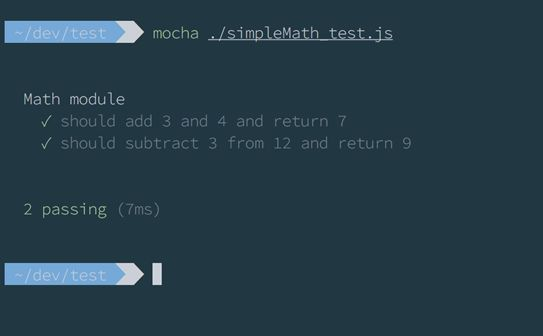

到目前为止，我们已经看到了构建应用所需的实践和包。但是节点社区在项目的辅助活动方面也非常强大，我指的是测试、构建以及项目的其他部分。

测试是应用最重要的部分之一，像 TDD 这样的实践在节点社区中很普遍。

我们可以用来定义和运行测试的工具之一是[摩卡](https://mochajs.org/)。Mocha 是一个 JavaScript 测试框架，它定义了一组我们可以用来编写测试的函数。它带有一个 runner 并支持异步测试。

假设我们有这样一个模块:

代码清单 73

```js
  //
  simpleMath.js
  module.exports = {
    add: (a, b) => a + b,
    sub: (a, b) => a - b,
    multiply: (a, b) => a * b
  }

```

忽略这个模块的无用性，它只是我们可以测试的东西，重点是摩卡的语法。

现在让我们写一些关于这个模块的测试:

代码清单 74

```js
  const simpleMath =
  require('./simpleMath')
  const assert = require('chai').assert

  describe('Math module', () => {
    it('should add 3 and 4 and
  return 7', () => {
      const result = simpleMath.add(3, 4)
      assert.equal(7, result);
    });
    it('should subtract 3 from 12 and return 9', () => {
      const result = simpleMath.sub(12, 3)
      assert.equal(9, result);
    });
  });

```

代码可读性很强；这是摩卡的一个特点。它描述了一个模块的功能，并声明如果我们加上 3 和 4，我们必须得到 7(这是非常明显的)。
`describe``it`是摩卡的两个功能。我们不需要摩卡，因为测试将由摩卡执行，这将提供正确的上下文。

要从命令行运行测试:

代码清单 75

```js
  $ mocha
  ./tests/simpleMath_test.js

```



图 13:测试结果

Mocha 没有 assert 库，让开发人员可以自由选择他们喜欢的东西。在前面的例子中，我们使用了[柴](http://chaijs.com/)，这只是一个断言库。

但是我们知道，在 Node 中，大多数代码都是异步的，摩卡支持使用`done`回调开箱即用。假设您有以下代码要测试:

代码清单 76

```js
  // customerApi.js
  module.exports = {
    getCustomers: (callback) => {
      return someApi.get('/customers', (err, res) => {
        callback(res.body)
      })
    }
  }

```

我们可以把这看作是对 API 的一种调用，它可以取回客户列表。我们不需要深入细节。我们只需要明白`get`方法返回时会调用最后的回调。

我们如何测试这个？

由于它是异步的，我们不能只调用`getCustomers`并在回调上断言，因为测试将在回调被调用之前结束。如前所述，摩卡支持该上下文，解决方案是向测试传递一个`done`函数，并在测试完成时调用该函数:

代码清单 77

```js
  const
  customerApi = require('./customerApi)
  const assert = require('chai').assert

  describe('Customer API module', () => {
    it('should
  return a list of customers', (done) => {
      customerApi.getCustomers(customers => {
        assert.isTrue(customers.length > 0)
        done()
      })
    });
  });

```

我们可以看到，等待回调完成是非常容易的。我们断言客户在响应中是可用的，然后我们调用`done`函数来告诉摩卡这个测试已经完成，它可以继续下一个测试。

摩卡的默认超时时间为两秒。这意味着如果两秒钟后`done`回调未被调用，测试失败。

关于摩卡，最后要说的是对测试钩子的支持。摩卡有一些我们可以实现的特殊功能，可以在测试之前或之后执行:

代码清单 78

```js
  const customerApi =
  require('./customerApi)
  const assert = require('chai').assert

  describe('Customer API module', () => {
    before(() => { /* this run once before all tests of this module*/ })
    beforeEach(() => { /* this run before every test of this module*/ })
    it('should run a test', () =>
  {}) 
    afterEach(() => { /* this run after every test of this module*/ })
    after(() => { /* this run
  once after all tests of this module*/ })
  });

```

四种方法`before`、`beforeEach`、`after`和`afterEach`对于设置对象和连接以及在测试结束时拆卸都很有用。

要运行测试，我们必须将`mocha-cli`模块安装为全局的，并从命令行运行 Mocha，传递包含测试的文件的路径。

否则，我们可以在构建过程中使用大口来集成测试。

如果你来自一种编译过的编程语言，那么 JavaScript 的构建听起来可能有点奇怪，因为 JavaScript 并不像 C#或 Java 那样编译，但是术语 *build* 有更广泛的含义，而 glaw 是我们可以用来“构建”应用的工具之一。

[大口](http://gulpjs.com/)是一种任务运行器:它按照配置执行一系列任务。每项任务都有一个目标要完成。

一般来说，在一个 Node 应用中，执行的任务并不多，大部分任务都可以使用 package.json 文件的`scripts`部分来完成。在前端世界中使用了 Grunt(以及 Grunt 或类似的工具)，在前端世界中，JavaScript 必须组合成一个文件并最小化。

但是对于自动化大多数任务来说，大口仍然是一个有趣的工具，尤其是在开发环境中。

首先，我们必须安装两个包:`gulp-cli`(带有全局选项)和大口:

代码清单 79

```js
  $ npm
  install gulp-cli -g
  $ npm install gulp --save-dev

```

`gulp-cli`包创建符号链接，从终端运行大口。

安装了这两个包后，我们必须创建一个包含我们任务的 gulpfile.js。我们可以这样开始:

代码清单 80

```js
  const gulp = require('gulp')

  gulp.task('default', () => {
    console.log('gulp! It works')
  })

```

从命令行，我们可以运行大口，并获得如下内容:

代码清单 81

```js
  $ gulp
  [18:02:27] Using gulpfile ~/dev/nodejs_book/gulpfile.js
  [18:02:27]
  Starting 'default'...
  gulp! It
  works
  [18:02:27]
  Finished 'default' after 140 μs

```

我们可以看到，(除了日志)它只是打印`gulp! It works`。

“大口”背后的想法是构建一系列任务，我们可以使用流和管道的概念单独或串联运行这些任务。每个任务都可以作为下一个任务的输入，以构建更复杂的任务。

grave 附带了许多插件来帮助构建有用的构建管道。例如，如果我们想让 Glugh 运行我们的 Mocha 测试，我们可以安装`gulp-mocha`插件，并像这样配置我们的 Glugh file . js:

代码清单 82

```js
  const gulp
  = require('gulp')
  const mocha = require('gulp-mocha')

  gulp.task('mocha-tests', () => {
    return
  gulp.src('tests/**/*_test.js')

  .pipe(mocha({reporter: 'spec', bail: true}))

  .once('error', (err) => { console.log(err); process.exit(1) })

  .once('end', () => { process.exit() })
  });

  gulp.task('default',
  ['mocha-tests'])

```

这个 gulpfile 定义了一个名为`mocha-tests`的新任务，该任务读取所有与模式匹配的文件，并将结果(文件列表)传送到运行测试的`mocha`函数。如果出现错误，它会将错误打印到控制台，并且该过程将停止。

另一个实用的用法是在开发阶段运行一个应用，更有用的是，在发生变化时重新启动它。

在开发阶段，我们通常在浏览器中尝试应用，当我们修改一些代码时，我们需要重新启动应用来查看更改。

通过大口，我们可以自动化这个过程:

代码清单 83

```js
  const gulp
  = require('gulp')
  const nodemon = require('gulp-nodemon')

  gulp.task('dev-mode', () => {
    nodemon({script:
  './app/index.js'})
  });

  gulp.task('default',
  ['dev-mode'])

```

我们需要一个名为`gulp-nodemon`的新模块，一个大口插件，来启用`nodemon`。`dev-mode`任务以指定应用入口点的对象参数开始`nodemon`。nodemon 只是观察文件系统的变化，当文件发生变化时，它会重新启动应用。这个脚本在开发过程中可以节省时间。

grave 的自动化程度远不止这些，你可以在它的[网站](http://gulpjs.com/plugins/)上找到一个列表。即使你需要时间来找到完美的工作流程，我可以说这是一个很好的投资。在设置中花费的每一分钟都将在以后获得。

## 斯洛文尼亚

我们知道 JavaScript 不是一种编译语言，如果不遵守某些规则，它的动态特性即使非常强大，也是危险的。

这就是短绒存在的原因。

Linters 是分析源代码并验证一组规则是否得到满足的工具，如果一些规则被破坏，它们会破坏构建过程。

和 Node.js 中的所有东西一样，有各种各样的短句，但是最近最常用的是 [ESLint](http://eslint.org/) ，它支持开箱即用的新 ES6 语法。

ESLint 是一个带有二进制的 npm 包，但是因为我们已经看到了大口，我们将在大口中使用它，这样林挺就成为构建过程的一部分。

让我们从 gulpfile 开始:

代码清单 84

```js
  const gulp = require('gulp')
  const eslint = require('gulp-eslint');

  gulp.task('eslint', () => {
    return gulp.src(['app/**/*.js',
  'tests/**/*.js'])

  .pipe(eslint('eslint.config.json'))
      .pipe(eslint.format())

  .pipe(eslint.failAfterError());
  });

  gulp.task('default', ['eslint'])

```

文件的结构是每一个囫囵文件的通常结构。任务`eslint`就是把我们的文件链接起来的任务。它需要一个文件列表(每。应用文件夹和测试文件夹中的 js 文件)，并将其传递给 ESLint 插件。

要应用的规则在我们一会儿将看到的`eslint.config.json`文件中指定。在林挺源代码之后，它会在终端上生成一个报告，如果有错误，它会停止构建。

规则文件是一个 JSON 文件，其中包含我们想要启用的一组规则。ESLint 有很多规则，但我们没有义务全部使用。事实上，每个团队都必须找到一套符合他们惯例的规则:

代码清单 85

```js
  {
    "rules":
  {
      "no-shadow": 2,
      "no-undef-init":
  0,
      "no-undef":
  2,
      "no-undefined":
  0,
      "no-unused-vars":
  [2, { "vars": "local", "args":
  "after-used" }],
      "no-use-before-define":
  0,
      "arrow-body-style":
  [0, "as-needed"],
      "arrow-parens":
  0, 
      "arrow-spacing":
  [2, { "before": true, "after": true }],
      "comma-dangle":
  [0, "always-multiline"],
      "constructor-super":
  0
    }
  }

```

这是一个示例 ESLint 配置文件的一部分。每个规则都有一个名称和值:

*   `0`如果我们想禁用规则。
*   `1`如果我们希望规则生成警告。
*   `2`如果我们希望规则产生错误。

有些规则需要一些额外的选项，比如箭头间距，它指定我们是否希望在 ES6 语法中函数的箭头周围有一个空格。我们可以指定是想要箭头前的空间还是箭头后的空间。

我们可以在 [ESLint](http://eslint.org/docs/rules/) 网站上找到完整的规则列表，它们都有示例记录。

你如何从 ESLint 开始？哪些规则适用？Airbnb 在 GitHub 上有一个[存储库，专门用于 JavaScript 约定和代码风格，它包含一个很好的 ESLint 文件，我们可以用它作为起点。从那里，我们可以添加、删除或简单地禁用过于严格或宽松的规则。](https://github.com/airbnb/javascript)