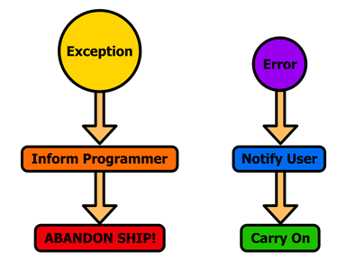

# 八、异常和错误

在 Objective-C 中，程序运行时可能会出现两种类型的错误。*意外*错误是“严重”的编程错误，通常会导致程序过早退出。这些被称为**异常**，因为它们代表了你程序中的一个异常情况。另一方面，*预计*错误会在程序执行过程中自然出现，并可用于确定操作是否成功。这些被称为**错误**。

您还可以将异常和错误之间的区别视为目标受众的不同。一般来说，异常用于通知*程序员*出现了问题，而错误用于通知*用户*请求的操作无法完成。



图 34:异常和错误的控制流程

例如，试图访问不存在的数组索引是一个例外(程序员错误)，而无法打开文件是一个错误(用户错误)。在前一种情况下，您的程序流中可能出现了一些非常错误的东西，它可能会在异常后很快关闭。在后一种情况下，您可能想告诉用户该文件无法打开，并可能要求重试该操作，但没有理由您的程序在出现错误后无法继续运行。

## 异常处理

Objective-C 的异常处理能力的主要好处是能够将错误处理与错误检测分开。当一部分代码遇到异常时，它可以将其“抛出”到最近的错误处理块，该块可以“捕获”特定的异常并适当地处理它们。异常可以从任意位置抛出的事实消除了不断检查特定任务中涉及的每个函数的成功或失败消息的需要。

`@try`、`@catch()`和`@finally`编译器指令用于捕捉和处理异常，而`@throw`指令用于检测异常。如果您在 C#中处理过异常，这些异常处理结构应该是您所熟悉的。

需要注意的是，在 Objective-C 中，异常相对较慢。因此，它们的使用应该仅限于捕捉严重的编程错误，而不是基本的控制流。如果您试图根据*预期的*错误(例如，未能加载文件)确定要做什么，请参考[错误处理](#_Error_Handling)部分。

### 异常类

异常被表示为`NSException`类或其子类的实例。这是封装与异常相关联的所有必要信息的方便方法。构成异常的三个属性描述如下:

*   `name`–唯一标识异常的`NSString`实例。
*   `reason`–包含人类可读异常描述的`NSString`实例。
*   `userInfo`–包含与异常相关的应用程序特定信息的`NSDictionary`实例。

基础框架定义了几个常量，这些常量定义了“标准”[异常名称](https://developer.apple.com/library/mac/#documentation/Cocoa/Reference/Foundation/Miscellaneous/Foundation_Constants/Reference/reference.html%23//apple_ref/c/data/NSRangeException)。这些字符串可以用来检查捕获了什么类型的异常。

也可以使用`initWithName:reason:userInfo:`初始化方法，用自己的值创建新的异常对象。自定义异常对象可以使用后面章节中介绍的相同方法来捕获和抛出。

### 生成异常

让我们先来看看程序的默认异常处理行为。`NSArray`的`objectAtIndex:`方法定义为当你试图访问一个不存在的索引时抛出一个`NSRangeException`(一个`NSException`的子类)。所以，如果你请求一个只有三个元素的数组的第 10 个<sup>项，你将有一个例外可以尝试:</sup>

```objc
    #import <Foundation/Foundation.h>

    int main(int argc, const char * argv[]) {
        @autoreleasepool {

            NSArray *crew = [NSArray arrayWithObjects:
                             @"Dave",
                             @"Heywood",
                             @"Frank", nil ];

            // This will throw an exception.
            NSLog (@"%@", [crew objectAtIndex:10 ]);

        }
        return 0;
    }

```

当它遇到一个未捕获的异常时，Xcode 会停止程序，并将您指向导致问题的那一行。


图 35:由于未捕获的异常而中止程序

接下来，我们将学习如何捕捉异常并防止程序终止。

### 捕捉异常

为了处理异常，任何可能导致异常的代码都应该放在一个`@try`块中。然后，您可以使用`@catch()`指令捕捉特定的异常。如果您需要执行任何内务处理代码，您可以选择将其放在`@finally`块中。以下示例显示了所有这三个异常处理指令:

```objc
    @try {
        NSLog (@"%@", [crew objectAtIndex:10 ]);
    }
    @catch (NSException *exception) {
        NSLog (@"Caught an exception" );
        // We'll just silently ignore the exception.
    }
    @finally {
        NSLog (@"Cleaning up" );
    }

```

这将在您的 Xcode 控制台中输出以下内容:

```objc
    Caught an exception!
    Name: NSRangeException
    Reason: *** -[__NSArrayI objectAtIndex:]: index 10 beyond bounds [0 .. 2]
    Cleaning up

```

当程序遇到`[crew objectAtIndex:10]`信息时，它抛出一个`NSRangeException`，该信息被`@catch()`指令捕获。`@catch()`块的内部是实际处理异常的地方。在这种情况下，我们只显示一条描述性的错误消息，但是在大多数情况下，您可能想要编写一些代码来解决这个问题。

当`@try`块遇到异常时，程序跳转到相应的`@catch()`块，这意味着发生异常后的任何代码*都不会被执行。如果`@try`块需要一些清理(例如，如果它打开了一个文件，该文件需要关闭)，这就产生了一个问题。`@finally`块解决了这个问题，因为不管是否发生异常，它都保证执行*。这使得它成为捆绑任何来自`@try`区块的松散的地方。**

#### 捕捉自定义对象

`@catch()`指令后面的括号允许您定义要捕获的异常类型。在这种情况下，它是一个`NSException`，这是标准的异常类。但是，一个例外实际上可以是任何一个 T4 级，而不仅仅是 T2 级。例如，以下`@catch()`指令将处理一个通用对象:

```objc
    @catch (id genericException)

```

我们将在下一节学习如何抛出`NSException`的实例以及类属对象。

### 抛出异常

当您在代码中检测到异常情况时，您会创建一个`NSException`实例，并用相关信息填充它。然后，你用名副其实的`@throw`指令扔出去，提示最近的`@try` / `@catch`块处理。

例如，下面的示例定义了一个函数，用于在指定的时间间隔内生成随机数。如果调用者传递了一个无效的时间间隔，函数将抛出一个自定义错误。

```objc
    #import <Foundation/Foundation.h>

    int generateRandomInteger(int minimum, int maximum) {
        if (minimum >= maximum) {
            // Create the exception.
            NSException *exception = [NSException
                exceptionWithName:@"RandomNumberIntervalException"
                reason:@"*** generateRandomInteger(): "
                        "maximum parameter not greater than minimum parameter"
                userInfo:nil ];

            // Throw the exception.
            @throw exception;
        }
        // Return a random integer.
        return arc4random_uniform ((maximum - minimum) + 1 ) + minimum;
    }

    int main(int argc, const char * argv[]) {
        @autoreleasepool {

            int result = 0;
            @try {
                result = generateRandomInteger (0, 10 );
            }
            @catch (NSException *exception) {
                NSLog (@"Problem!!! Caught exception: %@", [exception name ]);
            }

            NSLog (@"Random Number: %i", result);

        }
        return 0;
    }

```

由于这段代码将一个有效的时间间隔(`0, 10`)传递给`generateRandomInteger()`，所以不会有异常需要捕捉。但是，如果您将间隔更改为类似(`0, -10`)的值，您将看到`@catch()`块正在运行。当框架类遇到异常(例如，`NSArray`提出的`NSRangeException`)时，这基本上就是幕后发生的事情。

#### 重新抛出异常

也有可能重新抛出已经捕获的异常。如果您希望被告知发生了特定的异常，但不一定想自己处理它，这将非常有用。为了方便起见，您甚至可以省略`@throw`指令的参数:

```objc
    @try {
        result = generateRandomInteger (0, -10 );
    }
    @catch (NSException *exception) {
        NSLog (@"Problem!!! Caught exception: %@", [exception name ]);

        // Re-throw the current exception.
        @throw
    }

```

这将捕获的异常向上传递给下一个最高的处理程序，在这种情况下是顶级异常处理程序。这将显示我们的`@catch()`块的输出，以及默认的`Terminating app due to uncaught exception...`消息，随后是突然退出。

#### 投掷自定义对象

`@throw`指令不仅限于`NSException`物体——它可以投掷任何*物体。下面的例子抛出了一个`NSNumber`对象，而不是一个普通的异常。还要注意如何通过在`@try`块后添加多个`@catch()`语句来定位不同的对象:*

```objc
    #import <Foundation/Foundation.h>

    int generateRandomInteger(int minimum, int maximum) {
        if (minimum >= maximum) {
            // Generate a number using "default" interval.
            NSNumber *guess = [NSNumber
                               numberWithInt:generateRandomInteger (0, 10 )];

            // Throw the number.
            @throw guess;
        }
        // Return a random integer.
        return arc4random_uniform ((maximum - minimum) + 1 ) + minimum;
    }

    int main(int argc, const char * argv[]) {
        @autoreleasepool {

            int result = 0;
            @try {
                result = generateRandomInteger (30, 10 );
            }
            @catch (NSNumber *guess) {
                NSLog (@"Warning: Used default interval" );
                result = [guess intValue ];
            }
            @catch (NSException *exception) {
                NSLog (@"Problem!!! Caught exception: %@", [exception name ]);
            }

            NSLog (@"Random Number: %i", result);

        }
        return 0;
    }

```

`generateRandomInteger()`不是抛出一个`NSException`对象，而是试图在一些“默认”界限之间生成一个新的数字。这个例子向你展示了`@throw`如何处理不同类型的对象，但严格来说，这不是最好的应用程序设计，也不是 Objective-C 异常处理工具的最有效使用。如果您真的打算像前面的代码一样使用抛出的值，那么您最好使用简单的旧条件检查`NSError`，这将在下一节中讨论。

此外，苹果的一些核心框架*期望*抛出一个`NSException`对象，所以在与标准库集成时要小心定制对象。

## 错误处理

异常的设计是为了让程序员知道什么时候事情出了致命的错误，而错误的设计是为了一种高效、直接的方式来检查一个动作是否成功。与异常不同，错误*是*设计用于你的日常控制流语句。

### 错误类别

错误和异常有一个共同点，那就是它们都是作为对象实现的。`NSError`类封装了表示错误的所有必要信息:

*   `code`–表示错误唯一标识符的`NSInteger`。
*   `domain`–定义错误域的`NSString`实例(在下一节中有更详细的描述)。
*   `userInfo`–包含与错误相关的应用程序特定信息的`NSDictionary`实例。这比`NSException`的`userInfo`词典更常用。

除了这些核心属性之外，`NSError`还存储了几个旨在帮助渲染和处理错误的值。所有这些实际上都是进入前面列表中描述的`userInfo`字典的快捷方式。

*   `localizedDescription`–一个包含错误的完整描述的`NSString`，通常包括失败的原因。该值通常在警报面板中显示给用户。
*   `localizedFailureReason`–一个包含错误原因独立描述的`NSString`。这仅用于希望从错误的完整描述中找出错误原因的客户端。
*   `recoverySuggestion`–一个`NSString`指示用户如何从错误中恢复。
*   `localizedRecoveryOptions`–用于错误对话框按钮的标题的`NSArray`。如果该数组为空，将显示一个单一的**确定**按钮来解除警报。
*   `helpAnchor`–当用户按下报警面板中的**帮助**定位按钮时，将显示一个`NSString`。

与`NSException`一样，`initWithDomain:code:userInfo`方法可用于初始化自定义`NSError`实例。

### 错误域

错误域类似于错误代码的命名空间。代码在单个域中应该是唯一的，但是它们可以与来自其他域的代码重叠。除了防止代码冲突之外，域还提供有关错误来源的信息。四个主要的内置错误域是:`NSMachErrorDomain`、`NSPOSIXErrorDomain`、`NSOSStatusErrorDomain`和`NSCocoaErrorDomain`。`NSCocoaErrorDomain`包含了苹果许多标准 Objective-C 框架的错误代码；但是，也有一些框架定义了自己的域(例如`NSXMLParserErrorDomain`)。

如果您需要为您的库和应用程序创建自定义错误代码，您应该始终将它们添加到您自己的错误域中，不要扩展任何内置域。创建自己的域是一项相对琐碎的工作。因为域只是字符串，所以您所要做的就是定义一个字符串常量，该常量不会与应用程序中的任何其他错误域冲突。苹果建议域名采取`com.<company>.<project>.ErrorDomain`的形式。

### 捕捉错误

没有专门的语言结构来处理`NSError`实例(尽管有几个内置的类被设计来处理它们)。它们被设计成与特别设计的函数结合使用，当它们成功时返回一个对象，当它们失败时返回`nil`。捕获错误的一般过程如下:

1.  声明一个`NSError`变量。您不需要分配或初始化它。
2.  将该变量作为双指针传递给可能导致错误的函数*。如果出现任何错误，函数将使用这个引用来记录有关错误的信息。*
**   检查该函数的返回值是否成功。如果操作失败，可以使用`NSError`自行处理错误或显示给用户。*

 *正如你所看到的，一个函数通常不会返回一个`NSError`对象——如果它成功了，它会返回它应该返回的任何值，否则它会返回`nil`。您应该始终使用函数的返回值来检测错误，不要使用`NSError`对象的存在与否来检查操作是否成功。错误对象只是用来描述一个潜在的错误，而不是告诉你是否发生了错误。

下面的例子演示了一个真实的`NSError`用例。它使用的是`NSString`的文件加载方式，这其实不在本书的讨论范围之内。 *iOS 简洁地*一书深入介绍了文件管理，但是现在，让我们只关注 Objective-C 的错误处理能力

首先，我们生成一个指向`~/Desktop/SomeContent.txt.`的文件路径，然后，我们创建一个`NSError`引用，并将其传递给`stringWithContentsOfFile:encoding:error:`方法，以捕获关于加载文件时发生的任何错误的信息。请注意，我们正在将*引用*传递给`*error`指针，这意味着该方法正在请求指向指针(即双指针)的指针。这使得该方法可以用自己的内容填充变量。最后，我们检查*返回值*(不存在`error`变量)，看看`stringWithContentsOfFile:encoding:error:`是否成功。如果有，使用`content`变量中存储的值是安全的；否则，我们使用`error`变量来显示出错的信息。

```objc
    #import <Foundation/Foundation.h>

    int main(int argc, const char * argv[]) {
        @autoreleasepool {

            // Generate the desired file path.
            NSString *filename = @"SomeContent.txt";
            NSArray *paths = NSSearchPathForDirectoriesInDomains (
                                 NSDesktopDirectory, NSUserDomainMask, YES
                             );
            NSString *desktopDir = [paths objectAtIndex:0 ];
            NSString *path = [desktopDir 
                              stringByAppendingPathComponent:filename];

            // Try to load the file.
            NSError *error;
            NSString *content = [NSString stringWithContentsOfFile:path      
                                 encoding:NSUTF8StringEncoding
                                 error:&error];

            // Check if it worked.
            if (content == nil ) {
                // Some kind of error occurred.
                NSLog (@"Error loading file %@!", path);
                NSLog (@"Description: %@", [error localizedDescription ]);
                NSLog (@"Reason: %@", [error localizedFailureReason ]);
            } else {
                // Content loaded successfully.
                NSLog (@"Content loaded!" );
                NSLog (@"%@", content);
            }
        }
        return 0;
    }

```

由于`~/Desktop/SomeContent.txt`文件可能不存在于您的机器上，该代码很可能会导致错误。你所要做的就是在你的桌面上创建`SomeContent.txt`使加载成功。

### 自定义错误

自定义错误可以通过接受指向`NSError`对象的双指针并自行填充来配置。请记住，您的函数或方法应该返回一个对象或`nil`，这取决于它是成功还是失败(不要返回`NSError`引用)。

下一个示例使用错误而不是异常来减轻`generateRandomInteger()`函数中的无效参数。请注意`**error`是一个双指针，它允许我们从函数内部填充底层变量。检查用户是否用`if (error != NULL)`传递了有效的`**error`参数是非常重要的。您应该总是在自己的错误生成函数中这样做。由于`**error`参数是一个双指针，我们可以通过`*error`给基础变量赋值。同样，我们使用*返回值* ( `if (result == nil)`)而不是`error`变量来检查错误。

```objc
    #import <Foundation/Foundation.h>

    NSNumber *generateRandomInteger(int minimum, int maximum, NSError **error) {
        if (minimum >= maximum) {
            if (error != NULL ) {

                // Create the error.
                NSString *domain = @"com.MyCompany.RandomProject.ErrorDomain";
                int errorCode = 4;
                NSMutableDictionary *userInfo = [NSMutableDictionary dictionary ];
                [userInfo setObject:@"Maximum parameter is not greater than minimum parameter"
                             forKey:NSLocalizedDescriptionKey ];

                // Populate the error reference.
                *error = [[NSError alloc ] initWithDomain:domain
                                                    code:errorCode
                                                userInfo:userInfo];
            }
            return nil;
        }
        // Return a random integer.
        return [NSNumber
                numberWithInt:arc4random_uniform ((maximum - minimum) + 1) + minimum];
    }

    int main(int argc, const char * argv[]) {
        @autoreleasepool {

            NSError *error;
            NSNumber *result = generateRandomInteger (0, -10, &error);

            if (result == nil ) {
                // Check to see what went wrong.
                NSLog (@"An error occurred!" );
                NSLog (@"Domain: %@ Code: %li", [error domain ], [error code ]);
                NSLog (@"Description: %@", [error localizedDescription ]);
            } else {
                // Safe to use the returned value.
                NSLog (@"Random Number: %i", [result intValue ]);
            }

        }
        return 0;
    }

```

`NSError`的所有`localizedDescription`、`localizedFailureReason`和相关属性实际上都是使用`NSLocalizedDescriptionKey`、`NSLocalizedFailureReasonErrorKey`等定义的特殊键存储在其`userInfo`字典中的。因此，我们所要做的就是向适当的键添加一些字符串来描述错误，如最后一个示例所示。

通常，您需要为自定义错误域和代码定义常量，以便它们在不同的类中保持一致。

## 总结

本章详细讨论了异常和错误之间的区别。异常旨在告知程序员他们程序中的致命问题，而错误则代表失败的用户操作。一般来说，生产就绪应用程序应该*而不是*抛出异常，除非是真正的异常情况(例如，设备内存不足)。

我们介绍了`NSError`的基本用法，但是请记住，有几个内置的类专门用于处理和显示错误。不幸的是，这些都是图形组件，因此超出了本书的范围。 *iOS 简洁地*续集有一个专门的部分显示和从错误中恢复。

在 *Objective-C 简洁地*的最后一章中，我们将讨论 Objective-C 中一个更令人困惑的话题，我们将发现 blocks 如何让我们像对待*数据*一样对待*功能*。这将对 Objective-C 应用程序中的可能性产生深远的影响。*