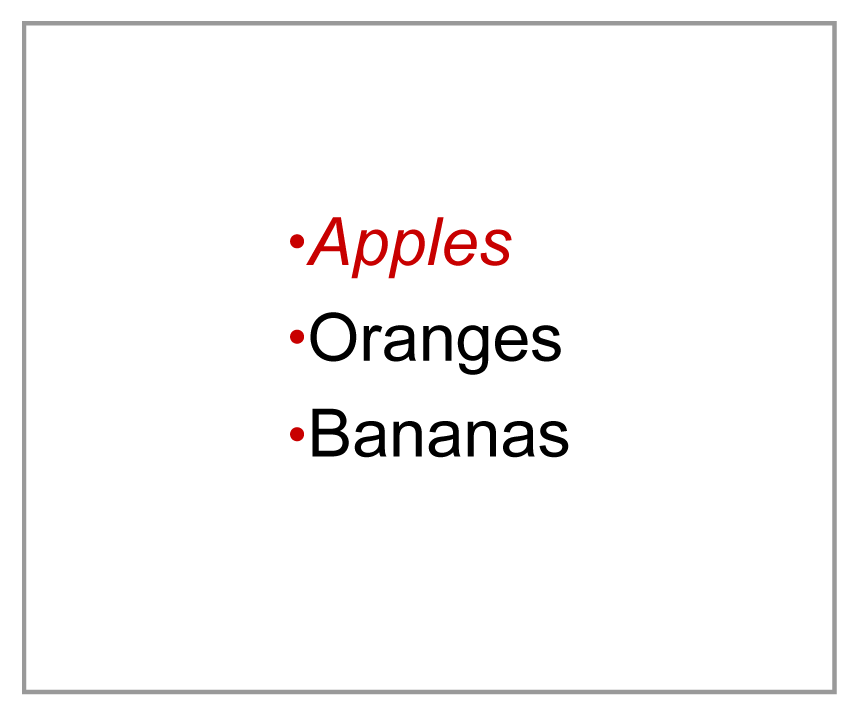
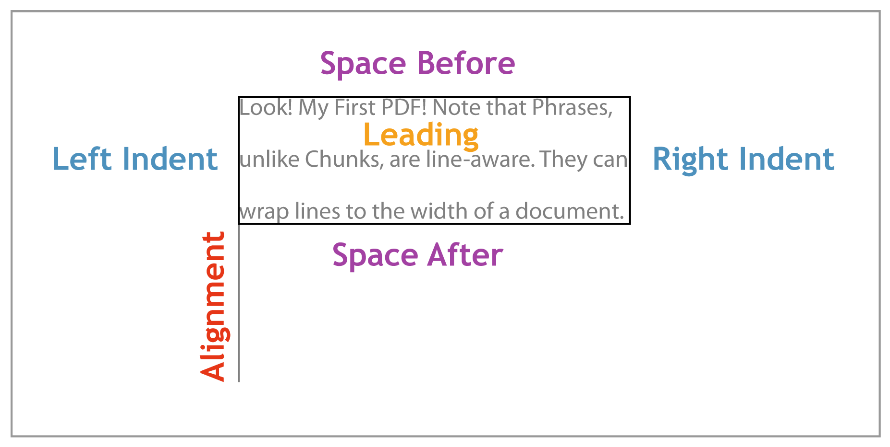

# 六、使用 C#创建 pdf

从 C#程序中动态生成 pdf 有许多潜在的应用。例如，您可以自动为公司生成自定义发票。您可以从数据库中提取公司名称、价格和项目，并使用它们生成内容流，而不是手工编码所有信息。

虽然这可以通过以本地 PDF 语言手动输出每个对象来实现，但第三方库使事情变得容易得多。PDF 库让您可以以面向对象的方式与 PDF 文档交互，而不是操纵字符串并将其保存到文件中。 [iTextSharp](http://itextpdf.com/) 库是 C#最受欢迎的开源 PDF 库。

本章将介绍 iTextSharp 的基础知识。它假设你有工作。NET SDK，提供编译 C#代码的`csc`命令。这一章是*而不是*旨在全面指导 iTextSharp 或动态 PDF 文档的生成。它只是作为 iTextSharp 核心功能的快速入门指南。

## 免责声明

iTextSharp 库是 iText Java 库的 C#端口(可从同一网站获得)。在连接到 C#的过程中，应用编程接口的一些特性和方面丢失了。更令人困惑的是，这些变化没有记录在案。事实上，在撰写本文时，还没有 iTextSharp 文档可言。唯一可用的在线 API 参考是 Java 版本，可以在[http://api.itextpdf.com/itext](http://api.itextpdf.com/itext)找到。

尽管存在一些不一致之处，但该文档仍然被证明是 C#开发人员的有用参考。

## 安装

最新版本的 iTextSharp 可以从 [SourceForge](http://sourceforge.net/projects/itextsharp/files/itextsharp/) 下载。从包中提取**itextsharp-dll-core-5 . 2 . 1 . zip**。它应该包含一个名为**itextsharp.dll**的文件。任何需要 iTextSharp 功能的 C#项目都必须根据该库进行编译。

## 基础

让我们从一个简单的“你好，世界”例子开始。将以下内容添加到名为 **HelloWorld.cs** 的新文件中(该文件可在[https://bitbucket.org/syncfusion/pdf-succinctly](https://bitbucket.org/syncfusion/pdf-succinctly)获得)。

```
        using System; using System.IO; using iTextSharp.text; using iTextSharp.text.pdf;
         public class HelloWorld {
            public static void Main() {
                Document doc = new Document();
                PdfWriter.GetInstance(doc,
                    new FileStream("itext.pdf", FileMode.Create)
                );
                doc.Open();
                Paragraph p = new Paragraph("Look! My First PDF!");
                doc.Add(p);
                doc.Close();
                Console.WriteLine("Created a PDF!");
            }
        }

```

首先，我们为程序声明必要的名称空间。绝大多数有用的类存在于`iTextSharp.text`中。我们唯一需要从`iTextSharp.text.pdf`得到的就是`PdfWriter`，一会儿再讨论。

然后，我们用`new Document()`创建一个 PDF 文档的 C#表示。之后，我们用`PdfWriter`实例注册文档。这确保我们添加到文档对象的内容被写入文件**itext.pdf**。接下来，我们用`Open()`方法打开文档。在向`doc`添加任何内容之前，必须调用该*。*

 *现在文档已经打开，我们可以创建一个`Paragraph`实例，并在其中附加一些文本。考虑到 PDF 不知道段落是什么——它只知道`Tj`、`Td`和`T*`，这可能看起来很奇怪。幸运的是，iTextSharp 提供了更高级别的元素，如段落、标题和列表。这使得生成包含任意文本的动态 pdf 变得非常容易。

最后，我们关闭文档并输出一条简短的成功消息。

### 编译

请记住，这个程序需要针对 iTextSharp 库进行编译。因此，将**itextsharp.dll**移动到与 **HelloWorld.cs** 相同的文件夹中(或者，您可以将其放置在您的路径中)。然后，运行以下命令来编译程序。

```
        csc /reference:itextsharp.dll HelloWorld.cs

```

这会创建一个名为**HelloWorld.exe**的可执行文件。当你运行它时，这个程序会创建一个名为**itext.pdf**的 PDF 文档，文本为“看！我的第一个 PDF！”在顶部。这个文档的内部应该有一个熟悉的语法；但是，这些流是压缩的，因此不可读。此外，还删除了几个行提要，这使得您更难确定自己的方向。

我们可以通过用 pdftk 解压缩来更容易地检查**itext.pdf**。它的语法有些不直观:

```
        pdftk itext.pdf output itext-pretty.pdf uncompress

```

现在，如果你打开**itext-pretty.pdf**，你应该会发现一个更容易理解的 PDF 文档。预告片词典指向目录，应该是`5 0 obj`。目录指向根页面树(`3 0 obj`)，您应该可以从那里找到路。

但是，iTextSharp 向输出文件中添加了一些新对象。预告片有一个`/Info`条目，我们之前没见过。它指向包含文档元数据的信息字典。如果你向上滚动到`7 0 obj`，你会看到 iTextSharp 将自己记录为生产者应用程序，以及修改日期和创建日期。除此之外，PDF 规范还定义了`/Title`、`/Author`、`/Subject`和`/Keywords`。所有这些值都应该是字符串。

预告片词典中还有一个新的`/ID`词条。它唯一地标识了文档的这个版本，这对于将文档集成到工作流中非常有用。

## iTextSharp 文本对象

正如我们所看到的，iTextSharp 在比 PDF 文本对象更高的层次上工作。它使用三个级别的文本对象:组块、短语和段落。这些核心文本对象以及大多数其他可用元素都位于`iTextSharp.text`命名空间中。

### 组块

组块是你能处理的最小的文本单位。当你需要用不同于该行其余部分的方式来设计一个特定的单词或短语时，它们非常有用。查看以下代码示例。

```
        Chunk before = new Chunk("Look! My ");
        Chunk middle = new Chunk("First");
        middle.SetUnderline(0.5f, -1.5f);
        Chunk after = new Chunk(" PDF!");
        Paragraph p = new Paragraph();
        p.Add(before);
        p.Add(middle);
        p.Add(after);
        doc.Add(p);

```

正如您从更高级别的库中所期望的那样，您可以直接将下划线与文本范围相关联。`SetUnderline()`方法采用两个参数:下划线笔画的宽度和与基线的偏移距离。

然而，除了基本风格之外，组块并不提供太多功能。它们可以给文本加下划线和斜体，但不能执行行级操作。为此，我们需要`Phrase`类。

### 短语

一个`Phrase`是一组`Chunk`对象，以及一些线感知功能。它可以将行换行到一定长度，根据给定的前导将行隔开，并将格式级联到它的块中。如果我们把我们的`Paragraph`换成`Phrase`并且再增加几块，我们就能看到这一点。

```
        Phrase p = new Phrase();
        p.Add(before);
        p.Add(middle);
        p.Add(after);
        p.Add(new Chunk(" Note that Phrases, unlike Chunks, are line-aware."));
        p.Add(new Chunk(" They can wrap lines to the width of a document."));

```

### 段落

`Paragraph`是 iTextSharp 的块级文本对象。因为它是由短语组成的，所以它具有所有相同的行相关功能。此外，段落具有缩进和文本对齐功能。我们稍后将仔细研究这些属性。

### 列表

在这些基本文本对象之上，iTextSharp 提供了常见的排版元素，包括列表。我们可以创建一个名为`List`类的列表，并通过创建`ListItems`向其中添加项目。

```
        List list = new List(List.UNORDERED);
        list.Add(new ListItem("Apples"));
        list.Add(new ListItem("Oranges"));
        list.Add(new ListItem("Bananas"));
        doc.Add(list);

```

默认情况下，列表使用连字符来表示每个项目。但是，这可以用`SetListSymbol()`方法改变。

```
        list.SetListSymbol("\u2022");

```

现在，列表使用 Unicode 项目符号字符。注意，在向列表中添加任何项目之前，必须调用*这个方法。*

## 格式化文档

任何你能用原生 PDF 语言做的事情，你都应该能用 iTextSharp 做。在本节中，我们将了解 iTextSharp 版本的媒体盒、颜色、字体和段落格式。

### 文件尺寸

页面对象中的`/MediaBox`条目定义了该页面的大小。在 iTextSharp 中，这是通过将包含尺寸的`Rectangle`传递给`Document`构造器来实现的。

```
        Rectangle mediaBox = new Rectangle(300, 400);
        Document doc = new Document(mediaBox);

```

现在，如果你打开由 **HelloWorld.cs** 创建的文档，你会发现一个`[0 0 300 400]`的`/MediaBox`条目。iTextSharp 还附带了一个有用的`PageSize`类，其中包含常见纸张尺寸的常量。例如`PageSize.A5`是 420 × 595 `Rectangle`。

`Document`构造函数还接受四个数字参数，分别定义页面的左边距、右边距、上边距和下边距。例如，由以下示例创建的文档将完全没有页边距。

```
        Document doc = new Document(mediaBox, 0, 0, 0, 0);

```

### 颜色

iTextSharp 使用`BaseColor`类将颜色表示为 RGB 分量。我们可以通过将`BaseColor`的一个实例分配给`Rectangle`的`BackgroundColor`字段来定义页面的背景颜色。

```
        mediaBox.BackgroundColor =new BaseColor(255, 255, 240);

```

当然，iTextSharp 也支持其他常见的色彩空间，包括:`CMYKColor`、`GrayColor`、`SpotColor`。甚至还有一个`PatternColor`可以使用位图来绘制填充。

### 选择字体

`Font`类将字体、大小和颜色组合成可重用的样式。然而，直接使用`Font`类可能有点复杂，所以 iTextSharp 提供了一个创建`Font`实例的工厂方法。

```
        BaseColor red = new BaseColor(255, 0, 0);
        Font apple_font = FontFactory.GetFont(
            FontFactory.HELVETICA_OBLIQUE, 12, red
        );

```

这将创建一个高 12 点的红色倾斜 Helvetica 字体。现在我们可以将这个字体实例传递给任何文本对象。例如，我们将把列表中的“苹果”文本变成红色。

```
        list.Add(new ListItem("Apples", apple_font));

```

所有其他文本对象(块、短语和段落)也将字体作为它们的第二个参数。然而`List`物体有一些意想不到的行为——*所有*的子弹都是红色的。



图 23:应用于所有项目符号的`apple_font`

我们可以通过显式设置项目符号的字体来解决这个问题。首先，我们将创建字体。

```
        BaseColor black = new BaseColor(0, 0, 0);
        Font symbol_font = FontFactory.GetFont(
            FontFactory.HELVETICA, 12, black
        );

```

然后我们将在新的`Chunk`中使用这种字体，并将其分配给列表符号。

```
        list.ListSymbol = new Chunk("\u2022", symbol_font);

```

请注意，我们必须使用`ListSymbol`字段而不是`SetListSymbol()`方法。虽然`SetListSymbol()`被记录为接受字符串或`Chunk`，但是 C#端口似乎已经失去了这个功能。相反，`ListSymbol`场接受一个`Chunk`。这是移植库的开发人员常用的“习惯用法”。

### 自定义字体

使用相同的方法，您也可以从硬盘将字体嵌入到文档中。嵌入字体的能力是 pdf 流行背后的一大原因。因为他们不依赖客户端资源，所以他们可以确保内容在*任何*计算机上显示相同，无论其安装的字体如何。

可以通过直接访问字体文件来嵌入字体，如下所示。

```
        Font chunk_font = FontFactory.GetFont(
            "C:\\WINDOWS\\Fonts\\Chunkfive.otf",
            BaseFont.WINANSI,
            BaseFont.EMBEDDED
        );

```

这嵌入了一个位于`C:\Windows\Fonts\Chunkfive.otf`的字体，它是从[FontSquirrel.com](http://www.fontsquirrel.com/)获得的[块五罗马](http://www.fontsquirrel.com/fonts/ChunkFive)的副本。`WINANSI`是字体的编码，`EMBEDDED`是告诉 PDF 嵌入字体的布尔标志。

### 格式化文本块

现在我们已经有了字体选择，我们可以继续进行块级格式化。这包括:前导、前后间距、左右缩进和对齐:



图 24: iTextSharp 的块级格式字段

让我们跳进来吧。将`Phrase`改回`Paragraph`，然后设置以下四个字段。

```
        Paragraph p = new Paragraph();
        p.Leading = 26f;
        p.SpacingAfter = 10f;
        p.IndentationLeft = 10f;
        p.Alignment = Element.ALIGN_CENTER;

```

前导、间距和缩进都接受浮动，但对齐需要在`Element`类中定义的常数。其他对齐选项有:`ALIGN_LEFT`、`ALIGN_RIGHT`和`ALIGN_JUSTIFIED`。如果您调整文本、解压缩文件并筛选内容流，您会发现 iTextSharp 使用本书开头讨论的相同 Tc 和 Tw 方法调整文本。

## 总结

本章简要介绍了 iTextSharp 库。您应该已经在从 C#动态创建 PDF 文档并利用它们来对抗。NET 框架。我把它剩下的部分留给你去探索。与此相关的是，Syncfusion 还提供了一个商业 PDF 库，该库提供了一个高级对象模型来创建、修改、转换和查看 PDF 文件。NET 应用程序。Syncfusion 的 PDF 库在线样本可以在[这里](http://mvc.syncfusion.com/sfmvcpdfsamplebrowser)找到。*