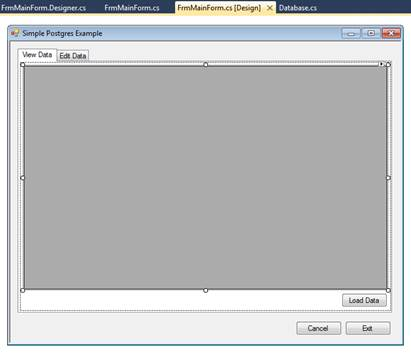
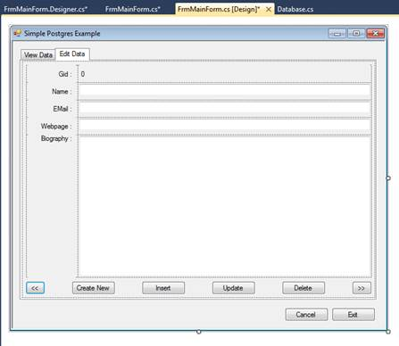
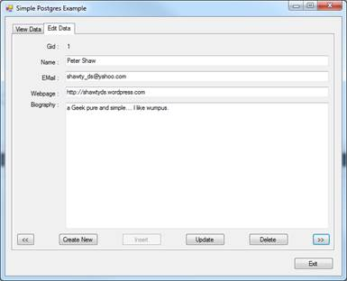

# 九、使用 Postgres 搭配 .NET

所以现在我们进入有趣的部分:在. NET 应用程序中使用 Postgres。

我不打算使用 Postgres 在这个例子中提供的任何特殊功能；这将是一个快速简单的编辑应用程序，可以编辑我们之前创建的 MyTable。

我们将首先从 ADO.NET 版本开始。一旦成功，我们将把它转换为使用实体框架版本 5。

这两个示例应用程序都可以作为两个独立的项目在[https://bitbucket.org/syncfusion/postgres_succinctly](https://bitbucket.org/syncfusion/postgres_succinctly)下载，一个用于普通 ADO 版本，另一个用于实体框架版本。

请注意，我将在这里使用 Visual Studio 2010 作为我的示例，但是请随意使用您想要的任何编译器或 IDE。我展示的代码应该在任何 C#编译器下工作，包括 Mono。Npgsql (the。NET 数据接口)在 Mono 下工作得很好，但我不能保证实体框架版本会。请记住，本例中我使用的是 Windows 7 平台。

## 创建一个简单的 Windows 窗体应用程序

我们将从启动 Visual Studio 2010 开始，从**文件**菜单中启动一个新项目，并选择一个 **Windows 窗体**项目作为目标。NET 4。


图 109:窗口窗体项目

设置好路径、项目名称等后。，点击**确定**在 IDE 中创建你的项目。

创建项目后，将主窗口的大小调整到大约 650 × 530 像素，然后在主窗体中添加一个选项卡控件和两个普通按钮。

你的两个按钮应该是**取消**和**编辑**。

在第一个选项卡控件页面上，放置一个常规的 **DataGridView** 和第三个标记为**加载数据**的按钮。命名第一个选项卡**查看数据**。完成后，您的表单应该如下所示:



图 110:应用程序窗口

我保留了数据网格的默认值(自动列、宽度等)。).我们将很快在代码中填充这个。

完成第一个选项卡后，切换到第二个选项卡，并在其上放置一个**表格布局面板**。将**布局**列和行编辑如下:

第 1 栏 15%

第 2 栏 85%

第 1 行 30 像素

第 2 行 30 像素

Row3 30 像素

Row4 30 像素

第 5 行自动调整大小

接下来，在表格控件的每个左侧单元格中添加一个标签，并将**停靠**属性设置为**填充**。将每个标签的**文本对齐方式**设置为**中右**除了底部的应该是**右上角**，然后给每个标签以下文本:

Gid:

名称:

电子邮件:

网页:

传记:

继续，在表格布局的右上角单元格中添加另一个标签(与 **Gid** 同一行)，并在其余单元格中添加文本框。

底部单元格的文本框应设置为**多行**。将所有的**码头**物业设置为**填充**。

完成表格布局后，在选项卡页面底部添加六个按钮，并从左到右标记它们，如下所示:

<<

新建

插入

更新

删除

>>

完成后，您的表单应该如下所示:



图 111:完成的表单

一旦接口完成，我们需要开始添加代码。首先，我们需要使用 **NuGet** 添加 **NpgSql** 组件。

右键单击**参考**，然后选择**管理 NuGet 包**。确保您在网上搜索。然后在**搜索**，输入 **Npgsql** 。您应该会看到以下内容:


图 112:添加 Npgsql 程序集

点击 **Npgsql** 旁边的**安装**按钮，将其安装到您的项目中。

接下来，右键单击您的项目根，并添加两个新文件夹，一个名为**类**，一个名为**实体**。注意:你不必用这种方式组织你的项目，但我总是这样做，因为这样更容易管理。如果你对我的方法感到好奇，我有一个关于这个主题的 90 分钟的视频，可以在 LIDNUG 的 YouTube 页面上免费获得，网址是[http://www.youtube.com/user/lidnug](http://www.youtube.com/user/lidnug)。

在**类**文件夹中，创建两个名为 **ConnectionStrings.cs** 和 **Database.cs** 的新类。在**实体**文件夹中，创建一个名为 **MyTable.cs** 的类。

**ConnectionStrings.cs** 需要从 **app.config** 文件中获取连接字符串，因为 **Npgsql** 不具备获取连接字符串名称并从中加载真实字符串的能力。我们使用 **ConnectionStrings** 类来获取字符串，然后将它传递给 **DataBase.cs** 中的方法，在那里可以与 Postgres 进行对话的所有功能都是。

实体类应该为您的数据库表建模。

在我们的例子中，这三个类如下所示:

### 连接字符串. cs

```sql
    using System;
    using System.Configuration;

    namespace PostgresExample.Classes
    {
      public static class ConnectionStrings
      {
        public static string PgConnection
        {
          get
          {
            const string connectionStringName = "pgconnection";
            if (string.IsNullOrEmpty(ConfigurationManager.ConnectionStrings[connectionStringName].ConnectionString))
            {
              throw new Exception("Connection string (" + connectionStringName + ") not defined in app.config!");
            }

            return ConfigurationManager.ConnectionStrings[connectionStringName].ConnectionString;
          }
        }

      }
    }

```

数据库. cs

```sql
    using System.Collections.Generic;
    using Npgsql;
    using NpgsqlTypes;
    using PostgresExample.Entities;

    namespace PostgresExample.Classes
    {
      public class Database
      {
        public List<MyTable> GetAll()
        {
          List<MyTable> results = new List<MyTable>();

          using (NpgsqlConnection connection = new NpgsqlConnection(ConnectionStrings.PgConnection))
          {
            connection.Open();
            const string sql = "select * from mytable";
            using (NpgsqlCommand command = new NpgsqlCommand(sql, connection))
            {
              using (NpgsqlDataReader reader = command.ExecuteReader())
              {
                if (!reader.HasRows) return results;
                while (reader.Read())
                {
                  results.Add(new MyTable
                                {
                                  Gid = (int)reader["gid"],
                                  Name = (string)reader["name"],
                                  Email = (string)reader["email"],
                                  Webpage = (string)reader["webpage"],
                                  Bio = (string)reader["bio"]
                                });
                }
              }
            }
          }

          return results;
        }

        public MyTable GetByGid(int gid)
        {
          MyTable result;

          using (NpgsqlConnection connection = new NpgsqlConnection(ConnectionStrings.PgConnection))
          {
            connection.Open();
            const string sql = "select * from mytable where gid = :gid";
            using (NpgsqlCommand command = new NpgsqlCommand(sql, connection))
            {
              command.Parameters.Add(new NpgsqlParameter("gid", NpgsqlDbType.Integer));
              command.Parameters["gid"].Value = gid;

              using (NpgsqlDataReader reader = command.ExecuteReader())
              {
                if (!reader.HasRows) return null;
                reader.Read();
                result = new MyTable
                {
                  Gid = (int)reader["gid"],
                  Name = (string)reader["name"],
                  Email = (string)reader["email"],
                  Webpage = (string)reader["webpage"],
                  Bio = (string)reader["bio"]
                };
              }
            }
          }

          return result;
        }

        public void AddNew(MyTable entity)
        {
          using (NpgsqlConnection connection = new NpgsqlConnection(ConnectionStrings.PgConnection))
          {
            connection.Open();
            const string sql = "insert into mytable(name, email, webpage, bio) values(:name,:email,:webpage,:bio)";
            using(NpgsqlCommand command = new NpgsqlCommand(sql, connection))
            {
              command.Parameters.Add(new NpgsqlParameter("name", NpgsqlDbType.Varchar));
              command.Parameters.Add(new NpgsqlParameter("email", NpgsqlDbType.Varchar));
              command.Parameters.Add(new NpgsqlParameter("webpage", NpgsqlDbType.Varchar));
              command.Parameters.Add(new NpgsqlParameter("bio", NpgsqlDbType.Varchar));
              command.Parameters["name"].Value = entity.Name;
              command.Parameters["email"].Value = entity.Email;
              command.Parameters["webpage"].Value = entity.Webpage;
              command.Parameters["bio"].Value = entity.Bio;

              command.ExecuteNonQuery();
            }
          }
        }

        public void DeleteByGid(int gid)
        {
          using (NpgsqlConnection connection = new NpgsqlConnection(ConnectionStrings.PgConnection))
          {
            connection.Open();
            const string sql = "delete from mytable where gid = :gid";
            using (NpgsqlCommand command = new NpgsqlCommand(sql, connection))
            {
              command.Parameters.Add(new NpgsqlParameter("gid", NpgsqlDbType.Integer));
              command.Parameters["gid"].Value = gid;

              command.ExecuteNonQuery();
            }
          }
        }

        public void Update(MyTable entity)
        {
          using (NpgsqlConnection connection = new NpgsqlConnection(ConnectionStrings.PgConnection))
          {
            connection.Open();
            const string sql = "update mytable set name = :name, email = :email, webpage = :webpage, bio = :bio WHERE gid = :gid";
            using (NpgsqlCommand command = new NpgsqlCommand(sql, connection))
            {
              command.Parameters.Add(new NpgsqlParameter("name", NpgsqlDbType.Varchar));
              command.Parameters.Add(new NpgsqlParameter("email", NpgsqlDbType.Varchar));
              command.Parameters.Add(new NpgsqlParameter("webpage", NpgsqlDbType.Varchar));
              command.Parameters.Add(new NpgsqlParameter("bio", NpgsqlDbType.Varchar));
              command.Parameters.Add(new NpgsqlParameter("gid", NpgsqlDbType.Integer));
              command.Parameters["name"].Value = entity.Name;
              command.Parameters["email"].Value = entity.Email;
              command.Parameters["webpage"].Value = entity.Webpage;
              command.Parameters["bio"].Value = entity.Bio;
              command.Parameters["gid"].Value = entity.Gid;

              command.ExecuteNonQuery();
            }
          }

        }

      }
    }

```

### MyTable.cs

```sql
    namespace PostgresExample.Entities
    {
      public class MyTable
      {
        public int Gid { get; set; }
        public string Name { get; set; }
        public string Email { get; set; }
        public string Webpage { get; set; }
        public string Bio { get; set; }

      }
    }

```

如您所见，代码简单易懂。

如果您在尝试编译时遇到任何缺少引用的错误，您将需要使用 Visual Studio 中的**添加引用工具**来添加对**系统的引用。配置**。这是读取**连接字符串. cs** 中的配置字符串所必需的。

打开与 Postgres 连接的关键在于使用语句的**，这可以确保对象得到正确处理。**

```sql
    using (NpgsqlConnection connection = new NpgsqlConnection(ConnectionStrings.PgConnection))
    {
            connection.Open();
    }

```

一旦你有了连接，你可以创建一个 **Npgsql** 命令对象来允许你执行标准的 sql 语句。

```sql
    const string sql = "select * from mytable";
    using (NpgsqlCommand command = new NpgsqlCommand(sql, connection))
    {
    }

```

同样，我们使用使用语句的**(因为对象源自 **IDisposable** )来确保对象得到正确处理。**

如果您需要将参数传递到您的 SQL 字符串中，那么您应该使用存在于 ADO.NET 的参数化功能来抵御 XSS 和 SQL 注入攻击。

您也可以使用 **string.format** 或一些其他形式的连接，但是这样做是非常不明智的，除非您完全确定您的输入数据是干净的。

```sql
    command.Parameters.Add(new NpgsqlParameter("gid", NpgsqlDbType.Integer));
    command.Parameters["gid"].Value = entity.Gid;

```

在前面的代码示例中指定参数名称的地方，您将在 SQL 字符串中放置 **:** 后跟名称(在本例中为 **:gid** )。

在所有这些都设置好之后，如果您的 SQL 不期望返回任何数据，那么只需要调用以下代码:

```sql
    command.ExecuteNonQuery();

```

如果您的 SQL 预期会返回数据，则调用:

```sql
    command.ExecuteReader();

```

其余的，比如使用数据读取器，都是标准的 ADO.NET 代码。

一旦有了这三个类，就需要将连接字符串添加到应用程序中的 **app.config** 文件中。连接字符串应该如下所示:

```sql
    <?xml version="1.0"?>
    <configuration>

      <startup>
        <supportedRuntime version="v4.0" sku=".NETFramework,Version=v4.0"/>
      </startup>

      <connectionStrings>
        <add name="pgconnection"
             connectionString="Server=virtw7-lucinda;Port=5432;Database=mydatabase;User Id=myuser;Password=myuser;"
             providerName="Npgsql" />
      </connectionStrings>
    </configuration>

```

如果您在安装 Postgres 的同一台机器上运行此应用程序，那么前面的代码示例将按原样工作。如果没有，您需要根据需要更改参数，以指向正确的服务器。

一旦我们到达这一点，剩下要做的就是将用户界面按钮和元素连接到**数据库**类中的各种方法。

完整代码请参考下载。我不打算在这里粘贴完整的表单代码，因为它很长。我还添加了一些额外的功能来使用户界面更加友好，但是这些额外的功能并不是演示如何使用 Postgres 所必需的。

这里的关键是**数据库**类，以及它作为代表您的表数据和程序代码的类之间的代理的方式。

如果你使用的是 raw **Npgsql** ，那么你一定要看看[的手册页。](http://npgsql.projects.pgfoundry.org/docs/manual/UserManual.html)

还有更多的可用内容，尤其是在版本 2 中。像准备好的语句、存储过程支持和引用游标，以及大容量表导入和导出和许多其他功能现在都可用了。

运行应用程序后，在第一个选项卡上，您应该会看到:


图 113:查看数据选项卡

在第二个标签上:



图 114:编辑数据选项卡

## 将应用转换为使用实体框架

对于这最后一部分，我们将采用我们的 ADO。NET 的应用程序，只改变我们需要的东西，使其与实体框架 5 代码优先。

您不需要对图形用户界面代码进行任何更改，因为我们将使用现有的 **DataBase.cs** 类为我们的应用程序提供与 ADO.NET 版本相同的界面。

对于这一部分，您可以删除您的**类**文件夹中的 **ConnectionStrings.cs** 类，并创建一个名为**电子数据库. cs** 的新类。

您还需要像以前一样使用 **NuGet** ，并将**实体框架**添加到您的项目中。(在撰写本书时，v5 是当前版本。)

**EFDatabase.cs** 应包含以下代码:

```sql
    using System.Data.Entity;
    using PostgresExample.Entities;

    namespace PostgresExample.Classes
    {
      public class EFDatabase : DbContext
      {
        public EFDatabase()
          : base("pgconnection") // Name of connection string to look for.
        { }

        public DbSet<MyTable> MyTables { get; set; }

      }
    }

```

这是我们的代码和实体框架之间的主要接口。互联网上的任何教程都会解释这里发生了什么。

一旦我们准备好了实体框架接口，我们需要调整我们的 **Database.cs** 类，使它看起来如下:

```sql
    using System.Collections.Generic;
    using System.Data;
    using System.Data.Entity.Infrastructure;
    using System.Linq;
    using PostgresExample.Entities;

    namespace PostgresExample.Classes
    {
      public class Database
      {
        public List<MyTable> GetAll()
        {
          List<MyTable> results;

          using(EFDatabase myDb = new EFDatabase())
          {
            results = myDb.Set<MyTable>().AsQueryable().ToList();
          }

          return results;
        }

        public void AddNew(MyTable entity)
        {
          using (EFDatabase myDb = new EFDatabase())
          {
            myDb.Set<MyTable>().Add(entity);
            myDb.SaveChanges();
          }

        }

        public void DeleteByGid(int gid)
        {
          using(EFDatabase myDb = new EFDatabase())
          {
            MyTable entityToRemove = myDb.Set<MyTable>().FirstOrDefault(x => x.Gid == gid);
            if (entityToRemove == null) return;
            myDb.Set<MyTable>().Remove(entityToRemove);
            myDb.SaveChanges();
          }

        }

        public void Update(MyTable entity)
        {
          using(EFDatabase myDb = new EFDatabase())
          {

            DbEntityEntry entry = myDb.Entry(entity);
            if (entry != null)
            {
              switch (entry.State)
              {
                case EntityState.Detached:
                  myDb.Set<MyTable>().Attach(entity);
                  myDb.Entry(entity).State = EntityState.Modified;
                  break;

                case EntityState.Deleted:
                  entry.CurrentValues.SetValues(entity);
                  entry.State = EntityState.Modified;
                  break;

                default:
                  entry.State = EntityState.Modified;
                  break;
              }
            }
            else
            {
              myDb.Set<MyTable>().Attach(entity);
              myDb.Entry(entity).State = EntityState.Modified;
            }

            myDb.ChangeTracker.DetectChanges();
            myDb.SaveChanges();

          }

        }

      }
    }

```

代码比 ADO.NET 数据库类少得多，但这是有代价的。实体框架比普通的 ADO.NET 慢得多。值得注意的是，很多微形态如 **Simple。数据**、**海量**、**服务栈**均支持 Postgres。我可以强烈推荐**简单。数据**，因为我已经用它做了很多 Postgres 是主要商店的项目。

一旦设置了数据类，您需要对您的 **MyTable** 实体类进行一些更改。

这些更改包括向类中添加实体框架数据属性来设置默认模式(在 Postgres 下总是**公共**)，并确保列名是小写的。

还要注意的是，当在实体框架中使用 **NpgSql** 的**代码优先**时，必须手工创建表格。带有 Postgres 的实体框架目前不会为您创建不存在的表。

对实体进行更改后，它应该如下所示:

```sql
    using System.ComponentModel.DataAnnotations;
    using System.ComponentModel.DataAnnotations.Schema;

    namespace PostgresExample.Entities
    {
      // Note: I'm using column attributes to enforce lowercase names and set the default schema which is 'public'

      [Table("mytable", Schema = "public")]
      public class MyTable
      {
        [Key]
        [Column("gid")]
        public int Gid { get; set; }

        [Column("name")]
        public string Name { get; set; }

        [Column("email")]
        public string Email { get; set; }

        [Column("webpage")]
        public string Webpage { get; set; }

        [Column("bio")]
        public string Bio { get; set; }

      }
    }

```

代码更改完成后，最后要做的事情是在应用程序配置中将 **Npgsql** 注册为数据提供者，方法是使用以下附加功能:

```sql
    <system.data>
        <DbProviderFactories>
          <add name="Npgsql Data Provider"
               invariant="Npgsql"
               description="Data Provider for PostgreSQL"
               type="Npgsql.NpgsqlFactory, Npgsql" />
        </DbProviderFactories>
      </system.data>

```

如果您的应用程序配置文件中没有这个部分，那么当您尝试连接时，您将会得到一个异常，表明没有找到注册的数据提供程序。

如果一切都按计划进行，那么按下 **F5** 并运行您的应用程序应该会得到与前面的 ADO.NET 示例相同的输出。