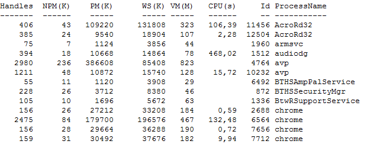

# 三、进程

## 列出所有进程

要列出每个过程，如前面的例子所示，使用 **Get-Process** 命令。只需调用 shell 中的命令，它就会在内部调用 foreach 循环，用一些属性向您显示计算机中的每个活动进程，并将其显示为格式化的表。

```powershell
          Get-Process

```



图 37:获取过程结果

有一些参数和选项，您可能希望根据您可能有的需求来列出所有活动的进程。在下面的示例中，您应该用有效的计算机名替换 MyMachineName 字符串值。您可以通过在 shell 或命令行工具中运行 hostname 命令来检查您的计算机名。

```powershell
          #Execute Get-Process on a remote computer.
          Get-Process -ComputerName "MyMachineName"

          #Get specific attributes.
          Get-Process | select Id,Name

          #Condition the process you want to list (Chrome processes only).
          Get-Process | ?{$_.Name -like "*chrome"}

```

在检索所有正在运行的进程后，您可以做的另一件事是处理它们以提取信息。一个例子是评估你机器上所有谷歌浏览器进程的 CPU 使用情况。

```powershell
          #How much CPU do all chrome processes consume?
          $sumCpuUsage=0
          write "All Chrome Processes:"
          Get-Process -ComputerName "MyMachineName”  |`
                ?{$_.Name -like "*chrome"} | %{
                            $id=$_.Id
                            $cpu = $_.CPU
                            "Process:$id  CPU: $cpu"
                            $sumCpuUsage+=$_.CPU
                       }
          write "Total CPU: $sumCpuUsage"       

```

## 按标识获取进程

列出所有进程后，您可能会确定您希望特别分析的进程；为此，您必须获取它的 ID，然后使用 **Get-Process** 命令的属性–ID 调用它。

```powershell
          Get-Process -Id 11372  

```

## 停止一个过程

要停止一个进程，需要使用命令 **Stop-Process** 后跟属性 ID，在这种情况下是必须的。为了优化您的命令，您可以通过 ID 获取该进程，然后将其传送到停止命令。在下面的示例中，您可以找到在您的计算机上运行的所有 Internet Explorer 实例，然后停止它们。

```powershell
          #Using the get by Id concept
          Get-Process -ProcessName “iexplore”  | Stop-Process

```

## 开始一个过程

借助**开始-过程**命令，在 PowerShell 中启动一个过程很容易。该命令不仅启动进程，还返回进程对象本身，然后可以对其进行检查或操作。如果将可执行文件的路径设置为参数，或者将文件的路径设置为参数，则此命令会在本地计算机上启动一个或多个进程。在这种情况下，PowerShell 将启动默认程序来打开文件的扩展名。

```powershell
          <# EXAMPLE 1: Start a program #>

                #Path from file.
                $path = "C:\temp\Paint.NET.lnk"

                #Start new process.
                $process = Start-Process $path

                #Get process id started.
                $process.Id

          <# EXAMPLE 2: Start a file
          with the default program to open it #>

                #Path from file.
                $path = "C:\temp\ListaUsers.csv"

                #Start new process.
                $process = Start-Process $path

                #Get process id started.
                  $process.Id

```