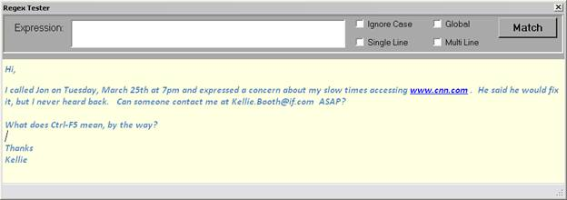
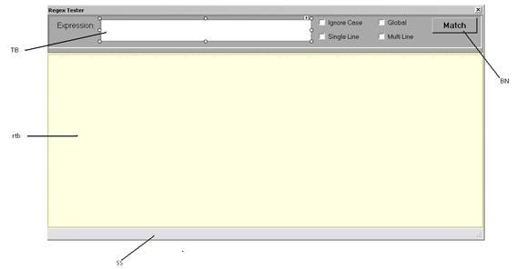

# 二、在 .NET 中使用正则表达式

正则表达式的概念最早出现在 20 世纪 50 年代，当时美国数学家斯蒂芬·克莱尼设计了一个简单的代数系统来理解大脑如何产生复杂的模式。1968 年，这种模式代数在 ACM 的*通信*中被描述，并在几个 UNIX 工具中实现，特别是 GREP，一种用于搜索文件的 UNIX 工具。当 20 世纪 80 年代末的 Perl 编程语言将正则表达式集成到语言中，为原始代数增加了特性时，它将 regex 解析带入了主流编程社区。

Regex 处理存在于许多语言中，因此无论您使用什么工具，模式和规则都应该相当一致地工作。我们将在探索示例时指出一些细微的差异，但是大多数实现都以同样的方式支持语言元素。

## 微软 Regex

出于本书的目的，我们将使用微软在。NET 框架。我们将使用 C#作为我们的基础语言，但是有一些小的不同；代码示例将在 VB.NET 工作。这些模式应该会起作用。NET、PHP、Python 等。

微软。NET Framework 从 1.1 版本开始就支持 ***系统中的正则表达式。*** 装配。这个程序集需要包含在您编写的任何想要利用正则表达式的应用程序中。

## Regex 类

regex 类可用于创建一个对象，该对象允许您设置一个模式和一些选项，然后将该模式应用于字符串。您可以搜索字符串，将字符串拆分为数组，甚至替换文本中的字符串。

您可以通过两种方式使用 regex 类。第一种是通过创建一个 regex 对象。您可以通过传递正则表达式模式和一些可选的正则表达式设置来实现这一点。然而，使用这种方法的一个缺点是，一旦对象被实例化，正则表达式模式就不能改变。

您也可以将 regex 类用作静态类(或在 Visual Basic 中共享)。使用这种方法时，您需要将模式和搜索字符串都传递给 regex 调用。

使用哪种方法取决于您如何使用正则表达式。如果您正在逐行读取文本文件，并使用相同的正则表达式将每一行拆分为单词或列，那么创建一个正则表达式对象并让框架编译和缓存该表达式将是有益的。使用这种方法，您将从正则表达式引擎中获得更好的性能。

如果您获取一个文本字符串，并对其应用几个不同的正则表达式模式(例如我们在帮助消息中搜索的例子)，那么使用静态正则表达式会更有意义，因为每个正则表达式都使用一次，并且保留一个编译版本不会有什么好处。

|  | 注意:微软引擎将编译正则表达式并将其保存在缓存中(默认为 15 项)。如果重用一个模式，它可能已经在缓存中，这有助于提高性能。但是，每次创建 regex 对象(而不是静态类)时，该 regex 都会被重新编译并添加到缓存中。 |

### 建造师

要创建一个正则表达式对象，您至少需要将模式传递给正则表达式。基本语法是:

```cs
      string pattern = @"[0-9A-Z]";        //       Pattern for hex digit
      Regex theRegex = new Regex(pattern);

```

|  | 提示:Regex 字符串通常包含通常在字符串中转义的字符，尤其是\字符。通过在正则表达式字符串前面加上符号@，可以避免转义任何字符。 |

您还可以传递正则表达式选项的枚举列表(用|字符分隔每个选项)。要获取上述构造函数代码并添加选项以使其不区分大小写，以及从右向左处理字符串，我们可以组合以下选项(我们将在后面的章节中更详细地讨论选项本身):

```cs
      string pattern = @"[0-9A-Z]"; // Pattern for hex digit
      Regex theRegex = new Regex(pattern,RegexOptions.IgnoreCase | RegexOptions.RightToLeft);

```

|  | 注:。NET 4.5 增加了第三个可选参数，TimeSpan 选项。默认情况下，正则表达式不会超时，而是继续搜索。如果需要正则表达式只运行一段定义的时间，可以在构造对象时将时间跨度添加到正则表达式中。 |

### 正则表达式选项

RegexOptions 是各种选项的枚举类型，您可以指定这些选项来控制如何处理 regex。表 2 描述了一些常见的选项:

表 2:常用正则表达式选项

| [计]选项 | 描述 |
| **无** | 未指定选项，默认正则表达式处理。 |
| **忽略** | 正则表达式模式通常区分大小写；此选项使正则表达式不区分大小写。 |
| **多行** | 某些元字符($和^)表示字符串的开头和结尾；设置此选项会改变它们对行首和行尾的含义。 |
| **单数** | 点元字符与换行符不匹配；使用此选项会使换行符也与点匹配。 |

还有其他的选择，我们将在本书后面的章节中介绍。

### Regex 方法

根据您使用的是创建的对象还是静态对象引用，有常规类方法和静态方法。这些方法是相似的，主要区别在于当使用静态方法时，需要将 regex 模式作为参数传递。

#### IsMatch()

IsMatch()方法返回一个布尔值，该值指示文本是否与正则表达式匹配。最常见的是，它用于验证特定的字符串看起来像模式，如信用卡号、电话号码等。

##### 1.1.1.1.1 IsMatch(字符串 Searchtext [，int position])

当用于常规对象时，有两个参数。第一个是要搜索的字符串，第二个可选参数是字符串中开始搜索的位置。

##### 1.1.1.1.2 IsMatch(字符串 Searchtext，字符串模式[，RegexOptions] [，TimeSpan])

调用静态方法时，需要搜索文本和正则表达式模式。regex 选项(由|管道分隔的枚举列表)和 TimeSpan 对象是可选的(。NET 4.5 以后)。

```cs
      string pattern = @"[0-9A-Z][0-9A-Z]"; // Pattern for hex digits
      Regex theRegex = new Regex(pattern);
      if (theRegex.IsMatch("B4") )
      { // Found a hex number
      };

```

通常 **IsMatch()** 在您不需要进一步操作字符串或只想验证字符串看起来像您期望的数据类型时使用。

#### 匹配()

Match()方法的工作原理与 IsMatch()非常相似，只是它返回的是一个 Match 对象，而不是一个布尔值。匹配对象由 regex 程序集中的一个类定义，该类提供了字符串中匹配的详细信息。

##### 匹配(字符串 Searchtext [，int position]，[int NumberOfChars])

当用于常规对象时，有三个参数。第一个是要搜索的字符串。第二个是字符串中开始搜索的位置的可选参数。第三个可选参数是字符串中要搜索的字符数。

##### 1.1.1.1.4 匹配(字符串 Searchtext，字符串模式[，RegexOptions] [，TimeSpan])

调用静态方法时，需要搜索文本和正则表达式模式。regex 选项(由|管道分隔的枚举列表)和()。NET 4.5 以后)，时间跨度对象是可选的。

返回的匹配对象包含关于匹配的信息。主要属性包括:

*   成功:布尔值，指示搜索是否成功。
*   索引:在搜索文本中找到匹配的位置。
*   长度:匹配文本的大小。
*   值:匹配文本的内容。

```cs
      string pattern = @"(\([2-9]|[2-9])(\d{2}|\d{2}\))(-|.|\s)?\d{3}(-|.|\s)?\d{4}";
      string source = "Please call me at 610-555-1212 ASAP !";
      string cPhone = "";

      Match theMatch = Regex.Match(source, pattern);
      if (theMatch.Success)
      {
      int endindex = theMatch.Length;
      cPhone = source.Substring(theMatch.Index, endindex);
      }

```

在本例中，我们搜索电话号码模式，然后使用匹配对象的属性(即索引和长度)从较大的源字符串中提取电话号码字符串。匹配对象还有其他属性和方法，我们将在后面的章节中介绍。

#### 匹配()

matches()方法与 Match()方法非常相似，只是它返回一个 Match 对象的集合(或者一个空集合没有找到匹配项)。

##### 1.1.1.1.5 匹配(字符串 Searchtext [，int 位置])

当用于常规对象时，有两个参数。第一个是要搜索的字符串，第二个可选参数是字符串中要开始搜索的位置。

##### 1.1.1.1.6 匹配(字符串搜索文本，字符串模式[，正则表达式选项] [，时间跨度])

调用静态方法时，需要搜索文本和正则表达式模式。regex 选项(由|管道分隔的枚举列表)和 TimeSpan 对象(。NET 4.5 以后)是可选的。

```cs
      string pattern = @"(\([2-9]|[2-9])(\d{2}|\d{2}\))(-|.|\s)?\d{3}(-|.|\s)?\d{4}";
      string source = "Please call me at home 610-555-1212 or my cell 610-867-5309 ASAP !";
      string cPhone = "";
      var phones = new List<string>();

      foreach (Match match in Regex.Matches(source, pattern))
      {
      int endindex = match.Length;
      cPhone = source.Substring(match.Index, endindex);
      phones.Add(phones);
      }

```

#### 拆分()

正则表达式程序集中的 Split()方法与 System.string 类中的 Split()方法非常相似，只是正则表达式模式用于将字符串拆分为字符串数组。

##### 1.1.1.1.7 拆分(字符串 Searchtext [，int position]，[int NumberOfChars])

当用于常规对象时，有三个参数。第一个是要拆分成字符串数组的字符串，第二个可选参数是字符串中开始搜索的位置。第三个可选参数是字符串中要搜索的字符数。

##### 1.1.1.1.8 拆分(字符串 Searchtext，字符串模式[，RegexOptions] [，TimeSpan])

调用静态方法时，需要搜索文本和正则表达式模式。regex 选项(由|管道分隔的枚举列表)和 TimeSpan 对象(。NET 4.5 以后)是可选的。

例如，您可以使用类似于下面的代码将一个大文本拆分成单独的句子，然后将每个句子拆分成单词。

```cs
      string source = "When I try this website, the browser locks up";
      Regex WordSplit = new Regex(@"[^\p{L}]*\p{Z}[^\p{L}]*";);

      string thePattern = @"(?<=[\.!\?])\s+";
      string[] sentences = Regex.Split(source,thePattern);

      foreach (string sentence in sentences)
      {
      string[] Words = WordSplit.Split(sentence);
      }

```

regex 程序集中还有一些额外的方法和属性，将在后面的章节中介绍。

## Regex 测试程序

为了测试本书中的一些正则表达式模式，我们将创建一个简单的 Windows 窗体应用程序来测试表达式。也有提供类似功能的网站，例如[www.regex101.com](http://www.regex101.com)，它为 JavaScript、PHP 或 Python 提供了一个 regex 测试器。虽然本书中描述的模式适用于各种不同的正则表达式引擎，但是如果您想使用。NET 正则表达式框架，或者如果您使用不同的编程环境，请尝试该网站。



图 2: Regex 测试器

### 布局

该解决方案是本书的一部分；您也可以自己创建它。

1.  创建一个窗口窗体应用程序。
2.  增加一个**分体容器**。
3.  将方向设置为**水平**。
4.  在顶部框中，添加一个**面板**，在底部框中，添加一个**富文本编辑**框。



图 3:布局

#### 面板

表单顶部的面板包含正则表达式文本和选项框。您可以给控件命名，但是下面引用了表 3 中的控件名称。

表 3:面板控制元素

| 元素 | 财产 | 价值 |
| --- | --- | --- |
| **文本框** | 名字 | 结核病（tuberculosis） |
|  | 字体 | 新快递，9.75 便士 |
| **复选框** | 名字 | ICCB |
|  | 文本 | 忽略大小写 |
| **复选框** | 名字 | GBCB(巴塞尔公约区域中心) |
|  | 文本 | 全球的 |
| **复选框** | 名字 | SLCB 通信处理器 |
|  | 文本 | 单线线路 |
| **复选框** | 名字 | mlgb |
|  | 文本 | 多线 |
| **状态栏** | 名字 | 圣人 |
|  | 项目 | 添加一个名为 SLAB 的状态标签 |

#### 丰富编辑文本框

丰富编辑文本框将用于显示输入字符串和搜索文本结果。代码找到所有匹配的模式，并在 RTF 编辑框中突出显示它们。将属性名称设置为 **rtb** 。还可以将锚点属性设置为顶部、底部、左侧和右侧，以使文本框填充整个下部面板。

### 代码

创建表单后，添加以下代码(如果您愿意，可以随意更改颜色)。

```cs
      public partial class MainForm : Form
      {

      Color BGColor = SystemColors.Info;
      Color FGColor = Color.Navy;
      Color BGHighlight = Color.Turquoise;
      Color FGHighlight = Color.Black;

      public MainForm()
      {
      InitializeComponent();
      rtb.BackColor = BGColor;
      rtb.ForeColor = FGColor;
      }

```

双击按钮生成 OnClick 事件，并向表单中添加以下代码来处理该事件:

```cs
      private void BN_Click(object sender, EventArgs e)
      {
      SLAB.Text = "";
      // Reset all colors.
      ResetRichTextBox();

      string pattern = TB.Text.Trim();
      string source = rtb.Text;

      RegexOptions theOpts = RegexOptions.None;

      if (MLCB.Checked) { theOpts = theOpts | RegexOptions.Multiline; }
      if (SLCB.Checked) { theOpts = theOpts | RegexOptions.Singleline; }
      if (ICCB.Checked) { theOpts = theOpts | RegexOptions.IgnoreCase; }

      // If global, then iterate the Matches collection.
      if (GBCB.Checked)
      {
      try
      {
      foreach (Match match in Regex.Matches(source, pattern, theOpts))
      {
      HighLightResult(match);
      }
      }
      catch (Exception ex)
      {
      SLAB.Text = ex.Message;
      }
      }
      else
      {
      try
      {
      Match theMatch = Regex.Match(source, pattern, theOpts);
      if (theMatch.Success)
      {
      HighLightResult(theMatch);
      }
      else
      {
      SLAB.Text = "Not found...";
      }
      }
      catch (Exception ex)
      {
      SLAB.Text = ex.Message;
      }

      }
      }

```

然后添加几个内部函数:

```cs
      private void HighLightResult(Match OneMatch)
      {
      int endindex = OneMatch.Length;
      rtb.Select(OneMatch.Index, endindex);
      rtb.SelectionBackColor = BGHighlight;
      rtb.SelectionColor = FGHighlight;
      }

      private void ResetRichTextBox()
      {
      rtb.SelectAll();
      rtb.SelectionBackColor = BGColor;
      rtb.SelectionColor = FGColor;
      }

      private void TB_TextChanged(object sender, EventArgs e)
      {
      ResetRichTextBox();
      }

```

随意定制代码元素等等，但是一定要创建应用程序或者下载它；当你探索整本书描述的正则表达式时，它会非常方便。