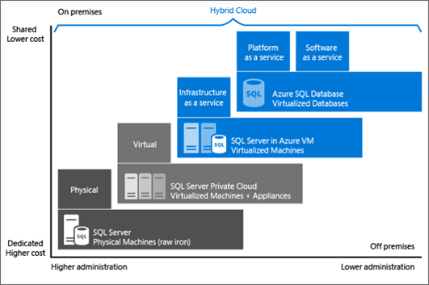
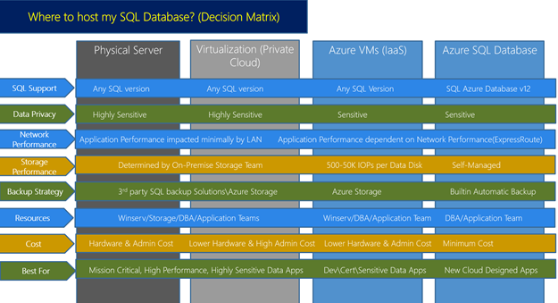

# 一、Azure 上的 SQL 介绍

近年来，我们见证了信息技术如何促进全球企业的增长和发展。主要是科技公司的公司，如亚马逊、脸书和优步，完全建立在信息技术的基础上，发展速度令人难以想象。在当今世界，我们无法想象一个企业没有网站、应用程序或网络存在，但有网站、应用程序或网络存在能保证企业成功吗？在企业成功之前，公司不确定他们在信息技术和信息技术基础设施上的投资是否富有成效。

对于核心业务可能不是 IT 的公司来说，建立和维护网站、应用程序、数据库或数据仓库会产生大量的资本和运营支出([CAPEX](https://en.wikipedia.org/wiki/Capital_expenditure)[OPEX](https://en.wikipedia.org/wiki/Operating_expense))。因此，世界各地的中小型企业都希望云解决方案提供商能够提供信息技术即服务，并且只在他们使用时才付费，同时具有弹性的纵向扩展灵活性。即使是能够负担得起自己的数据中心和基础设施的大型企业也在向云提供商寻求帮助，因为数据正在快速增长，在项目变得至关重要并产生收入之前，为新项目、开发和测试投资新硬件和基础设施可能没有意义。

云服务允许大型企业以优化的成本进行创新和研究，而无需在数据中心的基础设施上进行前期投资。此外，当产品被设计为作为服务运行时，产品发布周期可以是敏捷和快速的。所有这些优势使得云服务成为当今企业极具吸引力的产品和最佳选择。

在本书中，我将向您介绍 Azure 上的 Microsoft SQL Server (RDBMS)产品，并讲述在 Azure 上运行 SQL Server 的用例、注意事项、配置和设计优化，以优化的成本为您提供可预测的性能。为了更好地理解和理解这本书，您应该订阅 Azure Platform。您可以购买 Azure 套餐或注册 [Azure 免费试用套餐。](https://azure.microsoft.com/en-us/pricing/free-trial/)事先了解 Powershell，会更容易理解书中使用的脚本。您可以使用 Windows PowerShell 在 Azure 中执行各种任务，既可以通过命令提示符交互执行，也可以通过脚本自动执行。Azure PowerShell 是一个模块，它提供了通过 Windows PowerShell 管理 Azure 的 cmdlets。您可以通过运行[微软网络平台安装程序](http://go.microsoft.com/fwlink/p/?linkid=320376&clcid=0x409)下载并安装 Azure PowerShell 模块。书中使用的脚本可以从以下位置下载:[https://bitbucket . org/syncfusiontech/SQL-on-azure-简洁地](https://bitbucket.org/syncfusiontech/sql-on-azure-succinctly)。

这本书主要侧重于指导具有 SQL Server 相关知识的个人如何在 Azure 上管理、优化和设计运行 SQL Server 的应用程序。涵盖 SQL Server 管理和管理的基础知识超出了本书的范围。

## 微软 Azure 产品

Azure 是微软的云计算平台，提供一系列集成服务，即分析、计算、数据库、移动、网络、存储和网络。微软正在对 Azure 进行巨额投资，以确保其云产品提供与内部部署或盒装产品相似甚至更好的功能。微软的 Azure 产品主要分为三类:基础设施即服务(IaaS)、平台即服务(PaaS)和软件即服务(SaaS)。下图最好地描述了 IaaS、PaaS 和 SaaS 之间的差异。

图 1:微软的 Azure 产品

Azure 上的 SQL Server 有两种产品:Azure 虚拟机上的 SQL(IaaS)和 Azure SQL 数据库(PaaS)。让我们研究一下这些产品，以及它们与内部同类产品的不同之处。

Azure 虚拟机上的 SQL 服务器(IaaS)

Azure 虚拟机上的 SQL Server 与本地运行的 SQL Server 没有什么不同，除了 SQL Server 将在微软数据中心的虚拟机上运行。Azure 虚拟机支持运行所有支持的本地版本的 SQL Server。这也意味着运行在本地版本的 SQL Server 上的应用程序代码、脚本和监控也可以兼容并轻松迁移到 Azure 虚拟机，反之亦然，只需最少的麻烦和修改。我们将在后面的章节中详细讨论在 Azure 虚拟机中运行 SQL Server 的注意事项，并将其与内部版本进行对比。

蓝色数据库

Azure SQL 数据库是 SQL Server 的数据库即服务产品，是 Azure 中新设计的云服务，适用于云设计的应用程序。在此产品中，数据库是在微软数据中心调配和托管的，您无需担心设置、配置、资源调整、高可用性或 SQL Server 备份。Azure 门户提供了连接到 SQL 数据库的连接字符串，应用程序/数据库管理员使用该字符串来创建模式以及插入、操作、查询或管理数据。当该服务首次推出时，它在功能和特性方面仍在追赶其内部版本，但该服务的最新版本在支持列存储索引、行安全性、查询存储等方面超过了 SQL 2014。Azure SQL 数据库更适合使用横向扩展模式的 SaaS 应用程序。我们将在接下来的章节中更详细地讨论 Azure SQL 数据库的用例场景及其设计考虑。

下表比较了 Azure 虚拟机上的 SQL Server(IaaS)和 Azure SQL 数据库(PaaS)在用例场景、特性和成本方面的差异。可在微软官网以下链接查看:[https://azure . Microsoft . com/en-us/documentation/articles/data-management-azure-SQL-database-and-SQL-server-iaas/](https://azure.microsoft.com/en-us/documentation/articles/data-management-azure-sql-database-and-sql-server-iaas/)。

表 1:比较 Azure SQL 数据库和 Azure 虚拟机中的 SQL 服务器

|  | 蓝色数据库 | Azure 虚拟机中的 SQL Server(IaaS) |
| 最适合 | 新的云设计应用程序，在开发和营销方面有时间限制。SaaS 应用。 | 现有的开发证书和测试环境应用程序，需要快速迁移到云，只需很少的更改，不需要内部非生产性的 SQL Server 硬件。需要通过安全隧道从 Azure 访问内部资源(如活动目录)的 SQL Server 应用程序。使用 Azure 存储上的[备份](http://msdn.microsoft.com/library/jj919148.aspx)或 Azure 虚拟机中的 [AlwaysOn 副本](https://azure.microsoft.com/en-us/documentation/articles/virtual-machines-sql-server-high-availability-and-disaster-recovery-solutions/?rnd=1)快速开发和测试本地 SQL Server 应用程序的灾难恢复场景。 |
| SQL 支持 | 预览版中类似 SQL 的功能。Azure 数据库应该支持应用程序。除非重写应用程序，否则现有环境无法迁移到 Azure 数据库。 | 支持所有 SQL 版本(SQL 2005–SQL 2014)，类似于内部部署功能。现有应用程序可以用最少的编码工作进行迁移。 |
| 尺寸限制 | 数据库大小高达 500 GB。 | 不限数据库大小。 |
| 总拥有成本 | 消除硬件成本。降低管理成本。 | 消除硬件成本。 |
| 业务连续性 | 除了内置的容错基础架构功能之外，Azure SQL 数据库还提供了时间点恢复、地理恢复和地理复制等功能，以提高业务连续性。更多信息参见 [Azure SQL 数据库业务连续性](https://azure.microsoft.com/en-us/documentation/articles/sql-database-business-continuity/)。 | Azure 虚拟机中的 SQL Server 允许您为数据库的特定需求设置高可用性和灾难恢复解决方案。因此，您可以拥有一个针对您的应用程序高度优化的系统。需要时，您可以自己测试和运行故障转移。有关更多信息，请参见[Azure 虚拟机中 SQL Server 的高可用性和灾难恢复](http://msdn.microsoft.com/library/azure/jj870962.aspx)。 |
| 混合云 | 您的内部应用程序可以访问 Azure SQL 数据库中的数据。但是从 SQL 数据库中，您不能访问内部资源 | 使用 Azure 虚拟机中的 SQL Server，您可以让应用程序部分在云中运行，部分在内部运行。例如，您可以通过 [Azure 网络服务](http://msdn.microsoft.com/library/azure/gg433091.aspx)将内部网络和活动域目录扩展到云中。此外，您可以使用[在 Azure 中的 SQL Server 数据文件功能](http://msdn.microsoft.com/library/dn385720.aspx)，在 Azure 存储中存储内部数据文件。更多信息请参见[SQL Server 2016 混合云简介](http://msdn.microsoft.com/library/dn606154.aspx)。 |

## 在 Azure 上运行 SQL Server 的动机

随着在 Azure 产品上添加 SQL，如今企业在混合云环境中运行 SQL Server 有四种选择:

*   物理机上的 SQL Server
*   VMWare 或 Hyper-V 虚拟机上的 SQL Server
*   Azure 上的 SQL Server(IaaS)
*   蓝色数据库

重要的是要了解在 Azure 上运行 SQL Server 的优缺点，以便组织能够决定哪些场景适合在 Azure 上运行 SQL Server，而不是其他解决方案。

下图从基础架构和管理成本方面比较了上述在环境中运行 SQL Server 的选项。可以通过以下链接在微软的网站上查看:[https://azure . Microsoft . com/en-us/documentation/articles/data-management-azure-SQL-database-and-SQL-server-iaas/](https://azure.microsoft.com/en-us/documentation/articles/data-management-azure-sql-database-and-sql-server-iaas/)。

图 2:在 Azure 上运行 SQL Server 的动机

随着我们从物理到虚拟再到 Azure，SQL Server 的基础架构和管理成本降低了。在虚拟机中运行还为我们提供了根据用户工作负载弹性扩展/缩减的灵活性，这在成本方面为我们带来了额外的好处，因为我们只为消耗的资源付费，并且可以在资源不使用时进行扩展或关闭。

弹性向上/向下扩展在工作负载不平衡的应用程序中特别有用，例如在感恩节或节日期间销售额较高的零售店软件。此类工作负载对计算能力提出了更高的要求，服务器需要在适用的时间段内进行扩展。另一个很好的例子是测试或证书服务器，它需要与生产服务器具有同等的容量，以提供准确的应用程序行为，但只需要在测试阶段处于活动状态，并在不使用时缩小或关闭。

在 Azure 上运行 SQL Server 的另一个好处是，设置和配置 SQL Server 或数据库的周转时间更短。Azure SQL Database 的周转时间最快，因为您不需要担心服务器、操作系统、设置或配置，并且在几分钟内就可以调配数据库并接受新的连接。对于 Azure 虚拟机上的 SQL Server，Azure 图库中提供了一些图像，这些图像可以自动执行 SQL Server 的整个安装和配置，从而减少了运行 SQL Server 实例的步骤和时间。

将 SQL Server 工作负载转移到 Azure 的主要动机是:

*   低硬件和数据中心成本。
*   管理成本低。
*   弹性秤。
*   设置和配置的周转时间短。

## 在 Azure 上运行 SQL Server 的注意事项

尽管在 Azure 上运行 SQL Server 可以节省成本并提高效率，但在某些情况下，在 Azure 上运行 SQL Server 可能并不合适。我们将在本节中讨论这些场景。

数据安全

在许多组织中，一些数据库用于存储高度机密的数据或客户个人身份信息(PII)，组织可能不喜欢将其存储在微软数据中心的 Azure 上。有这种安全顾虑的公司可能更喜欢数据驻留在内部服务器上。

**应用亲和力**

对于大多数应用程序，数据库最好与应用程序位于同一局域网或网络附近，以避免任何与网络延迟相关的性能问题。因此，如果应用程序设计为在本地运行，您可能更喜欢在本地运行 SQL Server，以避免网络延迟。大型企业可以建立到微软 Azure 数据中心的快速路由连接，但是它们仍然会产生一些网络延迟，这对于响应时间非常关键的应用程序来说可能已经足够大了。

关键生产工作负载

微软 Azure 是一个共享的多租户环境，通过共享和重用资源来实现成本效益。由于这是一个共享环境，如果主机服务器超额预订或存储通道饱和，有时您可能看不到可预测的性能。如果您对 SQL Server 的性能持批评态度，并且希望获得可预测的性能，那么最好在专用环境中本地运行 SQL Server。这可能涉及更高的成本，但它确保了可预测的性能。

## 在哪里托管我的 SQL 数据库？(决策矩阵)

在了解了在 Azure 上运行 SQL Server 的动机和注意事项后，以下决策矩阵应该可以帮助个人和组织决定将他们的 SQL Server 环境托管在哪里。

图 3: SQL 数据库最佳环境决策矩阵

本章向您介绍了 Azure 中的 SQL Server 产品，并讨论了将 SQL 工作负载转移到 Azure 的动机和注意事项。在接下来的章节中，我们将详细介绍这些产品，并探讨如何在 Azure 中设计应用程序和配置 SQL Server，从而以优化的成本获得最大的收益。