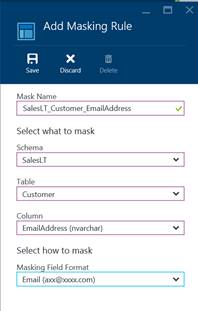
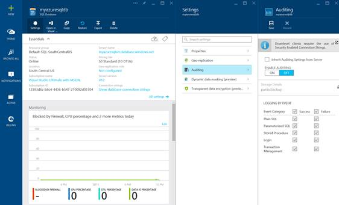
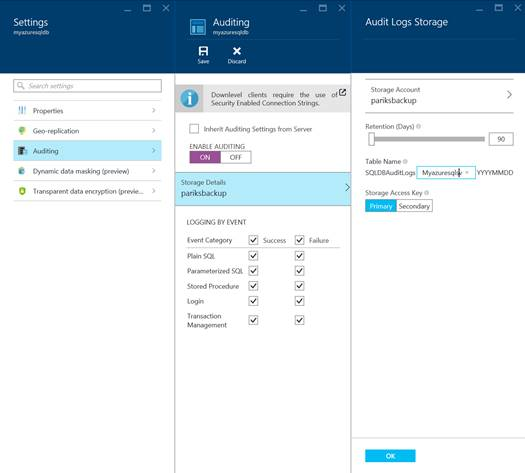

# 九、Azure SQL 数据库中的安全性

在云中托管数据时，安全性是一个重要的考虑因素。Azure SQL 数据库提供身份验证和授权选项来限制对数据库的访问，提供加密来保护静态数据，并提供审计功能来监控数据访问。在本章中，您将了解 Azure SQL 数据库中可用的各种安全功能，以及如何利用它们来保护云中的数据。

## 连接安全性

Azure SQL 数据库通过服务器级和数据库级防火墙限制与服务器和数据库的连接。因此，只有在防火墙规则中明确指定并列入白名单的 IP 地址和地址范围才允许连接到服务器和数据库。这限制了对数据库的任何不必要的访问，并且作为最佳实践，应该在防火墙中仅定义应用服务器或客户端机器的 IP 地址，以允许对数据库的访问。如前所述，您可以使用 Azure 管理门户、PowerShell、T-SQL 和 REST API[配置服务器级防火墙规则](07.html#_Configure_Server-Level_Firewall)和[数据库级防火墙规则](07.html#_Configure_Database-Level_Firewall)。

当数据在数据库之间传输时，Azure SQL 数据库支持网络加密。在应用程序的连接字符串中，您必须指定参数来加密连接，并且不信任服务器证书，否则连接将无法验证服务器的身份，并且容易受到“中间人”攻击。当您从 Azure 管理门户复制连接字符串时，它会自动附加参数来加密连接和不信任服务器证书。对于 ADO.NET 驱动程序，这些连接字符串参数是加密=真和信任服务器证书=假。有关更多信息，请参见 [Azure SQL 数据库连接加密和证书验证](https://azure.microsoft.com/en-us/documentation/articles/sql-database-security-guidelines/)。

## 认证

身份验证是验证用户凭据并在用户凭据合法的情况下允许输入的过程。与支持 Windows 和 SQL 身份验证的盒装版 SQL Server 不同，Azure SQL 数据库目前仅支持 SQL 身份验证。对 Azure 集成广告身份验证的支持可能会在未来出现，但目前只支持 SQL 身份验证。

当您为托管 Azure SQL 数据库调配逻辑服务器时，您需要为服务器管理员指定登录名和密码，该管理员在服务器上充当系统管理员，有权创建或删除数据库，并充当该服务器上托管的所有数据库的 db_owner。负责管理服务器的数据库管理员或个人可以使用这些凭据登录服务器，在服务器上执行管理或管理活动。

但是，作为最佳做法，对于每个应用程序或数据库的非管理员连接，您应该创建一个单独的帐户进行身份验证，以限制授予该帐户的权限，从而在该帐户因任何原因受到攻击时，最大限度地减少攻击面。首选的方法是创建一个包含数据库用户的[，该用户可以由数据库本身进行身份验证，并允许应用程序直接连接到数据库，从而降低了应用程序存在漏洞和代码被破坏时恶意活动或 SQL 注入的风险。](https://msdn.microsoft.com/library/ff929188)

当使用服务器管理员登录连接到用户数据库时，您可以通过执行以下 T-SQL 来创建包含的数据库用户:

代码清单 30:创建一个包含的数据库用户

```sql
      CREATE USER user1 WITH password='<Strong_Password>'

```

强密码是满足以下要求的密码:

*   不包含用户的全部或部分帐户名
*   长度超过八个字符
*   包含以下至少三个类别的字符:

*   英语大写字符(A 到 Z)
*   英文小写字符(a 到 z)
*   以 10 位数为基数(0 到 9)
*   非字母字符(例如:！, $, #, %)

拥有“更改任何用户”权限的任何用户都可以创建其他包含的数据库用户。

## 授权

授权是限制经过身份验证的用户访问的过程，以避免不必要的访问。通过在数据库中提供用户名和密码对用户进行身份验证后，用户将获得数据库中角色和权限的授权。作为最佳实践，您应该始终向具有最少所需权限的用户授予权限。

Azure SQL 数据库提供了以下选项来限制经过身份验证的用户的访问。

### 数据库角色

Azure SQL 数据库中的数据库角色与本地版本的 SQL Server 中可用的数据库角色没有什么不同。每个数据库用户都属于公共数据库角色。当用户未被授予或被拒绝某个安全对象的特定权限时，该用户将继承授予该对象公众的权限。您可以将用户添加到默认可用的任何固定数据库角色或您创建的灵活数据库角色中。您可以通过对要授予用户组的权限进行分组来创建新的灵活数据库角色。

您可以在下面的 MSDN 文章中找到有关数据库角色的更多详细信息:

[https://msdn.microsoft.com/library/ms189121](https://msdn.microsoft.com/library/ms189121)

### 数据库权限

除了为用户创建和授予数据库角色，您还可以为用户授予单独的数据库级权限。Azure SQL 数据库中的数据库权限同样类似于本地版本的 SQL Server 中的权限，并在以下 MSDN 文章中列出:

[https://msdn.microsoft.com/library/ms191291](https://msdn.microsoft.com/library/ms191291)

如果有一组权限要分配给一组用户，那么创建一个数据库角色是有意义的，方法是将权限分配给该角色，然后将用户组分配给新角色。如果用户很少，那么为他们分配粒度权限是有意义的，从而给予他们最不必要的特权。

### 使用存储过程、模拟和模块签名

模拟和模块签名是 SQL Server 中控制访问并安全地允许用户以受控方式临时提升权限的另一种技术。作为安全最佳实践，建议应用程序使用存储过程访问数据。SQL Server 所有权链接允许您撤销或拒绝用户对基础基表的访问，同时仍然允许用户通过存储过程访问数据。当存储过程和基表由同一用户拥有时，所有者链接是可能的。但是，如果它们由不同的用户拥有，您可以在执行存储过程时使用[执行为](https://msdn.microsoft.com/en-us/library/ms188354.aspx)来模拟不同的用户。使用此方法，用户永远无法访问基表，对数据的访问由存储过程执行控制。

模块签名允许您使用证书或非对称密钥对存储过程进行签名。这是为不能通过所有权链继承权限或所有权链被破坏的情况而设计的，例如动态 SQL。然后创建映射到证书的用户，授予证书用户对存储过程需要访问的对象的权限。

执行存储过程时，SQL Server 将证书用户的权限与调用方的权限结合起来。与 EXECUTE AS 子句不同，它不改变过程的执行上下文。返回登录名和用户名的内置函数返回调用方的名称，而不是证书用户名。

数字签名是用签名者的私钥加密的数据摘要。私钥确保数字签名对其持有者或所有者是唯一的。您可以对存储过程、函数或触发器进行签名。

### 行级安全性

行级安全性是微软最近在 Azure SQL 数据库中发布的一项新功能，计划在 SQL 2016 的箱式版本中发布。顾名思义，它允许您控制表中行级别的访问。以前，您可以在数据库中授予或拒绝用户的细粒度访问控制是表级的。因此，如果您不想让用户看到该表中的行子集，您将需要创建一个单独的表或视图，并将对该表或视图的访问权限授予用户，或者从应用层控制安全性。行级安全性有助于简化数据库的物理设计，它允许您将所有数据存储在同一个表中，对行的访问由用户的运行时特征来评估。例如，您可以将所有员工的工资信息存储在一个表中，并只授予员工对其记录的行级访问权限，从而允许他们只查看自己的数据。同样，您可以将所有客户数据存储在一个表中，并授予 customerid 行级访问权限，从而允许客户只看到他们自己的记录。

您可以在下面的 MSDN 文章中找到关于行级安全性实现的更多细节:

[https://msdn.microsoft.com/library/dn765131](https://msdn.microsoft.com/library/dn765131)

### 动态数据屏蔽

Azure SQL 数据库动态数据屏蔽通过向非特权用户屏蔽敏感数据来限制敏感数据暴露。在 Azure SQL 数据库的 V12 版本中，所有服务层的动态数据屏蔽目前处于预览状态。

动态数据屏蔽有助于防止对敏感数据的未授权访问，使开发人员能够指定要泄露多少敏感数据，同时对应用层的影响最小。这是一种基于策略的安全功能，它将敏感数据隐藏在指定数据库字段的查询结果集中，而数据库中的数据不会更改。

例如，呼叫中心支持人员可以通过其社会安全号码或信用卡号码的几个数字来识别呼叫者，但这些数据项不应完全暴露给支持人员。开发人员可以定义要应用于每个查询结果的屏蔽规则，该规则屏蔽结果集中任何社会保险号或信用卡号的最后四位数字以外的所有数字。另一个例子是，通过使用适当的数据掩码来保护个人身份信息(PII)，开发人员可以出于故障排除的目的查询生产环境，而不会违反法规。

您可以使用 Azure 管理门户、PowerShell 或 REST APIs 为数据库设置动态数据屏蔽。

您可以使用以下步骤来配置动态数据屏蔽:

1.  以数据库管理员权限登录 Azure 门户。单击全部浏览>选择 SQL 数据库，然后选择要为其配置动态数据屏蔽的数据库。单击数据库子窗口中的动态数据屏蔽，如下图所示。


图 27:配置动态数据屏蔽

2.  在动态数据屏蔽配置子窗口中，单击添加屏蔽以打开添加屏蔽规则配置子窗口。
3.  选择表和列以定义要屏蔽的指定字段，并选择屏蔽字段格式。在下图中，我们从 SalesLT 模式中选择了 Customer 表，并使用所示的电子邮件屏蔽格式屏蔽了该表的电子邮件地址列。



图 28:为表中的列添加屏蔽规则

4.  单击数据屏蔽规则刀片中的保存，以更新动态数据屏蔽策略中的屏蔽规则集，并键入有权访问未屏蔽敏感数据的特权登录。


图 29:添加屏蔽规则的特权登录

5.  单击数据屏蔽配置子窗口中的保存，保存新的或更新的屏蔽策略。
6.  如果您使用的是下层客户端，则必须更新现有客户端以使用修改后的连接字符串格式。有关更多信息，请参见[下级客户端](https://azure.microsoft.com/en-us/documentation/articles/sql-database-auditing-and-dynamic-data-masking-downlevel-clients/)。

您也可以使用[Set-azure database masking policy](https://msdn.microsoft.com/en-us/library/azure/mt125996.aspx)和[Set-azure database masking rule](https://msdn.microsoft.com/en-us/library/azure/mt126010.aspx)PowerShell cmdlet 来设置数据屏蔽策略和规则。

## 加密

Azure SQL 数据库支持透明数据加密，这是在 SQL 2008 的盒式版本中首次引入的，用于在数据静止或存储在数据库文件和备份中时保护数据。该功能仍处于预览阶段，将很快在大多数 Azure 数据中心区域上线。透明数据加密(TDE)，顾名思义，对应用程序是透明的，不需要应用程序中任何特殊的处理或代码更改。TDE 通过使用称为数据库加密密钥的对称密钥来加密整个数据库的文件。数据库加密密钥受内置服务器证书保护。内置服务器证书对于每个 SQL 数据库服务器都是唯一的。如果数据库处于地理复制关系中，则它在每台服务器上受不同的密钥保护。如果两个数据库连接到同一个服务器，它们共享同一个内置证书。微软至少每 90 天自动轮换一次这些证书。

为了在 Azure SQL 数据库上启用 TDE，您需要以管理员或主数据库中 **dbmanager** 角色的成员身份登录数据库，并执行以下 T-SQL 代码来创建数据库加密密钥并打开数据库加密。

代码清单 31:打开透明数据加密

```sql
      -- Create the database encryption key that will be used for TDE.
      CREATE DATABASE ENCRYPTION KEY
      WITH ALGORITHM = AES_256
      ENCRYPTION BY SERVER CERTIFICATE ##MS_TdeCertificate##;
      -- Enable encryption
      ALTER DATABASE [myazuresqldb] SET ENCRYPTION ON;
      GO

```

有关 TDE 的更多详细信息，您可以参考以下 MSDN 文章:

[https://msdn.microsoft.com/library/dn948096.aspx](https://msdn.microsoft.com/library/dn948096.aspx)

除了 TDE 之外，Azure SQL Database 还支持[列级加密](https://msdn.microsoft.com/library/ms179331.aspx)，使用对称密钥对表中的一列进行加密，以防止对应用程序之外的数据进行任何未经授权的访问。当您不想让数据库管理员或高特权用户看到应用程序外部的数据时，这很有用。

## 审计

审计和跟踪数据库事件可以帮助您维护法规遵从性并识别可疑活动。SQL 数据库审核允许您将数据库中的事件记录到 Azure 存储帐户的审核日志中。SQL 数据库审计还可以与微软 Power BI 集成，以促进深入报告和取证分析。

### 在 Azure SQL 数据库上设置审计

您可以按照本节中描述的步骤为您的 Azure SQL 数据库打开审核:

1.  以数据库管理员权限登录到 Azure 门户，然后单击全部浏览。选择“SQL 数据库”，然后选择要为其配置审核的数据库。单击设置打开设置子窗口。单击“审核”打开审核子窗口，如下图所示。



图 30:在 Azure SQL 数据库上启用审计

2.  在审核配置子窗口中，通过单击打开启用审核后，选择存储详细信息以打开审核日志存储子窗口。选择将保存日志的 Azure 存储帐户和所需的保留期。

|  | 提示:对所有审核的数据库使用相同的存储帐户，以充分利用预配置的报告模板。 |



图 31:为 Azure SQL 数据库配置审计设置

3.  单击确定保存审核日志存储的存储设置。
4.  在按事件记录下，单击成功和失败记录所有事件或选择单个事件类别。
5.  单击“保存”打开对 Azure SQL 数据库的审核。

### 分析审计日志

审计日志被聚合在一组存储表中，这些存储表在您在设置过程中选择的 Azure 存储帐户中带有*SQLDBaudditLogs*前缀。您可以使用工具查看日志文件，如 [Azure 存储资源管理器](http://azurestorageexplorer.codeplex.com/)。

微软产品团队还创建了一个预配置的仪表板报告模板，该模板作为[可下载的 Excel 电子表格](http://go.microsoft.com/fwlink/?linkid=403540&clcid=0x409)提供，帮助您快速分析日志数据。要在审计日志中使用该模板，您需要 Excel 2013 或更高版本以及 Power Query，您可以在此处下载。

模板中有虚构的示例数据，您可以设置超级查询，直接从 Azure Storage 帐户导入审核日志。