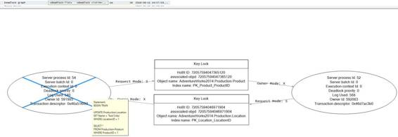

# 七、拦截，锁定和动态管理视图

在本章中，我们将研究三个相对高级的主题:通过从 C#代码中截取 SQL 执行来定制默认行为，围绕 SQL 锁定的问题，以及使用动态管理视图进行性能调优。

使用 C#截取 SQL 并不容易，最好避免。它确实为您提供了对生成的 SQL 的一些低级控制，以及 EF 在执行或已经执行查询时应该采取的附加操作。拦截基于几个接口，最明显的是`System.Data.Entity.Infrastructure.Interception.IDbInterceptor`。

不同的用例有不同的拦截器，例如执行查询(`IDbCommandInterceptor`)、处理事务(`IDbTransactionInterceptor`)和连接(`IDbConnectionInterceptor`)。对于我们的情况，我们需要`IDbCommandInterceptor`，但是我们从基类`DbCommandInterceptor`(实现`IDbCommandInterceptor`)派生。

如你所见，每种方法(`SomethingExecuting`或`SomethingExecuted`)得到一个可操控的`DbCommand`，和一个`DbCommandInterceptionContext`。现在我们可以简单地将`“ OPTION (RECOMPILE)”`连接到任何`SELECT`查询。

代码清单 88:重新编译拦截器

```cs
  public class RecompileInterceptor : DbCommandInterceptor
  {

  public override void ReaderExecuting(DbCommand command, DbCommandInterceptionContext<DbDataReader> interceptionContext)

  {

  base.ReaderExecuting(command,
  interceptionContext);

  AddOptionRecompile(command, interceptionContext);

  }

  public override void NonQueryExecuting(DbCommand command, DbCommandInterceptionContext<int>
  interceptionContext)

  {

  base.NonQueryExecuting(command,
  interceptionContext);

  AddOptionRecompile(command, interceptionContext);

  }

  public override void ScalarExecuting(DbCommand command, DbCommandInterceptionContext<object> interceptionContext)

  {

  base.ScalarExecuting(command,
  interceptionContext);

  AddOptionRecompile(command, interceptionContext);

  }

  private void
  AddOptionRecompile<T>(DbCommand command, DbCommandInterceptionContext<T>
  interceptionContext)

  {

  // DbContexts.Any
  indicates the query is not EF overhead.

  if (interceptionContext.DbContexts.Any()
  &&

  command.CommandText.StartsWith("SELECT", StringComparison.OrdinalIgnoreCase))

  {
              command.CommandText += " OPTION(RECOMPILE)";
          }
      }
  }

```

要使用`IDbInterceptor`，我们可以使用`DbInterception`类。不幸的是，这个类在全球范围内注册`IDbInterceptors`，所以一旦注册，拦截器将用于整个应用程序(包括其他线程)中的每个查询。当然，您也可以注销它们。

代码清单 89:添加一个拦截器

```cs
  RecompileInterceptor interceptor = new RecompileInterceptor();
  DbInterception.Add(interceptor);
  using (CodeFirstContext context = new CodeFirstContext())
  {

  context.Database.Log = Console.Write;

  context.People.Where(p => p.GenderId == 1).ToList();
  }
  DbInterception.Remove(interceptor);
  Console.ReadKey();

```

拦截器是强大的工具。它们可以用于日志记录、附加安全性、取消查询或更改查询等。

当查询运行缓慢时，您可能面临的另一个问题是锁定。我遇到过像`SELECT Field FROM Table WHERE Id = X`这样的查询运行非常慢的情况。我们现在知道这样的查询应该非常快，并且参数嗅探应该不成问题，因为对于 x 的每个值，计划都应该是相同的。很可能这个查询根本没有运行，因为其他一些查询阻止了对指定表的访问。我们可以很容易地模拟这样的场景。首先，我想提醒您，在一个查询窗口中只运行脚本的一部分是可能的。只需选择您想要执行的部分，并执行它。

让我们创建一个阻塞查询。打开一个查询窗口并执行以下操作。

代码清单 90:阻塞查询

```cs
  BEGIN TRAN

  UPDATE Production.Product
  SET Name = 'Adjustable Racer'
  WHERE ProductID = 1

```

SQL Server 锁定了`ProductID` `1`的行。存在不同类型的锁，SQL Server 将根据您的查询来确定最佳锁定策略。例如，不指定`WHERE`子句可能会导致表锁。当某个对象被锁定时，行、页、表和其他对象通常不能访问它。通常，当事务完成时，锁会被解除，但在这种情况下，我们启动了一个事务，并且从未提交或回滚。因此事务将保持打开状态并锁定该行。不过，锁定并不是一件坏事；它防止其他进程查询尚未提交的数据，从而防止脏读。

打开一个新窗口并执行以下查询。

代码清单 91:一个被阻止的查询

```cs
  SELECT *
  FROM Production.Product
  WHERE ProductID = 1

```

您会注意到这个查询将开始执行，并且永远不会完成。它实际上在等待我们的第一个查询完成。

这里有一些修复。首先，我们应该检查为什么我们的第一个查询需要这么长时间才能完成，并看看我们是否可以重写它，以便它更快地完成。其次，我们可以将`TRANSACTION ISOLATION LEVEL`设置为`(READ COMMITTED)` `SNAPSHOT`。这意味着每当 SQL Server 锁定一个资源时，它都会制作该资源的副本，然后在选择数据时使用该副本，因此您的`SELECT`查询不会被阻止，但仍会返回提交的数据。

`SNAPSHOT ISOLATION`不在本书的讨论范围内，但是快速的谷歌搜索无疑会给你提供很多关于这个主题的资源。我将在这里向您展示的解决方案是将`SELECT`查询的`ISOLATION LEVEL`设置为`READ UNCOMMITTED`，这样它将读取未提交的数据。在许多情况下，这是一个很好的解决方案，因为脏读(读取未提交的数据)的机会非常小，脏读甚至可以接受。如果您的`SELECT`查询仍在运行，您可以通过点击**取消执行查询**按钮或使用 Alt + Break 来停止它。或者，您可以返回到`UPDATE`查询窗口，并在那里执行`ROLLBACK TRAN`，从而结束事务并完成`SELECT`查询。如果您决定结束您的事务，请确保为下面的示例再次启动它。

因此，假设您锁定了`ProductID` 1，您可以通过给它`NOLOCK`提示来告诉`SELECT`查询进行脏读。

代码清单 92:带(无锁)的脏读

```cs
  SELECT *
  FROM Production.Product
  WITH (NOLOCK)
  WHERE ProductID = 1

```

如果您有多个语句，并且希望使用脏读来执行它们，您可以设置您的`TRANSACTION ISOLATION LEVEL`来代替。

代码清单 93:读取未提交的脏读

```cs
  SET TRANSACTION ISOLATION LEVEL READ UNCOMMITTED

  SELECT *
  FROM Production.Product
  WHERE ProductID = 1

```

两个查询都将立即返回，即使您的另一个事务仍在运行。但是，两个查询都将返回`Name` `Adjustable Racers`，这还没有提交。现在，回滚你的`UPDATE`查询，再也没有人能得到`Adjustable Racers`了。

连接字符串通常定义了超时(默认值为 30 秒)。这意味着当一个查询从 C#开始，需要超过 30 秒才能完成，或者被阻塞至少 30 秒，你会得到一个`TimeoutException`。

当一个事务正在等待另一个事务，然后另一个事务请求被第一个事务锁定的资源时，就会出现死锁。死锁的概念应该是程序员所熟悉的，因为多线程应用程序可能会遇到同样的问题。

让我们假装僵局。打开一个查询窗口并执行以下查询。

代码清单 94:一个锁定查询

```cs
  BEGIN TRAN

  UPDATE Production.Product
  SET Name = 'Adjustable Racer'
  WHERE ProductID = 1

```

现在打开另一个查询窗口，让它等待打开的事务，并锁定另一个资源。

代码清单 95:一个锁定和等待查询

```cs
  BEGIN TRAN

  UPDATE Production.Location
  SET Name = 'Tool Cribs'
  WHERE LocationID = 1

  SELECT *
  FROM Production.Product
  WHERE ProductID = 1

```

回到第一个窗口，交易还开着，请求`LocationID` `1`，已经锁定。

代码清单 96:死锁随之而来

```cs
  SELECT *
  FROM Production.Location
  WHERE LocationID = 1

```

两个查询窗口之一现在应该会返回一个错误:`Msg 1205, Level 13, State 51, Line 7`

`Transaction (Process ID 54) was deadlocked on lock resources with another process and has been chosen as the deadlock victim. Rerun the transaction.`

该查询的事务会自动回滚。在另一个窗口，可以手动执行`ROLLBACK TRAN`。

您可以使用 SQL Server 事件探查器跟踪锁和死锁。打开一个新的会话，取消选择所有事件，选择**锁定**下的**死锁图形**事件。如果你重复前面的步骤，你会得到一个事件和一个图表。它应该如下所示。



图 31:死锁图

椭圆形是死锁中涉及的查询，矩形是被锁定和请求的对象。死锁图会变得非常复杂，有几十个椭圆形和矩形。

我们已经看到了两种固定锁的方法，也可以固定死锁:使用`SNAPSHOT ISOLATION`，将`ISOLATION LEVEL`降低到`READ UNCOMMITTED`。另一种防止死锁的方法是总是以相同的顺序访问数据库对象。不幸的是，这并不总是容易的，甚至不可能。尝试保持事务短，以便最小化(死)锁定的机会。

更多地了解如何掌握查询、计划和其他数据可能非常有用。SQL Server 拥有所谓的动态管理视图。数据库的结构、表、过程以及数据库中的几乎所有内容都存储在这些视图中。例如，以下查询列出了数据库中的所有表(两次)。

代码清单 97:列出所有表格

```cs
  SELECT * FROM sys.tables
  SELECT * FROM INFORMATION_SCHEMA.TABLES

```

您可以在对象浏览器中的**视图**下找到视图，然后是**系统视图**。你会发现被称为`sys.something`的视图和一些`INFORMATION_SCHEMA.SOMETHING`视图。`INFORMATION_SCHEMA`视图是国际标准化组织的标准，理论上，在您的查询中使用它们应该可以使它们在甲骨文、MySQL 或任何其他符合国际标准化组织标准的 SQL 数据库中工作。大约有二十辆`INFORMATION_SCHEMA`dmv，以及(我猜)一百多辆`sys`dmv，所以你只需选择`sys`视图，因为它们拥有你所需要的一切。

在 dmv 旁边，还有系统 SPs 和功能。可以在**可编程** > **存储过程** > **系统存储过程** > **可编程** > **功能** > **系统功能**下找到。你可以简单地滚动浏览并试用它们。你可能会发现你已经使用了很多功能，比如`CAST`、`MAX`和`CURRENT_TIMESTAMP`。

让我们转到好的方面。我们在谈论查询计划。有一个名为`sys.dm_exec_cached_plans`的视图，它有一个所有缓存计划的列表。不过，其中的数据有点神秘。以目前的形式来看，它对我们毫无用处。


图 32: sys.dm_exec_cached_plans

然而`plan_handle`非常有用。一旦我们知道它实际属于哪个计划和查询，我们就需要这个。我们可以通过函数`sys.dm_exec_query_plan`得到实际的计划，该函数以一个`plan_handle`为参数。出于某种原因，这也会返回数据库标识，如果我们想对数据库进行过滤，这很好(我们会这样做，因为它也有主数据库的计划)。

现在我们有了`plan_handle`和`query_plan`，我们想要实际的查询。这是另一个函数，叫做`sys.dm_exec_sql_text`，也有一个`plan_handle`作为输入参数。我们现在也有了`text`和数据库标识。我们可以使用`DB_ID(database_name)`从数据库名称中获取数据库标识。

代码清单 98:列出查询计划

```cs
  SELECT cp.plan_handle, qp.query_plan, st.[text]
  FROM sys.dm_exec_cached_plans
  cp
  CROSS APPLY sys.dm_exec_query_plan(cp.plan_handle) AS qp
  CROSS APPLY sys.dm_exec_sql_text(cp.plan_handle) AS st
  WHERE qp.[dbid] = DB_ID('AdventureWorks2014')

```

现在这里有一个最奇特的事情:打开一个新的查询窗口，运行`DBCC FREEPROCCACHE`。取下它，在同一个窗口中，运行`SELECT * FROM Person.Person`(或任何你喜欢的)。再次清空查询窗口，运行`SET ARITHABORT OFF`。清除查询窗口，再次运行`SELECT * FROM Person.Person`。现在列出查询计划，你会看到`SELECT * FROM Person.Person`被列出了两次！但这怎么可能呢？查询计划不是重用的吗？

SQL Server 重用查询计划，但前提是查询完全相同，并且某些设置也相同。`ARITHABORT`是一个设置，如果该设置值与当前存储的计划不同，将触发 SQL Server 创建新计划。可以使用功能`sys.dm_exec_plan_attributes`检索这些设置。有很多属性，它们的值一起存储在一个值中，所以完全不可读。对我们来说幸运的是，SQL Server MVP Erland Sommarskog 已经写了一篇相当长(但非常好和详细)[的文章](http://www.sommarskog.se/query-plan-mysteries.html)关于这个现象。这一部分在他的“不同设置的不同计划”部分尤其相关。我将使用他的技巧在一行中获得所有这些属性；你可以阅读他的博客来理解这一切。

代码清单 99:列出计划属性

```cs
  SELECT cp.plan_handle, qp.query_plan, st.[text], attrlist
  FROM sys.dm_exec_cached_plans
  cp
  CROSS APPLY sys.dm_exec_query_plan(cp.plan_handle) AS qp
  CROSS APPLY sys.dm_exec_sql_text(cp.plan_handle) AS st
  CROSS  APPLY (SELECT epa.attribute
  + '=' + convert(nvarchar(127), epa.value) + '   '
                FROM   sys.dm_exec_plan_attributes(cp.plan_handle) epa
                WHERE  epa.is_cache_key
  = 1
                ORDER  BY epa.attribute
                FOR    XML PATH('')) AS a(attrlist)
  WHERE qp.[dbid] = DB_ID('AdventureWorks2014')

```

这里的要点是，SQL Server 基于某些设置创建一个计划。`ARITHABORT`也是非常讨厌的一个。当您从 C#代码运行查询时，无论是通过 ADO.NET 还是实体框架，`ARITHABORT`默认设置为`OFF`。但是，如果在 SQL Server 中运行查询，`ARITHABORT`默认为`ON`。因此，每当您的应用程序由于某些查询而运行缓慢，并且您在 SSMS 运行查询时，它可能会快如闪电—它会创建一个新计划，因为`ARITHABORT`设置不同。多年来我一直在黑暗中跌跌撞撞，对此一无所知！

现在，您已经知道如何获取单个查询的查询计划，也可以从缓存中删除该计划。我们已经使用`DBCC FREEPROCCACHE`从缓存中删除了所有计划，但是您可以使用`plan_handle`仅删除那一个计划。抓住把手递给`DBCC FREEPROCCACHE`。

代码清单 100: DBCC FREEPROCCACHE

```cs
  DBCC FREEPROCCACHE (0x060007003A0E5604409D13610400000001000000000000000000000000000000000000000000000000000000)

```

我们可以使用的另一个车管所是`sys.dm_tran_locks`。它向锁管理器显示当前活动的请求。此外，`sys.dm_os_waiting_tasks`显示当前正在等待锁资源的所有会话。因此，将两者结合起来，我们得到了当前等待获取锁的会话以及锁信息。

代码清单 101:列出被阻止的会话

```cs
  SELECT *
  FROM sys.dm_tran_locks tl
  JOIN sys.dm_os_waiting_tasks
  AS owt ON tl.lock_owner_address =
  owt.resource_address

```

目前最有意思的栏目是`dm_tran_locks`中的`request_session_id`(应该对应`dm_os_waiting_tasks`中的`session_id`)和`dm_os_waiting_tasks`中的`blocking_session_id`。我们可以使用这些列从`sys.dm_exec_connections`获取关联的会话。

代码清单 102:列出被阻止的连接

```cs
  SELECT *
  FROM sys.dm_tran_locks tl
  JOIN sys.dm_os_waiting_tasks
  AS owt ON tl.lock_owner_address =
  owt.resource_address
  JOIN sys.dm_exec_connections
  ec_waiting ON ec_waiting.session_id = tl.request_session_id
  JOIN sys.dm_exec_connections
  ec_blocking ON ec_blocking.session_id = owt.blocking_session_id

```

`dm_exec_connections`视图有一列`most_recent_sql_handle`。这是会话执行的最后一个查询，并且必须是当前阻塞和等待的查询。我们已经看到了如何从`sql_handle`获取查询文本和计划，所以我们也可以在这里应用它。此外，在某些分区上请求锁，如`dm_tran_locks`中的`resource_associated_entity_id`所示。分区属于一个对象，所以这是我们获取对象标识的地方，然后我们可以使用它来获取对象名称。如果我们过滤掉一些字段，我们会得到一个实际上非常易读的结果表。

代码清单 103:列出被阻止的查询

```cs
  SELECT tl.request_session_id
        ,owt.blocking_session_id
        ,tl.resource_type
        ,waiting_text.[text]
  AS WaitingText
        ,blocking_text.[text]
  AS BlockingTest
        ,OBJECT_NAME(p.object_id) AS ObjectName
  FROM sys.dm_tran_locks tl
  JOIN sys.dm_os_waiting_tasks
  AS owt ON tl.lock_owner_address =
  owt.resource_address
  JOIN sys.dm_exec_connections
  ec_waiting ON ec_waiting.session_id = tl.request_session_id
  JOIN sys.dm_exec_connections
  ec_blocking ON ec_blocking.session_id = owt.blocking_session_id
  CROSS APPLY sys.dm_exec_sql_text(ec_waiting.most_recent_sql_handle)
  AS waiting_text
  CROSS APPLY sys.dm_exec_sql_text(ec_blocking.most_recent_sql_handle)
  AS blocking_text
  JOIN sys.partitions p ON p.hobt_id = tl.resource_associated_entity_id

```


图 33:当前被阻止的查询

如果你认定拦网者不如服务员重要，或者拦网者突破太多，只要你愿意，你可以轻松干掉拦网者。

代码清单 104:列出并终止一个会话

```cs
  EXEC sp_who -- Lists all sessions.
  EXEC sp_who2 -- Lists all sessions+.

  KILL 54 -- Kill a session.

```

当试图解决问题时，dmv 是一个无价的工具。不幸的是，它们有很多，当你不知道到底发生了什么的时候，大多数都没有意义。皮纳尔·戴夫是一个知道发生了什么的人，他给了我和我的同事很多帮助。我从未见过他本人，但幸运的是，他在自己的[博客](http://blog.sqlauthority.com/)中分享了他的知识。毫无疑问，你已经见过他了——他是(自称的)SQL 权威。希望下一次您对一些查询进行故障排除时，您知道该怎么做。

|  | 提示:我们已经看到了各种方法来找出您的 SQL Server 数据库中发生了什么。另一种查看情况的方法是使用活动监视器。它显示处理器时间、等待、输入/输出和最近昂贵的查询。它没有本章中列出的方法详细，但是给出了数据库性能的整体情况。要打开它，只需在对象资源管理器中右键单击您的实例，然后从上下文菜单中选择活动监视器，或者单击顶部菜单上的活动监视器。 |