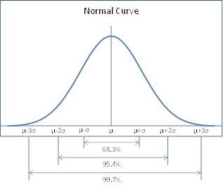
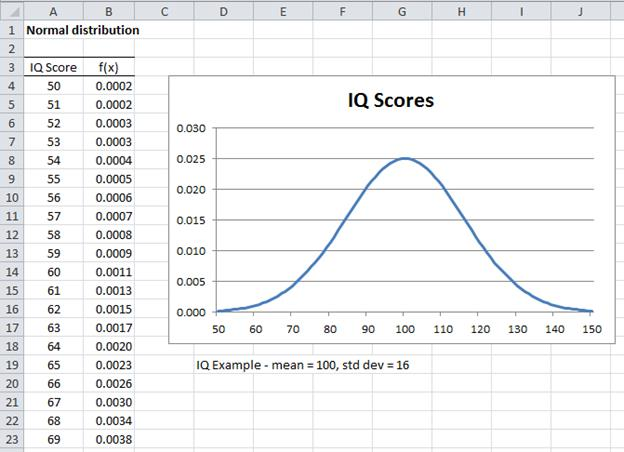
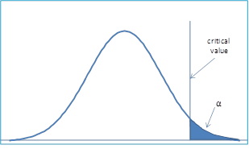
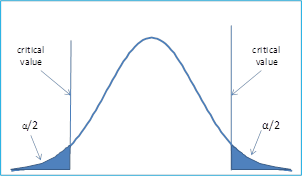

# 五、正态分布

## 正态分布

### 基本概念

**正态分布**的概率密度函数定义如下:

其中 e 是常数 2.7183...，π是常数 3.1415…

正态分布完全由参数μ和σ决定。结果表明，μ是正态分布的均值，σ是标准差。

正态分布图具有钟形曲线的形状，如图 25 所示:

图 25:正常曲线

正态分布的一些特征如下:

*   平均值=中值=模式= μ
*   标准偏差= σ
*   偏斜度=峰度= 0

该函数关于均值对称，在处有拐点(即曲线从上凹变为下凹，或从下凹变为上凹的点)

从图 25 可以看出，区间内曲线下面积约为曲线下总面积的 68.26%。区间的曲线下面积约为曲线下总面积的 95.44%，区间的曲线下面积约为曲线下面积的 99.74%。

正如我们将看到的，正态分布经常出现，在统计学中非常有用。

### Excel 函数

Excel 提供了以下关于正态分布的函数:

**NORM。DIST** (x，μ，σ，cum)，其中 cum 取值真和假

NORM。DIST(x，μ，σ *，*假)=均值为μ、标准差为σ的正态分布在 x 处的概率密度函数值

NORM。DIST(x，μ，σ *，*真)=均值为μ、标准差为σ的正态分布在 x 处的累积概率分布函数值

**NORM。INV** (p *，* μ，σ)是 NORM 的倒数。DIST(x，μ，σ，真)，即，

NORM。INV(p，μ，σ) =值 x，这样 NORM。DIST(x，μ，σ，真)= p

这些功能在 Excel 2010 之前的版本中不可用。相反，这些版本的 Excel 提供了相当于 NORM 的 **NORMDIST** 。DIST 和 **NORMINV** ，相当于 NORM.INV。

### 示例

使用[斯坦福-比奈智力量表](http://www.stanfordbinet.net/)创建智商分数分布图。

已知这种分布具有均值为 100、标准差为 16 的正态分布。要创建图表，我们首先必须创建一个表，其中包含 = 50，51，…，150 的概率密度函数的值。该表如图 26 左侧所示:

图 26:智商分数的分布

我们只显示了前 20 个条目，但总共有 101 个条目占据了 A4:B104 的范围。列 B 中的值是使用 NORM 计算的。DIST 函数。例如，单元格 B4 中的公式为:

=NORM。DIST(A4，100，16，假)

我们可以通过突出显示 B4:B104 范围，然后选择**插入>图表|直线，在图 26 的右侧绘制图表。**图表的显示可以按照本书其他地方的描述进行改进。

### 标准正态分布

**标准正态分布**是均值为 0、标准差为 1 的正态分布。

要将具有均值μ和标准差σ的正态分布的随机变量转换为标准范式，可以使用以下线性变换:

由此产生的随机变量被称为 **z 分数**。Excel 提供以下函数从、μ和σ计算的值:

**标准化** (  ) = 

此外，Excel 提供了以下关于标准正态分布的函数:

**标准. S.DIST** (z，cum) =标准. DIST(z，0.1，cum)

**NORM。S.INV** (p) = NORM。INV(p，0，1)

这些功能在 Excel 2010 之前的版本中不可用。相反，这些版本的 Excel 提供了相当于 NORM 的 **NORMSDIST** (z)。S.DIST(z，真)和**诺姆西夫** (p)，相当于诺姆。证券投资部(p)。对于 pdf，公式等同于 NORM。S.DIST(z，FALSE)是 NORMDIST(z，0，1，FALSE)。

### 对数正态分布

随机变量为**对数正态分布**假设、的自然对数正态分布。

注意对数正态分布不是对称的，而是向右倾斜的。如果您有符合对数正态分布的向右倾斜的数据，您可能能够访问本书其他地方描述的需要数据正态分布的各种测试。

Excel 提供以下两个功能:

**LOGNORM。DIST** (x，μ，σ *，* cum) =均值μ和标准差σ在 x 处的对数正态累积分布函数如果 cum = TRUE，即 NORMDIST(LN(x)，μ，σ，cum)，以及对数正态分布的概率密度函数如果 cum = FALSE。

**LOGNORM.INV** (p，μ，σ) = EXP(NORM.INV(p，μ，σ))

这些功能在 Excel 2010 之前的版本中不可用。相反，这些版本的 Excel 提供了相当于 LOGNORM 的 LOGNORMDIST(x，μ，σ)。DIST(x，μ，σ，真)和 **LOGINV** (p，μ，σ)，相当于 LOGNORM。INV(p，μ，σ)。

## 样本分布

### 基本概念

考虑一个来自人群的随机样本。如前所述，样本的平均值(称为**样本平均值**)定义为:

可以认为是一个代表实际样本平均值的数字，但也可以认为是一个代表总体中任何 n 个样本平均值的随机变量。

如果是来自具有均值μ和标准差σ的总体的随机样本，那么结果是随机变量的均值是μ，的标准差是。

当总体正常时，我们有以下更强的结果，即样本均值正态分布，均值μ和标准差。

### 中心极限定理

假设 n 足够大(通常约为 30 或更大)，即使样本不是来自正态分布的群体，样本均值也近似正态分布，具有均值μ和标准差。

这个结果被称为**中心极限定理**，是统计学中最重要、最有用的结果之一。

### 假设检验

我们现在用下面的例子简单介绍**假设检验**的概念。

**例**:一家销售电机的公司声称其电机的平均寿命至少为 120 个月。它的一个客户想通过测试随机抽样的 48 台电机来验证这一说法，如图 27 中的范围 A3:F10 所述。公司的说法正确吗？

图 27:平均值的单样本测试

我们首先注意到样品中电机的平均寿命为 125.9375，超过 120 个月。但是这是一个**统计上有意义的**结果还是仅仅由于偶然？请记住，即使公司的声明是错误的，任何给定的样本都可能具有大于 120 个月的平均值。

现在，让我们假设电机总数分布为均值μ和标准差σ。为了进行分析，我们首先将**零假设**定义如下:

h<0:μ<120

因此，零假设(称为**替代假设**)的补充是:

H 1 : μ ≥ 120

通常在分析中，我们实际上是通过测试是否拒绝零假设来测试替代假设的有效性。当进行这样的分析时，我们有可能得出错误的结论。有两种类型的**错误**:

*   **I 型**–H0被拒绝，即使是真的(**假阳性**)
*   **II 型**–H0即使是假的也不会被拒绝(**假阴性**)

第一类错误的可接受水平(称为**显著性水平**)由**α**(α)指定，而第二类错误的可接受水平由**β**(β)指定。

通常，使用α = .05 的显著性水平(尽管有时也可以使用其它水平，例如α = .01)。这意味着我们愿意容忍高达百分之五的第一类错误，也就是说，我们愿意接受这样一个事实，即在每 20 个样本中有 1 个样本中，我们拒绝零假设，即使它是真的。

对于我们的分析，我们使用中心极限定理。由于样本量足够大，我们可以假设样本均值具有正态分布，均值μ和标准差，如图 28 所示:

图 28:右尾临界区

请记住，该曲线代表样本平均值的所有可能值的分布。我们需要根据观察到的样本平均值 125.9375 进行测试。

分析的下一步是在假设零假设为真的情况下，确定观测样本平均值为 125.9375 或更高的概率。如果这个概率很低(即小于α)，那么我们将有理由**拒绝**无效假设。否则，我们不会拒绝零假设(也称为**保留**零假设)。

保留零假设并不等于假设它是真的。这仅仅意味着基于一个观察到的样本，我们没有足够的证据拒绝它。

**p 值**(即**概率值**)是用于检验零假设的统计量的 p 值。如果 p < α，那么我们拒绝零假设。对于我们的问题，p 值是在假设零假设为真的情况下，观测样本平均值为 125.9375 或更高的概率。这与在所谓的**单尾测试**中测试 p 值是否落在图 28 的阴影区域(即**临界区域**)相同。

我们示例的 p 值在图 28 的单元格 I8 中计算。由于 p 值= .042998 < .05 = α，我们看到观测值确实落在临界区，因此我们拒绝零假设。因此，我们可以证明我们有足够的理由接受该公司的说法，即他们的电机平均至少可以使用 120 个月。

注意，总体标准差σ未知。对于图 28 所示的分析，我们假设样本标准差是总体标准差的良好估计。对于足够大的样本，这是一个合理的假设，尽管它会引入额外的误差。在第 6 章中，我们展示了如何使用 t 分布执行相同类型的分析，而不必做这样的假设。

为了解决这个问题，我们还可以使用 Excel 的 **Z.TEST** 函数(对于 Excel 2010 之前的版本，称为 **ZTEST** )。参见图 27 中的单元格 I10。

**Z.TEST** (R，)= 1–NORM。DIST( ，真)，其中 =平均值(R) =范围内数据的样本平均值，而 =计数(R) =样本大小。第三个参数是可选的。省略时，用 R 的样本标准差值代替；即 Z.TEST(R， ) = Z.TEST(R，)，STDEV。S(R))。

我们做最后一个观察。如果我们试图检验零假设 H 0 : μ = 120，那么替代假设将变成 H 0 : μ ≠ 120。在这种情况下，我们将有两个关键区域，我们将拒绝零假设，如图 29 所示:

图 29:双尾假设检验

这叫做**双尾测试**，比单尾测试更常用。