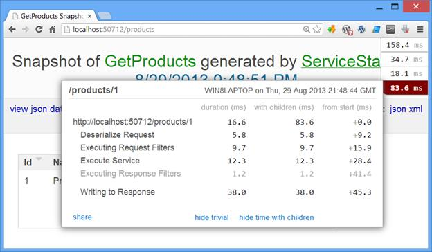
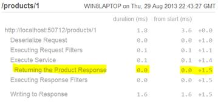

# 十、性能分析

ServiceStack 的另一个内置功能是探查器。分析信息最常见的用途是帮助发现瓶颈，显然还有助于应用程序优化。使用 profiler，我们能够找出执行特定操作或一系列操作所需的时间。

在内部，ServiceStack 使用了一个略有变化的 MVC MiniProfiler 版本，[<sup>【30】</sup>](SS_0016.xhtml#_ftn30)，该版本适合 ServiceStack 的需求。MiniProfiler 本身提供了对 OrmLite 的支持，这使您能够看到实际数据库查询的时间。我们稍后会看到这个。

## 开始使用探查器

开始使用探查器很容易。唯一需要做的是`Start`为每个请求分析分析器，并在请求结束时`Stop`分析分析器。为了限制探查器的输出，我们可能会指定仅在从同一位置发出请求时才启动探查器(通常，我们在调试或开发过程中需要进行探查)。

下面的代码示例显示了如何在 **Global.asax.cs** 文件中启动和停止探查器。

```cs
    protected void Application_BeginRequest(object sender, EventArgs e)
    {
        if (Request.IsLocal)
        {
            Profiler.Start();
        }
    }

    protected void Application_EndRequest(object sender, EventArgs e)
    {
        Profiler.Stop();
    }

```



图 19:剖析器

在浏览器中运行应用程序时，我们可以直接看到(并在右上角展开)与当前请求相关的统计信息。

关于`Service`方法本身的序列化、反序列化和实际执行时间，可以看到非常有趣的统计数据。

## 分析表单精简查询

可以分析由 OrmLite 提供程序执行的实际查询。

为了做到这一点，我们需要提供`ConnectionFilter`，这将使`Profiler`能够附加到查询执行中。

下面的代码展示了如何实例化一个新的`OrmLiteConnectionFactory`。

```cs
    var connString = "Data Source=…;Initial Catalog=..;User ID=..;password=..";

    var factory = new OrmLiteConnectionFactory(
        connString, SqlServerOrmLiteDialectProvider.Instance)
        {

              ConnectionFilter = x =>  ProfiledDbConnection(x, Profiler.Current)

```

};

当执行查询时，我们可以在浏览器中看到类似下图的内容，其中我们可以看到每个执行的 SQL 查询的时间。


图 20:概要 SQL 查询

## 定义自定义步骤

也可以通过给出一个标签来定义我们自己的步骤，该标签将显示在我们已经看到的输出中。为此，我们需要使用`Profiler.Step()`方法，如下面的代码示例所示。

```cs
    public ProductResponse Get(GetProduct request)
    {
        using (Profiler.Current.Step("Returning the Product Response"))
        {
            //....
        }
    }

```

在输出中，我们可以看到“返回产品响应”与执行时间一起显示。



图 21:使用自定义步骤进行分析