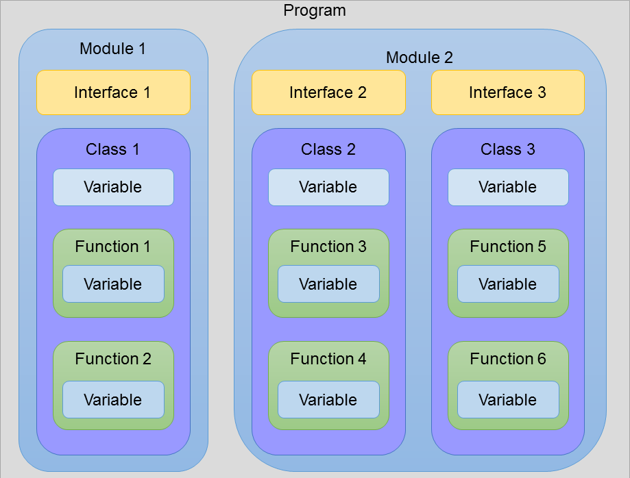
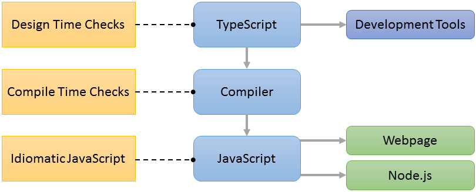

# 一、TypeScript 中的概念

## 代码组织

我将从画一些相似之处开始。NET 和 TypeScript 的代码组织和语言特性。在某些情况下，约定几乎是相同的，但是在命名约定和用于组成应用程序的各种组件的含义方面也有一些有趣的区别。

图 1 展示了一个 TypeScript 程序的结构，它被组织成许多模块，每个模块包含接口、类和变量。每个模块应该将相关的类组合在一起，并且应该对程序中的其他模块具有最小的依赖性。虽然您可以在 TypeScript 中创建多方向依赖和循环依赖，但我建议您避免这样做，因为这会使您的程序更难维护。

这种程序结构允许您将面向对象的编程技能付诸实践，并使使用通用设计模式来组织程序变得容易。

我将在本书中使用 TypeScript 命名约定，但是当我使用术语*函数*时，请随意阅读*方法*，例如，如果这是您更习惯的。

图 1:一个打字脚本程序

## TypeScript 词汇表

### 程序

TypeScript 程序是源文件的集合。这些源文件中的大多数将包含您的代码实现，但是它们也可以包含向外部代码添加静态类型的声明。我将在[第 4 章“创建新模块”](04.html#sigil_toc_id_43)中讨论编写您自己的代码，并在[第 6 章“使用现有的 JavaScript”中讨论使用现有的代码和第三方库](06.html#sigil_toc_id_82)

您可以将您的程序视为两种类型的脚本。ts 文件和编译后的 JavaScript。js 文件。

### 模块

TypeScript 模块类似于。NET 命名空间，并且可以包含许多类和接口。模块的结构可以从非常扁平的结构变化到高度嵌套的结构，这取决于您正在编写的程序的类型。

### 界面

TypeScript 中的接口工作方式完全类似。NET 接口，允许开发工具和编译器在类未能正确实现接口时发出错误。因为接口的存在仅仅是为了设计时工具和编译器的利益，所以不会从 TypeScript 接口生成任何 JavaScript 代码。

一个 TypeScript 接口可以扩展多个接口。

### 类

TypeScript 类类似于. NET 类，可以包含具有不同可见性级别的函数和变量。在 TypeScript 中，您可以在函数和变量上使用``public`` 和``private`` 可见性关键字。TypeScript 类可以扩展一个类并实现多个接口。

### 功能

TypeScript 函数类似于. NET 方法，接受参数并返回类型化值或 void。这就是真正的逻辑将存在于你的程序中的地方。

### 变量

在 TypeScript 中，所有属性和字段都是变量，但可以选择键入。默认情况下，这些变量的行为方式与。NET 使用``var`` 关键字，因为编译器将尝试推断类型，然后将变量视为静态类型。在无法推断类型的情况下，编译器不会像在中那样显示错误。NET，而是将变量视为动态类型，在 TypeScript 中用``any`` 关键字表示。我将在[第三章“类型安全”中更详细地讨论这一点](03.html#sigil_toc_id_18)

### 计数

TypeScript 中的枚举类似于。NET 枚举。0.8 版 TypeScript 中的实验性实现在 0.9 版中略有修改。

### 范围

因为函数、类和模块被编译成各种风格的 JavaScript 函数，所以嵌套在其中的所有内容都是本地范围的，并且将享受 JavaScript 词法范围的好处。这意味着嵌套函数可以访问自己的变量以及外部函数中的变量。如果本地作用域中不存在变量，JavaScript 运行时将沿着链向上寻找外部函数中的变量，如果那里不存在变量，它将继续下一级。这一直持续到 JavaScript 检查全局范围。

## 编译

TypeScript 在编译时转换为 JavaScript。JavaScript 是 ECMAScript 标准的一种实现，而且它不是唯一的实现——ActionScript 是另一种基于 ECMAScript 标准的知名语言。在处理 TypeScript 时，您会遇到三个版本的 ECMAScript。

### ECMAScript 3

ECMAScript 3 发布于 1999 年，是大多数浏览器都支持的版本。当 TypeScript 编译成 JavaScript 时，默认使用 ECMAScript 3 标准。当以 ECMAScript 3 为目标时，TypeScript 中有极少数功能不可用，例如属性获取器和设置器，但它为您的程序提供了尽可能广泛的支持。

如果您试图使用一个在您的 ECMAScript 目标版本中不可用的功能，编译器将警告您要么避免该功能，要么更改目标版本。我在[第 2 章“Visual Studio”中包含了如何定位 ECMAScript 5 的说明](02.html#sigil_toc_id_13)

### ECMAScript 5

ECMAScript 5 于 2009 年发布，所有现代浏览器都支持它。您可以指示 TypeScript 编译器以 ECMAScript 5 为目标，这使得额外的语言功能可用，但是您的程序在旧浏览器中可能会遇到问题。以下浏览器支持 ECMAScript 5 的所有重要功能；这些浏览器的旧版本仅部分支持:

*   Internet Explorer 9 及以上版本。
*   火狐 4 及以上版本。
*   歌剧 12 及以上。
*   Safari 5.1 及以上版本。
*   Chrome 7 及以上。

### ECMAScript 6

ECMAScript 6，也称为 ECMAScript Harmony，目前正在起草中，在一些最新的浏览器中有实验性的支持。这个版本很有趣，因为它将使模块和类成为 JavaScript 语言的一部分。TypeScript 让您可以在几乎所有浏览器中立即访问这些提议的新功能。在未来的某个时候，您将能够从 TypeScript 中瞄准 ECMAScript 6 标准，这将意味着编译后的 JavaScript 将与您的 TypeScript 代码更加匹配。

ECMAScript 6 目前没有计划发布日期，也不支持 TypeScript 语言中的所有概念。

### TypeScript 生命周期

TypeScript 生命周期由三个不同的阶段组成。当您编写 TypeScript 代码时，您将与正在使用的任何开发工具一起参与设计阶段。编译器代表第二个阶段，将 TypeScript 转换为 JavaScript，并引发它发现的错误和警告。最后一个阶段是运行时执行生成的 JavaScript。

图 2:TypeScript 生命周期