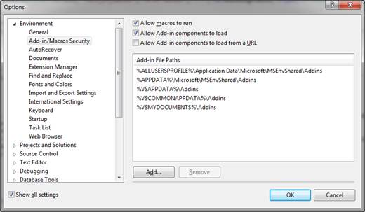
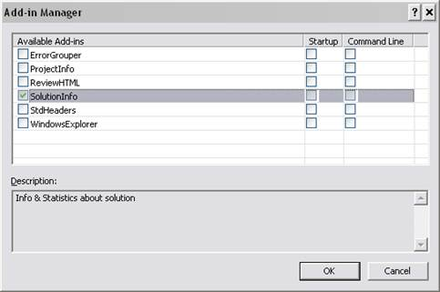

# 十六、部署附加程序

一旦您开发的附加程序模块完成、调试并准备就绪，您可能会希望与您的开发伙伴共享它。在本章中，我们将介绍安装附加程序以及通过附加程序管理器与附加程序进行交互需要做些什么。

## 安装插件

要安装附加程序，您需要将两个文件复制到 Visual Studio 查找附加程序模块的一个文件夹中。这通常是 Visual Studio 2010 中的**\ Documents \ Visual Studio 2010 \ Addins \**，或者是 Visual Studio 2012 中的**\ Documents \ Visual Studio 2012 \ Addins \**。您也可以在 Visual Studio 的**选项**对话框中的**环境**节点的**附加程序/宏安全性**页面下查看**附加程序文件路径**列表。

图 17:安装附加程序

|  | 提示:如果未显示“附加程序/宏安全性”页面，您可能需要选择“显示所有设置”。 |

如果复制程序集 DLL 文件和。将 XML 文件添加到此文件夹中，Visual Studio 将发现它，并可能在下次启动 Visual Studio 时加载它。(The。附加程序 XML 文件有选项来控制附加程序的时间。详见[第六章](06.html#_Chapter_6_)。)

## 附加程序管理器

**插件管理器**是**工具**菜单下的一个工具窗口，可以让你与所有 IDE 安装的插件进行交互。您可以在加载附加程序时进行更改，也可以禁用附加程序。您在本书各种插件模块中输入的描述性文本将出现在**插件管理器**工具窗口中。

图 18:插件管理器

附加程序模块是否启用、是否在启动时加载以及是否可以从命令行运行都存储在 XML 文件中。您可以使用上图所示的**插件管理器**窗口来操作该 XML 文件。

|  | 提示:清除附加程序名称不会立即将其从内存中卸载。您很可能需要退出并重新启动 Visual Studio 来从内存中删除该 DLL。 |

如果您安装了一个行为不正常并导致问题的附加程序，您可以使用 **/SafeMode** 开关启动 IDE，该开关加载 Visual Studio 时根本没有任何附加程序模块。

## 总结

使用 XML 配置选项，在 Visual Studio 和更高版本中安装附加程序模块非常简单。如果需要，您可以制作安装程序或脚本，但是对于主要是程序员的受众，您可能只需要让他们将这两个文件复制到适当的文件夹中。