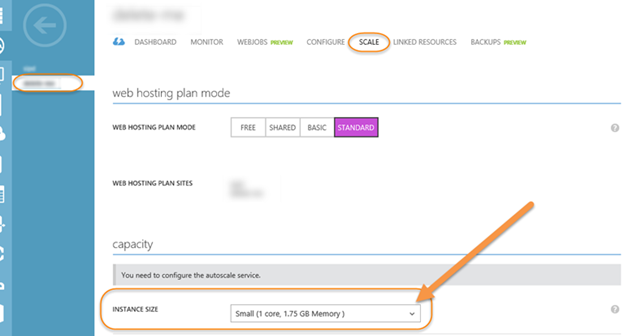
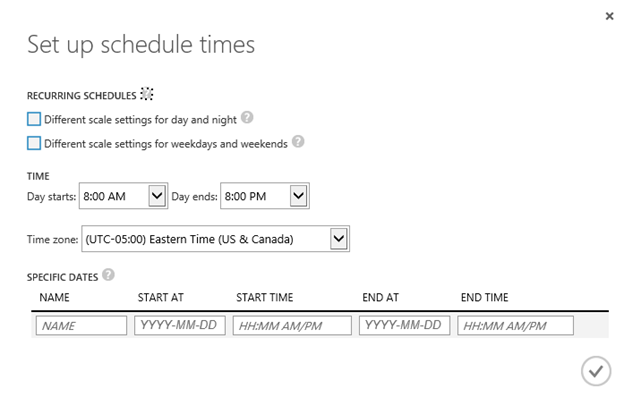

# 三、向上扩展，向外扩展

云应用的一个重要特征是能够通过纵向扩展或横向扩展来响应不断增长的需求。纵向扩展是指增加服务器的容量(例如添加 CPU 内核或内存)以满足增加的需求，而横向扩展是指向应用添加新实例以处理增加的需求。虽然横向扩展选项在云环境中是首选的，因为它可以在不重新配置或中断应用现有实例的情况下实现，但这两种方法在 Azure 中都可用。

|  | 注意:对于免费服务，如免费的 Azure 网站托管计划模式，缩放选项在 Azure 中受到严重限制。如果您更改您的托管计划模式以尝试缩放功能，请确保将其返回到免费模式，以避免产生意外费用。通过进行更改，然后选择放弃命令而不是保存，可以在 Azure 管理门户中探索许多缩放选项。 |

## 调整实例

Azure 为使用基本或标准网络托管模式托管的虚拟机的规模调整提供了三个选项(其他选项可用于未通过网站功能公开的虚拟机)。这些选项包括:

*   具有单个处理器内核和 1.75GB 内存的小型实例
*   具有两个处理器内核和 3.5GB 内存的中型实例
*   具有四个内核和 7GB 内存的大型实例

如前所述，应该优先考虑为您的应用使用最小的适当实例大小，并在需要时进行横向扩展。扩大规模而非缩小规模的一个潜在使用情形是，如果使用按实例许可的第三方组件，增加更多实例将导致许可成本大幅增加。

要更改使用受支持的层托管的 Azure 网站的实例大小，请通过单击网站名称在 Azure 管理门户中选择该网站，这将显示所选网站的详细信息。使用顶部导航导航到“缩放”选项卡，找到“实例大小”下拉菜单(如图 9 所示)，并使用它来指定所需的实例大小。对更改满意后，选择窗口底部的保存保存更改，Azure 将开始调整实例的大小。



图 9:纵向扩展

## 添加/删除实例

使用“共享”、“基本”或“标准”定价层的 Azure 网站能够通过向服务于该网站的资源库添加和删除相同大小的实例来进行横向扩展。每个站点可扩展的实例数量因特定的托管计划层而异:

*   共享:站点最多可以扩展到六个共享实例(没有专用计算资源)
*   基本:站点最多可以扩展到三个专用虚拟机
*   标准:站点最多可以扩展到 10 台专用虚拟机

要扩展具有受支持的托管计划层的 Azure 网站，请导航到上一节中描述的网站的扩展选项，并找到图 10 中描述的实例计数滑块。将滑块拖动到所需的值，或者在文本框中键入选定的值，然后选择保存以保存配置。保存更改后，Azure 结构控制器将在后台工作，以调配或停用实例，从而反映新选择的实例数量。


图 10:横向扩展

## 自动缩放

到目前为止，讨论的扩展机制主要集中在管理 Azure 帐户的人员、登录 Azure 管理门户应用以及手动更改实例大小或通过用户界面添加/删除实例。但是 Azure 还提供了一个强大的功能，通过基于一些可用的控制因素自动调整正在运行的实例数量来帮助平衡成本和性能。该功能称为“自动缩放”，对于 Azure 网站，控制因素可以基于时间或 CPU 利用率百分比。

### 基于时间表的缩放

当基于时间控制缩放时，Azure 网站操作员可以利用知道何时会出现利用率特别高或特别低的时段，然后确保从解决方案中添加或删除资源来响应这些时段。

使用基于时间表的缩放的一个例子是健康保险公司的注册网站的使用模式。大多数保险公司都在日历上设置了一段时间来标记开放注册，在这段时间内，保险产品的消费者可以获得新的保险单或对现有的保险范围进行更改。在此期间之外，消费者必须满足非常严格的标准，才有资格进行此类更改。为了说明起见，让我们假设一家拥有 200 万订户的保险公司的开放注册期为两周。在这两周内，可以预计该公司的注册网站将被几乎所有的 200 万订户积极使用，因为他们检查选项并选择来年的福利。在这两周的时间之外，该网站将被少数订户少量使用，因为他们是新雇佣的，或者有其他事件使他们有资格在注册期之外进行更改。对于标准托管层的 Azure 网站，可以在注册期间指定实例计数为 10，在所有其他时间指定为 2。

#### 默认计划

默认情况下，Azure 的自动缩放功能允许您启用为白天、夜晚、工作日和周末建立唯一时段的计划。白天/夜晚划分是可配置的，以提供对白天时段的开始和结束时间以及应用作参考点的时区的控制。此功能可用于确保在工作日添加服务器资源，然后在下班时间取消分配。

当我第一次被介绍到 Azure 时，有人向我描述了一个很好的例子，说明默认时间表如何为 Azure 用户节省账单上的钱。这个场景涉及一个客户，他处理来自股票市场的交易数据，这在交易日需要大量的处理能力，但是每天市场一关闭，他就不需要处理了。自动扩展功能当时并不存在，因此订阅者编写了 PowerShell 脚本，这些脚本被安排在本地按照一个时间表来调配和释放 Azure Compute 实例，该时间表允许它们的 Azure 成本在不需要处理能力的时间段内接近于零，并在白天处理大量负载。

#### 自定义计划

除了默认计划之外，Azure 订阅者还可以通过指定开始日期/时间和结束日期/时间以及为自定义计划提供名称来配置其他期间。在前面的开放注册示例中，此功能将用于指定预计出现大量交易的时间段。

#### 配置基于计划的扩展

要根据计划扩展使用标准网站托管计划层托管的 Azure 网站，请在 Azure 管理门户中单击网站名称选择该网站，这将显示所选网站的详细信息。使用顶部导航导航到“比例”选项卡并找到计划选项，该选项包括一个下拉菜单，允许您从现有计划中进行选择，以及一个创建新计划期间或编辑现有计划期间的命令。这些如图 11 所示:


图 11:按计划选项缩放

假设之前没有建立计划周期，您将首先调用“设置计划时间”命令，显示如图 12 所示的对话框:



图 12:设置计划时间对话框

在该对话框中，您可以选择启用日/夜和工作日/周末的默认计划，以及创建需要指定名称、开始日期、开始时间、结束日期和结束时间的附加命名期间。在您处理完对话框中的计划周期以创建适合您网站预期负载情况的周期后，接受更改。您将返回秤配置页面，新的调度选项现在显示在调度下拉菜单中，如图 13 所示:


图 13:选择时间表

对于下拉菜单中显示的每个计划，您现在可以选择该计划，并配置当该计划为当前计划时希望处于活动状态的实例数。Azure 结构大约每五分钟扫描一次扩展，因此扩展可能不会恰好在配置的时间发生。

### 按公制缩放

很多时候，仅仅通过说“我白天需要五个实例，晚上需要三个实例”，就很难预测扩展需求相反，什么时候你需要更多或更少的资源的定义应该由一些与你的网站有多忙相关的标准来驱动。为了满足这一需求，Azure 在自动缩放功能中提供了“按度量缩放”选项。这一衡量标准因被衡量的具体服务而异。例如，一些 Azure 网站严格按照 CPU 利用率百分比进行衡量，而其他服务可以根据队列中等待处理的消息数量进行自动扩展。

无论选择哪种方法，Azure 控制器都遵循一种算法，该算法与调度循环的每一遍的伪代码中所描述的相似:

```cs
    if current measure >= max threshold
    if current instance count < max instance count
    provision additional instance
    end if
    else
    if current instance count > min instance count
    if current measure < min threshold
    de-allocate one instance
    end if
    end if
    end if

```

按度量进行扩展的能力是一个强大的工具，它允许您在节省 Azure 账单和确保应用对用户请求做出良好响应之间进行微调。

#### 配置基于指标的缩放

要根据时间表扩展使用标准网站托管计划层托管的 Azure 网站，请通过单击网站名称在 Azure 管理门户中选择该网站，这将显示所选网站的详细信息。使用顶部导航栏导航到“比例”选项卡，找到“按公制比例”部分，如图 14 所示:


图 14:按指标选项缩放

默认情况下，在选项中选择“无”选项，但选择“中央处理器”(这是 Azure 网站目前唯一的其他选项)会将“实例计数”滑块更改为接受范围而不是标量值，并显示“目标中央处理器”滑块，允许您选择被认为适合您的应用的中央处理器利用率百分比范围。默认的 60%到 80%的范围通常是一个很好的开始值，除非您知道您的应用的特定需求驱动其他值的选择。中央处理器缩放选项如图 15 所示:


图 15:按 CPU 选项进行扩展

#### 按中央处理器选择适当的缩放值

选择合适的缩放值可能看起来相当明显，许多人的初步答案是包括以下特征:

*   最小实例数为 1，以便在负载允许的情况下最小化成本
*   您的计划允许的最大实例数或满足您选择的最大成本的某个下限
*   最小目标 CPU 接近 100%，以允许实例尽快退出
*   100%的最大目标 CPU，以确保只有在最大化已付费资源的利用率时，才为额外的实例付费

作为一系列要点，这种方法看起来相当可靠，对于负责支付账单的人来说绝对有意义。但是从要点到现实世界的转换揭示了一些额外的变量，在决定什么适合你时应该考虑这些变量:

*   最小实例数:许多网站运营者希望确保他们网站的至少一个额外实例超出预期需要，以确保快速响应意外删除的实例，而不会对网站访问者造成明显影响。格言“三个是两个，两个是一个，一个是没有”适用于这里，所以，对于一个网站的需求，证明一个标准的托管计划模式和配置的缩放选项，我永远不会建议少于两个实例。
*   最大实例数:这一点我不会改变。最大实例数应该是您允许的实例数，或者您应该计算出您愿意为 Azure 网站计算时间支付的最大金额，将实例数限制在一个不会让您超过该值的值。
*   最小目标中央处理器:理想情况下，该值应该足够低，以清楚地表明高容量峰值已经过去，并且删除一个实例不会立即让您重新获得中央处理器利用率，从而在下一次通过时再次进行资源调配。
*   最大目标中央处理器:设置该值时应了解采样是按时间间隔进行的，如果允许的时间间隔太接近 100%，您可能会在采样间隔后立即达到峰值，让您的用户在等待调度程序注意到另一个实例需要进行资源调配和加速时，网站会陷入困境。

### 按计划和指标的组合缩放

推动选择合适的配置选项以按指标进行扩展的因素不仅比最初想象的要复杂，而且往往会受到已知网站活动周期的影响，这些活动周期在预期数量上互不相同。在流量较低的时期，使网站的最小实例计数低于其他时间的值可能是合理的、节省成本的措施，而在预期非常繁忙的时期，为了避免在提供额外实例的同时网站的响应变得较慢的情况，增加实例计数可能是值得的。Azure 满足了这一需求，它允许为您创建的每个时间段配置一组单独的按指标缩放选项。

## 总结

在本章中，您学习了扩展，这是云平台最重要的定义特性之一。您了解了纵向扩展和横向扩展之间的区别，并看到了 Azure 动态添加和删除实例的功能，这些功能使横向扩展成为平台上的首选扩展选项。