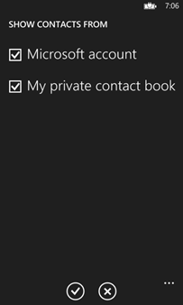
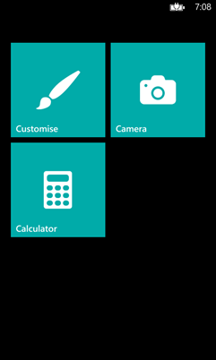
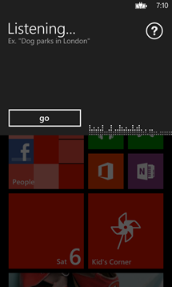
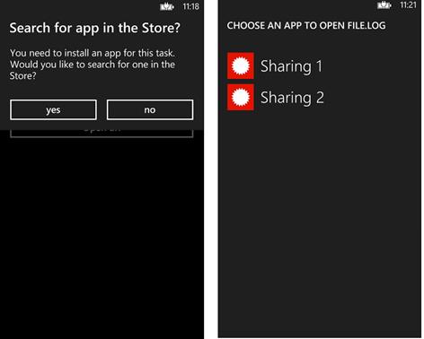

# 七、与操作系统集成

## 发射器和选择者

当我们在[第 4 章](04.html#_Chapter_4_Data)中讨论存储时，我们引入了隔离应用的概念。存储是隔离的，因此您无法访问另一个应用存储的数据，同样，应用本身也是与操作系统隔离的。这种方法的最大好处是安全性。即使恶意应用能够通过认证过程，它也不会有机会造成太大的损害，因为它无法直接访问操作系统。但迟早，你需要与许多 Windows Phone 功能中的一个进行交互，比如发送消息、打电话、播放歌曲等。

对于所有这些场景，框架都引入了启动程序和选择程序，它们是要求操作系统执行特定任务的一组 API。任务完成后，控制权将返回给应用。

发射器是“开火并忘记”的 API。你要求手术，不要期待任何回报——例如，打电话或播放视频。

Choosers 用于从本机应用中获取数据，例如，从人员中心获取联系人，并将其导入您的应用。

所有的启动器和选择器都在`Microsoft.Phone.Tasks`名称空间中可用，并且共享相同的行为:

*   每个启动器和选择器都由一个特定的类来表示。
*   如果需要，您可以设置一些用于定义启动器或选择器设置的属性。
*   使用选择器，您需要订阅`Completed`事件，该事件在操作完成时触发。
*   调用`Show()`方法执行任务。

|  | 注意:不能使用启动器和选择程序来覆盖内置的 Windows Phone 安全机制，因此没有用户的明确许可，您将无法执行操作。 |

在下面的示例中，您可以看到一个使用`EmailComposeTask`类发送电子邮件的启动器:

```cs
    private void OnComposeMailClicked(object sender, RoutedEventArgs e)
    {
        EmailComposeTask mailTask = new EmailComposeTask();

        mailTask.To = "mail@domain.com";
        mailTask.Cc = "mail2@domain.com";
        mailTask.Subject = "Subject";
        mailTask.Body = "Body";

        mailTask.Show();
    }

```

下面的示例演示如何使用选择器。我们将使用`SaveContactTask`类在人员中心保存一个新联系人。

```cs
    private void OnSaveContactClicked(object sender, RoutedEventArgs e)
    {
        SaveContactTask task = new SaveContactTask();
        task.Completed += task_Completed;

        task.FirstName = "John";
        task.LastName = "Doe";
        task.MobilePhone = "1234567890";

        task.Show();
    }

    void task_Completed(object sender, SaveContactResult e)
    {
        if (e.TaskResult == TaskResult.OK)
        {
           MessageBox.Show("The contact has been saved successfully");
        }
    }

```

每个选择器返回一个带有操作状态的`TaskResult`属性。在继续之前，确认状态为`TaskResult.OK`很重要，因为用户可能已经取消了操作。

以下是所有可用启动器的列表:

*   `MapsDirectionTask`用于打开原生 Map 应用，计算两地之间的路径。
*   `MapsTask`用于打开以特定位置为中心的原生地图应用。
*   `MapDownloaderTask`用于管理 Windows Phone 8 新增的离线地图支持。通过此任务，您将能够打开用于管理下载地图的设置页面。
*   `MapUpdaterTask`用于将用户重定向到特定设置页面，以检查离线地图更新。
*   `ConnectionSettingsTask`用于快速访问不同的设置页面，以管理不同的可用连接，如 Wi-Fi、蜂窝或蓝牙。
*   `EmailComposeTask`用于准备邮件并发送。
*   `MarketplaceDetailTask`用于在 Windows Phone Store 上显示某个应用的详细页面。如果您不提供应用标识，它将打开当前应用的详细信息页面。
*   `MarketplaceHubTask`用于将店铺开至特定品类。
*   `MarketplaceReviewTask`用于打开 Windows Phone Store 中的页面，用户可以在其中为当前应用留下评论。
*   `MarketplaceSearchTask`用于开始搜索商店中的特定关键词。
*   `MediaPlayerLauncher`用于使用内置的 Windows Phone 播放器播放音频或视频。它可以播放嵌入在 Visual Studio 项目中的文件和保存在本地存储中的文件。
*   `PhoneCallTask`用来开始打电话。
*   `ShareLinkTask`用于使用 Windows Phone 嵌入式社交功能在社交网络上共享链接。
*   `ShareStatusTask`用于在社交网络上分享自定义状态文本。
*   `ShareMediaTask`用于在社交网络上分享照片中心的其中一张照片。
*   `SmsComposeTask`用于准备短信并发送。
*   `WebBrowserTask`用于在 Windows Phone 的 Internet Explorer 中打开一个 URI。
*   `SaveAppointmentTask`用于在原生日历应用中保存约会。

以下是可用选项列表:

*   `AddressChooserTask`用于导入联系人的地址。
*   `CameraCaptureTask`用于用集成相机拍照，导入应用。
*   `EmailAddressChooserTask`用于导入联系人的电子邮件地址。
*   `PhoneNumberChooserTask`用于导入联系人的电话号码。
*   `PhotoChooserTask`用于从照片中心导入照片。
*   `SaveContactTask`用于在人物中心保存新联系人。选择器只是返回操作是否成功完成。
*   `SaveEmailAddressTask`用于向现有或新的联系人添加新的电子邮件地址。选择器只是返回操作是否成功完成。
*   `SavePhoneNumberTask`用于向现有联系人添加新的电话号码。选择器只是返回操作是否成功完成。
*   `SaveRingtoneTask`用于保存新的铃声(可以是项目的一部分，也可以存储在本地存储中)。它返回操作是否成功完成。

## 获取联系人和约会

启动程序已经提供了与人员中心交互的基本方式，但是它们总是需要用户交互。他们打开人员中心，用户必须选择要导入的联系人。

但是，在某些情况下，您需要能够以编程方式检索联系人和约会的数据。Windows Phone 7.5 引入了一些新的 API 来满足这一需求。你只需要记住，为了尊重 Windows Phone 的安全约束，这些 API 只在只读模式下工作；您将能够获得数据，但不能保存数据(在本章的后面，我们将看到 Windows Phone 8 引入了一种方法来覆盖这一限制)。

在下表中，您可以看到根据联系人的保存位置可以访问哪些数据。

| 供应者 | 联系人姓名 | 联系人图片 | 其他信息 | 日历约会 |
| 设备 | 是 | 是 | 是 | 是 |
| Outlook.com | 是 | 是 | 是 | 是 |
| 交易所 | 是 | 是 | 是 | 是 |
| 用户身份识别卡 | 是 | 是 | 是 | 不 |
| 脸谱网 | 是 | 是 | 是 | 不 |
| 其他社交网络 | 不 | 不 | 不 | 不 |

要知道数据来自哪里，您可以使用`Accounts`属性，这是存储信息的帐户的集合。事实上，您可以将相同数据的信息拆分到不同的帐户中。

### 与联系人一起工作

每个联系人都由`Contact`类表示，该类包含一个联系人的所有信息，如`DisplayName`、`Addresses`、`EmailAddresses`、`Birthdays`等。(基本上，您在人员中心创建新联系人时可以编辑的所有信息)。

|  | 注意:要访问联系人，您需要在清单文件中启用 ID_CAP_CONTACTS 选项。 |

与联系人的交互从`Contacts`类开始，该类可用于使用`SearchAsync()`方法执行搜索。该方法需要两个参数:要应用的关键字和筛选器。有两种方法可以开始搜索:

*   一般搜索:关键字不是必需的，因为您只需获得与所选过滤器匹配的所有联系人。这种类型的搜索可以通过两种过滤类型来实现:`FilterKind.PinnedToStart`仅返回用户在开始屏幕上锁定的联系人，而`FilterKind.None`仅返回所有可用的联系人。
*   对特定字段的搜索:在这种情况下，将根据所选过滤器应用搜索关键字。可用的过滤器有`DisplayName`、`EmailAddress`和`PhoneNumber`。

`SearchAsync()`方法使用回调方法；搜索完成后，会引发一个名为`SearchCompleted`的事件。

在下面的示例中，您可以看到一个搜索，该搜索查找所有姓名为 John 的联系人。返回的联系人集合通过`ListBox`控件呈现给用户。

```cs
    private void OnStartSearchClicked(object sender, RoutedEventArgs e)
    {
        Contacts contacts = new Contacts();
        contacts.SearchCompleted += new EventHandler<ContactsSearchEventArgs>(contacts_SearchCompleted);
        contacts.SearchAsync("John", FilterKind.DisplayName, null);
    }

    void contacts_SearchCompleted(object sender, ContactsSearchEventArgs e)
    {
        Contacts.ItemsSource = e.Results;
    }

```

|  | 提示:如果您想开始搜索其他未包含在可用过滤器中的字段，您需要使用`FilterKind.None`选项获取所有可用联系人的列表，并使用 LINQ 查询应用过滤器。不同的是，内置过滤器经过优化，性能更好，因此，请确保仅当您需要搜索姓名、电子邮件地址或电话号码以外的字段时，才使用 LINQ 方法。 |

### 处理约会

从日历中获取数据的工作方式非常相似:每个约会都由`Appointment`类标识，该类具有类似`Subject`、`Status`、`Location`、`StartTime`和`EndTime`的属性。

要与日历交互，您必须使用`Appointments`类，该类与`Contacts`类一样，使用名为`SearchAsync()`的方法开始搜索，并使用名为`SearchCompleted`的事件返回结果。执行搜索所需的两个参数是开始日期和结束日期。你会在这个时间范围内得到所有约会的回报。或者，您也可以设置返回结果的最大数量，或将搜索限制在特定帐户。

在下面的示例中，我们检索当前日期和前一天之间发生的所有约会，并使用`ListBox`控件显示它们。

```cs
    private void OnStartSearchClicked(object sender, RoutedEventArgs e)
    {
        Appointments calendar = new Appointments();
        calendar.SearchCompleted += calendar_SearchCompleted;
        DateTime start = DateTime.Now.AddMonths(-1);
        DateTime end = DateTime.Now;
        calendar.SearchAsync(start, end, null);
    }

    void calendar_SearchCompleted(object sender, AppointmentsSearchEventArgs e)
    {
        Calendar.ItemsSource = e.Results;
    }

```

|  | 提示:过滤结果的唯一方法是按开始日期和结束日期。如果需要应用额外的过滤器，就必须对搜索操作返回的结果执行 LINQ 查询。 |

## 用于应用的私人联系人存储

到目前为止，我们看到的 contacts APIs 的最大限制是，我们只能读取数据，而不能写入数据。在某些情况下，不需要征得用户的同意就可以将联系人添加到 People Hub 是一项要求，例如社交网络应用希望将您的朋友添加到您的联系人列表中，或者同步客户端需要将来自第三方云服务的信息存储在您的通讯录中。

Windows Phone 8 引入了一个名为`ContactStore`的新类，代表该应用的私人通讯录。从用户的角度来看，它的行为就像一个常规的联系人源(像 Outlook.com、脸书或 Gmail)。用户将能够在人员中心看到联系人，以及所有其他常规联系人。从开发者的角度来看，商店属于应用；你可以自由读写数据，但你创建的每个联系人都将成为你私人通讯录的一部分，而不是手机的联系人列表。这意味着如果卸载该应用，所有联系人都将丢失。



图 22:联系人中心可用帐户中显示的联系人存储功能

`ContactStore`类属于`Windows.Phone.PersonalInformation`命名空间，它提供了一个名为`CreateOrOpenAsync()`的方法。每次需要与私人通讯录交互时，都必须调用该方法。如果它不存在，它将被创建；否则，它将被简单地打开。

当您创建`ContactStore`时，您可以设置操作系统应该如何提供对它的访问:

*   第一个参数的类型是`ContactStoreSystemAccessMode`，用于选择应用是只能编辑属于私人商店的联系人(`ReadOnly`)，还是用户也可以使用人物中心(`ReadWrite`)编辑信息。
*   第二个参数的类型是`ContactStoreApplicationAccessMode`，用于选择其他第三方应用是否能够访问我们联系人的所有信息(`ReadOnly`)或者只访问最重要的信息，如姓名和图片(`LimitedReadOnly`)。

以下示例显示了创建新私有存储所需的代码:

```cs
    private async void OnCreateStoreClicked(object sender, RoutedEventArgs e)
    {
        ContactStore store = await ContactStore.CreateOrOpenAsync(ContactStoreSystemAccessMode.ReadWrite, ContactStoreApplicationAccessMode.ReadOnly);
    }

```

|  | 提示:创建私有存储后，您不能更改已定义的权限，因此您必须始终使用相同的参数调用 CreateOrOpenAsync()方法。 |

### 创建联系人

联系是由`StoredContact`类定义的，这与我们之前看到的`Contact`类有点不同。在这种情况下，唯一直接暴露的属性是`GivenName`和`FamilyName`。所有其他属性都可以通过调用`StoredContact`类的`GetPropertiesAsync()`方法来访问，该方法返回类型为`Dictionary<string, object>`的集合。

集合中的每一项都由一个键(联系人属性的名称)和一个对象(值)来标识。为了帮助开发人员访问属性，所有可用的键都存储在名为`KnownContactProperties`的枚举对象中。在下面的示例中，我们使用键`KnowContactProperties.Email`来存储用户的电子邮件地址。

```cs
    private async void OnCreateStoreClicked(object sender, RoutedEventArgs e)
    {
        ContactStore store = await ContactStore.CreateOrOpenAsync(ContactStoreSystemAccessMode.ReadWrite, ContactStoreApplicationAccessMode.ReadOnly);

        StoredContact contact = new StoredContact(store);
        contact.GivenName = "Matteo";
        contact.FamilyName = "Pagani";
        IDictionary<string, object> properties = await contact.GetPropertiesAsync();
        properties.Add(KnownContactProperties.Email, "info@qmatteoq.com");

        await contact.SaveAsync();
    }

```

|  | 提示:由于`ContactStore`是字典，两个值不能有同一个键。在向联系人添加新属性之前，您必须确保它尚不存在；否则，您需要更新现有的。 |

`StoredContact`类还支持通过使用`GetExtendedPropertiesAsync()`方法访问扩展属性来存储自定义信息的方法。它像标准属性一样工作，只是属性键完全是自定义的。这些属性不会显示在人物中心，因为 Windows Phone 不知道如何处理它们，但是它们可以被您的应用使用。

在以下示例中，我们添加了名为 **MVP 类别**的新自定义信息:

```cs
    private async void OnCreateStoreClicked(object sender, RoutedEventArgs e)
    {
        ContactStore store = await ContactStore.CreateOrOpenAsync(ContactStoreSystemAccessMode.ReadWrite, ContactStoreApplicationAccessMode.ReadOnly);

        StoredContact contact = new StoredContact(store);
        contact.GivenName = "Matteo";
        contact.FamilyName = "Pagani";

        IDictionary<string, object> extendedProperties = await contact.GetExtendedPropertiesAsync();
        extendedProperties.Add("MVP Category", "Windows Phone Development");

        await contact.SaveAsync();
    }

```

### 搜索联系人

在私人通讯录中搜索联系人有点棘手，因为没有直接的方法在联系人中搜索特定的字段。

使用`ContactQueryResult`类执行搜索，该类是通过调用`ContactStore`对象的`CreateContactQuery()`方法创建的。唯一可用的操作是返回所有联系人的`GetContactsAsync()`，以及返回可用联系人数量的`GetContactCountAsync()`。

您也可以预先定义要使用的字段，但是您仍然需要使用`GetPropertiesAsync()`方法来提取正确的值。让我们在下面的示例中看看它是如何工作的，其中我们寻找一个电子邮件地址为**info@qmatteoq.com**的联系人:

```cs
    private async void OnSearchContactClicked(object sender, RoutedEventArgs e)
    {
        ContactStore store = await ContactStore.CreateOrOpenAsync(ContactStoreSystemAccessMode.ReadWrite, ContactStoreApplicationAccessMode.ReadOnly);
        ContactQueryOptions options = new ContactQueryOptions();
        options.DesiredFields.Add(KnownContactProperties.Email);

        ContactQueryResult result = store.CreateContactQuery(options);
        IReadOnlyList<StoredContact> contactList = await result.GetContactsAsync();

        foreach (StoredContact contact in contactList)
        {
           IDictionary<string, object> properties = await contact.GetPropertiesAsync();
           if (properties.ContainsKey(KnownContactProperties.Email) &&
                properties[KnownContactProperties.Email].ToString() == "info@qmatteoq.com")
            {
                MessageBox.Show("Contact found!");
            }
        }
    }

```

您可以通过创建一个新的`ContactQueryOptions`对象并将其添加到`DesiredFields`集合来定义您感兴趣的字段。然后，在创建`ContactQueryResult`对象时，可以将`ContactQueryOptions`对象作为参数传递。正如您所看到的，定义字段不足以获得期望的结果。我们仍然必须使用`GetPropertiesAsync()`方法查询每个联系人，以查看信息值是否是我们正在寻找的。

`ContactQueryOptions`类的目的是准备下一个查询操作，以便更快地执行它们。

### 更新和删除联系人

更新联系人的方法与创建新联系人的方法相同:检索到要编辑的联系人后，必须更改所需信息并再次调用`SaveAsync()`方法，如下例所示:

```cs
    private async void OnSearchContactClicked(object sender, RoutedEventArgs e)
    {
        ContactStore store = await ContactStore.CreateOrOpenAsync(ContactStoreSystemAccessMode.ReadWrite, ContactStoreApplicationAccessMode.ReadOnly);
        ContactQueryOptions options = new ContactQueryOptions();
        options.DesiredFields.Add(KnownContactProperties.Email);

        ContactQueryResult result = store.CreateContactQuery(options);
        IReadOnlyList<StoredContact> contactList = await result.GetContactsAsync();

        foreach (StoredContact contact in contactList)
        {
           IDictionary<string, object> properties = await contact.GetPropertiesAsync();
           if (properties.ContainsKey(KnownContactProperties.Email) &&
                properties[KnownContactProperties.Email].ToString() == "info@qmatteoq.com")
            {
                properties[KnownContactProperties.Email] = "mail@domain.com";
                await contact.SaveAsync();
            }
        }
    }

```

我们检索到电子邮件地址为**info@qmatteoq.com**的用户后，将其更改为**mail@domain.com**，并保存。

删除的工作方式类似，只是你必须处理联系人的 ID，这是商店自动分配的唯一标识符(你不能设置；你只能读它)。检索到要删除的联系人后，必须调用`ContactStore`对象上的`DeleteContactAsync()`方法，将存储在`StoredContact`类的`Id`属性中的联系人标识作为参数传递。

```cs
    private async void OnSearchContactClicked(object sender, RoutedEventArgs e)
    {
        ContactStore store = await ContactStore.CreateOrOpenAsync(ContactStoreSystemAccessMode.ReadWrite, ContactStoreApplicationAccessMode.ReadOnly);
        ContactQueryOptions options = new ContactQueryOptions();
        options.DesiredFields.Add(KnownContactProperties.Email);

        ContactQueryResult result = store.CreateContactQuery(options);
        IReadOnlyList<StoredContact> contactList = await result.GetContactsAsync();

        foreach (StoredContact contact in contactList)
        {
           IDictionary<string, object> properties = await contact.GetPropertiesAsync();
           if (properties.ContainsKey(KnownContactProperties.Email) &&
                properties[KnownContactProperties.Email].ToString() == "info@qmatteoq.com")
            {
                await store.DeleteContactAsync(contact.Id);
            }
        }
    }

```

在前面的示例中，检索到电子邮件地址为**info@qmatteoq.com**的联系人后，我们使用其唯一标识符将其删除。

### 处理远程同步

使用自定义联系人源时，我们通常不会简单地管理本地联系人，而是管理与远程服务同步的数据。在这种情况下，您必须跟踪联系人的远程标识符，它将不同于本地标识符，因为如前所述，它是自动生成的，无法设置。

对于这个场景，`StoredContact`类提供了一个名为`RemoteId`的属性来存储这样的信息。拥有一个`RemoteId`也简化了我们之前看到的搜索操作。实际上，`ContactStore`类提供了一个名为`FindContactByRemoteIdAsync()`的方法，它能够根据远程标识检索特定联系人，如下例所示:

```cs
    private async void OnFindButtonClicked(object sender, RoutedEventArgs e)
    {
        ContactStore store = await ContactStore.CreateOrOpenAsync(ContactStoreSystemAccessMode.ReadWrite, ContactStoreApplicationAccessMode.ReadOnly);

        string myRemoteId = "2918";

        RemoteIdHelper remoteHelper = new RemoteIdHelper();
        string taggedRemoteId = await remoteHelper.GetTaggedRemoteId(store, myRemoteId);
        StoredContact contact = await store.FindContactByRemoteIdAsync(taggedRemoteId);
    }

```

有一个重要的要求需要记住:在使用私人通讯录的手机上安装的任何应用中，`RemoteId`属性的值应该是唯一的；否则，你会得到一个例外。

[在这篇由微软发布的文章](http://msdn.microsoft.com/en-us/library/windowsphone/develop/jj207024(v=vs.105).aspx#BKMK_UsingtheRemoteIdHelperclass)中，您可以看到一个名为`RemoteIdHelper`的类的实现，它提供了一些方法，用于向远程 ID 添加随机信息(使用 GUID)以确保它是唯一的。

## 利用儿童角

儿童角是 Windows Phone 8 中引入的一个有趣且创新的功能，对幼儿家长尤其有用。基本上，这是一个我们可以定制的沙箱。我们可以决定哪些应用、游戏、图片、视频和音乐可以访问。

作为开发人员，我们能够知道应用何时以儿童角模式运行。这样，我们可以定制体验，以避免提供不适当的内容，如共享功能。

利用这个特性很容易；我们只需检查属于`Windows.Phone.ApplicationModel`命名空间的`ApplicationProfile`类的`Modes`属性。当设置为`Default`时，应用运行正常。如果设置为`Alternate`，它将在儿童角模式下运行。

```cs
    private void OnCheckStatusClicked(object sender, RoutedEventArgs e)
    {
        if (ApplicationProfile.Modes == ApplicationProfileModes.Default)
        {
           MessageBox.Show("The app is running in normal mode.");
        }
        else
        {
           MessageBox.Show("The app is running in Kid's Corner mode.");
        }
    }

```



图 23:儿童角开始屏幕

## 语音 API:我们来谈谈应用

语音 API 是 Windows Phone 8 中添加的最有趣的新功能之一。从用户的角度来看，声音特征在设置页面中进行管理。语音部分允许用户配置所有主要设置，如语音类型，但最重要的是，它用于设置他们想要用于语音服务的语言。通常，它是用用户界面的相同语言设置的，用户可以选择通过下载和安装新的语音包来更改它。了解语音服务是如何配置的很重要，因为在您的应用中，您只能对用户安装的语言使用语音识别。

语音服务的目的是通过以下方式在您的应用中添加语音识别支持:

*   使用户能够说出命令来与应用交互，例如打开它并执行任务。
*   启用文本到语音功能，以便应用能够向用户阅读文本。
*   启用文本识别，以便用户可以通过口述而不是键入来输入文本。

在本节中，我们将研究在应用中实现所有三种模式的基本要求。



图 24:Windows Phone 提供的使用语音命令的对话框

### 语音命令

无论用户在做什么，语音命令都是启动应用和执行特定任务的一种方式。点击并按住“开始”按钮即可激活它们。Windows Phone 为许多语音命令提供了本机支持，例如开始打电话、口述电子邮件、通过必应搜索等。

用户只需要说出一个命令；如果它被成功识别，应用将被打开，作为开发人员，我们将获得一些信息来了解发出了哪个命令，以便我们可以将用户重定向到适当的页面或执行特定的操作。

语音命令基于 VCD 文件，VCD 文件是包含在项目中的 XML 文件。使用一种特殊的语法，您将能够定义您希望在应用中支持的所有命令，以及应用在使用它们时应该如何表现。Visual Studio 本身支持这些文件。如果您右键单击您的项目并选择**添加新项目**，您将在 Windows Phone 部分找到一个名为 **VoiceCommandDefinition** 的模板。

下面的代码示例是 VCD 文件的样子:

```cs
    <?xml version="1.0" encoding="utf-8"?>

    <VoiceCommands >
       <CommandSet xml:lang="it" Name="NotesCommandSet">
        <CommandPrefix>My notes</CommandPrefix>
        <Example> Open my notes and add a new note </Example>

        <Command Name="AddNote">
          <Example> add a new note </Example>
          <ListenFor> [and] add [a] new note </ListenFor>
          <ListenFor> [and] create [a] new note </ListenFor>
          <Feedback> I’m adding a new note... </Feedback>
          <Navigate Target="/AddNote.xaml" />
        </Command>

       </CommandSet>
    </VoiceCommands>

```

一个 VCD 文件可以包含一个或多个`CommandSet`节点，这些节点由一个`Name`和一种特定的语言(`xml:lang`属性)来标识。第二个属性是最重要的。您的应用将仅支持您在 VCD 文件的`CommandSet`中包含的语言的语音命令(语音命令的语言由用户在设置页面中定义)。您可以有多个`CommandSet`节点来支持多种语言。

每个`CommandSet`可以有一个`CommandPrefix`，这是用户开始向我们的应用发送命令时应该说出的文本。如果未指定，将自动使用应用的名称。如果要本地化命令，或者应用的标题太复杂而无法发音，则此属性非常有用。您还可以添加一个`Example`标签，其中包含了 Windows Phone 对话框显示的文本，以帮助用户了解他们可以使用哪种命令。

然后，在一个`CommandSet`中，您可以添加多达 100 个由`Command`标签标识的命令。每个命令都有以下特征:

*   唯一的名称，在`Name`属性中设置。
*   `Example`标签显示用户当前命令的示例文本。
*   `ListenFor`包含激活命令应说出的文本。单个命令最多可以指定十个`ListenFor`标签，以覆盖文本的变化。您也可以在方括号内添加可选单词。在前面的示例中，`AddNote`命令可以通过发音“添加新音符”或“添加新音符”来激活
*   `Feedback`是 Windows Phone 说出的文字，通知用户已经理解命令，正在处理。
*   `NavigateTarget`可用于定制应用的导航流程。如果我们不设置它，默认情况下，应用将打开到主页面。否则，与前面的示例一样，我们可以将用户重定向到特定的页面。当然，在这两种情况下，我们都会收到关于口头命令的信息；我们以后再看如何处理。

一旦我们完成了 VCD 定义，我们就可以在我们的应用中使用它了。

|  | 注意:要使用语音服务，您需要在清单文件中启用 ID_CAP_SPEECH_RECOGNITION 选项。 |

命令通过使用名为`VoiceCommandService`的类嵌入到 Windows Phone 应用中，该类属于`Windows.Phone.Speech.VoiceCommands`命名空间。这个静态类公开了一个名为`InstallCommandSetFromFileAsync()`的方法，它需要我们刚刚创建的 VCD 文件的路径。

```cs
    private async void OnInitVoiceClicked(object sender, RoutedEventArgs e)
    {
        await VoiceCommandService.InstallCommandSetsFromFileAsync(new Uri("ms-appx:///VoiceCommands.xml"));
    }

```

文件路径用`Uri`表示，它应该以`ms-appx:///`前缀开始。这个`Uri`是指 Visual Studio 项目的结构，从根开始。

### 短语列表

一个 VCD 文件也可以包含一个短语列表，如下例所示:

```cs
    <?xml version="1.0" encoding="utf-8"?>

    <VoiceCommands >
       <CommandSet xml:lang="en" Name="NotesCommandSet">
        <CommandPrefix>My notes</CommandPrefix>
        <Example> Open my notes and add a new note </Example>

        <Command Name="OpenNote">
          <Example> open the note </Example>
          <ListenFor> open the note {number} </ListenFor>
          <Feedback> I’m opening the note... </Feedback>
          <Navigate />
        </Command>

        <PhraseList Label="number">
          <Item> 1 </Item>
          <Item> 2 </Item>
          <Item> 3 </Item>
        </PhraseList>

       </CommandSet>
    </VoiceCommands>

```

短语列表用于管理可以使用大括号添加到短语中的参数。每个`PhraseList`节点由`Label`属性标识，该属性是包含在`ListenFor`节点内部大括号中的关键字。在前面的例子中，用户可以说出短语“打开便笺”，后跟在`PhraseList`内用`Item`标签指定的任何数字。一个列表中最多可以有 2000 个项目。

前面的例子对于理解这个特性是如何工作的很有用，但是不太现实；参数列表通常不是静态的，而是在应用执行期间动态更新的。以前面的场景为例:在笔记应用中，笔记列表不是固定的，因为用户可以创建无限数量的笔记。

API 提供了一种保持`PhraseList`动态更新的方法，如以下示例所示:

```cs
    private async void OnUpdatePhraseListClicked(object sender, RoutedEventArgs e)
    {
        VoiceCommandSet commandSet = VoiceCommandService.InstalledCommandSets["NotesCommandSet"];
        await commandSet.UpdatePhraseListAsync("number", new string[] { "1", "2", "3", "4", "5" });
    }

```

首先，您必须通过使用`VoiceCommandService.InstalledCommandSets`集合获得对当前命令集的引用。作为索引，您必须使用您在 VCD 文件中定义的集合的名称(T2 标签的`Name`属性)。一旦有了对集合的引用，就可以调用`UpdatePhraseListAsync()`通过传递两个参数来更新列表:

*   `PhraseList`的名称(使用`Label`属性设置)。
*   新项的集合，作为字符串数组。

重要的是要记住`UpdatePhraseListAsync()`方法会覆盖`PhraseList`中的当前项目，所以你每次都必须添加所有可用的项目，而不仅仅是新的项目。

### 拦截请求的命令

用户调用的命令通过[第 3 章](03.html#_Chapter_3_Core)中讨论的查询字符串机制发送到您的应用。当应用被命令打开时，用户被重定向到 VCD 文件的`Navigate`节点中指定的页面。以下是 URI 的一个样本:

```cs
    /MainPage.xaml?voiceCommandName=AddNote&reco=My%20notes%20create%20a%20new%20note

```

`voiceCommandName`参数包含口述命令，`reco`参数包含已被 Windows Phone 识别的全文。

如果命令支持短语列表，您将获得另一个与`PhraseList`同名的参数和作为值的语音项。以下代码是基于先前音符示例的 URI 示例，用户可以使用`OpenNote`命令打开特定音符:

```cs
    /MainPage.xaml?voiceCommandName=OpenNote&reco=My%20notes%20open%20a%20new%20note&number=2

```

使用我们在[第 3 章](03.html#_Chapter_3_Core)中看到的 API，可以很容易地从查询字符串参数中提取所需的信息，并将其用于我们的目的，如下例所示:

```cs
    protected override void OnNavigatedTo(NavigationEventArgs e)
    {
        if (NavigationContext.QueryString.ContainsKey("voiceCommandName"))
        {
           string commandName = NavigationContext.QueryString["voiceCommandName"];

           switch (commandName)
            {
                case "AddNote":
                    //Create a new note.
                    break;
                case "OpenNote":
                    if (NavigationContext.QueryString.ContainsKey("number"))
                    {
                        int selectedNote = int.Parse(NavigationContext.QueryString["number"]);
                        //Load the selected note.
                    }
                    break;
            }
        }
    }

```

我们使用`switch`语句来管理`NavigationContext.QueryString`集合中可用的不同支持命令。如果用户试图打开一个便笺，我们也会得到`number`参数的值。

### 使用语音识别

在本节的开头，我们讨论了如何识别用户打开应用时发出的命令。现在是时候看看如何在应用中做同样的事情了，识别命令并允许用户口述文本而不是键入文本(这是提供免提体验的一个有用功能)。

有两种方法可以开始语音识别:通过提供用户界面，或者在后台安静地工作。

在第一种情况下，您可以为用户提供类似于操作系统在按住“开始”按钮时使用的可视对话框。这是管理语音命令的完美解决方案，因为您将能够向用户提供视觉和语音反馈。

这是通过使用`SpeechRecognizerUI`类来实现的，该类提供了四个关键属性来定制可视化对话框:

*   `ListenText`是向用户解释应用期望什么的大而粗的文本。
*   `Example`是显示在`ListenText`下方的附加文本，帮助用户更好地理解应用期望什么样的语音。
*   `ReadoutEnabled`是`Boolean`属性；当设置为 true 时，Windows Phone 会将识别出的文本读给用户作为确认。
*   `ShowConfirmation`是另一个`Boolean`属性；当设置为 true 时，用户可以在识别过程完成后取消操作。

以下示例显示了如何使用此功能来允许用户口述笔记。我们向用户询问笔记的文本，然后，如果操作成功，我们显示识别出的文本。

```cs
    private async void OnStartRecordingClicked(object sender, RoutedEventArgs e)
    {
        SpeechRecognizerUI sr = new SpeechRecognizerUI();
        sr.Settings.ListenText = "Start dictating the note";
        sr.Settings.ExampleText = "dictate the note";
        sr.Settings.ReadoutEnabled = false;
        sr.Settings.ShowConfirmation = true;

        SpeechRecognitionUIResult result = await sr.RecognizeWithUIAsync();
        if (result.ResultStatus == SpeechRecognitionUIStatus.Succeeded)
        {
            RecordedText.Text = result.RecognitionResult.Text;
        }
    }

```

注意识别过程是如何通过调用`RecognizeWithUIAsync()`方法开始的，该方法返回一个包含操作所有信息的`SpeechRecognitionUIResult`对象。

要无声地识别文本，需要更少的代码，因为可用的选项比用于对话框的选项少。我们只需要开始听课文并理解它。我们可以通过调用`SpeechRecognizer`类的`RecognizeAsync()`方法来实现。识别结果将存储在一个`SpeechRecognitionResult`对象中，该对象与我们之前使用的`RecognizeWithUIAsync()`方法在`RecognitionResult`属性中返回的对象相同。

### 使用自定义语法

到目前为止，我们看到的代码几乎可以用来识别字典中的任何单词。因此，只有当手机连接到互联网时，语音服务才会工作，因为该功能使用在线微软服务来解析结果。

当用户与应用对话以口述文本时，这种方法非常有用，就像前面的笔记应用示例一样。但是，如果只需要管理几个命令，就不需要访问字典中的所有单词。相反，完全访问可能会导致问题，因为应用可能会理解与任何支持的命令都不相关的单词。

对于这种情况，语音 API 提供了一种使用自定义语法和限制识别过程中支持的单词数量的方法。有三种方法可以设置自定义语法:

*   仅使用可用的标准集。
*   手动添加支持的单词列表。
*   将单词存储在外部文件中。

同样，起点是`SpeechRecognizer`类，它提供了一个名为`Grammars`的属性。

要加载预定义的语法之一，请使用`AddGrammarFromPredefinedType()`方法，该方法接受一个字符串作为参数来标识它(您可以选择任何值)和要使用的语法类型。有两套语法:标准的`SpeechPredefinedGrammar.Dictation`和`SpeechPredefinedGrammar.WebSearch`，这是为网络相关任务而优化的。

在以下示例中，我们使用`WebSearch`语法识别语音:

```cs
    private async void OnStartRecordingWithoutUIClicked(object sender, RoutedEventArgs e)
    {
        SpeechRecognizer recognizer = new SpeechRecognizer();
        recognizer.Grammars.AddGrammarFromPredefinedType("WebSearch", SpeechPredefinedGrammar.WebSearch);
        SpeechRecognitionResult result = await recognizer.RecognizeAsync();
        RecordedText.Text = result.Text;
    }

```

更有用的是允许识别过程只理解几个选定单词的能力。我们可以使用`Grammars`属性提供的`AddGrammarFromList()`方法，该方法需要通常的标识键，后跟一组支持的单词。

在下面的示例中，我们将`SpeechRecognizer`类设置为只理解“保存”和“取消”这两个词。

```cs
    private async void OnStartRecordingClicked(object sender, RoutedEventArgs e)
    {
        SpeechRecognizer recognizer = new SpeechRecognizer();
        string[] commands = new[] { "save", "cancel" };
        recognizer.Grammars.AddGrammarFromList("customCommands", commands);

        SpeechRecognitionResult result = await recognizer.RecognizeAsync();
        if (result.Text == "save")
        {
           //Saving
        }
        else if (result.Text == "cancel")
        {
           //Cancelling the operation
        }
        else
        {
           MessageBox.Show("Command not recognized");
        }
    }

```

如果用户说了自定义语法中没有的单词，`SpeechRecognitionResult`对象的`Text`属性将为空。这种方法的最大好处是它不需要互联网连接，因为语法存储在本地。

第三种也是最后一种加载语法的方法是使用另一个名为**语音识别语法规范(SRGS)** 的 XML 定义。你可以在 W3C 的官方文档中阅读更多关于支持的标签的信息。

以下示例显示了一个自定义语法文件:

```cs
    <?xml version="1.0" encoding="utf-8" ?>

    <grammar version="1.0" xml:lang="en" root="rootRule" tag-format="semantics/1.0"

             xmlns:sapi="http://schemas.microsoft.com/Speech/2002/06/SRGSExtensions">

       <rule id="openAction">
        <one-of>
          <item>open</item>
          <item>load</item>
        </one-of>
       </rule>

       <rule id="fileWords">
        <one-of>
          <item> note </item>
          <item> reminder </item>
        </one-of>
       </rule>

       <rule id="rootRule">
        <ruleref uri="#openAction" />
        <one-of>
          <item>the</item>
          <item>a</item>
        </one-of>
        <ruleref uri="#fileWords" />
       </rule>

    </grammar>

```

该文件描述了支持的单词和应该使用的正确顺序。上一个示例显示了在应用中管理笔记的受支持命令，如“打开笔记”或“加载提醒”，而“提醒打开”等命令无法识别。

Visual Studio 2012 通过一个名为 **SRGS 语法**的特定模板为这些文件提供内置支持，当您右键单击项目并选择**添加新项目**时，该模板可用。

一旦文件成为项目的一部分，您就可以使用`SpeechRecognizer`类的`AddGrammarFromUri()`方法加载它，该方法接受以`Uri`表示的文件路径作为参数，就像我们在 VCD 文件中看到的那样。从现在开始，识别过程将使用文件中定义的语法，而不是标准语法，如下例所示:

```cs
    private async void OnStartRecordingWithCustomFile(object sender, RoutedEventArgs e)
    {
        SpeechRecognizer recognizer = new SpeechRecognizer();
        recognizer.Grammars.AddGrammarFromUri("CustomGrammar", new Uri("ms-appx:///CustomGrammar.xml"));
        SpeechRecognitionResult result = await recognizer.RecognizeAsync();
        if (result.Text != string.Empty)
        {
            RecordedText.Text = result.Text;
        }
        else
        {
           MessageBox.Show("Not recognized");
        }
    }

```

### 使用文本到语音(TTS)

文本到语音转换是一种能够以合成语音向用户朗读文本的技术。它可以用来创建与用户的对话，这样他们就不必观看屏幕来与应用交互。

这个功能的基本用法真的很简单。与 TTS 服务交互的基类是`SpeechSynthesizer`，它提供了一种叫做`SpeakTextAsync()`的方法。您只需将想要读取的文本传递给方法，如下例所示:

```cs
    private async void OnSpeakClicked(object sender, RoutedEventArgs e)
    {
        SpeechSynthesizer synth = new SpeechSynthesizer();
        await synth.SpeakTextAsync("This is a sample text");
    }

```

此外，还可以通过使用基于 XML 标准的标准语言**合成标记语言(SSML)** ，定制文本的发音方式。该标准提供了一系列定义单词或部分文本应该如何发音的 XML 标签。例如，速度、语言、声音性别等等都可以改变。

以下示例是 SSML 文件的示例:

```cs
    <?xml version="1.0"?>
    <speak 
           xmlns:dc="http://purl.org/dc/elements/1.1/"
           xml:lang="en"
           version="1.0">

       <voice age="5">This text is read by a child</voice>
      <break />
       <prosody rate="x-slow"> This text is read very slowly</prosody>

    </speak>

```

该代码有三个 SSML 标签示例:`voice`用于模拟声音的年龄，`break`用于添加暂停，`prosody`用于使用`rate`属性设置阅读速度。

有两种方法可以在应用中使用 SSML 定义。第一种是通过在项目中添加一个新的 XML 文件来创建一个外部文件。接下来，您可以通过将文件路径传递给`SpeechSynthesizer`类的`SpeakSsmlFromUriAsync()`方法来加载它，类似于我们加载 VCD 文件的方式。

```cs
    private async void OnSpeakClicked(object sender, RoutedEventArgs e)
    {
        SpeechSynthesizer synth = new SpeechSynthesizer();
        await synth.SpeakSsmlFromUriAsync(new Uri("ms-appx:///SSML.xml"));
    }

```

另一种方法是通过创建包含 SSML 标签的字符串来定义要在代码中直接读取的文本。在这种情况下，我们可以使用`SpeakSsmlAsync()`方法，该方法接受要读取的字符串作为参数。下面的示例显示了我们一直使用的相同的 SSML 定义，但是存储在一个字符串中，而不是外部文件中。

```cs
    private async void OnSpeakClicked(object sender, RoutedEventArgs e)
    {
        SpeechSynthesizer synth = new SpeechSynthesizer();

        StringBuilder textToRead = new StringBuilder();
        textToRead.AppendLine("<speak version=\"1.0\"");
        textToRead.AppendLine(" xmlns=\"http://www.w3.org/2001/10/synthesis\"");
        textToRead.AppendLine(" xml:lang=\"en\">");
        textToRead.AppendLine(" <voice age=\"5\">This text is read by a child</voice>");
        textToRead.AppendLine("<prosody rate=\"x-slow\"> This text is read very slowly</prosody>");
        textToRead.AppendLine("</speak>");

        await synth.SpeakSsmlAsync(textToRead.ToString());
    }

```

您可以在 W3C 提供的[官方文档](http://www.w3.org/TR/speech-synthesis/)中了解更多关于 SSML 定义和可用标签的信息。

## 数据共享

数据共享是 Windows Phone 8 中引入的新功能，可用于在不同应用(包括第三方应用)之间共享数据。

有两种方法可以管理数据共享:

*   **文件共享**:应用注册了一个扩展名，如。`log`。它将能够管理由另一个应用打开的具有注册扩展名的任何文件(例如，邮件附件)。
*   **协议共享**:应用注册一个协议，如`log:`。其他应用将能够使用它来发送简单的数据，如字符串或数字。

在这两种情况下，用户体验是相似的:

*   如果设备上没有可用于管理所请求的扩展或协议的应用，用户将被询问是否要在商店中搜索可以的应用。
*   如果只为请求的扩展或协议注册了一个应用，它将自动打开。
*   如果多个应用注册了相同的扩展或协议，用户将能够选择使用哪一个。



图 25:当设备上没有兼容的应用时(左)和当多个应用兼容时(右)的数据共享

让我们讨论如何在我们的应用中支持这两种场景。

|  | 注意:系统注册了一些文件类型和协议，如 Office 文件、图片、邮件协议等。您不能覆盖它们；只有 Windows Phone 能够管理它们。您可以在 [MSDN 文档](http://msdn.microsoft.com/en-us/library/windowsphone/develop/jj207065(v=vs.105).aspx)中看到保留类型的完整列表。 |

### 文件共享

通过在清单文件中添加新定义来支持文件共享，该定义通知操作系统应用可以管理哪些扩展。正如我们之前看到的许多其他场景一样，可视化编辑器不支持这种修改，因此我们需要右键单击清单文件并选择**查看代码**选项。

扩展添加在`Extensions`部分，应该在`Token`下定义:

```cs
    <Extensions>
       <FileTypeAssociation Name="LogFile" TaskID="_default" NavUriFragment="fileToken=%s">
        <Logos>
          <Logo Size="small">log-33x33.png</Logo>
          <Logo Size="medium">log-69x69.png</Logo>
          <Logo Size="large">log-176x176.png</Logo>
        </Logos>
        <SupportedFileTypes>
          <FileType ContentType="text/plain">.log</FileType>
        </SupportedFileTypes>
       </FileTypeAssociation>
    </Extensions>

```

每个支持的文件类型都有自己的`FileTypeAssociation`标记，该标记由`Name`属性标识(该属性应该是唯一的)。该节点内有两个嵌套部分:

*   `Logos`可选，用于支持图标直观识别文件类型。需要三个不同的图像，每个图像的分辨率不同:33 × 33、69 × 69 和 176 × 176。图标用于各种环境中，例如当文件作为电子邮件附件接收时。
*   `SupportedFileTypes`是必需的，因为它包含当前文件类型将支持的扩展名。可以添加多个扩展。

前面的示例用于管理我们应用中的`.log`文件扩展名。

当另一个应用试图打开我们支持的文件时，我们的应用会使用特殊的 URI 打开:

```cs
    /FileTypeAssociation?fileToken=89819279-4fe0-9f57-d633f0949a19

```

`fileToken`参数是一个唯一标识文件的 GUID 我们稍后将使用它。

为了管理即将到来的 URI，我们需要介绍我们在第 3 章中谈到的`UriMapper`类。当我们识别出这个特殊的 URI 时，我们将把用户重定向到能够与文件交互的应用的特定页面。

以下示例显示了`UriMapper`的外观:

```cs
    public class UriMapper: UriMapperBase
    {
        public override Uri MapUri(Uri uri)
        {
           string tempUri = HttpUtility.UrlDecode(uri.ToString());
           if (tempUri.Contains("/FileTypeAssociation"))
            {
                int fileIdIndex = tempUri.IndexOf("fileToken=") + 10;
                string fileId = tempUri.Substring(fileIdIndex);

                string incomingFileName =
                    SharedStorageAccessManager.GetSharedFileName(fileId);

                string incomingFileType = System.IO.Path.GetExtension(incomingFileName);

                switch (incomingFileType)
                {
                    case ".log":
                        return new Uri("/LogPage.xaml?fileToken=" + fileId, UriKind.Relative);
                    default:
                        return new Uri("/MainPage.xaml", UriKind.Relative);
                }
            }

           return uri;
        }
    }

```

如果开始的`Uri`包含`FileTypeAssociation`关键字，则表示由于文件共享请求，应用已经打开。在这种情况下，我们需要识别打开文件的扩展名。我们提取`fileToken`参数，通过使用`SharedAccessManager`类的`GetSharedFileName()`(属于`Windows.Phone.Storage`命名空间)，我们检索原始文件名。

通过读取名称，我们能够识别扩展并执行适当的重定向。在上例中，如果分机是**。日志**，我们将用户重定向到应用的一个名为**的特定页面。向`Uri`添加`fileToken`参数作为查询字符串很重要；我们将在页面中使用它来有效地检索文件。记得在 **App.xaml.cs** 文件中注册`UriMapper`，如[第 3 章](03.html#_Chapter_3_Core)所述。**

|  | 提示:前面的 UriMapper 展示了一个完整的例子，当应用支持多种文件类型时，它可以工作。如果您的应用只支持一个扩展名，则不需要检索文件名和识别文件类型。由于应用只能在文件共享场景中使用特殊的 URI 打开，因此您可以立即将用户重定向到专用页面。 |

现在是时候与我们从另一个应用收到的文件进行交互了。我们将在为此目的创建的页面中这样做(在前面的示例代码中，它是名为 **LogPage.xaml** 的页面)。

我们已经看到，当另一个应用试图打开一个**。日志**文件，用户被重定向到**日志页面. xaml** 页面，查询字符串中添加了`fileToken`参数。我们将使用`OnNavigatedTo`事件来管理这个场景:

```cs
    protected override async void OnNavigatedTo(NavigationEventArgs e)
    {
        if (NavigationContext.QueryString.ContainsKey("fileToken"))
        {
           await SharedStorageAccessManager.CopySharedFileAsync(ApplicationData.Current.LocalFolder, "file.log",
    NameCollisionOption.ReplaceExisting,
    NavigationContext.QueryString["fileToken"]);

        }
    }

```

我们再次使用`SharedStorageAccessManager`类，这次是通过调用`CopySharedFileAsync()`方法。它的目的是将我们收到的文件复制到本地存储，以便我们可以使用它。

所需的参数是:

*   一个`StorageFolder`对象，表示保存文件的本地存储文件夹(在前面的示例中，我们将其保存在根目录下)。
*   文件的名称。
*   在同名文件已经存在的情况下应用的行为(通过使用`NameCollisionOption`枚举器的一个值)。
*   标识文件的 GUID，我们从`fileToken`查询字符串参数中获取。

一旦操作完成，一个名为 **file.log** 的新文件将出现在应用的本地存储中，我们可以开始玩它了。例如，我们可以在当前页面中显示其内容。

#### 如何打开文件

到目前为止，我们已经看到了如何在应用中管理打开的文件，但是我们还没有讨论如何有效地打开文件。

使用`Launcher`类(属于`Windows.System`命名空间)提供的`LaunchFileAsync()`方法很容易完成任务。它需要一个`StorageFile`对象作为参数，代表您想要打开的文件。

在下面的示例中，您可以看到如何打开包含在 Visual Studio 项目中的日志文件:

```cs
    private async void OnOpenFileClicked(object sender, RoutedEventArgs e)
    {
        StorageFile storageFile = await Windows.ApplicationModel.Package.Current.InstalledLocation.GetFileAsync("file.log");
        Windows.System.Launcher.LaunchFileAsync(storageFile);
    }

```

### 协议共享

协议共享的工作方式类似于文件共享。我们将在清单文件中注册一个新的扩展名，我们将处理用于启动应用的特殊 URI。

让我们从清单开始。同样在这种情况下，我们将不得不在`Extensions`部分添加一个新元素，通过**查看代码**选项手动编辑文件即可访问该元素。

```cs
    <Extensions>
       <Protocol Name="log" NavUriFragment="encodedLaunchUri=%s" TaskID="_default" />
    </Extensions>

```

最重要的属性是`Name`，它标识了我们将要支持的协议。另外两个属性是固定的。

支持协议共享的应用是通过以下 URI 打开的:

```cs
    /Protocol?encodedLaunchUri=log:ShowLog?LogId=1

```

最好的管理方法是使用`UriMapper`类，就像我们对文件共享所做的那样。不同的是，这次我们要找`encodedLaunchUri`参数。但是，结果是一样的:我们将把用户重定向到能够管理传入信息的页面。

```cs
    public class UriMapper : UriMapperBase
    {
        public override Uri MapUri(Uri uri)
        {
           string tempUri = System.Net.HttpUtility.UrlDecode(uri.ToString());

           if (tempUri.Contains("Protocol"))
            {
                int logIdIndex = tempUri.IndexOf("LogId=") + 6;
                string logId = tempUri.Substring(logIdIndex);

                return new Uri("/LogPage.xaml?LogId=" + logId, UriKind.Relative);
            }

            return uri;
        }
    }

```

在这种情况下，操作更简单。我们提取参数`LogId`的值，并将其传递到`LogPage.xaml`页面。此外，我们在登录页面上要做的工作更少；我们只需要使用`OnNavigatedTo`事件检索参数的值，并使用它来加载所需的数据，如下例所示:

```cs
    protected override void OnNavigatedTo(NavigationEventArgs e)
    {
        if (NavigationContext.QueryString.ContainsKey("LogId"))
        {
           string logId = NavigationContext.QueryString["LogId"];
           MessageBox.Show(logId);
        }
    }

```

#### 如何打开 URI

与文件共享类似，其他应用可以通过使用协议共享功能和属于`Windows.System`命名空间的`Launcher`类与我们的应用进行交互。

不同的是，我们需要使用`LaunchUriAsync()`方法，如下例所示:

```cs
    private async void OnOpenUriClicked(object sender, RoutedEventArgs e)
    {
        Uri uri = new Uri("log:ShowLog?LogId=1");
        await Windows.System.Launcher.LaunchUriAsync(uri);
    }

```

## 快速回顾一下

在本章中，我们研究了将我们的应用与 Windows Phone 平台提供的功能相集成的各种方法:

*   我们从可用的最简单的集成开始:启动程序和选择程序，用于要求操作系统执行操作，并最终获得一些数据作为回报。
*   我们研究了如何与用户联系人和约会进行交互:首先，通过 Windows Phone 7.5 中引入的一组新 API 提供的只读模式；然后是私人通讯录，这是一个属于该应用的联系人存储，但可以与本地的 People Hub 集成。
*   我们简要讨论了如何利用 Kid's Corner，这是一项创新功能，旨在让孩子安全使用手机，而无需访问不适合他们的应用。
*   我们学习了如何使用 Windows Phone 8 中添加的最强大的新 API 之一:语音 API，使用语音命令与我们的应用进行交互。
*   我们引入了数据共享，这是另一个用于在不同应用之间共享数据的新功能，我们可以管理文件扩展名和协议。