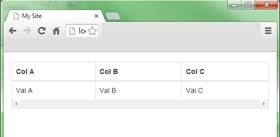
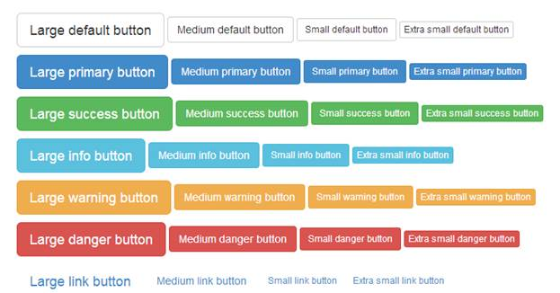
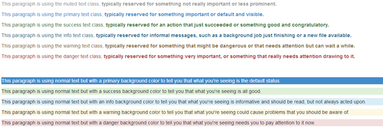
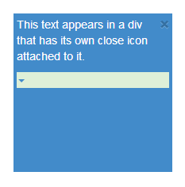
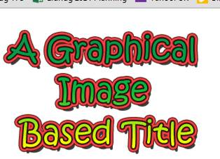
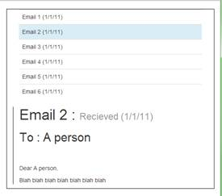
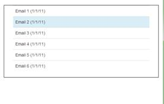

# 第三章改变的 CSS 特性

到目前为止，您已经看到了 Bootstrap 第 3 版中提供的许多新的 CSS 特性。在本章中，我们将更详细地讨论哪些是新的，哪些不是。

在许多情况下，这些新类只是旧类的重命名，但是我们在这里将它们视为新类，以便您可以轻松地进行区分。

## 版式更改

构成 BS3 排版部分的各种类并没有像其他一些元素那样改变太多。标签`H1`到`H6`仍然像在 v2 中一样处理，除此之外，您现在可以在任何标题元素中使用`<small>`，而不必首先使用`page-header`类将其包装在`div`中。这意味着现在没有额外的标记，除非您希望您的块标题用不同的段落边距加下划线。

代码示例 10:英国标准 V2 页面标题

```html
          <div class="page-header">
            <h1>This is my super web page <small>It's the best there is</small></h1>
          </div>

```

在 v2 中，你别无选择，只能将你的`H1`包装在一个页眉 div 中，因为这是小标签输出整齐排列的唯一方式。这一点现在已经得到了纠正，也适用于所有级别的标题，而不仅仅是前三个。

代码示例 11: BS V3 页面标题

```html
          <h1>This is my super web page <small>it's the best there is</small></h1>

```

继续，标准正文复制类没有变化，保持默认大小为 14 像素，行高约为 1.4。

正文复制会自动应用于段落标记中的所有文本，因此不需要任何类，除非您想要使用一些特殊功能(我们很快就会看到)。

引导正文副本(类名为`lead`的段落)的名称或样式也没有变化，与 v2 一样，旨在使您的开头段落比其他常规正文副本更有重点。结合这三个 CSS 规则，您可能会看到如下内容:

代码示例 12:标题和正文示例

```html
          <div class="container">
            <div class="page-header">
              <h1>This is my super webpage <small>It's the best there is</small></h1>
            </div>

            <p class="lead">Welcome to my super-duper webpage, there's no other webpage like it in the whole world, my page is the best thing on the Internet that you should visit</p>
            <p>On this fantastic page I have text and some more text, and there's even some text for you to read, as well as a nice looking page title</p>
          </div>

```

在浏览器中呈现时，它应该如下所示:


图 1:代码示例 12 的输出

`<small>`标签现在也可以单独使用，因为它的样式现在可以在使用它的上下文中正确处理和应用，所以无论父标签是什么，它的样式都将跟随它在文档中的位置。

同样，粗体文本仍然使用`<strong>`标签创建，斜体使用`<em>`标签创建；与许多排版类一样，这与 v2 框架没有什么不同。

对齐类也保持它们相同的类名`text-left`、`text-center`、`text-right`和`text-justify`，并且仍然执行与本书之前的 BS2 书中描述的相同功能。

同样，缩写仍然使用`<abbr>`标签创建，其中`title`属性作为缩写的完整描述。有一个新的类，`initialism`，可以添加到缩写标签中，并使渲染输出的外观和感觉比周围的文本略小。

地址(使用`<address>`标记)和块引号(使用`<blockquote>`标记)在框架的 v2 和 v3 之间的 CSS 或基本规则中也没有变化。

印刷类别中剩下的最后几个标签包括`<code>`，用于创建内联代码示例。同样，这也没有发生任何变化，它的预期用途仍然是用于与常规正文一致的代码示例。

对于必须保持缩进和回车格式的代码样本(或任何纯文本)，您仍然应该使用`<pre>`标记；同样，这里的样式没有从 v2 改变，使用这个标签的布局应该仍然像预期的那样。

最后一个排版元素是添加了一个名为`<kbd>`的新元素。

这个新标签的目的是以一种方式显示文本，表明用户应该以某种方式将信息输入计算机，通常是通过键入信息。

例如:

代码示例 13:“`”标记示例`

```html
          <p>Open up a command prompt by typing <kbd>cmd</kbd> into the box and clicking on the button market 'Run', when it opens type in <kbd>myprogram</kbd> and press enter, at which point the app should run</p>

```

当呈现在一个 HTML 文档中时，应该看起来像下面这样:


图 2:代码示例 13 产生的输出

## 列表更改

一般由`<ul>,` `<ol>`、`<dl>`元素组成的正常列表元素没有变化；布局仍然和 BS2 中一样，不需要额外的类。还要注意的是，定义列表的`list-unstyled`、`list-inline`以及`dl-horizontal`类在 BS3 中也保持不变，并且具有与 BS2 中相同的行为。

然而，列表元素中有一些变化，但是由于这些变化发生在用于创建菜单和导航列表的专家类中，我们将在下一章中讨论导航元素的变化时涵盖这些变化。

## 表格变更

通过创建一个标准的`<table>`排列，然后向标记中添加一个`table`类，表格仍然像在 BS2 中一样被设计。如同在 BS2 中一样，表应该总是使用全范围的`<table>`、`<thead>`和`<tbody>` HTML 元素来构建，如下例所示:

代码示例 14:标记一个由引导使用的表

```html
          <table class="table">
            <thead>
              <tr>
                <th>Col A</th>
                <th>Col B</th>
                <th>Col C</th>
              </tr>
            </thead>
            <tbody>
              <tr>
                <td>Val A</td>
                <td>Val B</td>
                <td>Val C</td>
              </tr>
              <tr>
                <td>Val A</td>
                <td>Val B</td>
                <td>Val C</td>
              </tr>
            </tbody>
          </table>

```

这个标记应该给你以下信息:


图 3:代码示例 14 产生的输出

与 BS2 一样，向表中添加可选样式的类`table-striped`、`table-bordered`、`table-hover`和`table-condensed`的工作方式与 BS2 完全相同；这些额外的类作为辅助类添加到 table 元素本身的主表类中。

```html
          <table class="table table-striped table-bordered">

```

例如，这段代码将为您提供一个表格，该表格的每一行都有外部边框和交替的颜色。

然而，有一点需要注意的是，表分条现在使用了`:nth-child`伪选择器，这意味着如果没有聚合填充或其他修补程序的帮助，它将不再在 IE8 或更早版本中工作。

用于为表格行着色的其余表格类略有变化。首先有一个新的类叫做`active`。在 BS3 之前，`active`类不是在所有元素上都可用，而主要只是在导航和按钮元素上可用。从 BS3 开始，它现在可以应用于一个`<tr>`元素，以高亮显示该行，默认为浅灰色。

与 BS2 一样，其余的上下文类旨在突出显示表行，以显示不同的条件，除了一个小的变化之外，它们是相同的。

代表危险或负面行为的类名已更名为`danger`。在 BS2 中，红色班级被命名为`error`。除此之外，类以相同的方式应用于`<tr>`元素，如下代码所示:

代码示例 15:可选行颜色

```html
          <table class="table">
            <thead>
              <tr>
                <th>Class</th>
                <th>Col B</th>
                <th>Col C</th>
              </tr>
            </thead>
            <tbody>
              <tr class="active">
                <td>Active</td>
                <td>Val B</td>
                <td>Val C</td>
              </tr>
              <tr class="success">
                <td>Success</td>
                <td>Val B</td>
                <td>Val C</td>
              </tr>
              <tr class="info">
                <td>Info</td>
                <td>Val B</td>
                <td>Val C</td>
              </tr>
              <tr class="warning">
                <td>Warning</td>
                <td>Val B</td>
                <td>Val C</td>
              </tr>
              <tr class="danger">
                <td>Danger</td>
                <td>Val B</td>
                <td>Val C</td>
              </tr>
            </tbody>
          </table>

```

渲染时，它应该看起来像这样:


图 4:代码示例 15 产生的输出

用于支持表的类有两个新的增加。首先，有一个新的响应类，它考虑了网格系统的大小，并提供垂直滚动条或重新排列的表格来适应不同大小的显示。其次，可以在单个单元格上使用前面提到的彩色行类，而不是像 BS2 中那样只使用整行。

要在单元格级别使用着色类，您只需将这些类添加到各个`<td>`或`<th>`元素中，如下所示:

代码示例 16:将选项行类应用于单个单元格

```html
          <table class="table">
            <thead>
              <tr>
                <th class="active">Class</th>
                <th class="success">Col B</th>
                <th class="info">Col C</th>
              </tr>
            </thead>
            <tbody>
              <tr>
                <td class="warning">Val A</td>
                <td class="danger">Val B</td>
                <td>Val C</td>
              </tr>
            </tbody>
          </table>

```

该代码应导致以下结果:


图 5:代码示例 16 生成的输出

最后一个与表格相关的添加是一个名为`table-responsive`的类，您可以通过将它应用于如下包装整个`<table>`的`<div>`元素来使用它:

代码示例 17:新的 BS3 响应表示例

```html
          <div class="table-responsive">
            <table class="table table-bordered">
              <thead>
                <tr>
                  <th>Col A</th>
                 <th>Col B</th>
                 <th>Col C</th>
                </tr>
              </thead>
              <tbody>
                <tr>
                 <td>Val A</td>
                 <td>Val B</td>
                 <td>Val C</td>
                </tr>
              </tbody>
            </table>
          </div>

```

当在大于 768 像素的显示器上使用这个新类别时(也就是说，使用除`*-xs-*)`以外的尺寸类别的任何显示器)，表格显示将表现得像正常的引导响应表格。但是，如果表格显示在以`*-xs-*`类为目标且小于 768 像素的设备上，容器将被更改，以便可以进行垂直滚动，从而允许整个表格左右移动，而不会影响页面的其余部分。


图 6:宽度大于 768 像素的设备上代码示例 17 的输出



图 7:宽度小于 768 像素的设备上代码示例 17 的输出

## 形态变化

与 BS2 一样，默认情况下，所有标准表单元素都有最低级别的标记，这为它们提供了基本样式。这意味着只需标记一个普通的表单标签和相关的控件，就可以为您的表单提供默认的 Bootstrap 外观。

举以下例子:

代码示例 18:不带类的基本 BS3 表单示例

```html
          <form>
            <div>
              <label for="exampleInputEmail1">Email address</label>
              <input type="email" id="exampleInputEmail1" placeholder="Enter email">
            </div>
            <div>
              <label for="exampleInputPassword1">Password</label>
              <input type="password" id="exampleInputPassword1" placeholder="Password">
            </div>
            <div>
              <label for="exampleInputFile">File input</label>
              <input type="file" id="exampleInputFile">
              <p>Example block-level help text here.</p>
            </div>
            <div>
              <label>
                <input type="checkbox"> Check me out
              </label>
            </div>
            <button type="submit">Submit</button>
          </form>

```

如果我们在浏览器中渲染这个例子，我们会看到我们得到了一个相当好的输出，而没有添加任何额外的类，如下图所示:


|  | 注意:自从上一个例子写完之后，对 BS3 代码做了一个小的更新。如果您尝试这里所写的示例，输出可能不会像预期的那样。在 BS3 中所做的改变现在似乎意味着仅仅标记一个没有任何 BS3 类的表单不会给表单带来一致的外观和感觉。我在本书中留下了这个例子，因为它与文档网站上仍然存在的信息一致，因此似乎仍然是框架作者的官方建议。 |

正如我在迁移部分提到的，当涉及到类名更改时，围绕 HTML 表单的类和组件是最大的受害者，但这是有充分理由的。

在 BS3 之前，许多用于表单的类在范围上非常狭窄——有单独的类用于许多单独的目的，而不是一个包含许多基础的类。例如，有单独的类来处理复选框和单选按钮的对齐，还有单独的类来处理输入框和文本区域的行对齐。

在 BS3 中，许多这样的类已经被删除，现在都被汇总在更少的类和元素下。

以我们前面的例子为例，并添加如 BS3 文档中所示的推荐标记，我们会得到以下结果:

代码示例 19:添加了推荐类的示例 18 中的基本 BS3 表单

```html
          <form role="form">
            <div class="form-group">
              <label for="exampleInputEmail1">Email address</label>
              <input type="email" class="form-control" id="exampleInputEmail1" placeholder="Enter email">
            </div>
            <div class="form-group">
              <label for="exampleInputPassword1">Password</label>
              <input type="password" class="form-control" id="exampleInputPassword1" placeholder="Password">
            </div>
            <div class="form-group">
              <label for="exampleInputFile">File input</label>
              <input type="file" id="exampleInputFile">
              <p class="help-block">Example block-level help text here.</p>
            </div>
            <div class="checkbox">
              <label>
                <input type="checkbox"> Check me out
              </label>
            </div>
            <button type="submit" class="btn btn-default">Submit</button>
          </form>

```

从外部来看，如果您呈现这段代码，您将不会看到为示例 18 生成的输出有什么不同。但是，在内部，Bootstrap 现在可以比以前更容易地找到和处理单个元素。

在 BS2 中，没有对控件进行分组的要求，除非您想使用自动验证类。使用它们仍然没有绝对的要求，但是这样做允许基站在使用其网格时(以及其他许多事情)正确地调整大小和重新定位东西。您还会注意到，每个控件现在只分配了一个`form-control`类，而不是许多针对不同方面的不同类。

还要注意的是，表单标签本身现在已经分配了一个`role`。这除了是一个很好的实践之外，现在还被 BS3 强制执行，以帮助 aria 角色和标准指导残疾人使用网络应用。

最后，如果您查看带有`help-block`的`<p>`标签，您会注意到它现在在所有情况下也用于内联表单文本，而在 BS2 中我们有许多不同的类，例如`form-info`。

不幸的是，在表单支持中仍然缺少一个领域——文件上传控件。像 BS2 一样，这是因为当前所有浏览器中的安全性限制了设置文件输入控件的样式以匹配其余可用输入控件的能力。

然而，正如我在上一本书中提到的，仍然有第三方添加了这个领域，并且因为您现在可以使用 HTML5 类来制造您自己的上传系统，严格来说，您不需要文件上传控制——您可以制造您自己的。

在 BS2 中有许多特定的表单类型，例如`search-form`；在 BS3 下，所有这些都被归纳成三种主要的形式。首先，你有标准的表格；正如我们所看到的，这是一个普通的表单，表单标签中没有添加额外的类。另外两种形式是`form-inline`和`form-horizontal`。

`form-inline`类是为菜单和导航栏等高度有限的小地方的表单设计的。不过要提醒一句:默认情况下，这个类和其他表单类型中的所有输入元素都是 100%大小的，所以如果您需要表单只占用少量空间(尤其是在`nav bar`表单中)，您需要手动调整各个控件的大小。

在代码示例 19 的示例中，依次添加`form-inline`或`form-horizontal`应该会将您的基本表单布局更改为如下所示:


图 8:代码示例 19 生成的表单，表单标签中添加了`form-inline`类。

`form-horizontal`类用于创建常规的自上而下的表单，输入控件的相关标签位于表单左侧，而不是像默认表单那样位于上方。但是，请注意，为了让 form horizontal 正常工作，您通常需要向表单添加一些额外的标记，如下面的代码示例所示。

|  | 注意:在今天 HTML 5 的美丽新世界中，用相关的标签正确标记输入元素比以往任何时候都更重要。因为处于不利地位的用户可能会使用辅助工具来帮助他们，所以不提供必要的部件来使这些辅助工具正常工作，从长远来看，将被视为一件坏事，而将它们留下的公司可能会因此而被避开。不过不用担心——BS3 已经为您提供了保障。如果您决定不在表单中使用标签，可以用一个可选类 sr-only 来标记它们。添加此类将从视觉上防止标签或相关的帮助文本出现在您的文档中，但将确保它以屏幕阅读器和其他类似设备或软件可见的方式进行标记。 |

代码示例 20:示例 19 中的代码标记了额外的类以支持横向形式

```html
          <form role="form" class="form-horizontal">
            <div class="form-group">
              <label for="exampleInputEmail1" class="col-sm-2 control-label">Email address</label>
              <div class="col-sm-10">
                <input type="email" class="form-control" id="exampleInputEmail1" placeholder="Enter email">
              </div>
            </div>
            <div class="form-group">
              <label for="exampleInputPassword1" class="col-sm-2 control-label">Password</label>
              <div class="col-sm-10">
                <input type="password" class="form-control" id="exampleInputPassword1" placeholder="Password">
              </div>
            </div>
            <div class="form-group">
              <label for="exampleInputFile" class="col-sm-2 control-label">File input</label>
              <div class="col-sm-10">
                <input type="file" id="exampleInputFile">
                <p class="help-block">Example block-level help text here.</p>
              </div>
            </div>
            <div class="form-group">
              <div class="col-sm-offset-2 col-sm-10">
                <div class="checkbox">
                  <label>
                    <input type="checkbox"> Remember me
                  </label>
                </div>
              </div>
            </div>
            <div class="form-group">
              <div class="col-sm-offset-2 col-sm-10">
                <button type="submit" class="btn btn-default">Sign in</button>
              </div>
            </div>
          </form>

```

如果在浏览器中呈现此示例中的代码，它应该如下所示:


图 9:代码示例 20 显示的输出，显示了标记为水平的表单。

从示例 20 的代码中可以看出，额外的标记其实并不多，大部分标记的存在只是为了正确排列列，以便一切都很好。

样本 20 中需要注意的要点是:

1.  所有标签控件现在都添加了一个类`control-label`。对于其他表单类型，这不是必需的，BS2 将简单地忽略它。
2.  任何可能呈现为块级元素的输入控件现在都被包装在父级`<div>`中，以便使用网格系统控制其宽度。
3.  `form-horizontal`的额外类应用于最外层的表单标签。

对于 BS3 的表单部分中的其余类和相关部分，除了到目前为止提到的类之外，没有什么发生变化。但是，从实际应用的角度来看，输入控件现在必须有一个正确的类型才能进行样式化。这意味着至少你必须至少有`type="text"`让 BS3 发挥它的魔力。

但是，强烈建议您使用正确的类型。当我们到达验证组时，您将很快看到，拥有正确的类型将允许大多数验证工作实际上正确进行，而无需对您的标记进行任何更改。

与 BS2 中一样，默认情况下，复选框和单选按钮是堆叠的。如果你想让它们在屏幕上垂直渲染，你需要使用`checkbox-inline`和`radio-inline`类，如下所示:

代码示例 21:BS3 中的内嵌复选框和单选按钮

```html
          <div class="row">         
            <label class="checkbox-inline">
              <input type="checkbox" id="inlineCheckbox1" value="option1"> 1
            </label>
            <label class="checkbox-inline">
              <input type="checkbox" id="inlineCheckbox2" value="option2"> 2
            </label>
            <label class="checkbox-inline">
              <input type="checkbox" id="inlineCheckbox3" value="option3"> 3
            </label>
          </div>
          <div class="row">
            <label class="radio-inline">
              <input type="radio" id="inlineRadio" value="option1"> 1
            </label>
            <label class="radio-inline">
              <input type="radio" id="inlineRadio" value="option2"> 2
            </label>
            <label class="radio-inline">
              <input type="radio" id="inlineRadio" value="option3"> 3
            </label>
          </div>

```

在浏览器中呈现示例 21 应该如下所示:


图 10:样本 21 产生的输出

选择框和多选框仅通过使用现有的元素来标记标准样式；这与 BS2 没有什么不同，在 BS2 中，这些元素的标记和样式是相同的。

BS3 中引入的一种新风格是静态控制风格。在 BS2 中，您经常不得不使用禁用的表单控件来表示无法更改的静态表单数据。BS3 通过提供一个可应用于单个控件的`form-control-static`类来代替常规的`form-control`，从而改变了这一点，如下代码所示:

代码示例 22:如何在 BS3 中创建静态输入组件

```html
          <form class="form-horizontal" role="form">
            <div class="form-group">
              <label class="col-sm-2 control-label">Email</label>
              <div class="col-sm-10">
                <p class="form-control-static">email@example.com</p>
              </div>
            </div>
            <div class="form-group">
              <label for="inputPassword" class="col-sm-2 control-label">Password</label>
              <div class="col-sm-10">
                <input type="password" class="form-control" id="inputPassword" placeholder="Password">
              </div>
            </div>
          </form>

```

当在浏览器中呈现时，这将生成一个常规的表单布局，静态控件被明确标记为不可编辑或看起来像输入控件，如下图所示:


图 11:代码示例 22 生成的带有静态字段的表单

表单控件的禁用样式仍然以与 BS2 相同的方式标记和使用，只需向输入元素添加“禁用”属性，如下所示:

```html
          <input class="form-control" id="disabledInput" type="text" placeholder="Disabled input here..." disabled>

```

这将产生典型的禁用和着色控件外观，如下所示:


图 12:BS2 和 BS3 中经典的禁用控制外观

如果您将`disabled`属性添加到窗体周围的字段集，该组中的所有控件将使用相同的样式同时被禁用。这是在 BS2 中没有发生的事情——相反，您必须标记每个单独的控件。

关于表单主题，我想提到的最后一件事是验证和焦点类。正如我之前提到的，在 HTML5 元素中添加正确的输入类型确实有助于您使用验证类。为什么会这样？

除了有专用的类名和样式供您使用之外，验证类还挂钩了新的 HTML5 伪元素，如`focus:`、`error:`等。

这意味着，如果你将一个文本框标记为`type="email"`，然后在提交时不在其中输入电子邮件地址，浏览器应该会自动为你高亮显示红色字段。

如果没有，或者您有其他方法使您的验证工作，那么您可以简单地在表单组上使用`has-success`、`has-warning`和`has-error`类，如下代码所示:

代码示例 23:在 BS3 中标记表单以使用验证类

```html
          <form role="form">
            <div class="form-group has-success">
            <label class="control-label" for="inputSuccess1">Label for Form group that has-success</label>
              <input type="text" class="form-control" id="inputSuccess1" value="Some successful text">
              <p class="help-block">Successful block-level help text here.</p>
            </div>
            <div class="form-group has-warning">
              <label class="control-label" for="inputWarning1">Label for Form group that has-warning</label>
              <input type="text" class="form-control" id="inputWarning1" value="Some warning text">
              <p class="help-block">Warning block-level help text here.</p>
            </div>
            <div class="form-group has-error">
              <label class="control-label" for="inputError1">Label for Form group that has-error</label>
              <input type="text" class="form-control" id="inputError1" value="Some error text">
              <p class="help-block">Error block-level help text here.</p>
            </div>
          </form>

```

如果在浏览器中呈现这些代码，您应该会看到如下内容:


图 13:代码示例 23 产生的输出

需要注意的是，我已经将类添加到表单组中，以便产生静态显示；但是，您也应该尝试用正确的输入类型来标记表单。

我发现浏览器对伪类的支持仍然有点不完整，尽管在 BS3 文档中没有提到它，所以我建议您在使用 JavaScript 操作元素时也使用类名。

还要注意，标签和块级帮助文本也采用组的正确颜色，因此您不需要将颜色或样式分别添加到表单控件组中。请记住，`form-group`部分还可以使用我们到目前为止提到的所有其他内容，根据需要在分组的基础上禁用、着色和调整表单元素的大小。

对于验证组，最后要提到的是，您还可以直接在表单控件中提供可选的反馈图标，以帮助处理状态。

您可以通过在应该使用它的输入元素之后立即提供一个 span 元素来实现这一点。这个 span 元素应用了常见的图标类(我们将在下一章中看到)，还有一个类`form-control-feedback`。这必须放在输入控件之后，输入组中的任何其他标记之前，这是由于控件被重新定位以使其出现在控件中的方式。一旦添加了 span，还需要在表单组类列表中添加一个`has-feedback`类，与其他用于显示验证状态的`has-xxxxx`类并列。

如果我们扩展代码示例 23 来考虑这一点并添加反馈图标，它应该是这样的:

代码示例 24:示例 23，已更改为添加反馈图标

```html
          <form role="form">
          <div class="form-group has-success has-feedback">
            <label class="control-label" for="inputSuccess1">Label for Form group that has-success</label>
            <input type="text" class="form-control" id="inputSuccess1" value="Some successfull text">
            <span class="glyphicon glyphicon-ok form-control-feedback"></span>
            <p class="help-block">Successful block-level help text here.</p>
          </div>
          <div class="form-group has-warning has-feedback">
            <label class="control-label" for="inputWarning1">Label for Form group that has-warning</label>
            <input type="text" class="form-control" id="inputWarning1" value="Some warning text">
            <span class="glyphicon glyphicon-warning-sign form-control-feedback"></span>
            <p class="help-block">Warning block-level help text here.</p>
          </div>
          <div class="form-group has-error has-feedback">
            <label class="control-label" for="inputError1">Label for Form group that has-error</label>
            <input type="text" class="form-control" id="inputError1" value="Some error text">
            <span class="glyphicon glyphicon-remove form-control-feedback"></span>
            <p class="help-block">Error block-level help text here.</p>
          </div>
          </form>

```

一旦我们使用这些更改重新渲染，您应该会看到以下内容:


图 14:代码示例 24 生成的输出

## 按钮变化

在 BS3 中，用于为按钮设置样式的类中最突出的变化是默认样式。在 BS2 下，简单地将`btn`类添加到 type button 的输入元素中，或者添加到锚点标签中，会给控件默认的按钮外观。

从 BS3 开始，你现在明确要加`btn-default`；只是自行添加`btn`现在将不再有任何效果。

第二个主要变化是一些基类的重命名。具体来说，`btn-error`已经被重命名为`btn-danger`，这样命名方案就与其他类似命名的类变化相匹配，并给引导库带来一致性。

除此之外，基本按钮类保持不变，如下面的代码示例所示:

代码示例 25: BS3 按钮类

```html
          <button type="button" class="btn btn-default">Default</button>
          <button type="button" class="btn btn-primary">Primary</button>
          <button type="button" class="btn btn-success">Success</button>
          <button type="button" class="btn btn-info">Info</button>
          <button type="button" class="btn btn-warning">Warning</button>
          <button type="button" class="btn btn-danger">Danger</button>
          <button type="button" class="btn btn-link">Link</button>

```

当在浏览器中渲染时，您将看到 BS3 现在控件的普通平面按钮外观:


图 15:由代码示例 25 产生的引导按钮

button 元素有几个新的类，添加这些类是为了给网格大小调整类带来统一性。这些类是`btn-lg`、`btn-sm`、`btn-xs`；没有`btn-md`，因为中型按钮是没有指定类别时使用的标准尺寸。

下面的代码示例演示了不同大小的所有按钮样式:

代码示例 26:所有不同尺寸的 BS3 按钮样式

```html
          <p>
            <button type="button" class="btn btn-default btn-lg">Large default button</button>
            <button type="button" class="btn btn-default">Medium default button</button>
            <button type="button" class="btn btn-default btn-sm">Small default button</button>
            <button type="button" class="btn btn-default btn-xs">Extra small default button</button>
          </p>
          <p>
            <button type="button" class="btn btn-primary btn-lg">Large primary button</button>
            <button type="button" class="btn btn-primary">Medium primary button</button>
            <button type="button" class="btn btn-primary btn-sm">Small primary button</button>
            <button type="button" class="btn btn-primary btn-xs">Extra small primary button</button>
          </p>
          <p>
            <button type="button" class="btn btn-success btn-lg">Large success button</button>
            <button type="button" class="btn btn-success">Medium success button</button>
            <button type="button" class="btn btn-success btn-sm">Small success button</button>
            <button type="button" class="btn btn-success btn-xs">Extra small success button</button>
          </p>
          <p>
            <button type="button" class="btn btn-info btn-lg">Large info button</button>
            <button type="button" class="btn btn-info">Medium info button</button>
            <button type="button" class="btn btn-info btn-sm">Small info button</button>
            <button type="button" class="btn btn-info btn-xs">Extra small info button</button>
          </p>
          <p>
            <button type="button" class="btn btn-warning btn-lg">Large warning button</button>
            <button type="button" class="btn btn-warning">Medium warning button</button>
            <button type="button" class="btn btn-warning btn-sm">Small warning button</button>
            <button type="button" class="btn btn-warning btn-xs">Extra small warning button</button>
          </p>
          <p>
            <button type="button" class="btn btn-danger btn-lg">Large danger button</button>
            <button type="button" class="btn btn-danger">Medium danger button</button>
            <button type="button" class="btn btn-danger btn-sm">Small danger button</button>
            <button type="button" class="btn btn-danger btn-xs">Extra small danger button</button>
          </p>
          <p>
            <button type="button" class="btn btn-link btn-lg">Large link button</button>
            <button type="button" class="btn btn-link">Medium link button</button>
            <button type="button" class="btn btn-link btn-sm">Small link button</button>
            <button type="button" class="btn btn-link btn-xs">Extra small link button</button>
          </p>

```

当在浏览器中呈现时，该代码示例应该给出以下输出:



图 16:代码示例 26 产生的输出

当您将类`btn-block`添加到使用任何以前的按钮类进行样式化的按钮或锚点元素时，该按钮将拉伸以填充 100%的可用空间。这在使用 BS3 网格系统生成对话框和调整控件大小时非常有用，因为它允许您专门调整按钮(和其他元素)的大小，以在表单设计中保持良好的平衡。

在大多数情况下，您不需要自己设置按钮的活动状态，但是如果您这样做了，您可以轻松地将`active`类添加到使用按钮类标记的任何元素中。`Active`一般情况下(至少在`<button>`元素上)通常使用`:active`伪选择器来改变按钮的样式。但是，添加`active`类将强制按钮显示其活动状态。

|  | 注意:如果您正在考虑使用`active`状态来创建粘性按钮，请注意，在接下来的章节中，我们将使用可用的组件和 JavaScript 工具来讨论按钮状态。BS3 使用这些设施中可用的附加功能提供了这样一个粘性按钮，因此在大多数情况下，您不需要使用`active`创建自己的粘性按钮。 |

您还可以禁用您的按钮，并使用我们之前在表单元素中讨论的相同的“禁用”类和属性将它们标记为非活动的。

以下代码显示了标记为活动和禁用状态的按钮:

代码示例 27: BS3 激活和禁用按钮

```html
          <p>
            <button type="button" class="btn btn-primary active">Active primary button</button>
            <button type="button" class="btn btn-default active">Active default button</button>
          </p>
          <p>
            <button type="button" class="btn btn-primary" disabled="disabled">Disabled primary button</button>
            <button type="button" class="btn btn-default" disabled="disabled">Disabled default button</button>
          </p>

```


图 17:代码示例 27 产生的输出

但是，请注意，在锚点按钮的情况下，`disabled`元素/类不会禁用链接；为了确保禁用状态锚点链接不会触发，您将需要使用自定义 JavaScript。

为此，BS3 团队建议您在可能的情况下使用`<button>`元素标记按钮，仅在特定情况下使用锚点标签。

我们也不要忘记“幂等性”这个主题，以及使用按钮代替锚点的重要性。一般来说，如果目的地是 get 请求，锚定链接是合适的，多次链接不会因为重复激活而导致任何问题；否则，使用按钮。

## 图像变化

就不起眼的图像标签而言，CSS 的变化并不像 BS3 中的其他地方那样深远。以前，默认情况下图像是不响应的，就像 BS2 中的许多东西一样，您必须添加可选的响应类才能对它们做出响应。

不幸的是，即使在您添加了可选的响应类之后，事情仍然不是完美的；许多人列举了使用谷歌地图的页面的问题，以及其他问题。

BS3 改变了这一切。现在，默认情况下，图像通过使用``标签完全响应。为了扩展并使响应更加流畅，您可以将`img-responsive`添加到任何``标签中，以确保即使在正确缩放时，图像的高度和宽度也保持彼此成比例。

除此之外，对图像部分所做的唯一其他更改是将`img-polaroid`类的名称(用于生成缩略图)更改为`img-thumbnail`，这样它就与整个库的其他类似重命名保持一致。

BS2 类`img-rounded`和`img-circle`仍然像以前一样工作，给出圆形和圆角矩形缩略图效果。

## 辅助和可见性变化

最后，我们来看看那些不适合任何特定类别的变化。

在 BS2 的排版类中，您最初被引入了一组颜色类，用于将文本元素的颜色设置为框架中其他元素使用的相同品牌颜色。

BS3 更进一步，引入了上下文背景使用相同颜色的概念。

在这种情况下，背景是一个较轻的变化，如在其他地方的面板和警告框中使用的。还有一个额外的好处:如果你在锚点标签和其他默认设置了悬停的东西上使用这些上下文颜色类，颜色会自动稍微变暗，以显示它们已经悬停在上面了。

与其他基于颜色的类中的命名一样，这里可用的类是`text-muted`、`text-primary`、`text-success`、`text-info`、`text-warning`和`text-danger`，用于段落、跨度和其他内联或基于块的文本元素。

背景色类名称为`bg-primary`、`bg-success`、`bg-info`、`bg-warning`、`bg-danger`。

下面的代码显示了使用它们的示例:

代码示例 28: BS3 上下文颜色类

```html
          <p class="text-muted">This paragraph is using the muted text class, <strong>typically reserved for something not really important or less prominent.</strong></p>
          <p class="text-primary">This paragraph is using the primary text class, <strong>typically reserved for something important or default and visible.</strong></p>
          <p class="text-success">This paragraph is using the success text class, <strong>typically reserved for an action that just succeeded or something good and congratulatory.</strong></p>
          <p class="text-info">This paragraph is using the info text class, <strong>typically reserved for informal messages, such as a background job just finishing or a new file available.</strong></p>
          <p class="text-warning">This paragraph is using the warning text class, <strong>typically reserved for something that might be dangerous or that needs attention but can wait a while.</strong></p>
          <p class="text-danger">This paragraph is using the danger text class, <strong>typically reserved for something very important, or something that really needs attention drawing to it.</strong></p>       
          <br/><br/>

          <p class="bg-primary">This paragraph is using normal text but with a primary background color to tell you that what you're seeing is the default status.</p>
          <p class="bg-success">This paragraph is using normal text but with a success background color to tell you that what you're seeing is all good.</p>
          <p class="bg-info">This paragraph is using normal text but with an info background color to tell you that what you're seeing is informative and should be read, but not always acted upon.</p>
          <p class="bg-warning">This paragraph is using normal text but with a warning background color to tell you that what you're seeing could cause problems that you should be aware of.</p>
          <p class="bg-danger">This paragraph is using normal text but with a danger background color to tell you that what you're seeing needs you to pay attention to it now.</p>

```



图 18:代码示例 28 产生的输出

有一件事在 BS3 中被注意到是需要的，而在 BS2 中没有，那就是一个专门的`caret`类，用于按钮和其他屏幕设备上的下拉指示器。

现在，您可以在自己的元素上利用这一点，方法是在外部容器中添加一个类名`caret`——一个包装您的内部内容的`<span>`或`<div>`。

BS3 中的另一个新增加，虽然实际上不是一个类，但仍然值得一提:对话框关闭交叉。

就像`caret`一样，这在 BS2 中也有，但是不能在模态对话框和警告栏中单独使用。然而，从 BS3 开始，你可以单独使用它。

以下代码示例显示了通用标记中的`caret`类和闭合交叉的示例:

代码示例 29:使用 BS3 插入符号和关闭交叉助手

```html
          <div class="bg-primary" style="width: 200px; height: 200px; padding: 4px;">
            <button type="button" class="close" aria-hidden="true">&times;</button>
            <p>This text appears in a div that has its own close icon attached to it.</p>
            <div class="bg-success text-primary"><div class="caret" /></div>
          </div>

```



图 19:代码示例 29 的输出

就像在 BS2 中一样，快速浮动实用程序类`pull-left`和`pull-right`仍然存在，但是它们现在被`center-block`和`clearfix`连接在一起，前者简单地使边距自动并使元素在其父元素中居中，后者清除您可能正在使用的任何浮动，从而恢复正常的文档流。

其他新的职业包括`show`、`hidden`和`invisible`职业。`Show`很能说明问题，但后两者有什么区别？`Hidden`物理折叠元素所使用的空间，所以如果你有一个完整的高度 div，例如，该 div 将折叠到它的最小高度。但是如果使用`invisible`，元素会保留其空间(并且仍然在元素流中占据其位置)，但它会从视图中消失。

我们已经看到，引入了一个名为`sr-only`的新类，将一个块标记为对屏幕阅读器可见，而不是其他。现在还有一个类似这样的类，用于图形标题。

如果您使用图像横幅定义页面标题，典型的屏幕阅读器将无法分辨图像中的文本内容。很长一段时间以来，许多作者使用了一种叫做图像替换的黑客技术来解决这个问题。图像替换的工作原理是将图像横幅包装在`H1`或其他标准类型的标签中，将名称作为明文放在图像横幅旁边，然后使用 CSS 将文本移出屏幕。

接下来发生的是，在显示方面，图像横幅被视力好的人看到，但是那些使用屏幕阅读器的人听到阅读器说图像横幅中的实际文本。

BS3 现在提供了一个名为`text-hide`的类，以便于此。下面是一个简单的例子:

代码示例 30:使用 BS 文本隐藏类使屏幕阅读器友好的标题

```html
          <header>
            
            <h1 class="text-hide">A graphical image based title</h1>
          </header>

```



图 20:在普通的个人电脑浏览器中由代码示例 30 生成的输出

最后，我们来到 CSS 变更部分的最后一个。

如果没有实用程序类来帮助你管理你的响应性布局，那么一个响应性网页设计框架会有什么好处呢？

“但是等等，我们已经用网格覆盖了，”我听到你说，是的，我们已经覆盖了。但是 BS3 还有一个锦囊妙计，公平地说，它在 BS2 中是存在的，但是并没有真正发挥作用。

这额外的魔法是什么？让我向您介绍响应可见性类。

本质上，这些小宝石所做的是允许你根据你的网格和显示大小来交换和改变你的用户界面的一部分。

让我们想象一下，例如，您有一个电子邮件收件箱项目列表，当在台式电脑上查看时，每个项目旁边都有一个预览，很像经典的电子邮件阅读应用程序。大概是这样的:

| 电子邮件 1 (1/1/11) | 电子邮件 2:已收到(1/1/11)致:人亲爱的 A 人，等等等等等等 |
| 电子邮件 2 (1/1/11) |
| 电子邮件 3 (1/1/11) |
| 电子邮件 4 (1/1/11) |
| 电子邮件 5 (1/1/11) |
| 电子邮件 6 (1/1/11) |

图 21:电子邮件应用程序布局示例

现在这很好，直到你试图把它放在移动设备上，你绝对想隐藏预览窗格，只留下电子邮件列表。通常，类似这样的任务是使用一点 JavaScript 来执行的，通过改变元素的可见设置来改变元素的可见性。

BS3 有一个使用 CSS 类的内置解决方案，可以帮助您非常轻松地处理这种情况。取下面一段代码:

代码示例 31:电子邮件应用程序模型

```html
          <div class="col-md-12" style="border: 1px solid black">
            <div class="col-md-3">
              <table class="table">
                <tr>
                  <td>Email 1 (1/1/11)</td>
                </tr>
                <tr>
                  <td class="info">Email 2 (1/1/11)</td>
                </tr>
                <tr>
                  <td>Email 3 (1/1/11)</td>
                </tr>
                <tr>
                  <td>Email 4 (1/1/11)</td>
                </tr>
                <tr>
                  <td>Email 5 (1/1/11)</td>
                </tr>
                <tr>
                  <td>Email 6 (1/1/11)</td>
                </tr>
              </table>
            </div>
            <div class="col-md-9" style="border-left: 1px solid black">
              <h1>Email 2 : <small>Received (1/1/11)</small></h1>
              <h2>To : A person</h2>
              <br/>
              <br/>
              <p>Dear A person,</p>
              <p>Blah blah blah blah blah blah blah</p>
            </div>
          </div>

```

如果您在浏览器中呈现此内容，您应该会得到如下内容:


图 22:代码示例 31 生成的电子邮件应用程序模型

然而，如果你把浏览器调整到手机屏幕的大小，事情就会变得有点奇怪:



图 23:调整视图大小后的电子邮件应用程序模型

这可能对一些人有用，但总的来说，这是个坏主意。当你有 100 封未读邮件，每次都要滚动到视图底部才能阅读预览时，会发生什么？

拿着主预览`<div>`给它添加一个新的类`hidden-sm`，如下图:

```html
          <div class="col-md-9 hidden-sm" style="border-left: 1px solid black">

```

然后，如果你刷新你的浏览器并尝试调整它的大小，你应该会看到预览`<div>`现在被隐藏超过一定的宽度，而不是被堆叠。



图 24:电子邮件应用程序模型，调整了大小，但是增加了隐藏类

就像网格系统一样，有四种不同的大小，并且有类可以隐藏和显示。可见类将使有问题的元素仅在指定的屏幕尺寸下可见，隐藏类使有问题的元素仅在指定的屏幕尺寸下隐藏。类名如下:

`visible-xs` -在超小屏幕上变得可见

`visible-sm` -在小屏幕上显示

`visible-md` -在中等屏幕上可见

`visible-lg` -在超大屏幕上变得可见

`hidden-xs` -隐藏在超小屏幕上

`hidden-sm` -隐藏在小屏幕上

`hidden-md` -隐藏在中等屏幕上

`hidden-lg` -隐藏在大屏幕上

设备和相关触发点的宽度一般与网格系统中使用的相同，其中`-xs`覆盖手掌大小的平板手机和更小的平板电脑，`-sm`覆盖中大型平板电脑，- `md`覆盖大多数台式电脑，`-lg`覆盖宽屏台式机。

此类别中有两个最终类用于帮助您处理 display v 基于打印的布局。

您可以以与上面基于大小的类完全相同的方式使用`visible-print`和`hidden-print`，但是这一次当页面被发送到打印机时，使元素可见和不可见。