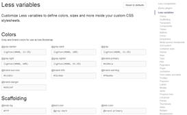
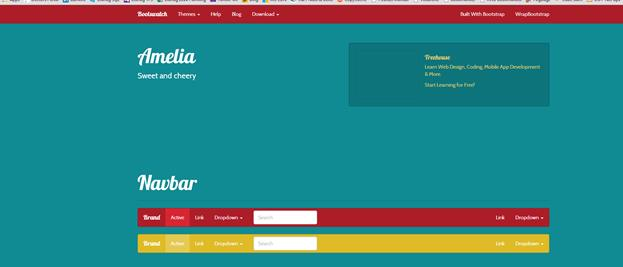

# 第 6 章定制引导 3

最后，我们进入本书的最后一章，它将向您展示如何创建自定义颜色集。

如果你回想一下开始的时候，当我们经历主要的变化时，我提到 BS 作者提供了一个额外的文件来使 BS3 看起来像 BS2，而不是使用它的平面外观。

在本书中，我们使用了默认的 BS3 平面外观，但是如果您从获取引导网站([www.getbootstrap.com](http://www.getbootstrap.com))下载 BS3 的预构建 JavaScript 版本，您会在您下载的档案中找到一个名为**引导主题. css** 的新文件。

如果您在包含核心 bootstrap.css 文件后立即将该文件链接到项目中，您会发现，即使您现在使用的是新的 BS3，您的应用程序的外观和感觉仍然类似于 BS2。

作者意识到，在新应用程序中采用 BS3 的主要障碍之一是无法以定制的方式对其进行风格化，但很容易做到。

如果你是 Less，甚至 SaSS 的用户(因为 BS3 现在有 SaSS 绑定)，那么这不是问题。您只需打开 Less 源代码，调整您需要的变量和 Mixins，并通过 Less 编译器运行事情以获得新的 CSS 脚本。

不幸的是，不是每个人都用 Less 事实上，许多开发人员和设计人员只能下载并包含普通的旧预编译 CSS 和 JavaScript 文件，因此必须找到更好的方法。

第一个变化是直接在 Bootstrap 主站点上向页面内定制工具开放整个 Less 源代码，但这并不是什么新鲜事；你以前只能有限地使用这个页面。然而，对于 BS3 来说，Less 定制工具已经有了一个彻底的改革，现在你可以重新定义 BS3 使用的所有东西，从字体大小和字体，一直到网格大小、触发点和基本的上下文颜色集。

事实上，在您决定下载新的自定义 CSS 之前，现在没有什么是不能更改的，如下图所示:



图 82:新定制工具上半部分的截图

由于工具的巨大尺寸，不可能在这本书里展示全部内容，但它足够容易访问。只需进入[www.getbootstrap.com](http://www.getbootstrap.com)，点击顶部菜单栏**自定义**。您还将看到您有许多其他选项，例如要包含哪些 JavaScript 插件和工具包，要包含哪些组件，以及您可能不想要的基本样式。

例如，如果您只想使用网格系统，而不想使用其他任何东西，那么您可以只选择网格系统，而不选择所有其他组件。

然后，BS3 站点将只生成需要包含的代码，仅此而已。对于那些抱怨所有 Bootstrap 网站看起来都一样的人来说，这是一个福音，因为这意味着你的网站绝对不必看起来和其他网站一样——你可以只使用你需要的部分，而使用你自己的东西来做其他事情。

还有两种方法可以自定义您的构建。第一种是采用额外的“引导主题”CSS 样式表，制作一个副本，然后根据需要更改样式。这不像使用定制工具那么容易，但也不像替代工具那么困难。

您想要更改以在 BS3 中标记您的个人标记的大多数类名和设置已经在 BS2 主题中分离出来了，所以最快的实验方法是简单地将一个原型页面与您想要更改的主要控件和元素放在一起，然后链接到您的 BS2 主题副本中。

如果您正在使用 Node 和类似 Bower 的东西，它会变得更加容易，因为您可以使用 live reload，然后在您调整自定义版本的主题表时，几乎实时地观察您的示例页面的变化。

第二种方式稍微复杂一些，如 BS3 文档中所述，有两种风格:轻度定制和重度定制。

灯光自定义的一个示例是向按钮元素添加上下文颜色类。例如，如果您想在`btn-info`、`btn-primary`等旁边添加`btn-sky`。类，您可以定义一个样式表来保存以下规则:

代码示例 79:轻定制，向 BS3 按钮类添加新的上下文类

```
          .btn-sky, .btn-sky:hover, .btn-sky:active
          {
            color: #000000;
            text-shadow: 0 -1px 0 rgba(0, 0, 0, 2);
            background-color: #AAD4FF;
            border: 1px solid black;
          }

          .btn-sky
          {
            background-repeat: repeat-x;
            background-image: linear-gradient(top, #00FFFF 0%, #FFFF00 100%);
          }

          .btn-sky:hover
          {
            background-position: 0 -10px;
          }

```

正确添加和链接后，它应该如下所示:


图 83:代码示例 80 的输出，用于示例 79 中的定制

以下列方式与普通按钮标签一起使用时:

```
          <button class="btn btn-sky">My Sky Button</button>

```

使用这个方法最困难的部分是遍历基本的 CSS 样式表来找到您想要覆盖的名称；其实并不难，只是啰嗦。

一旦您有了一个这样的按钮，或者您已经找到并复制出了一个警报、面板、列表或其他类，那么您就可以轻松地创建一个模板，每当您想要添加该类型的自定义类时，该模板都可以重用。

重度定制与轻度定制差别不大；主要的区别是你覆盖了整个类。

所以，比如你找到所有与`btn`相关的类，复制它们，修改它们，分别包含它们。

BS3 框架内的新架构现在意味着，一旦您知道了目标选择器及其同级，创建覆盖就很容易了。正如我已经指出的，引导主题文件已经包含了许多您无论如何都可能想要修改的内容，如果这不是一个选项，那么尝试像 Bootswatch.com 这样的网站:



图 84:来自 Bootswatch.com 的甜樱桃主题的屏幕截图

许多其他人有成千上万的主题可供选择，既有免费的，也有付费的，所以没有理由让你的引导网站看起来和其他人的一样。