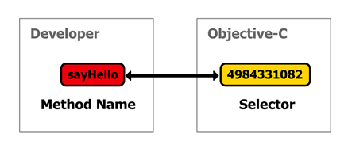
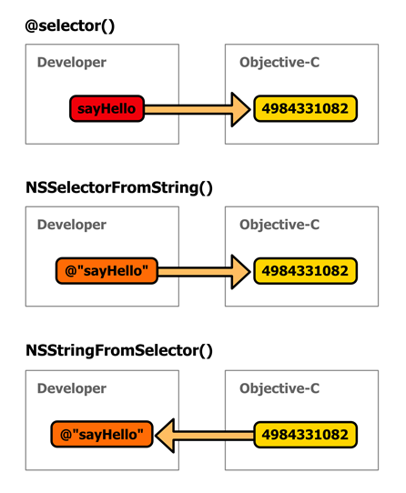

# 第五章方法

在本章中，我们将比前几章更详细地探讨 Objective-C 方法。这包括对实例方法、类方法、重要的内置方法、继承、命名约定和常见设计模式的深入讨论。

## 实例与类方法

在本书中，我们一直在使用实例和类方法，但是让我们花点时间来形式化 Objective-C 中的两大类方法:

*   **实例方法**–绑定到对象的函数。实例方法是与对象相关联的“动词”。
*   **类方法**–绑定到类本身的函数。它们不能被类的实例使用。这些类似于 C#中的静态方法。

正如我们多次看到的，实例方法由方法名称前的连字符表示，而类方法以加号作为前缀。例如，让我们来看一下我们的`Person.h`文件的简化版本:

```
    @interface Person : NSObject

    @property (copy ) NSString *name;

    - (void )sayHello;
    + (Person *)personWithName:(NSString *)name;

    @end

```

同样，相应的实现方法也需要以连字符或加号开头。因此，最小`Person.m`可能看起来像:

```
    #import "Person.h"

    @implementation Person

    @synthesize name = _name;

    - (void )sayHello {
        NSLog (@"HELLO" );
    }

    + (Person *)personWithName:(NSString *)name {
        Person *person = [[Person alloc ] init ];
        person.name = name;
        return person;
    }

    @end

```

`Person`类的*实例*可以调用`sayHello`方法，而`personWithName`方法只能由类本身调用:

```
    Person *p1 = [Person personWithName:@"Frank"];  // Class method.
    [p1 sayHello];                                  // Instance method.

```

到目前为止，您应该已经熟悉了其中的大部分内容，但是现在我们有机会谈论 Objective-C 中的一些独特约定

## 超级关键词

在任何面向对象的环境中，能够从父类访问方法是很重要的。Objective-C 使用了与 C#非常相似的方案，不同的是它使用的不是`base`，而是`super`关键字。例如，`sayHello`的以下实现将在输出面板中显示`HELLO`，然后调用父类的版本`sayHello`:

```
    - (void)sayHello {
        NSLog (@"HELLO" );
        [super sayHello];
    }

```

与 C#不同，重写方法不需要显式标记为重写方法。您将在下一节讨论的`init`和`dealloc`方法中看到这一点。即使这些是在`NSObject`类中定义的，当你在子类中创建自己的`init`和`dealloc`方法时，编译器也不会抱怨。

## 初始化方法

所有对象都需要初始化方法—新分配的对象在被调用其中一个初始化方法之前不会被视为“准备好使用”。它们是设置实例变量默认值和设置对象状态的地方。`NSObject`类定义了一个默认的`init`方法，它不会做任何事情，但是创建自己的方法通常很有用。例如，我们的`Ship`类的自定义`init`实现可以为名为`_ammo`的实例变量分配默认值:

```
    - (id)init {
        self = [super init ];
        if (self ) {
            _ammo = 1000;
        }
        return self;
    }

```

这是定义自定义`init`方法的规范方式。`self`关键字相当于 C#的`this`—它用来指代调用方法的实例，这使得对象可以向自身发送消息。如您所见，返回实例需要所有`init`方法。这使得使用`[[Ship alloc] init]`语法将实例分配给变量成为可能。还要注意的是，因为`NSObject`接口声明了`init`方法，所以不需要在`Ship.h`中添加`init`声明。

虽然像上一个示例中所示的简单`init`方法对于设置默认实例变量值很有用，但是将参数传递给初始化方法通常更方便:

```
    - (id)initWithAmmo:(unsigned int)theAmmo {
        self = [super init ];
        if (self ) {
            _ammo = theAmmo;
        }
        return self;
    }

```

#### 方法名简论

如果你来自 C#背景，你可能会对`initWithAmmo`方法名感到不舒服。您可能希望看到`Ammo`参数像`void init(uint ammo)`一样从实际的方法名称中分离出来；然而，Objective-C 方法命名基于完全不同的哲学。

回想一下，Objective-C 的目标是迫使一个 API 尽可能具有描述性，确保对于一个方法调用将要做什么绝对没有混淆。你不能把一个方法看作是一个独立于它的参数的实体——它们是一个单一的单元。这个设计决策实际上反映在 Objective-C 的实现中，它没有区分一个方法和它的参数。在内部，一个方法名实际上是*串联参数表*。

例如，考虑以下三个方法声明。注意第二个和第三个不是`NSObject`的内置方法，所以你*做*需要在实现之前把它们添加到类的接口中。

```
    - (id)init;
    - (id )initWithAmmo:(unsigned int )theAmmo;
    - (id)initWithAmmo:(unsigned int)theAmmo captain:(Person *)theCaptain;

```

虽然这看起来像方法重载，但技术上不是。这些不是`init`方法的变体——它们都是完全独立的方法，具有不同的方法名称。这些方法的名称如下:

```
    init
    initWithAmmo:
    initWithAmmo:captain:

```

这就是为什么在官方的目标-C 文档(摘自 [NSArray](http://developer.apple.com/library/ios/#Documentation/Cocoa/Reference/Foundation/Classes/NSArray_Class/NSArray.html%23//apple_ref/doc/uid/TP40003620) )中，你会看到类似`indexOfObjectWithOptions:passingTest:`和`indexOfObjectAtIndexes:options:passingTest:`的符号来指代方法。

从实践的角度来看，这意味着您的方法的第一个参数应该总是用“主”方法名来描述。像下面这样模棱两可的方法通常不被 Objective-C 程序员所接受:

```
    - (id)shoot:(Ship *)aShip;

```

相反，您应该使用介词将第一个参数包含在方法名称中，如下所示:

```
    - (id)shootOtherShip:(Ship *)aShip;

```

在方法定义中同时包含`OtherShip`和`aShip`可能看起来是多余的，但是请记住`aShip`参数仅在内部使用。调用该方法的人将编写类似`shootOtherShip:discoveryOne`的东西，其中`discoveryOne`是包含您想要拍摄的船的变量。这正是 Objective-C 开发人员所追求的冗长。

### 类初始化

除了初始化*实例*的`init`方法外，Objective-C 还提供了一种设置*类*的方法。在调用任何类方法或实例化任何对象之前，Objective-C 运行时调用所讨论类的`initialize`类方法。这让您有机会在任何人使用该类之前定义任何静态变量。最常见的用例之一是设置单件:

```
    static Ship *_sharedShip;

    + (void )initialize {
        if (self == [Ship class ]) {
            _sharedShip = [[self alloc ] init ];
        }
    }

    + (Ship *)sharedShip {
        return _sharedShip;
    }

```

在第一次调用`[Ship sharedShip]`之前，运行时会调用`[Ship initialize]`，这样就保证了单例的定义。静态变量修饰符的作用和它在 C#中的作用一样——它创建一个类级变量而不是实例变量。`initialize`方法只被调用一次，但是它在所有的超级类上都被调用，所以你必须注意不要多次初始化类级变量。这就是为什么我们包括`self == [Ship class]`条件，以确保`_shareShip`只分配到`Ship`类。

还要注意，在类方法内部，`self`关键字指的是类本身，而不是实例。所以，最后一个例子中的`[self alloc]`相当于`[Ship alloc]`。

## 解除分配方法

实例初始化方法的逻辑对应物是`dealloc`方法。当一个对象的引用计数达到零并且其底层内存即将被释放时，将对该对象调用此方法。

### 内存中的解除分配

如果您使用手动内存管理(不推荐)，您需要释放您的对象在`dealloc`方法中分配的任何实例变量。如果您没有在对象超出范围之前释放实例变量，那么您将拥有指向实例变量的悬空指针，这意味着每当类的一个实例被释放时，就会泄漏内存。例如，如果我们的`Ship`类在其`init`方法中分配了一个名为`_gun`的变量，那么您必须在`dealloc`中释放它。这在以下示例中进行了演示(`Gun.h`包含一个简单定义`Gun`类的空接口):

```
    #import "Ship.h"
    #import "Gun.h"

    @implementation Ship {
        BOOL _gunIsReady;
        Gun *_gun;
    }

    - (id )init {
        self = [super init ];
        if (self ) {
            _gun = [[Gun alloc ] init ];
        }
        return self;
    }

    - (void )dealloc {
        NSLog (@"Deallocating a Ship" );
        [_gun release ];
        [super dealloc ];
    }

    @end

```

通过创建`Ship`并释放它，您可以看到`dealloc`方法正在运行，如下所示:

```
    int main(int argc, const char * argv[]) {
        @autoreleasepool {
            Ship *ship = [[Ship alloc ] init ];
            [ship autorelease ];
            NSLog (@"Ship should still exist in autoreleasepool" );
        }
        NSLog (@"Ship should be deallocated by now" );
        return 0;
    }

```

这也演示了自动释放的对象是如何工作的。直到`@autoreleasepool`块结束才会调用`dealloc`方法，所以前面的代码应该输出以下内容:

```
    Ship should still exist in autoreleasepool
    Deallocating a Ship
    Ship should be deallocated by now

```

请注意，`main()`中的第一条`NSLog()`消息显示在之前的*和`dealloc`方法中的消息，尽管它是在*调用`autorelease`之后被调用的*。*

### 在 ARC 中解除分配

但是，如果您使用自动引用计数，您的所有实例变量将被自动解除分配，并且`[super dealloc]`也将为您调用(您永远不应该显式调用它)。所以，你唯一要担心的是非对象变量，比如用 C 的`malloc()`创建的缓冲区。

就像`init`一样，如果你的对象在发布之前不需要任何特殊处理，你就不需要实现`dealloc`方法。自动引用计数环境通常就是这种情况。

## 私有方法

C#开发人员过渡到 Objective-C 的一大障碍是明显缺乏私有方法。与 C#不同，Objective-C 类中的所有方法都可以被第三方访问；然而，有可能*模仿*私有方法的行为。

请记住，客户端只导入类的接口(即头文件)——它们永远不会看到底层实现。因此，通过在*实现*文件中添加新方法，而不将它们包含在*界面*中，我们可以有效地对其他对象隐藏方法。尽管这比“真正的”私有方法更基于约定，但本质上是相同的功能:试图调用未在接口中声明的方法将导致编译器错误。


图 25:试图调用“私有”方法

例如，假设您需要向`Ship`类添加一个私有的`prepareToShoot`方法。你所要做的就是在`Ship.h`中省略掉它，同时将其添加到`Ship.m`中:

```
    // Ship.h
    @interface Ship : NSObject

    @property (weak ) Person *captain;

    - (void )shoot;

    @end

```

这声明了一个名为`shoot`的公共方法，它将使用私有的`prepareToShoot`方法。相应的实现可能类似于:

```
    // Ship.m
    #import "Ship.h"

    @implementation Ship {
        BOOL _gunIsReady;
    }

    @synthesize captain = _captain;

    - (void )shoot {
        if (!_gunIsReady ) {
            [self prepareToShoot ];
            _gunIsReady = YES;
        }
        NSLog (@"Firing!" );
    }

    - (void )prepareToShoot {
        // Execute some private functionality.
        NSLog (@"Preparing the main weapon..." );
    }

    @end

```

从 Xcode 4.3 开始，您可以在实现中的任何地方定义私有方法*。如果在编译器看到私有方法之前就使用了它(如前一个示例)，编译器会检查实现块的其余部分是否有方法定义。在 Xcode 4.3 之前，您必须在文件中的其他地方使用私有方法*之前定义一个私有方法*，或者用一个**类扩展**对其进行前向声明。*

类扩展是**类**的特例，将在下一章中介绍。正如没有办法将方法标记为私有一样，也没有办法将方法标记为受保护；然而，正如我们将在下一章中看到的，类别为受保护的方法提供了一个强大的替代方案。

## 选择器

选择器是 Objective-C 表示方法的方式。它们允许您动态地“选择”一个对象的方法，该方法可用于在运行时引用一个方法，将一个方法传递给另一个函数，并找出一个对象是否有特定的方法。出于实用目的，您可以将选择器视为方法的替代名称。



图 26:开发人员的方法表示和目标 C 的表示

在内部，Objective-C 使用一个唯一的数字来标识程序使用的每个方法名。例如，一个叫做`sayHello`的方法可能会翻译成`4984331082`。这个标识符被称为**选择器**，对于编译器来说，这是一种比它们的完整字符串表示更有效的方法。重要的是要理解选择器只代表方法*名称—* 而不是具体的方法实现。换句话说，由`Person`类定义的`sayHello`方法与由`Ship`类定义的`sayHello`方法具有相同的选择器。

使用选择器的三个主要工具是:

*   `@selector()`–返回与源代码方法名相关联的选择器。
*   `NSSelectorFromString()`–返回与方法名的字符串表示相关联的选择器。这个函数可以在运行时定义方法名，但是效率比`@selector()`低。
*   `NSStringFromSelector()`–从选择器返回方法名的字符串表示形式。

如您所见，在 Objective-C 中有三种方法来表示方法名:作为源代码、作为字符串或作为选择器。这些转换函数如下图所示:



图 27:源代码、字符串和选择器之间的转换

选择器存储在一种特殊的数据类型中，称为`SEL`。下面的代码片段演示了上图中显示的三个转换函数的基本用法:

```
    int main(int argc, const char * argv[]) {
        @autoreleasepool {

            SEL selector = @selector (sayHello);
            NSLog (@"%@", NSStringFromSelector (selector));
            if (selector == NSSelectorFromString (@"sayHello" )) {
                NSLog (@"The selectors are equal!" );
            }

        }
        return 0;
    }

```

首先，我们使用`@selector()`指令来计算名为`sayHello`的方法的选择器，这是一个方法名的源代码表示。请注意，您可以将*任何*方法名称传递给`@selector()`—它不必存在于程序的其他地方。接下来，我们使用`NSStringFromSelector()`功能将选择器转换回字符串，这样我们就可以在输出面板中显示它。最后，条件表明选择器与方法名是一一对应的，不管你是通过硬编码的方法名还是字符串找到它们。

### 方法名称和选择器

前面的例子使用了一个简单的不带参数的方法，但是能够传递*做*接受参数的方法是很重要的。回想一下，方法名由主方法名和所有参数名连接而成。例如，带有*签名*的方法

```
    - (void)sayHelloToPerson:(Person *)aPerson
                withGreeting:(NSString *)aGreeting;

```

早就有了方法*的名字*:

```
    sayHelloToPerson:withGreeting:

```

这就是您要传递给`@selector()`或`NSSelectorFromString()`以返回该方法的标识符的内容。选择器只使用方法*命名*(不是签名)，所以选择器和签名之间有*而不是*一一对应。因此，最后一个示例中的方法*名称*也将匹配具有不同数据类型的签名，包括以下内容:

```
    - (void)sayHelloToPerson:(NSString *)aName
                withGreeting:(BOOL)useGreeting;

```

Objective-C 的命名约定的冗长避免了大多数混乱的情况；然而，单参数方法的选择器仍然很棘手，因为在方法名后面附加一个冒号实际上会把它变成一个*完全不同的*方法。例如，在下面的示例中，第一个方法名没有参数，而第二个方法名有参数:

```
    sayHello
    sayHello:

```

同样，命名约定在消除混淆方面有很大的帮助，但是您仍然需要确保知道何时有必要在方法名称的末尾添加冒号。如果您是选择器的新手，这是一个常见的问题，而且很难调试，因为尾随冒号仍然会创建一个完全有效的方法名。

### 执行选择器

当然，在一个`SEL`变量中记录一个选择器是相对无用的，没有能力在以后执行它。由于选择器只是一个方法*名称*(不是一个实现)，它总是需要与一个对象配对才能调用它。`NSObject`类为此定义了一个`performSelector:`方法。

```
    [joe performSelector:@selector(sayHello)];

```

这相当于直接在`joe`上调用`sayHello`:

```
    [joe sayHello];

```

对于一个或两个参数的方法，可以使用相关的`performSelector:withObject:`和`performSelector:withObject:withObject:`方法。以下方法实现:

```
    - (void)sayHelloToPerson:(Person *)aPerson {
        NSLog (@"Hello, %@", [aPerson name ]);
    }

```

可以通过将`aPerson`参数传递给`performSelector:withObject:`方法来动态调用，如下所示:

```
    [joe performSelector:@selector(sayHelloToPerson:) withObject:bill];

```

这相当于将参数直接传递给方法:

```
    [joe sayHelloToPerson:bill];

```

同样，`performSelector:withObject:withObject:`方法允许您将两个参数传递给目标方法。唯一需要注意的是，该方法的所有参数和返回值都必须是对象——它们不适用于像`int`、`float`等原始的 C 数据类型。如果您确实需要这个功能，您可以在 Objective-C 的许多包装类(例如`NSNumber`)中选择基本类型，或者使用 [NSInvocation](https://developer.apple.com/library/mac/#documentation/Cocoa/Reference/Foundation/Classes/NSInvocation_Class/Reference/Reference.html) 对象封装一个完整的方法调用。

### 检查选择器的存在

不可能在没有定义关联方法的对象上执行选择器。但是与静态方法调用不同，在编译时无法确定`performSelector:`是否会引发错误。相反，您必须检查一个对象是否可以在运行时使用恰当命名的`respondsToSelector:`方法响应选择器。它只是返回`YES`或`NO`，这取决于对象是否可以执行选择器:

```
    SEL methodToCall = @selector(sayHello);
    if ([joe respondsToSelector:methodToCall]) {
        [joe performSelector:methodToCall];
    } else {
        NSLog (@"Joe doesn't know how to perform %@.", 
              NSStringFromSelector (methodToCall));
    }

```

如果您的选择器是动态生成的(例如，如果`methodToCall`是从选项列表中选择的)，或者您无法控制目标对象(例如，`joe`可以是几种不同类型的对象之一)，那么在尝试调用`performSelector:`之前运行该检查是很重要的。

### 使用选择器

选择器背后的全部思想是能够像传递对象一样传递方法。例如，这可用于动态定义`Person`对象的“动作”，以便稍后在程序中执行。例如，考虑以下接口:

**包含的代码示例:选择器**

```
    @interface Person : NSObject

    @property (copy ) NSString *name;
    @property (weak ) Person *friend;
    @property SEL action;

    - (void )sayHello;
    - (void )sayGoodbye;
    - (void )coerceFriend;

    @end

```

以及相应的实现:

```
    #import "Person.h"

    @implementation Person

    @synthesize name = _name;
    @synthesize friend = _friend;
    @synthesize action = _action;

    - (void )sayHello {
        NSLog (@"Hello, says %@.", _name );
    }

    - (void )sayGoodbye {
        NSLog (@"Goodbye, says %@.", _name );
    }

    - (void )coerceFriend {
        NSLog (@"%@ is about to make %@ do something.", _name, [_friend name ]);
        [_friend performSelector:_action ];
    }

    @end

```

可以看到，调用`coerceFriend`方法会强制一个*不同的*对象执行一些任意的动作。这使您可以在程序的早期配置友谊和行为，并在触发操作之前等待特定事件的发生:

```
    #import <Foundation/Foundation.h>
    #import "Person.h"

    NSString *askUserForAction() {
        // In the real world, this would be capture some
        // user input to determine which method to call.
        NSString *theMethod = @"sayGoodbye";
        return theMethod;
    }

    int main(int argc, const char * argv[]) {
        @autoreleasepool {

            // Create a person and determine an action to perform.
            Person *joe = [[Person alloc ] init ];
            joe.name = @"Joe";
            Person *bill = [[Person alloc ] init ];
            bill.name = @"Bill";
            joe.friend = bill;
            joe.action = NSSelectorFromString (askUserForAction ());

            // Wait for an event...

            // Perform the action.
            [joe coerceFriend ];

        }
        return 0;
    }

```

这几乎就是 iOS 中用户界面组件的实现方式。例如，如果您有一个按钮，您可以用一个目标对象(例如，`friend`)和一个动作(例如，`action`)来配置它。然后，当用户最终按下按钮时，它可以使用`performSelector:`在适当的对象上执行所需的方法。允许对象*和*独立变化的方法提供了很大的灵活性——按钮可以对任何对象执行任何操作，而不用以任何方式改变按钮的类别。这也构成了目标-动作设计模式的基础，在 *iOS 简洁的*配套书中非常依赖该模式。

## 总结

在本章中，我们介绍了实例和类方法，以及一些最重要的内置方法。我们与选择器密切合作，选择器是将方法名称为源代码或字符串的一种方式。我们还简要预览了目标动作设计模式，这是 iOS 和 OS X 编程不可或缺的一部分。

下一章讨论在 Objective-C 中创建私有和受保护方法的另一种方法