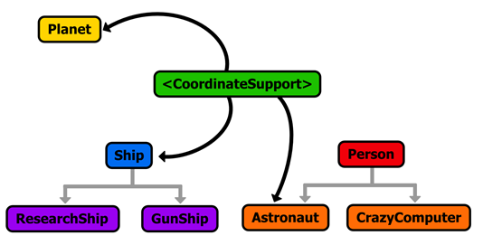

# 七、协议

在 Objective-C 中，**协议**是一组可以由任何类实现的方法。协议本质上与 C#中的接口相同，它们都有相似的目标。它们可以用作伪数据类型，这对于确保动态类型的对象能够响应特定的消息集非常有用。而且，因为任何类都可以“采用”协议，所以它们可以用来表示完全不相关的类之间的共享 API。

官方文档讨论了声明协议的非正式和正式方法，但是非正式协议实际上只是类别的一种独特用法，并没有提供正式协议那么多的好处。考虑到这一点，本章只关注*正式*协议。

## 创建协议

首先，让我们看看如何声明一个正式的协议。在 Xcode 中创建新文件，并选择 **Mac OS X >可可**下的Objective-C 协议图标:


图 29:协议文件的 Xcode 图标

像往常一样，这将提示您输入名称。我们的协议将包含计算对象坐标的方法，所以我们称之为**坐标支持**:


图 30:命名协议

单击**下一步**并选择文件的默认位置。这将创建一个看起来几乎完全像接口的空协议:

```objc
    // CoordinateSupport.h
    #import <Foundation/Foundation.h>

    @protocol CoordinateSupport <NSObject >

    @end

```

当然，它不是使用`@interface`指令，而是使用`@protocol`，后跟协议名称。`<NSObject>`语法允许我们将另一个协议合并到`CoordinateSupport`中。在这种情况下，我们说`CoordinateSupport`也包括所有在`NSObject` [协议](https://developer.apple.com/library/mac/#documentation/Cocoa/Reference/Foundation/Protocols/NSObject_Protocol/Reference/NSObject.html)中声明的方法(不要与`NSObject` [类](https://developer.apple.com/library/mac/#documentation/Cocoa/Reference/Foundation/Classes/nsobject_Class/Reference/Reference.html)混淆)。

接下来，让我们向协议添加一些方法和属性。这与在接口中声明方法和属性的方式相同:

```objc
    #import <Foundation/Foundation.h>

    @protocol CoordinateSupport <NSObject >

    @property double x;
    @property double y;
    @property double z;

    - (NSArray *)arrayFromPosition;
    - (double )magnitude;

    @end

```

## 采用协议

任何采用该协议的类都保证综合`x`、`y`和`z`属性，实现`arrayFromPosition`和`magnitude`方法。虽然这并没有说*它们将如何实现*，但它确实给了您为任意一组类定义共享应用编程接口的机会。

例如，如果我们希望`Ship`和`Person`都能够响应这些属性和方法，我们可以告诉它们通过将协议放在超类声明之后的尖括号中来采用该协议。还要注意，就像使用另一个类一样，您需要在使用之前导入协议文件:

```objc
    #import <Foundation/Foundation.h>
    #import "CoordinateSupport.h"

    @interface Person : NSObject <CoordinateSupport >

    @property (copy ) NSString *name;
    @property (strong ) NSMutableSet *friends;

    - (void )sayHello;
    - (void )sayGoodbye;

    @end

```

现在，除了这个接口定义的属性和方法之外，`Person`类保证响应`CoordinateSupport`定义的 API。Xcode 会警告你`Person`实现不完整，直到你合成`x`、`y`和`z`，实现`arrayFromPosition`和`magnitude`:


图 31:人员未完成实施警告<coordinatesupport></coordinatesupport>

同样，一个类别可以通过在类别后添加一个协议来采用它。例如，要告诉`Person`类采用`Relations`类别中的`CoordinateSupport`协议，您可以使用下面的行:

```objc
    @interface Person(Relations) <CoordinateSupport>

```

而且，如果您的类需要采用多个协议，您可以用逗号分隔它们:

```objc
    @interface Person : NSObject <CoordinateSupport, SomeOtherProtocol>

```

## 协议的优势

如果没有协议，我们将有两个选项来确保`Ship`和`Person`都实现这个共享的 API:

1.  在两个接口中重新声明完全相同的属性和方法。
2.  在抽象超类中定义 API，将`Ship`和`Person`定义为子类。

这两个选项都不是特别吸引人:第一个选项是多余的，容易出现人为错误，第二个选项限制很大，尤其是如果它们已经从不同的父类继承了。应该清楚的是，协议更加灵活和可重用，因为它们保护应用编程接口不依赖于任何特定的类。

任何*类都可以很容易地采用协议，这一事实使得在现有类层次结构的基础上定义水平关系成为可能:*



图 32:使用协议链接不相关的类

由于协议的灵活性，各种 iOS 框架很好地利用了它们。例如，用户界面控件通常使用委托设计模式进行配置，其中委托对象负责对用户操作做出反应。iOS 没有将委托的职责封装在抽象类中并强制委托对其进行子类化，而是在协议中为委托定义了必要的应用编程接口。这样，*任何*对象都可以非常容易地充当委托对象。在本系列的后半部分，我们将更详细地探讨这一点。

## 作为伪类型的协议

协议可以用作伪数据类型。使用协议作为类型检查工具可以确保变量始终符合任意的应用编程接口，而不是确保变量是类的实例。例如，下面的`person`变量保证实现 CoordinateSupport API。

```objc
    Person <CoordinateSupport> *person = [[Person alloc] init];

```

尽管如此，当与`id`数据类型一起使用时，强制采用协议通常更有用。这使您可以假定某些方法和属性，而完全忽略对象的类。

当然，同样的语法也可以用于方法参数。以下代码片段向应用编程接口添加了一个新的`getDistanceFromObject:`方法，其参数需要符合`CoordinateSupport`协议:

```objc
    // CoordinateSupport.h
    #import <Foundation/Foundation.h>

    @protocol CoordinateSupport <NSObject >

    @property double x;
    @property double y;
    @property double z;

    - (NSArray *)arrayFromPosition;
    - (double )magnitude;
    - (double )getDistanceFromObject:(id <CoordinateSupport >)theObject;

    @end

```

请注意，在定义的同一文件中使用协议是完全可能的。

### 动态一致性检查

除了上一节讨论的静态类型检查，还可以使用`NSObject`协议定义的`conformsToProtocol:`方法动态检查对象是否符合协议。这有助于防止在处理动态对象(键入为`id`的对象)时出错。

下面的例子假设`Person`类采用`CoordinateSupport`协议，而`Ship`类不采用。它使用名为`mysteryObject`的动态类型对象来存储`Person`的实例，然后使用`conformsToProtocol:`来检查它是否有坐标支持。如果有，可以安全使用`x`、`y`和`z`属性，以及`CoordinateSupport`协议中声明的其他方法:

```objc
    // main.m
    #import <Foundation/Foundation.h>
    #import "Person.h"
    #import "Ship.h"

    int main(int argc, const char * argv[]) {
        @autoreleasepool {
            id mysteryObject = [[Person alloc ] init ];
            [mysteryObject setX:10.0 ];
            [mysteryObject setY:0.0 ];
            [mysteryObject setZ:7.5 ];

            // Uncomment next line to see the "else" portion of conditional.
            //mysteryObject = [[Ship alloc] init];

            if ([mysteryObject
                 conformsToProtocol:@protocol (CoordinateSupport )]) {
                NSLog (@"Ok to assume coordinate support." );
                NSLog (@"The object is located at (%0.2f, %0.2f, %0.2f)",
                      [mysteryObject x ],
                      [mysteryObject y ],
                      [mysteryObject z ]);
            } else {
                NSLog (@"Error: Not safe to assume coordinate support." );
                NSLog (@"I have no idea where that object is..." );
            }

        }
        return 0;
    }

```

如果取消对将`mysteryObject`重新分配给`Ship`实例的行的注释，`conformsToProtocol:`方法将返回`NO`，并且您将无法安全地使用由`CoordinateSupport`定义的 API。如果你不确定一个变量会包含什么类型的对象，这种动态协议检查对于防止你的程序在你试图调用一个不存在的方法时崩溃是很重要的。

还要注意新的`@protocol()`指令。这和`@selector()`很像，除了不用方法名，而是用协议名。它返回一个`Protocol`对象，可以传递给`conformsToProtocol:`，以及其他内置方法。协议头文件*不*需要导入`@protocol()`才能工作。

## 转发声明协议

如果您最终使用大量协议，您最终会遇到两个协议相互依赖的情况。这种循环关系给编译器带来了一个问题，因为如果没有另一个，它就不能成功地导入它们中的任何一个。例如，假设我们试图将一些全球定位系统功能抽象到一个`GPSSupport`协议中，但是希望能够在我们现有的`CoordinateSupport`的“正常”坐标和`GPSSupport`使用的坐标之间进行转换。`GPSSupport`协议非常简单:

```objc
    #import <Foundation/Foundation.h>
    #import "CoordinateSupport.h"

    @protocol GPSSupport <NSObject>

    - (void )copyCoordinatesFromObject:(id <CoordinateSupport>)theObject;

    @end

```

这不会带来任何问题，也就是说，直到我们需要从`CoordinateSupport.h`引用`GPSSupport`协议:

```objc
    #import <Foundation/Foundation.h>
    #import "GPSSupport.h"

    @protocol CoordinateSupport <NSObject >

    @property double x;
    @property double y;
    @property double z;

    - (NSArray *)arrayFromPosition;
    - (double )magnitude;
    - (double )getDistanceFromObject:(id <CoordinateSupport >)theObject;

    - (void )copyGPSCoordinatesFromObject:(id <GPSSupport >)theObject;

    @end

```

现在，`CoordinateSupport.h`文件要求`GPSSupport.h`文件正确编译，反之亦然。这是一个先有鸡还是先有蛋的问题，编译器不会很喜欢:


图 33:循环协议引用导致的编译器错误

解析递归关系很简单。您所需要做的就是转发声明其中一个协议，而不是尝试直接导入它:

```objc
    #import <Foundation/Foundation.h>

    @protocol CoordinateSupport;

    @protocol GPSSupport <NSObject >

    - (void )copyCoordinatesFromObject:(id <CoordinateSupport >)theObject;

    @end

```

`@protocol CoordinateSupport;`说的就是`CoordinateSupport`确实是一个协议，编译器不用导入就可以假设它存在。请注意语句末尾的分号。这可以在两个协议中的任何一个中完成；重点是移除循环引用。编译器不在乎你怎么做。

## 总结

协议是 Objective-C 令人难以置信的强大功能。当无法将任意类与公共父类联系起来时，它们允许您捕获任意类之间的关系。我们将简单地利用*iOS*中的几个内置协议，因为 iPhone 或 iPad 应用的许多核心功能都被定义为协议。

下一章介绍异常和错误，这是两个非常重要的工具，用于管理编写 Objective-C 程序时不可避免出现的问题。