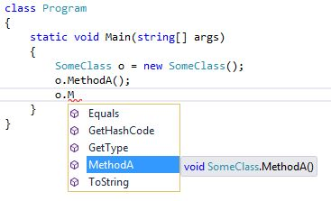
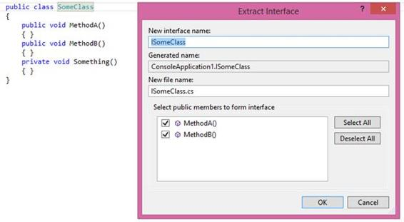

在上一章中，我们看到了类 Employee 继承自 Person。你认为这种方法有什么潜在的问题吗？如果一个人既是员工，又是集邮爱好者呢？显然，一个人也可以是集邮爱好者，但不能是员工(很多人都是“在工作间隙”)。如果我们只有继承，我们可以编写以下代码:

代码清单 15:继承链

```cs
  public class Person
  {
      // ...
  }

  public class Employee : Person
  {
      // ...
  }

  public class StampCollector : Person
  {
      // ...
  }

  public class EmployeeStampCollector : Employee
  {
      // ...
  }

```

我不知道你怎么样，但我就是觉得不对劲。我们的问题是 EmployeeStampCollector 和 StampCollector 唯一的共同点是 Person 基类，但他们仍然都是集邮者！写一个以集邮者为输入的方法现在是不可能了！这个问题可以通过使用多重继承来解决，但是 C#没有这一点(许多开发人员说这样更好)。

那么我们如何解决这个问题呢？我们使用*接口*。接口类似于只有抽象方法的抽象类。除了定义一个类型，它真的没做什么。不过，好的一面是，我们可以在一个类中继承或“实现”多个接口！

让我们看一个随机接口的例子:

代码清单 16:一个接口

```cs
  public interface ISomeInterface
  {
      string SomeProperty { get; set; }
      string SomeMethod();
      void SomethingElse();
  }

```

请注意，这些字段都没有访问修饰符。如果一个类实现了一个接口，那么该接口上的所有内容都是可以公开访问的。这就是实际实现的样子:

代码清单 17:接口实现

```cs
  public class SomeClass : ISomeInterface
  {
      public string SomeProperty { get; set; }

      public string SomeMethod()
      {
          // ...
      }

      public void SomethingElse()
      {
          // ...
      }
  }

```

所以这里有些类有对象类型，有些类和异构接口。等距接口或任何接口上的“I”前缀在 C#中是常见的做法，但不是必需的。

在单个类上使用继承和接口实现时，首先指定基类，然后使用逗号分隔的接口列表。这对于我们的人员、员工和 StampCollector 示例来说怎么样？

代码清单 18:接口

```cs
  public interface IEmployee
  {
      // ...
  }

  public interface IStampCollector
  {
      // ...
  }

  public class Person
  {
      // ...
  }

  public class Employee : Person, IEmployee
  {
      // ...
  }

  public class StampCollector : Person, IStampCollector
  {
      // ...
  }

  public class EmployeeStampCollector : Employee, IStampCollector
  {
      // ...
  }

```

现在 StampCollector 和 EmployeeStampCollector 都是 Person 类型和 IStampCollector 类型。EmployeeStampCollector 也属于 Employee(和 IEmployee)类型，因为它继承自实现 IEmployee 的 Employee。

因为一个类可以实现多个接口，所以一个接口可以从多个接口继承。然后，类必须简单地实现接口继承的所有接口。显而易见，接口不能继承类。

代码清单 19:接口继承

```cs
  public interface IPerson { }
  public interface IEmployee : IPerson
  { }
  public interface IStampCollector : IPerson
  { }
  public interface IEmployeeStampCollector : IEmployee, IStampCollector
  { }

```

这是一个非常理论化的例子，但是让我们考虑一个真实世界的例子。假设我们的应用程序需要记录一些信息。我们可能希望登录到生产环境中的数据库，但我们也希望登录到控制台进行调试。此外，如果数据库不可用，我们希望登录到 Windows 事件日志。

代码清单 20:记录器

```cs
  class Program
  {
      static void Main(string[] args)
      {
          List<ILogger> loggers = new List<ILogger>();
          loggers.Add(new ConsoleLogger());
          loggers.Add(new WindowsLogLogger());
          loggers.Add(new DatabaseLogger());

          foreach (ILogger logger in loggers)
          {
              logger.LogError("Some error occurred.");
              logger.LogInfo("All's well!");
          }
          Console.ReadKey();
      }
  }

  public interface ILogger
  {
      void LogError(string error);
      void LogInfo(string info);
  }

  public class ConsoleLogger : ILogger
  {
      public void LogError(string error)
      {
          Console.WriteLine("Error: " + error);
      }

      public void LogInfo(string info)
      {
          Console.WriteLine("Info: " + info);
      }
  }

  public class WindowsEventLogLogger : ILogger
  {
      public void LogError(string error)
      {
          Console.WriteLine("Logging error to Windows Event log: " + error);
      }

      public void LogInfo(string info)
      {
          Console.WriteLine("Logging info to Windows Event log: " + info);
      }
  }

  public class DatabaseLogger : ILogger
  {
      public void LogError(string error)
      {
          Console.WriteLine("Logging error to database: " + error);
      }

      public void LogInfo(string info)
      {
          Console.WriteLine("Logging info to database: " + info);
      }
  }

```

真漂亮！你可以想象，我们可以随意添加或删除记录器。

顺便说一下，同时拥有一个接口和一个基类(实现接口)是非常好的。也许你有一个 ILogger，一个 DbLogger(它实现了 ILogger 并定义了一些记录到数据库的常见行为)，然后有一个 SqlServerLogger，一个 OracleLogger，一个 MySqlLogger，等等。(这些都继承自 DbLogger)。

我提到过，当您实现一个接口时，默认情况下，该接口的所有成员都是公共的。这是合乎逻辑的行为；毕竟，接口是一种契约，它承诺其他代码将定义一些方法和属性(因为它是某种类型的)。但是，可以隐藏接口成员。为此，您可以显式实现一个接口。当您显式实现接口成员时，调用该成员的唯一方法是将类用作接口的类型。

代码清单 21:显式实现的接口

```cs
  public interface ISomeInterface
  {
      void MethodA();
      void MethodB();
  }

  public class SomeClass : ISomeInterface
  {
      public void MethodA()
      {
          // Even SomeClass can't invoke MethodB without a cast.
          ISomeInterface me = (ISomeInterface)this;
          me.MethodB();
      }

      // Explicitly implemented interface member.
      // Not visible in SomeClass.
      void ISomeInterface.MethodB()
      {
          throw new NotImplementedException();
      }
  }

```

某些类的用户也不能调用方法 b。



图 1:方法 b 不可访问。

除非他们将它用作或转换为异构接口。

代码清单 22:调用显式实现的成员

```cs
  ISomeInterface obj = new SomeClass();
  obj.MethodA();
  obj.MethodB();

```

你会经常在网上，或者在工作中遇到的一个讨论是继承和使用接口。请记住，您只能从一个类继承。这意味着如果您使用继承，比如 Person -> Employee，那么您的 Employee 就被 Person 基类卡住了。或者，您可以定义一个 IPerson，并在“人员”和“员工”中分别实现它。您经常会看到的一个准则是，继承定义了“是-一”关系(员工*是*人)，而接口实现定义了“能做”或“有-一”关系(一个人*有*集邮册)。如你所见，这并不完全是傻瓜证明，作为一名集邮者*也是*人，但继承仍然会给我们带来麻烦。

当我有一些在该类的多个(如果不是全部的话)子类型之间共享的功能时，我喜欢使用继承，比如 DbLogger 示例。

还有记住，作文也可能是一个可行的选择！

接口是一种创建附加类型的方法，不需要多重继承。它们非常有用。我和一些人谈过，他们说每个类都需要一个匹配的接口。这是一个非常重要的特性，Visual Studio 甚至可以选择基于类创建接口。当您的光标在一个类中时，您可以在顶部菜单的编辑->重构->提取接口下找到它。



图 2:提取界面对话框

学会很好地使用它们，因为我们将在本书中大量使用它们。