# 第二章武士刀

## 简介

在前一章中，我们了解了什么是 OWIN，什么时候使用它是一个好主意(如果您忘记了，答案是*总是*)，它的规范，以及微软是如何通过构建自己的名为 Katana 的实现来接受这个标准的。

在这一章中，你将学习卡塔纳如何实现 OWIN 规范，如何增强它们，以及如何用卡塔纳及其不同的托管选项编写你的第一个“你好世界”网络应用程序。

在本章后面，您还将学习如何通过选择使用哪个`Startup`类来自定义启动过程。

## 什么是武士刀

正如在[第 1 章](1.html#_Chapter_1_)中看到的，Katana 是 OWIN 规范的微软实现，并且提供了 OWIN 指定的所有层，有时不止一种风格。除了实现主机和服务器，Katana 还提供了一系列 API 来促进 OWIN 应用程序的开发，包括一些功能组件，如身份验证、诊断、静态文件服务，以及 ASP.NET 网络 API 和 SignalR 的绑定。为了避免混淆，请记住 Katana 不是一个成熟的网络服务器，而只是 OWIN 世界和 IIS 之间的“粘合剂”。

### 武士刀的原理

根据 OWIN 的指导原则，卡塔纳的建设有三个主要目标:

*   **可移植**:管道中的每个组件都应该是可替换的，从服务器和主机到 web 框架。由其他公司或开源项目构建的框架应该能够在微软 OWIN 服务器和微软中间件组件之上运行；框架应该潜在地运行在来自其他基于 OWIN 的项目的服务器和主机之上。
*   **模块化**:Katana 附带的所有组件都应该非常专注，只提供一个功能，这样应用程序开发人员就可以混合和匹配他们需要的组件。这使得应用程序的规模保持较小，而不是给开发人员提供大量他们不需要的功能。
*   **轻量级和高性能**:模块化方法的一个结果是应用程序将只消耗真正需要的资源。此外，由于组件被开发为可移植的，所以只要它们可用，就可以用性能更高的实现来代替。

### 武士刀建筑

在开始编写您的第一个武士刀应用程序之前，了解它的体系结构，以及由 OWIN 规范、**主机**、**服务器**、**中间件、**和**应用程序**定义的层如何映射到武士刀组件之上是很重要的。


图 2:卡塔纳的建筑

#### 主持

OWIN 规范中定义的第一层和下层是主机。它负责底层进程(启动、关闭等)的管理以及 OWIN 管道的初始化，该管道稍后将用于处理传入的请求。

基于武士刀的应用有三种选择:

*   **IIS/ASP。NET**—最简单且更向后兼容的选项是使用 IIS:在这种情况下，OWIN 管道通过标准的`HttpModule`和`HttpHandler`启动。使用此托管选项，您还必须使用依赖于系统的 OWIN 服务器。Web 作为 IIS 既是主机又是服务器。
*   **自定义主机**—如果您想选择使用不同的服务器而不是系统。Web，或者想对托管过程和应用程序配置有更多的控制，另一个选择是构建一个自定义的托管过程。这使得开发人员可以将他们的服务器托管在一个窗口服务、一个控制台应用程序中，甚至可以轻松地将他们自己的服务器嵌入到桌面应用程序中。
*   **OwinHost**—最后一个选项是给不想使用 IIS/ASP 的开发人员的。NET 来托管他们的应用程序，但也不想构建自己的自定义主机，而宁愿依赖已经构建的东西。为此，Katana 套件包括 OwinHost.exe:一个命令行应用程序，当从项目的根文件夹启动时，使用`HttpListener`服务器启动服务器，并按照惯例找到启动类。它有几个命令行选项，可以设置为自定义其行为方式。例如，您可以手动将其指向应用程序启动类或更改所使用的服务器(如果您不想使用默认的`HttpListener`)。

#### 计算机网络服务器

下一层是服务器，它负责打开应用程序将在其上响应的网络套接字连接。它监听请求，一旦有请求到达，它就用来自 HTTP 请求的值填充环境字典，并通过开发人员在应用程序启动代码中定义的 OWIN 中间件管道将其发送下去。

系统。网

如前所述，系统。网络和 IIS/ASP。NET 宿主选项不能相互独立选择。使用此选项时，武士刀系统。基于网络的服务器将自己注册为`HttpModule`和`HttpHandler`，并将处理 IIS 发送给它的请求。然后，它会将著名的`HttpRequest`和`HttpResponse`对象映射到 OWIN 的环境字典，并将请求发送到 OWIN 管道。

HttpListener

目前可用的另一个选项是基于较低级别的网络类`HttpListener`。当使用 OwinHost 或自主机时，这是默认服务器。

WebListener

这是 ASP.NET vNext 将附带的超级轻量级 OWIN 服务器。它目前不能与 Katana 一起使用，但值得了解的是正在酝酿中的内容。

#### 中间件

在前两层(基本上只是连接流程)之后，请求最终进入 OWIN 中间件的管道。中间件是实现 OWIN 应用委托`AppFunc`的一个小组件。

中间件应该处理请求，并将执行传递给管道中定义的下一个组件。中间件在处理请求时所做的事情可能非常简单，也可能非常复杂。它可能只是一个简单的日志组件，但也可以是一个完整的网络框架，如 Nancy、SignalR 或 ASP.NET 网络应用编程接口。它甚至可以是一个小型的、独立的 web 应用程序，您只需要将它插入到您的 web 项目中。

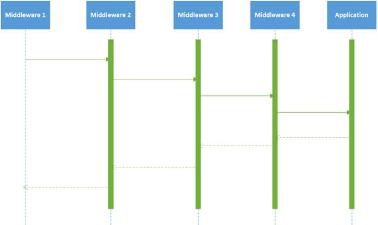

图 3:中间件调用的序列图

在[第 4 章](4.html#_Chapter_4_)中，您将学习如何构建自己的中间件组件。

#### 应用

最后，OWIN 规范的顶层是应用程序的代码。

## IIS 上的武士刀

现在，您已经了解了 Katana 套件的体系结构和可用选项，是时候开始编写基于 Katana 的应用程序了。应用程序只会在输出中打印消息`Hello World!`，在这种情况下是一个网页。

### 创建项目

我们将首先构建一个使用 IIS/ASP 运行的 Katana 应用程序。NET 主机和系统。Web 服务器。为此，首先您需要打开 Visual Studio，并从在上创建一个新的**ASP.NET 网络应用程序**开始。NET 框架 4.5。


图 4:新项目窗口

一旦您选择了项目类型，将出现**新 ASP.NET 项目**创建向导。确保使用以下设置:

*   选择**清空**模板。
*   选择**无认证**。
*   不要选择任何其他文件夹或核心引用。
*   不要在 Azure 中托管。

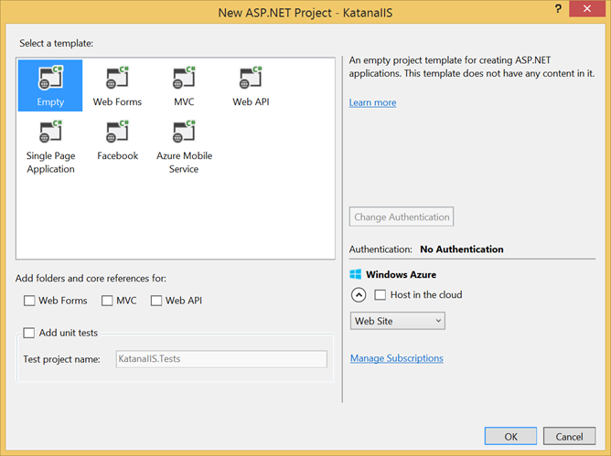

图 5:新 ASP.NET 项目窗口

上图显示了**新 ASP.NET 项目**窗口的外观。

### 包括相关的号码包

项目已创建；现在是时候通过 NuGet 加入 Katana 了。

有许多可用的 NuGet 包来构建基于 Katana 的应用程序，通常采用非常精细的方法组织。虽然这有利于模块化，但更难知道为应用程序所需的特性选择哪个包。更复杂的是，没有一个包装上有*武士刀*的名字，但都被称为*奥因。*本书末尾的[附录](6.html#_Appendix_A_)描述了微软作为 Katana 套件的一部分发布的每个 OWIN NuGet 包的特性。

在 Visual Studio 中，打开**获取包管理器**，并使用关键字 *owin* 进行搜索。列表中的第一个包将是`Microsoft.Owin.Host.SystemWeb`，这是您必须安装的包。


图 6:管理“获取软件包”窗口，其中包含要安装的软件包

如果您喜欢使用软件包管理器控制台，您可以通过键入以下命令来安装所需的软件包:

```
     PM> Install-Package Microsoft.Owin.Host.SystemWeb

```

系统。基于网络的托管包依赖于另外两个 NuGet 包，`Owin`和`Microsoft.Owin`。安装软件包后，**管理软件包**窗口如下图所示。

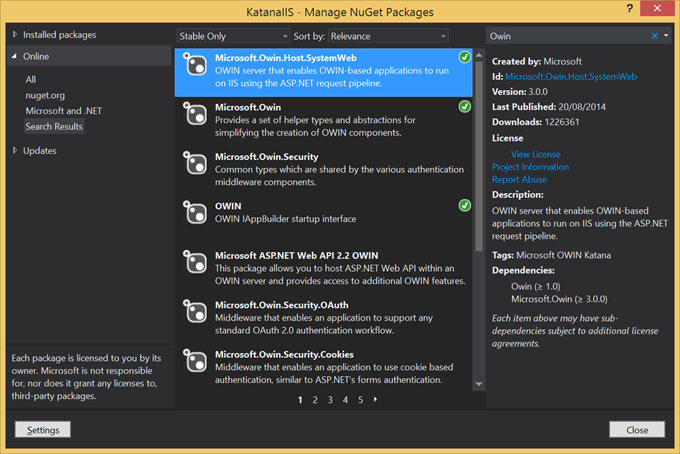

图 7:管理已安装软件包的“获取软件包”窗口

### 添加启动类

终于到了编写一些代码并指导应用程序如何响应 web 请求的时候了。这是在 **Startup** 类中完成的，按照惯例，这个类只不过是程序集根目录中名为`Startup`的类。配置应用程序的代码按照惯例在`Configuration`方法中指定。

现在打开**添加新项**窗口，在 Web >常规树内向下钻取(或在窗口右上角搜索框内键入`owin`，选择 **OWIN 启动类**模板，如下图所示。


图 8:添加带有 OWIN 启动类的新项目窗口

这将在应用程序文件夹的根目录下创建一个`Startup.cs`文件，代码如下。

```
     using Microsoft.Owin;
    using Owin;
    [assembly: OwinStartup(typeof(Syncfusion.OwinSuccinctly.KatanaIIS.Startup))]
    namespace Syncfusion.OwinSuccinctly.KatanaIIS
    {
        public class Startup
        {
            public void Configuration(IAppBuilder app)
            {
                // For more information on how to configure your application, visit http://go.microsoft.com/fwlink/?LinkID=316888
            }
        }
    }

```

代码清单 2

正如您所看到的，除了按照约定创建一个类之外，模板还添加了一个程序集级属性来指定启动类。

```
     [assembly: OwinStartup(typeof(Syncfusion.OwinSuccinctly.KatanaIIS.Startup))]

```

代码清单 3

如果类名不同于`Startup`，则需要该属性。它将在后面的章节中派上用场，在这一章中，您将学习其他方法来指定同样使用`web.config`文件的启动类。

要添加您自己的逻辑，您必须通过在 OWIN 管道中添加操作来实现`Configuration`方法，如以下代码所示。

```
     public void Configuration(IAppBuilder app)
    {
        app.Run(context =>
        {
            context.Response.ContentType = "text/plain";
            return context.Response.WriteAsync("Hello World!");
        });
    }

```

代码清单 4

前面的方法将一个 lambda 函数作为 OWIN 管道的最后一个元素插入，该函数接收一个`IOwinContext`对象作为输入，将响应类型设置为`text/plain`，并将文本“Hello World！”。

在这个简短的示例中，您已经看到了 Katana 在 OWIN 规范之上添加的两个助手，以及事实上的标准`IAppBuilder`界面:

*   `IOwinContext`类，它用一个强类型且更容易使用的类包装了 OWIN 环境字典。
*   `Run`延伸方法，用于添加组件作为 OWIN 管道的最后一步。其签名为`Run(System.Func<IOwinContext,Task> handler)`。

只使用 OWIN 的规格和`Owin.dll`，编写同一个类会稍微复杂一些。

```
     using AppFunc = Func<IDictionary<string, object>, Task>;
    ...
    app.Use(new Func<AppFunc, AppFunc>(next => (env =>
    {
        string text = "Hello World!";
        var response = env["owin.ResponseBody"] as Stream;
        var headers = env["owin.ResponseHeaders"] as IDictionary<string, string[]>;
        headers["Content-Type"] = new[] { "text/plain" };
        return response.WriteAsync(
            Encoding.UTF8.GetBytes(text), 0, text.Length);
    })));

```

代码清单 5

请注意，如果没有 Katana 助手，您必须调用`Use`方法来指示管道运行具有该长签名的 OWIN 中间件对象，并忽略`next`参数，该参数在管道中包含以下元素。此外，在使用之前，您必须从环境字典中获取响应密钥，并将其转换为正确的类型。

|  | 注意:你永远不会使用这个语法，但是我把它放在一章中来展示如何只使用 OWIN 规范。更多的是代码，但不是更多。 |

### 再往前一点

在处理函数内部，您还可以编写更多的逻辑，例如，像读取查询参数来编写个性化的`Hello Readers!`消息。

```
     public void Configuration(IAppBuilder app)
    {
        app.Run(context =>
        {
            var name = context.Request.Query["name"];
            context.Response.ContentType = "text/plain";
            return context.Response.WriteAsync("Hello " + name + "!");
        });
    }

```

代码清单 6

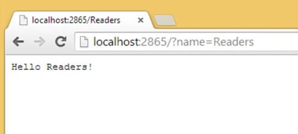

图 9:读者好！通过查询字符串

如果您不太喜欢查询字符串参数，并且更喜欢使用带有干净 URL 的 RESTful 方法，那么您可以解析请求的路径并提取片段。

```
     public void Configuration(IAppBuilder app)
    {
        app.Run(context =>
        {
            var name = "World";
            var uriSegments = context.Request.Uri.Segments;
            if (uriSegments.Length > 1)
                name = uriSegments[1];
            context.Response.ContentType = "text/plain";
            return context.Response.WriteAsync("Hello " + name + "!");
        });
    }

```

代码清单 7


图 10:通过路径段向读者问好

现在代码变得太复杂了，不能只放入一个 lambda 表达式。是时候将其转移到外部方法了。这样你也能更好地理解处理程序是什么:接受一个`IOwinContext`并返回一个`Task`的函数(在本例中使用的是`async` / `await`范式)。

```
     public void Configuration(IAppBuilder app)
    {
        app.Run(WriteResponse);
    }
    private Task WriteResponse(IOwinContext context)
    {
        var name = "World";
        var uriSegments = context.Request.Uri.Segments;
        if (uriSegments.Length > 1)
            name = uriSegments[1];
        context.Response.ContentType = "text/plain";
        return context.Response.WriteAsync("Hello " + name + "!");
    }

```

代码清单 8

有了这个简单的 web 应用程序，我们现在将把它从 IIS 中取出，并将其托管在一个自定义主机中。

## 通过自定义主机的武士刀

在自定义宿主中托管 Katana 应用程序与在 IIS 中托管它没有太大区别。应用程序的启动类和代码与以前完全相同。唯一改变的是用于创建应用程序的项目类型——控制台应用程序——和要安装的 NuGet 包。

|  | 注意:将您的应用程序托管在一个自定义主机中，如控制台应用程序、Windows 服务甚至 WPF 桌面应用程序，这是一种为应用程序添加 web 界面的简单方法。选择此选项而不是选择 IIS 时要小心。您将失去 IIS 附带的所有功能(如 SSL、事件日志记录、简易管理控制台等)。)并将不得不自己实现它们。 |

### 创建项目

和以前一样，从创建一个新项目开始，这次是选择**控制台应用程序**，如图 11 所示。

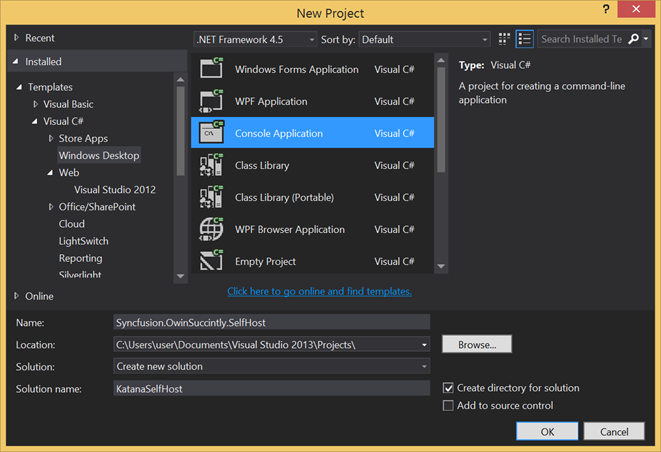

图 11:新项目窗口

### 包括相关的号码包

创建空控制台应用程序后，打开 NuGet 包管理器，使用关键字 owin **selfhost** 搜索并选择`Microsoft.Owin.SelfHost`。

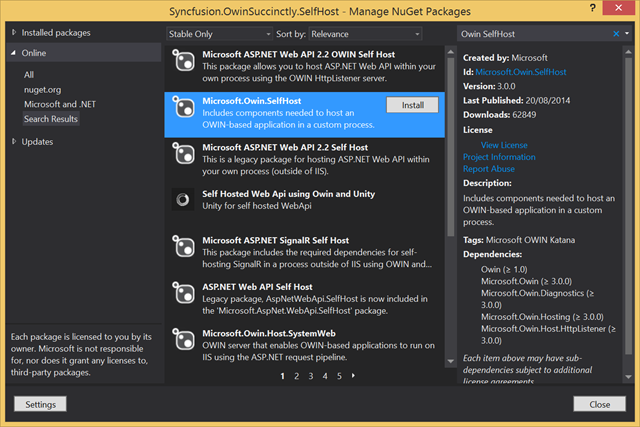

图 12:显示要安装的包的管理获取包窗口

或者，您也可以在包管理器控制台中使用以下命令。

```
     PM> Install-Package Microsoft.Owin.SelfHost

```

下载和安装完成后，您将看到安装了七个 NuGet 包。

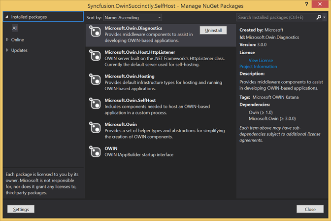

图 13:管理已安装软件包的“获取软件包”窗口

除了`Owin`和`Microsoft.Owin`之外，它还将下载`Microsoft.Owin.Hosting`包，其中包含托管基于 OWIN 的应用程序的基础设施`Microsoft.Owin.Host.HttpListener`。它将包括基于。NET 联网类`HttpListener`和`Microsoft.Owin.Diagnostic`，其中包含一些有用的组件。现在您不再依赖于 IIS，您需要这些组件，包括默认的欢迎页面和死亡黄屏(YSOD)的等价物。

### 编写托管代码

现在一切就绪，所以下一步是编写代码来启动服务器并托管基于 OWIN 的应用程序。

```
     static void Main(string[] args)
    {
        using (WebApp.Start<Startup>("http://localhost:9000"))
        {
            Console.WriteLine("Launched site on http://localhost:9000");
            Console.WriteLine("Press [enter] to quit...");
            Console.ReadLine();
        }
    }

```

代码清单 9

基本上，唯一相关的代码行是您用泛型符号指定的`WebApp.Start<Startup>("http://localhost:9000")`，它是包含启动配置的类，您指定监听哪个域和端口作为它的参数。

### 启动和运行服务器

现在，我们可以通过编写与之前相同的代码来添加启动类，应用程序将运行得非常好。只需按 F5，控制台应用程序就会启动，并显示服务器已经启动。

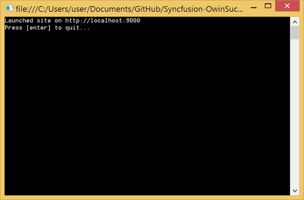

图 14:带有自定义主机的控制台应用程序

### 使用诊断助手

通过在自定义主机上运行我们的应用程序，我们失去了 IIS 的所有管理和诊断功能。通过使用`Microsoft.Owin.Diagnostic`包中包含的功能，我们至少可以带回欢迎屏幕和调试视图，以显示未处理的异常情况。

```
     public void Configuration(IAppBuilder app)
    {
        app.UseWelcomePage("/");
        app.UseErrorPage();
        app.Run(context =>
        {
            Trace.WriteLine(context.Request.Uri);
            //Line to show the ErrorPage
            if (context.Request.Path.ToString().Equals("/dotnotcallme"))
            {
                throw new Exception("You requested the wrong URL :)");
            }

            context.Response.ContentType = "text/plain";
            return context.Response.WriteAsync("Hello, world.");
        });
    }

```

代码清单 10

前面的代码清单显示了带有一些附加行的基本`Configuration`类。

第一个是`app.UseWelcomePage("/")`，它在管道中添加了一个显示默认欢迎页面的 OWIN 中间件组件。它是在请求指定为参数的 URL 时添加的，在这种情况下，它是站点的根。

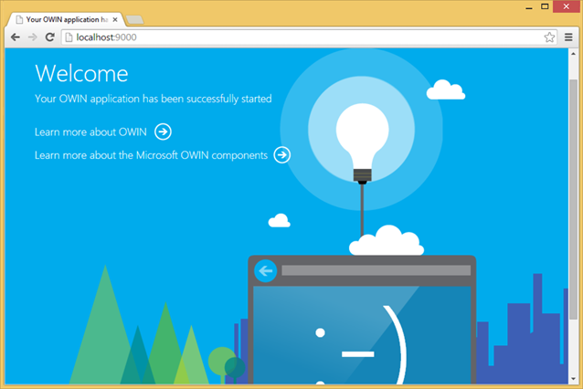

图 15:欢迎页面

第二行`app.UseErrorPage()`配置管道，如果在请求执行期间发生未处理的异常，则显示错误页面。

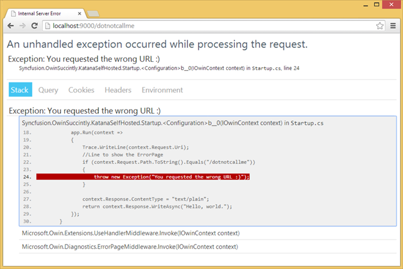

图 16:错误页面，堆栈跟踪选项卡

图 16 显示了错误页面的默认视图，堆栈跟踪选项卡相当于 YSOD。它显示了堆栈跟踪和源代码，并突出显示了生成异常的代码行。

正如您所看到的，还有许多其他窗格:查询、Cookies、标题，最有趣的是 OWIN 应用程序“环境”，其中列出了 OWIN 环境字典中的所有条目。

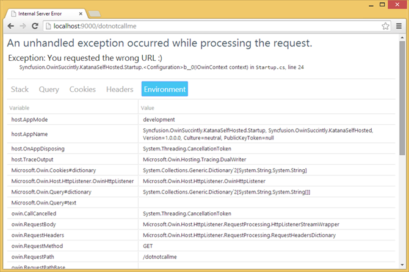

图 17:错误页面，环境字典选项卡

|  | 注意:如果你想看到正在运行的错误页面，上面的代码清单是为了在请求 URL `/donotcallme`时抛出一个假异常。 |

### 使用追踪

另一种诊断可能是使用来自`System.Diagnostic`的`Trace`类，并直接写入跟踪输出流，在控制台应用程序的情况下，这是控制台窗口。例如，您可以在请求处理程序中添加以下代码行，以便在控制台窗口上打印所有请求的 URL。

```
     Trace.WriteLine(context.Request.Uri);

```

代码清单 11

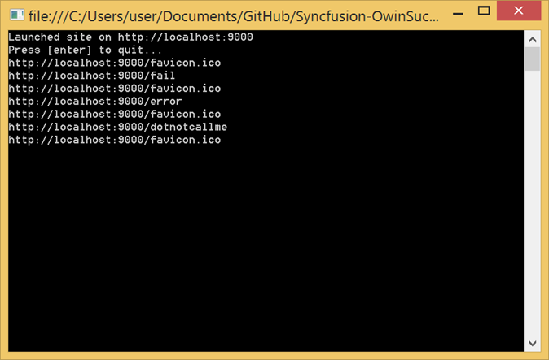

图 18:控制台窗口中的跟踪

请注意，控制台窗口中从不打印`http://localhost:9000/`。这是因为根 URL 被`WelcomePage` OWIN 组件拦截，该组件呈现欢迎页面，然后关闭响应，而不将执行转发给 OWIN 管道的其余部分。如果您想跟踪欢迎页面，您应该在注册`WelcomePage`组件之前注册一个定制中间件。

## katana via owinhst . exe

最后一个托管选项是使用 OwinHost.exe 应用程序，不出所料，它也是通过 NuGet 包分发的。

基于 Katana 的应用程序的配置代码与您目前看到的没有变化。此外，您可以将应用程序创建为普通类库或 web 应用程序。

这两种方法的区别主要在于开发和调试经验:

*   使用类库，您可以非常容易地设置项目，只需要最少的引用，但是您需要手动启动宿主，并将其手动附加到调试过程中。此外，您没有其他选项提供的所有 web 工具。
*   对于 web 应用程序，在创建项目后，您必须清理一些不需要的引用，但是您将拥有集成的调试体验(使用 Visual Studio 2013)和 web 工具。

### 使用类库

让我们从创建一个新项目开始。这次选择**类库**项目。

#### 编写应用程序

一旦项目准备就绪，删除默认的 Class1.cs 文件，并添加一个新的 **OWIN 启动类**，就像您在前面的方法中创建启动类时所做的那样。

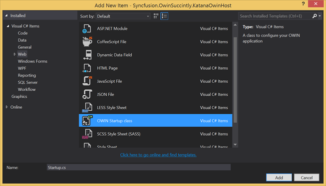

图 19:添加 OWIN 启动类

这将自动添加对 Owin.dll 和 Microsoft.Owin.dll 的引用(通过引用它们的 NuGet 包)。

```
     [assembly: OwinStartup(typeof(Syncfusion.OwinSuccinctly.KatanaOwinHost.Startup))]
    namespace Syncfusion.OwinSuccinctly.KatanaOwinHost
    {
        public class Startup
        {
            public void Configuration(IAppBuilder app)
            {
                app.Run(context => context.Response.WriteAsync("Hello World!"));
            }
        }
    }

```

代码清单 12

在`Startup`类中编写了通常的`Configuration`方法(如代码清单 11 所示)后，您的类库项目应该如图 20 所示。

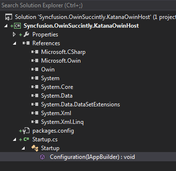

图 20: Visual Studio 解决方案资源管理器

请注意引用列表:当您添加 **Owin 启动类**时，这两个 Owin 被自动引用，其他的只是类库运行所需的最低限度。

#### 启动并调试应用程序

现在您已经有了应用程序的类库，您需要启动 OwinHost.exe，然后可能调试它。

首先打开 NuGet 包管理器，下载`OwinHost`包。

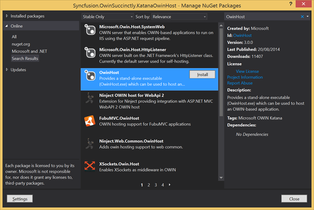

图 21:owinhst nu set 软件包

像所有的 NuGet 包一样，OwinHost.exe 文件将安装在 <solution root="">/packages/OwinHost 中。(版本)/工具文件夹(编写时位置为<solution root="">/packages/owinhost . 3 . 0 . 0/tools)。</solution></solution>

按照惯例，当在没有任何参数的情况下调用时，OwinHost.exe 将加载。\bin 文件夹相对于从哪里调用应用程序，并将调用用`OwinStartup`程序集属性指定的启动类。

不幸的是，类库项目在构建后会将 dll 放在一个文件夹中，\ bin \ Debug background:# f8f8 ' >文件夹，所以我们必须告诉 Visual Studio 将文件保存在另一个文件夹中。为此，打开**项目属性**窗口，选择**构建**选项卡，并将**输出路径**属性更改为 bin\。

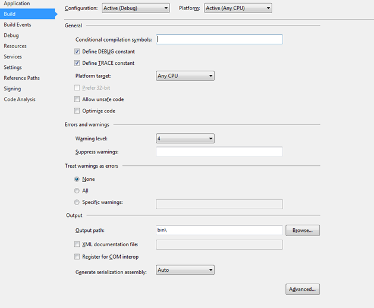

图 22:项目属性窗口

最后，打开一个控制台窗口，移动到项目的根目录，并使用相对路径在没有任何参数的情况下启动 OwinHost.exe。

```
     C:\..\Syncfusion.OwinSuccinctly.KatanaOwinHost>..\packages\OwinHost.3.0.0\tools\OwinHost.exe

```

代码清单 13

主机将启动，默认监听`localhost`的端口 5000。


图 23:OwinHost.exe 控制台输出

您可以使用命令行选项并通过手动指定启动类作为参数来更改默认行为。要查看包含所有选项的帮助屏幕，只需使用`-h`参数启动应用程序。


图 24:OwinHost.exe 帮助

如果要调试，还必须将调试器附加到 OwinHost.exe 进程。


图 25:附加到流程

虽然不太方便，但是如果你想要更好的调试体验，比如在 Visual Studio 中使用 F5 进行调试，你就必须将项目创建为 web 应用程序。

### 找回 F5 调试

当您在 Web 应用程序项目中引用`OwinHost` NuGet 包时，它的安装过程利用了 Visual Studio 2013 引入的一个新特性:外部主机可扩展性。这个强大的功能允许工具轻松地注册一个额外的自定义主机以及默认的 IIS Express 和本地 IIS。

`OwinHost` NuGet 包就是这样做的，它将自己添加到 Visual Studio 可以启动来调试应用程序的服务器列表中。下图显示了安装`OwinHost` NuGet 包后**项目属性**窗口的外观。

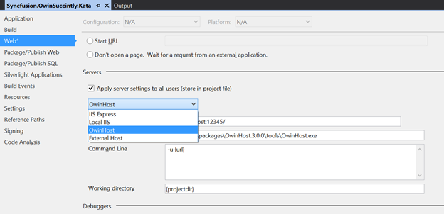

图 26:项目属性窗口，网页选项卡

但是注册一个额外的自定义主机只能在一个网络应用程序项目中工作，所以不要将 Katana 应用程序构建为控制台应用程序，而是使用**空**模板创建一个**网络应用程序**。然后，像您对控制台应用程序所做的那样，添加 OWIN `Startup`类。然后，删除所有不需要的引用(例如，系统。直到您的解决方案资源管理器树看起来像在[图 20](#SolutionExplorer) 中为控制台应用程序显示的树。

最后，安装`OwinHost` NuGet 包，将项目配置为从 Visual Studio 启动应用程序时使用 **OwinHost** 作为服务器。


图 27:在项目属性窗口的 Web 选项卡中配置服务器

从选择 **OwinHost** 作为服务器时出现的表单中，您可以自定义要监听的 URL，并在命令行中传递自定义参数。

现在，您可以按下 **F5** 并从 Visual Studio 中直接启动您的 OWIN 应用程序。

|  | 注意:这仅适用于 Visual Studio 2013。如果您想在 Visual Studio 2012 中打开同一个项目，请不要安装附加服务器选项(系统会提示您这样做)，因为您将无法在 Visual Studio 2013 中再打开它。 |

## 天蓝色的武士刀

OWIN 和卡塔纳非常适合本地应用，但在云上更好。它们非常适合所有的 Windows Server 安装、虚拟机或功能更强大的应用程序。

微软 Azure 是拥有不同选项的最完整的云服务之一。基本上，您可以在任何您想要的地方部署您的应用程序，但是最常用的服务是:

*   蔚蓝网站
*   云服务(工作者角色和网络角色)

因为 Azure 上的所有内容都托管在 Windows 安装上(除了一些 Linux 虚拟机)，所以在本地或微软 Azure 上使用 OWIN 和 Katana 没有区别。事实上，您的网站将在 IIS 上运行。

如果您打算使用微软 Azure，唯一要做的就是按照在关于用 IIS 运行 Katana 一章开始时解释的说明进行操作，然后将其部署到 Azure。

## 指定启动类的其他方式

到目前为止，您已经理解了 OWIN 应用程序需要一个包含引导代码的启动类，并且这个类通常是根据其名称`Startup`的约定或者通过用`OwinStartupAttribute`指定类名来找到的。但是这些不是指定启动类的唯一方法。让我们回顾一下可用的选项:

*   **命名约定**:默认情况下，宿主在应用程序命名空间的根中寻找一个名为`Startup`的类。
*   `OwinStartup`属性:类型为`OwinStartupAttribute`的程序集级属性指定哪个类包含启动类。

```
     [assembly: OwinStartup("Default",
        typeof(Syncfusion.OwinSuccinctly.KatanaStartup.StartupDefault))]

```

代码清单 14

有了这个属性，您还可以为类指定一个*友好的*助记符名称，以后可以用来引用这个特定的启动类，如果您不想使用`Configuration`方法，甚至可以指定要调用的方法的名称。

*   **配置文件**中的应用设置:通过使用 web.config 或 app.config 文件的`appSettings`部分中的条目，您可以覆盖命名约定和`OwinStartup`属性。

```
     <appSettings>
      <add key="owin:appStartup" value="Syncfusion.OwinSuccinctly.KatanaStartup.StartupDefault" />
    </appSettings>

```

代码清单 15

如果启动类在另一个程序集中，也可以使用类型的完全限定名，或者可以指定*友好的*名称。我们稍后会回到友好的名字。

*   **启动选项**:如果您在自定义主机中托管应用程序，您可以通过将类指定为`Start`方法的通用参数来指定在启动主机时使用哪个类。

```
     WebApp.Start<StartupDefault>("http://localhost:9000");

```

代码清单 16

*   **命令行参数**:如果使用的是`OwinHost`，还可以指定启动类作为命令行工具的参数。

```
     ..\packages\OwinHost.3.0.0\tools\OwinHost.exe Syncfusion.OwinSuccinctly.KatanaStartup.StartupDefault

```

代码清单 17

#### 使用友好名称

让我们更详细地看一下使用友好名称来指代配置。要做到这一点，您必须结合前面解释的五个选项中的两个:

*   `OwinStartup`属性。
*   要么`appSettings`要么`OwinHost.exe`论证。

你需要至少有两个启动类，都指定了`OwinStartupAttribute`(好的，这里我们有三个)。

```
     [assembly: OwinStartup("Development",typeof(Syncfusion.OwinSuccinctly.KatanaStartup.StartupDevelopment))]
    namespace Syncfusion.OwinSuccinctly.KatanaStartup
    {
        public class StartupDevelopment
        {
            public void Configuration(IAppBuilder app)
            {
                app.Run(context =>
                {
                    return context.Response.WriteAsync("Hello from Development!");
                });
            }
        }
    }

    [assembly: OwinStartup("Test",typeof(Syncfusion.OwinSuccinctly.KatanaStartup.StartupTest))]
    namespace Syncfusion.OwinSuccinctly.KatanaStartup
    {
        public class StartupTest
        {
            public void Configuration(IAppBuilder app)
            {
                app.Run(context =>
                {
                    return context.Response.WriteAsync("Hello from Test!");
                });
            }
        }
    }

    [assembly: OwinStartup("Production",typeof(Syncfusion.OwinSuccinctly.KatanaStartup.StartupProduction))]
    namespace Syncfusion.OwinSuccinctly.KatanaStartup
    {
        public class StartupProduction
        {
            public void Configuration(IAppBuilder app)
            {
                app.Run(context =>
                {
                    return context.Response.WriteAsync("Hello from Production!");
                });
            }
        }
    }

```

代码清单 18

由于这三个类都有不同的友好名称，我们现在可以通过配置文件中的设置来决定使用哪一个作为启动类。以下配置将使用`Test`配置启动应用程序。

```
     <appSettings>
      <add key="owin:appStartup" value="Test" />
    </appSettings>

```

代码清单 19

或者使用 OwinHost.exe，同样的结果将通过键入:

```
     ..\packages\OwinHost.3.0.0\tools\OwinHost.exe Test

```

代码清单 20

在这些例子中，配置之间的差异是不存在的，但是在实际场景中，您可能希望根据配置添加不同的中间件组件。例如，您可以只在开发和测试中启用诊断页面，而不在生产中启用，或者只在生产中启用缓存、JavaScript 绑定和缩小。

## 结论

在这一章中，您已经了解了什么是武士刀，以及它的架构如何映射到 OWIN 规格之上。

在本章的后面，您还将看到如何创建 Katana 应用程序，并将其托管在 IIS 中、自定义主机中，最后托管在提供的 OwinHost.exe 中。您还了解了 Visual Studio 2013 的一个鲜为人知的功能，以及如何在 Azure 上部署基于 Katana 的应用程序。

最后，您还看到了许多更改 OWIN 应用程序启动类的方法。

在下一章中，您将学习如何使用 Katana 来运行使用您已经知道的网络框架构建的应用程序，如 ASP.NET 网络应用编程接口、MVC 框架和 SignalR。