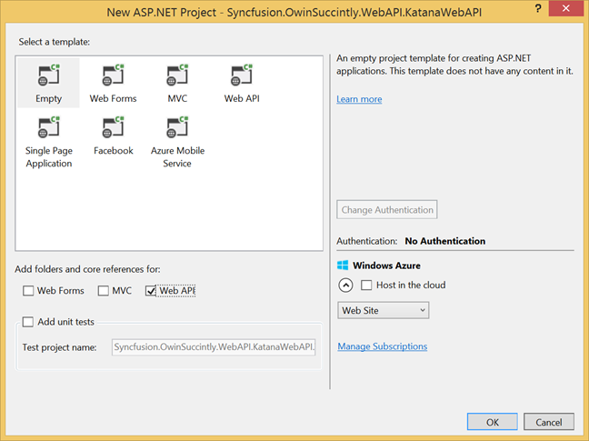
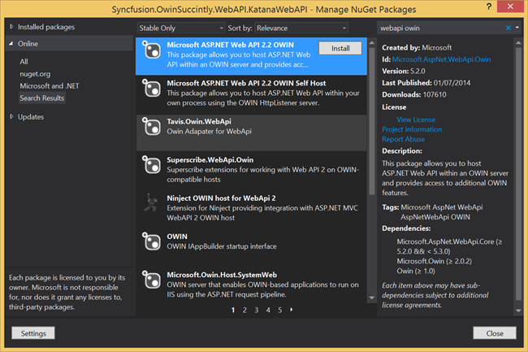
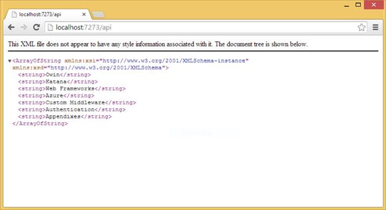
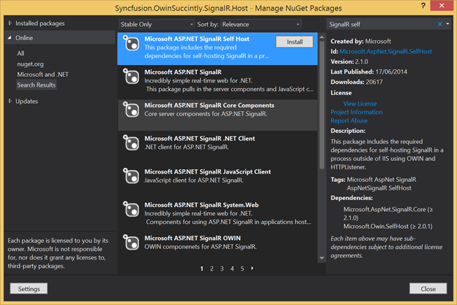
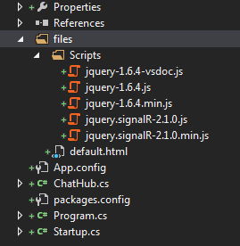

# 第三章与其他网络框架一起使用武士刀

## 简介

在前一章中，您学习了如何使用所有可用的宿主选项(IIS/ASP)用 Katana 编写应用程序。NET、自主机和 OwinHost.exe。特别是，您了解到编写启动配置是一个非常简单的过程，只需要使用包含所有设置指令的`Configuration`方法创建一个类。

利用您刚刚获得的知识，在这一章中，您将学习如何使用以下您可能已经熟悉的网络框架，但在武士刀之上:

*   ASP.NET 网页应用编程接口
*   NancyFx
*   报告情况

不幸的是，现有的 web 框架必须适应与 OWIN 中间件组件一起工作；对于那些依赖系统的人。Web，移植并不容易。其中之一是 ASP.NET MVC，它与 OWIN 不兼容，但 ASP.NET MVC 第 6 版将兼容。

既然你已经知道如何包含 OWIN 和卡塔纳的 NuGet 包，以及如何创建一个启动类，我将跳过这些步骤，主要关注网络框架的使用。

## 用武士刀使用任何网络框架

在讨论单个框架的细节之前，这是在 OWIN 和卡塔纳使用几乎任何网络框架的一般方法:

1.  首先，根据要使用的宿主创建 Visual Studio 项目:
    *   **Web 应用**项目如果想用 **IIS/ASP 托管。NET** 。
    *   **控制台应用程序**(或您的自定义主机)如果您想使用**自托管**选项。
    *   **类库**或者**网络应用**如果你想使用**OwinHost.exe**主机。
2.  获取您决定使用的托管选项的 NuGet 包:
    *   `Microsoft.Owin.Host.SystemWeb`如果您使用的是 **IIS/ASP。NET** 主机。
    *   `Microsoft.Owin.Host.HttpListener`如果使用的是**自主机**或**OwinHost.exe**。
3.  获取您想要使用的框架的 NuGet 包，通常是通过下载您的框架的*兼容性*包，它应该已经有引用了。
4.  通过 Visual Studio 添加`OwinStartup`类，它会添加启动类和代码 OWIN 包，以防在前面的步骤中没有自动添加它们。
5.  将 OWIN 配置为使用您的 web 框架，并像平常一样基于您的 web 框架编写应用程序。

## ASP.NET 网页空气污染指数

使用基于 OWIN 的应用程序最常见的场景可能是使用 ASP.NET 网络应用编程接口创建 RESTful 服务。

用 OWIN 创建一个 ASP.NET 网络应用编程接口应用程序和用普通的 ASP.NET 栈做没有太大区别。微软稍微调整了网络应用编程接口框架以与 OWIN 管道接口，但其他方面没有变化:唯一的区别是，现在您必须在管道内手动注册网络应用编程接口作为 OWIN 中间件。

### 创建项目

托管项目可以是上一章看到的任何项目，但是为了简单起见，我们将制作一个**ASP.NET Web 应用程序**，使用**清空**模板，并选择**下的 **Web API** 选项为**添加文件夹和核心引用。



图 28:新 ASP.NET 项目

|  | 注意:您也可以使用网络应用编程接口模板创建项目，但这也将包括对 ASP.NET MVC(依赖于系统)的引用。用于提供应用编程接口帮助页面。总的来说，你不需要它，尤其是在 OWIN 治下。它不会工作，因为 ASP.NET MVC 还不兼容 OWIN。 |

一旦你创建了项目，你必须包含通常的 OWIN NuGet 包和*兼容性*包，使 ASP.NET 网络应用编程接口理解 OWIN `AppFunc`和环境字典。幸运的是，*兼容性包*`Microsoft.AspNet.WebApi.Owin`附带了所有需要的依赖项，除了您想要使用的 OWIN 服务器。



图 29:微软的 NuGet 包管理器。选择了 AspNet.WebApi.Owin

上图显示了要下载哪个 NuGet 包。您也可以通过软件包管理器控制台下载它:

```cs
     PM> Install-Package Microsoft.AspNet.WebApi.Owin

```

现在，您必须为要使用的服务器添加 NuGet 包。在这种情况下，由于我们在 IIS 上运行，您还需要获取`Microsoft.Owin.Host.SystemWeb`包。

### 添加启动类，配置 Web API

现在像往常一样添加`Startup`类，并向其中添加网络应用编程接口的配置。

```cs
     public class Startup
    {
        public void Configuration(IAppBuilder app)
        {
            HttpConfiguration config = new HttpConfiguration();
            config.Routes.MapHttpRoute(
                "default",
                "api/{controller}",
                new { controller = "Chapter" }
                );
            config.Formatters.XmlFormatter.UseXmlSerializer = true;
            config.Formatters.Remove(config.Formatters.JsonFormatter);
            app.UseWebApi(config);
        }
    }

```

代码清单 21

您应该注意到，该代码与您通常在标准网络应用编程接口项目的`WebApiConfig`类中编写的配置代码没有什么不同。

|  | 提示:如果你想用一个没有 JSON 可视化工具的浏览器来测试你的 Web API，你可以去掉`JsonFormatter`，默认设置`XmlSerializer`总是返回结果的 XML 表示，就像前面的代码清单一样。 |

此外，还有最后一行代码`app.UseWebApi(config);`，用于在 OWIN 管道中添加 Web API 框架，提供其配置。

由于我们使用 OWIN 引导应用程序，因此我们不需要网络应用编程接口文件夹和引用中的默认配置类，因此您可以安全地删除由 Visual Studio 模板创建的`Global.asax`和`App_Start\WebApiConfig.cs`文件。

### 实际的 Web API 代码

现在已经配置了应用程序启动，您可以像习惯那样编写网络应用程序接口应用程序。前面代码清单中的配置引用了一个名为`Chapter`的控制器作为要重定向到的默认控制器，让我们编写它。

```cs
     public class ChapterController : ApiController
    {
        // GET api/<controller>
        public IEnumerable<string> Get()
        {
            return new string[] {
                "Owin",
                "Katana",
                "Web Frameworks",
                "Azure",
                "Custom Middleware",
                "Authentication",
                "Appendixes"};
        }
    }

```

代码清单 22

前面的代码清单是一个非常简单的控制器，它返回一个带有这本电子书章节名称的字符串列表。由此可以看出，如果你知道如何编写普通的 Web API 应用程序，你也知道如何在 OWIN 下编写 Web API 应用程序。

要测试应用程序，只需按下 **F5** 启动应用程序，然后浏览至`http://localhost:<port>/api`。



图 30:网络应用编程接口响应

## ASP.NET MVC

可以在 OWIN 之上托管的第二个场景是创建基于 MVC 的 web 应用程序。

这种应用的首选框架是 ASP.NET MVC。不幸的是，如前所述，它严重依赖系统。Web，因此不能作为中间件运行在 OWIN 之上。这将发生在 ASP.NET vNext 上，但是目前，如果您想要构建一个基于 MVC 的应用程序，您只有两个选择:

*   仍然使用 ASP.NET MVC，与 OWIN 结合使用没有任何问题(您将在[第 5 章](5.html#_Chapter_5_)中看到)，但是您将失去通过自定义主机或 OwinHost.exe 在 IIS 之外运行 OWIN 应用程序的能力。
*   使用另一个网络框架，如 NancyFx(在下一节中将会看到它非常容易使用)、FubuMVC 或 Simple.Web。

## nanyfx

引用官方网站[nancyfx.org](http://nancyfx.org/)的话，NancyFx 是一个“轻量级、低仪式的框架，用于在其上构建基于 HTTP 的服务。NET 和 Mono。该框架的目标是尽可能不碍事，并为所有互动提供一条超级快乐的道路。”

### 南希简介

Nancy 的灵感来自于 Sinatra([www.sinatrarb.com](http://www.sinatrarb.com/))，这是 Ruby 中非常流行的网络框架。它不是一个 MVC 框架，而是一种用于创建 web 应用程序的特定于领域的语言(DSL)，不依赖于任何托管环境或数据持久性框架。

应用程序内置于**模块**中，该模块通过指定路线和路线匹配时必须执行的操作来定义应用程序的行为。

```cs
     public class ChaptersModule : NancyModule
    {
      public ChaptersModule()
      {
          Get["/"] = _ =>
          {
              //do something for homepage
          };
          Get["/Chapters"] = _ =>
          {
              //return chapters
          };
          Get["/Chapters/{id}"] = params =>
          {
              //return chapter with given id, retrieved via param.id
          };
      }
    }

```

代码清单 23

前面的代码清单演示了如何使用 Nancy 快速设置应用程序。模块的构造函数中定义的每个操作都是一个函数，它接收一个动态字典，以网址段作为输入，并直接返回响应或视图模型。

### 用南茜搭配武士刀

使用 Nancy 的过程和平时没有什么不同，所以我就简单的简单介绍一下 Nancy 特有的步骤。

在创建了项目(您喜欢的类型)并为您选择的托管选项添加了 NuGet 包之后，获取兼容性包，在 NancyFx 的情况下，该兼容性包被称为`Nancy.Owin`。

```cs
     PM> Install-Package Nancy.Owin

```

这个套餐也自带`Nancy`套餐，不需要手动添加。

完成后，您必须配置 OWIN 使用 Nancy 来处理请求。这是通过向`Startup`类添加一行简单的代码来实现的。

```cs
     public class Startup
    {
        public void Configuration(IAppBuilder app)
        {
            app.UseNancy();
        }
    }

```

代码清单 24

最后，创建一个 Nancy 模块来处理 web 应用程序的请求。

```cs
     public class HomeModule : NancyModule
    {
        public HomeModule()
        {
            Get["/"] = _ => "Hello World!";
            Get["/{name}"] = parameters => "Hello " + parameters.name+"!";
        }
    }

```

代码清单 25

代码清单实现了与第二章最后一个代码清单相同的功能。上面写着“你好，世界！”在没有网址段的情况下被请求，并说“你好*【姓名】*！”当用网址段调用时。

### 其他 OWIN-南希互动详情

在进入下一个框架之前，还有一些细节需要介绍，关于将 Nancy 用于 OWIN:

*   如何阅读环境词典？
*   如何将 Nancy 配置为直通组件。

#### 阅读 OWIN 环境词典

要从动作中访问 OWIN 环境字典，可以调用方法`this.Context.GetOwinEnvironment()`，然后通过指定键读取字典，例如`(string)env["owin.RequestPath"]`。

#### 将南希配置为直通组件

通常，应用程序是使用多个框架开发的，为了实现这一点，所有中间件组件必须在完成后将执行传递回管道，因此您不希望 Nancy 处理所有请求。但是我们使用`app.UseNancy()`配置 OWIN 管道的方式不允许，因为它将 Nancy 注册为管道的最后一步。为了允许 Nancy 将它无法处理的所有请求传递给管道中的下一个组件，您需要使用`PerformPassThrough`选项稍微不同地配置 Nancy。

```cs
     public class Startup
    {
        public void Configuration(IAppBuilder app)
        {
            app
                .UseNancy(options =>
                    options.PerformPassThrough = context =>
                        context.Response.StatusCode == HttpStatusCode.NotFound)
                .PageNotFoundMiddleware();
        }

```

代码清单 26

前面的代码清单指示 Nancy 将执行传递给下一个中间件组件，以防其执行导致 **404 未找到**。

## 信号

作为本章演示的最后一个框架，[signor](http://signalr.net/)是微软为 web 上的实时通信提供的解决方案，它使用 web sockets 和一些其他后备协议，以防浏览器或服务器不支持它们。

从框架的第二个版本开始，使用 signor 构建应用程序的唯一方法是使用 OWIN，这意味着如果您正在使用 signor，那么您已经在结合 OWIN 使用它了。实际上，除了创建所需的信号集线器或连接之外，您唯一要做的就是用以下代码配置 OWIN 管道。

```cs
     public void Configuration(IAppBuilder app)
    {
        app.MapSignalR();
    }

```

代码清单 27

### 使用自带主机的信号器

更具挑战性的是将 SignalR 配置为在自定义主机中运行。由于静态文件不与自定义主机一起提供，您有两个选择:第一个是创建另一个静态网站，其中包含调用 SignalR Hub(托管在 IIS 上)所需的 HTML 和 JavaScript，但是您需要使用 CORS(跨来源资源共享)配置 signor 端点，以便接受来自不同域的连接。第二种选择是将自主机配置为服务静态文件，而不必构建不同的网站。

#### 使用单独的网站

构建主机

我们从创建控制台应用程序开始，就像我们在上一章中所做的那样。获取`Microsoft.AspNet.SignalR.SelfHost` NuGet 包。它包含对自托管 OWIN 应用程序所需的所有包的引用，还包含 SignalR 的服务器端包。



图 31:信号机自主机包

或者您也可以通过软件包管理器安装它。

```cs
     PM> Install-Package Microsoft.AspNet.SignalR.SelfHost

```

您还需要参考 OWIN 的`Cors`图书馆，以实现跨来源访问。

```cs
     PM> Install-Package Microsoft.Owin.Cors.SignalR.SelfHost

```

所有的包都在正确的位置，我们仍然需要添加三个类:

*   启动主机的代码，在 **Program.cs** 中。
*   在 **Startup.cs** 中配置 OWIN 应用程序的代码。
*   信号中枢形式的实际信号应用程序的代码，位于名为 **ChatHub.cs** 的文件中。

启动主机的代码与我们在上一章中已经编写的代码没有什么不同。

```cs
     static void Main(string[] args)
    {
        string uri = "http://localhost:9999/";
        using (WebApp.Start<Startup>(uri))
        {
            Console.WriteLine("Started Listening on http://localhost:9999/");
            Console.ReadKey();
            Console.WriteLine("Finished");
        }
    }

```

代码清单 28

还有`Startup`课和我们之前看到的不会有很大的不同。

```cs
     public class Startup
    {
        public void Configuration(IAppBuilder app)
        {
            app.UseCors(CorsOptions.AllowAll);
            app.MapSignalR();
        }
    }

```

代码清单 29

这里唯一的特点是用于将管道中插入的 CORS 配置为附加 OWIN 中间件的线路。

最后，我们编写特定于信号的代码。web sockets 应用程序的“Hello World”示例是一个聊天应用程序，因此下面的示例代码创建了一个简单的`ChatHub`。

```cs
     public class ChatHub : Hub
    {
        public void Send(string message)
        {
            Clients.All.addMessage(message);
        }
    }

```

代码清单 30

如果您不熟悉 SignalR Hubs，上一个清单中的代码指示应用程序向所有连接的客户端广播一个客户端调用`Send`方法时收到的`message`。

为了测试一切是否正常，至少是服务器部分，启动应用程序，打开你的浏览器到网址`http://localhost:9000/signalr/negotiate`来验证信号正在运行和响应。

要验证`ChatHub`的代理是否已创建，请浏览至`http://localhost:9999/signalr/hubs`。这个文件是由 SignalR 自动生成的，它包含了所有需要的代理，因此客户端开发更容易。

```cs
     ...
    proxies['chatHub'] = this.createHubProxy('chatHub');
    proxies['chatHub'].client = { };
    proxies['chatHub'].server = {
        send: function (message) {
            return proxies['chatHub'].invoke.apply(proxies['chatHub'],
              $.merge(["Send"], $.makeArray(arguments)));
        }
    };
    ...

```

代码清单 31

前面几行是自动生成的 JavaScript 文件`signalr/hubs`的摘录。

构建网站

现在，为了使用 SignalR 应用程序，我们需要一个带有一点 JavaScript 代码的 HTML 页面。最简单的方法是创建一个**网络应用程序**项目，并下载带有 SignalR 客户端库的 NuGet 包。

以下命令将下载 jQuery 和 SignalR JavaScript 库。

```cs
     PM> Install-Package Microsoft.AspNet.SignalR.JS

```

现在创建一个`default.html`页面，并编写以下代码。

```cs
     <!DOCTYPE html>
    <html>
    <head>
        <title>SignalR Simple Chat</title>
    </head>
    <body>
        <div class="container">
            <input type="text" id="message" />
            <input type="button" id="sendmessage" value="Send" />
            <ul id="discussion"></ul>
        </div>

        <script src="Scripts/jquery-1.6.4.min.js"></script>
        <script src="Scripts/jquery.signalR-2.1.0.min.js"></script>
        <script src="http://localhost:9999/signalr/hubs"></script>

        <script type="text/javascript">
            $(function () {
                $.connection.hub.URL = "http://localhost:9999/signalr";
                var chat = $.connection.chatHub;
                chat.client.addMessage = function (message) {
                    var encodedMsg = $('<div />').text(message).html();
                    $('#discussion').append('<li>'+ encodedMsg + '</li>');
                };
                $.connection.hub.start().done(function () {
                    $('#sendmessage').click(function () {
                        chat.server.send($('#message').val());
                        $('#message').val('').focus();
                    });
                });
            });
        </script>
    </body>
    </html>

```

代码清单 32

因为这不是一本关于 SignalR 的书，所以我就不太详细了，但是我想评论几行，只是为了给你提供上下文，以防你不熟悉它。

该页面引用了三个 JavaScript 库:jQuery、SignalR 库和自动生成的代理。

```cs
     <script src="Scripts/jquery-1.6.4.min.js"></script>
    <script src="Scripts/jquery.signalR-2.1.0.min.js"></script>
    <script src="http://localhost:9999/signalr/hubs"></script>

```

代码清单 33

作为 JavaScript 代码中的第一件事，您要配置 Hub 的 URL 并获取代理类的引用。

```cs
     $.connection.hub.URL = "http://localhost:9999/signalr";
    var chat = $.connection.chatHub;

```

代码清单 34

连接建立后，可以配置按钮调用代理的`send`消息。

```cs
     $.connection.hub.start().done(function () {
        $('#sendmessage').click(function () {
            chat.server.send($('#message').val());
        });

```

代码清单 35

您还需要一个信号中枢可以调用的功能，以便在广播消息时更新页面。

```cs
     chat.client.addMessage = function (message) {
        var encodedMsg = $('<div />').text(message).html();
        $('#discussion').append('<li>'+ encodedMsg + '</li>');
    };

```

代码清单 36

请注意`Send`和`addMessage`是先前定义的`ChatHub`中使用的相同方法名称。客户端和服务器之间的通信就是这样进行的。

现在启动两个项目，并在浏览器的两个独立窗口中打开`default.html`，看到在一个窗口中键入的消息也显示在另一个窗口中。

#### 从自主机服务静态文件

这个选项设置起来有点复杂，但也可能是自托管解决方案最常见的场景:您希望自托管站点的所有资源都由自定义主机提供。

首先为 SignalR 创建一个自主机，并像以前一样配置它，只是不要添加`Cors` NuGet 包(请求将来自同一个域)。

现在我们必须配置应用程序来服务静态文件；对此有一个名为`Microsoft.Owin.StaticFiles`的 NuGet 包。


图 32:owin static 软件包

有了这个包，您也可以配置您的应用程序来服务静态文件。你只需要在`Configuration`方法中加一行就可以启用了。

```cs
     public class Startup
    {
        public void Configuration(IAppBuilder app)
        {
            app.UseStaticFiles("/files");
            app.MapSignalR();
        }
    }

```

代码清单 37

使用这个`UseStaticFiles`方法，您添加了一个静态文件 OWIN 中间件，它服务于位于`/files`文件夹下的所有文件。要配置静态文件服务，您还可以使用`UseFileServer`方法，该方法允许您指定默认文件和文件夹浏览。

最后一步是创建一个名为 file 的文件夹，将之前创建的静态网站中的所有文件(即`default.html`和`Scripts`文件夹中的所有 JavaScript 文件)复制到其中。最终的项目结构应该如下图所示。



图 33:项目文件夹结构

这是一个控制台应用程序，因此默认情况下静态文件不会复制到输出文件夹。记得将**构建动作**指定为**内容**，将**复制到输出目录**指定为**始终复制**。


图 34:构建动作

现在启动项目并打开`http://localhost:[port]/files/default` URL，您将看到与之前相同的聊天应用程序，但都是由同一台主机提供的。

在嵌入式资源中存储文件

如果您希望您的托管应用程序更加整洁，您还可以配置静态文件中间件来服务来自资源文件的文件。这是通过指定使用哪个`IFileSystem`实现来完成的。`StaticFiles`中间件有两种:默认使用的`PhysicalFileSystem`和`EmbeddedResourceFileSystem`。

为了避免在创建`EmbeddedResourceFileSystem`实例时总是重复资源标识符的初始部分，您可以指定文件结构的根。

```cs
     app.UseStaticFiles(new StaticFileOptions()
    {
        FileSystem = new EmbeddedResourceFileSystem("Syncfusion.OwinSuccinctly.SignalR.StaticFiles.files")
    });

```

代码清单 38

将**构建动作**更改为**嵌入资源**，并将物理脚本路径更改为使用**。**代替 **/** 作为路径分隔符。

```cs
     <script src="Scripts.jquery-1.6.4.min.js"></script>
    <script src="Scripts.jquery.signalR-2.1.0.min.js"></script>
    <script src="/signalr/hubs"></script>

```

代码清单 39

现在打开网址`http://localhost:9000/default.html`使用同一个聊天应用。

如果你在试图获取文件时被卡住并总是得到 **404** 错误，你可以在整个网站上启用目录浏览，并在文件被转换为嵌入式资源后调用网站的根目录来获取文件的全名。

```cs
     app.UseDirectoryBrowser(new DirectoryBrowserOptions()
    {
        FileSystem = new EmbeddedResourceFileSystem(@""),
    });

```

代码清单 40


图 35:目录浏览

## 组合更多框架

在这一章中，您已经看到了如何单独使用所有框架，但是 OWIN 的一个更好的特性是，您可以在单个应用程序中组合许多框架，并使用标准的 OWIN 中间件组件来处理跨领域的问题，例如日志记录、缓存或身份验证。如果没有 OWIN，您可以使用许多框架，但是您必须为您正在集成的每个框架实现这些横向功能。

```cs
     public void Configuration(IAppBuilder app)
    {
        HttpConfiguration config = new HttpConfiguration();
        config.Routes.MapHttpRoute(
            "default",
            "api/{controller}"
            );
        app.Use(async (context, next) =>
            {
                Trace.WriteLine("-> " +context.Request.Path);
                await next();
            });
        app.UseNancy(options =>
            options.PerformPassThrough = context =>
                context.Response.StatusCode == HttpStatusCode.NotFound);
        app.UseWebApi(config);
    }

```

代码清单 41

前面的代码清单显示了 Nancy 和 Web API 一起使用，并且都使用作为内联 OWIN 中间件编写的通用日志代码。在这种情况下，将 Nancy 配置为一个传递组件是很重要的，否则它会为它无法处理的所有 URL 抛出一个 404 HTTP 错误(就像在 Web API 路由的情况下一样)。

## 结论

在这一章中，你已经学会了如何使用你最喜欢的卡塔纳网络框架，理论上也学会了如何使用其他所有实现 OWIN 规范的主机或服务器。

你已经看到了如何使用网络应用编程接口，南希和信号。您还发现，当前的 ASP.NET MVC 不能用于 OWIN 服务器，但有可能用于下一个版本的 ASP.NET MVC(版本 6)。您还学习了如何从 OWIN 自托管应用程序中提供静态文件。

在下一章中，您将学习如何向 OWIN 管道添加定制组件，包括构建自己的中间件。