# 五、Katana和认证

## 简介

到目前为止，我们已经了解了什么是 OWIN，什么是卡塔纳，他们背后的想法，他们的方法，以及如何构建定制的中间件组件。

在本章中，我们将应用到目前为止所学的内容，从 Katana 最有用的中间件组件之一——身份验证过程开始。

鉴于网络发展迅速，许多网站需要不同类型的认证，我们将看到如何使用经典的**表单认证**，以及如何将**社交认证**与使用最多的社交网络(推特、脸书和谷歌)相结合。

## 认证

身份验证是最符合中间件思想的主题之一，因为它必须在每个请求时进行验证，并且在所有应用程序中都是一样的。

如前几章所述，中间件是一种可以处理请求、处理请求、然后将请求转发给应用程序或者在出现问题时停止执行的东西。

认证过程也是了解中间件在 OWIN 如何工作的最好的现实例子之一。

当有人请求需要身份验证的网址时会发生什么？

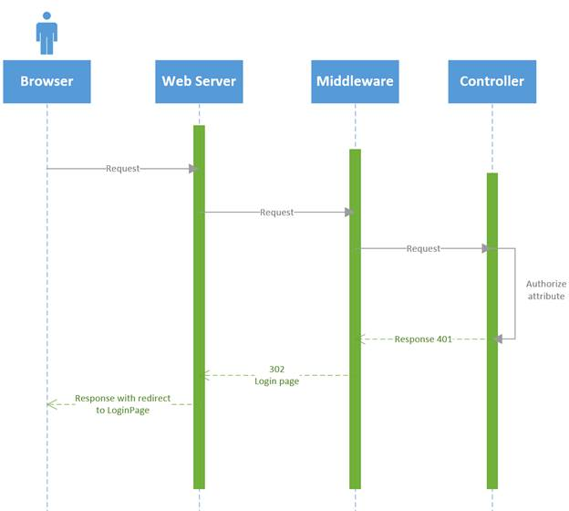

图 37:登录过程的序列图

如图 37 中的序列图所示，中间件将来自控制器的 401 未授权响应更改为 302，将用户重定向到登录页面。

使用 Katana，您可以从几个包中选择进行身份验证。通过使用 NuGet，您可以从以下身份验证类型中进行选择:

*   表单身份验证
*   Twitter 身份验证
*   脸书认证
*   谷歌认证器
*   Windows Azure
*   活动目录
*   OpenID
*   Microsoft 帐户身份验证
*   更多的

## 表单验证

表单身份验证是最广泛的身份验证。NET 世界，最有可能与 ASP.NET MVC 一起使用，因为您将需要呈现 HTML。

在我们深入研究代码之前，了解由 OWIN 管理的表单身份验证和由 ASP.NET MVC 和 WebForms 管理的表单身份验证之间的区别非常重要。

### 特征

下表比较了 ASP.NET MVC 和 OWIN 之间的表单身份验证功能。

表 4:ASP.NET MVC 和 OWIN 的表单授权特性

| 特征 | MVC 认证 | OWIN 认证 |
| --- | --- | --- |
| Cookie 身份验证 | 是 | 是 |
| 无 Cookieless 身份验证 | 是 | 不 |
| 呼气 | 是 | 是 |
| 滑动到期 | 是 | 是 |
| 令牌保护 | 是 | 是 |
| 索赔支持 | 不 | 是 |
| 网络农场支持 | 是 | 是 |
| 未经授权的重定向 | 是 | 是 |

如您所见，Katana 的实现几乎涵盖了 ASP.NET MVC 和声明认证发布的所有特性。这意味着这是一个很好的选择。NET 网络应用程序。不过要小心，如果你需要在你的网站中保持无 cookie 身份验证，你必须创建自己的定制中间件(或者不要使用 OWIN)。

|  | 提示:使用Katana进行表单认证需要 ASP.NET 身份，所以如果你不知道的话，我推荐你看一下 ASP.NET 网站:[http://www.asp.net/identity](http://www.asp.net/identity)。 |

### 安装

有两种方法可以使用 OWIN 进行身份验证来创建项目。第一种方法是使用 ASP.NET MVC 5 中包含的模板，并在此基础上创建您的应用程序。

第二种方法是手动安装和配置正确的软件包，如果您想将 OWIN 添加到现有的应用程序中，这可能是最好的方法。

#### MVC 5 模板

最简单的方法是使用 ASP.NET MVC 5 模板。为此，请打开 Visual Studio 并使用 MVC 模板创建一个新的 web 应用程序项目。

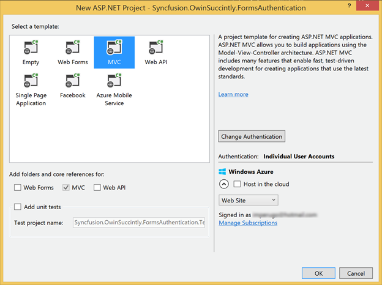

图 38:新 ASP.NET MVC 项目

在点击**确定**之前，重要的是通过点击窗口右侧的**更改认证**按钮来指定认证模式。


图 39:更改身份验证模式

对于表单验证，我们将使用**个人用户帐户**选项。

结果是一个支持表单身份验证和社交身份验证的网络应用程序(脸书、谷歌、推特等)，并使用实体框架创建凭据并将凭据保存到一个 SQL 数据库中。

#### 从头开始或现有应用程序

实现表单身份验证的另一种方法是手动添加 OWIN。如果您要向现有项目添加身份验证，这可能是最有用的方法。

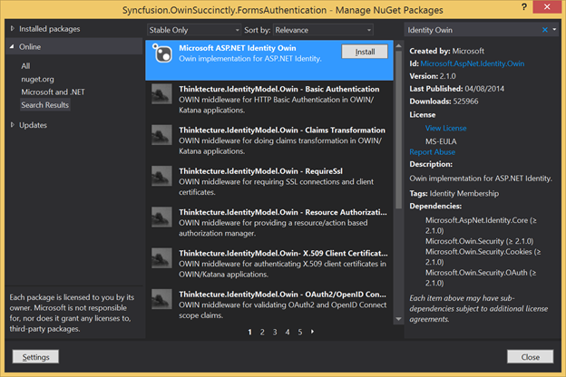

图 40:为 ASP.NET 身份的 OWIN 实现添加 NuGet 包

第一步是安装正确的软件包:`Microsoft.AspNet.Identity.Owin`(如图 40 所示)和`Microsoft.Owin.Host.SystemWeb`。

下图显示了在安装了两个包及其依赖项之后，您应该看到项目中安装了什么。

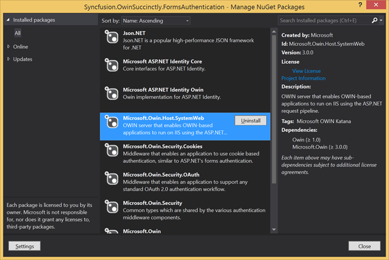

图 41:已安装的 NuGet 包

下一步是创建 OWIN 需要的启动类。

```cs
     using Microsoft.Owin;
    using Owin;
    [assembly: OwinStartupAttribute(typeof(Syncfusion.OwinSuccinctly.FormsAuthentication.Startup))]
    namespace Syncfusion.OwinSuccinctly.FormsAuthentication
    {
        using System;
        using Microsoft.AspNet.Identity;
        using Microsoft.AspNet.Identity.Owin;
        using Microsoft.Owin.Security;
        using Microsoft.Owin.Security.Cookies;
        public class Startup
        {
            public void Configuration(IAppBuilder app)
            {
                app.UseCookieAuthentication(
                    new CookieAuthenticationOptions
                        {
                            AuthenticationType = DefaultAuthenticationTypes.ApplicationCookie,
                            AuthenticationMode = AuthenticationMode.Active,
                            LoginPath = new PathString("/Account/Login")
                        });
            }
        }
    }

```

代码清单 49

代码非常简单。扩展方式`UseCookieAuthentication`启用认证，`CookieAuthenticationOptions`为其配置。

首先要注意的是两个属性`AuthenticationType`和`AuthenticationMode`。

首先是 ASP.NET 身份的一部分。第二个是 OWIN 的一部分，它有两个可能的值，如下表所示。描述来自[官方 MSDN 网站](https://msdn.microsoft.com/en-us/library/microsoft.owin.security.authenticationmode%28v=vs.113%29.aspx)。

表 5:身份验证模式值

| 价值 | 描述 |
| --- | --- |
| 活跃的 | 在活动模式下，认证中间件将在请求到达时改变用户身份，并且还将在响应离开时改变普通 401。 |
| 消极的 | 在被动模式下，认证中间件将仅在被询问时提供用户身份，并且将仅改变 401 响应，其中认证类型在额外质询数据中命名。 |

当然，我们还必须管理其他重要设置，如身份验证 cookies、登录网址等。下表显示了您可以使用`CookieAuthenticationOptions`类管理的所有可用选项。

表 6: Cookie 身份验证选项

| 选择 | 描述 |
| --- | --- |
| `CookieDomain` | 定义 cookie 域。 |
| `CookieHttpOnly` | True(默认)或 False 定义 cookie 是否为`HttpOnly`。 |
| `CookieName` | cookie 的名称(例如`AuthorizationCookie`)。 |
| `CookiePath` | 饼干的路径。默认为`/`。 |
| `CookieSecure` | 有三个选项的枚举:`Always` (HTTPS 场景)、`Never` (HTTP)和`SameAsRequest`(混合 HTTP/HTTPS)。 |
| `ExpireTimeSpan` | 定义 cookie 的过期时间。默认值为 14。 |
| `ReturnUrlParameter` | 成功登录后用于重定向的返回参数的名称。 |
| `SlidingExpiration` | 管理活动用户的过期扩展。 |

正如本章开头的[认证部分](#Controller)所解释的那样， **MVC 控制器**非常重要，因为它包含了防止匿名访问所必需的 authorize 属性。

现在 OWIN 部分已经完成，是时候在 MVC 上写一些代码了。

|  | 注意:在本书中，我们不打算解释 ASP.NET MVC，所以知道什么是控制器、动作和路由，或者如何管理 POST 请求是很重要的。 |

因为 OWIN 配置中指定的登录页面是`/Account/Login`，所以首先要做的是创建`AccountController`和`Login`动作。

```cs
     using System;
    using System.Collections.Generic;
    using System.Linq;
    using System.Web;
    using System.Web.Mvc;
    namespace Syncfusion.OwinSuccinctly.FormsAuthentication.Controllers
    {
        using System.Security.Claims;
        using System.Threading.Tasks;
        using Microsoft.AspNet.Identity;
        using Microsoft.Owin.Security;
        using Syncfusion.OwinSuccinctly.FormsAuthentication.Models;
        public class AccountController : Controller
        {
            //
            // GET: /Account/Login
            [AllowAnonymous]
            public ActionResult Login(string returnURL)
            {
                ViewBag.ReturnURL = returnURL;
                return View();
            }
            //
            // POST: /Account/Login
            [HttpPost]
            [AllowAnonymous]
            [ValidateAntiForgeryToken]
            public async Task<ActionResult> Login(LoginViewModel model, string returnURL)
            {
                if (ModelState.IsValid)
                {
                    if (model.Email == "user@example.com" && model.Password == "Password1")
                    {
                        AuthenticationManager.SignOut(DefaultAuthenticationTypes.ExternalCookie);
                        var user = new IdentityUser("1") { UserName = "user" };
                        var manager = new UserManager<IdentityUser>(new IdentityStore());
                        ClaimsIdentity identity = await manager.CreateIdentityAsync(user, DefaultAuthenticationTypes.ApplicationCookie);
                        AuthenticationManager.SignIn(new AuthenticationProperties() { IsPersistent = model.RememberMe }, identity);
                        return this.Redirect(returnURL);
                    }
                    else
                    {
                        ModelState.AddModelError("", "Invalid username or password.");
                    }
                }
                // If we got this far, something failed, redisplay form
                return View(model);
            }
            private IAuthenticationManager AuthenticationManager
            {
                get
                {
                    return HttpContext.GetOwinContext().Authentication;
                }
            }
        }
    }

```

代码清单 50

如果你从未使用过 ASP.NET 身份，这个代码可能看起来很复杂，但它确实很强大。事实上，我们将在后面看到如何使用相同的方法组合不同类型的身份验证。

前一个代码块最重要的方法是`AuthenticationManager.SignIn`。它创建用于跨请求检查凭据的身份验证 cookie。其他方法(`CreateIdentityAsync`、`UserManager<IdentityUser>`)是 ASP.NET 身份需要的。

#### 测试

如果你做的一切都正确，运行该应用程序并在登录表单中输入*user@example.com*作为用户名和*密码 1* 作为密码，你就应该登录了。

## 社交认证

正如我们刚刚看到的，使用带有 OWIN 和 ASP.NET 身份的表单身份验证非常简单。现在我们将看到如何扩展身份验证，允许用户使用社交网络(如推特、脸书、谷歌等)登录应用程序。

### 社会认证简介

在了解如何在我们的应用程序中实现社交身份验证之前，重要的是要知道所有最著名的社交网络都使用 OAuth 1.x/2.x 作为其身份验证工作流。

OAuth 不是为身份验证而设计的，而是为跨支持 web 的应用程序和 API 网络的授权决策而设计的。事实上，您可以使用 OAuth 来验证需要使用外部 API 的用户或应用程序。

另一个重要的身份验证协议(本书中未解释)是 [OpenID](http://openid.net/) ，这是一个简单的身份层，设计在 OAuth 2.0 协议之上，以可互操作和类似 REST 的方式提供终端用户的基本配置文件信息。

### 引入 OAuth

在本书中，我们不打算解释 OAuth 是如何工作的，也不打算解释如何实现 OAuth 服务器，但是我们需要知道它是什么。

以下是 [OAuth 网站](http://oauth.net/)的一个很好的描述:

一种开放的协议，允许从网络、移动和桌面应用程序以简单和标准的方法进行安全授权。

OAuth 真的很有帮助，因为用户不必完成另一个注册过程，只需通过他们已经使用的社交网络之一登录即可。

此外，不会与第三方应用程序共享任何用户凭据，因为客户端应用程序(本例中是您的网站)和授权服务器(脸书、推特、谷歌等)之间的所有通信都是基于令牌的。

下图显示了 OAuth 授权流的序列图。

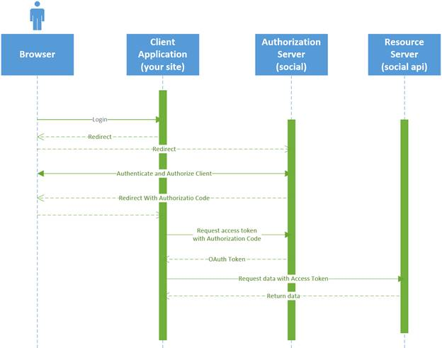

图 42: OAuth 序列图

尽管这个工作流程看起来很复杂，但实际上并不复杂。当我们使用脸书这样的社交网络登录应用程序时，我们已经习惯了这种工作流程。其实这个画面我们已经看过上千次了。

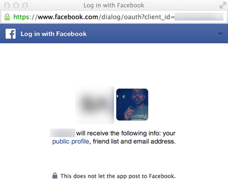。

图 43:脸书授权请求

该屏幕是图 42 中的**认证和授权客户端**步骤。

### 建立 OWIN

现在，我们已经清楚了什么是 OAuth 以及它是如何工作的，是时候设置您的 OWIN 应用程序了。

|  | 注意:解释的其余部分的代码建立在本章的[表单认证](#_Form_Authentication)部分创建的示例之上。 |

因为身份验证来自外部应用程序(社交网络)，所以配置我们的中间件以接受外部 cookies 进行身份验证非常重要。

```cs
     app.UseExternalSignInCookie(DefaultAuthenticationTypes.ExternalCookie);

```

代码清单 51

现在应用程序差不多准备好了，我们需要配置所需的社交媒体和正确的端点(MVC 动作)来管理我们的应用程序和身份验证服务器之间的通信。

最后一部分对于所有的社交认证都是一样的，因为它们都基于相同的协议(准确地说是 OAuth)。我们将在 [OAuth 令牌验证](#_OAuth_Token_Validation)部分进一步解释这最后一部分。

|  | 注意:推特、脸书和谷歌版块非常相似。如果不需要实现所有这些提供者，可以选择自己喜欢的，跳转到 [OAuth Token Validation](#_OAuth_Token_Validation) 部分。 |

## 推特认证

推特和脸书是最受欢迎的社交网络之一，尤其是如果你是一名开发者。因此，它提供了在您的应用程序中使用其身份验证的机会。

### 注册您的申请

正如我们在上一节中看到的，OAuth 需要向授权服务器注册。要使用推特的认证，我们需要前往位于[apps.twitter.com](https://apps.twitter.com/)的推特应用管理网站，按照步骤注册应用。


图 44:创建新的应用程序

使用 OWIN，您不必指定回调网址，因为它使用默认值`signin-twitter`。

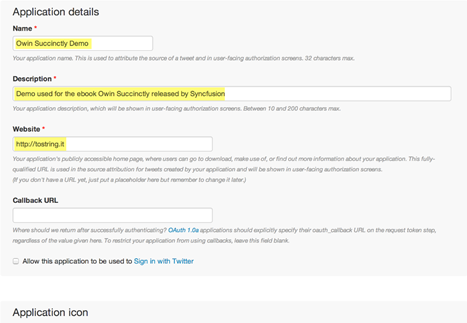

图 45:注册申请表

为了完成与 Twitter 的集成，我们需要我们刚刚注册的应用程序的 API 密钥和 API 秘密。打开**密钥和访问令牌**标签。

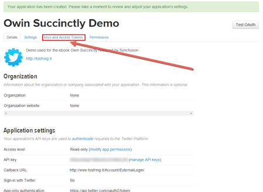

图 46:注册的应用程序摘要


图 47:注册应用程序接口

|  | 注意:默认情况下，推特应用程序是只读的。这意味着你的应用程序不能为用户发微博，只能读取数据。如果您想做更多，可以通过单击“更改应用程序权限”按钮来更改。 |

现在我们已经准备好了所有的要素，我们可以继续在我们的应用程序上编写代码，并添加 OWIN 推特包`Microsoft.Owin.Security.Twitter`。

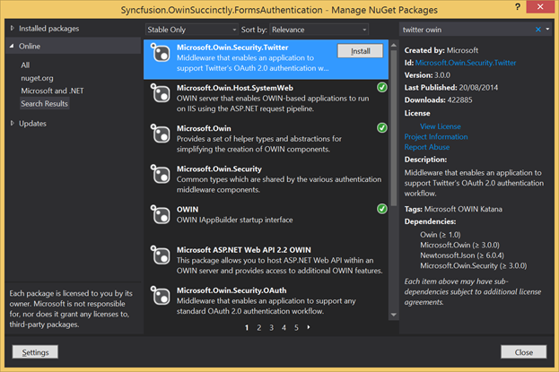

图 48:带有推特相关 OWIN 包的 NuGet 包管理器

最后，将您的 API 密钥粘贴到 OWIN 配置文件中。

```cs
     app.UseTwitterAuthentication(
        consumerKey: "my-api-key",
        consumerSecret: "my-api-secret");

```

代码清单 52

现在 OWIN 的部分完成了。我们不需要在这里写更多的代码(这就是 OWIN 如此酷的原因)。下一步是编写必要的代码来管理令牌、cookies 和 OAuth 所需的所有其他东西。我们将在 [OAuth 令牌验证](#_OAuth_Token_Validation)部分介绍这一部分。

## 脸书认证

脸书认证与推特没有太大区别，因为它基于相同的协议，所以我们将在推特上遵循相同的步骤，但在脸书网站上。

### 注册您的申请

因为 OAuth 需要向授权服务器注册，所以我们需要到位于[developers.facebook.com/apps](https://developers.facebook.com/apps)的脸书开发者网站注册我们的应用程序，获取必要的密钥来整合两个应用程序之间的登录。

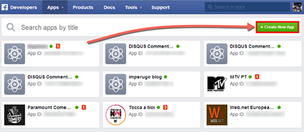

图 49:注册一个新的脸书应用


图 50:创建新的应用程序

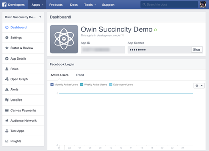

图 51:注册的应用程序摘要

现在我们已经创建了应用程序，我们必须指定允许的域。在我们的例子中，它将是 *localhost* ，但是您还需要指定您的生产域。下图展示了这些步骤。

在脸书开发者网站创建应用后，点击页面左侧**设置**，然后点击**添加平台**按钮。

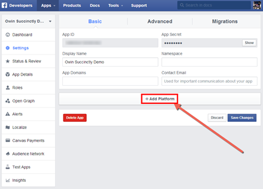

图 52:应用程序设置

选择**网站**选项。

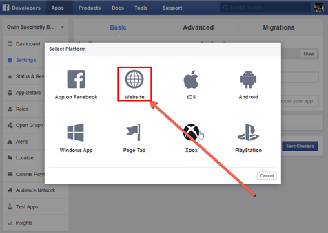

图 53:添加新平台

指定`localhost`为**应用领域**和**网站网址**。


图 54:应用程序设置

最后，一切准备就绪，我们可以将 **App ID** 和 **App Secret** 注册到 OWIN，但首先需要从 NuGet、`Microsoft.Owin.Security.Facebook`安装正确的 OWIN 脸书包。

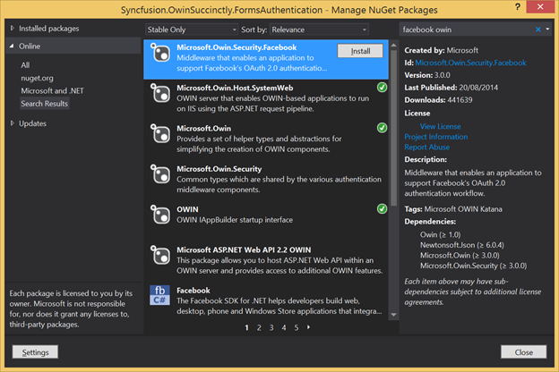

图 55:使用与脸书相关的 OWIN 包管理 NuGet 包

正如您对 Twitter 身份验证所做的那样，在 OWIN `Startup`类中指定`appId`和`appSecret`。

```cs
     app.UseFacebookAuthentication(
        appId: "my-app-id",
        appSecret: "my-app-secret");

```

代码清单 53

我们完了。脸书与 OWIN 的整合现在已经完成，但是有必要管理请求之间的 cookies。我们将在 [OAuth 令牌验证](#_OAuth_Token_Validation)部分介绍这一部分。

## 谷歌认证

直到几个月前，谷歌还在提供使用基于不同协议的认证的机会:

*   openid 2.0
*   OAuth 1.0
*   OAuth 2.0

出于安全原因，不再可能使用前两种类型的身份验证，因此我们必须在谷歌开发者控制台上做与脸书和推特相同的事情。

### 创建您的项目

谷歌对注册过程使用了不同的命名。事实上，这里您不是注册您的应用程序，而是创建一个项目。

前往位于[console.developers.google.com/project](https://console.developers.google.com/project)T2 的谷歌开发者控制台，创建一个新项目。


图 56:创建项目

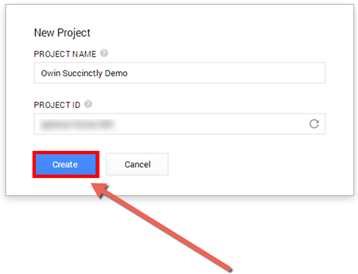

图 57:新项目表单

几秒钟后，项目应该被创建，我们可以管理我们的客户凭证。点击屏幕左侧的**凭证**选项。

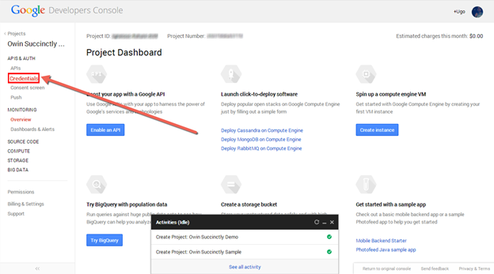

图 58:凭据设置

在 OAuth 标题下，点击**创建新客户端标识**按钮。

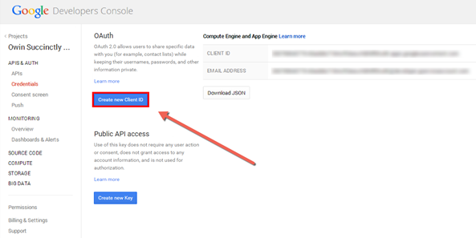

图 59:创建新的客户端标识

指定`/signin-google`作为重定向 URI。OWIN 自动管理回调网址，每个社交认证有不同的回调。

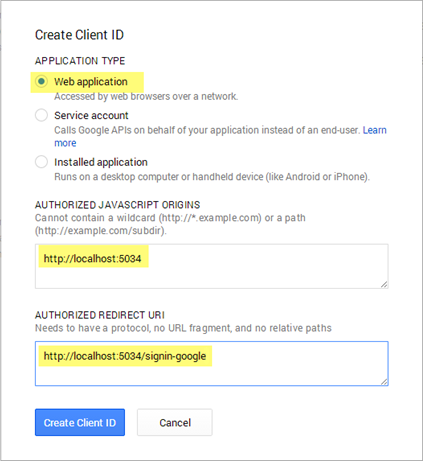

图 60:创建客户标识表单

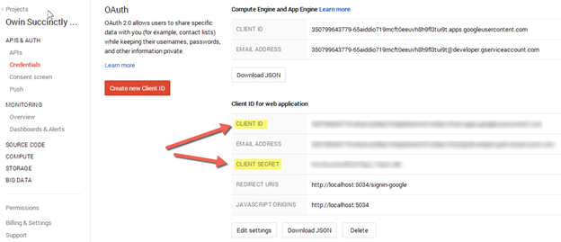

图 61:凭证

现在您的项目已经注册了谷歌认证，请通过 NuGet 安装谷歌认证提供程序包。

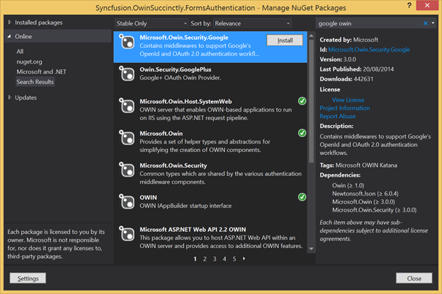

图 62:谷歌安全 NuGet 包

最后，将**客户端标识**和**客户端密码**值复制到 OWIN `Startup`类中。

```cs
     app.UseGoogleAuthentication(
        clientId: "my-client-id",
        clientSecret: "my-client-secret");

```

代码清单 54

OWIN 谷歌整合已经完成，但让我们看看如何让您的用户通过他们的社交网络帐户登录。

## OAuth 令牌验证

既然所有的社交媒体站点都准备好与我们的应用程序进行通信，那么正确配置应用程序以接受它们的回调就很重要了。

|  | 注意:我们将在本节中看到的代码是 ASP.NET MVC 代码和 ASP.NET 身份的一部分。这里没有什么是 OWIN，但完成整合是必要的。此外，有几种方法可以创建这一部分。ASP.NET 身份不是唯一的，但有人建议。 |

### 在登录页面显示登录按钮

当然，我们必须在登录页面上显示正确的登录按钮。这不仅意味着经典的登录形式，也意味着我们的社交认证融合。这里的目标是为我们在应用程序中注册的每个社交网络创建一个“登录...”按钮。

为此，我们必须使用特定的扩展方法为`HttpContextBase`类检索所有注册的社交认证，该方法返回一个包含我们所需的所有信息的`OwinContext`。

在我们的`Login.cshtml`文件中，我们必须使用以下代码检索所有注册的社交认证。

```cs
     @{
        var loginProviders = Context.GetOwinContext()
            .Authentication.GetExternalAuthenticationTypes();
    }

```

代码清单 55

现在我们必须遍历它们并创建登录按钮，但是在这样做之前，理解为什么我们不能简单地在页面中放置链接是很重要的。

例如，当用户点击推特上的认证链接时，我们必须发送一组信息来指定推特正在调用哪个应用程序、重定向网址和其他信息。这个信息的一部分必须在 HTTP 请求头中指定，所以我们必须创建一个 POST 表单，将提供者信息提交给我们的 MVC 操作，然后将用户重定向到社交网络进行身份验证。

仍然在使用我们的`Login.cshtml`文件，下面的代码就是这么做的。

```cs
     @using (Html.BeginForm("ExternalLogin", "Account"))
    {
    @Html.AntiForgeryToken()
    <div id="socialLoginList">
        <p>
            @foreach (AuthenticationDescription p in loginProviders)
            {
                <button type="submit" class="btn btn-default"
                        id="@p.AuthenticationType" name="provider"
                        value="@p.AuthenticationType"
                        title="Log in using your @p.Caption account">
                        @p.AuthenticationType
                </button>
            }
        </p>
    </div>
    }

```

代码清单 56

直到现在，还没有什么复杂的东西；我们检索注册的提供者，迭代集合，并创建一个按钮。每个按钮提交给发送认证提供者的`AccountController`中的一个名为`ExternalLogin`的动作。

现在我们必须获取这些信息，并将其重定向到社交认证。打开我们在[表单认证](#_Form_Authentication)部分创建的`AccountController`并添加以下代码。

```cs
     [HttpPost]
    [ValidateAntiForgeryToken]
    public ActionResult ExternalLogin(string provider, string returnURL)
    {
        // Request a redirect to the external login provider
        return new ChallengeResult(
            provider,
            URL.Action(
                "ExternalLoginCallback",
                "Account",
                new { ReturnURL = returnURL }
                )
            );
    }

```

代码清单 57

代码真的很简单。该操作获取提供者并将用户重定向到登录页面，发送回调 URL ( `ExternalLoginCallback`)。

对于 MVC 开发人员来说，不寻常的代码是类`ChallengeResult`，它不是 MVC、Identity 或 OWIN 的一部分，所以我们必须创建它。

```cs
     internal class ChallengeResult : HttpUnauthorizedResult
    {
        public ChallengeResult(string provider, string redirectUri)
            : this(provider, redirectUri, null)
        {
        }
        public ChallengeResult(string provider, string redirectUri, string userId)
        {
            LoginProvider = provider;
            RedirectUri = redirectUri;
            UserId = userId;
        }
        public string LoginProvider { get; set; }
        public string RedirectUri { get; set; }
        public string UserId { get; set; }
        public override void ExecuteResult(ControllerContext context)
        {
            var properties = new AuthenticationProperties() { RedirectUri = RedirectUri };
            if (UserId != null)
            {
                properties.Dictionary["XsrfId"] = UserId;
            }
            context.HttpContext.GetOwinContext().Authentication.Challenge(properties, LoginProvider);
        }
    }

```

代码清单 58

所有这些对于创建正确的重定向请求都是必要的。现在我们已经准备好了操作，让我们尝试一下应用程序。

如果我们做对了所有的事情，登录布局应该会在我们的应用程序中产生以下结果。


图 63:登录页面

点击**推特**按钮应该会重定向到请求授权该应用的推特页面。

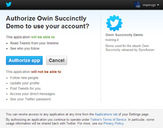

图 64:推特授权应用页面

接下来，在提供了正确的凭证之后，我们应该被送回我们的应用程序，在那里我们会得到一个错误。


图 65: 404 调用回调页面时出错

不用担心。没关系。社交登录正在将用户重定向到`Account/ExternalLoginCallback`，因为我们之前已经指定了。现在我们必须创建操作来处理回调。

```cs
     [AllowAnonymous]
    public async Task<ActionResult> ExternalLoginCallback(string returnURL)
    {
        var loginInfo = await AuthenticationManager.GetExternalLoginInfoAsync();
        if (loginInfo == null)
        {
            return RedirectToAction("Login");
        }

        //Verify if a user with loginInfo.Login exists in your database
        var user = new IdentityUser("1") { UserName = "imperugo" };
        if (user != null)
        {
            AuthenticationManager.SignOut(DefaultAuthenticationTypes.ExternalCookie);
            var manager = new UserManager<IdentityUser>(new IdentityStore());
            ClaimsIdentity identity = await manager.CreateIdentityAsync(user, DefaultAuthenticationTypes.ApplicationCookie);
            AuthenticationManager.SignIn(new AuthenticationProperties(), identity);
            return this.RedirectToAction("Index", "Home");
        }
        else
        {
            // If the user does not have an account, then prompt the user to create an account
            return View("ExternalLoginConfirmation", new ExternalLoginConfirmationViewModel { Email = loginInfo.Email });
        }
    }

```

代码清单 59

通过再次运行演示应用程序并使用注册的社交网络之一登录，您应该能够看到受保护的页面。

当然，这段代码只是一个演示。在最终的应用程序中，您必须实现您的登录持久性，但是演示工作正常，并且允许您轻松测试登录集成。

### 结论

在本章中，您已经学习了如何使用 OWIN 和卡塔纳与不同的提供商管理身份验证，从经典的表单身份验证开始，尝试最常见的社交网络，如推特、脸书和谷歌。

NuGet 为微软、雅虎和许多其他公司提供了其他提供商，所以浏览一下 [NuGet](https://www.nuget.org/packages?q=owin+security) 看看还有什么。