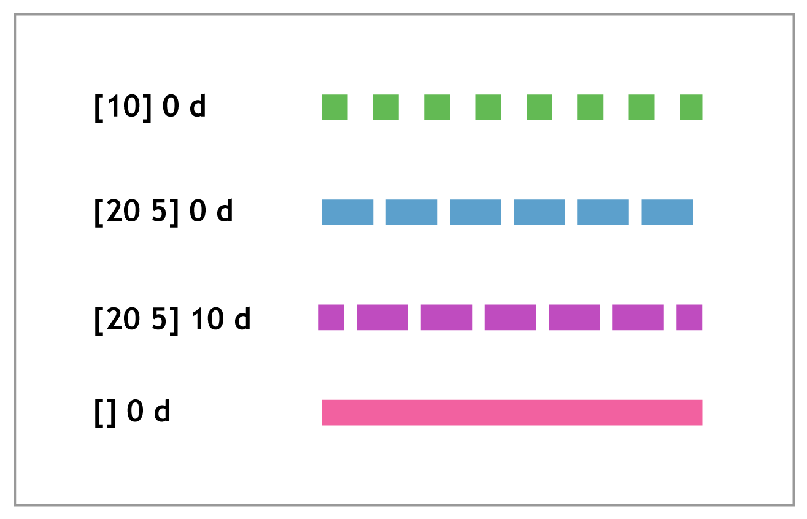
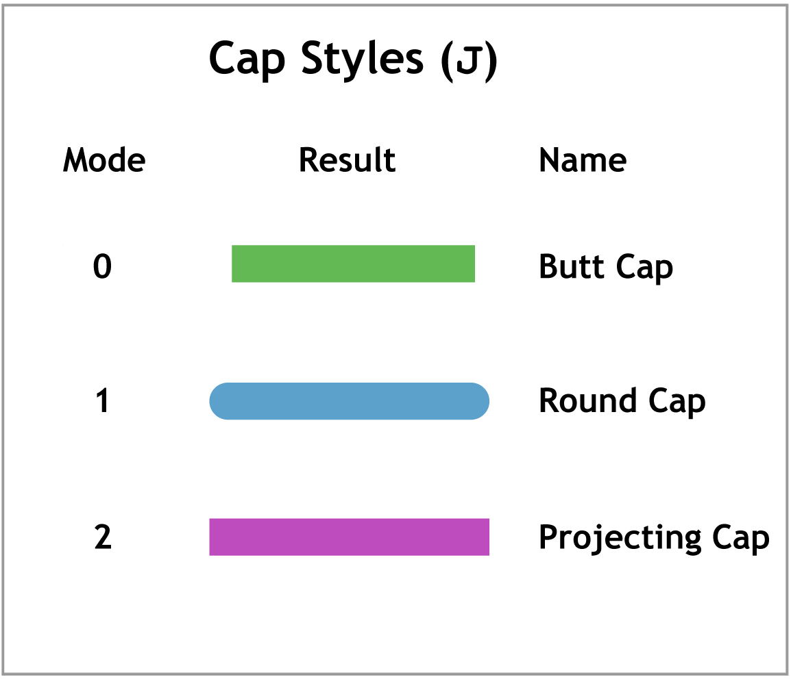
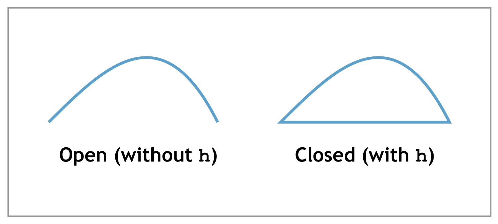
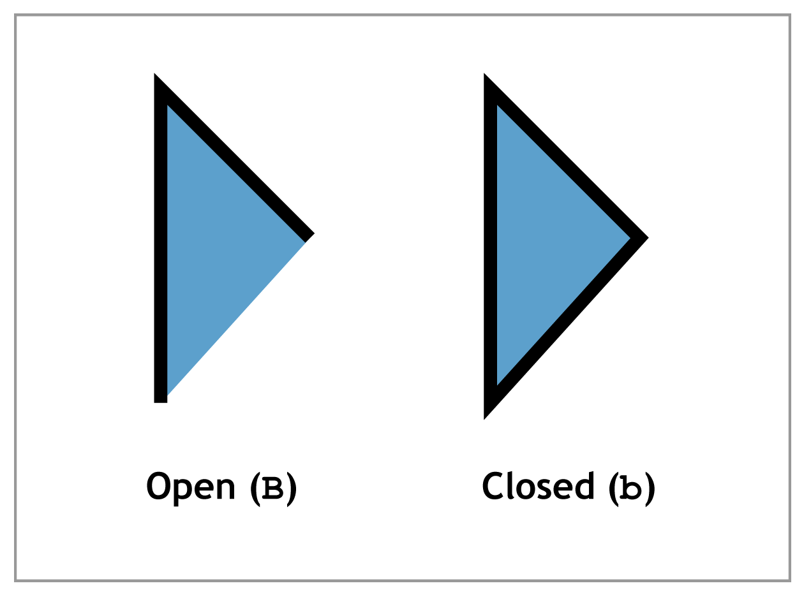
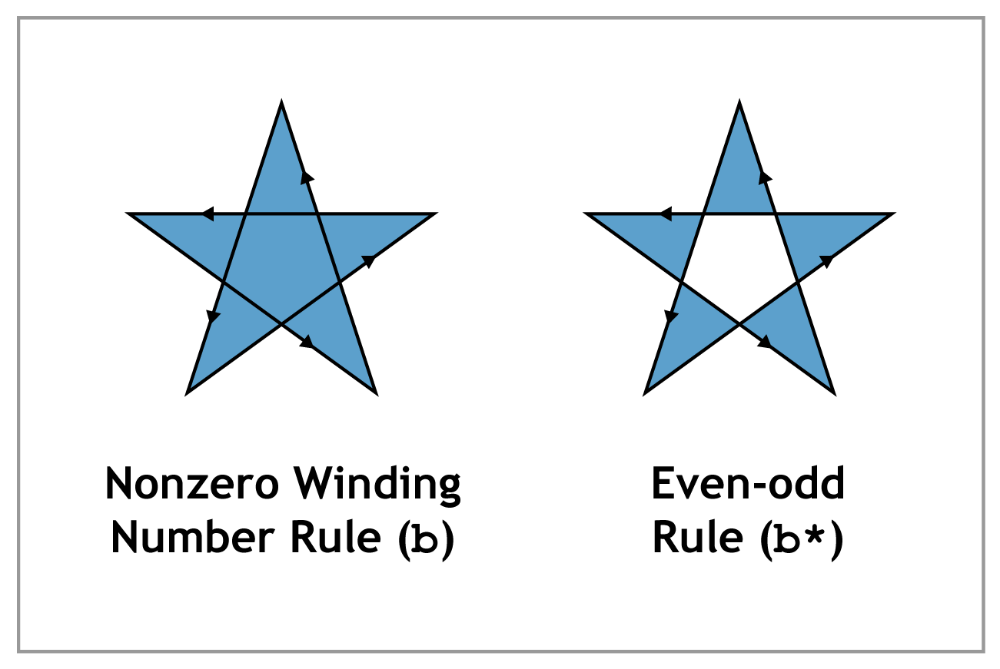

# 第四章图形操作符

除了文本，pdf 也是精确复制矢量图形的可靠格式。事实上，Adobe Illustrator 文件格式(。ai)实际上只是 PDF 文件格式的扩展形式。本章介绍了 PDF 图形模型的核心组件。

## 基础

像文本操作符一样，图形操作符只为页面内容流中表示图形的*提供低级功能。pdf 没有“圆形”和“矩形”——它们只有路径。*

绘制路径类似于绘制文本，只是在绘制之前必须构造整个路径，而不是定位文本光标。创建矢量图形的一般过程是:

1.  定义图形状态(填充/描边颜色、不透明度等)。).
2.  构建一条路径。
3.  将路径绘制到页面上。

例如，下面的流在页面中间画一条垂直线:

```
        10 w
        306 396 m
        306 594 l
        S

```

首先，用`w`操作符将笔画宽度设置为 10 点。然后，我们开始通过将图形光标移动到带有`m`的点(306，396)来构建路径。这类似于设置文本位置的`Td`命令。接下来，我们使用`l`(小写 L)运算符绘制一条从当前位置到点(306，594)的线。此时，路径是不可见的——它仍处于构建阶段。需要使用`S`操作符绘制路径。所有路径都必须以这种方式明确描边或填充。


图 14:前一个流的屏幕截图(未按比例绘制)

还要注意图形不需要像文本操作符一样被`BT`和`ET`命令包装。

接下来，我们将仔细研究生成图形的每个阶段的通用运算符。

## 图形状态运算符

图形状态操作符类似于文本状态操作符，因为它们都会影响所有绘画操作的外观。比如设置笔画宽度会决定所有后续路径的笔画宽度，就像`Tf`设置所有后续文字的字体和大小一样。本节涵盖以下图形状态运算符:

*   `<width> w`:设置笔画宽度。
*   `<pattern> <phase> d`:设置笔画划线模式。
*   `<cap> J`:设置线帽样式(端点)。
*   `<cap> j`:设置线条连接样式(边角)。
*   `<limit> M`:设置转角的斜接极限。
*   `<a> <b> <c> <d> <e> <f> cm`:设置图形变换矩阵。
*   `q`和`Q`:创建一个孤立的图形状态块。

### w 运算符

`w`运算符定义未来路径的笔画宽度，以点为单位。但是请记住，pdf 在构建路径时不会绘制路径的笔画——这需要一个绘制操作符。

### d 运算符

`d`操作符定义笔画的虚线模式。它需要两个参数:一个数组和一个偏移量。数组包含一系列长度的破折号图案。例如，下面的流创建了一条 20 点划线的线，中间有 10 个点。

```
        10 w
        [20 10] 0 d
        306 396 m
        306 594 l
        S

```

下图中包括一些破折号示例。最后一个向您展示了如何将破折号状态重置为实线。



图 15:展示`d`行为的虚线

### J、J 和 M 运算符

所有这三个操作符都与路径段末端的样式有关。`J`运算符定义帽样式，`j`确定连接样式。它们都采用一个整数来表示要使用的样式。下图显示了可用选项。



图 16a:线帽的可用模式


图 16b:线连接的可用模式

`M`操作者设置斜接极限，该极限决定斜接拐角何时变成斜面。这可以防止粗线条有长而尖的角。考虑下面的流。

```
        10 w
        5 M
        306 396 m
        306 594 l
        336 500 l
        S

```

`5 M`命令将原本斜切的角变成斜切的角。


图 17:用`5 M`强制斜角

将斜接限制从`5 M`增加到`10 M`将允许 PDF 显示一个锐角。

### 厘米操作符

很像`Tm`运算符，`cm`为绘制到页面上的所有内容设置变换矩阵。像`Tm`矩阵一样，它可以旋转、缩放和扭曲图形。但是它最常见的用法是改变页面的来源:

```
        1 0 0 1 306 396 cm
        10 w
        5 M
        0 0 m
        0 198 l
        30 104 l
        S

```

该流从将原点移动到页面中心(而不是左下角)开始。然后，它绘制与上一节完全相同的图形，但使用的坐标是相对于新原点的。

### Q 和 Q 算子

复杂的图形通常由较小的图形构建而成，它们都有自己的状态。通过将操作符放在`q` / `Q`块中，可以将元素彼此分开:

```
        q
            1 0 0 1 306 396 cm
            10 w
            0 0 m
            0 198 l
            30 104 l
            S
        Q
        BT
            /F0 36 Tf
            (I'm in the corner!) Tj
        ET

```

`q`和`Q`操作员之间的一切都发生在一个孤立的环境中。一调用`Q`就忘记了`cm`操作符，原点回到左下角。

### RG、RG、K 和 K 运算符

虽然颜色在技术上不被认为是图形状态操作符，但它们确实决定了所有未来绘图操作符的颜色，因此这是引入它们的合理位置。

pdf 可以代表几种颜色空间，其中最常见的是 RGB 和 CMYK。此外，笔画颜色和填充颜色可以独立选择。这为我们提供了四种选择颜色的操作符:

*   `RG`:将笔画颜色空间改为 RGB，设置笔画颜色。
*   `rg`:将填充颜色空间改为 RGB，设置填充颜色。
*   `K`:将笔画颜色空间改为 CMYK，设置笔画颜色。
*   `k`:将填充颜色空间改为 CMYK，设置填充颜色。

RGB 颜色分别定义为红色、绿色和蓝色分量的百分比，介于 0 和 1 之间。例如，下面定义了带有蓝色填充的红色笔划。

```
        0.75 0 0 RG
        0 0 0.75 rg
        10 w
        306 396 m
        306 594 l
        336 500 l
        B

```

同样，CMYK 运算符采用四个百分比，青色、品红色、黄色和黑色各一个。前一个流使用`B`操作符，该操作符敲击*和*来填充路径。

## 路径建设运营商

设置图形状态就像选择一把画笔，然后在上面涂上颜料。下一步是将图形绘制到页面上。然而，我们必须将图形表示为数字路径，而不是将物理画笔放在页面上。

PDF 路径功能少得惊人:

*   `<x> <y> m`:将光标移动到指定点。
*   `<x> <y> l`:从当前位置到指定点画一条线。
*   `<x1> <y1> <x2> <y2> <x3> <y3> c`:向当前路径追加一条三次贝塞尔曲线。
*   `h`:用从当前位置到路径起点的线段关闭当前路径。

### m 运算符

`m`操作者将图形光标(“画笔”)移动到页面上的指定位置。这是一个非常重要的操作——没有它，所有的路径段都将被连接起来，并从原点开始。

### L(小写 L)运算符

`l`操作者从当前点到另一点画一条线。在前面的章节中，我们已经多次看到了这一点。

请记住，PDF 是文本和图形的低级表示，因此 PDF 文档中没有“带下划线的文本”。只有文字和线条(作为完全独立的实体)。必须手动为文本加下划线。

```
        .5 w
        174 727 m
        224 727 l
        S
        BT
            50 730 Td
            /F0 12 Tf
            (There is no such thing as underlined text!) Tj
        ET

```

### c 运算符

该操作符创建三次贝塞尔曲线，这是表示复杂矢量图形的最常见方式之一。三次贝塞尔曲线由四个点定义:


图 18:贝塞尔曲线

如果您曾经在 Adobe Illustrator 中使用过钢笔工具，您应该熟悉贝塞尔曲线。上图所示的曲线可以用以下的流在 PDF 中创建。

```
        3 w
        250 250 m
        300 400 450 450 550 250 c
        S

```

第一个锚点是当前位置(250，250)，第一个控制点是(300，400)，第二个控制点是(450，450)，最后一个锚点是(550，250)。

### h 运算符

`h`操作者使用从当前点到路径开始的线段来关闭当前路径。不需要争论。该操作符通常可以省略，因为许多绘制操作符会在绘制当前路径之前自动关闭它。



图 19:用`h`操作符关闭构建的路径

`m`、`l`、`c`和`h`是一个 PDF 中的四个主要施工操作符。同样，在 PDF 规范中没有“形状”操作符——您不能创建“圆形”或“三角形”但是，所有形状都可以近似为一系列直线、贝塞尔曲线或两者兼有。由 PDF 编辑器应用程序向文档作者提供更高级别的形状，并将它们转换为这些简单构造操作的序列。

## 图形绘制操作符

一旦你完成了一个路径的构建，你必须用一个画图操作符显式地绘制它。这类似于用于绘制文本的`Tj`操作符。应用一个绘制操作符后，构建的路径就完成了*—不能再对其应用绘制操作符，对一个构建操作符的另一个调用将开始一个新的路径。*

 *### S 和 S 运算符

`S`和`s`操作人员使用`w`设定的笔画宽度和`RG`或`K`设定的笔画颜色绘制构建路径的笔画。在将笔划应用于路径之前，小写版本用线段关闭当前路径。这和`h S`的行为完全一样。

### f 运算符

`f`操作者用`rg`或`k`设置的当前填充颜色填充构建的路径。当前路径*必须在绘制填充之前关闭*，因此没有等效于首都`S`的笔画。下面的流创建了一个蓝色三角形。

```
        0 0 0.75 rg
        10 w
        306 396 m
        306 594 l
        400 500 l
        f

```

请记住，绘制路径将完成当前路径。这意味着序列`f S`将仅填充路径——该`S`适用于尚未构建的*新*路径。为了填补*和*的行程，我们需要一个专门的操作员。

### B 和 B 运算符

`B`和`b`操作人员在*和*上绘制电流路径。像`s`一样，小写的`b`在画之前关闭路径。但是，由于填充路径会隐式关闭路径，`B`和`b`之间的区别只能在笔画中看到，如下图所示。



图 20:通过绘画操作决定打开或关闭路径

### 运算符*(星号)

对于简单的形状，`f`、`B`和`b`的填充行为相对简单。当您开始处理彼此相交的路径时，绘制填充会变得更加复杂。例如，考虑以下情况:



图 21: PDF 的填充算法

可以看到，这样的路径可以用两种不同的方法填充:*非零缠绕数规则*或*奇偶规则*。这些算法的技术细节超出了本书的范围，但它们的效果在前面的图表中显而易见。

到目前为止，我们看到的填充运算符使用非零缠绕数规则。pdf 有专用于奇偶规则填充的运算符:`f*`、`B*`和`b*`。除了填充算法之外，这些操作符的工作方式与它们的非星号对应操作符完全相同。

## 总结

pdf 最初被设计成物理纸张和墨水的数字表示。本章介绍的图形操作符可以将任意路径表示为一系列直线和曲线。

像它们的文本对应物一样，图形操作符是*程序性的*。他们模仿一个艺术家为了画同样的图像而采取的动作。如果你是从零开始*创建*图形，这可能是直观的，但是如果你试图手动*编辑*图像，这可能会变得相当复杂。例如，说“从这里到那里画一条线”这样的话很容易，但说“把这个盒子向左移动两英寸”就难多了同样，这项任务留给了 PDF 编辑器应用程序。*