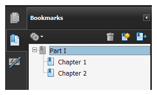

# 第五章导航和注释

我们已经看到了 pdf 如何在数字文件中准确地表示物理文档，但它们也提供了利用其介质的强大功能。虽然交互式导航和可编辑的评论在实体书上是不可能的，但是 pdf 可以让你很容易地记笔记，与他人分享，并为重要的位置添加书签。

本章探讨了三种最重要的用户交互类型:文档大纲、超链接和文本注释。

## 制剂

在探索 PDF 的内部导航方案之前，我们需要一个足够长的文档来演示这些交互功能。对于我们的例子，我们所需要做的就是添加另一个页面。这也将作为核心 PDF 对象的相关审查。

让我们从将页面添加到文档根目录开始。这里唯一的变化是在`/Kids`条目中增加`6 0 R`。

```
        1 0 obj << /Type /Pages
           /Kids [2 0 R 6 0 R]
           /Count 2 >>  endobj

```

接下来，我们需要创建页面对象并给它一个 ID`6 0`。对象可以以任何顺序出现，因此您可以将它放在文档正文的任何位置。

```
        6 0 obj << /Type /Page
           /MediaBox [0 0 612 792]
           /Resources 3 0 R
           /Parent 1 0 R
           /Contents [7 0 R] >> endobj

```

这看起来与我们的另一个页面(`2 0 obj`)完全一样，但它指向不同的内容流(`7 0 R`)。这一页将包含一点点文本数据。

```
        7 0 obj << >> stream 1 0 0 1 50 706 cm BT     24 TL     /F0 36 Tf     (Page Two) Tj T*     /F0 12 Tf     (This is the second page of our document.) Tj ET endstream endobj

```

这就是我们创建另一个页面所要做的。

## 文件大纲

复杂的 pdf 通常带有交互式目录，便于用户导航。在内部，这被称为**文件大纲**。PDF 阅读器通常将此大纲显示为嵌套树，用户可以打开和关闭。



图 22:Adobe Acrobat Pro 中文档轮廓的截图

这种树的结构与文档的页面对象和内容流分开维护。但是，像这些组件一样，文档大纲从目录对象开始。在我们现有的目录中添加一个`/Outlines`条目。

```
        5 0 obj << /Type /Catalog
           /Pages 1 0 R
           /Outlines 8 0 R >> endobj

```

这指向文档大纲的根。我们将创建一个非常简单的轮廓，看起来与上图中所示的完全一样。它包含一个根节点。

```
        8 0 obj << /First 9 0 R
           /Last 9 0 R >> endobj

```

`/First`和`/Last`条目是对大纲中唯一顶层节点的引用。在现实世界中，一个 PDF 可能有不止一个顶级节点，但你明白了。接下来，我们需要创建以下节点。

```
        9 0 obj << /Parent 8 0 R
           /Title (Part I)
           /First 10 0 R
           /Last 11 0 R
           /Dest [2 0 R /Fit] >> endobj

```

`/Parent`分回文档根。`/Title`是包含 PDF 阅读器显示的章节标题的字符串。`/First`和`/Last`与`8 0 obj`中的相同——它们指向该节点的第一个和最后一个子节点。因为这个节点会有两个子节点，`/First`和`/Last`是不同的。

最后，`/Dest`条目定义了导航项目的目的地。目标是文档中的特定位置，指定为页码、页面上的位置和放大倍数。在这种情况下，我们希望显示第一页(`2 0 R`)并缩放以适合阅读器窗口中的整个页面(当页面缩放到适合时，无法指定位置)。除了`/Fit`之外，还有几个关键词可以用于精细控制用户与文档的交互。其中一些将很快介绍。

接下来，我们需要将两个子节点添加到“第一部分”。第一个将导航到第二页的顶部。

```
        10 0 obj << /Parent 9 0 R
           /Title (Chapter 1)
           /Next 11 0 R
           /Dest [6 0 R /FitH 792] >> endobj

```

这个看起来很像它的父节点，但是没有子节点，所以`/First`和`/Last`可以省略。相反，它需要一个`/Next`入口来指向它的兄弟。`/FitH`关键字指示 PDF 阅读器缩放到刚好足以使页面宽度填满窗口宽度。`/FitH`后是要显示在窗口顶部的垂直坐标。因为我们想导航到页面的顶部，所以我们指定了页面的高度；但是，传递一个较低的值会让您在页面中向下滚动一部分。有一个对应的`/FitV`关键词，垂直填充，从页面左侧偏移。

最后，我们到达最后一个导航项目。这个将指向第二页中间的目的地。

```
        11 0 obj << /Parent 9 0 R
           /Title (Chapter 2)
           /Prev 10 0 R
           /Dest [6 0 R /XYZ 0 396 2] >> endobj

```

同样，这就像前一个节点，除了它有一个`/Prev`指向它的前一个兄弟节点。此外，我们使用`/XYZ`关键字手动指定位置(0，396)和放大率(2)，而不是缩放以适应。

现在，您应该能够使用 pdftk 编译您的 PDF 并查看文档大纲(您可能需要打开书签面板才能看到它)。您会注意到“第一部分”节点在默认情况下总是关闭的。如果您想打开它，请在顶级节点(`9 0 obj`)中添加一个`/Count 2`条目。`/Count`条目包含可见子节点的数量。省略它会隐藏所有子节点。

总而言之，文档大纲由一系列导航项目组成。`/First`、`/Last`、`/Next`、`/Prev`和`/Parent`词典条目将条目相互关联，并从整体上定义了大纲的结构。每个项目还包含一个要导航到的目标，它被定义为页面、位置和放大倍数。

### 最初的目的地

除了定义用户控制的导航树，目录对象还可以控制要显示的初始页面。这可以通过将目的地传递给目录对象中的`/OpenAction`条目来实现。

```
        5 0 obj << /Type /Catalog
           /Pages 1 0 R
           /Outlines 8 0 R
           /OpenAction [6 0 R /Fit] >> endobj

```

现在，当您打开文档时，将显示第二页(`6 0 obj`)，查看器将缩放以适合整个页面。

## 超链接

也可以在文档中创建超链接*跳转到另一个目的地。PDF 超链接不像 HTML 链接，链接与文本直接相连——它们只是放置在页面顶部的矩形区域，很像图形。它们更像按钮，而不是真正的超链接。*

超链接是许多类型的*注释*之一。注释是与特定页面相关联的额外信息。页面不能共享注释。第二种最常见的注释类型是注释，我们稍后将讨论它。

注释存储在页面对象中`/Annots`条目下的数组中。我们的链接将在第二页(`6 0 obj`):

```
        6 0 obj << /Type /Page
           /MediaBox [0 0 612 792]
           /Resources 3 0 R
           /Parent 1 0 R
           /Contents [7 0 R]
           /Annots [12 0 R] >> endobj

```

接下来，我们需要创建注释。

```
        12 0 obj << /Type /Annot
           /Subtype /Link
           /Dest [2 0 R /Fit]
           /Rect [195 695 248 677] >> endobj

```

`/Subtype`条目告诉 PDF 阅读器，这是一个超链接，而不是注释，或者其他种类的注释之一。和导航项目一样，`/Dest`是用户点击链接时跳转到的目的地。最后，`/Rect`是一个定义超链接区域的矩形。同样，链接并不直接与文本相关联——它们只是页面上的一个区域。

如果不喜欢超链接矩形周围的可见边框，可以用:`/Border [0 0 0]`去掉。

## 文字注释

文本注释是用户定义的与页面上某个位置相关联的注释。它们通常显示为用户可以打开和关闭的“便笺”。

像超链接一样，文本注释驻留在它们所属的页面对象的`/Annots`数组中。首先，在第二页的`/Annots`数组中添加另一个对象:

```
        6 0 obj << /Type /Page
           /MediaBox [0 0 612 792]
           /Resources 3 0 R
           /Parent 1 0 R
           /Contents [7 0 R]
           /Annots [12 0 R 13 0 R] >> endobj

```

然后，创建注释。

```
        13 0 obj << /Type /Annot
           /Subtype /Text
           /Contents (Hey look! A comment!)
           /Rect [570 0 0 700] >> endobj

```

同样，`/Subtype`定义注释的类型。`/Contents`为注释的文字内容，`/Rect`为位置。这个矩形应该将注释放在第二页的右上角。

文本注释有一些附加属性，可以让您更好地控制它们的外观。例如，您可以向注释对象添加一个值为`true`的`/Open`条目，使其默认打开。您也可以更改用`/Name /Help`显示的图标。其他支持的图标有:`/Insert`、`/Key`、`/NewParagraph`、`/Note`和`/Paragraph`。

除了`/Link`和`/Text`，还有很多其他形式的标注。有些，像`/Line`注释，只是文本注释的更高级版本。但是其他的，像`/Movie`注释，可以将任意媒体与页面相关联。

## 总结

本章介绍了文档大纲、超链接和文本注释，但这只是 PDF 文档中可用交互功能的一小部分。该规范包括 20 多种类型的注释，包括从打印机标记到文件附件的所有内容。注释的完整列表可以在 Adobe 的 *PDF 参考*的第 8 章中找到。