# 五、管理Postgres并迈出第一步

Postgres 附带了一个名为 pgAdmin 的优秀管理工具。如果您已经完成了到目前为止，它应该已经安装了完整的数据库产品。

您应该在 Postgres 条目下的“开始”菜单中找到 pgAdmin 图标。

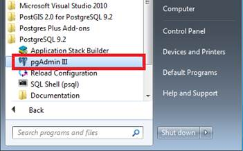

图 17: pgAdmin 图标

如果你和我一样有点喜欢命令行，你也可以使用 psql 命令行 shell。对于本书中的例子，我们将使用图形用户界面。

点击 **pgAdmin** 图标。你应该得到类似以下的问候:

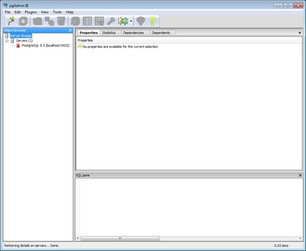

图 18: pgAdmin 主窗口

如您所见，应该只有一个默认数据库实例。如果您左键单击断开连接的数据库图标，您应该会在右侧窗口中看到本地服务器统计信息。


图 19: pgAdmin 本地服务器统计

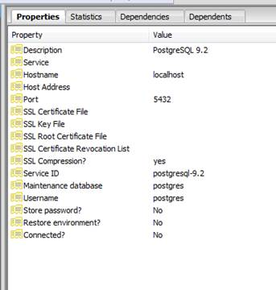

图 20: pgAdmin 服务器属性

如果您双击断开的数据库图标(或右键单击它并选择**连接**，如果您选择在安装过程中使用 Postgres 帐户的密码，您将看到一个密码框。


图 21: pgAdmin 密码

输入您分配给 Postgres 用户帐户的密码。如果这是新安装，此时系统中应该没有其他用户。


图 22: pgAdmin 窗口

此时，您可能会发现数据库和其他可用项目可能会有所不同，这取决于您在安装时选择的内容。

## 探索默认对象

如果您安装的与我安装的完全一样，那么您应该看到您有三个数据库、两个表空间、没有组角色和一个登录角色。

如果展开数据库树，您应该会看到以下内容:


|  | 注意:如果你没有安装 PostGIS，你只会看到 Postgres 数据库。 |

**PostGIS** 数据库是用于空间要素的默认数据库。

**Postgres** 是主数据库(类似于 MS SQL 中的**系统**或者 MySql 中的 **MySql** ，Postgres 存储其所有元信息的中心数据库。诸如 **pg_catalog** 和与 ANSI 兼容的 **information_schema** 别名等全局表以及任何已安装扩展使用的不同配置参数都存储在此处。

通常，您不会直接与该数据库交互，当然也不建议您在那里存储自己的用户特定数据。在很大程度上，对这个表的访问是透明的，您唯一可能引用它的时候是在使用像 **information_schema** 这样的东西来获取服务器统计数据或已定义对象的列表时。

最终的数据库对象是一种特殊的数据库类型，称为模板数据库。

## 模板数据库

在 Postgres 中，以前定义的数据库结构可以留空(没有数据，没有对象)，然后用作模板，作为另一个数据库的起点。

要创建一个模板数据库，您只需以正常方式定义数据库，但不要向其中插入任何数据。

一旦有了模板数据库，就可以赋予特定的权限，以便只有特定的用户可以使用它在新的位置创建新的数据库，这样不仅可以限制用户，还可以强制服务器上的新数据库都遵循一个设置的模式。

这在哪里有用？

想象一下用 Postgres 教一节课。您可以强制所有学生从已知的特定模式开始，然后控制该模式，以便只能以特定的顺序创建特定的对象。

在这本书里，我们不会深入探讨这个主题，但是在 www.postgres.org 的在线手册里有完整的章节。

## 其他物体

如前所述，还创建了一些其他默认对象。Postgres 使用表空间来知道在底层文件系统中的什么位置存储特定的数据库。例如，如果某个数据库需要位于非常快的磁盘上，您可以使用表空间来告诉 Postgres 使用快速光纤阵列或高速存储区域网络(SAN)上的特定位置，而系统的其他部分则与主数据库服务器位于同一驱动器上。这本身就是一个完整的章节，所以除了介绍功能之外，我们不再深入研究。

我们还有组角色和登录角色，它们的使用方式与其他数据库系统中的使用方式相同。组角色为整个数据库用户组定义访问权限，而登录角色为单个用户定义角色。

如果您展开登录角色树，您应该会看到当前只有一个用户，即 Postgres 用户。由于此用户被归类为系统管理员用户，将其用作您的一般数据库用户是不明智的。相反，为特定的数据库和其他对象创建特定的用户。

正如您将很快看到的，Postgres 的安全性非常严格，将自己锁定在整个集群之外非常非常容易。然而，在我们继续之前，如果这是您的第一次安装，有一件事您需要注意。

### Postgres 与网络安全

默认情况下，Postgres 只安装自己以便从 **localhost** 访问。如果您将此安装在您正在使用的计算机之外的另一台计算机上，并且将服务器设置为可以从其他工作站访问，则需要对 Postgres 初始化文件进行一些更改，然后才能访问它。这些更改需要通知 Postgres 预期访问此服务器的特定 IP 地址或 IP 地址组。

如果您的服务器没有侦听连接，当您尝试从远程位置连接到它时，您将看到:

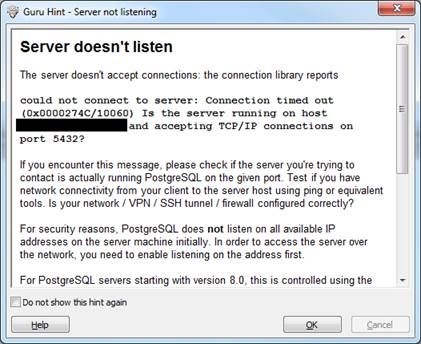

图 23: Postgres 服务器没有侦听

请注意，这些更改不是基于登录角色的。我看到新的 Postgres 用户犯的一个非常常见的错误是创建登录角色来解决这个问题，然后想知道为什么他们不能登录服务器。

要解决这个问题，您首先需要在本地主机安装上使用 Postgres admin，因此通过 RDP 或您使用的任何方法跳转到您物理安装服务器的机器，启动并登录到 pgAdmin，如前所示。

如果您在显示的对话框中向下滚动，它会告诉您编辑 Postgres 配置文件。点击**文件**菜单，选择**打开**，系统会给你一个文件浏览器来定位你的主配置文件。

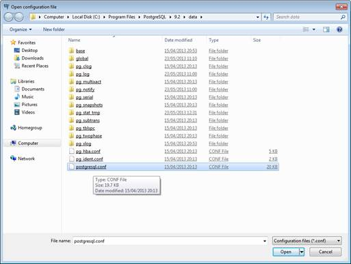

图 24:打开配置文件

该文件通常位于 Postgres 数据文件夹的根目录下。(请记住，在安装过程中，您可以选择与服务器分开的位置。)打开后，您应该会看到以下内容:

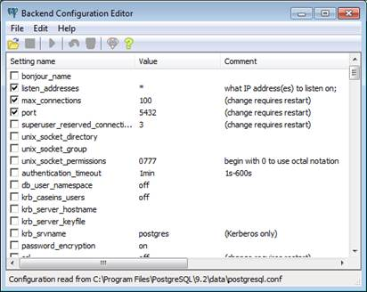

图 25:后端配置编辑器

一旦您确认服务器正在监听所有的 IP 地址(在**listen _ address**参数中由星号或特定的 IP 地址列表显示)，请尝试再次连接。如果连接仍然失败，您需要检查 **pg_hba.conf** 文件，以确保列出您希望连接的地址。

从您用来获取 Postgres 主配置文件的同一文件菜单中，您还可以打开 **pg_hba** 配置文件，该文件通常位于主配置文件旁边的**数据**文件夹中。打开后，您将获得该文件的 pgAdmin 后端编辑器:


图 26:后端访问配置编辑器

如您所见，在默认服务器上，唯一允许连接的 IP 地址是本地主机地址。

如果您点击编辑器底部的空白条目，您将可以选择定义一个新的连接地址:

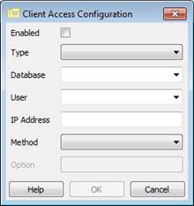

图 27:客户端访问配置

选择**启用**选项激活该规则。

在**类型**下拉菜单中，您有以下选择:

*   **本地**:这是您使用本地套接字定义的本地连接。
*   **主机**:这是你正在定义的远程主机，客户端可以选择是否使用 SSL。
*   **主机 ssl** :这是您正在定义的远程主机，客户端必须使用 ssl 进行连接。
*   **hostnosl**:这是您正在定义的远程主机，客户端永远不允许使用 ssl 进行连接。

在大多数情况下，您将使用**主机**模式，并由客户端决定，但是如果您愿意，也可以强制实施 SSL。

**数据库**字段允许您设置此规则适用的特定数据库或数据库集。如前所述，Postgres 安全性非常细粒度，您可以控制对服务器中任何对象访问的各个方面。

在这种情况下，您可以进行设置，以便只能从特定主机访问特定数据库。在过去，我使用它来强制 web 应用程序从给定的 web 服务器主机访问该应用程序使用的数据库，并保护服务器上所有其他数据库的安全。实际上，这意味着如果 web 应用程序的安全性遭到破坏，那么攻击者能够访问的唯一数据库就是该主机使用的数据库。攻击者需要访问其他主机或中央数据库服务器才能访问其他主机。

除了在此框中键入特定的数据库名称，您还可以选择以下选项之一:

*   **全部**:允许访问服务器中的所有数据库。
*   **sameuser** :只允许访问连接用户拥有的数据库。
*   **@ <文件名>** :只允许访问命名的数据库文件。
*   **samegroup** :只允许访问正在使用的组登录所拥有的数据库。
*   **samerole** :实际上只允许访问用户角色拥有的数据库。
*   **复制**:只允许访问表的复制版本，不允许访问主表。

现在，我们只需将此设置为**所有**。

同样，与数据库框一样，您可以在用户框中键入特定的用户或组名，也可以使用下拉菜单选择 **all** 。

在 **IP 地址**框中，您可以指定单个 IP 地址或位掩码和地址组合。

因为这是一本关于 Postgres 的书，而不是网络地址和子网掩码背后的数学，所以我将给出一个简单的例子。如果你需要更具体的，那么你要么需要问一个友好的网络管理员，要么找一两个网页来阅读这个主题。

如果您在 192.168.1.10 工作站上使用一个 IP 地址，并且您网络中的所有机器都在 192.168.1 中分配。*范围，那么这就叫做 C 类子网。由于只有地址中的最后 8 位值发生变化，因此最多有 256 台主机可用(实际上，只有 254 台可用，因为通常会保留 2 台)。因为一个完整的地址(全部 4 个数字)是 32 位，所以 32 位减去最后一个数字的 8 位就剩下 24 位。

如果您将您的地址指定为 192.168.1.0/24，那么您将告诉 Postgres，地址范围 192.168.1.0 到 192.168.1.255 中的任何计算机都可以连接到此服务器。

计算出不同的值，并使用前面显示的网络正斜杠符号指定它们，这意味着您可以控制整个网络集群对服务器的访问。

当然如果你只有一台电脑，那么输入个人的 IP 地址也是有效的。192.168.1.10 将只允许该地址的机器连接到服务器。

出于本书的目的，我将为我的本地网络子网选择一个 24 位掩码。

最后一个选项方法允许您指定连接参数类型，即如何在连接上加密密码和用户名。在每种情况下，我通常在这里使用 MD5。您可以指定其他的，但是这些非常依赖于底层操作系统的能力。例如，如果您选择 **pam** ，并且您运行在 Linux 服务器上，那么您可以使用 Linux 可插拔身份验证模块系统。

完成后，对话框应该类似于这样:

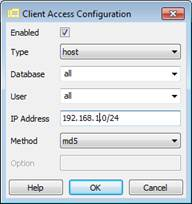

图 28:客户端访问配置

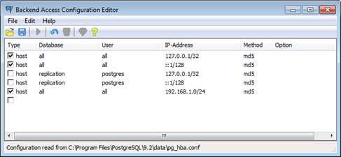

图 29:后端访问配置编辑器

还要记住，如果您的网络使用 IPv6 地址，您还需要定义 IPv6 连接，但这超出了本书的范围。

一旦做出任何更改，您将需要重新启动服务器并重新加载配置。您可以从标有**重新加载配置**的**开始**菜单选项进行操作。

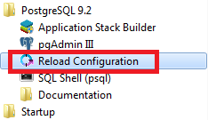

图 30:重新加载配置

如果重新加载配置后仍有问题，请尝试使用 Windows 服务管理器手动重新启动服务。设置无法重新加载的最常见原因是服务器文件系统权限。

## 创建您的第一个用户

一旦设置好访问数据库服务器的一切，就可以开始创建第一个用户了。右键点击**登录角色**，选择**新登录角色**，如下图 **:**

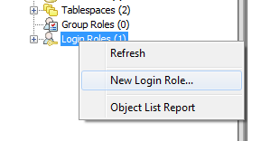

图 31:新的登录角色

将出现以下窗口:

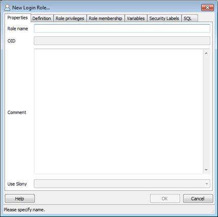

图 32:新建登录角色对话框

有关详细说明，请参见 Postgres 用户指南。就像 Postgres 中的一切一样，在表面之下有一种绝对的财富，甚至可以在最简单的事情上表现出来。现在，在**角色名**字段中输入**我的用户**或您想给新用户的其他用户名。

点击**定义**标签，进入密码输入栏:


图 33:定义密码输入字段

在**密码**字段中，给你的新用户一个你想用来连接的密码。在我的示例中，我将输入**我的用户**，与用户名相同。

您可以选择设置帐户的到期日期。我发现这对基于合同工作的用户很有用，通常会将其设置为合同的结束日期，以便在该日期自动禁用帐户。关于过期，需要注意的一点是，它不像其他数据库系统，它只是意味着密码必须在该日期或之前更改。在 Postgres 中，帐户将在到期日之后被禁用。

您也可以在**连接限制**字段中设置一个值，该值将只允许用户进行一定数量的连接，然后才会被拒绝。例如，如果您只想允许用户一次使用一个应用程序从一个工作站进行连接，您可以将该值设置为 1。如果将该字段留空，则该用户的连接数不受限制。

转到**角色权限**选项卡:

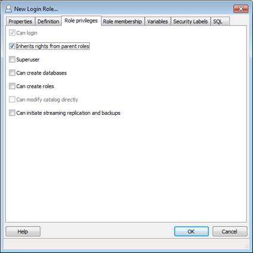

图 34:角色权限

我们不会在这里做任何改变，但是正如你所看到的，选项都很简单。需要注意的一点是，这些选项是服务器范围的，并不特定于此数据库实例。

下一个选项卡**角色成员资格**，允许您将该用户分配到不同的登录组。因为我们不会在这本书里用到这些，所以我会让你在空闲的时候去探索那个。

高级情况下使用**变量**和**安全标签**标签；同样，这超出了本书的范围，不会被涵盖。最后一个选项卡， **SQL** ，简单地向您展示了将生成的 SQL 语句来创建这个用户。

完成后，点击**确定**添加用户，用户将出现在**登录角色**树中:


图 35:登录角色中的新用户

现在您有了一个用户，让我们创建一个数据库。

## 创建第一个数据库

如果右键单击**数据库**树并选择**新数据库**，您将看到一个选项卡式窗口，类似于添加新用户的窗口:

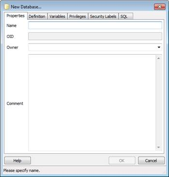

图 36:新建数据库窗口

在第一个选项卡上，我们将命名新数据库**我的数据库**，并从**所有者**下拉列表中选择我们刚刚创建的新用户。如果您愿意，也可以在**评论**栏添加评论。

在我们进一步讨论之前，有一个非常重要的点我们需要在 Postgres 中涉及到对象名，它总是会让新用户感到困惑。

### Postgres 对象名称区分大小写

如果创建两个名为 **MyTable** 和 **mytable** 的表，将创建两个具有唯一名称的数据库表。

你可能想知道为什么这会产生问题。当您在 SQL 语句中引用一个对象名时，Postgres 会自动将该对象名小写。

例如，如果您在 pgAdmin SQL 编辑器中键入`select * from MyTable`，Postgres 实际上会尝试执行`select * from mytable`，正如您所看到的，这会从错误的表中给出错误的数据。

你到底为什么要这么做？Postgres 最初为所有人编写的大多数体系结构都有区分大小写的文件系统，所以最初这不是问题——无论您键入什么，都会按照您键入的方式进行解释。

然后 Postgres 被移植到 Windows 等系统上，处理不区分大小写的文件系统的问题就出现了。开发团队必须找到一种不破坏现有兼容性的方法，同时确保不会发生无意的文件覆盖。

这是如何解决的？正如我已经解释过的，Postgres 的较新版本现在默认以小写形式拼写对象名，不管您如何在 SQL 语句中键入它们。如果您想强制名称完全按照键入的内容使用，那么您需要用双引号将名称括起来。

回到我们的最后一个例子，使用`select * from "MyTable"`将选择正确的表，而使用以下任何一个将选择第二个表作为目标:

```sql
    select * from mytable
    select * from MyTable
    select * from MYTABLE
    select * from "mytable"

```

当您在 pgAdmin 中的任何对话框中指定名称和对象属性时，这些名称会自动被双引号引起来，所以如果您在图形用户界面对话框中指定 MyTable，然后在 SQL 编辑器中错误地键入`select * from MyTable`，您可能会发现它并没有像预期的那样工作。

### 继续我们的新表

Postgres 社区的最佳实践是创建所有的对象名、表、列、用户等。，小写，或者确保在使用它们之前用双引号将每个访问括起来。我个人一直用第一种方法；一旦您键入了六条空间 SQL 语句，并且不得不在整个过程中使用双引号，您很快就会意识到它会变得多么复杂。

输入新数据库的名称，选择所有者，然后点击**定义**选项卡。

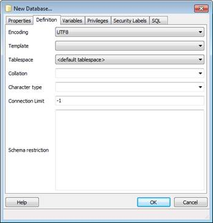

图 37:新建数据库窗口

在大多数情况下，您可以将编码选项保留为默认选项，但是如果您要支持 Unicode、日本汉字或其他类型的字体映射，您可能需要更改它。我从来没有遇到过使用 UTF8 的问题。

**模板**下拉列表允许您选择一个模板数据库，以此作为新数据库的基础。如前所述，这允许您实施特定的数据库设置。现在，把这个留空。

您还应该将**表空间**和其他选项设置为默认，除非您有理由更改它们。

在本练习中，我们不会在任何其他选项卡上使用任何东西，因为大多数选项卡只在特定情况下需要。对于一般的数据库来说，设置名称、用户就足够了，如果您使用的是模板名称。

单击**确定**后，您的新数据库将出现在**数据库**列表中。

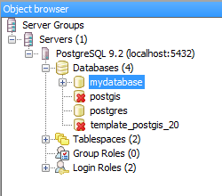

图 38:对象浏览器

恭喜你，你现在有了你的第一个 Postgres 数据库。您现在可以开始创建表并在其中存储数据，就像您对任何其他数据库系统所做的那样。

在我们进入下一章之前，我们将创建一个新的表进行实验。

展开新数据库下方的树，直到看到**表格**树，然后右键单击**表格**并选择**新表格**。

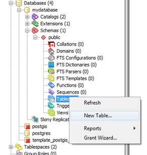

图 39:选择新表

打开的窗口与我们到目前为止看到的窗口相似，在相同的选项卡上有相同的选项，并且顺序大致相同。

在**属性**选项卡中，输入名称，选择您的用户，并输入注释(可选):

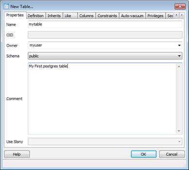

图 40:属性选项卡

切换到**列**选项卡，这样我们就可以开始向表中添加列了。

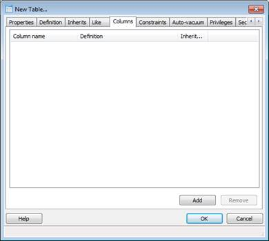

图 41:列选项卡

点击**添加**添加你的第一列:

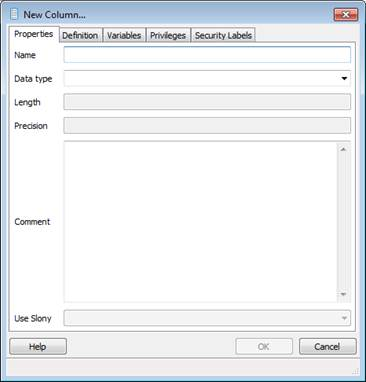

图 42:新列

我们要添加的第一列是带有标识的主整数记录键。

正如我之前指出的，有很多问题。熟悉 MS SQL 的 NET 程序员会问，创建一个**标识**列是 Postgres 新用户的另一个问题。

Postgres 确实有自动递增的列，但是它们的处理方式与其他数据库不同。例如，在 MS SQL 中，您向列中添加了一个**标识**属性，而在 MySQL 中，您添加了一个**自动增量**属性。

然而，在 Postgres 中，无论数据类型是什么，任何列类型都可以自动递增。例如，您可以有一个包含**文件 1** 、**文件 2** 、**文件 3** 等的文本列。

Postgres 通过将**序列**与所讨论的列相关联，然后将**序列**分配给默认值来实现这一点。如果您愿意，您可以手动完成(在某些情况下，您将需要这样做，尤其是对于自定义数据类型)，但是如果您使用的是整数，Postgres 通过提供一个名为 **serial** 的自定义数据类型别名使其变得容易。

为我们的列命名( **gid** 是 Postgres 中用于 id 列的典型名称)，并从**数据类型**下拉列表中选择**系列**。

我们暂时不会更改其他选项卡上的任何内容，但一定要看一看，看看有什么。例如，在**权限**选项卡上，您可能会惊讶地看到 Postgres 安全性是如此可控，以至于您实际上可以将表中的单个列标记为仅由特定用户使用。

单击**确定**，该列将被添加到您的表格中。不用担心主键；我们一会儿再补充。

让我们添加以下几列:

| 名字 | 字符变化 | Fifty |
| 电子邮件 | 字符变化 | Fifty |
| 网页 | 字符变化 | One hundred |
| 个人简历 | 文本 | 不适用的 |

别忘了之前关于区分大小写的注意事项！

您现在应该有一个如下所示的表:

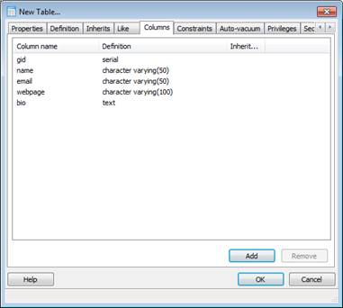

图 43:新表格

现在我们将添加我们的主键。点击**约束**选项卡。

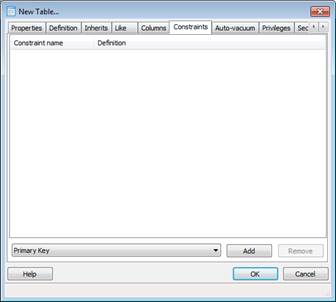

图 44:约束选项卡

确保在页面底部的下拉菜单中选择**主键**，然后点击**添加**。您应该会看到以下内容:

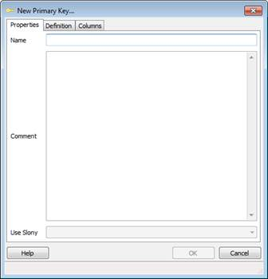

图 45:新主键

我们把我们的钥匙叫做 **pk_gid_people** 。在名称字段中输入键名，然后点击**栏**选项卡。从列下拉列表中选择 **gid** 列，点击**添加**。您应该会得到以下结果:

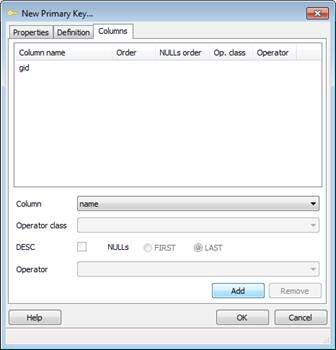

图 46:添加列

您可以从这里向主键添加任意多的列，然后重复该过程，根据需要从任意多的列上可用的多种不同类型中添加更多的索引。这也是创建外键关系以维护数据库中链接记录之间的引用完整性的地方。

现在，点击**确定**。

回到表格定义对话框后，点击**确定**创建并保存表格。

您的表格将出现在右侧窗格中:

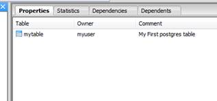

图 47:新表格

现在，您已经有了一个基本的 Postgres 表、数据库和用户。关闭 pgAdmin 并返回桌面。在下一章中，我们将从头开始，使用我们的普通用户帐户登录。