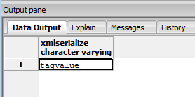
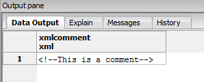
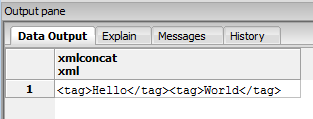
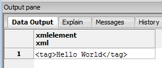
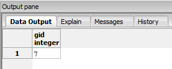
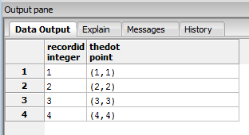
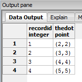
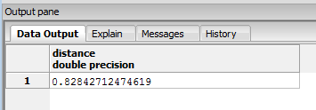

# 七、特定于 Postgres 的 SQL

在本章中，我们将了解一些只能在 Postgres 中找到的 SQL 命令。Postgres 和其他数据库系统之间会有一些重叠，所有服务在某种程度上都有自己的方法来实现我们将在这里看到的一些事情。然而，我会选择 Postgres 特有的东西，即使它们在其他平台上可用，我选择它们主要是因为 Postgres 的性能非常好，以至于我永远不会考虑使用另一个平台或数据库引擎来使用该功能。

让我们从…开始

## 数据类型转换

所有数据库引擎都可以从一种数据类型转换为另一种数据类型。这是一个必需的过程，因为数据库引擎是为处理各种类型的数据而设计的。

如果所有的数据库都必须处理这个功能，那么 Postgres 为什么如此特殊？

大多数数据库以冗长的方式实现数据转换。假设我们有一个表，其中有一个整数列和一个时间戳列，让我告诉你我的意思:

```sql
    SELECT CAST(column1 AS varchar(30)), CAST(column2 AS DATE) FROM mytable;

```

该语句将从名为 **mytable** 的表中选择**列 1** 和**列 2** 中的值，并在此过程中使用 **cast** 函数将该值同时转换为一个 **varchar(30)** 和一个日期。

对大多数开发者来说，这并不是一个真正的问题；这是常态。我们嵌套函数，并以流畅的方式将东西串在一起，所以看到类似前面的语句并不会让我们感到震惊。

不幸的是，对于许多开发人员来说，之前的代码相当混乱，很难维护。Postgres 的作者知道这一点，所以他们决定以不同的方式添加这一功能:

```sql
    SELECT column1::varchar(30), column2::date FROM mytable;

```

如您所见，这个语句比第一个语句读起来容易得多。它也更直观，更容易识别到底发生了什么。

该动态数据转换也不限于**选择**；您也可以使用**插入**:

```sql
    INSERT INTO mytable(column1, column2) VALUES('100'::integer, '2013-05-30T19:30'::timestamp)

```

函数也是如此:

```sql
    SELECT myfunction(column1::varchar(30))

```

在查询中使用普通列或变量规范的任何地方，都可以使用数据类型转换来动态转换值。

不过有一点需要注意——这不是魔法。例如，如果您尝试将“hello”转换为整数，它仍然会产生错误，但是只要您以某种方式处理错误，那么您就可以监视和处理这种情况。

详细说明这一点的 Postgres 手册页可在以下网址找到:

[http://www . PostgreSQL . org/docs/9.2/static/SQL-expressions . html # SQL-语法-类型-CASTS](http://www.postgresql.org/docs/9.2/static/sql-expressions.html#SQL-SYNTAX-TYPE-CASTS)

## 数据验证约束

为了确保一组值落入相同的范围，您需要编写多少次相同的样板业务逻辑？

以两个产品价格值为例。

这些值通常用标准的十进制数值表示，一个可能是全价，另一个可能是折扣价。

在每种情况下，标准数据类型仍然允许负数，并且在应用程序代码中没有业务逻辑的情况下，您不能强制折扣代码总是小于全价。

Postgres 可以通过使用所谓的检查约束直接在数据库中解决这些问题。

检查约束是在表创建时定义的，就像普通的 SQL 约束一样，如**不为空**。以我们的价格为例，我们可以如下定义一个表(现在没有必要输入这个；这只是针对常规 SQL 的说明):

```sql
    create table pricetable(
           record_id serial primary key,
           fullprice number(12,2),
           discountprice number(12,2)
    );

```

如你所见，没有什么特别的；这是一个简单的表格定义。

如果我们现在重写我们的 DDL 来执行我们的规则:

```sql
    create table pricetable(
           record_id serial primary key,
           fullprice number(12,2) check(fullprice > 0),
           discountprice number(12,2) check(discountprice > 0 AND discountprice < fullprice)
    );

```

您会看到，这就像在列定义行中添加一个检查一样简单。

通过将这两个简单的检查约束添加到我们的表中，我们现在已经直接在我们的表上实施了这些业务规则。Postgres 现在将拒绝允许违反这些业务规则的数据插入到该表中。

我们还可以更进一步。

我们添加的检查称为列检查，只有当特定列发生变化时才会进行评估。您也可以指定将支票放在表格本身上。

```sql
    create table pricetable(
           record_id serial primary key,
           fullprice numeric(12,2) check(fullprice > 0),
           discountprice numeric(12,2) check(discountprice > 0),
           check(discountprice < fullprice)
    );

```

当您以这种方式向表中添加检查时，该检查将在表中的任何列更新时进行计算，而不仅仅是检查所附加到的列。

以我们的例子为例，任何时候 **fullprice** 被改变或有一个值被插入，它被检查以确保它大于 0。折扣价格也是如此。即使 **record_id** 更改，折扣<满也会被评估，这意味着无论更新，您的数据完整性都会被重新评估。

检查还可以跨多个列进行一些复杂的数学运算。

举以下例子:

```sql
    create table people(
           id bigint primary key,
           first character varying(100) not null,
           last character varying(100),
           email character varying(200),
           dateofbirth date not null
    )

```

这是另一个相当典型的表定义，也没什么特别的。但是，如果我们现在添加下表级别检查:

```sql
    create table people(
           id bigint primary key,
           first character varying(100) not null,
           last character varying(100),
           email character varying(200),
           dateofbirth date not null,
           check(
                  DATE_PART('year', dateofbirth::timestamp) <
                  DATE_PART('year', now() - interval '18 years')
           )
    )

```

你有一个自我验证表，不允许你添加或更改出生日期，这样一个人就变成了 18 岁或更小。

你不会完全依赖这个。例如，有些人很容易谎报自己的出生日期，但你开始明白如何轻松地在应用程序中增加一层额外的验证。

检查约束可以使用变量、列数据、自定义函数和任何其他普通 SQL 查询可用的组合。你如何组合它们的唯一限制是你的想象力。

你可以在[http://www . PostgreSQL . org/docs/9.2/static/DDL-constraints . html](http://www.postgresql.org/docs/9.2/static/ddl-constraints.html)找到关于数据验证约束的手册页。

## 后置数组

我已经多次提到 Postgres 数组处理，但是现在是时候稍微展示一下了。

许多数据库纯粹主义者会认为，将多个值放在一个值字段中是一个糟糕的设计决策，而且在许多情况下，它确实有损于在设计良好的表中拥有完全规范化的数据行的本质。

但是，在某些情况下，这些多值字段可能会很有用。当我完成下一部分时，需要记住的是，这只是 Postgres 工具包中的另一个工具。

如果数组不能解决您试图解决的问题，则不必使用数组；由你来决定他们是否是这项工作的合适工具。

像 Postgres 的许多扩展功能一样，数组是在表创建时定义的。您可以使用任何可用的 Postgres 类型，并通过在数据类型中添加方括号将其转换为数组。

举以下例子:

```sql
    create table lotterynumbers(
           name character varying(50),
           numbers integer[]
    )
    If you've inserted this statement, then be aware running the next statement immediately after will give you an error due to the table name being the same. You will need to:
    drop table lotterynumbers
    to delete the first table before trying the second in order to avoid getting this error.'

```

**名称**列只是一个标准字符串，**数字**列是一个长度未定义的数组。如果我们想使数组具有固定的大小，我们只需将该大小添加到表定义中:

```sql
    create table lotterynumbers(
           name character varying(50),
           numbers integer[6]
    )

```

现在字段中只能存储六个整数。

定义好表后，您可以按如下方式填充它:

```sql
    insert into lotterynumbers(name, numbers) values('peter', { 1,2,3,4,5,6 })

```

一旦数组字段中有了数据，就可以很容易地使用索引来访问它(方式与非常相似。NET 和许多其他语言)。这里需要注意的是:在我的插入示例中，您会看到我没有用单引号将{}数组规范括起来。据我所知，这是它一直以来的工作方式。我正在测试的版本(v9.0)接受不带引号的行，但新版本似乎没有。

如果在尝试插入的代码时出现语法错误，请尝试在数组规范周围使用单引号重复该错误，如下所示:

```sql
    insert into lotterynumbers(name, numbers) values('peter', '{ 1,2,3,4,5,6 }')

```

今后使用数组语法的语句也要记住这一点。如果出现语法错误，请尝试在说明符周围使用单引号。

要只取回第一个彩票号码:

```sql
    select name,numbers[1] from lotterynumbers

```

您也可以选择阵列的一个切片:

```sql
    select name,numbers[3:4] from lotterynumbers

```

正如您可以通过索引进行选择一样，您也可以更新单个索引:

```sql
    update lotterynumbers set numbers[5] = 50;

```

同样，您也可以使用切片:

```sql
    update lotterynumbers set numbers[2:3] = { 7,8 };

```

更换整个阵列同样简单:

```sql
    update lotterynumbers set numbers = { 9,8,7,6,5,4 };

```

如果您没有对数组设置任何限制，那么您可以使用串联运算符任意扩展它:

```sql
    update lotterynumbers set numbers = numbers || { 8,9,10 }

```

和前面的例子一样，您可以轻松地执行数组范围的搜索。

如果您有固定大小的阵列，您可以执行以下操作:

```sql
    select * from lotterynumbers where numbers[1] = 10 and numbers[6] = 20

```

如果您有一个更大的数组，或者您的数组不是固定大小的，您可以使用 **ANY** 运算符，它的行为与。NET**LINQ 的任意**运算符，因为包含所需检查的任何数组元素都将被返回。

```sql
    select * from lotterynumbers where 20 = ANY(numbers)

```

请注意，语法并不完全如您所料。这样做是因为您实际上是在查看数组中是否有任何内容符合您的条件，而不是查看数组中是否包含您的条件。

如果您怀疑数组中有多个元素包含您要查找的值，那么您可以使用 **ALL** 运算符让 Postgres 将所有匹配作为子数组返回:

```sql
    select * from lotterynumbers where 20 = ALL(numbers)

```

您可以在 http://www.postgresql.org/docs/9.2/static/arrays.html 的 Postgres 手册页上找到更多详细信息，包括如何使用第二个和第三个数组以及负索引。

请注意，我已经链接了 9.2 版本。您可能需要调整版本号以获得正确的页面。

## 继承表

继承的表非常简单；如此简单，事实上，你实际上不需要学习任何新的东西来使用它们，除了一个关键词。

就像许多其他独特的 Postgres 特性一样，一切都建立在标准的 SQL 结构上。让我们使用前几章中讨论的想法，并展示可能用于构建员工表的 SQL。首先，我们的主表:

```sql
    create table staff(
           fullname character varying(100) not null,
           wageband character varying(25) not null,
           phonenumber character varying(10),
           department character varying(25) not null
    )

```

像许多其他例子一样，它是 DDL 的一个标准位。英寸 NET，这将是基类。然后，我们将从它继承我们的其他表:

```sql
    create table itstaff(
           languages character varying(50)[],
           coursestaken character varying(50)[],
           currentproject character varying(25),
           systemowned character varying(25)
    ) inherits(staff)
    create table accountsstaff(
           projectsowned character varying(50)[],
           clientsresponsiblefor int[],
           subdepartment int,
           officename character varying(50)
    ) inherits(staff)

```

如果您现在使用**在那些表格上选择**，您应该会看到以下内容:

```sql
    select * from itstaff

```


图 62:输出窗格

```sql
    select * from accountsstaff

```


图 63:输出窗格

您可以立即看到，这两个表都具有与人员表相同的列，以及在各自的定义中添加的额外列。

数据也是继承的，但不是你想象的那样。

父表中的插入不会显示在子表中。对于那些在 Postgres 中对继承不熟悉的人来说，这是一个常见的误解，认为情况就是这样。

数据只在树上继承，而不是在树上继承，因此在这种情况下，将数据插入到**五线谱**中不会在**五线谱**或**五线谱**表中可见:

```sql
    insert into staff values(
    'Peter Shaw', 'A', '0123456789', 'Technical'
    )
    select * from staff

```


图 64:输出窗格

```sql
    select * from itstaff

```


图 65:输出窗格

```sql
    select * from accountsstaff

```


图 66:输出窗格

但是，由于数据沿树向上传播，执行以下操作:

```sql
    insert into itstaff values(
    'Peter Shaw 2', 'B', '', 'Development', '{C, Pascal, C++, C#, PHP}','{dev1, dev2, dev3}','Postgres Book','DS'
    )

```

结果是:

```sql
    select * from itstaff

```


图 67:输出窗格

```sql
    select * from staff

```


图 68:输出窗格

这也适用于**账户交易**表:

```sql
    insert into accountsstaff values(
    'Peter Shaw 3', 'C', '', 'Admin', '{proj1, proj2, proj3}','{1, 2, 3}',20,'North Durham'
    )
    select * from accountsstaff

```


图 69:输出窗格

```sql
    select * from staff

```


图 70:输出窗格

如您所见，这在某些情况下可能非常有用。在大多数数据修改操作中，您很可能不会使用父表，但理论上您可以使用它来进行报告。

例如，组织中每个员工都在其中的只读表比几个单独的表更容易阅读和执行报告。

然后，负责每种类型员工的部门可以更新和保持他们自己的数据有序，而不会给其他人带来问题。

还要注意，没有侧身操作；也就是说，添加并维护在**账户财务**表中的记录在**账户财务**表中不可见，反之亦然。

另一个额外的优点是，对父表所做的任何模式更改都会立即复制到继承的表中。

如果我们在员工表中添加一个新列:

```sql
    alter table staff add column age integer;
    select * from staff

```

我们得到:


图 71:输出窗格

然后继续做:

```sql
    select * from itstaff

```

和

```sql
    select * from accountsstaff

```

我们得到:


图 72:输出窗格

和


图 73:输出窗格

如前所述，这两个更改都可以立即使用，因此更新子表中的年龄将显示在父表中。

有一种情况，父表中的数据更改确实会显示在子表中，那就是如果您使用子表更改了插入到数据库中的数据。

举以下例子:

```sql
    select * from staff

```


图 74:输出窗格

彼得·肖 2 之所以出现，是因为它作为记录的一部分被插入到了它的“T1”中。如果我们更新如下:

```sql
    update staff set age = 21 where fullname = 'Peter Shaw 2'
    select * from staff

```


图 75:输出窗格

然后还执行:

```sql
    select * from itstaff

```


图 76:输出窗格

我们可以看到数据已经向下传播了。

不过这不应该是一个惊喜。任何在其他地方创造的、可以在其他地方修改的东西都会出现在不同的地方，这是有道理的。

然而，这确实意味着，当您使用继承的表设计数据库时，您绝对必须确保您的设计事先已经正确规划好了。

如果你是一个习惯于使用严格的面向对象原则的软件开发人员，那么你刚才在这里所做的可能会很有意义。Postgres 是一个非常注重面向对象设计的数据库，允许您像对待软件应用程序中的对象一样对待数据存储。

使用继承是一个非常强大的工具，但是也会导致很多难以诊断的问题。我知道，因为我通常是诊断他们的人。

Postgres 手册中关于表继承的章节可以在[http://www.postgresql.org/docs/9.2/static/ddl-inherit.html](http://www.postgresql.org/docs/9.2/static/ddl-inherit.html)找到。

## 处理 XML 数据

每个数据库都内置了某种形式的 XML 处理，其中大多数都非常复杂。另一方面，Postgres 通过一系列非常易于使用的 XML 构造函数使处理 XML 变得简单。

它本身也支持一种 XML 数据类型，可以将 XML 数据直接插入数据库字段，然后使用 **XPath** 直接对该 XML 数据执行查询。我们稍后再讨论。

要在数据库表中创建适合 XML 字段的数据，请使用 **xmlparse** 函数，该函数解析 XML 字符数据并返回一个 XML 数据类型。

**Xmlparse** 取两个参数，一个描述生成的 XML 字符串的范围，另一个是 XML 数据本身。但是请注意， **xmlparse** 是在 SQL 2008 标准文档中定义的。在典型的方式中，Postgres 有它自己的方式，用更简单的语法来执行行为，并支持标准。

```sql
    xml '<tag>tagvalue</tag>'

```

或者

```sql
    '<tag>tagvalue</tag>'

```

在本节的剩余部分，我将使用 Postgres 语法。如果您想详细了解如何使用 **xmlparse** ，您可以在[http://www.postgresql.org/docs/9.2/static/datatype-xml.html](http://www.postgresql.org/docs/9.2/static/datatype-xml.html)的 Postgres 手册中的 XML 数据类型页面上进行。

这里有一个快速的例子，给那些现在想要尝试的人:

```sql
    XMLPARSE (CONTENT 'abc<foo>bar</foo><bar>foo</bar>')

```

您可以将**文档的**内容**更改为**，然后输出的 XML 还将包括一个有效的 XML 文档类型声明。

相反的操作是 **xmlserialize** 函数，它从一个 XML 数据类型返回一个字符串值，如下所示:

```sql
    select xmlserialize(CONTENT 'tagvalue'::xml as character varying)

```



图 77:**XML serialize**功能

**xmlserialize** 函数采用 Postgres XML 数据类型，并将其转换回标准的 XML 字符串，这与前面的 **xmlparse** 语句不同，后者采用标准的 XML 格式字符串，并将其解析为 XML 数据类型。将这两者结合使用(或者使用简化的语法，如果您愿意的话)是将 XML 数据放入和放出 Postgres 数据库的关键。您还会注意到，它们都可以使用 **CONTENT** 或 **DOCUMENT** 关键字。不同的是 **DOCUMENT** 会生成一个附加了完整文档类型头的 XML 输出，而 **CONTENT** 不会。

如果您的意图是生成将被保存到独立的 XML 数据文件中的 XML，那么您应该使用 **DOCUMENT** 来确保您附加了目标所需的任何额外信息。如果您正在生成要内嵌到另一个文档中的 XML 片段，或者您正在生成将由 XML web 服务输出的 XML，那么 **CONTENT** 更合适。

您可能会注意到，在前面的示例中，传递给 **xmlserialize** 的文本中没有 XML 标签。

这样做的原因是，即使您从字符串中解析出一个值，它仍然呈现为一个 XML 数据类型。通常您会使用 **XPath** 来获取您需要的值，然后 **xmlserialize** 将其转换为正确的类型。

不过要警告一句:XML 数据类型不能使用 DTDs 或 XML 模式文档进行验证；如果不小心，可能会将格式错误的 XML 放入 XML 字段中。

一旦掌握了使用 XML 数据类型，就可以继续使用丰富的 XML 函数集了。我不会在这本书里涵盖所有的内容，只是基本的。您可以在[http://www . PostgreSQL . org/docs/9.2/static/functions-XML . html](http://www.postgresql.org/docs/9.2/static/functions-xml.html)上找到它们的完整列表和示例。

我们首先要看的是从存储在数据库表中的数据生成 XML 数据。

如果你从头开始阅读，你会记得之前我们创建了一个名为 **mytable** 的表。它看起来如下:

```sql
    select * from mytable

```


图 78:我的表

稍后，我们将把它用于我们的 XML 示例。

所有的 Postgres XML 函数都以 **xml** 开头，它们都建立在其他函数提供的先前功能的基础上。

从简单的事情开始，我们有 **xmlcomment** :

```sql
    select xmlcomment('This is a comment')

```

这将产生以下结果:



图 79: xmlcomment

接下来，我们有**XML cancat**，它将两个离散的 XML 数据连接在一起形成一个。请注意，它不嵌套元素。

```sql
    select xmlconcat('<tag>Hello</tag>','<tag>World</tag>')

```



图 80: xmlconcat

就像 Postgres 中的其他地方一样，您也可以嵌套这些函数:

```sql
    select xmlconcat(xmlcomment('This is a comment'),'<tag>Hello World</tag>')

```


图 81: xmlconcat

下一个函数，也是你最可能经常使用的函数，是**xmlement**。此函数允许您从原始数据构建元素，如下所示:

```sql
    select xmlelement(name tag, 'Hello World')

```



图 82: xmlelement

像其他的一样，它可以很容易地嵌套:

```sql
    select xmlconcat(xmlcomment('This is a comment'), xmlelement(name tag, 'Hello World'))

```


图 83: xmlelement

**xmlelement** 函数也可以嵌套在其他 xmlelement 中，当您开始这样做时，您开始能够嵌套和包装 XML 标签:

```sql
    select
           xmlelement(name outertag,
                  xmlelement(name innertag, 'tagvalue')
           )

```


图 84: xmlelement

更进一步，**元素**可以嵌套多次循环:

```sql
    select
           xmlelement(name outertag,
                  xmlelement(name innertag1, 'tagvalue'),
                  xmlelement(name innertag2, 'tagvalue')
           )

```


图 85: xmlelement

那么如何使用它将表导出到 XML 呢？很简单:将多个**元素**包装到一个选择中，该选择使用另一个函数 **xmlagg** 选择您想要导出的表数据。

```sql
    select
           xmlelement(name users,
                  xmlagg(
                         xmlelement(name user,
                               xmlelement(name gid, gid),
                               xmlelement(name name, name),
                               xmlelement(name email, email),
                               xmlelement(name webpage, webpage)
                         )
                  )
           )

    from mytable

```

**xmlagg** 函数与其他 XML 函数略有不同。它的目的很像一般的聚合函数，就是从一个选择查询中获取多个生成的行，并将它们聚合成一个 XML 数据行。

从前面的例子中可以看出， **xmlagg** 获取内部 **xmlelement** 调用产生的多行输出，然后将它们聚合成一组表示整个表的 XML 标签，最后一个 **xmlelement** 调用用于将每一行包装在一个外部**user**标签中。结果是下面的 XML，为了可读性，我将它格式化为多行。

记下这个 XML 输出；稍后，当我们将一个 XML 文件读回您的 Postgres 服务器时，我们将使用它。你可以**复制****粘贴**到一个名为 **users.xml** 的文件中，为以后使用做好准备。

```sql
    <users>
           <user>
                  <gid>1</gid>
                  <name>Peter Shaw</name>
                  <email>shawty_ds@yahoo.com</email>
                  <webpage>http://shawtyds.wordpress.com</webpage>
           </user>
           <user>
                  <gid>2</gid>
                  <name>Peter Shaw 2</name>
                  <email>shawty_ds@yahoo.com</email>
                  <webpage>http://shawtyds.wordpress.com</webpage>
           </user>
           <user>
                  <gid>5</gid>
                  <name>Peter Shaw 5</name>
                  <email>shawty_ds@yahoo.com</email>
                  <webpage>http://shawtyds.wordpress.com</webpage>
           </user>
           <user>
                  <gid>3</gid>
                  <name>Alan Person</name>
                  <email>shawty_ds@yahoo.com</email>
                  <webpage>http://shawtyds.wordpress.com</webpage>
           </user>
    </users>

```

Postgres 还有一种更快的方法可以将整个表导出为 XML， **table_to_xml** 。

```sql
    select table_to_xml('mytable',TRUE,TRUE,'')

```


图 86:表到 xml

我不打算在这里介绍不同的选项，但是通过更改它们，您可以非常实质性地更改 XML 的布局。它们被记录在前面列出的手册页上(http://www . Postgresql . org/docs/9.2/static/functions-xml . html)，还有类似的函数，它们将基于用于创建表的原始 SQL 为您的 XML 生成 DTD 和模式文档。

这留给我们最后一个问题…

如何将 XML 数据放回 Postgres？不幸的是，它不像其余的那样简单。这并不难，但比我们目前看到的稍微复杂一点。

本质上，要将您的 XML“分解”成不同的部分，您需要使用 **XPath** 对 XML 数据进行物理解析。

如果你以前在其他地方使用过 **XPath** ，一旦你掌握了它的窍门，它就相当简单了，尽管一开始它会显得很混乱。

我不打算讲太多细节(如果你需要的话，在 **XPath** 上有很多其他的指南)，但是这里有一个简短的入门。

如果我们有下面的 XML 片段:

```sql
    <users>
           <user>
                  <gid>1</gid>
                  <name>Peter Shaw</name>
                  <email>shawty_ds@yahoo.com</email>
                  <webpage>http://shawtyds.wordpress.com</webpage>
           </user>
    </users>

```

我们可以使用以下路径从 name 元素中获取值:

```sql
    /users/user/name/text()

```

如您所见，这很像导航您的文件系统。一旦你知道了你想要的文件的路径(或者在这个例子中是元素值)，你就可以简单地选择它并使用它。

要使用 **XPath** 获取我们的数据，只需使用 **xpath** 函数(请注意，在上面写着“为可读性而缩写的 xml”的地方，您需要从前面的 XML 片段中复制并粘贴 XML，或者如果您觉得更冒险，您也可以从完整的用户文档中粘贴 XML)。

```sql
    select xpath('/users/user/name/text()',xml '…xml abbreviated for readability…')

```

这将返回以下结果:


图 87: xpath

如果您只粘贴了前面的 XML，将只有一个条目，如前面的图像所示。如果您粘贴了完整的文档，那么在您使用的 XML 中，将会有与用户记录一样多的名称。

如您所见，结果是一个包含多个 XML 数据类型的数组。还记得我之前说的 **xmlserialize** 字符串中没有标签，需要使用 **XPath** 来确保得到的是字符串而不是 XML 数据类型吗？在这里，您可以使用它来确保这一点，而不是返回一个 XML 数据类型。

另一件需要注意的事情是:如果在路径中多次出现结果，那么数组的结果数组中就会有多个元素。你马上就会知道如何处理这件事。

在我们编写导入例程之前，您还需要知道一件事，那就是如何将您的 XML 文件加载到 Postgres 中。

Postgres 有一个内置的文件加载例程，但是它有一个很大的限制:它不能访问 Postgres 数据目录之外的文件系统。

如果您还记得前几章，这是 Postgres 安装中的文件夹，Postgres 在其中保存其物理数据文件。**工具**菜单中的**服务器配置**选项会提醒您是否忘记它在哪里。您可以在此创建文件夹来组织文件，但不能访问根数据文件夹之上的任何内容。

Postgres 有一些附加组件，允许您访问该文件夹之外的文件，大多数程序语言(如 PL/Perl、PL/PHP 和 PL/Python)都可以轻松导航到文件系统中的其他文件，但这超出了本书的范围。

现在我们将使用我之前要求您保存的 **users.xml** (当我们导出 users 表时)。将此文件复制到数据目录中名为 **users.xml** 的文件中。(记住，我是在 Windows 系统上工作。)

一旦我们这样做了，我们就可以通过调用 **pg_read_file()** 函数很容易地加载文件，如下所示:

`select xmlparse(CONTENT pg_read_file('users.xml'))`

您会注意到，我们在调用 **xmlparse** 时包装了这一点，这样我们就可以得到一个合适的 XML 数据类型来使用。


图 88: xmlparse

现在我们有了所有的碎片，我们该怎么处理它们呢？首先，我们需要一个通用表表达式(CTE)。CTE 本质上是内存中的一个临时表，它只在查询运行期间存在。

在这种情况下，我们使用 CTE，因为我们只想读一次文件。如果我们不使用 CTE，那么我们将在每次 **XPath** 函数调用中重读文件。虽然这对于我们这里的小文件来说不是什么大问题，但是想象一下，如果您正在读取一个包含数百个条目的多节点 XML，会是什么样子。

一旦我们有了一个 CTE，我们将第二个 CTE 链接到我们的查询中，使用 **XPath** 将数据提取到一个有序的集合中，准备插入到数据库中。

对于不习惯用 CTEs 的人来说，刚开始看起来有点吓人，但是一切都挺简单的。订单总是从上到下流动；如果您在第一个 CTE 中创建了一个表，它在第二个和第三个中可用。如果你在第三个 CTE 创建了一个表，它只在输出或者从那里开始的任何 cte 中可用。任何在上面进入或生成的东西在下面总是可用的，有点像瀑布。

理论上，我们可以去掉第二个 CTE，直接从那里插入，但是这样做的话，我们要么必须忍受所有的数据都是 XML 数据类型，要么只能转换成文本输出，比如 **varchar** 和 **text** 。

通过使用第二个 CTE，我们给了自己另一个选择最终数据集的机会，并执行任何我们需要的最终数据转换。如果您有任何整数或数字数据，例如我们的 **gid** 列，这一点很重要。

**xmlserialize** 和 **:: <数据类型>** 从一个 XML 数据字段只能转换为文本输出类型。您不能提取数值类型的值并一步转换它；这是您必须使用 **cast()** 功能的一种情况。

最后，一旦我们定义了第二个 CTE，我们选择最后一组数据，然后使用 **select 进入**语句，从转换的数据在我们的数据库中创建一个新表。将我们的 XML 数据导入 Postgres 的最后一个查询如下所示:

```sql
    with xmldata as
    (
           select xmlparse(CONTENT pg_read_file('users.xml'))
    ),
    tabledata as
    (
           select
                  unnest(xpath('/users/user/gid/text()',(select * from xmldata))) as gid,
                  unnest(xpath('/users/user/name/text()',(select * from xmldata))) as name,
                  unnest(xpath('/users/user/email/text()',(select * from xmldata))) as email,
                  unnest(xpath('/users/user/webpage/text()',(select * from xmldata))) as webpage
    )
    select
           cast(xmlserialize(CONTENT gid as text) as integer) as gid,
           name::character varying(50) as name,
           email::character varying(50) as email,
           webpage::character varying(100) as webpage
    into
           mytable2
    from
           tabledata

```

没有描述中看起来那么复杂，但肯定比我们目前所看到的更复杂。

## 返回更新

大多数开发人员都熟悉标准的 SQL 操作**选择**、**插入**、**删除**、**更新**等。

然而，有一件事很难做到，那就是在执行修改表行的查询时，准确地知道哪些数据受到了影响，以及它是如何受到影响的。

我们知道**选择**将总是返回数据行，但是在其他操作中，我们习惯于只看到类似“1 行受影响”的内容

Postgres 有一个与这个场景相关的巧妙技巧，叫做返回，如下例所示。我们将使用上一节中从 XML 创建的表。

```sql
    select * from mytable2

```


图 89:输出窗格

```sql
    delete from mytable2 where gid = 3

```


图 90:输出窗格

并使用**返回**语句:

```sql
    select * from mytable2

```


图 91:输出窗格

```sql
    delete from mytable2 where gid = 5 returning *

```


图 92:输出窗格

```sql
    select * from mytable2

```


图 93:输出窗格

正如您所看到的，通过在我们的 delete 语句的末尾添加`returns *`，被删除的行作为我们查询的结果被返回。

现在想象一下，如果您想为从数据库中删除的所有记录创建一个备份表，您可以像使用常规的 **select** 语句一样，轻松地从查询中获取这些数据，然后您可以非常轻松地将其直接写入另一个表中。

这也适用于更新。

```sql
    update mytable2 set email = 'me@here.there' where gid = 2 returning *

```


图 94:输出窗格

如果您通过更新完成此操作，您会收到一份更新后的行的副本。通常，要获取更新的数据，您通常必须执行更新，然后按照常规**选择**来选择新数据。

插入做完全一样的事情。

```sql
    insert into mytable2 values(6,'a second person','anemail@somwhere.com','http://aweb.page.com/') returning *

```


图 95:输出窗格

您会注意到，在前面的每个例子中，我都在使用`returning *`。与任何 SQL 查询一样，当您使用*时，它意味着返回所有内容。

如果您只想要 **gid** 列，那么您可以像在普通的**选择**语句中一样使用常规的列标识符:

```sql
    insert into mytable2 values(7,'a third person','anemail@somwhere.com','http://aweb.page.com/') returning gid

```



图 96:输出窗格

我将让您在这里探索其他可能性，但是因为它是一个常规的 SQL 构造，所以您可以使用函数、聚合和大多数其他 Postgres 功能以一些非常聪明的方式使用返回的数据，其中一个我们将在下一步探索。

## 可写 CTEs

我已经在关于 XML 的部分向您介绍了 CTEs 然而，它并不是许多数据库中普遍知道或使用的东西。

微软的 SQL Server 已经有一段时间可以使用 CTEs 了，我已经用它们解决了许多现实世界中需要处理临时表的问题，但是我还没有看到其他开发人员定期使用它们。

然而，传统上，CTEs 一直是只读的，也就是说，您只能使用它们进行基于选择的查询。

从 Postgres v9.1 开始，您现在可以在 CTE 上执行插入、更新和删除。这开启了一些非常有趣的可能性。

让我们从一个真实的例子开始。使用您创建的测试数据库，让我们添加一些新表。我只是在这里给你 SQL，但是请随意使用 **pgAdmin** 使用图形用户界面创建它们。

```sql
    create table items_in_stock
    (
           storename text,
           itemname text,
           amountavailable int not null,
           costperitem numeric(16,2) not null
    );
    insert into items_in_stock values
    ('store 1','orangething', 45, 20.00),
    ('store 1','bluething', 50, 25.00),
    ('store 1','purplething', 30, 30.00),
    ('store 2','orangething', 60, 20.00),
    ('store 2','bluething', 10, 25.00),
    ('store 2','purplething', 25, 30.00);

    create table sales_made
    (
           recordid serial primary key,
           storename text,
           itemname text,
           amountsold int not null
    );
    insert into sales_made(storename, itemname, amountsold) values
    ('store 1', 'orangething', 5),
    ('store 2', 'bluething', 1),
    ('store 2', 'purplething', 10),
    ('store 1', 'bluething', 15),
    ('store 2', 'orangething', 10),
    ('store 1', 'bluething', 15);

```

现在让我们假设我们想看一份前后库存数量的报告，以及根据销售情况，每个商店的销售额。

首先，让我们从一个普通的只读 CTE 开始，它可以很容易地总结事情:

```sql
    with all_sales as
    (
           select
                  storename as storename,
                  itemname as itemname,
                  sum(amountsold) as totalamountsold
           from
                  sales_made group by storename,itemname
    ),
    sales_report as
    (
                select
                  iis.storename as storename,
                  iis.itemname as itemname,
                  iis.amountavailable as originalamountavailable,
                  als.totalamountsold as amountsold,
                  iis.amountavailable - als.totalamountsold as newamountavailable,
                  iis.costperitem as costperitem,
                  iis.costperitem * als.totalamountsold as amountmadeinsales

           from items_in_stock as iis
           join all_sales als on als.storename = iis.storename AND als.itemname = iis.itemname
    )
    select * from sales_report

```

该代码应导致以下结果:


图 97:输出窗格

如您所见，我们只看到那些已经售出的商品，我们以前有多少，现在有多少。我们也可以看到我们从这些销售中赚了多少钱。

现在我们唯一的问题是，我们看到的数据只在内存中——我们的表没有以任何方式更新。现在，我们需要将这些更改添加到我们的库存表中。

我们可以通过如下重写查询来轻松做到这一点:

```sql
    with all_sales as
    (
           select
                  storename as storename,
                  itemname as itemname,
                  sum(amountsold) as totalamountsold
           from
                  sales_made group by storename,itemname
    ),
    sales_report as
    (
           select
                  iis.storename as storename,
                  iis.itemname as itemname,
                  iis.amountavailable as originalamountavailable,
                  als.totalamountsold as amountsold,
                  iis.amountavailable - als.totalamountsold as newamountavailable,
                  iis.costperitem as costperitem,
                  iis.costperitem * als.totalamountsold as amountmadeinsales

           from items_in_stock as iis
           join all_sales als on als.storename = iis.storename AND als.itemname = iis.itemname
    ),
    items_update as
    (
           update items_in_stock iis
                  set amountavailable = sr.newamountavailable
           from
                  sales_report sr
           where
                  sr.storename = iis.storename AND sr.itemname = iis.itemname
           returning
                  iis.storename as storename,
                  iis.itemname as itemname,
                  sr.originalamountavailable as originalamountavailable,
                  sr.amountsold as amountsold,
                  iis.amountavailable as newamountavailable,
                  iis.costperitem as costperitem,
                  sr.amountmadeinsales as amountmadeinsales
    )
    select * from items_update

```


图 98:输出窗格

我们获得了与之前相同的输出，只是这次您会注意到我们向链中添加了第三个 CTE。

这个 CTE 有一个**更新**声明，实际上是用在**销售报告** CTE 中计算的新值来更新基础的**库存项目**表。

结果是，我们不仅返回了销售报告，而且在此过程中，我们的原始数据也会更新，所有这些都在一条 SQL 语句中完成。

不需要创建单独的临时表，也不需要在这些临时表中选择数据来单独执行更新。您甚至不需要将它放入存储过程或数据库函数中。有时候 Postgres 只是让解决手头的问题变得轻而易举。

## 特殊数据类型

我们关于 Postgres 特定 SQL 的最后一节将介绍数据库中可用的一些独特的数据类型。

您已经了解了 XML 数据类型；现在是时候见见其他一些只能在 Postgres 中找到的人了。请注意，我将只介绍内置于系统中的数据类型。Postgres 和许多数据库系统一样，可以通过多种方式进行扩展，包括向其中添加新的数据类型。我想在最后一节展示的内容不需要任何这样的附加组件。

### 几何图形

即使没有像 PostGIS 这样的扩展，Postgres 默认情况下也有一些基本的几何类型，例如:

*   要点
*   线条
*   lsg(消歧义)
*   箱子
*   小路
*   多边形
*   圆

为了这本书的目的，我只展示简单的。你可以在[http://www . PostgreSQL . org/docs/9.2/static/datatype-geometric . html](http://www.postgresql.org/docs/9.2/static/datatype-geometric.html)上阅读 Postgres 手册中关于其余部分的详细信息。

让我们创建一个点数表:

```sql
    create table geometry(
           recordid serial primary key,
           thedot point
    )

```

现在让我们添加一些数据:

```sql
    insert into geometry(thedot) values
           (point'(1,1)'),
           (point'(2,2)'),
           (point'(3,3)'),
           (point'(4,4)')

```

如您所见，您需要指定要添加的数据类型。与其他数据类型不同，您不能在插入时使用 **::** 来强制转换类型，在括号中单独指定类型是为记录和数组之类的东西保留的。

```sql
    select * from geometry

```

这条线告诉我们:



图 99:点数表

现在让我们创建一些圆和线。

```sql
    create table geometry2(
           recordid serial primary key,
           theline lseg
    )
    create table geometry3(
           recordid serial primary key,
           thecircle circle
    )

```

我们将插入一些数据:

```sql
    insert into geometry2(theline) values
           (lseg '((1,1),(2,2))'),
           (lseg '((3,3),(4,4))')
    insert into geometry3(thecircle) values
           (circle '((1,1),1)'),
           (circle '((3,3),1)')

```

线段是通过指定起始 x 位置和 y 位置以及结束 x 位置和 y 位置来创建的。通过指定中心 x 位置和 y 位置以及半径来创建圆。

在我们前面的示例中，我们创建了一个表，其中有两行从 1，1 到 2，2 和 3，3 到 4，4。然后我们创建了两个圆，每个圆分别在位置 1、1 和 3、3 具有 1 个单位的半径。

一旦您在各种表中有了数据，那么有许多强大的函数允许您对存储的几何图形进行各种操作就不足为奇了。例如，通过(1，1)来翻译您的所有要点:

```sql
    select * from geometry

```


图 100:要翻译的点

```sql
    select
           recordid,
           thedot + point '(1,1)' as thedot
    from geometry

```



图 101:翻译点

或者计算我们两个圆之间的距离:

```sql
    select
           (select thecircle from geometry3 where recordid = 1)
           <->
           (select thecircle from geometry3 where recordid = 2)
           as distance

```



图 102:计算距离

还有很多函数和运算符。完整列表见[http://www . PostgreSQL . org/docs/9.2/static/functions-geometry . html](http://www.postgresql.org/docs/9.2/static/functions-geometry.html)。

### 网络地址类型

Postgres 还有一个内置的数据类型，用于处理网络地址数据，如 IP 地址和 MAC 地址。这些地址是用于将计算机和其他设备连接到网络(如互联网)的号码。

你可能见过的一个 IP 地址是 127.0.0.1。

这也称为**本地主机**(我之前在关于安装的章节中提到过)，一个由设备上的网络软件分配的软件级地址。

再往下是所有设备拥有的唯一硬件地址，称为媒体访问控制地址。通常看起来像这样 00:16:E6:8E:BE:85。

Postgres 可以本地处理这些数据类型。更重要的是，在选择、分组和排序时，它知道如何正确排序它们。

除了能够存储和操作它们之外，您还可以使用正斜杠符号:192.168.100.0/24 来指定网络掩码。

这将指定驻留在 192.168.100 中的网络，其网络掩码为 24 位，这意味着驻留在网络号为 192.168.100 的 C 类网络，主机范围从 0 到 255。

与许多其他数据类型不同，没有处理这些数据类型的特殊函数。使用它们的优势来自于以高速度对它们进行本地搜索、索引和排序的能力，而许多其他数据库系统不得不使用字符串和全文搜索来处理它们，这通常是低效的。

网络类型的手册页可在[http://www . PostgreSQL . org/docs/9.2/static/datatype-net-types . html](http://www.postgresql.org/docs/9.2/static/datatype-net-types.html)上找到。

### 更多数据类型？

绝对的。

我们有您可能期待的，如**数字**、**货币**、**日期/时间**、**二进制**。

然后我们有类似 **Json** 、 **UUID** (通用 ID 类似。NET GUIDs)、**位串**、**数字范围**、**复合记录类型**、**对象标识符**等等。完整列表可在[http://www.postgresql.org/docs/9.2/static/datatype.html](http://www.postgresql.org/docs/9.2/static/datatype.html)找到。