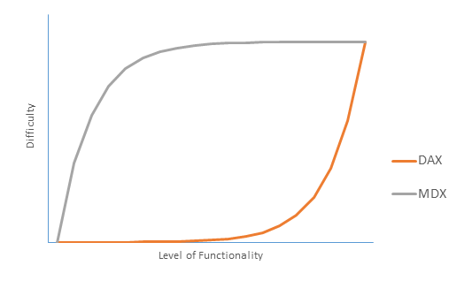

# 简介

您知道您可以处理桌面上数百万行数据吗？建立可以即时分析数据的交互式图表？创建汇集相关数据的仪表板，而不需要庞大的商业智能项目？实时浏览您的数据？甚至在地图上画出来？

你当然可以。你只要用 Excel 就行了。不，说真的。Excel 中有一个令人惊讶的未知工具，名为 PowerPivot，它以 Excel 用户熟悉的格式提供所有这些功能，使用简单，功能非常强大。

微软于 2009 年首次在测试版中将 PowerPivot 作为“双子座项目”引入世界。它为基于桌面的数据分析师提供了一种在熟悉的 Excel 环境中分析内存中大量数据的新方法。它作为 Excel 2010 的免费插件正式推出，并从 2013 年开始成为标准组件。它还在分析服务(微软的 SQL Server 商业智能平台的核心部分)中找到了一个位置，作为为企业建模数据的新方法。

## 桌面的内存立方体

PowerPivot 是桌面的内存立方体。这首先对您意味着，您的数据是在一个成熟的商业智能解决方案中用立方体的所有能力建模的。这意味着您的数据关系都是为您管理的，聚合是由不同的切片器在本地进行的，不需要用户付出额外的努力。它为强大的上下文感知计算打开了大门，无需您不断修改不同场景的公式即可进行分析。

锦上添花的是，这一切都发生在你的桌面内存中，这是(目前)在计算机上处理数据的最快方式。神奇发生在 PowerPivot 数据模型中，这是一个类似 Excel 的界面，您可以在几秒钟内处理数百万行数据。这存在于您的 Excel 工作簿中。这在内存方面有一个小小的限制。不能让 Excel 工作簿的大小超过 2GB，消耗的内存不能超过 4GB[【1】](6.html#_ftn1)。这仍然是一个巨大的工作簿，考虑到 PowerPivot 如何压缩数据(稍后将详细介绍)，这意味着您可以处理多达 30GB 的原始数据。

## DAX 对 MDX

多维数据集传统上使用一种叫做 MDX 的语言来访问。MDX 是一门很难掌握的语言，并且经常成为更广泛采用 power cube 技术的障碍之一。PowerPivot 使用的查询语言是 DAX(用于数据分析表达式)。该语言有意类似于 Excel 公式，使其易于商业用户访问。例如，两列的简单相加如下所示:

two columns:=[column]+[column b]

强大的 IF 语句如下所示:

IFColumn:=IF(A=1，B，C)

更重要的是，像 SUM 这样的表级聚合是这样的:

SUMMeasure:= SUM([列])

不太吓人。DAX 和 PowerPivot 技术的部分吸引力在于，这种语言比 OLAP 模拟世界中的语言 MDX 更容易理解。人们常说这两种语言的学习曲线是这样的:

图 1: DAX 与 MDX 的学习曲线

DAX 很容易上手，但高级功能相当难掌握。相比之下，MDX 很难上手，但是一旦你掌握了它，它就不会变得更难了。我在书的最后列出了一些[资源](6.html#_Resources)给那些更深入研究 DAX 的人；当你到达学习曲线的远端并需要一些帮助时，它们可能会有所帮助。