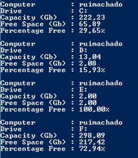

# 第四章 Windows 管理工具

## 使用 WMI 类

PowerShell 最引人注目的特性之一是它能够与机器的几乎所有设置进行交互。这些设置可通过 WMI 课程访问。在这些 WMI 示例中，我将只使用 Win32 类。然而，为了访问我的机器配置，有一个无穷无尽的列表。所有课程的列表在这里可用。

WMI 是一个管理 Windows 操作系统数据和操作的基础设施。它不仅适用于 PowerShell，还适用于其他语言，如 C/C++、VB 以及大多数其他为 Windows 系统构建的脚本语言。

正如我之前提到的，我将只在我的示例中使用 Win32 类。这些类提供了大量的机器交互，例如获取可用的磁盘空间或获取我们的内存使用情况。在下表中，您可以看到主要的 Win32 类组。

表 6: Win32 类组

| 班级小组 | 定义 |
| 计算机系统硬件类别 | 硬件相关对象。 |
| 已安装的应用程序类 | 软件相关对象。 |
| 操作系统类 | 与操作系统相关的对象。 |
| 性能计数器类 | 来自性能计数器的原始和计算性能数据。 |
| 安全描述符助手类 | 类，它提供在不同格式之间转换安全描述符的方法。 |
| WMI 服务管理班 | WMI 的管理。 |

## 进入 WMI 课堂

要在 PowerShell 中使用 WMI 类，需要使用命令**Get-wmioobject**后跟类名。下面的代码块显示了一个 WMI 类调用的示例。

```
          Get-WmiObject Win32_DiskDrive

```

调用此命令将产生一组有关已安装磁盘及其分区的信息。


图 38:调用 Get-wmioobject Win32 _ DiskDrive

WMI 还有一个用户通常不会探索的特性，叫做 WMI 的 WQL 语言，它允许你查询任何 WMI 类。要使用它，您必须引用 WmiSearcher 对象。下面的代码块向您展示了如何在 PowerShell 脚本中使用它:

```
          #Instantiate a WmiSearcher object with the query you wish to run.
          $query = [WmiSearcher]"select * from Win32_DiskDrive where Size>300000000000"

          #Run the query to retrieve the result.
          $query.Get()

```

上一个脚本检索计算机中大小大于预定义大小的所有磁盘。如果您在交互式 shell 中运行它，结果将类似于图 39。


图 39:运行 WQL 查询

## 练习:获取可用磁盘空间

对于这个挑战，我们将设置一个系统管理场景。该领域专业人员的任务之一是监控各种服务器的磁盘空间，并做出决策和行动，以避免磁盘空间分配问题。

手动执行此任务很普通，需要持续监控以避免问题，因此这是一个理想的自动化任务。在第一个教程中，我们将创建一个简单的脚本，让您监控可用的磁盘空间。我一直试图鼓励的是建立一个每天运行的计划任务，这样您就不需要手动执行脚本。设置一个每天早上 8 点运行的计划任务，并将结果保存到日志文件中，甚至在磁盘空间不足时向您发送警报电子邮件，这将让您有空闲时间思考真正的问题，而不是浪费时间进行监控和其他常规任务。

首先创建基本例程，该函数将提供关于单台机器的信息。下面的代码块向您展示了如何创建一个函数来检索机器信息。

```
          function GetDiskInfo($serverName){

          Get-WMIObject -ComputerName $serverName Win32_LogicalDisk |
                 ?{($_.DriveType -eq 3)}|
                 #Select which attribute to show.
                       select @{n='Computer' ;e={"{0:n0}" -f ($serverName)}},
                             @{n='Drive' ;e={"{0:n0}" -f ($_.name)}},
                             @{n='Capacity (Gb)' ;e={"{0:n2}" -f ($_.size/1gb)}},
                             @{n='Free Space (Gb)';e={"{0:n2}" -f ($_.freespace/1gb)}},
                             @{n='Percentage Free';e={"{0:n2}%" -f ($_.freespace/$_.size*100)}}

          }

```

现在我们有了主函数，我们只需要创建一个我们需要监控的域中所有服务器的列表，然后遍历每个服务器并调用我们的 **GetDiskInfo** 函数。

在下面的代码块中，您有完整的脚本来用格式化的值列出所有服务器的磁盘空间。

```
          function GetDiskInfo($serverName){

          Get-WMIObject -ComputerName $serverName Win32_LogicalDisk |
                 ?{($_.DriveType -eq 3)}|
                 #Select which attribute to show.
                select @{n='Computer' ;e={"{0:n0}" -f ($serverName)}},
                             @{n='Drive' ;e={"{0:n0}" -f ($_.name)}},
                             @{n='Capacity (Gb)' ;e={"{0:n2}" -f ($_.size/1gb)}},
                             @{n='Free Space (Gb)';e={"{0:n2}" -f ($_.freespace/1gb)}},
                             @{n='Percentage Free';e={"{0:n2}%" -f ($_.freespace/$_.size*100)}}

          }

          #List of servers to monitor.
          $allServers = "ruimachado","computer2","computer3"

          #Iterate each server.
          $allServers | %{
                GetDiskInfo -serverName $_
          }

```

此脚本执行的结果是所有磁盘的列表，其中包含阵列中声明的每个服务器各自的可用空间。



图 40:可用磁盘列表

您可能不喜欢信息的显示方式，您可能更喜欢包含所有这些信息的文本文件。要创建它，您可以将 GetDiskInfo 调用检索的信息存储在 foreach 循环中，然后将其导出为文件。

```
          #GetDiskInfo function goes here.

          $allinfoArray=@()

          #Iterate each server.
          $allServers | %{
                $allinfoArray += GetDiskInfo -serverName $_
          }

          $allinfoArray | Format-Table | Out-File -FilePath "c:\temp\diskLog.txt"

```

这将在文本文件中生成一个格式化的表格，如图 41 所示。


图 41:带磁盘空间的格式化文件