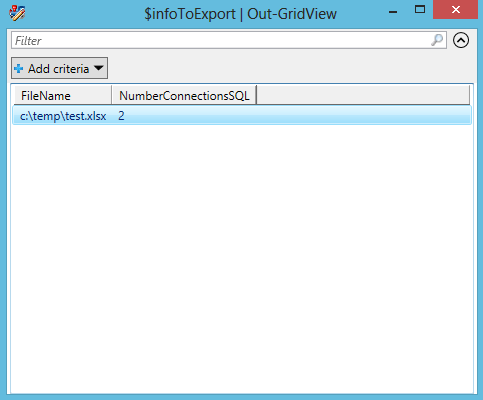

# 第八章微软 Office Interop

微软将其与微软 Office 的交互功能集命名为主互操作程序集(PIAs)，这是一个包含各种微软 Office 套件产品的所有主要程序集的包。这些包允许您与 Office 产品创建的对象进行交互。例如，如果您创建一个包含两个工作表的 Excel 文件，通过互操作程序集，您可以获取这些对象并对它们进行迭代。要使用它，您只需要安装 PIAs 程序集并在您的计算机上安装 Microsoft Office。

|  | 注:在此下载 PIAs 组件[。](http://www.microsoft.com/en-us/download/details.aspx?id=3508) |

一个可以描述使用互操作优势的场景是简单地回答这个问题:“您的 Excel 文件中有多少张包含到 SQL 数据库的链接？”

仅使用您的 Excel 文件就可以手动回答这个问题，但是如果您有两百个 Excel 文件，您认为这需要多长时间？我将向您展示如何快速创建一个 PowerShell 脚本，该脚本运行所有这些文件，并返回一个 CSV 文件，其中所有这些信息都经过处理并以表格列表的形式提供。回答这类问题在分析项目中非常重要，在分析项目中，您需要识别项目文件工件之间的依赖关系。

虽然我的练习是关于 Excel 文件(工作簿和工作表)，但是 PIAs 允许您使用几乎所有的 Office 产品。以下是允许产品的完整列表:

*   Microsoft Access
*   微软优越试算表
*   Microsoft InfoPath
*   微软 Outlook
*   Microsoft PowerPoint
*   微软项目
*   Microsoft Publisher
*   Microsoft SharePoint 设计器
*   Microsoft Visio
*   微软 Word

## 使用 PIAs 组件

使用任何 PIAs 程序集总是有相同的算法。首先将程序集加载到脚本中，然后创建主 Office 文件类型对象，并根据需要使用它。

要在 PowerShell 中加载程序集，可以使用中常用的相同方法。NET 项目，它是从反射加载的。程序集命名空间。

```
          [Reflection.Assembly]::LoadWithPartialname("AssemblyName")

```

要加载 Office 程序集，您有以下选项:

```
          #Load Microsoft Office Excel Assembly
          [Reflection.Assembly]::LoadWithPartialname("Microsoft.Office.Interop.Excel")

          #Load Microsoft Office Access Assembly
          [Reflection.Assembly]::LoadWithPartialname("Microsoft.Office.Interop.Access")

          #Load Microsoft Office InfoPath Assembly
          [Reflection.Assembly]::LoadWithPartialname("Microsoft.Office.Interop.InfoPath")

          #Load Microsoft Office OneNote Assembly
          [Reflection.Assembly]::LoadWithPartialname("Microsoft.Office.Interop.OneNote")

          #Load Microsoft Office Outlook Assembly
          [Reflection.Assembly]::LoadWithPartialname("Microsoft.Office.Interop.Outlook")

          #Load Microsoft Office PowerPoint Assembly
          [Reflection.Assembly]::LoadWithPartialname("Microsoft.Office.Interop.PowerPoint")

          #Load Microsoft Office Publisher Assembly
          [Reflection.Assembly]::LoadWithPartialname("Microsoft.Office.Interop.Publisher")

          #Load Microsoft Office Visio Assembly
          [Reflection.Assembly]::LoadWithPartialname("Microsoft.Office.Interop.Visio")

          #Load Microsoft Office Word Assembly
          [Reflection.Assembly]::LoadWithPartialname("Microsoft.Office.Interop.Word")

```

使用 PIAs 从程序集到程序集都是相似的，所以我将只向您展示如何在简单的场景中使用 Excel 程序集。您可以使用 Word、Access 或任何其他类似的脚本结构。

## 创建一个 Excel 应用程序实例

要创建一个 Excel 应用程序的实例，应该在 PIAs Excel 程序集中使用 ApplicationClass。请注意，PIAs 总是在每个程序集中使用 ApplicationClass 来实例化一个新的应用程序，在本例中是 Excel。这就像通过可执行文件打开 ExcelPowerShell 也将创建该 Excel 进程。

```
          $excel = new-object Microsoft.Office.Interop.Excel.ApplicationClass

```

|  | 提示:由于 PowerShell 创建了一个新的 Excel 进程，而关闭它的唯一方法是杀死该进程，所以在创建 Excel 应用程序之前杀死每个 Excel 进程是一个好主意；为此，请运行以下命令:Get-Process &#124; where {$_。类似 ProcessName 的“* EXcel *”} &#124; kill。 |

```
          #TIP: Kill every Excel application before creating a new one.
          Get-Process | where{$_.ProcessName -like "*EXCEL*"} | kill

          $excel = new-object Microsoft.Office.Interop.Excel.ApplicationClass

```

## 从 Excel 文件中检索数据

加载程序集并创建 Excel 应用程序对象后，就可以开始从中提取数据了。在本例中，我们将使用一个包含表格的 Excel 2013 工作表，并尝试获取该数据。


图 50: Excel 文件

为了构建我们的脚本，我们需要关于 PIAs 程序集的所有以前的知识，因为我们将初始化一个新的 Excel 应用程序，加载上图中显示的特定文件，并查询工作表中的表数据。下面的例子只是一种检索 Excel 工作簿的方法；主要目标是学习一些 PIAs 工件的用法。

```
          #Load Excel PIAs assembly.
          [Reflection.Assembly]::LoadWithPartialname("Microsoft.Office.Interop.Excel")

          #Kill all Excel processes.
          Get-Process | where{$_.ProcessName -like "*EXCEL*"} | kill

          #Instantiate a new Excel application
          $excel = new-object Microsoft.Office.Interop.Excel.ApplicationClass

          #Path to our Excel file.
          $filePath="c:\temp\test.xlsx" 

          #Instatiate a new workbook and then its path.
          $book = $excel.Workbooks.Open("$filePath")

          #Get the sheet - In this case we just have one.
          $sheet = $book.Worksheets.Item(1)

          #Get all list objects.
          $lObjects = $sheet.ListObjects

          #Get the range of data.
          $range = $lObjects.Item(1).Range

          #Print all cell data.
          $lObjects.Item(1).Range.Rows | %{
                $row = $_.Row    
                $lObjects.Item(1).Range.Columns | % {
                      $col = $_.Column

                      #Cell item
                      write $range.Item($row,$col).Value2
                }
          }

```

结果应该如图 51 所示。


图 51:Excel 数据检索的结果

## 练习:那个 Excel 文件中有多少个 SQL Server 连接？

在本练习中，我将回答我在本章开头提到的第一个挑战，即如何确定 Excel 工作簿中有多少个 SQL Server 连接。我将检索连接数；但是，您可以增加本练习的复杂性，还可以检索该 SQL Server 连接的连接字符串，甚至是它的使用范围。

```
          #Load Excel PIAs Assembly
          [Reflection.Assembly]::LoadWithPartialname("Microsoft.Office.Interop.Excel")

          #Kill all Excel processes.
          Get-Process | where{$_.ProcessName -like "*EXCEL*"} | kill

          #Instantiate a new Excel application
          $excel = new-object Microsoft.Office.Interop.Excel.ApplicationClass

          #Path to our Excel file.
          $filePath="c:\temp\test.xlsx" 

          #Instatiate a new workbook and then its path.
          $book = $excel.Workbooks.Open("$filePath")

          #Get all book connections.
          $bookConnections = $book.Connections

          #Get total number of connections.
          $totalConnections = $bookConnections.Count

          #Initialize the counter of SQL connections.
          $conSql = 0

          #Foreach connection check if it is SQL Server.
          $bookConnections | %{
                if($_.Type -eq 1){
                      $conn = $_.OLEDBConnection.Connection
                      $conn = $conn.ToString()
                      if($conn -like "*SQL*"){
                            $conSql++
                      }
                }
          }

          #Build an array with file name and number of connections.
          $infoToExport = $book | select @{n="FileName";e={$_.FullName};},
                                  @{n="NumberConnectionsSQL";e={$conSql};} 
          #Close the book.
          $book.Close($false, [System.Type]::Missing, [System.Type]::Missing)

          #Show information as a grid view.
          $infoToExport | Out-GridView

```

因此，您现在应该看到一个带有结果的网格。



图 52:结果网格