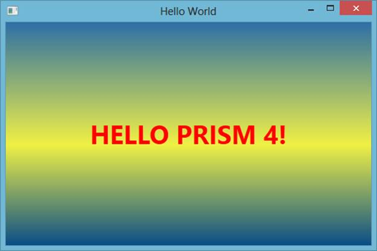
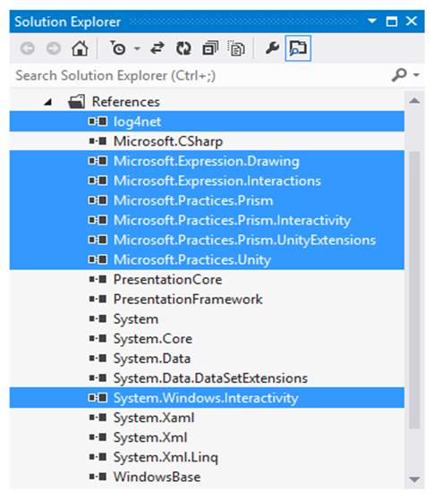

# 三、Prism 4 启动过程

构建 Hello World 解决方案

我们将从构建最简单的解决方案开始探索微软 WPF 和Prism 4。我们的目标是创建一个显示以下外壳形式的解决方案。



图 6:你好世界外壳表单

创建 Hello World 解决方案

第一步是创建一个包含我们项目的解决方案。运行 Visual Studio，从 Visual Studio 主菜单中选择**文件** - **新建** - **项目**，创建一个空白解决方案。空白解决方案位于 Visual Studio 解决方案下新建项目对话框的**其他项目类型**文件夹中。命名解决方案 **HELLO_WORLD** 。把它放在你选择的文件夹里。

创建主项目

接下来，我们将为该解决方案创建一个 WPF 项目。从 Visual Studio 主菜单中选择**文件** - **添加** - **新项目**，创建一个 C# WPF 应用程序。将其命名为 **HELLO_WORLD。主**。

我们现在有一个可以运行的 WPF 解决方案。如果愿意，在 Visual Studio 中点击**开始**，会出现一个空白表单。

如果我们看一下由 Visual Studio 生成的文件，我们会看到有一个 MainWindow.xaml 文件和一个 App.xaml 文件。展开 App.xaml 文件，您将看到一个 App.xaml.cs 文件。还有一个参考文件夹。这些是我们将在此解决方案中关注的文件和文件夹。

参考Prism 4 库

在我们利用这个框架之前，有必要参考一下微软的 Prism 4 库。右键单击*主*项目中的**参考**文件夹，选择**添加参考**。浏览到计算机上Prism 4 DLLs 所在的文件夹。添加以下突出显示的动态链接库:



图 7:你好世界。主要项目参考

|  | 提示:您可以在下载的 Prism 4 框架库的 Bin\Desktop 文件夹中找到 Microsoft Prism 4 的 DLL 文件。log4net DLL 可以通过 NuGet 下载。 |

我们现在有必要的库来使用Prism 4。

微软Prism 4 启动过程

正如我们之前看到的，启动 WPF 解决方案很容易。只需添加项目并运行它。有了 Prism 4，启动过程就不同了。让我们首先看一下用于启动 WPF 解决方案的标记。

清单 1:应用程序 xaml 文件标记

```cs
      <Application    
          x:Class="HELLO_WORLD.MAIN.App"

          xmlns:x="http://schemas.microsoft.com/winfx/2006/xaml"

          StartupUri="MainWindow.xaml">

          <Application.Resources>

          </Application.Resources>

      </Application>

```

在清单 1 中，标记使用`StartupUri`属性将启动表单设置为**主窗口. xaml** 文件。虽然这是一种快速简单的启动解决方案的方式，但它严重限制了我们对启动过程的控制。为了解决这个问题，我们将首先从 **App.xaml** 文件中删除`StartupUri`属性。这是应该删除的标记:`StartupUri="MainWindow.xaml"` **。**现在移除标记。

|  | 提示:`StartupUri`属性末尾有一个右括号(>)。请确保只移除属性，而不移除右括号。否则将导致异常。 |

Prism 4 自举类

我们创建 Hello World 项目的下一步是创建一个 **`Bootstrapper`** 类。此类用于启动 Prism 4 解决方案。正如您将在后面看到的，这个类让我们几乎可以无限制地控制启动过程。我们将在第五章详细讨论 **`Bootstrapper`** 课；但是现在，让我们为这个项目添加并创建类。

将 Prism 4 引导程序类添加到主项目中

右键单击*主*项目，从上下文菜单中选择**添加** - **类**。在**添加新项目**对话框中，在**名称**文本框中输入`Bootstrapper`。点击**添加**添加类别。

添加Prism 4 引导程序代码

将以下代码添加到`Bootstrapper`类中:

清单 2:引导程序类

```cs
      using System;
      using System.Windows;

      using Microsoft.Practices.Prism;
      using Microsoft.Practices.Unity;
      using Microsoft.Practices.Prism.UnityExtensions;

      namespace HELLO_WORLD.MAIN
      {
          public class Bootstrapper : UnityBootstrapper
          {
              protected override DependencyObject CreateShell()
              {           
                  //Create and show the Prism 4 shell form:
                  MainWindow Shell = Container.Resolve<MainWindow>();

                  Shell.Show();
                  return Shell;
              }          
          }
      } 

```

让我们看一下清单 2 中的代码。首先注意类继承了`UnityBootstrapper`类。这是我们的依赖注入容器。如果你不熟悉 DICs，不要担心——我将在第 5 章讨论它们是什么以及它们是如何工作的。

接下来是`CreateShell`法。这个方法用来替换我们之前在 App.xaml 文件中删除的`StartupUri`标记。此方法返回一个`DependencyObject`；返回这种类型的对象允许我们返回任何从`DependencyObject`类型派生的对象。在这种情况下，我们返回`MainWindow`作为我们的壳形式。请注意，我们使用 DIC 来创建我们的 shell 表单，而不是使用`new`关键字来实例化对象。我们将在后面的章节中探讨我们为什么这样做。但是现在，请记住，使用 Unity，解析实体相当于用新关键字实例化对象。

使用Prism 4 引导程序代码

您可能已经注意到，我们实际上还没有创建和使用引导程序。这是我们的下一步。现在我们有了一个`Bootstrapper`类，让我们实例化并调用`CreateShell`方法。

清单 3:应用程序 xaml.cs 代码

```cs
      using System;
      using System.Windows;

      namespace HELLO_WORLD.MAIN
      {
          /// <summary>
          /// Interaction logic for App.xaml
          /// </summary>
          public partial class App : Application
          {
              protected override void OnStartup(StartupEventArgs e)
              {
                  base.OnStartup(e);

                  Bootstrapper Bootstrapper = new Bootstrapper();
                  Bootstrapper.Run();
              }
          }
      } 

```

清单 3 中的代码用于实例化`Bootstrapper`类。接下来，我们称之为`Bootstrapper.Run`法。这个方法调用类中的其他方法，包括用来显示外壳形式的`CreateShell`方法。

运行该解决方案将显示我们的 shell 表单。此时的 shell 表单只是一个空白表单。让我们给表单添加一条消息。

向外壳表单添加标签

现在我们有了一个可行的解决方案，让我们通过在 shell 表单中添加一条消息来结束。向外壳表单添加以下标记:

清单 4:外壳表单标记

```cs
      <Window
          x:Class="HELLO_WORLD.MAIN.MainWindow"

          xmlns:x="http://schemas.microsoft.com/winfx/2006/xaml"

          Title="Hello World"
          Height="350"
          Width="525"
          WindowStartupLocation="CenterScreen">

          <Window.Background>
              <LinearGradientBrush EndPoint="0.5,1" StartPoint="0.5,0">
                  <GradientStop Color="#FF2D6FA6" Offset="0"/>
                  <GradientStop Color="#FF084D87" Offset="1"/>
                  <GradientStop Color="#FFF0F045" Offset="0.549"/>
              </LinearGradientBrush>
          </Window.Background>

          <Grid>

              <Label
                  Name="MainLabel"
                  Content="HELLO PRISM 4!"
                  HorizontalAlignment="Center"
                  VerticalAlignment="Center"
                  FontSize="36"
                  FontWeight="Bold"
                  Foreground="Red">           
              </Label>

          </Grid>

      </Window>

```

清单 4 中的 XAML 标记是一个很好的例子，说明了使用 WPF 创建基本布局的必要性。随着我们的进步，您会发现 XAML 是您可能会遇到的最强大和最广泛的标记语言之一。让我们仔细看看标记。

基础控件是`System.Windows.Window`控件。这是将在窗口中使用的所有其他控件的容器控件。

`x:Class`标签结合了窗口的名称空间和类名；它描述了窗口控件的关联类。

这两个 XML 命名空间标记将窗口与 DLL 文件相关联，窗口在处理对象时将使用这些文件。

下一行标记显示窗口的属性。例如，窗口标题设置为“Hello World”，而`WindowStartupLocation`设置为“`CenterScreen`”。

接下来，窗口`Background`被设置为`LinearGradientBrush`。这是你在表单背景上看到的三种颜色。

`Grid`控件是一个强大的布局控件，可用于在外壳窗体和其他容器控件中定位控件。

包含在`Grid`控件中的是一个标签，其内容设置为 **HELLO PRISM 4** 。

图 6 显示了最终解决方案的示例。

值得注意的一点是，在这个例子中，我们只使用了一个 Prism 4 构造。到目前为止，我们唯一使用的 Prism 4 库是我们`Bootstrapper`类中的 Unity 依赖注入容器(DIC)！统一驾驶员信息中心包含在Prism 4 中，但它实际上是一个独立的驾驶员信息中心——它可以很容易地独立使用。

不要绝望！在接下来的章节中，我们将把 Prism 4 集成到本章的基本框架中，因为我们会看到更详细的 Prism 4 解决方案。

|  | 注意:另一个有趣的点是，统一驾驶员信息中心也作为其应用程序块之一包含在微软企业库中。 |

摘要

在这一章中，我们看一下构建微软 Prism 4 准系统解决方案需要什么。启动一个 Prism 4 解决方案需要更多的工作，但是在接下来的章节中，我们将看到当构建架构良好的 WPF 解决方案时，这些额外的工作是如何得到回报的。