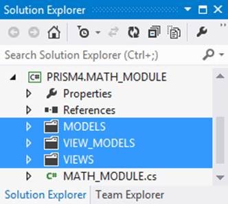

# 第九章棱镜 4 模块

将 Prism 4 模块视为任何 Prism 4 解决方案的主力。模块是 Prism 4 解决方案中完成大部分工作的地方。

什么是棱镜 4 模块？

Prism 4 模块是一个 Visual Studio 项目，其中包含一个实现`IModule`接口的类。更一般地说，模块是一个功能性的程序块，可以包含用户界面、业务规则、数据以及用户界面和业务实体之间的功能性协调。

Prism 4 模块被设计成原子的，这意味着模块应该是独立的实体，很少或不依赖于其他模块。这有助于加强松散耦合和关注点分离。

`IModule`界面由一个名为`Initialize`的单一方法组成。`Initialize`方法用于在首次加载模块时配置模块的类。

清单 33:数学模块模块类

```cs
        [Module(
            ModuleName = "MATH_MODULE",
            OnDemand = false)]
            public class MATH_MODULE : IModule
            {

                private IRegionManager RegionManager { get; set; }
                private AddTwoView AddTwoView;              
                private SubtractView SubtractView;       

                //Constructor:
                public MATH_MODULE(
                    IRegionManager RegionManager,
                    AddTwoView AddTwoView,           
                    SubtractView SubtractView)
                {
                    if (RegionManager != null)
                    {
                        this.RegionManager = RegionManager;
                    }

                    if (AddTwoView != null)
                    {               
                        this.AddTwoView = AddTwoView;               
                    }

                    if (SubtractView != null)
                    {
                        this.SubtractView = SubtractView;
                    }          
                }

                //Add the Module Views to the Regions here:
                public void Initialize()
                {
                    ///Add the user controls to the region here:
                    IRegion MathRegion = RegionManager.Regions["MathRegion"];

                    MathRegion.Add(this.AddTwoView, "AddTwoView");                       
                    MathRegion.Add(SubtractView, "SubtractView");                 
                }

            }

```

模块类数据标注

清单 33 中类定义之前的数据注释可以用来设置类的属性。在这种情况下，添加类名并将`OnDemand`属性设置为`false`。

`OnDemand`属性确定模块是在解决方案启动时加载，还是应该在以后通过程序交互加载。

|  | 注意:`OnDemand`属性不适用于此解决方案，因为我们使用配置文件来加载模块。如果您使用目录扫描方法来加载模块，它可以工作。因为在我的大多数 Prism 4 解决方案中，我使用目录扫描来加载模块，所以我将代码留在了中，以显示如何在启动时或在使用这种模块加载方法时按需加载模块。这个数据注释可以被删除或保留，不会对代码产生负面影响。配置文件使用`startupLoaded`属性来确定模块何时加载。我们将在第 13 章中查看配置文件。 |

在模块中使用构造函数注入来实例化对象

清单 33 中的`Math`模块类有三个类级成员:`RegionManager`、`AddTwoView`和`SubtractView`。这些成员通过向类构造函数传递三个参数来实例化:`RegionManager`、`AddTwoView`和`SubtractView`。保护子句用于构造函数中传递的每个参数，如果对象不为空，则每个对象都被分配给其关联的本地类成员。

创建数学区域

你会记得我们在两个*主*项目的外壳中创建了一个`MathRegion`。在清单 33 `Initialize`方法中，`IRegion`接口用于实例化一个名为`MathRegion`的区域对象。该区域用作视图的注入机制。

将视图注入区域

当我们之前谈到 Prism 4 区域时，我们没有讨论如何将视图注入区域的问题。有两种方法可以用来注入视图:视图发现和视图注入。

查看发现

视图发现用于在解决方案启动时自动加载视图。视图用区域管理器的`RegisterViewWithRegion`方法注册。该方法采用两个参数:对应于区域的*名称*的字符串，以及将加载到区域中的视图的*类型*。

视图发现用于加载后无需更改视图的情况。

|  | 注意:技术上，视图发现可以用于加载两个外壳形式的徽标视图。加载后，这两个视图都不会改变。我倾向于对我的所有视图使用视图注入。如果随着解决方案的变化有必要更改视图，这将使事情变得更容易。看看事件聚合和基于视图的导航解决方案，看看解决方案中的视图发现示例。 |

清单 34:棱镜 4 视图发现的一个例子

```cs
        regionManager.RegisterViewWithRegion("MathRegion", typeof(AddTwoView));

```

查看注射

视图注入通过程序控制或用户交互，以编程方式自动向区域添加视图。使用视图注入增加了创建和注入视图时可用的控制量。这种视图创建方法在*虚拟计算器*解决方案中使用。

注入数学模块视图

这两个视图`AddTwoView`和`SubtractView`被添加到清单 35 的`Initialize`方法的数学区域中。

清单 35:棱镜 4 视图注入

```cs
            Public void Initialize()
            {
                ...
                MathRegion.Add(this.AddTwoView, "AddTwoView");                       
                MathRegion.Add(SubtractView, "SubtractView");                 
            }

```

这段代码创建对象，并在区域中激活它。

请注意，所需要的只是将两个视图添加到正确的区域。因为区域适配器类使用区域返回类型，所以区域适配器负责将两个选项卡正确添加到 Syncfusion 选项卡控件中。我们没有任何迹象表明视图是选项卡项目。

还要注意，当我们使用视图发现和视图注入时，我们实际上是在使用 Prism 4 导航来加载视图。当我们在第 12 章中看到导航时，我们将会更详细地讨论这个问题。

装载模块

为了使用 Prism 4 解决方案中的模块，必须加载它们。大多数情况下，模块加载发生在解决方案启动时。有四种方法可用于加载 Prism 4 模块:

1.  用代码
2.  使用配置文件
3.  有 XAML 的档案
4.  使用目录扫描

用代码加载模块

用代码加载模块是用 Prism 4 加载模块的最快和最简单的解决方案。`ModuleCatalog`的`AddModule`方法用于将模块添加到模块目录集合中。

这种加载模块的方法最简单，但也有缺点。因为有必要在*主*项目中引用解决方案的每个模块，所以这种类型的加载会在解决方案中引入紧密耦合。这当然首先违背了使用模块的目的。由于这种紧密耦合，我建议使用其他三种加载策略之一。

清单 36:用代码加载 Prism 4 模块

```cs
            protected override void ConfigureModuleCatalog()
            {
                Type MathModule = typeof(MATH_MODULE);  
                ModuleCatalog.AddModule
               (
                   new ModuleInfo()
                   {
                       ModuleName = MathModule.Name,
                       ModuleType = MathModule.AssemblyQualifiedName,
                   }
               );    
            }

```

用配置文件加载模块

使用配置文件有许多优点和缺点。首先，配置文件允许后期绑定。这意味着，如果需要对模块加载策略进行更改，无需重新编译解决方案就可以引入这些更改。此外，所有的装载策略都在一个已知的位置，使得它们很容易找到。

清单 37 显示了引导程序的`CreateModuleCatalog`方法的一个例子。

清单 37:用配置文件加载 Prism 4 模块

```cs
        protected override IModuleCatalog CreateModuleCatalog()
        {
           ConfigurationModuleCatalog configurationCatalog = new ConfigurationModuleCatalog();
           return configurationCatalog;
        }

```

向配置文件添加加载策略的主要缺点是，使用复杂的策略时，确保标记正确会变得很困难。随着模块数量的增加，确保标记保持有效也变得越来越困难。

*虚拟计算器*解决方案使用这种加载策略。我们将在第 13 章详细介绍 app.config 文件标记。

用 XAML 文件加载模块

XAML 文件与使用配置文件有许多相同的优点和缺点。要点是，如果在解决方案中使用大量模块，标记可能变得难以验证和维护。

清单 38 显示了在 XAML 文件中加载模块所需的标记示例。XAML 文件可以添加到主项目的配置文件所在的位置，也可以从该位置访问。

清单 38:用 XAML 文件加载棱镜 4 模块

```cs
        <Modularity:ModuleInfo Ref="PRISM4.MATH_MODULE.xap" ModuleName="MathModule" ModuleType="PRISM4.MATH_MODULE, MATH_MODULE, Version=1.0.0.0, Culture=neutral, PublicKeyToken=null" />

```

用目录扫描加载棱镜 4 模块

目录扫描是我加载 Prism 4 模块的首选方法。一旦为这种模块加载设置了解决方案，使用系统就相当简单了。这也是一个非常解耦的加载模块的策略。

我不会在这一章详细讨论加载策略，但会在第 13 章讨论用配置文件加载模块。

清单 39:用目录扫描加载棱镜 4 模块

```cs
        protected override IModuleCatalog CreateModuleCatalog()
        {
            return new DirectoryModuleCatalog() {ModulePath = @".\Modules"};
        }

```

The @。清单 39 中的“模块”模块路径定义了编译模块项目时模块 DLL 文件所在的目录。在这种情况下，模块 DLL 文件应该位于主项目的 bin 目录中名为*模块*的目录中。

|  | 注意:我还使用了一种方法，在每次构建解决方案时，自动将更新的 DLL 文件移动到这个目录中。我不会在这里详细讨论，因为这种类型的模块加载在演示解决方案中没有使用。 |

模块依赖关系

Prism 4 模块依赖可能不是你想的那样。当我们想到模块之间的依赖关系时，我们会想到设置引用。当我们谈到 Prism 4 模块依赖时，我们谈论的是模块的加载顺序。

如果模块`A`依赖于模块`C`，那么模块`C`必须在模块`A`之前加载。Prism 4 公开了允许模块依赖配置的机制。

清单 39:设置棱镜 4 模块依赖关系

```cs
        [Module(
        ModuleName = "MATH_MODULE",
        OnDemand = false),
        ModuleDependency("PRISM4.COMPANY_LOGO_MODULE")]
        public class MATH_MODULE : IModule
        {
        ...

```

该代码将在`MATH_MODULE`模块之前加载`COMPANY_LOGO_MODULE`模块。

MVVM 如何与棱镜 4 模块项目整合

棱镜 4 模块是我们解决方案中大多数 MVVM 设计模式的所在。我在我的模块中使用标准的文件夹结构。



图 11:数学模块 MVVM 文件夹布局

摘要

在本章中，我们了解到 Prism 4 模块是 Visual Studio 项目，包含实现`IModule`接口的单个类。我们了解到这个接口只有一个方法，`Initialize`。我们看到了如何使用该方法向区域添加视图。

我们还研究了加载 Prism 4 模块的不同方法，并讨论了如何解决模块之间的依赖关系。

在下一章中，我们将了解 Prism 4 解决方案中的通信。